# DB2 with BLU Acceleration: So Much More than Just a Column Store（中文译文）

## 译者说明

本文依据同目录的 `source.pdf` 翻译。章节、图表、公式、算法、代码与参考文献按原文结构保留。

Vijayshankar Raman, Gopi Attaluri, Ronald Barber, Naresh Chainani, David Kalmuk, Vincent KulandaiSamy, Jens Leenstra, Sam Lightstone, Shaorong Liu, Guy M. Lohman, Tim Malkemus, Rene Mueller, Ippokratis Pandis, Berni Schiefer, David Sharpe, Richard Sidle, Adam Storm, Liping Zhang

IBM Research；IBM Software Group；IBM Systems & Technology Group

## 摘要

DB2 with BLU Acceleration 深度集成了定义和处理 column-organized table 的多项新技术。与传统 row-organized table 相比，它可把以读为主的商业智能（BI）查询加速 10-50 倍、压缩率改善 3-10 倍，而且不需要复杂地定义索引或物化视图。但 DB2 BLU 远不只是一种列存。它利用 IBM Research - Almaden 的 Blink 项目所研究的基于频率的字典压缩和内存查询处理技术，让大多数 SQL 操作 - 谓词应用（包括范围谓词和 IN-list）、join、grouping - 直接作用于压缩值。压缩值按位紧密排列，一个寄存器中可以容纳多个值，从而用 SIMD 指令同时处理。

DB2 BLU 从一开始就面向现代多核处理器设计。其硬件感知算法用几乎不需 latch 的新数据结构最大化并行度，并减少 data-cache 和 instruction-cache miss。虽然针对内存处理优化，数据库大小并不受主存容量限制。细粒度 synopsis、late materialization 和面向扫描的新概率式 buffer-pool 协议减少磁盘 I/O，激进预取则降低 I/O stall。与 DB2 的完整集成，使 BLU 既拥有成熟产品的完整功能和稳健工具，也能在不改 SQL 的情况下获得数量级性能提升；row-organized 与 column-organized table 可存在于同一 tablespace，甚至同一查询中。

## 1. 引言

企业积累大型事务数据仓库后，希望发现趋势与异常，以形成可执行且能盈利的业务洞察。这类 BI 系统以读为主，通常从多个事务系统批量插入清洗、标准化后的行，只有旧数据在线保留已不划算时才删除。数据仓库增长时，BI 查询响应时间差异也增大：若 DBA 预见准确查询并为传统 DBMS 创建合适索引和 materialized view（或 materialized query table, MQT），查询可能数秒完成；缺少这一“性能层”则可能耗时数小时甚至数天。然而 BI 查询天然是即席的，后一个问题取决于前一查询结果，几乎不可能为所有查询预先准备索引和 MQT，也就难以真正交互式查询。

## 2. 概览

本文介绍 DB2 for Linux, UNIX, and Windows（LUW）10.5 [13] 中面向 BI 的 BLU Acceleration。下文简称 DB2 BLU。对 column-organized table 的以读为主 BI 查询，它相对传统 row-organized table 可提速 10-50 倍、压缩改善 3-10 倍，无需索引、物化视图或其他调优。关键在于顺序保持、基于频率的字典压缩，使谓词、join、grouping 等直接处理压缩值；按位压紧后可用 SIMD 同时处理寄存器中的多个值。

BLU 包含 2006 年起源于 IBM Research - Almaden 的第二代 Blink 技术 [12, 18]。第一代 Blink [4, 5, 18] 是针对现代多核硬件高度调优、严格受限于主存的 DBMS，已进入两款 IBM 内存数据库加速产品：2010 年 11 月发布的 DB2 for z/OS IBM Smart Analytics Optimizer，以及 2011 年 3 月发布的 Informix Warehouse Accelerator。

第二代继承内存效率，但不要求数据库装入内存。其算法同样通过低 latch 数据结构提高并行度、降低缓存 miss；join 和 group-by 直接处理编码数据，并借助新列式布局减少分区等任务的数据移动。表在磁盘，intermediate result 可 spill。自动细粒度 synopsis、late materialization、新的概率式 scan buffer-pool 协议与预取共同减少 I/O。第一代 Blink 使用 PAX [2]；DB2 BLU 默认是每列分开存储的纯列存，但允许把高度相关列放在 column group 中，例如把 nullable 列及其 NULL 指示列组成一组。所有列逻辑行序一致，页内则按压缩格式物理聚类，各列可以不同。

这一代际变化并非简单地把内存引擎的数据放到磁盘。DB2 BLU 保留了第一代针对 cache、register 和多核并行的执行方式，同时加入页级 synopsis、预取、buffer-pool 协议以及可 spill 的中间结构，使工作集超过 RAM 时性能平滑退化。列之间仍用统一的逻辑行序关联，但每列页内可以按自身压缩格式重新聚类；执行器因此既能按 TSN 重新拼合行，又能在一个 region 中连续处理同宽 code。

DB2 BLU 完整支持 UPDATE、INSERT、DELETE；遇到初始列字典没有的新值时，自适应添加页级字典。两款第一代 Blink 产品只是 row store 基础数据的内存加速副本；DB2 BLU 的 column-organized table 保存唯一数据实例，不必同步副本。第二代由 DB2 Development、IBM Systems Optimization Competency Center 和 IBM Almaden 共同增强并深度集成到 DB2 LUW。它继承查询重写、优化、预取、buffer pool 以及 Load、自动 Workload Management、Backup、Recovery 等成熟功能，并允许两类表共存、同查，另有工具帮助迁移。

后文第 3 节介绍布局与压缩；第 4 节概览执行基础；第 5、6、7 节分别讨论 scan、join、grouping；第 8 节讨论修改；第 9 节是 workload management；第 10 节给出性能和压缩结果；第 11 节相关工作；第 12 节总结。

## 3. 数据布局与压缩

DB2 BLU 的高压缩 column-major 数据仍放在传统 DB2 storage space 并缓存在 DB2 buffer pool，所以行表和列表能够共存、共享资源。压缩方案在空间效率与查询性能之间平衡：既允许直接在压缩数据上求值，也利用取值分布倾斜和数据的局部聚类获得高压缩率。

### 3.1 频率压缩

DB2 BLU 采用列级字典压缩，允许一列使用少数几种 code size，以利用分布倾斜。最频繁值分配最短 code，较少见值分配较长 code。它类似 [18] 的 Frequency Partitioning，但适配了 column-major 存储。

**示例 1。** 假设世界经济活动表的 `CountryCode` 是 16 位整数，其字典可分为：

1. 最常出现的两个国家：code size 为 1 bit。
2. 接下来最常见的 8 个国家：code size 为 3 bit。
3. 其余样本国家采用 offset coding：code size 为 8 bit。

三部分近似压缩比分别为 16x、5.25x（细节见第 3.3 节）和 2x。

系统分析表数据样本，为每列决定压缩方案。样本来自第一次 bulk load 的数据；若表由 SQL INSERT 填充，则取表达到给定大小阈值时的数据。系统从样本收集各列直方图，由 compression optimizer 按频率划分列值以最大化压缩，并为每个分区建立字典。

压缩优化器并不只决定“是否字典压缩”，而是同时决定列被切成多少个频率分区、每个分区的表示以及 code 宽度。高频值用极短字典索引，具有公共前缀的值可以只存 suffix，数值相近的值可以对 base 存 offset。由于分区和分区内 entry 都按既定顺序组织，最短表示的选择不会破坏值序关系，范围比较无需先还原原始值。

字典分区中的 entry 可以是：（1）完整数据值；（2）数据值的公共 bit prefix；（3）offset coding 的 base value，值的 code 是值减 base。对（1），code size 是字典索引位数；对（2）（3），则还包括 suffix 位或 offset 位。同一分区内 entry 按值排序，所以编码完全保持顺序，任意范围谓词可直接在压缩数据上求值。列的字典分区按 code size 递增排序；编码优先选择能表示该值的第一个分区，即最短 code。

### 3.2 Column Group 存储

DB2 BLU 表的列划分为 column group，每列恰属一组；存储层允许一组任意列数。nullability 内部放在独立 NULL indicator 列，所以 nullable 列至少形成包含数据列与指示列的两列组。

column group 数据放在定长页。extent 是连续存储单元，含该表固定页数，也是分配单位；每个 extent 只保存一个 column group。行/tuple 在 column group 上的投影称为 Tuplet（小 tuple），nullable 列组的 tuplet 至少有两列值。所有 column group 的 tuple 顺序相同。

Tuple Sequence Number（TSN）是虚拟整数标识，可在各 column group 中定位同一 tuple。页只包含一个连续 TSN 范围，在页头记录 `(StartTSN, TupletCount)`。Page Map 为每页记录所属 column group 与 StartTSN，以 B+tree 实现，查询时用于寻找某组中覆盖目标 TSN 范围的页。

### 3.3 页格式：Region、Bank 与 Tuple Map

一个 column group 各列字典分区的笛卡尔积，决定 tuplet 的所有可能格式（列尺寸组合），称为 Cell。单列组中 cell 就是字典分区。因为 tuple 顺序由装载/插入顺序决定而与压缩编码无关，同组的所有 cell 都可能出现在同一页。页内属于相同 cell/partition 且格式相同的 tuplet 聚在一个 Region，这相当于按所属 cell 划分页内 tuplet。

在 `CountryCode` 示例中，若分区 1、2 的 tuplet 同页，就分别形成 1-bit 和 3-bit region。多 region 页有 Tuple Map，记录每个 tuple 编码后进入哪个 region；其索引是页内 TSN，即 `TSN - StartTSN`，entry 是 region index。两个 region 时每项 1 bit。查询结果还必须恢复 TSN 顺序，第 5 节说明这一挑战。

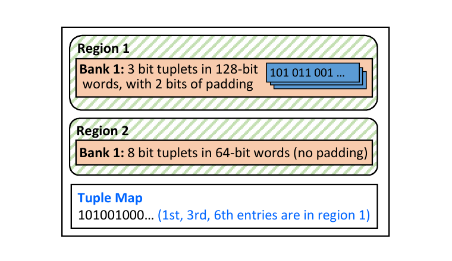

**图 1：含两个 Region 的 CountryCode 页。**

Region 再划分为 Bank，即页中存 tuplet 值的连续区域。tuplet 的各列可以分开存入 bank，例如 nullable 列及其 NULL indicator。多数 bank 存定长 tuplet。压缩 tuplet 被紧密装入 128/256-bit word，但加入 padding，避免跨 word boundary；该 word size 称为 bank width。`CountryCode` 分区 2 的 3-bit code 放入 128-bit bank，每 word 有 42 个值，余 2 bit 作 padding（图 1）。

padding 看似牺牲少量压缩率，却让每个 tuplet 完整落在一个机器 word 中。执行器可用固定 mask、shift 或 SIMD 模板批量处理，不必为跨 boundary 的值组合两个寄存器。Tuple Map 则只记录 TSN 到 region 的归属，不复制值；因此一个页可以同时拥有多个 code width，而同一 bank 内仍保持规则、可向量化的布局。

压缩方案未覆盖的值可以不压缩。定长未编码值同样放在 region bank，宽度由数据类型决定。VARCHAR 等变长未编码值依次放在 region 之外的独立 variable-width data bank；每个变长列在普通 region bank 中另有 `(offset, length)` descriptor。把同格式 tuplet 聚为 region，形成长串统一格式，对查询性能至关重要。

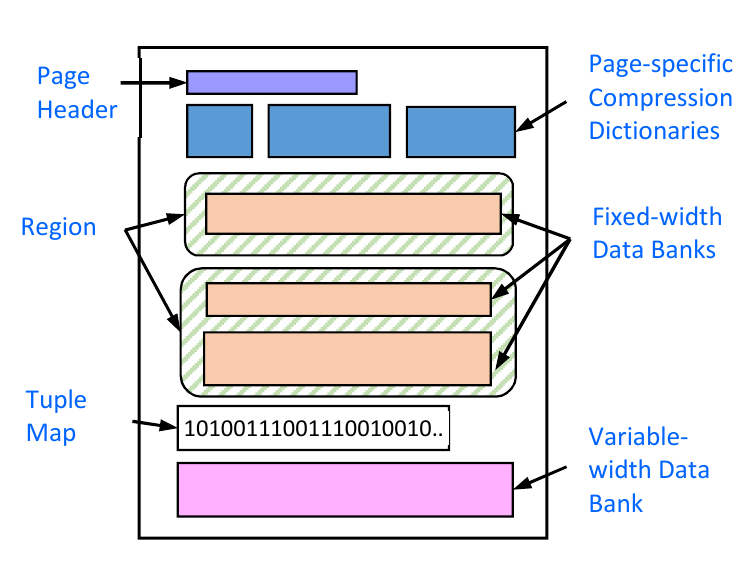

**图 2：DB2 BLU 页格式。**

### 3.4 页压缩

页级压缩进一步利用表内局部聚类，也压缩列级方案未覆盖的值。例如 `CountryCode` 分区 2 在某页只出现 3 个国家，可将该 region 的 code 从 3 bit 降到 2 bit。所有页都尝试页压缩；有收益时在页中保存 mini-dictionary。页级字典特化包括：

1. 字典仅保留该页实际出现的 entry。页中小字典保存列级 code 到页级 code 的映射，不重复保存数据值，因此仍受益于列级压缩。
2. 按页内值范围减少 offset coding 所需 bit 数。

图 2 中先是小页头，再是可选页级压缩字典，然后是若干含定长 bank 的 region、TupleMap，最后是变长 data bank。

### 3.5 Synopsis Table

每个 column-organized DB2 BLU 表都会自动创建并维护内部 synopsis table。给定自然聚类列上的谓词，synopsis 允许跳页并缩短用户表扫描。除各列值摘要外，它包含 `(MinTSN, MaxTSN)`，指明 synopsis 每行代表的 BLU 表行范围。synopsis 使用普通 DB2 BLU 表的格式，并继承用户表压缩方案。

### 3.6 Global Coding

压缩字典除分区内编码外，还提供与分区无关的 global code。列的 global code 空间大小是所有字典分区 code count 之和。分区内 code `C` 的 global code `G`，等于 `C` 加上该分区之前所有分区的 code count。压缩数据上的 join 与 group-by 使用 global code。

## 4. 查询执行

### 4.1 查询处理概览

SQL 经普通 DB2 query compilation 和生成 operator plan tree 的优化，因此 BLU 完整受益于 DB2 的 cost-based optimizer 与 query rewrite engine。优化器找出计划中引用 column-organized table 且可用列式处理的部分，为每部分生成由 evaluator chain 组成的特殊执行计划。evaluator 是执行装载列值、算术、join 等动作的 BLU operator。运行时把多表查询分解为一系列 single-table query（STQ），大体每个 STQ 一条 chain。

生成 chain 时还会：（1）把 join query 重组为 STQ 列表；（2）按求值成本重排谓词、在语义不变时折叠谓词，并在昂贵谓词前增加便宜但可能冗余的粗筛，例如 IN-list 前的 min-max；（3）从原表谓词构造 synopsis 列谓词，由数量级更小且常驻内存的 synopsis 减少 data-page access；（4）把 scalar subquery 与 common subexpression 重组为单独查询，再把结果送给消费查询，并改写成可执行形式。

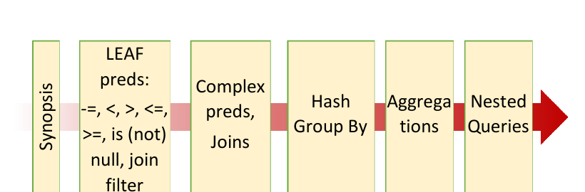

**图 3：典型操作序列。许多操作直接处理压缩数据，从而提高缓存利用率及内存到 CPU 的有效带宽。**

一个 scheduler 启动若干线程执行 STQ，每线程运行同样的 evaluator chain。STQ 通常从扫描计划树的“leaf”列并应用谓词开始，按需取其他列，把结果管道送入建立 hash table 的 evaluator。join 外侧（fact table）的后续 STQ probe 该表及通常所有 dimension，幸存行送入另一个 hash table 完成 grouping/aggregation；没有 join/group 时可短路，更复杂查询则可嵌套。

这种 STQ 分解把一个多表 SQL 转为若干单表扫描和中间结构消费阶段。每阶段仍由 DB2 优化器决定先后和成本，但运行时由 BLU evaluator chain 直接串起 synopsis、LEAF、LCOL、join filter、hash build/probe 与 aggregate。行集在 chain 中保持压紧，已经被前一谓词淘汰的 tuple 不会让后续列装载、join 或聚合承担无谓成本。

evaluator 不逐值逐行，而以称为 stride 的行集为单位。这样可摊销函数调用、避免 cache-line miss、便于 loop unrolling，并为线程 work stealing 提供负载均衡单位。stride 常有数千行，精确大小使 working set 适配 processor cache，取决于查询、机器与资源。

例如：

```sql
SELECT name, zip
FROM employees
WHERE state = 'CA';
```

执行链如图 4：（1）SCAN-PREP 把 `employees` 分成 stride，应用 synopsis 谓词跳过 TSN 范围，并把各 stride 送入 chain；（2）LEAF 访问 `state` 列对应页，必要时从磁盘取回并应用局部谓词；（3）两个 LCOL 仅为通过谓词的行读取 `name`、`zip`。实际还需处理 update 引入的行、隔离级别、以预取隐藏 I/O、用内存 synopsis 跳页等。

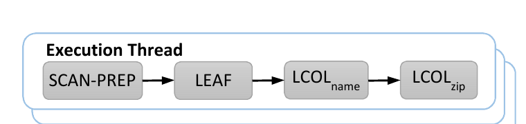

**图 4：每个线程处理 SCAN-PREP 引入的 stride 的 evaluator chain。**

### 4.2 列式处理基础设施

**TSNList。** TSN 是 BLU 拼合同行各列值的逻辑 row identifier，不随每个列 entry 保存，仅维护在 Page Map。处理 TSN stride 时用 TSNList 跟踪集合：一个 64-bit unsigned StartTSN 加与 stride 等长的 bitmap，1 表示有效 TSN，0 表示已被谓词淘汰。bitmap 可快速以 population count 找下一个 1，提高 cache efficiency，并避免重排列而移动内存。

**Vector。** 列值或结果集放在 Vector。它使用 C++ template 高效保存所有 SQL 数据类型，并维护 NULL bitmap，避免特殊带外值；另有 sparse array，把影响某行的 warning/error 返回客户端。

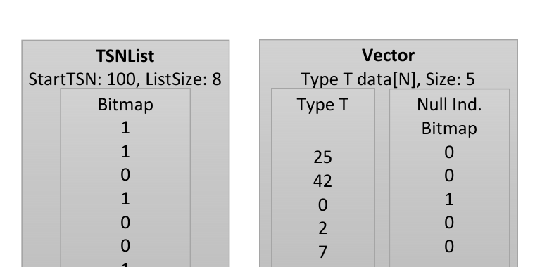

**图 5：8 行（TSN 100-107）的 TSNList 中，102、104、105 被谓词过滤；Vector 大小 5，等于有效 TSN 数。**

**WorkUnit。** 特定 TSN 与值之间的关联保存在 WorkUnit，即一组值或 code 的 Vector 加一个 TSNList；这是 evaluator chain 中传递的最小工作包。

**Compaction。** WorkUnit 中的 Vector 自压紧。谓词淘汰 tuple 并把 TSNList 位置零；在此前生成的 Vector 仍含无效项。取 Vector 时若当前 filter state 与生成时不同，便移除无效 tuple 值，只保留紧密排列的有效行。

这种惰性 compaction 避免每应用一个谓词就搬动所有已装载列。TSNList bitmap 是统一的选择状态，Vector 记住自己生成时对应的 filter state；只有消费者真正取用且状态已经变化，才完成一次紧凑复制。于是 predicate ordering 的收益不只来自比较本身更便宜，也来自让昂贵列尽可能晚装载、让后续 Vector 更短。

**Evaluator Framework。** TSNList 与 WorkUnit 都对应 stride。装载列的 evaluator 输入 TSN 列表、输出选定 TSN 的 Vector；加法 evaluator 输入两个 numeric Vector、输出第三个。多线程通过为每线程 clone chain 实现，线程数依据 cardinality estimate、系统资源/负载决定。每线程先请求唯一 TSN stride，处理后继续请求，直到耗尽。

## 5. 扫描与谓词求值

列由两种 access method 访问：

- **LeafPredicateEvaluator（LEAF）：** 对 column group 中一列或多列应用谓词，例如 `(COL3 < 5 AND COL3 > 2)` 或 `COL2 = 4`。每次接受通常对应输入 stride 的 TSNList，对其整个 TSN 范围求值（不只有效位），nullability 在谓词求值内处理。
- **LoadColumnEvaluator（LCOL）：** 扫描单列及其 nullability，以编码或未编码形式返回。输入 TSNList 指出范围和需要装载的位置，输出所需值或 code 的 Vector。

### 5.1 Leaf 谓词

LEAF 在每页各 region 内分别应用，只把谓词输出跨 region 交织。也可先 LCOL 装载列再用 comparison evaluator，约对应 System R [19] 中 SARGable 与 non-SARGable；应尽可能用 LEAF，因为它直接处理紧密压缩的 bank。

回到示例 1，系统分别对页中存在的 1-bit 字典、3-bit 字典、8-bit offset region 应用谓词。每个 region 返回通过谓词的 tuple bitmap 和 nullability bitmap；由于 SQL 对 NULL 使用三值逻辑，二者不能折叠 [20]。随后用 TupleMap 交织为 TSN 顺序（图 6）。

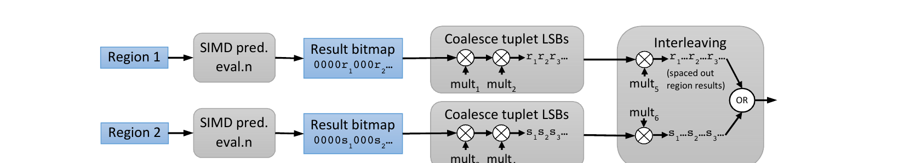

**图 6：双 Region 页的 Leaf 求值。`mult_i` 是预计算乘数，`r_j`、`s_k` 是结果位。**

#### 5.1.1 在每个 Region 中应用谓词

对 `Column <op> Literal`，很多 operator 可 SIMD 化：`<`、`>`、`=`、`<>`、`<=`、`>=`、BETWEEN、小 IN-list、NOT IN-list、IS (NOT) NULL。未编码 region 是普通 SIMD；编码 region 使用 [14] 的方法，以一个 bank 产生同格式结果，每个 tuplet 的最低有效位（LSB）表示谓词是否成立。

随后用乘法把这些 LSB “coalesce”为输出 bit vector。例如从 11-bit tuplet 中把：

```text
xxxxxxxxxx1xxxxxxxxxx0xxxxxxxxxx1
```

聚为 `101...`，乘以 `2^10 + 2^20 + 2^30`，分别把第 1、2、3 个 LSB 左移 10、20、30 位。POWER7 上使用专用 bit-permutation 指令；对 128-bit bank，`Literal1 <= Column <= Literal2` 不论 bank 容纳多少 tuplet，约 12 条指令即可求值。

较长 IN-list、Bloom filter、LIKE 也常作为 LEAF，但通常不以 SIMD 处理，而是在预计算 hash table 中查询每个编码值。系统通常先在字典值上应用复杂谓词，把合格 code 放入 hash table。column group 内跨列谓词和复杂单列谓词（如 `Column > 5 OR Column IN list`）也可作为 LEAF。

#### 5.1.2 跨 Region 交织结果

假设两个 region 的结果分别是 `01001001001` 与 `10101110111`，TSN 在两者交替，即 TupleMap 为 `01010101010`，期望结果为交织后的 `0110010011010110010111`。逐 TSN 实现会每项产生一次 branch。

高效方案是各 region 结果分别乘两个预计算乘数，再 bitwise OR。若 TupleMap 为 `10101010...`，首 region 结果 `b1b2b3b4`，第一次乘法把它变成带间隔的 `b1.......b2......b3.....b4....`，乘数是各 `b_i` 所需左移量之和；第二次乘法得到 `b1 0 b2 0 b3 0 b4 0`。nullability 同样交织。

### 5.2 Load Column

LCOL 装载列值或 global code；后者用于 join key 与 group-by 列，因为二者处理编码值；前者用于复杂表达式（如 `COL2 + 5`）、aggregation 等。LCOL 输出总是 compact，只含通过此前谓词的有效 TSN。它也逐 region 装载，再交织结果（图 7）。

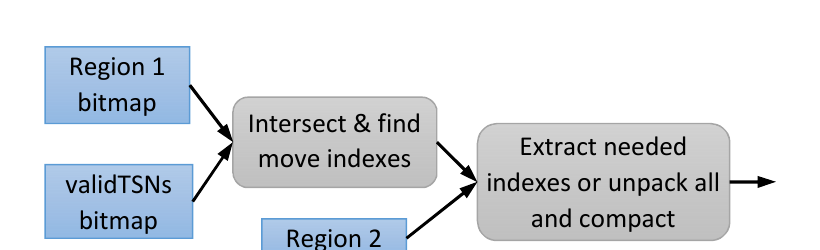

**图 7：逐 Region 的 Load Column 求值。**

#### 5.2.1 Region 内装载

LCOL 从 packed bank 的目标 offset 提取 code，必要时解码。只装载少量 bank 项时直接 mask/shift；tuplet index 到 bit position 原需除以每 bank tuplet 数，系统预计算 modular inverse 并改用乘法。装载大部分 bank 时，用模板化逻辑把整个 bank unpack 到 word-aligned array，再抽取目标 code。

#### 5.2.2 跨 Region 交织

LCOL 交织的是较大值，比 LEAF 更难，因此与 compaction 合并。使用 `RegionBits`（TSN 顺序中属于该 region 的 bitmap）和 `ValidBits`（通过所有已有谓词、需要装载的 bitmap）。由 TupleMap 得到每个 region 的 TSN bitmap，再与有效位一起把每个 region 的 code/value 直接移动到输出 Vector。

例如 TupleMap=`01010101010`、ValidBits=`00100100111`，需装载页内第 3、6、7、8、9 个 tuple。与第二个 region 的交集表明，要把 region 结果第 3 项移到输出第 2 位、第 5 项移到输出第 4 位。系统反复用 `n XOR (n - 1)` 访问交集中最右 1 及其右侧全部位，再用 population count，高效计算 move index。

## 6. Join

DB2 BLU 支持 inner、left/right/full outer、每个 outer row 返回首个 match 的 early join，以及使用 not-equals 的 inner/left/right anti-join。join 不要求 N:1，也不假定 join 列声明 referential integrity 或 key constraint。表无需装入内存，超过 heap 时 spill。

系统采用 cache/multicore 优化的 hash join：有大内存时利用它，不足时平滑 spill。partitioning 用于 latch-free 并行、提高 cache locality 与 spill。不同于传统 row store，它只分区 join column，显著减少数据移动，但必须更精细地跟踪各 key 对应 payload。

### 6.1 Build 阶段

优化器按 cost model 指定 hash join build（inner）与 probe（outer）侧，通常偏向较小表和可知/推断的 N:1 join。build 阶段先扫描、分区 inner 的 join key 与 join payload；inner 可是 base table 或 intermediate result。每线程扫描并分区独立行子集，之后每线程接管一个 partition，建立 key 到 payload 的 hash table。inner scan 唯一跨线程同步点在 partition 与 build 之间。扫描同样使用 late materialization 和 compaction；partition 数量使每个 partition 尽量适合某级 memory hierarchy。

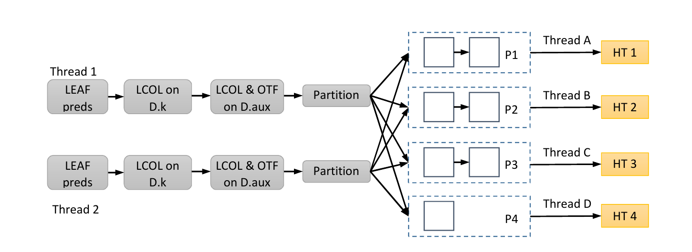

**图 8：四分区 Join 的 Build Evaluator 序列。**

join key 和 payload 均以编码形式处理，使 hash table 紧凑并进入较低级片上缓存。key 使用 outer（foreign-key 列）的 global code；扫描 inner 时把 inner join 列转换到 outer 编码空间。原因是 inner cardinality 通常更小，而非 inner 编码更合适。同时在这些 foreign-key 值上建立 probe 用 Bloom join filter。payload 尽量用其列字典编码；装载时未编码值则使用动态字典。

BLU 的紧凑 hash table 用 indirection bitmap，在没有空 bucket 的同时几乎消除 collision；如果 key 编码性质允许，还可完全无碰撞。文中“join key”不依赖声明的唯一约束，唯一性在应用 local predicate 后于运行时推断。

### 6.2 Probe 阶段

probe 时先扫描 join 列并通过 build 阶段得到的 join filter。outer 与多个 inner join 时，先依次应用所有 inner filter，边走边 compact，再执行实际 join。进入 join operator 的 foreign key 已经同时受所有 join/local predicate 的组合选择率过滤，因此无需 [1] 的 deferred payload materialization。

幸存 foreign key 随后流水分区，以 probe 对应 inner partition 的 hash table；只分区 join column。一个 stride 的 join 列扫描并分区，各 partition 的 foreign key probe 相应 hash table，结果 payload 最后 departition 回原 TSN 顺序。付出 departition 代价可以避免对 measure 等非 join 列分区和提前 materialize。

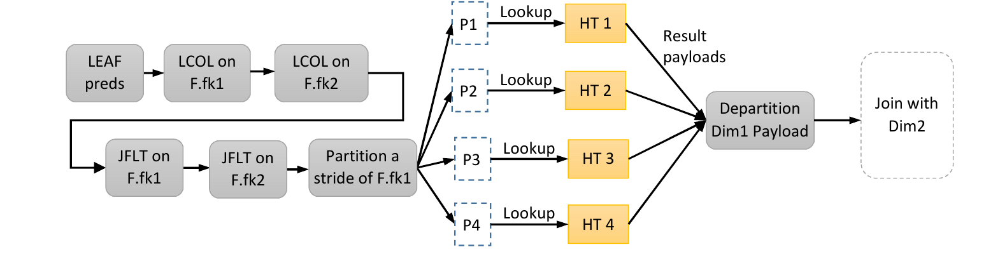

**图 9：Join Probe 的 Evaluator 序列。JFLT 表示 Join Filter；所有维度的 Filter 在任何 Join 前应用。**

### 6.3 Join Filter 与 Semi-join

outer scan 的拼接 foreign-key 列使用层次 join filter，减少进入 join 的行；单个 foreign-key 列还用 min-max filter 利用 local predicate 与 key 的聚类。若 inner 很大、build 昂贵且可能 spill，系统采用 semi-join plan：额外扫描 outer foreign key，判断在应用其他 dimension 谓词后是否可过滤大 inner；若可行，就对合格 foreign key 建 Bloom filter，在构建 inner hash table 前过滤 inner 行。

### 6.4 Spilling

inner 所有 partition 无法装入分配内存时有两种 spill：（1）像 hybrid hash join [9] 一样 spill inner、outer 的部分 partition；（2）cost model 常选择只 spill inner。后者可能需对 outer 每个 stride 把 inner partition 重新从盘读入，但避免提前 materialize outer 非 join 列，也容易适应执行中内存可用量变化。

## 7. Grouping 与 Aggregation

DB2 BLU 使用 partitioned hash grouping/aggregation，支持常规聚合与 DISTINCT。设计面对两项挑战：输出 group 数从不足十个到数亿，必须对 group 数保持稳健；多核多 socket 服务器有分层 memory hierarchy 与 NUMA [3, 16]，必须利用并适应多级内存。少量 group 时，应主要在位于片上 cache 的 thread-local 结构处理；大量 group 时，应以极少同步合并所有线程结果。

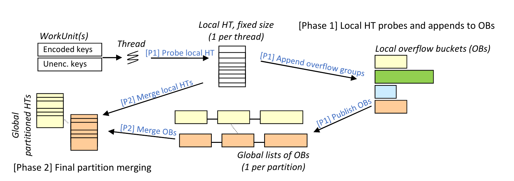

**图 10：DB2 BLU 以 Local 和 Global 两阶段处理 GROUP BY。**

### 7.1 概览

第一阶段每线程在固定大小 local hash table 做本地 grouping，装不下的新 group 缓冲到 overflow bucket；第二阶段每线程领取一个 partition，合并所有 local table 属于该 partition 的 entry 与全部 overflow bucket。

hash table 使用 linear probing。少量输出 group 时，大部分工作是更新可装入片上 cache 的 local table；大量 group 时，时间主要花在合并到 global hash table。两种操作均 thread-local、无需同步，所以对 group 数保持稳定性能并拥有良好 locality。

### 7.2 常规（Local）处理

所有线程独立更新固定大小的 thread-local hash table。大小由 cache、查询线程数及压缩 grouping key/payload 宽度决定。local table 满后，尚不存在的新 group 追加到 overflow bucket；每线程为每个 partition 维护一个 bucket。partition 数取决于线程和可用内存。定长 bucket 满后，线程把它 publish 到该 partition 的 global linked list。

为提高 local table 命中并减少 overflow，每线程维护统计，可清出低频 group，或周期性清空 table，使新且可能更频繁的 group 进入。第一阶段结束时发布未满 bucket 与 local table，全程无需同步。

### 7.3 合并到 Global Hash Table

第二阶段，线程原子递增 counter 以保留一个待合并 partition，再合并所有 local table 中属于它的 entry 与全部 overflow bucket，直至无 partition。所有 group 进入 global partitioned hash table；它分配在合并线程本地 socket，不像 local table 那样定长。每个 local table 附有 packed partition-id array，帮助找出目标 entry。第二阶段同样 latch-free。

第一阶段触碰每个 grouping key 时顺便收集第二阶段所需统计，如各 partition 的 distinct group 估计，以分配合适大小的 global table。若空间变低且仍有 bucket，系统新建更大的 table 并迁移旧内容；因该操作昂贵，应尽可能准确估计最终大小。

### 7.4 Early Merge 与 Spilling

本地阶段内存不足（例如产生很多 overflow bucket）时，部分线程停止常规处理并选择 partition early merge。线程标记该 partition，处理当前已发布 bucket，从而释放空间。若仍装不下，就把已发布 bucket chain spill 到磁盘，并降低该 partition 以后被 early merge 的优先级，因为需要额外 I/O 读回。这样即便宽 key/payload、数亿输出 group 也能稳健处理。

## 8. INSERT、DELETE 与 UPDATE

除高性能 bulk load 外，DB2 BLU 完整支持 SQL INSERT/DELETE/UPDATE 和多线程连续 INGEST。它是多版本数据存储：delete 是保留旧版本行的逻辑操作，update 创建新版本。多版本以极少 row lock 支持标准隔离级别；高度压缩存储也不适合 in-place update。column-organized table 的全部修改采用 WAL，并复用 DB2 稳健恢复设施。

### 8.1 Insert：缓冲与并行

列存每插入一行都要修改每列页，主要成本是 buffer pool 中逐列页 latch 和逐页修改日志。DB2 BLU 针对一次约 1000 行的大 insert transaction 优化，这也是目标数据仓库常态。

系统缓冲 insert 以跨多行摊销成本：每个 column group 最后一个未满页的镜像保存在 buffer pool 外的内存。事务 insert 写这些 buffer，直到页满或事务提交才 flush，把新 entry 记录日志并复制回 buffer-pool page。物理日志在大事务中包含许多值，从而摊销小事务下可能主导日志空间的 per-page record header。insert buffer 格式与 BLU 页相同，查询可直接访问，使事务能读自己的未提交修改。

TSN 空间划为许多不重叠 Insert Range，实现高并行 insert/update。事务第一次 insert 时独占锁定目标表的一个 range，此后无需同步即可消费其 TSN 并写入 range 尾页。

### 8.2 Delete、Update 与空间回收

表有内部 2-bit TupleState 列。LOAD、INSERT、UPDATE 创建行时为 Inserted；delete 仅改成 PendingDelete。TupleState 修改写日志，同事务对一页多次 delete 合并到一条 log record。PendingDelete 稍后惰性清理为 Delete，表示已提交。若 extent 中所有行为 Delete，REORG 可在 extent 级释放页，既可手动，也可自动运行。

update 内部实现为删除合格行再插入新版本。第二个内部列 PrevRowTSN 把新版本按 TSN 链回原始 root version。insert 创建的行通过压缩不占该列，只有 update 才 materialize。新版本插入事务锁定的 Insert Range，所以 update 与 insert 都支持并行。

### 8.3 Lock 与并发

BLU 支持 Uncommitted Read 与 Cursor Stability，reader 不阻塞 writer，反之亦然。INSERT/DELETE/UPDATE 修改的行加 row lock，多版本使查询锁最少。每个 Insert Range 有 high-water mark TSN（HWM），标记此前所有 insert 已提交，查询对 HWM 以下 Inserted 行无需锁；Deleted 行也无需锁；仅含已提交数据的页用标准 CommitLSN 技巧 [17] 避免锁。PrevRowTSN 保证查询只返回每个合格行的一个版本。

## 9. 自动 Workload Management

多条复杂度不一查询同时提交时，BLU 必须划分机器资源。完全在内存执行而不 spill 会快得多，系统并行处理多少查询直接决定能否做到这一点。因此 BLU 用 admission control 限制数据库服务器并发查询数，使把资源分给更少查询时获得更好整体性能。

只读查询按 DB2 optimizer 的 cost estimate 分为 managed 与 unmanaged。低于 cost floor 的轻查询和非只读活动均 unmanaged，不受 admission control，避免小任务排在昂贵大任务后导致响应时间不成比例地恶化。高于阈值的重查询 managed，控制算法依据硬件 CPU parallelism；达到并发数后，新查询排队，直到当前查询完成退出。过程对用户透明，用户只看到 spill 与资源竞争减少带来的收益。

## 10. 结果

性能改善取决于服务器、负载和数据，但相对优化过且索引最佳的 row store，1-2 个数量级加速很常见。表 1 在同一服务器上比较六组客户负载，提速 6.1x-124x，且无需调优。

**表 1：DB2 BLU 相对最佳索引的优化 Row-organized 系统的加速。**

| 工作负载 | DB2 BLU 加速比 |
| --- | ---: |
| Analytic ISV | 37.4x |
| Large European Bank | 21.8x |
| BI Vendor (reporting) | 124x |
| BI Vendor (aggregate) | 6.1x |
| Food manufacturer | 9.2x |
| Investment Bank | 36.9x |

整体性能常被少数极慢 outlier 扭曲，而 BLU 对这些最长查询提速最大。因为列表 access plan 更简单，BLU 的性能通常比传统 BI 至少稳定三倍（波动更小）。它虽为内存优化，却不受主存限制，数据超过 RAM 后性能不会陡降。

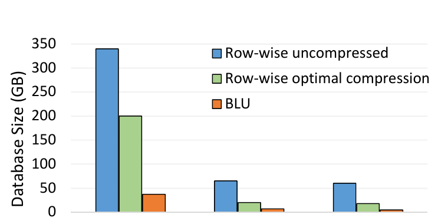

**图 11：DB2 BLU 显著减少分析数据库存储需求，相对传统未压缩 Row-organized 数据通常约为 10x。**

BLU 不使用 secondary index/MQT，且有顺序保持压缩，故大幅减少空间。三个客户数据库在未压缩 row、最佳压缩 row、BLU column 格式下的结果显示，节省依赖数据，但多数客户负载相对未压缩数据平均约 10x。最终系统兼具成熟 DB2 LUW 的完整功能与稳健性、内存/CPU/I/O 优化、更小空间，且几乎无需调优。

## 11. 相关工作

column-organized table 可追溯到 1985 年 [8]；Sybase IQ 自 1994 年存在，DB2 for i5/OS 从 1997 年起可用 EVI [6] 按 column-major 字典编码部分列。索引与 index-only access 更早，但每个索引顺序不同，不适合 BI 多列扫描。MonetDB [7, 23] 和 C-store [21] 原型重新激发列存研究，重点从存储扩展到列式执行，并催生 Vertica 等产品。Vertica projection 类似 row store 索引，保存按 domain 排序的 base data 副本；有利于排序查询，却增加空间、设计复杂度与行重组成本。Actian Vectorwise 源自 MonetDB。

与 BLU 一样，Vectorwise 和 SAP HANA [10] 每列独立保存为 vector，第 N 行在第 N 项，以压缩形式存储。HANA 把编码值压得可跨寄存器，需复杂 shift 分离 [22]；BLU 在 register boundary 加 padding，可直接以 SIMD 同时处理多个值而不移位 [14]。HANA、Vertica 把 INSERT 暂存到 row-organized table；BLU 无 staging table，简化并发查询。Exasol 等主存列存受经济上可放内存的数据量限制；BLU 可把任意规模数据放在磁盘，活跃部分缓存内存。

BLU 完全集成进成熟 DB2，同库可存 row/column table、同查，类似 Teradata column store 与 EMC Greenplum。但后二者只是分列存储，执行时重组成行；BLU 在处理期间保持列分离和压缩，让谓词、join、grouping 处理压缩值。SQL Server 的 scan operator 可直接对压缩数据求谓词，但是否在 join/grouping 上处理压缩值并不明确，也未提 SIMD [15]。

## 12. 结论

关系 DBMS 发明、原型化并产品化数十年后，其基础技术仍在变化。数据库远大于 20 世纪 70 年代，规模化分析和程序交易等数据密集应用带来更大压力；更根本的原因是硬件持续改变。数据密集型系统不断受处理器与 memory hierarchy 演化影响并追赶，而核心思想能延续至今也证明早期设计质量。

DB2 BLU 证明，为适应现代硬件并在性能、压缩上实现革命性改善，不必从零构建数据库。DB2 LUW 二十年前由 Starburst 技术 [11] 建立的可扩展性，可以继续演化并利用成熟产品投资。“通过演进实现革命”让 BLU Acceleration 这类激进新技术无中断、无缝进入客户环境，同时保留完整功能。

## 致谢

DB2 BLU 来自大规模协作。我们特别感谢早期原型贡献者 Dan Behman、Eduard Diner、Chris Drexelius、Jing Fang、Ville Hakulinen、Jana Jonas、Min-Soo Kim、Nela Krawez、Alexander Krotov、Michael Kwok、Tina Lee、Yu Ming Li、Antti-Pekka Liedes、Serge Limoges、Steven Luk、Marko Milek、Lauri Ojantakanen、Hamid Pirahesh、Lin Qiao、Eugene Shekita、Tam Minh Tran、Ioana Ursu、Preethi Vishwanath、Jussi Vuorento、Steven Xue、Huaxin Zhang。

## 参考文献

[1] D. J. Abadi, D. S. Myers, D. J. DeWitt, and S. R. Madden. Materialization strategies in a column-oriented DBMS. In ICDE, 2007.

[2] A. Ailamaki, D. J. DeWitt, M. D. Hill, and M. Skounakis. Weaving relations for cache performance. In VLDB, 2001.

[3] M.-C. Albutiu, A. Kemper, and T. Neumann. Massively parallel sort-merge joins in main memory multi-core database systems. PVLDB, 5(10), 2012.

[4] R. Barber, P. Bendel, M. Czech, O. Draese, F. Ho, N. Hrle, S. Idreos, M.-S. Kim, O. Koeth, J.-G. Lee, T. T. Li, G. M. Lohman, K. Morfonios, R. Mueller, K. Murthy, I. Pandis, L. Qiao, V. Raman, R. Sidle, K. Stolze, and S. Szabo. Blink: Not your father's database! In BIRTE, 2011.

[5] R. Barber, P. Bendel, M. Czech, O. Draese, F. Ho, N. Hrle, S. Idreos, M.-S. Kim, O. Koeth, J.-G. Lee, T. T. Li, G. M. Lohman, K. Morfonios, R. Mueller, K. Murthy, I. Pandis, L. Qiao, V. Raman, R. Sidle, K. Stolze, and S. Szabo. Business analytics in (a) blink. IEEE Data Eng. Bull., 2012.

[6] R. Bestgen and T. McKinley. Taming the business-intelligence monster. IBM Systems Magazine, 2007.

[7] P. A. Boncz, M. L. Kersten, and S. Manegold. Breaking the memory wall in MonetDB. Commun. ACM, 51, 2008.

[8] G. P. Copeland and S. N. Khoshafian. A decomposition storage model. In SIGMOD, 1985.

[9] D. J. DeWitt, R. H. Katz, F. Olken, L. D. Shapiro, M. R. Stonebraker, and D. A. Wood. Implementation techniques for main memory database systems. In SIGMOD, 1984.

[10] F. Färber, N. May, W. Lehner, P. Große, I. Müller, H. Rauhe, and J. Dees. The SAP HANA database - an architecture overview. IEEE Data Eng. Bull., 35(1), 2012.

[11] L. M. Haas, W. Chang, G. M. Lohman, J. McPherson, P. F. Wilms, G. Lapis, B. Lindsay, H. Pirahesh, M. J. Carey, and E. Shekita. Starburst mid-flight: As the dust clears. IEEE TKDE, 2(1), 1990.

[12] A. L. Holloway, V. Raman, G. Swart, and D. J. DeWitt. How to barter bits for chronons: compression and bandwidth trade offs for database scans. In SIGMOD, 2007.

[13] IBM. DB2 with BLU acceleration. Available at http://www-01.ibm.com/software/data/db2/linux-unix-windows/db2-blu-acceleration/.

[14] R. Johnson, V. Raman, R. Sidle, and G. Swart. Row-wise parallel predicate evaluation. PVLDB, 1, 2008.

[15] P.-A. Larson, C. Clinciu, C. Fraser, E. N. Hanson, M. Mokhtar, M. Nowakiewicz, V. Papadimos, S. L. Price, S. Rangarajan, R. Rusanu, and M. Saubhasik. Enhancements to SQL server column stores. In SIGMOD, 2013.

[16] Y. Li, I. Pandis, R. Mueller, V. Raman, and G. Lohman. NUMA-aware algorithms: the case of data shuffling. In CIDR, 2013.

[17] C. Mohan, D. Haderle, B. Lindsay, H. Pirahesh, and P. Schwarz. ARIES: A transaction recovery method supporting fine-granularity locking and partial rollbacks using write-ahead logging. ACM TODS, 17(1), 1992.

[18] V. Raman, G. Swart, L. Qiao, F. Reiss, V. Dialani, D. Kossmann, I. Narang, and R. Sidle. Constant-time query processing. In ICDE, 2008.

[19] P. G. Selinger, M. M. Astrahan, D. D. Chamberlin, R. A. Lorie, and T. G. Price. Access path selection in a relational database management system. In SIGMOD, 1979.

[20] K. Stolze, V. Raman, R. Sidle, and O. Draese. Bringing BLINK closer to the full power of SQL. In BTW, 2009.

[21] M. Stonebraker, D. J. Abadi, A. Batkin, X. Chen, M. Cherniack, M. Ferreira, E. Lau, A. Lin, S. Madden, E. O'Neil, P. O'Neil, A. Rasin, N. Tran, and S. Zdonik. C-store: a column-oriented DBMS. In VLDB, 2005.

[22] T. Willhalm, N. Popovici, Y. Boshmaf, H. Plattner, A. Zeier, and J. Schaffner. SIMD-scan: ultra fast in-memory table scan using on-chip vector processing units. PVLDB, 2, 2009.

[23] M. Zukowski and P. A. Boncz. Vectorwise: Beyond column stores. IEEE Data Eng. Bull., 35(1), 2012.
