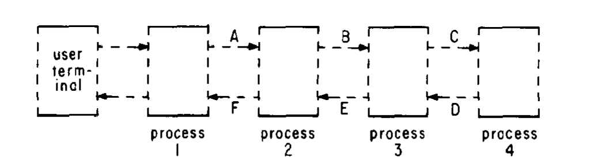
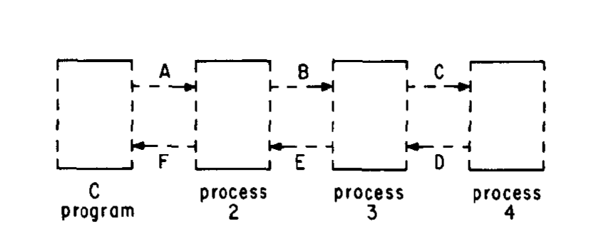
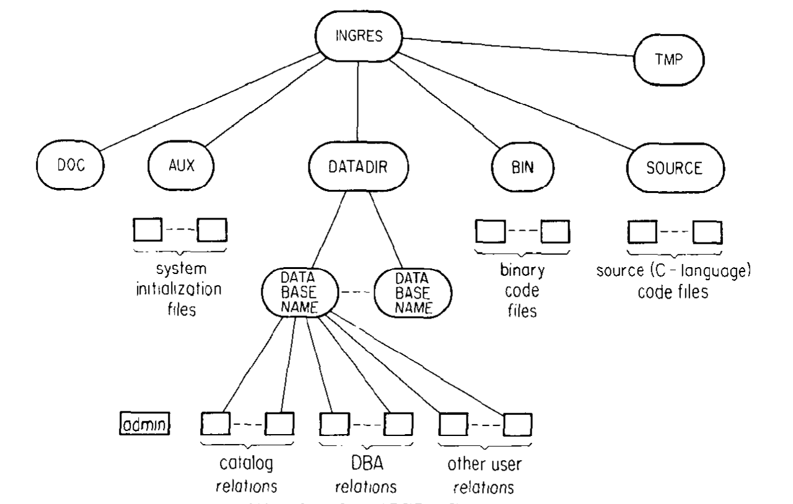
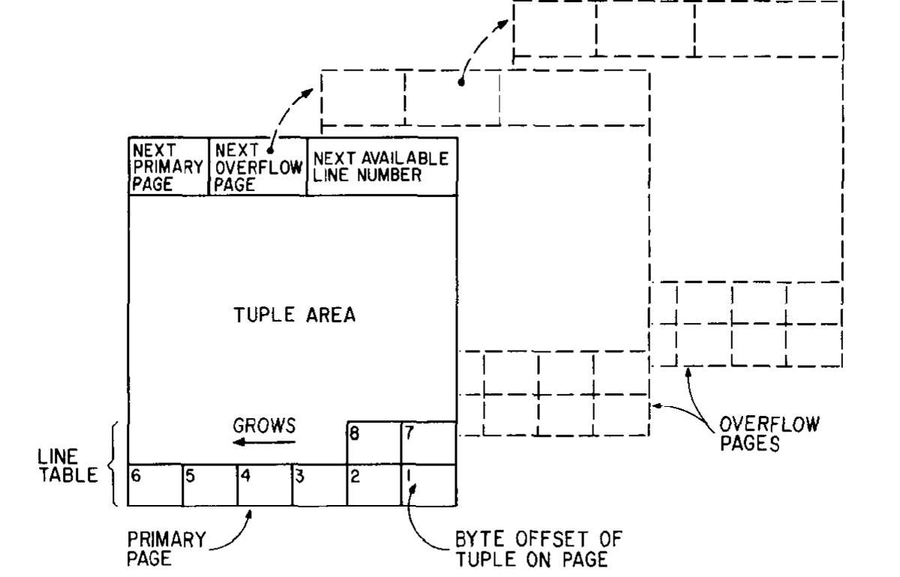

# The Design and Implementation of INGRES（中文译文）

## 译者说明

本文依据同目录的 `source.pdf` 翻译。章节、图表、公式、算法、代码与参考文献按原文结构保留。

## 作者

Michael Stonebraker、Eugene Wong、Peter Kreps

加利福尼亚大学伯克利分校

Gerald Held

Tandem Computers, Inc.

本文研究得到多项研究资助。[^funding]

[^funding]: 本研究得到 Army Research Office Grant DAHC04-74-GO087、Naval Electronic Systems Command Contract NOOO39-76-C-0922、Joint Services Electronics Program Contract F44620-71-C-0087、National Science Foundation Grants DCR75-03839 与 ENG74-06651-A01，以及 Sloan Foundation 的资助。通信地址：M. Stonebraker、E. Wong，加利福尼亚大学伯克利分校电子工程与计算机科学系，Berkeley, CA 94720；P. Kreps，加利福尼亚大学伯克利分校 Lawrence Berkeley Laboratories，Building 50B，计算机科学与应用数学系，Berkeley, CA 94720；G. Held，Tandem Computers, Inc.，Cupertino, CA 95014。

## 摘要

本文介绍截至 1976 年 3 月已经运行的 INGRES 数据库管理系统版本。这个多用户系统向用户提供数据的关系视图，支持两种高级、非过程式数据子语言，并作为一组用户进程运行在 UNIX 操作系统之上，所用计算机为 Digital Equipment Corporation 的 PDP 11/40、11/45 和 11/70。

本文重点讨论以下方面的设计决策和权衡：（1）把系统组织成多个进程；（2）把一种命令语言嵌入通用程序设计语言；（3）为处理交互而实现的算法；（4）实现的访问方法；（5）当前提供的并发与恢复控制；（6）系统目录所用的数据结构，以及数据库管理员的角色。

本文还讨论：（1）对完整性约束的支持——该功能只有一部分已经运行；（2）尚未支持的视图与保护功能；（3）系统未来的计划。

**关键词与短语：**关系数据库、非过程式语言、查询语言、数据子语言、数据组织、查询分解、数据库优化、数据完整性、保护、并发。

**CR 分类：**3.50、3.70、4.22、4.33、4.34。

## 1 引言

INGRES 是 Interactive Graphics and Retrieval System（交互式图形与检索系统）的缩写。它是一个关系数据库系统，运行在贝尔电话实验室为 Digital Equipment Corporation 的 PDP 11/40、11/45 和 11/70 开发的 UNIX 操作系统 [22] 之上。系统主要用 C 语言编写；UNIX 本身也是用这种高级语言写成。解析工作借助 UNIX 上的编译器生成器 YACC 完成 [19]。

关系模型用于数据库管理系统的优点已在文献 [7, 10, 11] 中得到广泛讨论，几乎无需赘述。我们选择关系模型时，尤其受到两个方面的驱动。第一，这种模型能提供很高程度的数据独立性。第二，它使系统能够提供高级、完全非过程式的设施，以统一处理数据定义、检索、更新、访问控制、视图支持和完整性验证。INGRES 的目标就是把这些性质落实为可供实际应用使用的系统。

### 1.1 本文讨论的内容

本文中，我们介绍 INGRES 所作的设计决策；我们尤其强调以下方面的设计与实现：（a）系统进程结构——第 2 节会说明 UNIX 中的这一概念；（b）把全部 INGRES 命令嵌入通用程序设计语言 C；（c）实现的访问方法；（d）目录结构与数据库管理员的角色；（e）对视图、保护和完整性约束的支持；（f）所实现的分解过程；（g）更新的实现与二级索引的一致性；（h）恢复和并发控制。

第 1.2 节中，我们简要介绍 INGRES 的主要查询语言 QUEL，以及数据库创建、关系定义、批量复制、存储结构修改、完整性控制等实用命令。第 1.3 节中，我们说明 EQUEL 预编译器，它允许用户把 QUEL 嵌入自编写的 C 程序。第 1.4 节比较 QUEL、EQUEL 与若干其他数据子语言。

第 2 节中，我们介绍影响我们设计决策的 UNIX 环境因素，并说明 INGRES 四个进程的结构及其选择理由。第 3 节中，我们说明现有的目录（系统）关系、数据库管理员对于数据库中全部关系的角色，以及文件、五种存储结构和访问方法接口。第 4、5、6 节分别说明三个核心进程的主要功能和实现策略：查询修改与并发控制、多变量查询分解与单变量执行，以及实用命令、延迟更新和恢复。第 7 节总结系统经验、现有应用和未来扩展。

INGRES 还支持 CUPID [20, 21]，这是一种面向非程序员的图形化、较随意的语言。CUPID 已经运行，但不在本文讨论范围内。

除非特别说明，本文描述的是 1976 年 3 月已经运行的 INGRES 系统。

### 1.2 QUEL 与其他 INGRES 实用命令

QUEL（QUEry Language）与 Data Language/ALPHA [8]、SQUARE [3] 和 SEQUEL [4] 有若干共同点。它是一种完整的查询语言，使程序员不必关心数据结构如何实现，也不必指定作用于存储数据的算法 [9]，因而能实现相当程度的数据独立性 [24]。

本节示例都使用以下关系：

```text
EMPLOYEE(NAME, DEPT, SALARY, MANAGER, AGE)
DEPT(DEPT, FLOOR#)
```

一次 QUEL 交互至少包含一条范围声明：

```text
RANGE OF variable-list IS relation-name
```

它说明各变量在哪个关系上取值。`variable-list` 中声明的变量作为元组的替身，称为元组变量。交互还包含一条或多条如下形式的语句：

```text
Command [result-name](target-list)
        [WHERE Qualification]
```

`Command` 可以是 `RETRIEVE`、`APPEND`、`REPLACE` 或 `DELETE`。对 `RETRIEVE` 和 `APPEND`，`result-name` 是合格元组要被检索到或追加到的关系名；对 `REPLACE` 和 `DELETE`，它是通过限定条件标识待修改或待删除元组的元组变量名。目标表写作：

```text
result-domain = QUEL Function, ...
```

各结果域会被赋予相应函数的值。

以下示例给出了合法的 QUEL 交互；语言的完整说明见 [15]。

**示例 1.1：计算雇员 Jones 的工资除以 `年龄 - 18`。**

```text
RANGE OF E IS EMPLOYEE
RETRIEVE INTO W
    (COMP = E.SALARY/(E.AGE-18))
WHERE E.NAME = "Jones"
```

`E` 在 `EMPLOYEE` 上取值。查询找出所有满足 `E.NAME = "Jones"` 的元组，并对每个合格元组计算 `COMP`，结果组成只有一个域的新关系 `W`。若省略结果关系，合格元组将按显示格式写到用户终端，或返回调用程序。

**示例 1.2：把元组 `(Jackson, candy, 13000, Baker, 30)` 插入 `EMPLOYEE`。**

```text
APPEND TO EMPLOYEE
    (NAME = "Jackson", DEPT = "candy", SALARY = 13000,
     MGR = "Baker", AGE = 30)
```

未指定的数值域默认为 0，字符域默认为空串。当前实现的一个缺点是，数值域中的 0 与“无值”没有区别。

**示例 1.3：解雇一楼的所有人。**

```text
RANGE OF E IS EMPLOYEE
RANGE OF D IS DEPT
DELETE E
WHERE E.DEPT = D.DEPT
  AND D.FLOOR# = 1
```

这里 `E` 表示要修改 `EMPLOYEE`，凡其 `DEPT` 值等于一楼某个部门的元组都会被删除。

**示例 1.4：如果 Jones 在一楼工作，就给他加薪 10%。**

```text
RANGE OF E IS EMPLOYEE
RANGE OF D IS DEPT
REPLACE E(SALARY = 1.1*E.SALARY)
WHERE E.NAME = "Jones"
  AND E.DEPT = D.DEPT
  AND D.FLOOR# = 1
```

在限定条件成立的 `EMPLOYEE` 元组中，`E.SALARY` 被替换为 `1.1*E.SALARY`。

除上述 QUEL 命令外，INGRES 还支持七类实用命令。

1. **调用 INGRES。**

   ```text
   INGRES database-name
   ```

   这条 UNIX 命令把用户登录到给定数据库。数据库只是有名字的一组关系，并有一个拥有额外权限的数据库管理员。此后用户在该数据库环境中发出其他命令，只有必须直接从 UNIX 执行的命令例外。

2. **创建与销毁数据库。**

   ```text
   CREATEDB database-name
   DESTROYDB database-name
   ```

   两条命令都从 UNIX 调用。`CREATEDB` 的调用者必须得到创建数据库的授权，并自动成为该库管理员。只有数据库管理员调用 `DESTROYDB` 才能成功销毁数据库。

3. **创建与销毁关系。**

   ```text
   CREATE relname(domain-name IS format, domain-name IS format, ...)
   DESTROY relname
   ```

   `CREATE` 的调用者成为新关系的所有者，用户只能销毁自己拥有的关系。当前支持 1、2、4 字节整数，4、8 字节浮点数，以及 1 到 255 字节的定长 ASCII 字符串。

4. **批量复制数据。**

   ```text
   COPY relname(domain-name IS format, ...) direction "filename"
   PRINT relname
   ```

   `COPY` 在整个关系和 UNIX 文件之间传输数据，`direction` 为 `TO` 或 `FROM`。关系必须已经存在，域名必须与命令一致，但文件格式不必与关系格式一致，`COPY` 会自动转换类型；UNIX 文件中还可以有哑域和变长域。`PRINT` 把关系格式化为报表输出到终端，可视为一种定型的 `COPY`。

5. **修改存储结构。**

   ```text
   MODIFY relname TO storage-structure ON (key1, key2, ...)
   INDEX ON relname IS indexname(key1, key2, ...)
   ```

   `MODIFY` 在第 3 节介绍的五种访问方法之间转换关系。指定的域从左至右连接为复合键，除一种方法外都用它组织元组；只有关系所有者可执行该操作。`INDEX` 创建含 `key1, key2, ..., pointer` 的二级索引，其中 `pointer` 是基关系相应元组的唯一标识。例如，假设 `EMPLOYEE` 中有六个相应姓名和年龄的元组，其 `AGEINDEX` 可以是：

   | Age | Pointer |
   | ---: | --- |
   | 25 | Smith 元组的标识符 |
   | 32 | Jones 元组的标识符 |
   | 36 | Adams 元组的标识符 |
   | 29 | Johnson 元组的标识符 |
   | 47 | Baker 元组的标识符 |
   | 58 | Harding 元组的标识符 |

   索引关系本身也像普通关系一样访问，但基关系更新时会自动维护它；只有关系所有者可创建或销毁索引。

6. **一致性与完整性控制。**

   ```text
   INTEGRITY CONSTRAINT is qualification
   INTEGRITY CONSTRAINT LIST relname
   INTEGRITY CONSTRAINT OFF relname
   INTEGRITY CONSTRAINT OFF (integer, ..., integer)
   RESTORE database-name
   ```

   前四条分别插入、列出、删除和选择性删除必须对关系的所有交互强制执行的完整性约束。`RESTORE` 在系统崩溃后恢复数据库的一致状态，只能由数据库管理员从 UNIX 执行。

7. **杂项命令。**

   ```text
   HELP [relname or manual-section]
   SAVE relname UNTIL expiration-date
   PURGE database-name
   ```

   `HELP` 的参数若为命令名，就返回参考手册 [31] 的对应页；若为关系名，就返回该关系的全部信息；无参数时返回当前数据库所有关系的信息。`SAVE` 声明用户打算将某关系保留到指定日期。管理员可从 UNIX 调用 `PURGE`，删除保留期限已过的关系，以便数据库空间用尽时回收空间。管理员也可以无视所有者，直接用 `DESTROY` 删除库中的任何关系。

有两点需要说明。第一，系统当前接受 [15] 规定的 $\mathrm{QUEL} _ 1$，扩展到接受 $\mathrm{QUEL} _ n$ 的工作正在进行。第二，当前系统还不接受视图和保护语句；虽然算法已经给出 [25, 27]，但尚未投入运行。因此本节没有给出它们的语法，第 4 节会继续讨论。

### 1.3 EQUEL

QUEL 可以灵活处理许多数据管理需求，但有些应用需要定制用户界面，也需要通用语言的控制能力。因此 INGRES 实现了 EQUEL（Embedded QUEL），即把 QUEL 嵌入通用程序设计语言 C。

EQUEL 的设计目标是：新语言必须同时具有 C 和 QUEL 的完整能力；C 程序还应能逐个处理 `RETRIEVE` 中满足限定条件的元组，即 Data Language/ALPHA [8] 所说的管道式返回。

EQUEL 的规则如下：

- 任何 C 语句都是合法的 EQUEL 语句。
- 任何 QUEL 语句或 INGRES 实用命令，只要以两个井号 `##` 开头，就是合法的 EQUEL 语句。
- 除命令名外，QUEL 语句中的任何位置都可以使用 C 变量；以这种方式使用的 C 变量，其声明也必须加 `##` 前缀。
- 没有结果关系的 `RETRIEVE` 可后接一个 C 代码块；每个合格元组都会执行该代码块一次。

最后一种形式的完整语法为：

```c
RETRIEVE (target-list)
    [WHERE qualification]
##{
       C-block
##}
```

**示例 1.5：一个只执行一种查询的小型 INGRES 前端。**程序反复读取雇员名，并按合适格式输出工资。

```c
main()
{
    ## char EMPNAME[20];
    ## int SAL;

    while (READ(EMPNAME)) {
        ## RANGE OF X IS EMP
        ## RETRIEVE (SAL = X.SALARY)
        ## WHERE X.NAME = EMPNAME
        ##{
            PRINT("The salary of", EMPNAME, "is", SAL);
        ##}
    }
}
```

C 变量 `EMPNAME` 出现在 QUEL 限定条件中；每遇到一个合格元组，系统便把相应工资赋给 C 变量 `SAL`，然后执行 `PRINT`。

**示例 1.6：读取一个关系名和两个域名。**随后，对第二个域要取的一组值中的每个值，处理第一个域的全部取值。我们假定 `PROCESS` 的含义显而易见。更完整的版本可以成为简单的报表生成器。

```c
main()
{
    ## int VALUE;
    ## char RELNAME[13], DOMNAME[13], DOMVAL[80];
    ## char DOMNAME_2[13];

    READ(RELNAME);
    READ(DOMNAME);
    READ(DOMNAME_2);
    ## RANGE OF X IS RELNAME

    while (READ(DOMVAL)) {
        ## RETRIEVE (VALUE = X.DOMNAME)
        ## WHERE X.DOMNAME_2 = DOMVAL
        ##{
            PROCESS(VALUE);
        ##}
    }
}
```

范围声明在 INGRES 中一直有效，直到被重新定义，所以无论循环执行多少次 `RETRIEVE`，这里只需要一条 `RANGE`。除 INGRES 命令名本身外，其他位置都可使用 C 变量：`RELNAME` 用作关系名，`DOMNAME` 与 `DOMNAME_2` 用作域名。

### 1.4 关于 QUEL 与 EQUEL 的评论

QUEL 很多设计借鉴了 Data Language/ALPHA，但有三项主要差异。第一，QUEL 本身提供算术运算，而 ALPHA 建议依赖宿主语言。第二，QUEL 没有量词；范围声明的关系之笛卡尔积中的每个点都对限定条件求值。因此 QUEL 的函数语义并不是一阶谓词演算。第三，QUEL 的聚合能力更强。

较新的 SEQUEL [2] 已经很接近 QUEL；文献 [2] 的示例 1(b) 提出了一种 QUEL 语法变体。两者的主要差异是：SEQUEL 在可能时允许用面向块的记法写出不含元组变量的语句；其聚合机制也与 QUEL 不同。System R [2] 提出的 SEQUEL 与 PL/I 等宿主语言的接口含有显式游标和变量绑定，而这两个概念在 EQUEL 中都是隐式的。

## 2 INGRES 的进程结构

INGRES 有两种调用方式：其一，从 UNIX 直接执行 `INGRES database-name`；其二，执行用 EQUEL 预编译器编写的程序。我们依次讨论两者，再简要说明为什么会有两套机制；在此之前，先介绍几项相关的 UNIX 细节。

### 2.1 UNIX 环境

UNIX 文件系统是一棵类似 MULTICS 的树。每个文件要么是目录，要么是数据文件；文件在物理上划分为 512 字节块，也称页。读请求会把一个或多个页从辅存移到 UNIX 核心缓冲区，再把所需字节串交给用户。如果同一页仍在缓冲区中而再次被引用，就不会发生磁盘 I/O。UNIX 用最近最少使用策略在文件系统和系统缓冲区之间调页，从而把整个文件系统管理成一个大型虚拟存储器。

INGRES 的设计者认为数据库系统对 UNIX 应表现为普通用户作业，否则它就必须依赖非标准 UNIX，降低可移植性；同时，UNIX 应为不同作业的混合负载统一管理缓冲区。因此 INGRES 不包含自己的内存管理设施。

UNIX 进程是一个地址空间，在 PDP 11/40 上不超过 64K 字节，在 11/45 和 11/70 上不超过 128K 字节。进程关联用户标识，是 UNIX 调度器的工作单位。进程可 `fork` 子进程并形成进程子树，也可请求 UNIX 在后代进程中执行文件。进程用单向管道通信，由 UNIX 保证同步而不丢消息。标准输入和标准输出通常指向终端，也可重定向到文件、管道或其他设备。UNIX 还允许执行可重入代码的进程共享过程段，因而多个并发 INGRES 用户只需为各自的数据段支付额外核心空间。

### 2.2 从 UNIX 调用

把 `INGRES` 作为 UNIX 命令执行时，会建立图 1 所示的进程结构。



*图 1：INGRES 进程结构。*

进程 1 是交互式终端监视器，用户可在其工作区中编写、打印、编辑和执行一组 INGRES 命令；当前终端监视器接受的命令集合见 [31]。执行时，工作区内容以 ASCII 字符串经管道 A 发送。借助 UNIX 的标准输入输出重定向，用户还可以让监视器从文件读取预制交互，并把输出送往打印机或文件。

进程 2 包含词法分析器、解析器、用于完整性控制的查询修改程序（未来还支持视图与保护）以及并发控制。受大小限制，当前发布版本没有完整性控制代码。进程 2 完成后，把记号串经管道 B 传给进程 3。

进程 3 执行 `RETRIEVE`、`REPLACE`、`DELETE` 和 `APPEND`。任何更新先转换成检索，以隔离待修改元组；修改后的元组写入专用文件，由进程 4 的延迟更新程序处理。对于 `RETRIEVE`，进程 3 先把多变量查询分解为一系列单变量交互，再由单变量查询处理器 OVQP 调用访问方法执行。

所有 `CREATE`、`DESTROY`、`INDEX` 等实用命令代码都在进程 4 中，以多个覆盖段组织。进程 3 只是把这些命令转交进程 4。错误沿 D、E、F 管道返回进程 1。若 `RETRIEVE` 未指定结果关系，进程 3 会把合格元组按标准格式直接写到进程 1 的标准输出，通常就是用户终端。

### 2.3 从 EQUEL 调用

我们现在转而讨论由预编译器代码调用时 INGRES 的操作。EQUEL 预编译器把 EQUEL 程序转换为合法 C 程序，把 QUEL 语句改写为相应的 C 代码和 INGRES 调用。普通 C 编译器再生成可执行模块。运行时，这个模块取代交互式终端监视器，成为图 2 的前端进程。



*图 2：派生后的进程结构。*

前端 C 程序和 INGRES 核心之间有两条特殊通路。程序执行到数据库请求时，把未解析的 ASCII 命令经 A 送到进程 2；这一设计选择的理由见 [1]。进程 3 找到的元组通过专用数据管道返回 C 程序，供嵌入的 C 代码逐元组处理。F 还返回命令完成状态。EQUEL 转换器执行的各项功能详见 [1]。

### 2.4 关于进程结构的评论

图 1、2 所示结构是 INGRES 实现的第四种进程结构，最终选择主要基于以下考虑。

**(a) 地址空间限制。** 为在 PDP 11/40 上运行，必须遵守 64K 地址空间上限。进程 2 和进程 3 都已经接近这一上限，无法合并；进程 4 也因大小限制被组织成多个覆盖段。如果有更大的地址空间，进程 2、3、4 很可能会合并成一个大进程。不过，三个“核心”进程未必会显著降低性能。

若一个大进程驻留主存，当然不必换入换出代码；但若 UNIX 系统拥有约 300K 字节真实内存，足以同时容纳进程 2、进程 3 和进程 4 的全部覆盖段，那么现有结构也不一定需要换代码——这个选择只可能在 11/70 上实现。另一方面，假设支持虚拟内存的操作系统和硬件把一个大进程按页调入调出；在真实内存相同的条件下，设计者认为页错误产生 I/O 的速率会与 INGRES 的进程换入/覆盖大致相当。

多进程结构看得见的额外开销有两项：（1）读写管道必须进行系统调用，其代价远高于单进程可用的子程序调用；执行一条 INGRES 命令至少需要八次这类系统调用。（2）还要执行额外代码，把信息整理成适合经管道发送的格式。例如，指向数据结构的指针不能直接通过管道，必须把整个结构线性化后发送。

**(b) 简单控制流。** 功能分组为多个进程，是为了保持控制流简单：命令只向右传递，数据和错误只向左返回。进程 3 必须向进程 4 的不同覆盖段发命令，因此放在进程 4 左侧；解析器自然必须位于进程 3 之前。早期进程结构的互连更复杂，使同步和调试困难得多。

进程 4 采用覆盖段，是为了把不常使用的代码覆盖在同一个进程中。另一方案是增加进程 5、6、7 及其管道，但这些进程绝大多数时间都处于静止状态，只会无谓占用 UNIX 核心表空间。所有进程目前都同步运行：每个进程等待右侧下一进程返回错误码之后，才继续接受左侧输入。这简化了控制流，而且许多场合本来就要求同步。未来版本可能在可行处利用并行性，但当时还不知道性能收益。

**(c) 隔离前端进程。** 出于保护原因，替代终端监视器的 C 前端必须使用不同于 INGRES 的用户标识，否则它可以直接篡改 INGRES 管理的数据。因此，它要么作为覆盖段装入某进程，要么在自己的进程中运行；出于效率和便利，系统选择后者。

**(d) 两种进程结构的理由。** 交互式终端监视器本可以用 EQUEL 编写，这样就无需维护两种只在数据管道处理上不同的结构。但终端监视器早于 EQUEL，无法从一开始采用这一方案；按当时资源，重写也不是高优先级任务。此外，EQUEL 监视器会稍慢，因为合格元组要先返回调用程序再显示，而不能由进程 3 直接显示。

## 3 数据结构与访问方法

本节先由我们讨论 INGRES 操作的文件及其内容，然后我们说明关系可采用的五种存储结构（文件格式），最后我们概述用于统一衔接这些格式的访问方法语言。

### 3.1 INGRES 文件结构

图 3 显示 INGRES 操作的 UNIX 文件子树。系统初次安装时必须创建 UNIX 用户 `INGRES`；该用户因拥有特殊权限而称为“超级用户”，有关这些权限的进一步讨论见 [28]。其根目录下有六个主要目录：`AUX` 的后代文件保存控制图 1、2 所示进程创建的表，以及获准创建数据库的用户授权表，只有 INGRES 超级用户可用 UNIX 编辑器修改；`BIN` 保存目标代码，`SOURCE` 保存 C 源代码；`TMP` 保存交互式终端监视器工作区所用的临时文件；`DOC` 是系统文档和参考手册子树的根；`DATADIR` 则为每个 INGRES 数据库保存一个目录项。



*图 3：INGRES 文件子树。*

每个数据库目录中的文件分四类：

1. **管理文件。** 保存数据库管理员（DBA）的用户标识和初始化信息。
2. **目录（系统）关系。** 这些预定义名称的关系为每个数据库创建，由 DBA 拥有并构成系统目录。熟悉内部结构的用户可以用 `RETRIEVE` 查询，但只能由 INGRES 实用命令更新；紧急情况下 INGRES 超级用户也可直接更新。保护语句实现后，DBA 还可以选择性限制对这些关系的 `RETRIEVE` 访问。
3. **DBA 关系。** DBA 拥有的共享关系，任何用户都可访问。保护实现后，DBA 可以插入保护谓词来授权共享使用，也可以删除谓词来撤销；不同用户可以拥有不同谓词 [28]。
4. **其他关系。** 其他用户通过 `RETRIEVE INTO W` 或 `CREATE` 创建的关系，不共享。

DBA 拥有普通用户没有的权限：创建共享关系并规定其访问控制、运行 `PURGE`、销毁数据库中系统目录以外的任意关系。INGRES 只允许“一级共享”，DBA 不能把这些权力转授他人。选择该策略有三个原因：（1）没有观察到更高一般性的实际需要，而它会使撤销权限等问题变得繁琐；（2）数据库空间耗尽时，必须由一个人决定销毁或归档哪些关系，这项策略决策适合交给 DBA；（3）必须有人决定哪些关系物理存储、哪些定义为视图，这一数据库设计问题最好集中于单个 DBA。

除管理文件外，数据库中的所有文件都是关系。这意味着系统目录本身也使用同一套访问方法和 QUEL：访问目录和数据关系可以共用代码；面向数据关系提供的多种存储结构也可用于加速目录访问；必要时还能执行 QUEL 来检查和修补系统关系，这对调试非常有帮助。

每个关系占一个 UNIX 文件，INGRES 不把经常一起访问的不同关系元组聚簇在同一页或相邻页。DBTG 系统常通过 set type 把不同记录类型关联并在物理上聚簇。还应注意，把同一关系中的元组聚簇在给定文件内具有明显的性能影响；INGRES 支持的这类聚簇技术见第 3.3 节。INGRES 没有对不同关系的元组进行聚簇，原因是：（1）UNIX 页只有 512 字节，一页能容纳的元组有限，而且逻辑相邻页不保证物理相邻，“附近页面”在 UNIX 中没有可靠物理意义；（2）支持聚簇会使访问方法更复杂；（3）跨关系聚簇需要用“set”[6]、“link”[29] 或其他机制标识簇，把这些访问路径纳入分解方案会显著增加复杂性。System R 的设计者在聚簇问题上得出了不同结论 [2]。

### 3.2 系统目录

我们现在转而讨论系统目录。我们将详细讨论两个关系，并简要说明其他目录的内容。`RELATION` 目录的每个元组描述数据库中的一个关系，系统关系本身也包括在内。各域的含义如下：`relid` 是关系名；`owner` 是所有者的 UNIX 用户标识，与 `relid` 连接后形成存放关系的唯一文件名；`spec` 表示五种存储结构之一，或表示虚拟关系（视图）的特殊码；`indexd` 表示该关系是否有二级索引；`protect` 和 `integ` 分别表示是否存在保护谓词与完整性约束。这三个标志可以让查询修改与单变量处理在无相关信息时避免额外目录查询。`save` 是计划保留期限；`tuples` 是由 `CLOSER` 保持最新的元组数；`atts` 是域数；`width` 是元组字节宽度；`prim` 是主文件页面数。

`ATTRIBUTE` 目录逐域描述关系。`relid` 和 `owner` 标识所属关系；`domain-name` 是域名；`domain-no` 是域在关系中的位置，INGRES 处理交互时用它引用该域；`offset` 是域起点相对元组起点的字节偏移；`type` 为整数、浮点数或字符串；`length` 是字节长度；若该域属于键，`keyno` 给出它在复合键中的次序。`RELATION` 与 `ATTRIBUTE` 合在一起描述各关系的结构与内容。系统计划首先增加域取值的最小值与最大值，供第 5 节和 [30] 的更复杂分解方案使用；目录采用关系形式，使这种重构很容易。

`INDEX` 目录为数据库中的每个二级索引保存一个元组。二级索引本身也是关系，所以还会独立出现在 `RELATION` 和 `ATTRIBUTE` 中；`INDEX` 额外建立基关系与其二级索引的对应，并记录索引包含的基关系域。`PROTECTION` 和 `INTEGRITY` 分别保存各关系的保护与完整性谓词，谓词以部分处理后的字符串形式存放；当时 `INTEGRITY` 已采用这种机制，`PROTECTION` 将按同样方式实现。`VIEW` 将为每个虚拟关系保存一份部分处理的、类似 QUEL 的定义。某关系是否存在这些辅助信息，由 `RELATION` 的对应标志指示。图形子系统也使用一组普通系统关系来编目和处理地图；地图与其他数据一样存成关系 [13]。

### 3.3 可用的存储结构

我们现在说明 INGRES 当前提供的五种结构：堆、散列、ISAM、压缩散列和压缩 ISAM。后四种有键，元组在文件中的位置是键域值的函数；键可以由任意有序域集合构成。堆没有键，元组位置与值无关，开销低，适合全表扫描。

堆是随机顺序的顺序文件。定长元组按到达顺序写入，新元组追加在末尾；唯一元组标识 TID 是文件内字节偏移。它主要用于非常小的关系、`COPY` 进出系统的过渡数据，以及查询处理中产生的某些临时关系。

有键结构都用图 4 的公共页格式。一个元组必须完整放在一页内。TID 由 UNIX 文件中的页号和行号组成；行号索引页底部向上增长的行表，表项指向页内元组。因此可以重排页内元组，而不改变 TID。



*图 4：有键存储结构的页面布局。*

文件初始把全部元组存放在若干主页面中。关系增长并填满这些页面后，系统才分配溢出页，并通过指针把它们链接到相应的主页面。每个主页面的页头指向下一个主页面，并另有指针指向本页的溢出链。一个主页面及其关联溢出页组成的链内，元组不保持特殊顺序。因此，有键访问即使已经定位到特定主页面，匹配元组仍可能出现在链中的任何一页。行表项保存页内元组指针，所以系统可以调整元组在页面中的物理排列而不改变 TID。

散列文件把键值经散列函数随机分布到主页面，适合由一个具体键值限定访问的场景。作为保持顺序的方式，系统采用与 IBM ISAM [18] 类似的方案：文件先按特定键排序，再建立多级目录，目录记录每个主页面的最高键，并静态存放在文件主页面之后的若干页面中。主页面及其溢出页不保持排序。由于键仍近似有序，ISAM 特别适合把键限定在某个值域内的访问。文献 [16] 的索引压缩方案当时正在实现。

压缩散列和压缩 ISAM 使用相同组织，但对定长元组采用数据压缩 [14]；只有在提高存储利用率能够抵消访问时编码和解码成本的场合才值得使用。当前压缩方案删除空白，并压缩元组中与前一元组相同的部分；压缩逐页独立应用，设计者也在试验其他方案。压缩对变长域尤其有用：域在定义时声明最大长度，访问方法在压缩时去掉填充；它也可能适合二级索引。

### 3.4 访问方法接口

访问方法接口 AMI 被分别链接到进程 2、3、4，使上层程序不依赖具体存储结构。任何访问方法必须提供一种线性遍历元组的顺序，并为每个元组提供唯一 TID。接口有九类调用：

```text
OPENR(descriptor, mode, relation-name)
GET(descriptor, tid, limit-tid, tuple, next-flag)
FIND(descriptor, key, tid, key-type)
PARAMD(descriptor, access-characteristics-structure)
PARAMI(index-descriptor, access-characteristics-structure)
INSERT(descriptor, tuple)
REPLACE(descriptor, tid, new-tuple)
DELETE(descriptor, tid)
CLOSER(descriptor)
```

`OPENR` 打开关系的 UNIX 文件，并用 `RELATION`、`ATTRIBUTE` 目录中的信息填充调用者提供的描述符；`mode` 说明按更新模式还是只读检索模式打开。后续 AMI 调用通过描述符确定关系，不必再次查询系统目录。`GET` 可按给定 TID 直接取得元组，也可在 `next-flag = TRUE` 时，从当前 TID 顺序扫描到 `limit-tid`；到达上界会返回特殊状态码。

顺序方式的 `GET` 会把所取元组的 TID 写回调用者传入的 `tid`，为下一次调用作准备；直接方式 `next-flag = FALSE`，把 `tid` 当作唯一地址。

`FIND` 不返回元组，只确定扫描边界。`key-type` 为负时，把可能包含匹配元组的最低页面上的最低 TID 写入 `tid`；为正时，返回相应的最高 TID。其绝对值还说明所给键是 `EXACTKEY` 还是 `RANGEKEY`：前者只匹配键值完全相同的元组；后者表示可能键值范围的低端或高端，分别匹配大于等于或小于等于所给键值的元组。只有保持次序的存储结构才能用 `RANGEKEY` 成功缩小扫描。若关系的存储结构与 `key-type` 不兼容，`FIND` 返回的边界就如同没有提供键，即整个关系的最低或最高 TID。`FIND` 总是成对调用，为后续 `GET` 扫描建立低端和高端。

`PARAMD` 面向基关系，`PARAMI` 面向二级索引；两者填充同一种访问特征结构，说明能否用精确键、范围键或部分指定键缩小扫描，并给出键域次序。这样，访问优化代码不依赖当前具体实现。`INSERT` 按元组键值和关系存储模式把元组放到适当位置；`REPLACE` 与 `DELETE` 使用此前由 `GET` 获得的 TID，分别替换或删除目标元组。`CLOSER` 关闭关系的 UNIX 文件；如果描述符内容发生变化，还把信息写回系统目录。

### 3.5 增加新的访问方法

新增访问方法通常只需扩展 AMI。若新结构仍采用现有页与 TID 约定，只需为它实现 `FIND`、`PARAMD` 和 `PARAMI`；`GET` 及更新例程可继续使用公共实现。若页面布局或 TID 映射改变，则还必须为 `GET`、`INSERT`、`REPLACE` 和 `DELETE` 提供相应映射。这个接口把物理组织差异限制在小范围内，使核心查询代码无需随每种新方法重写。

因此，新方法若只是换一种从键到既有页面的定位规则，改动集中在边界查找与能力描述；若它改变公共页面格式或 TID 方案，就必须另行提供从 TID 到物理文件位置的映射过程。

## 4 进程 2 的结构

进程 2 执行四类工作：对输入字符串做词法分析；用 YACC [19] 编写的语法分析器解析命令；执行并发控制；通过查询修改支持保护、视图和完整性控制，后者当时只实现了一部分。前两项采用标准技术，我们重点讨论后两项。解析结果是输入查询的树形内部表示，限定条件已转换为等价的合取范式布尔表达式，随后进入查询修改。

### 4.1 查询修改

查询修改有三种基本动作：把完整性谓词加入原查询，把保护谓词加入原查询，以及把虚拟关系引用换成适当的物理关系引用。当前系统只实现了简单的完整性方案。

[27] 给出了不同复杂度的更新完整性算法。当前实现仅支持单变量、无聚合的完整性断言 [23]。断言以 QUEL 限定子句输入，适用于更新该变量所遍历关系的交互。系统为限定条件建立解析树，把树表示连同关系和涉及的域保存到 `INTEGRITY` 目录。查询修改时，系统检查被更新的域可能涉及哪些断言，取出相关树并重建，然后把它们与原更新限定条件以 `AND` 连接。

[27] 还给出了视图算法。视图是由物理关系定义的虚拟关系，系统只保存定义。`DEFINE` 命令的语法与 `RETRIEVE` 相同，所以合法视图就是可以由一次 `RETRIEVE` 物化的关系。视图既方便用户，也让为旧数据库版本编写的 EQUEL 程序在模式演化后继续工作。

保护按 [25] 的算法处理，同样把限定条件加入用户交互。实现细节和防止用户绕过 INGRES 目标代码直接篡改文件的物理保护机制见 [28]。[28] 还比较了 INGRES 的谓词式保护与 [5] 的基于视图的方案。

本节余下部分，我们给出一个查询修改的工作示例。下面的例子展示三种查询修改如何连续作用。假设早期的 `EMPLOYEE` 中所有雇员都未满 30 岁，且没有记录经理。某个旧 EQUEL 程序把年龄编码在 5 位中；数据库后来允许年龄超过 31 后，该程序会失败。为不修改程序，可以定义旧版本视图：

```text
RANGE OF E IS EMPLOYEE
DEFINE OLDEMP(E.NAME, E.DEPT, E.SALARY, E.AGE)
WHERE E.AGE < 30
```

再假设每位雇员工资必须超过 8000 美元：

```text
RANGE OF E IS EMPLOYEE
INTEGRITY CONSTRAINT IS E.SALARY > 8000
```

最后，假设每个人只能修改自己所管理员工的工资：

```text
RANGE OF E IS EMPLOYEE
PROTECT EMPLOYEE FOR ALL(E.SALARY; E.NAME)
WHERE E.MANAGER = *
```

星号代表当前登录 INGRES 的 UNIX 用户名；分号把可更新域与不可更新但可见的域分开。现在 Smith 通过终端或 EQUEL 发出：

```text
RANGE OF L IS OLDEMP
REPLACE L(SALARY = .9*L.SALARY)
WHERE L.NAME = "Brown"
```

这是对视图的更新。文献 [27] 的视图算法先把它改成对物理关系的操作，并加入 Brown 必须属于旧视图的条件：

```text
RANGE OF E IS EMPLOYEE
REPLACE E(SALARY = .9*E.SALARY)
WHERE E.NAME = "Brown"
  AND E.AGE < 30
```

文献 [27] 的完整性算法再确保减薪后的工资仍高于 8000：

```text
RANGE OF E IS EMPLOYEE
REPLACE E(SALARY = .9*E.SALARY)
WHERE E.NAME = "Brown"
  AND E.AGE < 30
  AND .9*E.SALARY > $8000
```

最后，文献 [28] 的保护算法加入 Smith 必须是 Brown 的经理：

```text
RANGE OF E IS EMPLOYEE
REPLACE E(SALARY = .9*E.SALARY)
WHERE E.NAME = "Brown"
  AND E.AGE < 30
  AND .9*E.SALARY > $8000
  AND E.MANAGER = "Smith"
```

三种算法都把附加限定条件与用户交互做 `AND`；视图算法还要更换元组变量。这些限定条件来自 `VIEW`、`INTEGRITY` 和 `PROTECTION` 关系中保存的解析树。

必须再次强调，当前只支持单变量、无聚合的完整性断言，而且这一功能连发布版也没有包含。并发控制和完整性控制代码无法同时装入进程 2 的 64K 字地址空间，设计者选择发布带并发控制的版本。INGRES 设计者正在增加第五个进程 2.5，以容纳并发与查询修改；在具有 128K 地址空间的 PDP 11/45 和 11/70 上则不需要额外进程。

### 4.2 并发控制

任何多用户系统都必须保证多个并发更新以某种能维持数据完整性的方式执行。考虑下面两个更新：

```text
RANGE OF E IS EMPLOYEE
U1: REPLACE E(DEPT = "toy")
    WHERE E.DEPT = "candy"

RANGE OF F IS EMPLOYEE
U2: REPLACE F(DEPT = "candy")
    WHERE F.DEPT = "toy"
```

若 U1、U2 不受控制地并发执行，两个部门中可能各留下部分雇员；数据库从备份恢复并重放交互时，甚至未必能复现同一结果。系统必须保证某个数据库操作是“原子的”，即看起来瞬间发生，并且位于其他数据库操作之前或之后。这个原子单位称为事务。INGRES 有五种事务边界选择：

- 比一条命令更小的单位；
- 一条 QUEL 命令；
- 不包含 C 代码的若干 QUEL 命令；
- 含 C 代码但不含系统调用的若干命令；
- 任意 EQUEL 程序。

小于一条命令无法保证两个并发更新得到某个顺序执行次序的结果，显然不可取。设计者也认为任意 EQUEL 程序无法支持为事务；例如可以声明：

```text
BEGIN TRANSACTION
FIRST QUEL UPDATE
SYSTEM CALLS TO CREATE AND DESTROY FILES
SYSTEM CALLS TO FORK A SECOND COLLECTION OF INGRES PROCESSES
TO WHICH COMMANDS ARE PASSED
SYSTEM CALLS TO READ FROM A TERMINAL
SYSTEM CALLS TO READ FROM A TAPE
SECOND QUEL UPDATE (whose form depends on previous two system calls)
END TRANSACTION
```

若两个这种形式的事务并发运行，每个事务的第二个更新都可能与另一个事务的第一个更新冲突；第二个更新的形式事先未知，因此无法预先判断冲突。死锁只能通过中止一个事务，或尝试回滚其中一个来解决；前者是设计者不愿采用的策略，后者必须倒退穿过中间的系统调用，开销似乎高得无法接受，甚至未必可行。

把事务限制为没有系统调用、因而没有 I/O，又会严重削弱其实用能力。航班预订就是一个例子：

```text
BEGIN TRANSACTION
QUEL RETRIEVE to find all flights on a particular day from San Francisco to Los
Angeles with space available.
Display flights and times to user.
Wait for user to indicate desired flight.
QUEL REPLACE to reserve a seat on the flight of the user's choice.
END TRANSACTION
```

若这组命令不是一个事务，执行 `REPLACE` 时，先前 `RETRIEVE` 所见的空位可能已经不存在。

INGRES 因此把单条 QUEL 语句作为事务。不含中间 C 代码的多条命令事务，可以通过直接扩展下述算法支持；若用户需求足够强，系统会实现它，这一选项还可支持“触发器” [2]。支持含 C 代码但不含系统调用的多命令事务，则会以很大的系统复杂度换取很小的推广；除非 EQUEL 转换器解析完整 C 语言，否则也很难强制这一限制。

实现单条或不含 C 代码的多条命令事务，可以使用数据项、页、元组、域、关系等对象上的物理锁 [12]，也可以使用谓词锁 [26]。当前实现采用较粗糙的物理锁——原则上锁关系的域——并在交互获得全部所需资源之后才允许它进入进程 3，从而避免死锁。由于当前 `REPLACE` 访问方法调用的设计问题，更新时暂时必须锁住关系的全部域，也就是锁住整个关系；这一问题将很快修正。选择避免死锁而非检测并解决死锁，主要是为了简化实现。

锁粒度粗，还因为我们的环境中没有可供大型锁表使用的核心存储。我们当前的实现使用一个 `LOCK` 关系，每申请一个锁就向其中插入一个元组。系统先在物理上锁住整个 `LOCK` 关系，再检查是否有冲突；无冲突就插入全部所需锁，有冲突则让并发控制进程休眠固定时间后重试。必须锁整个关系并按固定间隔休眠，源于 UNIX 缺少信号量或等价机制。当前并发控制开销可能很高，因此可以关闭。锁由并发控制进程一直持有，直到通过管道 E 收到终止消息，届时才删除。

设计者正在考虑编写一个设备驱动程序；这是 UNIX 的一种简洁扩展，新设备通常都会配套编写。该驱动程序将通过在核心内维护表来实现 UNIX 所需的同步和物理锁，从而缓解系统缺少信号量的问题。未来，我们计划试验 [26] 所述的一种粗粒度、因而 CPU 开销较低的谓词锁方案。这种方法可能在锁表空间和 CPU 时间开销可接受的情况下提供相当高的并发度，不过这一判断仍高度推测。

本节最后，我们简要说明为什么不在类似 ISAM 的访问方法中对主页面及其溢出页排序；这一主题也见 [17]。拟议的 UNIX 锁设备驱动程序至少必须保证：对单个 UNIX 页的 read-modify-write 是原子操作。否则，INGRES 为插入锁仍须锁住整个 `LOCK` 关系；而且，没有这种原子操作，任何拟议的谓词锁方案都无法工作。

若锁粒度是 UNIX 页，主页面及其溢出页保持无序时，INGRES 插入或删除关系中的元组一次只需持有一个锁。然而，若维护这些页面的排序次序，访问方法在插入元组时可能需要同时锁住多个页面。并发更新显然可能因此发生死锁，设备驱动程序中锁表的大小也将变得不可预测。为避免这两个问题，这些页面保持无序。

## 5 进程 3

进程 3 有两个主要组件。DECOMP 把涉及多个变量的查询分解成一系列单变量查询，并累积局部结果；它也把更新转换为隔离合格元组的查询，把修改写入延迟更新文件。OVQP（one-variable query processor）则执行单变量查询。

### 5.1 DECOMP

QUEL 交互可以定义在多个关系的笛卡尔积上，因此必须尽量少搜索这个空间。DECOMP 使用三种技术。我们逐项说明这些技术，随后给出实际实现的算法和一个展示全部特征的例子；最后，我们说明正在设计的一种更复杂分解方案所扮演的角色。

**(a) 元组代入。** 从查询中的变量选择一个，用 AMI 逐元组扫描其关系。每读到一个元组，就把相关域值代入查询；所有对该变量的引用都变成常量，查询减少一个变量。系统递归分解，直到只剩一个变量，再调用 OVQP。

**(b) 单变量分离。** 若查询限定条件可写成

```text
Q1(Vi) AND Q2(V1, ..., Vn)
```

则先执行：

```text
RETRIEVE INTO W (Ti[Vi])
WHERE Q1[Vi]
```

其中 `Ti[Vi]` 只保留后续查询所需的 `Vi` 域。随后把范围声明中 `Vi` 对应的关系 `Ri` 换成 `W`，并从限定条件删除 `Q1[Vi]`。这个单变量可分离子查询可直接交给 OVQP。它通过选择和投影缩小变量的取值关系，还允许为临时关系选择有利于后续处理的存储结构与键。

**(c) 重格式化。** 选中某变量做元组代入后，会反复执行少一个变量的查询。若代入后另一个变量的某个子句会变为单变量条件，就可以预先把该变量的关系按这些域重格式化为键结构，使后续每次限制该变量时都能用键访问。

我们现在可以给出完整的分解算法；给出之后，我们再用一个例子说明全部步骤。

1. 若查询有 0 个或 1 个变量，调用 OVQP 后返回；否则继续。
2. 找出查询中具有单变量子句的全部变量 `{V1, ..., Vn}`，逐个执行单变量分离并建立新取值关系。每个新关系默认存为散列文件，其键按以下规则选择：
   1. 对每个其他变量 `Vj`，从剩余多变量子句中取出形如 `Vi.di = Vj.dj` 的集合 `Cij`。
   2. 把 `Cij` 中出现的 `Vi` 域 `di1, di2, ...` 连接成键 `Ki`。
   3. 若多个 `j` 的 `Cij` 非空，任意选一个来构造键；若全部为空，新关系存为无序表。
3. 选择当前取值关系中元组数最少的变量 `Vs`，作为下一次元组代入变量。
4. 对每个 `Cjs` 非空的变量 `Vj`，必要时重格式化其关系 `Rj`，使键由 `Cjs` 中的 `Vj` 域连接而成。这样代入 `Vs` 后，`Cjs` 变为单变量条件，OVQP 可以高效限制 `Vj` 的范围。
5. 对步骤 3 所选变量范围内的每个元组重复：
   1. 把元组值代入查询。
   2. 对少一个变量的查询副本递归调用本算法。
   3. 把本次结果与此前各次结果合并。

我们用以下查询说明该算法；它用到了算法的全部特征：

```text
RANGE OF E, M IS EMPLOYEE
RANGE OF D IS DEPT
RETRIEVE (E.NAME)
WHERE E.SALARY > M.SALARY
  AND E.MANAGER = M.NAME
  AND E.DEPT = D.DEPT
  AND D.FLOOR# = 1
  AND E.AGE > 40
```

它查找一楼、年龄超过 40 岁且工资高于其经理的雇员。

**第 1 层。** 查询不止一个变量。步骤 2 发出两个查询：

```text
RANGE OF D IS DEPT
RETRIEVE INTO T1(D.DEPT)                 /* (1) */
WHERE D.FLOOR# = 1

RANGE OF E IS EMPLOYEE
RETRIEVE INTO T2(E.NAME, E.SALARY,
                 E.MANAGER, E.DEPT)      /* (2) */
WHERE E.AGE > 40
```

`T1` 以 `DEPT` 为散列键。算法必须在 `MANAGER` 与 `DEPT` 之间任意选择 `T2` 的键，假设它选择 `MANAGER`。原查询化为：

```text
RANGE OF D IS T1
RANGE OF E IS T2
RANGE OF M IS EMPLOYEE
RETRIEVE (E.NAME)
WHERE E.SALARY > M.SALARY
  AND E.MANAGER = M.NAME
  AND E.DEPT = D.DEPT
```

假设 `T1` 基数最小，就选 `D` 做代入。步骤 4 把 `T2` 改为按 `DEPT` 散列，说明步骤 2 的任意选择并不好。对 `T1` 的每个元组代入 `D.DEPT = value`，得到第 2 层输入：

```text
RANGE OF E IS T2
RANGE OF M IS EMPLOYEE
RETRIEVE (E.NAME)
WHERE E.SALARY > M.SALARY
  AND E.MANAGER = M.NAME
  AND E.DEPT = value
```

**第 2 层。** 先执行：

```text
RANGE OF E IS T2
RETRIEVE INTO T3(E.NAME, E.SALARY,
                 E.MANAGER)              /* (3) */
WHERE E.DEPT = value
```

`T3` 按 `MANAGER` 散列。第 1 层对 `T2` 的重格式化使查询 (3) 在每个 `T1` 元组上都能高效执行。剩余查询为：

```text
RANGE OF E IS T3
RANGE OF M IS EMPLOYEE
RETRIEVE (E.NAME)
WHERE E.SALARY > M.SALARY
  AND E.MANAGER = M.NAME
```

`T3` 比 `EMPLOYEE` 小，所以选择 `T3` 做代入。对其中每个元组代入 `E.NAME`、`E.SALARY` 和 `E.MANAGER`，得到：

```text
RANGE OF M IS EMPLOYEE
RETRIEVE (value1)                         /* (4) */
WHERE value2 > M.SALARY
  AND value3 = M.NAME
```

**第 3 层。** 查询只有一个变量，调用 OVQP 后逐层返回并合并结果。

因此原查询被分解为四种原型单变量查询。(1) 与 (2) 各执行一次，(3) 对 `T1` 的每个元组执行一次，(4) 的执行次数等于 `T1` 元组数乘以各次产生的 `T3` 元组数。

该算法还有几点值得说明。单变量分离几乎总会加速处理：它可能显著缩小关系，也能为临时关系选择合适结构。只有选择和投影几乎不缩减数据、重格式化又无收益时才会失败。实现保存临时关系而不是合格 TID 列表。前者要复制元组，但投影时可去重；后者免复制，却要重新访问基元组并保留重复项。两种方法各有优胜场景，设计者选择临时关系，因为性能看起来不会更差，能更准确找出最小取值范围，也使代码更清楚。

元组代入总选择元组数最少的变量，以减少最终调用 OVQP 的次数。重格式化通常把多次完整顺序扫描换成多次局部扫描，几乎总能减少处理时间。该算法能高效处理相当大的一类交互，而且规划 CPU 开销不高，但确有需要更复杂策略的情况。

假设我们有策略 `ST0, ST1, ..., STn`，后者逐步更好但规划开销也更大。再假设我们先用 `ST0` 运行一段时间，这段时间是 `ST1` 估计规划开销的一部分；通过已处理的首个代入变量元组数，我们可以估计 `ST0` 的总时间。若明显高于 `ST1` 的开销，我们就切换到 `ST1`，否则我们保持在 `ST0` 并完成处理。同样可从 `ST1` 决定是否升级到 `ST2`。本节算法可看作 `ST0`，更复杂的算法正在开发 [30]。

### 5.2 单变量查询处理器（OVQP）

OVQP 只负责依据一个单变量查询高效访问一个关系。其前半部分 STRATEGY 判断：是否有可获利使用的键；调用 AMI 的 `FIND` 时采用哪些键值；直接访问基关系，还是通过二级索引访问。若选择索引，SCAN 先扫描索引元组，再按索引中的 TID 直接取得基关系元组。后半部分 SCAN 对取得的每个元组计算限定条件和目标表，并输出、插入或记录更新结果。由于 SCAN 相对直接，我们只讨论 STRATEGY 中的策略决策。

STRATEGY 从限定条件提取简单子句：

```text
V.domain op constant
constant op V.domain
```

其中 `op` 为 `=`、`<`、`>`、`<=` 或 `>=`。显然，非简单子句可能等价于简单子句；例如 $E.\mathrm{SALARY}/2 = 10000$ 等价于 $E.\mathrm{SALARY} = 20000$。不过，识别并转换这类子句需要通用的代数符号操纵器，因此 INGRES 通过忽略所有非简单子句来回避此问题。对基关系，策略用一对 `FIND` 求下界和上界，再在区间内 `GET`；对索引，先在索引上做同样扫描，再用指针直接 `GET` 基关系。

`PARAMD` 和 `PARAMI` 告诉 STRATEGY 各结构支持什么键。散列要求多域键的每一域都有等值条件。ISAM 支持范围，但只有从键的第一个有效域开始连续给出的前缀才能帮助定位。若多个路径可用，当前优先级是：基关系散列、散列二级索引、基关系 ISAM、ISAM 二级索引。它们预计最少分别需要 1、2、至少 2、至少 3 次 I/O。

为说明 STRATEGY，我们指出第 5.1 节查询 (1)–(4) 会发生什么。假设 `EMPLOYEE` 以 `NAME` 为 ISAM 主键，`DEPT` 以 `FLOOR#` 为散列主键，`EMPLOYEE.AGE` 有散列二级索引，`EMPLOYEE.SALARY` 有 ISAM 二级索引。分解示例中的查询 (1) 可用 `DEPT` 的散列主键；查询 (2) 的 `AGE > 40` 不能使用散列索引，只能扫描 `EMPLOYEE`，若 `AGE` 索引是 ISAM 则可使用。查询 (3) 使用已经按 `DEPT` 重格式化的临时关系散列键。查询 (4) 同时有 `value3 = M.NAME` 和 `value2 > M.SALARY`，既可用 `NAME` 主 ISAM，也可用 `SALARY` 二级 ISAM；按上述 I/O 优先级选择主关系路径。

## 6 进程 4 中的实用程序

### 6.1 实用命令的实现

我们已经在第 1 节列出若干供用户使用的数据库实用命令。这些命令分布在若干覆盖程序中，需要时再把相应覆盖段装入核心。这一机制本身很直接。大多数实用程序通过 AMI 读取或更新系统关系。

`MODIFY` 含有排序例程，按指定键域从左至右连接后的比较次序排列元组；各键域不必是同一种数据类型。页面初装时约填到容量的 80%。排序采用递归 N 路归并，N 是进程 4 可同时打开的最大文件数，当前为 8。随后建立索引的过程很直接。

转换为散列结构时，`MODIFY` 还必须指定主页面数量。AMI 的标准模除散列函数要使用这个参数。如果用户用 `CREATE` 建立空散列关系，再用 `COPY` 导入一个很大的 UNIX 文件，结构会很低效，因为 `CREATE` 只会给出较小的默认主页面数，导致很长的溢出链。更好的办法是先 `COPY` 到无序表，再让 `MODIFY` 根据实际数据量估计主页面数量。

### 6.2 延迟更新与恢复

`APPEND`、`DELETE`、`REPLACE` 都不立即修改目标关系，而是先把待增加、删除或替换的元组写入临时文件。进程 3 完成查询阶段后调用进程 4，实际执行修改，并在最后维护必要的二级索引。采用延迟更新有四个原因。

**(a) 二级索引。** 假设执行：

```text
RANGE OF E IS EMPLOYEE
REPLACE E(SALARY = 1.1*E.SALARY)
WHERE E.SALARY > 20000
```

又假设 `SALARY` 有二级索引，而基关系以其他域为键。OVQP 会通过工资索引找出应加薪者。如果每找到一个人就立即修改其元组并更新索引，该索引项会向后移动，继续扫描时又会找到同一元组，甚至可能任意多次找到它。要么禁止范围限定通过二级索引找待更新元组，这很不自然；要么延迟二级索引更新。INGRES 选择后者。

**(b) 基关系的自相互作用。** 假设执行：

```text
RANGE OF E, M IS EMPLOYEE
REPLACE E(SALARY = .9*E.SALARY)
WHERE E.MGR = M.NAME
  AND E.SALARY > M.SALARY
```

关系数据为：

| NAME | SALARY | MANAGER |
| --- | ---: | --- |
| Smith | 10K | Jones |
| Jones | 8K | |
| Brown | 9.5K | Smith |

按原始快照，Smith 工资高于其经理，应被减薪；Brown 工资不高于 Smith，不应被减薪。若系统先把 Smith 改为 9K，再检查 Brown，Brown 就会错误地满足条件。延迟到资格判断全部结束后再更新可以避免这种问题。

**(c) 更新的函数性。** 考虑：

```text
RANGE OF E, M IS EMPLOYEE
REPLACE E(SALARY = M.SALARY)
```

它试图把每位雇员的工资分别赋成其他每位雇员的工资，也就是给同一数据项指定多个值，因而不是函数。只有某些情形，例如只有一个元组变量的 `REPLACE`，可以静态保证函数性；一般情况下取决于数据。延迟更新处理器可检查更新文件中是否有重复 TID，但需要对文件排序或散列，代价可能很高。当前实现尚未做这项检查，未来会作为可选功能提供。

**(d) 恢复。** 延迟更新文件同时是待执行更新的日志。系统崩溃后，`RESTORE` 判断更新处理是否已经开始：若尚未开始，就删除临时文件，相当于撤销更新；若已经开始，就以幂等方式重新处理整个文件，使最终效果与从头到尾恰好执行一次相同。因此一项更新要么在开始前被撤销，要么执行到底。软件还允许把更新文件假脱机到磁带并从磁带恢复，这项功能即将投入运行。

终端监视器或 C 程序的用户可发出中断字符停止命令。此时除延迟更新程序外，所有进程都重置；延迟更新程序按上述方式完成恢复。

所有数据更新命令都采用延迟更新，但实用程序还没有全部改造。完成改造后，只要磁盘本身完好，INGRES 就能从任何崩溃恢复；在当时，若崩溃恰好使系统目录不一致，仍可能无法以此方式恢复。INGRES 超级用户可用 UNIX 备份机制把数据库检查点写到磁带。系统会记录全部交互，所以至少可以恢复最后一个检查点，再重放交互日志；若保存了延迟更新磁带，也可重放它。这样总能得到一致系统，只是可能很慢。

延迟更新本身非常昂贵。有一位 INGRES 用户选择在进程 3 中直接更新，并自行保证不执行会产生错误结果的交互。未来可能像函数性检查一样，把直接更新作为可选项；但届时必须采用不同的恢复方案。

## 7 结论与未来扩展

本文所述系统已在约 15 个站点使用。它支撑了会计系统、学生记录管理系统、地理数据系统、大型电话公司的电缆故障报告与维护呼叫系统，以及若干较小应用。这些应用最长已运行九个月。

### 7.1 性能

尚没有详细性能测量，因为当前的第 5 版投入运行还不到两个月。我们已经在代码中插入测量点，正在收集数据。各组成部分大小如下；访问方法会与进程 2、进程 3 和许多实用程序一起装入，所以单独列出。

| 组成部分 | 大小 |
| --- | ---: |
| 访问方法（AM） | 11K |
| 终端监视器 | 10K |
| EQUEL | 30K + AM |
| 进程 2 | 45K + AM |
| 进程 3（查询处理器） | 45K + AM |
| 实用程序（8 个覆盖段） | 160K + AM |

### 7.2 用户反馈

内部和外部用户的反馈总体非常积极。本节中，我们列出用户为未来系统提出的功能。

- **提高性能。** 早期 INGRES 版本很慢，当前版本应能缓解这个问题。
- **递归。** QUEL 不支持递归，用户只能借助预编译器在 C 中繁琐地实现，因此希望语言原生支持。
- **其他语言扩展。** 包括用户定义函数，尤其是计数器；对一个限定条件给出多个目标表；以及 QUEL 中的 `if-then-else` 控制结构。这些功能目前可借助预编译器实现，但效率很低。
- **报表生成器。** `PRINT` 很原始，显然需要更强功能，且应以 EQUEL 编写。
- **批量复制。** `COPY` 不能轻松处理实际遇到的所有情形。

### 7.3 未来扩展

全文已经指出若干正在改进、已经计划或由用户要求的方面。其他方向包括：让 INGRES 在分布式数据库上运行的多计算机版本；进一步提升性能；提供包含递归和用户定义函数的更高级用户语言；改进数据定义与完整性功能；以及开发数据库管理员顾问。

管理员顾问以空闲优先级运行，查询 INGRES 维护的统计关系，再向 DBA 建议访问方法和索引选择。[16] 对此有更深入讨论。

## 致谢

以下人员积极参与了 INGRES 的设计与实现：Eric Allman、Rick Berman、Jim Ford、Angela Go、Nancy McDonald、Peter Rubinstein、Iris Schoenberg、Nick Whyte、Carol Williams、Karel Youssefi 和 Bill Zook。

## 参考文献

1. ALLMAN, E., STONEBRAKER, M., AND HELD, G. Embedding a relational data sublanguage in a general purpose programming language. *Proc. Conf. on Data, SIGPLAN Notices (ACM)* 8, 2 (1976), 25-35.
2. ASTRAHAN, M. M., ET AL. System R: Relational approach to database management. *ACM Trans. on Database Systems* 1, 2 (June 1976), 97-137.
3. BOYCE, R., ET AL. Specifying queries as relational expressions: SQUARE. Rep. RJ 1291, IBM Res. Lab., San Jose, Calif., Oct. 1973.
4. CHAMBERLIN, D., AND BOYCE, R. SEQUEL: A structured English query language. *Proc. 1974 ACM-SIGMOD Workshop on Data Description, Access and Control*, Ann Arbor, Mich., May 1974, pp. 249-264.
5. CHAMBERLIN, D., GRAY, J. N., AND TRAIGER, I. L. Views, authorization and locking in a relational data base system. *Proc. AFIPS 1975 NCC*, Vol. 44, AFIPS Press, Montvale, N.J., May 1975, pp. 425-430.
6. Committee on Data Systems Languages. *CODASYL Data Base Task Group Report*. ACM, New York, 1971.
7. CODD, E. F. A relational model of data for large shared data banks. *Comm. ACM* 13, 6 (June 1970), 377-387.
8. CODD, E. F. A data base sublanguage founded on the relational calculus. *Proc. 1971 ACM-SIGFIDET Workshop on Data Description, Access and Control*, San Diego, Calif., Nov. 1971, pp. 35-68.
9. CODD, E. F. Relational completeness of data base sublanguages. *Courant Computer Science Symposium* 6, May 1971, Prentice-Hall, Englewood Cliffs, N.J., pp. 65-90.
10. CODD, E. F., AND DATE, C. J. Interactive support for non-programmers, the relational and network approaches. *Proc. 1974 ACM-SIGMOD Workshop on Data Description, Access and Control*, Ann Arbor, Mich., May 1974.
11. DATE, C. J., AND CODD, E. F. The relational and network approaches: Comparison of the application programming interfaces. *Proc. 1974 ACM-SIGMOD Workshop on Data Description, Access and Control*, Vol. II, Ann Arbor, Mich., May 1974, pp. 85-113.
12. GRAY, J. N., LORIE, R. A., AND PUTZOLU, G. R. Granularity of locks in a shared data base. *Proc. Int. Conf. of Very Large Data Bases*, Framingham, Mass., Sept. 1975, pp. 428-451. Available from ACM, New York.
13. GO, A., STONEBRAKER, M., AND WILLIAMS, C. An approach to implementing a geo-data system. *Proc. ACM SIGGRAPH/SIGMOD Conf. for Data Bases in Interactive Design*, Waterloo, Ont., Canada, Sept. 1975, pp. 67-77.
14. GOTTLIEB, D., ET AL. A classification of compression methods and their usefulness in a large data processing center. *Proc. AFIPS 1975 NCC*, Vol. 44, AFIPS Press, Montvale, N.J., May 1975, pp. 453-458.
15. HELD, G. D., STONEBRAKER, M., AND WONG, E. INGRES-A relational data base management system. *Proc. AFIPS 1975 NCC*, Vol. 44, AFIPS Press, Montvale, N.J., 1975, pp. 409-416.
16. HELD, G. D. *Storage Structures for Relational Data Base Management Systems*. Ph.D. thesis, Department of Electrical Engineering and Computer Science, University of California, Berkeley, Calif., 1975.
17. HELD, G., AND STONEBRAKER, M. B-trees re-examined. Submitted to a technical journal.
18. IBM CORP. *OS ISAM Logic*. GY28-6618, IBM Corp., White Plains, N.Y., 1966.
19. JOHNSON, S. C. YACC, yet another compiler-compiler. *UNIX Programmer's Manual*, Bell Telephone Labs, Murray Hill, N.J., July 1974.
20. MCDONALD, N., AND STONEBRAKER, M. CUPID-The friendly query language. *Proc. ACM-Pacific-75*, San Francisco, Calif., April 1975, pp. 127-131.
21. MCDONALD, N. *CUPID: A Graphics Oriented Facility for Support of Non-Programmer Interactions with a Data Base*. Ph.D. thesis, Department of Electrical Engineering and Computer Science, University of California, Berkeley, Calif., 1975.
22. RITCHIE, D. M., AND THOMPSON, K. The UNIX time-sharing system. *Comm. ACM* 17, 7 (July 1974), 365-375.
23. SCHOENBERG, I. *Implementation of Integrity Constraints in the Relational Data Base Management System, INGRES*. M.S. thesis, Department of Electrical Engineering and Computer Science, University of California, Berkeley, Calif., 1975.
24. STONEBRAKER, M. A functional view of data independence. *Proc. 1974 ACM-SIGFIDET Workshop on Data Description, Access and Control*, Ann Arbor, Mich., May 1974.
25. STONEBRAKER, M., AND WONG, E. Access control in a relational data base management system by query modification. *Proc. 1974 ACM National Conference*, San Diego, Calif., Nov. 1974, pp. 180-187.
26. STONEBRAKER, M. High level integrity assurance in relational data base systems. ERL Memorandum No. M473, Electronics Research Laboratory, University of California, Berkeley, Calif., Aug. 1974.
27. STONEBRAKER, M. Implementation of integrity constraints and views by query modification. *Proc. 1975 SIGMOD Workshop on Management of Data*, San Jose, Calif., May 1975, pp. 65-78.
28. STONEBRAKER, M., AND RUBINSTEIN, P. The INGRES protection system. *Proc. 1976 ACM National Conference*, Houston, Tex., Oct. 1976 (to appear).
29. TSICHRITZIS, D. A network framework for relational implementation. Rep. CSRG-51, Computer Systems Research Group, University of Toronto, Toronto, Ont., Canada, Feb. 1975.
30. WONG, E., AND YOUSSEFI, K. Decomposition-A strategy for query processing. *ACM Trans. on Database Systems* 1, 3 (Sept. 1976), 223-241 (this issue).
31. ZOOK, W., ET AL. *INGRES-Reference Manual, 5*. ERL Memorandum No. M585, Electronics Research Laboratory, University of California, Berkeley, Calif., April 1976.

1976 年 1 月收到；1976 年 4 月修订。
