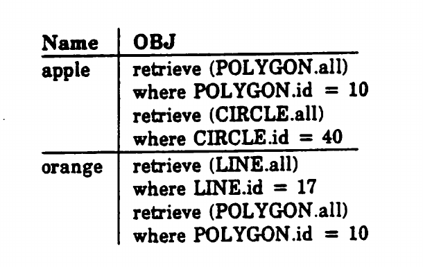
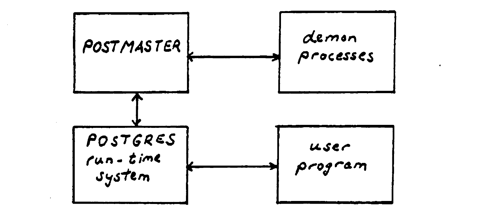
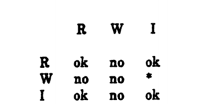
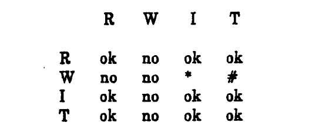
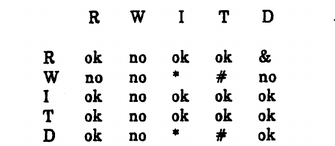
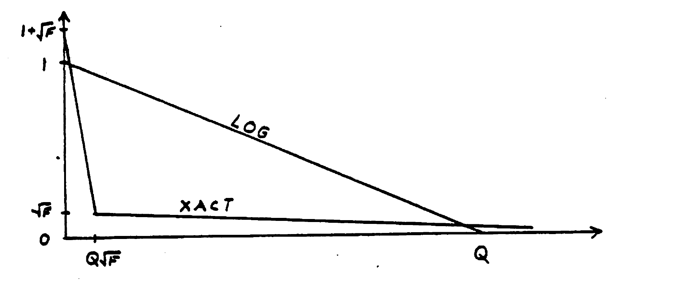

# The Design of POSTGRES（中文译文）

## 译者说明

本文依据同目录的 `source.pdf` 翻译。章节、图表、公式、算法、代码与参考文献按原文结构保留。

## 出版信息

Michael Stonebraker，Lawrence A. Rowe

加州大学伯克利分校电气工程与计算机科学系<br>
加利福尼亚州伯克利 94720

技术备忘录编号：UCB/ERL M85/95<br>
1985 年 11 月 15 日

本研究由以下项目资助：

- 美国空军科学研究办公室，项目 83-0254；
- 美国国防高级研究计划局，合同 N39-82-0235；
- 美国国家科学基金会，项目 DMC-85-04633。

版权 © 1985，归本文作者所有。保留所有权利。允许免费制作本文全部或部分内容的数字或纸质副本，供个人或课堂使用，前提是副本不用于营利或商业目的，并在首页保留本声明和完整引文。复制用于其他目的、再版、发布到服务器或分发到邮件列表，须事先获得明确许可。

## 摘要

本文给出一种新数据库管理系统 POSTGRES 的初步设计。POSTGRES 是 INGRES 关系数据库系统的后继者，旨在显著改进对复杂对象的支持，并为数据库提供一系列主动能力。它的设计目标包括：

1. 更好地支持复杂对象；
2. 允许用户扩展数据类型、运算符和访问方法；
3. 提供主动数据库能力，以及正向推理和反向推理；
4. 简化崩溃恢复；
5. 利用光盘、紧耦合多处理器工作站和定制 VLSI 芯片；
6. 对关系模型只作最少的改动，最好完全不改。

本文说明实现这些目标的系统设计，包括查询语言、与程序设计语言的接口、系统架构、查询处理策略和存储系统。

## 1. 引言

INGRES 关系数据库管理系统于 1975 至 1977 年间在加州大学完成。自 1978 年起，我们又构建了多个原型，把 INGRES 扩展到分布式数据库 [STON83a]、有序关系 [STON83b]、抽象数据类型 [STON83c]，并把 QUEL 本身作为一种数据类型 [STON84a]。我们还提出过一个新的应用程序接口 [STON84b]，但尚未制作原型。

经过这些实验，现有 INGRES 代码已被改动得足够多，继续在其上叠加功能不再合适。因此，我们正在从头构建一个新系统，并把它称为 POSTGRES，即“POST inGRES”。本论文描述 POSTGRES 的设计。

第 2 节讨论系统目标；第 3 节介绍查询语言 POSTQUEL；第 4 节说明程序设计语言接口；第 5 节讨论系统架构、查询处理和存储系统；第 6 节总结全文。

## 2. 设计目标讨论

关系数据模型已经证明，它能够很好地解决大多数商业数据处理问题。许多基于关系模型的商业系统正在进入市场，并会逐步替代更早一代的 DBMS 技术。然而，传统关系系统并不适合许多工程应用，例如 CAD 系统、程序设计环境、地理数据和图形。工程数据通常比商业数据更复杂、变化更频繁；虽然可以在传统关系系统上模拟所需类型，应用性能却无法接受。我们因此着手设计和实现以关系模型为基础的新一代 DBMS。本节说明这一系统的主要设计目标。

POSTGRES 的第一个目标是更好地支持复杂对象。考虑一个地理数据库，其中有三种对象：多边形、圆和直线。可以用三个关系表示它们：

```text
POLYGON (id, other fields)
CIRCLE (id, other fields)
LINE (id, other fields)
```

另有一个关系描述显示属性：

```text
DISPLAY(color, position, scaling, obj-type, object-id)
```

为了绘制所有对象，应用程序必须执行类似下面的循环：

```text
foreach OBJ in {POLYGON, CIRCLE, LINE} do
   range of O is OBJ
   range of D is DISPLAY
   retrieve (D.all, O.all)
   where D.object-id = O.id
   and D.obj-type = OBJ
```

如果屏幕上有许多对象，这种方法会触发许多查询，很难在一到两秒内完成绘制。我们希望能够把对象本身放进 `DISPLAY` 的一个字段中，从而让应用程序以更自然、更高效的方式处理这类复杂对象。

第二个目标是让系统可扩展。传统 DBMS 只有少量内置数据类型和访问方法。CAD/CAM 可能需要几何类型，地图应用可能需要经纬度位置类型；用内置类型模拟它们会产生冗长而费解的查询，也可能性能很差。用户应当能够增加新的数据类型、新运算符和新的访问方法。例如，多维点数据可能适合 K-D-B 树 [ROBI81]，多边形数据可能适合 R-tree [GUTM84]。关键是，非数据库专家也应当能实现这些扩展，所以所有用户可编写代码的接口都必须易于使用。DeWitt 与 Carey 等研究者也在追求类似目标 [DEWI85]。系统不能把类型系统、运算符语义和访问路径永久写死在核心代码中。

第三个目标是支持主动数据库和规则。数据库系统传统上只响应用户明确提交的查询。我们希望它还能够在数据发生特定变化时主动采取行动。例如，可以设置一个 alerter：当某个软件错误报告被修改时通知相关人员；也可以设置一个 trigger：删除一个部门时，连带删除该部门的所有员工。

规则还应当支持正向与反向推理。考虑一个计算教师年度授课负担的系统。它可能需要同时表达如下规则：

1. 正常授课负担为每年 8 个课堂接触小时；
2. 排课负责人减免 25%；
3. 系主任不承担教学；
4. 研究休假按休假比例减免；
5. 少于 10 名学生的课程，每名学生只计 0.1 个课堂接触小时；
6. 超过 50 名学生的课程，每超过一名学生额外增加 0.01 个课堂接触小时；
7. 教师可以把最多 2 个课堂接触小时的盈余或亏欠结转到下一年度。

这组规则会相互作用，而且可能存在例外和优先级。数据库系统应能直接保存并执行它们，而不是迫使每个应用程序重复实现同一套逻辑。

第四个目标是简化崩溃恢复。多数 DBMS 都包含大量恢复代码；这些代码难写、充满特殊情况，也很难测试和调试。由于 POSTGRES 还要允许用户定义访问方法，恢复模型尤其必须简单并容易扩展。POSTGRES 将把恢复所需的日志当作普通数据库数据来管理，这既能减少专用恢复代码，也能同时支持历史数据访问。用户定义的访问方法由此可以参与恢复，而无需核心系统事先知道每种方法的内部细节。

第五个目标是利用新硬件。光盘，包括可写光盘，已经开始进入商业市场；虽然访问较慢，但其性价比和可靠性可能很有吸引力。紧耦合多处理器工作站可以提供更多 CPU 资源；定制 VLSI 芯片则可能加速关键路径。POSTGRES 的体系结构应把光盘纳入存储层次、自然使用多个处理器，并能有效利用专用硬件，而不是被传统磁盘和单处理器假设束缚。

第六个目标是尽量不修改关系模型。商业数据处理用户会越来越熟悉关系概念，应尽可能保留这一框架。Codd 提出的“斯巴达式简洁”论点 [CODD70] 在今天仍与 1970 年时一样成立。我们不相信存在一个单一的小型“语义数据模型”，能够预先解决所有应用的建模问题：泛化层次无法解决 CAD 数据结构问题，而 CAD 社区的设计模型也处理不了一般的泛化层次。更好的办法不是采用庞大、复杂的数据模型，而是在一个小而简单的关系核心之上提供可扩展机制。因此，POSTGRES 将在保持关系模型的同时，通过类型、过程、规则和访问方法扩展它的能力。其他研究者也在以不同方法追求相近目标 [AFSA85, ATKI84, COPE84, DERR85, LORI83, LUM85]。

## 3. POSTQUEL

POSTQUEL 保留 Codd 原始定义中的关系模型：数据库仍由关系集合组成，每个关系中的元组具有相同字段，每个字段中的值具有相同数据类型。语言以 INGRES 查询语言 QUEL [HELD75] 为基础；为区别于原语言和其他 QUEL 扩展 [STON85a, KUNG84]，新语言称为 POSTQUEL。下列 QUEL 命令保持不变：`Create Relation`、`Destroy Relation`、`Append`、`Delete`、`Replace`、`Retrieve`、`Retrieve into Result`、`Define View`、`Define Integrity` 和 `Define Protection`。原来用于指定关系存储结构的 `Modify` 命令被省略，因为所有关系都采用支持历史数据的预定结构；`Index` 命令保留，以便定义其他数据访问路径。下面介绍 POSTQUEL 对复杂对象、用户定义类型和访问方法、时变数据、迭代查询、alerter、trigger 与规则的扩展。

### 3.1 数据定义

POSTGRES 内置六类数据类型：整数、浮点数、定长字符串、任意维数且无固定上界的定长元素数组、POSTQUEL，以及过程。标量字段继续用普通点号引用，例如 `EMP.name`。数组用于信号、图像或语音等大型同质序列，`EMP.picture[i]` 表示图片数组的第 `i` 个元素。文本是字符一维数组的特例；数组可以动态扩展。类型系统本身也可扩展，用户可通过类似 ADT-INGRES [STON83c, STON86] 的接口加入新的基本类型和运算符。

POSTQUEL 本身也是一种数据类型。一个字段可以保存一条查询，应用程序可以通过多重点号沿查询结果继续取字段。例如：

```text
EMP.hobbies.battingavg
```

它表示先求出员工的 `hobbies`，再从该对象中取出 `battingavg`。

过程也是一种数据类型。过程可以用 EQUEL 或 Rigel [ROWE79] 编写并存入关系。假设有：

```text
EMP(name, age, salary, hobbies, dept)
```

可以执行某位员工 `hobbies` 字段中的过程：

```text
execute (EMP.hobbies)
where EMP.name = "Smith"
```

同一个 POSTQUEL 字段可以包含多个 retrieve 命令，而不同命令可能返回不同记录类型，所以结果可以是一串异构元组。程序设计语言接口必须允许调用程序动态确定返回记录的类型，并访问其字段。因此，关系字段不仅能保存传统标量值，还能保存查询和可执行过程。

### 3.2 复杂对象

可以用下面的定义保存命名对象：

```text
create OBJECT (name = char[10], obj = postquel)
```

图 1 给出 `OBJECT` 关系的一个实例。`apple` 由编号为 10 的多边形和编号为 40 的圆组成；`orange` 由编号为 17 的直线和同一个编号为 10 的多边形组成。共享对象只需在两个 POSTQUEL 值中引用同一个关系元组。



**图 1：`OBJECT` 关系示例。** `apple` 的 `obj` 依次检索 `POLYGON.id = 10` 与 `CIRCLE.id = 40`；`orange` 依次检索 `LINE.id = 17` 与同一个 `POLYGON.id = 10`。

同一个对象还可以有多个表示。缓存一种更适合特定用途的数据结构，同时保留易于访问的关系表示，在数据库内部描述符和表单系统 [ROWE85] 中都很常见。例如，可以增加一个用 C 编写、把关系表示转换为显示列表的过程字段：

```text
create OBJECT(name=char[10], obj=postquel, display=cproc)
```

但直接这样做有两个问题：过程源码会在每个 `OBJECT` 元组中重复，C 过程也会重复 `obj` 字段中已经保存的子对象查询。解决办法是把可复用过程规范化到独立关系，并把对象名作为参数传入：

```text
create OBJPROC(name=char[12], proc=cproc)

append to OBJPROC(name="display-list", proc="...source code...")

execute (OBJPROC.proc)
with ("apple")
where OBJPROC.name = "display-list"
```

`display-list` 过程可以再执行对象中保存的 POSTQUEL：

```text
execute (OBJECT.obj)
where OBJECT.name = argument
```

这样，数据库只保存一份过程源码，也只保存一份描述对象组成的查询。虽然结构稍复杂，但复杂对象的组成、共享和多种外部表示都可以直接用关系、查询值和过程值表达。第 4、5 节将说明如何通过编译和预计算高效支持这两种字段。

### 3.3 随时间变化的数据

POSTGRES 保留关系的历史版本。可以查询指定时间点的关系，例如：

```text
retrieve (E.all)
from E in EMP["7 January 1985"]
```

系统也允许显式丢弃历史：

```text
discard EMP before "1 week"
discard EMP before "now"
discard EMP
```

第一条命令保留最近一周的历史，第二条与第三条都只保留该关系的当前数据。一般形式 `relation-name[date1,date2]` 指定一个时间区间。省略 `date1` 表示从关系创建到 `date2` 的全部数据；省略 `date2` 表示从 `date1` 到现在的全部数据；两者都省略，即空方括号，表示关系的全部历史。例如：

```text
retrieve (E.all)
from E in EMP[ ]
where E.name="Smith"
```

POSTQUEL 用 `from` 子句替代 QUEL 的 `range` 声明，因为保存在字段中的查询必须具有明确、封闭的作用域。

方括号时间限定隐式定义了一个 snapshot [ADIB80]。实现会沿关系历史向后寻找适当元组；用户也可用 `Retrieve-into` 把 snapshot 物化为另一个关系。历史数据可分布在三级存储层次中：主存保存最活跃的数据，磁性二级存储保存当前数据，光学三级存储保存历史。用户仍以统一的时间语法访问它们，不必知道数据实际位于哪一级。

POSTGRES 还支持关系版本 [KATZ85, WOOD83]。默认情况下，关系中的数据不被物理删除或覆盖，普通查询总是访问当前元组。版本可以基于关系，也可以基于 snapshot；可以从一个关系创建新版本：

```text
newversion EMPTEST from EMP
```

对版本的更新不改变基础关系；基础关系后续发生的更新仍会透过版本可见，除非该值已在版本中被修改。若希望像多数源码控制系统 [TICH82] 一样得到不随基础关系变化的版本，可以从 snapshot 创建版本。随后把修改合并回原关系：

```text
merge EMPTEST into EMP
```

`Merge` 采用半自动过程解决版本与基础关系中的冲突更新 [GARC84]。这种机制适合设计数据库等需要试验性修改和版本合并的场景。

### 3.4 迭代查询、Alerter、Trigger 与规则

在命令后加 `*` 可以表示迭代执行。考虑员工关系：

```text
create EMP(name=char[20],...,mgr=char[20],...)
```

可以递归找出 Jones 的所有直接和间接下属：

```text
retrieve* into SUBORDINATES(E.name, E.mgr)
from E in EMP, S in SUBORDINATES
where E.name="Jones"
   or E.mgr=S.name
```

星号表示反复执行该命令，直到结果不再变化。`*` 可用于 `Append`、`Delete`、`Execute`、`Replace`、`Retrieve` 和 `Retrieve-into`。由多条迭代查询组成的序列还可以表达 A-* 启发式搜索一类复杂迭代 [STON85b]。

Alerter 是持续存在的查询。例如：

```text
retrieve always (EMP.all)
where EMP.name = "Bill"
```

每当满足条件的数据发生变化时，结果会通过 portal 返回给发出命令的程序。[^1]

Trigger 则是持续存在的更新命令。例如，下面的规则在某个部门没有员工时删除该部门：

```text
delete always DEPT
where count(EMP.name by DEPT.dname
          where EMP.dept = DEPT.dname) = 0
```

这种 `always` 命令实现正向链式推理：数据库变化后，所有可能受影响的规则都被触发，直至系统达到稳定状态。

POSTGRES 也支持反向链式推理。假设有：

```text
PARENT(parent-of, offspring)
```

可以把祖先关系定义为一个普通视图加一个递归视图：

```text
range of P is PARENT
range of A is ANCESTOR

define view ANCESTOR (P.all)

define view* ANCESTOR (A.parent-of, P.offspring)
where A.offspring = P.parent-of
```

查询：

```text
retrieve (ANCESTOR.parent-of)
where ANCESTOR.offspring = "Bill"
```

会按需使用这些定义，推导 Bill 的所有祖先。

传统推理实现会用增强的视图机制或等价机制 [ULLM85, WONG84, JARK85]。当只有少量定义且不会产生冲突答案时，这种方法很好；但定义很多时，必须快速找出真正有用的定义，定义冲突时还要有优先级。规则可以用多个定义表达带例外的知识。下面根据年龄为员工分配钢制或木制办公桌：

```text
define view DESK-EMP (EMP.all, desk = "steel")
where EMP.age < 40

define view DESK-EMP (EMP.all, desk = "wood")
where EMP.age >= 40

define view DESK-EMP (EMP.all, desk = "wood")
where EMP.name = "hotshot"

define view DESK-EMP (EMP.all, desk = "steel")
where EMP.name = "bigshot"
```

40 岁以上员工使用木桌，40 岁以下使用钢桌；`hotshot` 和 `bigshot` 则是与年龄无关的例外。后两个规则具有更高优先级。查询：

```text
retrieve (DESK-EMP.desk)
where DESK-EMP.name = "bigshot"
```

需要优化并运行四个独立命令，而且第二、第四条会产生冲突答案。POSTGRES 因此用虚拟列支持反向链式规则：虚拟列不存值，而是按需推导；除了增删规则外，不能直接更新。相同的四条规则写成：

```text
replace demand EMP (desk = "steel") where EMP.age < 40
replace demand EMP (desk = "wood") where EMP.age >= 40
replace demand EMP (desk = "wood") where EMP.name = "hotshot"
replace demand EMP (desk = "steel") where EMP.name = "bigshot"
```

其中第三、第四条定义为比前两条更高的优先级。访问 `desk` 字段时，系统才处理这些 `demand` 命令，为取出的每个 `EMP` 元组确定适当值。这样，POSTGRES 可以在一个统一框架内表达 alerter、trigger、正向规则、反向规则和例外。

[^1]: 严格地说，数据是通过第 4 节定义的 portal 返回给程序的。

## 4. 程序设计语言接口

POSTGRES 的程序设计语言接口称为 HITCHING POST。设计有三个目标：第一，简化浏览式应用程序的开发；第二，接口必须足够强大，使包括 ad hoc 终端监视器和嵌入式查询语言预处理器在内的所有数据库程序都能用它编写；第三，允许应用开发者用灵活性和可靠性换取性能，从而调优程序。程序可以执行任何 POSTQUEL 命令；取回数据的核心抽象是 portal。Portal 类似 cursor [ASTR76]，但允许随机访问查询结果，也能一次 fetch 多条记录。本设计与此前提出的 portal [STON84b] 不同，但目标相同。

### 4.1 Portal

下面的命令建立一个名为 `P` 的 portal：

```text
retrieve portal P(EMP.all)
where EMP.age < 40
```

后端收到该命令后生成取数计划。Portal 可以看作后端 DBMS 进程中正在执行的查询计划，加上前端应用进程中存放已取数据的缓冲区。程序可以取出一批元组并移动当前位置：

```text
fetch 20 into P
move P forward 10
fetch 20 into P
move P backward 10
fetch 20 into P
move P forward to 63
```

也可以按值定位：

```text
move P forward to salary > 25K
```

或只取满足附加条件的元组：

```text
fetch 20 into P where salary > 25K
```

`fetch 20 into P` 把前 20 条记录放入前端，`P[i]` 引用上次 fetch 的第 `i` 条记录，`P[i].name` 引用它的 `name` 字段；下一次 fetch 会替换前端缓冲区中的旧数据。Portal 的“当前位置”是上次 fetch 返回的第一条元组；若此后执行过 move，则是下一次 fetch 将返回的第一条元组。后端还保存当前位置的序号，所以既能前后相对移动，也能跳到绝对位置。按谓词 move 只把 portal 定位到第一条合格元组，随后的普通 fetch 仍可能返回不满足谓词的相邻元组；带 `where` 的 fetch 才会继续执行计划，直到找到 20 条合格元组或耗尽结果。

与 cursor 不同，Portal 中的数据不能直接更新，而要更新产生 portal 的基础关系。例如：

```text
replace EMP(salary=NewSalary)
where EMP.name = "Smith"

fetch 20 into P
```

`Replace` 修改 `EMP` 中 Smith 的元组，随后的 `Fetch` 让浏览器缓冲区与数据库重新同步。此前的设计把 portal 看作有序视图，并把更新当作视图更新；这里把它看作查询计划，所需实现代码更少，但我们认为两种模型都可行。程序语言绑定负责把 portal 的字段映射成宿主语言变量。由于一次只把有限数量的元组送到前端，应用程序可以浏览任意大的结果，而不必把全部结果装入内存。

复杂对象也可以通过 portal 处理。假设有：

```text
EMP(name, salary, age, hobbies)
SOFTBALL(name, position, batting-avg)
COMPUTERS(name, isowner, brand, interest)
```

应用程序可以执行员工的 `hobbies` 字段并把结果作为 portal `H`：

```text
execute portal H(EMP.hobbies)
where EMP.name = "Smith"
```

然后用同样的 fetch 与 move 操作浏览 `SOFTBALL` 或 `COMPUTERS` 形式的结果。由于一个人可能有多种爱好，缓冲区记录也可能具有不同类型；HITCHING POST 必须提供例程，让程序逐条确定字段数量，以及每个字段的类型、名称和值。

### 4.2 编译与 Fast-Path

数据库命令本身可以作为数据保存。假设有：

```text
CODE(id, owner, command)
```

可以保存一条带参数的更新命令：

```text
append to CODE(id=1, owner="browser",
   command="replace EMP(salary=$1) where EMP.name=$2")
```

随后按普通方式执行它：

```text
execute (CODE.command)
with (NewSalary, "Smith")
where CODE.id=1 and CODE.owner="browser"
```

把命令放入 `CODE` 本身不会加速执行。常驻的编译 daemon 会检查每个数据库中的 `CODE` 条目，并利用空闲时间编译查询；编译后便可省去解析和优化。第 5 节将给出 schema 变化时使编译查询失效的通用机制。若调用者与定义命令的用户相同，系统还可使用 fast-path 接口，绕过查询解析和目录查找：

```text
exec-fp(1, "browser", NewSalary, "Smith")
```

该运行时例程用二进制格式把唯一标识、参数列表和每个值的位置直接发给后端。后端取得编译计划 - 必要时从缓冲池取得 - 不再做类型检查便代入参数并启动计划；整条路径将人工优化，以尽可能降低调用开销。任何 POSTQUEL 命令，包括 portal 命令，都能使用编译和 fast-path。这种机制既保留了把命令当作普通关系数据管理的灵活性，又能为频繁调用的操作提供接近过程调用的执行开销。

## 5. 系统架构

### 5.1 进程结构

为了保护数据，DBMS 代码必须与访问数据库的应用程序运行在不同进程中。数据库系统通常在两种进程结构之间选择。第一种是“每用户一个数据库进程” [STON81]：每个用户的前端程序与自己的数据库后端通信。第二种是服务器结构：一个数据库进程为所有应用程序处理请求。在要求高性能的大型机器上，服务器模型可以共享打开的文件描述符和缓冲区，并优化任务切换和消息开销；但它实际上要求实现相当完整的专用操作系统。每用户一进程更易实现，却在多数传统操作系统上性能稍差。经过慎重权衡，我们考虑到编程资源有限、POSTGRES 本身已很有野心，不愿再承担服务器结构令项目无法运行的风险，因而选择在 UNIX 4.3 BSD 上实现每用户一进程模型。

每台机器在系统生成（sysgen）时启动一个 POSTMASTER。由于 4.3 BSD 没有共享段，它包含锁管理器，并负责协调异步编译用户命令等后台 daemon。每个用户会话有一个前端应用进程和一个 POSTGRES 后端进程；一个程序也可以同时有多条命令在执行。二者采用简单的请求-应答协议通信：请求包含命令标识和保存参数的字节序列，响应包含返回码及命令要求的其他数据。不同于 INGRES [STON76]，后端不会用数据“塞满”通信通道；前端每条命令只请求有界数量的数据。



**图 3：POSTGRES 的进程结构。** 原文编号从图 1 跳到图 3，没有图 2。

图 3 展示了这种结构。用户程序与自己的 POSTGRES 运行时后端通信，后端再与 POSTMASTER 通信；POSTMASTER 还控制后台 daemon 进程。由于 4.3 BSD 没有共享段，锁管理器位于 POSTMASTER 中。用户程序和后端之间采用前述有界请求-应答消息协议。

### 5.2 查询处理

POSTGRES 查询处理器必须处理传统关系查询，也必须理解用户定义的类型和运算符、过程数据以及持续存在的规则。本节分别讨论这些问题。

#### 5.2.1 对新类型的支持

优化器不能预先知道每个用户定义运算符的代数性质。因此，POSTGRES 把这些性质保存在目录中。对于小于号、等号及其相关运算符，可记录如下规则：

- P1：传递性。如果 `A < B` 且 `B < C`，则 `A < C`。
- P2：非对称性。如果 `A < B`，则不可能有 `B < A`。
- P3：三歧性。`A < B`、`A = B` 和 `A > B` 三者中恰有一个成立。
- P4：`A <= B` 等价于 `A < B` 或 `A = B`。
- P5：等号具有对称性，即 `A = B` 等价于 `B = A`。
- P6：`>` 是 `<` 的逆运算符。
- P7：`>=` 是 `<=` 的逆运算符。

任何服从 P1-P7 的运算符集合都可以使用 B-tree。定义新运算符的协议与 ADT-INGRES [STON83c] 相似；建立索引时，用户只需声明要采用的运算符集合。这些信息使优化器能够规范化谓词、识别矛盾、交换参数并选择可用索引，而无需在代码中写死某种类型。

每个运算符还可提供代价与选择率信息。对形式为：

```text
relation.column OPR value
```

的限制谓词，运算符定义会提供要访问的页面数和要检查的元组数。对可参与 join 的运算符，目录还保存 join 选择率和可用的 join 策略。嵌套循环总是可用；merge join 还必须说明能否使用，以及分别用什么运算符对两个关系排序；hash join 也只在定义声明可用时才能采用。整个机制由目录表驱动，因此加入新类型、运算符和访问方法时，不必修改优化器主体。

#### 5.2.2 对过程数据的支持

当关系字段保存 POSTQUEL 或过程时，系统可采用两种加速策略。第一种是预计算：执行对象并缓存答案。第二种是编译：解析和优化命令，把计划缓存起来，在以后用 fast-path 执行。如果答案很小，可以直接放在对象字段中；如果答案较大，则保存一个指向结果关系的指针。

现有系统通常算出答案后立即丢弃，只用特殊代码使访问计划失效并重算。POSTGRES 则计划同时缓存计划和答案。后台 daemon 利用空闲时间或空闲处理器编译计划并预计算答案。插入过程值时，运行时也记录提交用户；编译过程代表该用户检查保护权限，执行过程字段时仍会检查调用者是否获准。只有执行用户与定义用户相同时，才能走 fast-path，这样就无需在运行时访问系统目录，也不会用缓存计划绕过访问控制。最理想时，过程值已经缓存，访问可以立即完成；更常见时，至少已有可复用的访问计划。

缓存对象必须在其依赖数据变化时失效：schema 不适当地改变时，编译计划失效；被访问的数据改变时，缓存答案失效。我们比较过多种实现 [STON85c]，这里采用持久的 `I`（invalidate-me）锁。命令编译或答案预计算时，POSTGRES 在期间访问的全部数据库对象上设置 `I` 锁。锁可细到元组甚至字段，也可以向更粗粒度升级，必须正确检测 phantom [ESWA75]。锁信息保存在数据记录中，因此即使建立缓存的进程已经退出或系统崩溃，依赖关系仍然存在。

图 4 给出 `I` 锁与普通读锁 `R`、写锁 `W` 的兼容性。



**图 4：`I` 锁的兼容模式。** `ok` 表示兼容，`no` 表示不兼容；`*` 表示写操作使持有该 `I` 锁的预计算对象失效。

可以用所有关系都具有的特殊字段 `I`，查询哪些命令在目标元组上持有 `I` 锁：

```text
retrieve (relation.I) where qualification
```

该查询返回在合格元组上持有 `I` 锁的命令标识，使用户能够预先看出一次更新会使哪些缓存失效。不包含更新的 POSTQUEL，以及既不执行输入输出也不更新数据库的过程，都可以安全地预计算。发生冲突写入时，系统不必阻塞写者，而是使缓存结果失效，待下次使用时重算。

#### 5.2.3 Alerter、Trigger 与推理

每条 `always` 命令先反复运行，直到不再产生效果。系统随后再运行一遍，并在该命令要读写的全部对象上建立 `T` 锁，记录哪些数据变化会使它再次满足。休眠的 `always` 命令保存在系统关系的 POSTQUEL 字段中。

图 5 给出 `T` 锁的兼容关系。



**图 5：`T` 锁的兼容模式。** `ok` 表示兼容，`no` 表示不兼容；`*` 表示使预计算对象失效，`#` 表示唤醒相应的 `always` 命令。

`T` 锁也是持久、细粒度且可升级的。每个关系都增加特殊字段 `T`，可从中取得持有该元组 `T` 锁的命令标识。写操作遇到 `T` 锁时不阻塞写者，而是唤醒对应的休眠规则。

反向推理使用 `D`（demand）锁。图 6 给出完整兼容矩阵。



**图 6：`D` 锁的兼容模式。** `ok` 表示兼容，`no` 表示不兼容；`&` 表示像查询修改一样代入 demand 命令，`*` 表示缓存失效，`#` 表示唤醒持续规则。

每条 `demand` 命令先运行到能确定它打算写入的对象集合，然后在这些对象上加 `D` 锁，并把命令放入系统目录的 POSTQUEL 字段。查询遇到 `D` 锁时，系统把对应 demand 命令代入原查询，方式类似视图的查询修改，形成一个待满足的子目标。若子目标又遇到 `D` 锁，就继续产生新子目标；直到某个子目标完成并生成答案，过程才开始返回。中间目标执行时若设置 `I` 锁，答案也可以缓存，并在必要时失效。参数匹配采用类似 PROLOG [CLOC81] 的 unification，因此只推导当前查询真正需要的事实；优先级方案和算法细节见 [STON85b]。由此，POSTGRES 用同一套持久锁和规则目录支持预计算、alerter、trigger、正向链式推理与反向链式推理。

### 5.3 存储系统

POSTGRES 预计把全部二级索引和最近的数据库元组放在磁盘，把较旧历史归档到光盘等介质。后台 daemon 连续执行 vacuum，把不再活跃的版本移向光学存储。磁盘数据使用普通 UNIX 文件系统，每个关系一个文件；光盘则是一个大型仓库，不同关系的元组彼此混放。所有关系以 heap 保存，也可声明为“近似有序”，由 POSTGRES 尽量让元组接近某个列的排序顺序。二级索引由两个独立的物理索引组成：一个对应磁盘元组，一个对应光盘元组；二者都放在磁盘上的独立 UNIX 文件中。系统还为每个关系自动维护一个按不可变元组标识符 `IID` 建立的二级索引，使任意关系均可顺序扫描。

#### 5.3.1 数据格式

每个元组包含如下系统字段：

```text
IID       : immutable id
tmin
BXID
tmax
EXID
v-IID
descriptor
```

`IID` 是在元组创建时由 POSTGRES 分配、永不改变的 64 位标识符。事务标识 `XACTID` 也是系统分配的唯一 64 位量；系统时钟可按需返回近似当前时刻的时间戳。`tmin` 是该版本开始有效的时间，`BXID` 是创建该版本的事务标识；`tmax` 是该版本停止有效的时间，`EXID` 是使它失效的事务标识。`v-IID` 把同一逻辑对象在本版本或其他版本中的元组连接起来。物理记录把所有非空字段相邻存放，`descriptor` 保存每个非空字段的起始偏移，类似 System R 元组上的结构 [ASTR76]。

这种格式让版本信息与普通元组一起保存。创建元组的事务填入第一组时间戳和事务标识。更新不会就地覆盖旧版本，而是在旧元组的第二组槽中填入更新事务的标识和时间戳，并在数据库中建立一个新元组。

#### 5.3.2 更新与访问规则

插入元组时，`tmin` 记为插入事务的时间戳，`BXID` 记为其标识；删除时，`tmax` 和 `EXID` 分别记为删除事务的时间戳和标识；更新被建模为先插入后删除。在时间 `T` 访问关系时，若元组满足查询条件 `QUAL`，且符合下列任一条件，就应返回它：

1. `tmin < T < tmax`，并且 `BXID` 和 `EXID` 都已提交；
2. `tmin < T`、`tmax = null`，并且 `BXID` 已提交；
3. `tmin < T`，`BXID` 已提交，而 `EXID` 尚未提交。

光盘上的归档元组只需满足第一种条件，因为它们已经形成封闭的历史区间。磁盘上的当前元组则可能处于后两种状态。访问方法把这些版本与事务状态规则结合起来，向查询提供一致的时间切片。

#### 5.3.3 POSTGRES 日志与 Accelerator

系统按顺序为每个新事务分配 `XACTID`。事务提交时，必须先把它写过的全部数据页强制刷出内存 - 至少进入稳定存储 - 然后只需向 POSTGRES 日志以及可选的事务 accelerator 写一个位。POSTGRES 使用三个时间边界：

- `T1`：最近分配的事务号；
- `T2`：比最老活动事务更早的边界；
- `T3`：比其数据仍在磁盘上的最老已提交事务更早的边界。

事务有三种状态：`0` 表示 abort，`1` 表示 commit，`2` 表示仍在 progress。`T2` 与 `T3` 之间的事务只需一个状态位；早于 `T3` 的事务已归档，不再需要日志记录。

逻辑 `LOG` 关系可以表示为：

```text
line-id
bit-1[1000]
bit-2[1000]
```

事务号 `i` 存在 `line-id = floor(i/1000)` 的记录中，数组位置为 `i` 除以 1000 的余数；两组位共同编码事务状态。`T1`、`T2`、`T3` 和最近的日志块放在“安全主存”中；估计只需 1K 至 10K 字节，即 10 至 100 个块。安全主存可由带不间断电源的双份或三份普通内存构成。

物理上，系统把日志组织为由 `n` 个块组成的循环池，每块含 2000 位。high-water 指向当前最大事务号 `T1` 及其将使用的位，low-water 指向缓冲区中最老事务及其位。每启动一个事务就推进 high-water；当 high-water 接近 low-water 时，必须可靠地把最老日志块推到磁盘，并把 low-water 推进 1000。硬件结构提供四项操作：推进 high-water（开始事务）、推送块并更新 low-water、abort 事务、commit 事务。

理想情况下，块池足够大，块内全部事务在该块被推送前就已提交或中止，于是该块永远无需在磁盘上再次更新。长事务可能迫使含未结束事务的块提前写盘；它后来 commit 或 abort 时就必须较慢地更新磁盘块。此类 `LOG` 关系磁盘操作使用特殊的事务零执行，并遵循普通更新规则，以免日志更新本身再要求日志记录。

当 `T2` 推进时，trigger 会把已经无需双位表示的事务压缩成单个位。按每秒 5 个事务计算，完整 `LOG` 每年约增长 20 MB。

为了进一步减小内存和访问开销，POSTGRES 引入称为 accelerator 的 `XACT` 关系。它使用 Bloom-filter 风格的位图 [SEVR76]：

```text
line-id
bitmap[M]
```

对 `T2` 与 `T3` 之间的任一已中止事务，可用下面的更新设置相应位。令每条 `XACT` 记录覆盖 `N` 个事务，并令 `LOW = T3 - remainder(T3/N)`：

```text
replace XACT (bitmap[i] = 1)
where XACT.line-id = (XACTID - LOW) modulo N
and i = hash(remainder((XACTID - LOW) / N))
```

检查事务 `C-XACTID` 时读取：

```text
bitmap[hash(remainder((C-XACTID - LOW) / N))]
```

Vacuum 会周期性推进 `T3`，并删除对应于更老事务的 `XACT` 元组；另一个 trigger 周期性推进 `T2`，为刚刚落到该边界之后的所有中止事务执行上述更新。位为 0 可以确定事务已经提交；位为 1 则可能是目标事务中止，也可能是哈希冲突，需要回到 `LOG` 确认。这样，较小的 `XACT` 缓存可以过滤大部分日志访问。

#### 5.3.4 Accelerator 分析

设 `M = 1000`，缓冲区大小为 `B` 位，事务查询失败概率为 `F`，每个 `XACT` 位图平均有 `X` 位被置位。选择：

```text
N = X / F
```

若系统处理了 `Q` 个事务，则 `XACT` 需要的位数为：

```text
Q * F * 1000 / X
```

假设：

```text
F * 1000 / X << 1
```

直接缓存 `LOG` 时，缺页概率为：

```text
FAULT(LOG) = 1 - B / Q
```

使用 `XACT` 时，一个目标位图不在缓冲区中的概率为：

```text
P(XACT) = 1 - (B * X) / (Q * F * 1000)
```

即使位图在缓冲区中，观察到 1、因而仍需查 `LOG` 的概率也是 `X / 1000`。因此，当：

```text
B < Q * F * 1000 / X
```

时：

```text
FAULT(XACT) = P(XACT) + X / 1000
```

若 `B` 更大，accelerator 不再占用全部缓冲区，剩余空间可以缓存 `LOG`，所以 `FAULT(XACT)` 会继续下降。

两种方案的缺页概率之差为：

```text
delta = FAULT(LOG) - FAULT(XACT)
```

当：

```text
X = 1000 * sqrt(F)
```

时，收益最大。此时：

```text
size(XACT) = sqrt(F) * size(LOG)
```

如果 `B = size(XACT)`，缺页概率可以从 `1 - sqrt(F)` 降到 `sqrt(F)`。当 `F = .01` 时，`XACT` 的大小只有 `LOG` 的十分之一，缺页概率从 `.9` 降到 `.1`；当 `F = .1` 时，它约使用三分之一的缓冲空间，并把缺页概率减半。



**图 7：`LOG` 与 `XACT` 的缺页次数期望值随缓冲区大小的变化。** 纵轴为期望缺页次数，横轴为缓冲区大小。

#### 5.3.5 事务管理

发生磁盘数据库仍完整的软崩溃时，系统只需把 `T2` 推进到 `T1`，并把崩溃时仍处于 progress 的事务全部标为 abort；随后即可恢复正常处理，预计几乎是瞬时的。硬崩溃意味着磁盘本身不完整，系统通过磁盘文件镜像保护数据：既可由硬件按卷镜像，也可由软件按文件镜像。由于更新采用版本追加方式，恢复不需要把每一项数据恢复到某个就地覆盖前的值。

并发控制使用传统两阶段锁管理器，同时处理读锁、写锁以及 `I`、`T`、`D` 锁。`R`、`W` 锁预计放在普通主存锁表中，后三者放在数据记录里。唯一额外扩展是“对象锁定”：用户可声明执行某个存储过程时不对其组件数据加锁。第一个执行者会对保存过程的元组加写锁，所以并发执行同一过程的第二个用户仍会被阻塞。只要所有用户保证不会绕开过程、直接盲目访问组成对象的关系，就可只在过程对象上放普通读写锁，而不锁各组件，并仍获得一致性。

#### 5.3.6 访问方法

POSTGRES 将提供 B-tree、OB-tree [STON83b] 和 ADT 机制定义的任意用户索引。每个二级索引实际上是一对索引：磁盘索引形如：

```text
index-relation (user-key-or-keys, pointer-to-tuple)
```

其结构与当前 INGRES 二级索引相同；归档索引则指向归档元组，并在用户键之外增加 `tmin` 与 `tmax`。每个关系还有自动的 `IID` 索引。

通常的谓词：

```text
where relation.key = value
```

实际上解释为：

```text
where relation["now"].key = value
```

一般的历史查询形式是：

```text
where relation[T].key = value
```

当前时刻的谓词只需搜索磁盘索引；一般历史查询要同时搜索磁盘和归档索引。两个索引都先按用户键筛选，归档索引还可用 `tmin` 与 `tmax` 进一步缩小搜索。Replace 要依次插入带适当 `BXID`、`tmin` 的新数据记录，在所有已定义键索引中插入记录，最后修改被更新旧记录的 `tmax`。原文接着写道 append 只执行“第一和第三步”，delete 只执行“第二步”；这一说法与紧邻的三步语义表面上不一致，本文按原文保留，不自行改写。若从旧元组保留指向新元组的指针，POSTGRES 就只需更新键值实际改变的索引；我们计划实现这一以运行时复杂性换磁盘写入量的优化。

新访问方法的实现者只需遵守两项强制顺序：新数据记录必须先于任何指向它的索引记录被强制刷出主存，否则索引会指向垃圾；一次操作中的多个索引更新，例如 page split，必须按正确顺序从叶到根刷出。缓冲管理器用一个低层命令表达顺序：

```text
order page1, page2
```

时机不佳的崩溃可能让多层树留下没有其他页面指向的 dangling index page，也可能让 heap 留下某些索引无法到达的未提交数据记录。`EXID` 未提交的 dangling tuple 由 vacuum 回收；若它未记录在任何索引中，就必须周期性扫描存储才能发现。Dangling index page 则用传统技术回收。

OB-tree 维护一个计数器，并用一个 danger bit 标记计数器可能不可靠的区间：

```text
counter-1 : same as counter
flag      : danger bit
```

OB-tree 的每个 inserter 或 deleter 在更新 `counter-1` 时都设置 danger flag。访问者若读到设置了该位的数据项，就中断当前算法，向下遍历树重新计算 `counter-1`，再向上回溯更新计数并清除标志，之后继续原计算。这样，下一事务会修复上一插入或删除事务留下的结构，OB-tree 仍能正确工作。

#### 5.3.7 磁盘 Vacuum

Vacuum daemon 扫描磁盘上的关系。`BXID` 与 `EXID` 都已提交的记录可以写到光盘或其他长期存储；任何 `BXID` 或 `EXID` 对应已中止事务的记录都可以丢弃。Vacuum 还回收前述 dangling page、dangling tuple 和无用索引项，并把足够老的历史移到光盘。

对可归档的历史记录，vacuum 严格按以下顺序执行：先把记录写入归档存储；再把记录插入归档 `IID` 索引；然后插入所有归档键索引；随后从磁盘存储删除该记录；最后从所有磁盘索引删除它。若中途崩溃，vacuum 可以从序列开头重新开始。经过持续 vacuum，磁盘上主要保留 `EXID = null` 的当前数据和很少量尚未归档的版本；归档层则只含有效记录，所以运行时永远无需再验证归档记录。我们预计磁盘空间约为当前数据库大小的 1.2 倍，而不是随全部历史线性增长。持续的记录更替也有助于维持磁盘数据在目标属性上的物理聚簇。

用户也可以显式请求 vacuum：

```text
vacuum rel-name where QUAL
```

或只处理足够老的版本：

```text
vacuum rel-name where rel-name.tmax < now - 20 days
```

#### 5.3.8 版本管理

每个独立版本分配一个 differential file [SEVR76]，记录相对于基础关系新增或删除的元组；版本上的二级索引与其基础关系的索引相对应。执行 POSTQUEL 时，系统先处理当前版本的差分关系。每遇到一个满足条件的元组，就把其 `v-IID` 记入“seen IDs”列表 [WOOD83]；之后遇到 `IID` 已在列表中的元组便丢弃。只要按逆时间顺序检查，就会先看到最新元组，再跳过早期版本。若当前版本建立在另一个版本上，就继续检查上一层的 differential file，直到基础关系。

若修改当前版本本身已有的元组，就按普通更新处理；若修改来自前一版本或基础关系的元组，则把被替换元组的 `IID` 写入新元组的 `v-IID`，再把新元组插入当前版本的 differential file。删除采用类似办法。

把试验版本合并回父版本时，系统对新版本中在时间 `T` 有效的每条记录逐项处理三类变化：

1. insert：把新元组插入目标关系；
2. delete：删除目标关系中的对应元组；
3. replace：组合一次 insert 与一次 delete。

若合并时试图删除一条已经删除的记录，就发生冲突，必须在算法之外处理；[GARC84] 的方法可能有助于调和此类冲突。成功合并后，可以通过执行同样操作并重命名旧版本，把较老版本向前滚入较新版本。这一机制直接支持 CAD、文档处理和其他需要长期分支设计的应用。

## 6. 总结

POSTGRES 通过可扩展类型系统定义关系的新列、列上的新运算符和新访问方法；这适合较简单的复杂对象。更复杂、具有共享子对象或多层嵌套的对象，则用 POSTGRES 过程定义。过程通过缓存编译计划，甚至缓存 retrieve 答案来优化。POSTQUEL 把查询和过程作为数据类型，并用时间限定和迭代命令表达新的数据库行为。Trigger 与规则分别使用 `always` 和 `demand` 修饰符，并由锁系统扩展高效支持，从而在数据管理器内部提供正向、反向两种控制流；当同一情形可能适用多条规则时尤其有吸引力。HITCHING POST 以 portal 和 fast-path 为应用程序提供统一接口。

不覆盖旧数据、再由 vacuum 把历史元组移入归档层，简化了崩溃恢复。新的存储系统比当时常见技术简单得多，并能自然支持按时间访问和版本。它的主要代价，是事务提交时必须把脏数据页推到稳定存储。

紧耦合多处理器可以让多个 POSTGRES 进程并行执行；定制硬件可以提供真正稳定的主存、支持 `LOG` 关系，并在运行时检查元组有效性。因此，前述目标也为未来硬件留下了直接的利用路径。

最重要的是，这些目标完全不要求修改关系模型。写作本文时，POSTGRES 的编码工作刚刚开始。我们希望大约一年后得到一个可运行的原型。

## 参考文献

正文引用键使用字母 `O`；扫描版参考文献表的相应键则写作 [CL0C81]、[C0PE84]、[R0BI81] 和 [ST0N81]。下列条目按正文键 [CLOC81]、[COPE84]、[ROBI81] 和 [STON81] 排列，并保留这一原文内部差异。

[CL0C81] 参考文献表键；对应正文引用键 CLOC81。

[C0PE84] 参考文献表键；对应正文引用键 COPE84。

[R0BI81] 参考文献表键；对应正文引用键 ROBI81。

[ST0N81] 参考文献表键；对应正文引用键 STON81。

[ADIB80] Adiba, M. E. and Lindsay, B. G., “Database Snapshots,” IBM San Jose Research Technical Report RJ-2772, March 1980.

[AFSA85] Afasarmanesh, H., et al., “An Extensible Object-Oriented Approach to Database for VLSI/CAD,” Proceedings of the 1985 Very Large Data Base Conference, Stockholm, Sweden, August 1985.

[ALLM76] Allman, E., et al., “Embedding a Relational Data Sublanguage in a General Purpose Programming Language,” Proceedings of the 1976 ACM-SIGPLAN-SIGMOD Conference on Data, Salt Lake City, Utah, March 1976.

[ASTR76] Astrahan, M., et al., “System R: A Relational Approach to Data,” ACM Transactions on Database Systems, June 1976.

[ATKI84] Atkinson, M. P., et al., “Progress with Persistent Programming,” in *Database, Role and Structure*, P. Stocker, ed., Cambridge University Press, 1984.

[BUNE79] Buneman, P. and Clemons, E., “Efficiently Monitoring Relational Data Bases,” ACM Transactions on Database Systems, September 1979.

[CLOC81] Clocksin, W. and Mellish, C., *Programming in Prolog*, Springer-Verlag, Berlin, Germany, 1981.

[CODD70] Codd, E., “A Relational Model of Data for Large Shared Data Bases,” Communications of the ACM, June 1970.

[COPE84] Copeland, G. and Maier, D., “Making Smalltalk a Database System,” Proceedings of the 1984 ACM-SIGMOD Conference on Management of Data, Boston, Massachusetts, June 1984.

[DERR85] Derritt, N., personal communication, HP Laboratories, October 1985.

[DEWI85] DeWitt, D. J. and Carey, M. J., “Extensible Database Systems,” Proceedings of the 1st International Workshop on Expert Data Bases, Kiawah, South Carolina, October 1984.

[ESWA75] Eswaran, K., “A General Purpose Trigger Subsystem and Its Inclusion in a Relational Data Base System,” IBM Research, San Jose, California, RJ 1833, July 1976.

[GARC84] Garcia-Molina, H., et al., “Data-Patch: Integrating Inconsistent Copies of a Database after a Partition,” Technical Report TR #304, Department of Electrical Engineering and Computer Science, Princeton University, 1984.

[HELD75] Held, G., et al., “INGRES: A Relational Data Base System,” Proceedings of the 1975 National Computer Conference, Anaheim, California, June 1975.

[GUTM84] Guttman, A., “R-trees: A Dynamic Index Structure for Spatial Searching,” Proceedings of the 1984 ACM-SIGMOD Conference on Management of Data, Boston, Massachusetts, June 1984.

[JARK85] Jarke, M., et al., “Data Constructors: On the Integration of Rules and Relations,” Proceedings of the 1985 Very Large Data Base Conference, Stockholm, Sweden, August 1985.

[KATZ85] Katz, R. H., *Information Management for Engineering Design*, Springer-Verlag, 1985.

[KUNG84] Kung, R., et al., “Heuristic Search in Database Systems,” Proceedings of the 1st International Workshop on Expert Data Bases, Kiawah, South Carolina, October 1984.

[LORI83] Lorie, R. and Plouffe, W., “Complex Objects and Their Use in Design Transactions,” Proceedings of Engineering Design Applications of ACM-IEEE Data Base Week, San Jose, California, May 1983.

[LUM85] Lum, V., et al., “Design of an Integrated DBMS to Support Advanced Applications,” Proceedings of the International Conference on Foundations of Data Organization, Kyoto University, Japan, May 1985.

[ROBI81] Robinson, J., “The K-D-B Tree: A Search Structure for Large Multidimensional Indexes,” Proceedings of the 1981 ACM-SIGMOD Conference on Management of Data, Ann Arbor, Michigan, May 1981.

[ROWE79] Rowe, L. A. and Shoens, K., “Data Abstraction, Views, and Updates in Rigel,” Proceedings of the 1979 ACM-SIGMOD Conference on Management of Data, Boston, Massachusetts, May 1979.

[ROWE82] Rowe, L. A. and Shoens, K., “FADS - A Forms Application Development System,” Proceedings of the 1982 ACM-SIGMOD Conference on Management of Data, Orlando, Florida, June 1982.

[ROWE85] Rowe, L., “Fill-in-the-Form Programming,” Proceedings of the 1985 Very Large Data Base Conference, Stockholm, Sweden, August 1985.

[SELI79] Selinger, P., et al., “Access Path Selection in a Relational Data Base System,” Proceedings of the 1979 ACM-SIGMOD Conference on Management of Data, Boston, Massachusetts, June 1979.

[SEVR76] Severance, D. and Lohman, G., “Differential Files: Their Application to the Maintenance of Large Databases,” ACM Transactions on Database Systems, June 1976.

[STON75] Stonebraker, M., “Implementation of Integrity Constraints and Views by Query Modification,” Proceedings of the 1975 ACM-SIGMOD Conference, San Jose, California, May 1975.

[STON76] Stonebraker, M., et al., “The Design and Implementation of INGRES,” ACM Transactions on Database Systems, September 1976.

[STON81] Stonebraker, M., “Operating System Support for Database Management,” Communications of the ACM, July 1981.

[STON83a] Stonebraker, M., et al., “Performance Analysis of a Distributed Data Base System,” Proceedings of the 3rd Symposium on Reliability in Distributed Software and Data Base Systems, Clearwater, Florida, October 1983.

[STON83b] Stonebraker, M., “Document Processing in a Relational Database System,” ACM Transactions on Office Information Systems, April 1983.

[STON83c] Stonebraker, M., et al., “Application of Abstract Data Types and Abstract Indexes to CAD Data,” Proceedings of the Engineering Applications Stream of 1983 Data Base Week, San Jose, California, May 1983.

[STON84a] Stonebraker, M., et al., “QUEL as a Data Type,” Proceedings of the 1984 ACM-SIGMOD Conference on Management of Data, Boston, Massachusetts, June 1984.

[STON84b] Stonebraker, M. and Rowe, L. A., “PORTALS: A New Application Program Interface,” Proceedings of the 1984 VLDB Conference, Singapore, September 1984.

[STON85a] Stonebraker, M., “Extending a Data Base System with Procedures,” submitted for publication.

[STON85b] Stonebraker, M., “Triggers and Inference in Data Base Systems,” Proceedings of the Islamorada Conference on Expert Data Bases, Islamorada, Florida, February 1985; to appear as a Springer-Verlag book.

[STON85c] Stonebraker, M., et al., “An Analysis of Rule Indexing Implementations in Data Base Systems,” submitted for publication.

[STON86] Stonebraker, M., “Inclusion of New Types in Relational Data Base Systems,” Proceedings of the Second International Conference on Data Base Engineering, Los Angeles, California, February 1986.

[TICH82] Tichy, W. F., “Design, Implementation, and Evaluation of a Revision Control System,” Proceedings of the 6th International Conference on Software Engineering, September 1982.

[TSIC82] Tsichritzis, D. C., “Form Management,” Communications of the ACM 25, July 1982.

[ULLM85] Ullman, J., “Implementation of Logical Query Languages for Data Bases,” Proceedings of the 1985 ACM-SIGMOD International Conference on Management of Data, Austin, Texas, May 1985.

[WONG84] Wong, E., et al., “Enhancing INGRES with Deductive Power,” Proceedings of the 1st International Workshop on Expert Data Base Systems, Kiawah, South Carolina, October 1984.

[WOOD83] Woodfill, J. and Stonebraker, M., “An Implementation of Hypothetical Relations,” Proceedings of the 9th VLDB Conference, Florence, Italy, December 1983.

[ZANI83] Zaniolo, C., “The Database Language GEM,” Proceedings of the 1983 ACM-SIGMOD Conference on Management of Data, San Jose, California, May 1983.
