# Dremel: Interactive Analysis of Web-Scale Datasets（中文译文）

## 译者说明

本文依据同目录的 `source.pdf` 翻译。章节、图表、公式、算法、代码与参考文献按原文结构保留。

## 摘要

Dremel 是一个可扩展的交互式即席查询系统，用于分析 web-scale 的只读嵌套数据。通过组合多级执行树和列式数据布局，Dremel 能够在数秒内对包含万亿行的表运行聚合查询。系统可扩展到数千 CPU 和 PB 级数据，并拥有数千名 Google 用户。本文描述 Dremel 的架构和实现，解释它如何补充基于 MapReduce 的计算。本文还提出一种面向嵌套记录的新型列式存储表示，并讨论系统在数千节点实例上的实验结果。

## 1. 引言

大规模分析型数据处理已经在 web 公司和各行业中广泛应用，尤其是低成本存储让组织能够收集大量业务关键数据。如何让 Google 内部的分析师和工程师能够高效理解这些数据变得越来越重要；交互式响应时间会从根本上改善数据探索、监控、在线客户支持、快速原型、数据管道调试等任务。

要执行大规模交互式数据分析，需要非常高的并行度。例如，在一秒内读取 1 TB 压缩数据，按今天的商品磁盘需要数千到上万个磁盘。类似地，CPU 密集型查询可能需要运行在数千 core 上才能在数秒内完成。Google 使用商品机器组成的共享集群来完成大规模并行计算 [5]。集群通常承载大量共享资源的分布式应用，不同应用的工作负载差异很大，机器硬件参数也不同。分布式应用中的某个 worker 可能比其他 worker 花费更长时间完成给定任务，也可能因为集群故障或管理系统抢占而永远无法完成。因此，处理 straggler 和 failure 对快速执行和容错至关重要 [10]。

Web 和科学计算中使用的数据通常是非关系的。因此，灵活的数据模型在这些领域很重要。编程语言中的数据结构、在分布式系统中交换的消息、结构化文档等，天然会形成嵌套表示。规范化并重组这类数据通常代价很高。嵌套数据模型是 Google 大多数结构化数据处理的基础 [21]，据报道其他主要 web 公司也在使用类似模型。

本文描述 Dremel 系统，它支持在 Google 共享集群上对超大数据集进行交互式分析。与传统数据库不同，Dremel 能够直接在原地嵌套数据上操作。原地意味着可以访问数据所在位置，例如 GFS [14] 等分布式文件系统，或 Bigtable [8] 等其他存储层。传统上，对这类数据执行查询常常需要一系列 MapReduce (MR [12]) 作业，而 Dremel 只需其中一小部分执行时间。Dremel 并不是为了替代 MR；它经常用于分析 MR pipeline 的输出，或快速原型化更大的计算。

Dremel 自 2006 年起已在生产环境中使用，拥有数千用户。Dremel 的多个实例部署在从数十到数千节点不等的系统上。使用示例包括：

- 分析爬取的 web 文档。
- 跟踪 Android Market 应用安装数据。
- 分析 Google 产品崩溃报告。
- 处理 Google Books 的 OCR 结果。
- 垃圾邮件分析。
- 调试 Google Maps 中的地图瓦片。
- 监控托管 Bigtable 实例中的 tablet migration。
- 分析 Google 分布式构建系统中的测试结果。
- 统计数十万磁盘的 I/O。
- 对 Google 数据中心运行的作业做资源监控。
- 分析 Google 代码库中的符号和依赖关系。

Dremel 建立在 web search 和并行 DBMS 的思想之上。首先，它的架构借鉴了分布式搜索引擎中使用的 serving tree 概念 [11]。与 web search 请求类似，查询被向下推送到树中，并在每一级重写；查询结果通过聚合树下层的回复形成。其次，Dremel 提供类似 SQL 的高级语言来表达即席查询。与 Pig [18] 和 Hive [16] 这类层不同，Dremel 原生执行查询，不把查询翻译成 MR 作业。最后且非常重要的是，Dremel 使用 column-striped storage representation，使它能够从二级存储读取更少数据，并通过更便宜的压缩降低 CPU 成本。列存已经用于分析关系数据 [1]；据我们所知，本文是首次将其扩展到嵌套数据模型。

本文贡献如下：

- 描述一种面向 nested data 的新型 columnar storage format，并提出把嵌套记录分解成列和重新组装记录的算法。
- 概述 Dremel 的查询语言和执行方式。二者都被设计为高效操作 column-striped nested data，并且不需要重构嵌套记录。
- 展示 web search 系统中使用的 execution tree 如何应用到数据库处理，并解释它对高效回答聚合查询的好处。
- 在 1000 到 4000 节点的系统实例上，给出针对万亿记录、多 TB 数据集的实验结果。

## 2. 背景

本节用一个场景说明交互式查询处理如何融入更广泛的数据管理生态。假设 Google 工程师 Alice 想出一个从网页中提取新型信号的方法。她运行 MR 作业处理输入数据，生成包含新信号的数据集，并把数十亿记录存储在分布式文件系统中。为了分析实验结果，她启动 Dremel 并执行几个交互式命令：

```sql
DEFINE TABLE t AS /path/to/data/*;
SELECT TOP(signal1, 100), COUNT(*) FROM t;
```

命令在数秒内执行。她随后运行更多查询，确认算法有效。她发现一个不规则性，并进一步运行 FlumeJava [7] 程序对数据集做更复杂的分析计算。问题修复后，她建立一个持续处理输入数据的 pipeline，编写若干预定义 SQL 查询，对 pipeline 结果跨不同维度聚合，并加入交互式 dashboard。最后，她把新数据集注册到 catalog 中，使其他工程师能快速定位和查询。

上述场景要求查询处理器与其他数据管理工具互操作。第一个要素是公共存储层。Google File System (GFS [14]) 是公司内部广泛使用的分布式存储层之一。GFS 使用复制来保持数据在硬件故障下可用，并在存在 straggler 时实现快速响应。高性能存储层对于 in situ 数据管理至关重要。它允许访问数据而不需要耗时的加载阶段，而加载阶段是数据库在分析数据处理 [13] 中的主要障碍：在 DBMS 能加载数据并执行单个查询之前，常常已经可以运行数十个 MR 作业。额外好处是，文件系统中的数据可以用标准工具方便地操作，例如转移到另一个集群、修改访问权限，或按文件名选择要分析的数据子集。

第二个要素是共享存储格式。列式存储已经证明对 flat relational data 有效，但把它用于 Google 的嵌套数据模型需要适配。图 1 展示核心思想：嵌套字段如 `A.B.C` 的所有值连续存储。因此可以读取 `A.B.C`，而无需读取 `A.E`、`A.B.D` 等字段。挑战是如何保留所有结构信息，并能从任意字段子集重建记录。接下来先讨论数据模型，再讨论算法和查询处理。

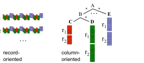

## 3. 数据模型

Dremel 的数据模型来源于分布式系统上下文中的 Protocol Buffers [21]，在 Google 内广泛使用，也有开源实现。模型基于强类型嵌套记录，其抽象语法为：

$$
\tau = dom \mid \langle A_1 : \tau[\ast{}|?], \ldots, A_n : \tau[\ast{}|?] \rangle
$$

其中 $\tau$ 是原子类型或记录类型。`dom` 中的原子类型包括 integer、floating point number、string 等。记录由一个或多个字段组成。记录中字段 $i$ 具有名称 $A_i$，并可带一个可选 multiplicity label。Repeated field (`*`) 可以在记录中出现多次，并被解释为值列表；字段在记录中出现的顺序是有意义的。Optional field (`?`) 可以从记录中缺失。否则，字段是 required，即必须恰好出现一次。

图 2 展示了例子。该 schema 定义了表示 web document 的记录类型 `Document`。`Document` 有 required integer `DocId`，以及 optional `Links`，其中包含保存其他网页 DocId 的 repeated `Forward` 和 `Backward` 条目。一个 document 可以有多个 `Name`，它们是不同 URL，可被其他 document 引用。`Name` 包含一组 `Code` 和 optional `Country` 的 `Language`。图 2 也展示了符合该 schema 的两个样例记录 `r1` 和 `r2`，记录结构用缩进表示。

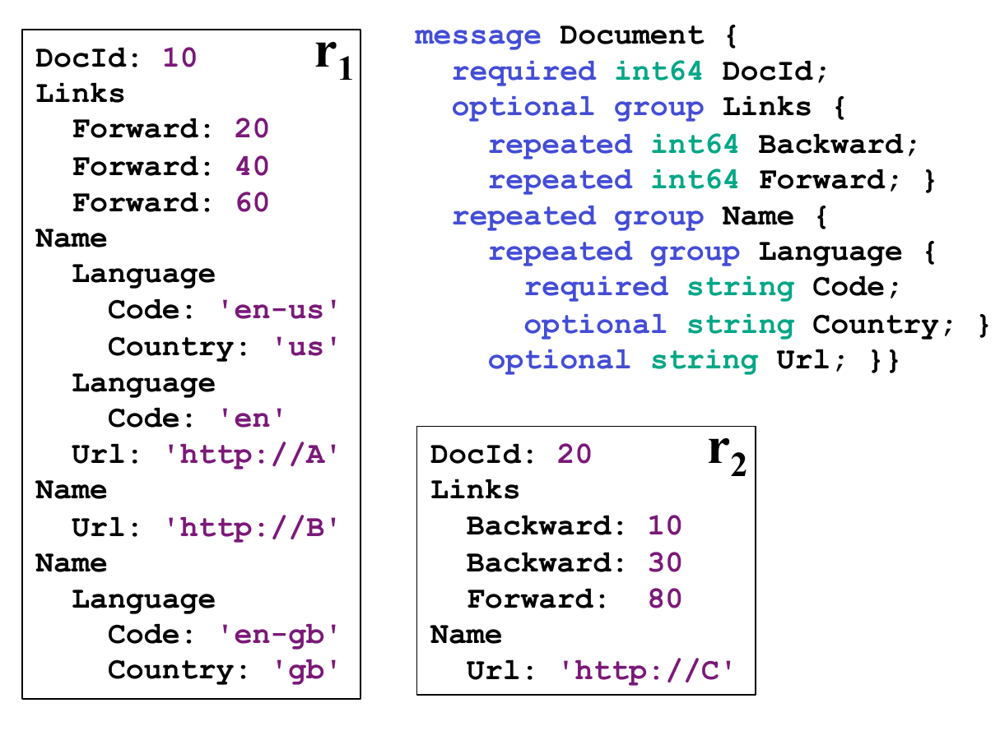

Schema 中定义的字段形成树状层级。嵌套字段的完整路径用通常的点号表示法表示，例如 `Name.Language.Code`。嵌套数据模型为序列化结构化数据提供了平台无关、可扩展的机制。代码生成工具为 C++、Java 等语言生成绑定。跨语言互操作性通过记录的标准二进制线上表示实现，其中字段值按它们在记录中出现的顺序顺序排列。这样，用 Java 编写的 MR 程序可以使用 C++ 库暴露的数据源。因此，如果记录以列式表示存储，快速组装记录对与 MR 和其他数据处理工具互操作很重要。

## 4. Nested Columnar Storage

如图 1 所示，Dremel 的目标是把给定字段的所有值连续存储，以提高检索效率。本节讨论三类关键挑战：以 columnar format 无损表示 nested record structure，快速编码，以及高效 record assembly。

### 4.1 Repetition and Definition Levels

仅靠值无法表达记录结构。给定 repeated field 的两个值，无法知道它们是否来自两个不同记录，或来自同一记录。类似地，给定一个 missing optional field，不知道该字段出现在 schema 的哪一层。因此 Dremel 引入 repetition level 和 definition level。

**Repetition level。** 以图 2 中的字段 `Code` 为例。它在 `r1` 中出现三次：`en-us`、`en`、`en-gb`，它们分别位于第一个、第二个和第三个 `Name` 中。为了区分这些出现，Dremel 为每个值附加 repetition level。Repetition level 表示字段路径中哪个 repeated field 的值发生了重复。字段路径 `Name.Language.Code` 包含两个 repeated field：`Name` 和 `Language`。因此，`Code` 的 repetition level 范围在 0 到 2 之间。Level 0 表示新记录开始。后续 `Code` 值 `en-us` 的 repetition level 为 1，因为尚未看到任何 repeated field 变化，即 repetition level 为 0。当看到 `en` 时，字段 `Language` 重复，所以 repetition level 为 2。最后，当看到 `en-gb` 时，`Name` 重复，但不是 `Language`，所以 repetition level 为 1。

注意，第二个 `Name` 中没有 `Code` 值。要判断 `en-gb` 出现在第三个 `Name` 而非第二个，需要有一个 `NULL` 值位于 `en` 和 `en-gb` 之间。因为 `Code` 是 `Language` 中的 required field，缺失意味着 `Language` 本身未定义。通常，确定嵌套记录存在到哪一层需要额外信息。

**Definition level。** 对路径为 `p` 的某个字段的每个值，尤其是每个 `NULL`，都有一个 definition level，用于说明路径中有多少字段可以未定义，即 optional 或 repeated，但在该记录中实际存在。以 `r1` 为例，它没有 `Backward` link。不过字段 `Links` 定义在 level 1。因此为了保留该信息，Dremel 向 `Links.Backward` 列添加一个 definition level 为 1 的 `NULL` 值。类似地，第二个 `Name` 中 `Name.Language.Country` 缺失，在 level 1 处携带空信息；而 `r2` 中缺失的 `Name.Language.Code` 也携带 definition level 1，因为对应的 `Name` 存在但 `Language` 不存在。

Dremel 使用 integer definition level 而不是 single null bit，使 leaf field 的列数据包含字段出现信息。例如，`Name.Language.Country` 列包含关于当前记录中 `Language` 出现次数的信息。这些信息如何被使用，见第 4.3 节。

编码流程会无损保留记录结构。Dremel 出于空间原因省略证明。

**Encoding。** 每列存储为一组 block。每个 block 包含 repetition level、definition level，以及压缩字段值。`NULL` 不显式存储，因为它们由 definition level 决定。所有小于字段最大定义级别的 definition level 都是 `NULL`。对于 optional field，Dremel 不存储总是 defined 的 repetition level；例如，definition level 0 表示 `NULL` 时，repetition level 也是 0，所以后者可以省略。事实上，图 3 中不存储 level 0。Dremel 会按顺序紧凑打包 level；例如，如果最大 definition level 是 3，则每个 definition level 使用 2 bit。

图 3 总结了样例记录中所有 atomic field 的 repetition level 和 definition level。

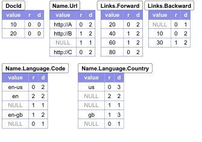

### 4.2 Splitting Records into Columns

前文给出了 record structure 的 columnar format 编码。接下来要解决的是如何高效生成列单元，并在查询执行期间高效重复生成这些单元。计算 repetition level 和 definition level 的基本算法见附录 A。算法递归遍历 record structure，并为每个字段值计算 level。如前所述，即使字段值缺失，也可能需要计算 repetition level 和 definition level。

Google 的许多数据集是稀疏的：一条记录中可能定义了数千字段，但只有几百个字段被使用。因此，Dremel 只在需要时处理 missing field。为了为每个字段值生成 column strip，Dremel 创建一个 field writer，其结构匹配 schema 中的字段层级。基本思想是只在有新数据时更新 field writer，并且除非必要，不把父状态向下传播到树中。为此，child writer 会从其 parent 继承 level。只要看到新值，child writer 就与 parent 同步。

### 4.3 Record Assembly

从 columnar data 高效组装记录对面向记录的数据处理工具非常关键。给定一个字段子集，目标是重建原始记录，就像它们只包含所选字段、所有其他字段被剥离一样。关键思想是创建一个有限状态机 (FSM)，读取 field value 和 level，并把值顺序追加到输出记录。FSM 的每个状态对应于一个待读取字段。状态之间的转换以 repetition level 标注。读出一个值后，根据下一个 repetition level 决定使用哪个 reader。FSM 从 start state 遍历到 end state，每条记录一次。

图 4 展示重建样例中完整记录的 FSM。Start state 是 `DocId`。读出 `DocId` 后，FSM 转到 `Links.Backward`。所有 repeated `Backward` 值读完后，FSM 跳到 `Links.Forward`，依此类推。记录组装算法的细节见附录 B。

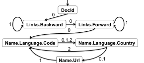

要勾画 FSM transition 的构造，令 $l$ 为当前 field reader 返回的 repetition level。若 $f$ 是 schema tree 中第一个字段，则找出其 ancestor 中 repetition level 等于 $l$ 的最深节点，并选择该 ancestor 中的第一个 leaf field。这给出 FSM transition $(f,l)\rightarrow n$。例如，令 $l=1$，下一个 repetition level 读自 $f=Name.Language.Country$。它在 level 1 的 ancestor 是 `Name`，其首个 leaf field 是 `Name.Url`。FSM 构造算法见附录 C。

如果只需要读取字段子集，Dremel 会构造更简单的 FSM。图 5 展示读取字段 `DocId` 和 `Name.Language.Country` 的 reader 对应的简单 FSM。图中输出记录 $s_1$ 和 $s_2$ 由该 automaton 产生。注意，Dremel 的编码和组装算法保留了字段 `Country` 的封闭结构。这很重要，因为例如第二个 `Name` 中出现 `Country` 不应对应第一种 `Language`，即 `en-gb`。在 XPath 中，这对应于能够计算 `/Name[2]/Language[1]/Country` 这样的表达式。

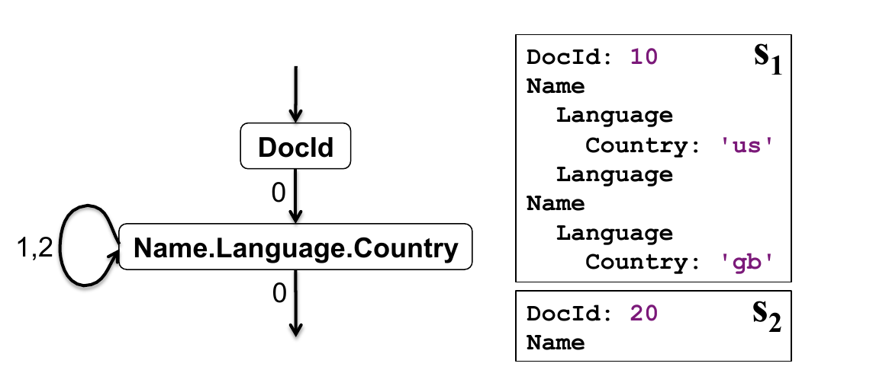

## 5. Query Language

Dremel 的查询语言基于 SQL，并设计为能高效实现于 columnar nested storage。正式定义语言不在本文范围内；本文通过示例说明其风格。每个 SQL 语句和代数算子都把一个或多个 nested table 和 schema 作为输入，并产生 nested table 及其输出 schema。图 6 展示一个样例查询，它执行 projection、selection 和 within-record aggregation。该查询在图 2 的样例记录上执行，输入 table 为 $t=\lbrace{}r_1,r_2\rbrace{}$。字段通过 path expression 引用。查询会生成 nested result，虽然查询中没有 nested record constructor。

```sql
SELECT DocId AS Id,
       COUNT(Name.Language.Code) WITHIN Name AS Cnt,
       Name.Url + ',' + Name.Language.Code AS Str
FROM t
WHERE REGEXP(Name.Url, '^http') AND DocId < 20;
```

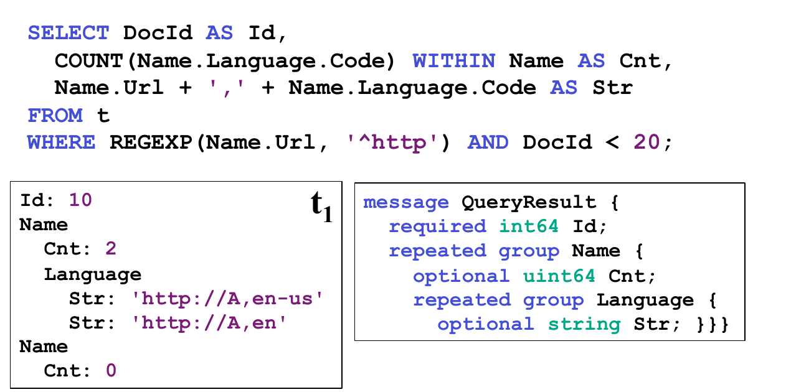

为了说明查询做了什么，考虑 selection 操作，即 `WHERE` 子句。把 nested record 看成一棵带标签树，每个 label 对应一个 field name。Selection operator 会剪除不满足条件的树分支。因此，只有 nested record 中满足 `Name.Url` 定义且以 `http` 开头的部分会被投影。`SELECT` 子句中的每个 scalar expression 都在 expression 中最深 repeated input field 的 nesting level 上发出值。因此，字符串拼接表达式会在输出 schema 中 `Name.Language.Code` 的 level 上发出 `Str` 值。`COUNT` 表达式展示 within-record aggregation。`WITHIN` 子句中的 aggregation 按每个 `Name` 统计 `Name.Language.Code` 的出现次数，并生成非负 64-bit integer。

该语言支持 nested subquery、inter- and intra-record aggregation、top-k、join、user-defined function 等；其中一些特性仍在实验阶段。附录 D 给出了 Dremel 上 select-project-aggregate 查询的求值算法。

## 6. Query Execution

本节在只读系统上下文中讨论核心思想。许多 Dremel 查询是一次性聚合查询，因此本文关注这些查询，并把 join、indexing、update 等留作未来工作。

**Tree architecture。** Dremel 使用多级 serving tree 执行查询，如图 7 所示。Root server 接收进入查询，读取表元数据，并把查询路由到 serving tree 的下一层。Leaf server 与存储层通信，或访问本地磁盘上的数据。

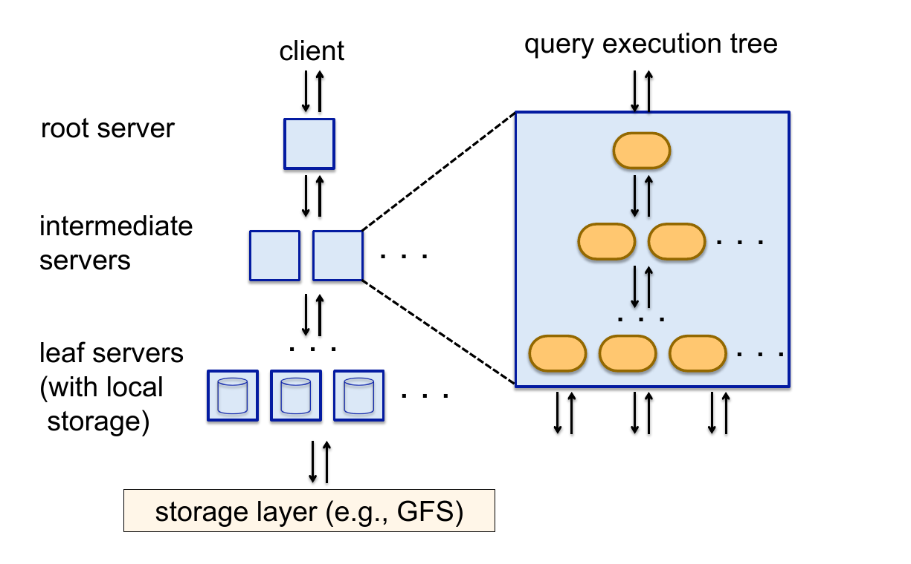

考虑一个简单聚合查询：

```sql
SELECT A, COUNT(B) FROM T GROUP BY A;
```

Root server 收到该查询后，确定表 `T` 的所有 tablet，并把它们重新写为若干子查询：

```sql
SELECT A, SUM(c) FROM
  (R_1^1 UNION ALL ... R_n^1)
GROUP BY A;
```

表 $R_1^1,\ldots,R_n^1$ 是 serving tree 第 1 层 server 的输入。每个层级 $i$ 的 server 收到类似重写后的查询：

```sql
R_j^i = SELECT A, COUNT(B) AS c
        FROM T_j^i
        GROUP BY A;
```

 $T_j^i$ 是第 $i$ 层 server $j$ 处理的 table 的不相交 partition。每个 serving level 执行类似重写。最终，查询到达 leaf，leaf 并行扫描 $T$ 中 tablet。向上每一级 intermediate server 都执行 partial result aggregation。上述执行模型很适合返回小型和中型结果的聚合查询，这类查询是交互式查询中非常常见的一类。大型 aggregation 和其他查询类型可能需要基于同一框架的其他执行机制。

**Query dispatcher。** Dremel 是多用户系统，通常会同时执行多个查询。Query dispatcher 基于负载均衡优先级调度查询。如果系统中某个 tablet replica 比其他 replica 慢很多，或某个 tablet replica 不可达，调度器可以把查询重新路由到其他 replica。

每个查询处理的数据量常常大于可用 execution slot 数，而 slot 对应 leaf server 上的 execution thread。例如，在 3000 个 leaf server、每个 8 thread 时，系统有 24000 个 slot。因此，跨越 100000 个 tablet 的表可以处理为大约 5 个 tablet 一批。查询执行期间，query dispatcher 会按处理时间收集各 slot 的 histogram。如果某个 tablet 处理时间过长，它会被重新调度到另一个 server 上。有些 tablet 可能需要多次重新调度。

Leaf server 以 columnar representation 读取嵌套数据条带。每个 stripe 中的 block 异步预取；read-ahead cache 通常达到 95% 的命中率。Tablet 通常是三副本复制。如果某个 leaf server 不能访问某个 tablet replica，它会切换到另一个 replica。

查询调度器会控制一个参数，指定返回结果前必须扫描的最低 tablet 百分比。较低值，例如 98% 而非 100%，通常能显著加快执行，尤其在使用较小复制因子时。

每个 server 都有内部 execution tree，如图 7 右侧所示。内部树对应于典型查询执行计划，包括 scalar expression evaluation。优化后的特定类型代码会为多数 scalar function 生成。Project-select-aggregate 查询的 execution plan 包含一组 iterator，它们扫描输入列并发出由 record assembly entity 标注了 repetition level 和 definition level 的 aggregate 及 scalar function 结果。详情见附录 D。

一些 Dremel 查询，如 top-k 和 count-distinct，会使用已知的一趟算法返回近似结果 [4]。

## 7. Experiments

本节在若干 Google 数据集上评估 Dremel 性能，并检查 columnar storage 对 nested data 的有效性。实验使用的数据集属性见图 8。未压缩、非复制形式下，数据集总量约为 1 PB。所有表均三副本复制，除一个两副本表外，并包含 100K 到 800K 个不同大小的 tablet。先检查基本数据访问特性，然后展示 columnar storage 如何有益于 MR execution，最后关注 Dremel 性能。实验在生产系统实例上进行，这些实例在正常业务运行期间还承载许多其他应用。除特别说明外，执行时间取 5 次运行平均。表名和字段名均已匿名化。

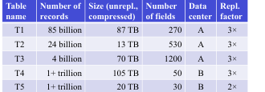

图 8 中的数据集信息如下。

| Table name | Number of records | Size (unrepl., compressed) | Number of fields | Data center | Repl. factor |
|---|---:|---:|---:|---|---:|
| T1 | 85 billion | 87 TB | 270 | A | 3x |
| T2 | 24 billion | 13 TB | 530 | A | 3x |
| T3 | 4 billion | 70 TB | 1200 | A | 3x |
| T4 | 1+ trillion | 105 TB | 50 | B | 3x |
| T5 | 1+ trillion | 20 TB | 30 | B | 2x |

**Local disk。** 第一个实验考察 columnar storage 与 record-oriented storage 的性能取舍，扫描表 $T_1$ 的 300K 记录片段，数据量约 1 GB。数据存储在本地磁盘上，压缩 columnar representation 为 375 MB。Record-oriented format 使用更重压缩，但磁盘大小约相同。实验在 dual-core Intel 机器上完成，磁盘提供 70 MB/s 读带宽。所有报告时间均为冷读，实验前清空 OS cache。

图 9 展示读取、解压、组装和解析记录的五条曲线。Graph (a)-(c) 是 columnar storage 的结果。每个数据点取 30 次运行平均；每次运行随机选择给定 cardinality 的字段集合。Graph (a) 展示读取和解压时间。Graph (b) 增加组装 nested record 的时间。Graph (c) 展示把记录解析为 strongly typed C++ data structure 的时间。Graph (d)-(e) 是 record-oriented storage 的对应曲线。Graph (d) 展示读取和解压时间。Graph (e) 展示解析增加的时间；事实上，在 record-oriented 情况下，压缩数据约一半时间即可从磁盘读出。

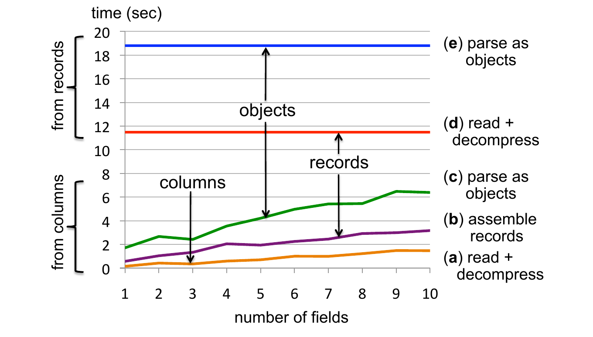

主要结论是：当读取少数字段时，columnar representation 的收益约为一个数量级。嵌套 columnar data 的检索时间随字段数线性增长。Record assembly 和 parsing 很昂贵，每一步约让执行时间翻倍。其他数据集上也观察到类似趋势。自然问题是，在什么点上 record-oriented storage 开始优于 columnar storage。经验上，如果大多数或全部字段都需要重组，这一交叉点可能在数十个字段处，具体取决于数据集和是否需要 record assembly。

**MR and Dremel。** 接下来展示 MR 和 Dremel 在 columnar storage 与 record-oriented data 上的执行。考虑只访问单个字段的情况，即性能提升最明显的情况。下面 Sawzall [20] 程序统计表 $T_1$ 的 `txtField` 字段中 term 的平均数量：

```text
numRecs: table sum of int;
numWords: table sum of int;
emit numRecs <- 1;
emit numWords <- CountWords(input.txtField);
```

记录数存储在变量 `numRecs` 中。对每条记录，`numWords` 会加上 `CountWords` 函数返回的数字。程序结束后，平均 term frequency 可以计算为 `numWords/numRecs`。SQL 中对应查询为：

```sql
Q1: SELECT SUM(CountWords(txtField)) / COUNT(*) FROM T1;
```

图 10 展示两个 MR 作业和 Dremel 在单一大规模下的执行时间。两个 MR 作业都运行在 3000 worker 上。类似地，Dremel 运行在 3000 节点上。Dremel 实例在 Query Q1 上读取约 0.5 TB 压缩 columnar data。MR-on-columns 读取约 8.7 TB。MR-on-records 读取约 87 TB。通过从 record-oriented 转到 columnar storage，MR 获得约一个数量级的效率提升，从 10 分钟到 1 分钟。使用 Dremel 再获得一个数量级提升，从分钟到秒。

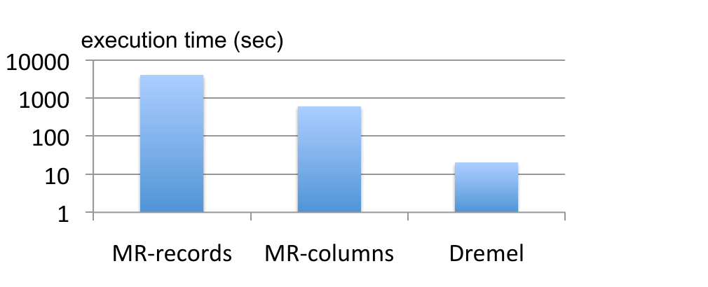

**Serving tree topology。** 下一个实验展示 serving tree 深度对 query execution time 的影响。考虑表 $T_2$ 上两个 GROUP BY 查询，每个查询使用单次扫描。表 $T_2$ 包含 240 亿嵌套记录。每条记录有一个 repeated field `item`，其中字段 `item.amount` 在数据集中大约重复 400 亿次。第一个查询按 `country` 对 `item.amount` 求和：

```sql
Q2: SELECT country, SUM(item.amount) FROM T2
    GROUP BY country;
```

该查询返回几百条记录，并读取约 60 GB 压缩数据。第二个查询对 `domain` 做 GROUP BY，且在 text field domain 上有 selection condition：

```sql
Q3: SELECT domain, SUM(item.amount) FROM T2
    WHERE domain CONTAINS '.net'
    GROUP BY domain;
```

查询读取约 180 GB，并产生约 110 万个 distinct domain。

图 11 展示每个查询在不同 server topology 下的执行时间。每种 topology 中，leaf server 数固定为 2900，以便假设相同累计 scan speed。2-level topology 中，一个 root server 直接与全部 leaf server 通信。3-level 中为 1:100:2900，即额外有一层 100 个 intermediate server。4-level topology 为 1:10:100:2900。Query Q2 在 3 秒内运行完成，并且从额外层级获益不大。相反，Q3 的执行时间因为 aggregation 并行度增加而从额外层级中获益。2-level 下 Q3 不在图中，因为 root server 需要把结果聚合到几十万个 node。该实验展示：返回大量 group 的 aggregation 受益于 multi-level serving tree。

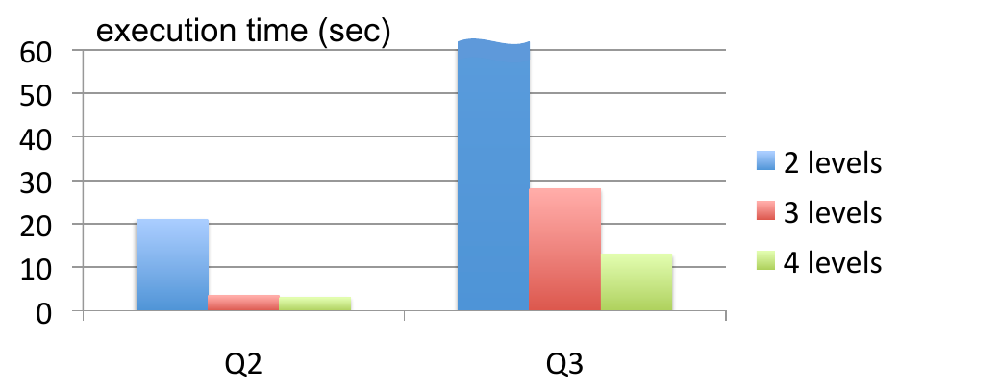

**Per-tablet histograms。** 为深入理解查询执行期间发生了什么，Dremel 使用图 12 所示的 execution profile。图中展示 leaf server 处理特定运行的 $Q_2$ 和 $Q_3$ 时，在每个 tablet 上的处理时间 histogram。时间从 tablet 被调度到可用 slot 的时刻开始测量，即不包括等待 job queue 的时间。该测量方法会排除同时在一个 slot 内运行的其他查询导致的影响。Histogram 下方面积对应 100%。如图所示，99% 的 $Q_2$ tablet 或 $Q_3$ tablet 会在一秒或两秒内处理完。

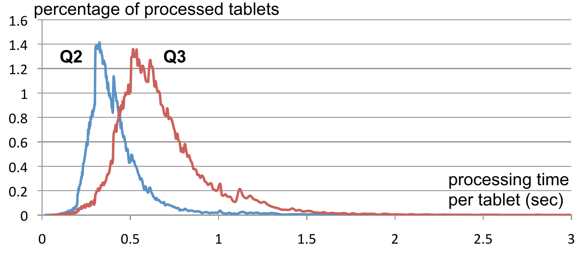

**Within-record aggregation。** 另一个实验考察表 $T_3$ 上 Query Q4 的性能。该查询展示 within-record aggregation：它计算记录内 `a.b.c.d` 值出现次数大于 `a.b.p.q.r` 值出现次数的记录数。不同 nesting level 的字段重复度不同。由于 column stripping，只需读取 13 GB 数据，而固定 query completion time 为 15 秒。如果没有 column stripping，需要扫描全部 70 TB 数据，从而运行查询代价极高。

```sql
Q4: SELECT COUNT(c1 > c2) FROM
      (SELECT SUM(a.b.c.d) WITHIN RECORD AS c1,
              SUM(a.b.p.q.r) WITHIN RECORD AS c2
       FROM T3);
```

**Scalability。** 下一个实验展示系统在 trillion-record table 上的可扩展性。图 13 所示 Query Q5 选择前 20 个 `a`，并计数表 $T_4$ 中的数字：

```sql
Q5: SELECT TOP(aid, 20), COUNT(*) FROM T4
    WHERE bid = {value1} AND cid = {value2};
```

查询被执行在系统的多种配置上，leaf server 数从 1000 到 4000 不等。每次运行中，total expended CPU time 几乎相同，约为 300K 秒；而用户感知时间随系统规模增加几乎线性下降。该结果表明，更大的系统在资源使用上同样有效，同时允许更快执行。

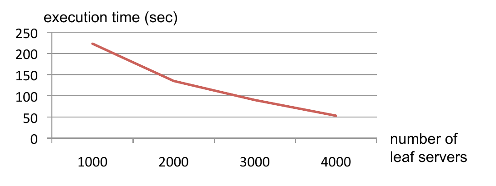

**Stragglers。** 最后一个实验展示 straggler 的影响。Query Q6 在 trillion-row table $T_5$ 上运行。与其他数据集不同， $T_5$ 是双副本复制。因此，straggler 降低执行速度的可能性更高，因为重新路由机会更少。

```sql
Q6: SELECT COUNT(DISTINCT a) FROM T5;
```

Query Q6 读取超过 1 TB 压缩数据。被取回字段的压缩率约为 10。图 14 显示 99% 的 tablet 在每 slot 5 秒内被处理。不过，少量 tablet 花费了更长时间。如果让查询从图中所示最大时间之前完成，查询响应时间就从 2500 节点系统上的 25 秒降到 20 秒。下一节总结实验发现。

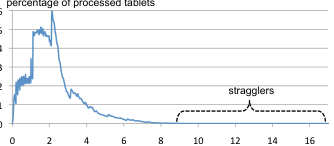

## 8. Observations

Dremel 每月扫描数千万亿记录。图 15 用对数刻度展示一个 Dremel 系统月度工作负载中的 query response time distribution。如图所示，多数查询在 10 秒内处理完，即处于交互式范围。有些查询在共享集群上达到接近 1000 亿 record/s 的 scan throughput，在专用机器上则更高。实验数据支持以下观察：

- Scan-based query 可以在磁盘驻留数据集上以交互速度执行，规模可达万亿记录。
- 在数千列和 server 上，系统数十万节点规模内都可以达到近线性扩展。
- MR 像 DBMS 一样也能从 columnar storage 中获益。
- Record assembly 和 parsing 代价高昂，需要优化到能直接消费 column-oriented data，而不仅仅在查询处理层优化。
- MR 和 query processing 可以互补使用，一个 layered output 可以作为另一个的输入。
- 在多用户环境中，更大系统可以从规模经济中获益，同时提供更优用户体验。
- 如果可以用准确性换取速度，查询可以更早终止，仍能看到大部分数据。
- 获取 web-scale 数据集的大部分数据可以很快；但在严格时间边界内获取最后几个百分点很难。

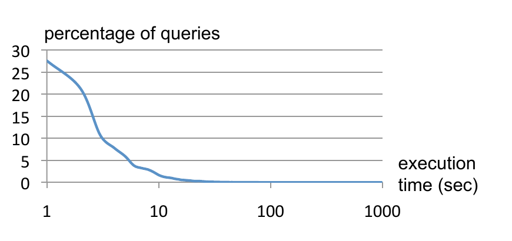

Dremel 代码库较密集，包含不到 100K 行 C++、Java 和 Python 代码。

## 9. Related Work

MapReduce (MR) [12] 框架被设计用于解决大规模计算中长时间 batch job 的挑战。与 MR 一样，Dremel 也为故障执行提供容错，而这对处理 PB 级数据很重要。MR 的成功催生了许多第三方实现，尤其是开源 Hadoop [15]，以及一些将并行 DBMS 与 MR 结合的混合系统，例如 Aster、Cloudera、Greenplum、Vertica。HadoopDB [3] 是这一混合类别中的研究系统。近期文献 [13, 22] 对 MR 和并行 DBMS 做了对比。本文工作强调两种范式的互补性。

Dremel 被设计为在 PB 级上运行。虽然可以想到 parallel DBMS 也能扩展到这一规模、达到数千节点，但我们不知道有公开发表的工作或工业报告尝试过。我们也不熟悉先前把 MR 和 columnar storage 结合的文献。

Dremel 对 nested data 的 columnar representation 建立在已有数十年工作的基础上：从 content 中分离 structure、转置表示。关于 column store 中压缩和查询处理的最新综述见 [1]。许多商用 DBMS 支持以 XML 存储 nested data，例如 [19]。XML storage schema 会尝试把 structure 从 content 分离出来，但由于 XML data model 更灵活，挑战更多。能够对 XML representation 做转置的一个系统是 XMill [17]。XMill 是压缩工具；它像 Dremel 一样把 structure 分离出来，但不面向 selective column retrieval。

Dremel 使用的数据模型是复杂值模型的一种变体，数据库文献已对此有大量讨论 [2]。Dremel 查询语言建立在 [9] 的思想之上，[9] 引入了在嵌套数据上操作、不会访问数据中缺失部分的语言。相比之下，XQuery 和 object-oriented query language 通常要求数据重组，例如使用 nested for-loop 和 constructor。我们不知道有 [9] 的实用实现。近期嵌套数据上的 SQL-like language 包括 Pig [18]。其他并行数据处理系统包括 Scope [6] 和 DryadLINQ [23]。

## 10. Conclusions

本文介绍了 Dremel，一个用于大规模数据集交互式分析的分布式系统。Dremel 是可定制、可扩展的数据管理解决方案，补充了 MapReduce 范式。本文讨论了它在万亿记录、多 TB 数据集上的性能。我们概述了 Dremel 的关键方面，包括存储格式、查询语言和执行。未来计划覆盖更多此类方面，如 formal algebraic specification、join、extensibility mechanism 等。

## 11. Acknowledgments

Dremel 从许多 Google 工程师和实习生的贡献中受益良多，特别是 Craig Chambers、Ori Gershoni、Rajeev Bysani、Leon Wong、Erik Hendriks、Erika Rice Scherpelz、Charlie Garrett、Idan Avraham、Rajesh Rao、Andy Kreling、Li Yin、Madhusudhan Hosagrahara、Dan Belov、Brian Bershad、Lawrence You、Rongrong Zhong、Meelap Shah 和 Nathan Bales。

## 12. References

- [1] D. J. Abadi, P. A. Boncz, and S. Harizopoulos. Column-Oriented Database Systems. VLDB, 2(2), 2009.
- [2] S. Abiteboul, R. Hull, and V. Vianu. Foundations of Databases. Addison Wesley, 1995.
- [3] A. Abouzeid, K. Bajda-Pawlikowski, D. J. Abadi, A. Rasin, and A. Silberschatz. HadoopDB: An Architectural Hybrid of MapReduce and DBMS Technologies for Analytical Workloads. VLDB, 2(1), 2009.
- [4] Z. Bar-Yossef, T. S. Jayram, R. Kumar, D. Sivakumar, and L. Trevisan. Counting Distinct Elements in a Data Stream. In RANDOM, pages 1-10, 2002.
- [5] L. A. Barroso and U. Holzle. The Datacenter as a Computer: An Introduction to the Design of Warehouse-Scale Machines. Morgan & Claypool Publishers, 2009.
- [6] R. Chaiken, B. Jenkins, P.-A. Larson, B. Ramsey, D. Shakib, S. Weaver, and J. Zhou. SCOPE: Easy and Efficient Parallel Processing of Massive Data Sets. VLDB, 1(2), 2008.
- [7] C. Chambers, A. Raniwala, F. Perry, S. Adams, R. Henry, R. Bradshaw, and N. Weizenbaum. FlumeJava: Easy, Efficient Data-Parallel Pipelines. In PLDI, 2010.
- [8] F. Chang, J. Dean, S. Ghemawat, W. C. Hsieh, D. A. Wallach, M. Burrows, T. Chandra, A. Fikes, and R. Gruber. Bigtable: A Distributed Storage System for Structured Data. In OSDI, 2006.
- [9] L. S. Colby. A Recursive Algebra and Query Optimization for Nested Relations. SIGMOD Record, 18(2), 1989.
- [10] G. Czajkowski. Sorting 1PB with MapReduce. Official Google Blog, Nov. 2008.
- [11] J. Dean. Challenges in Building Large-Scale Information Retrieval Systems: Invited Talk. In WSDM, 2009.
- [12] J. Dean and S. Ghemawat. MapReduce: Simplified Data Processing on Large Clusters. In OSDI, 2004.
- [13] J. Dean and S. Ghemawat. MapReduce: a Flexible Data Processing Tool. Commun. ACM, 53(1), 2010.
- [14] S. Ghemawat, H. Gobioff, and S.-T. Leung. The Google File System. In SOSP, 2003.
- [15] Hadoop Apache Project. http://hadoop.apache.org.
- [16] Hive. http://wiki.apache.org/hadoop/Hive, 2009.
- [17] H. Liefke and D. Suciu. XMill: An Efficient Compressor for XML Data. In SIGMOD, 2000.
- [18] C. Olston, B. Reed, U. Srivastava, R. Kumar, and A. Tomkins. Pig Latin: a Not-so-Foreign Language for Data Processing. In SIGMOD, 2008.
- [19] P. E. O'Neil, E. J. O'Neil, S. Pal, I. Cseri, G. Schaller, and N. Westbury. ORDPATHs: Insert-Friendly XML Node Labels. In SIGMOD, 2004.
- [20] R. Pike, S. Dorward, R. Griesemer, and S. Quinlan. Interpreting the Data: Parallel Analysis with Sawzall. Scientific Programming, 13(4), 2005.
- [21] Protocol Buffers: Developer Guide. Available at http://code.google.com/apis/protocolbuffers/docs/overview.html.
- [22] M. Stonebraker, D. Abadi, D. J. DeWitt, S. Madden, E. Paulson, A. Pavlo, and A. Rasin. MapReduce and Parallel DBMSs: Friends or Foes? Commun. ACM, 53(1), 2010.
- [23] Y. Yu, M. Isard, D. Fetterly, M. Budiu, U. Erlingsson, P. K. Gunda, and J. Currey. DryadLINQ: A System for General-Purpose Distributed Data-Parallel Computing Using a High-Level Language. In OSDI, 2008.

## Appendix

### A. Column-Striping Algorithm

把 record 分解成 column 的算法见图 16。过程 `DissectRecord` 接收一个 `RecordDecoder` 实例，它用于遍历二进制编码记录。`FieldWriter` 形成与输入 schema 相同的树状层级。Root `FieldWriter` 被传递给每个新 record 的算法，repetition level 设为 0。该过程会把当前 repetition level 和 definition level 写入 writer，随后递归遍历 record-valued field。

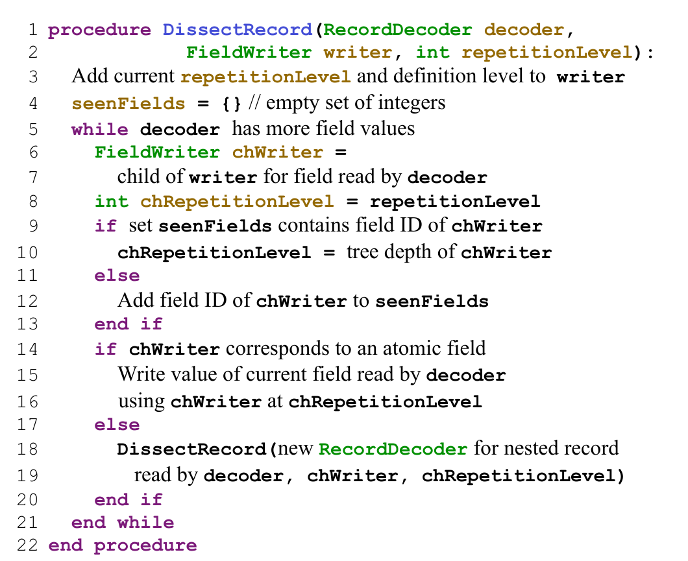

### B. Record Assembly Algorithm

在线上表示中，record 被布局为 field identifier 后接 field value 的 pair。Nested record 可视为具有 opening tag 和 closing tag，类似 XML。过程 `AssembleRecord` 接收一组 `FieldReader`，隐含地以 FSM transition 的形式保存，并返回重组后的 record。它根据 reader 的 repetition level 和 definition level 同步 record 结构，必要时通过 `MoveToLevel` 和 `ReturnToLevel` 调整嵌套层级。

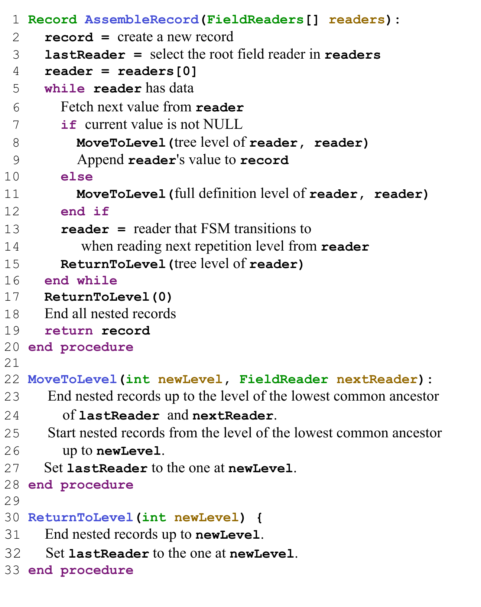

### C. FSM Construction Algorithm

图 18 展示构造 record assembly 所需 FSM 的算法。算法会取得应填充到记录中的字段，并按它们在 schema 中出现的顺序处理。算法使用两个字段的 common repetition level 来构造 transition，并在需要跳转到前一个 field 时插入 barrier transition。

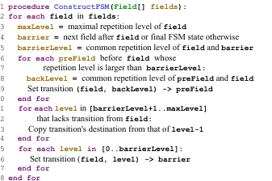

### D. Select-Project-Aggregate Evaluation Algorithm

图 19 展示 Dremel 中 select-project-aggregate 查询的求值算法。算法有两个隐式输入：每个查询字段对应的 `FieldReader` 集合，以及 scalar expression 集合，后者包括查询中的 aggregate expression。一个 scalar expression 的 repetition level 是该 expression 所用字段的最大 repetition level。执行期间，算法用 `fetchLevel` 和 `selectLevel` 控制 reader 前进和 expression 发出结果，从而绕过完整 record assembly。

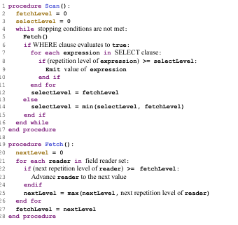
