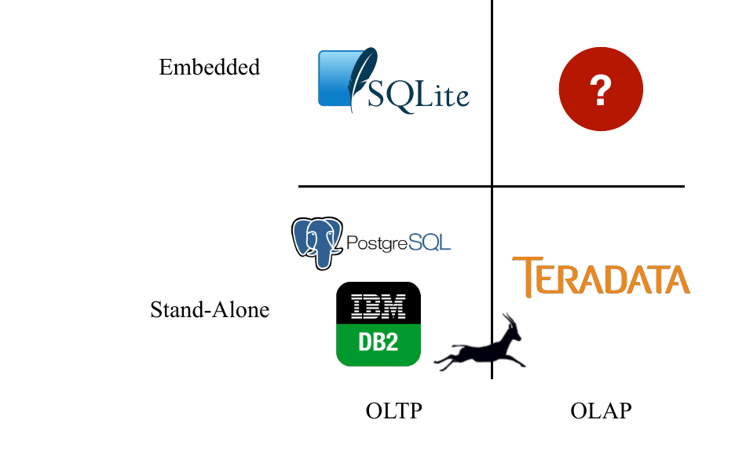
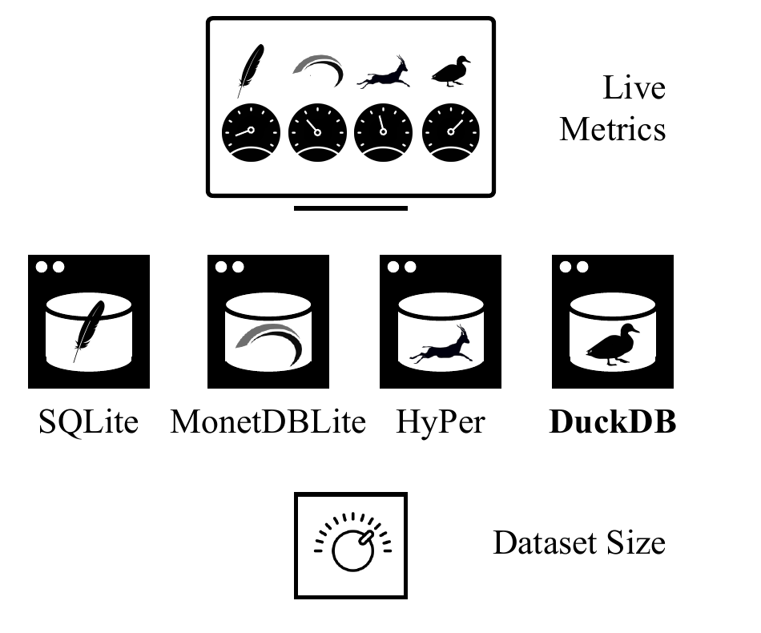

# DuckDB: an Embeddable Analytical Database（中文译文）

## 译者说明

本文依据同目录的 `source.pdf` 翻译。章节、图表、公式、算法、代码与参考文献按原文结构保留。

## 作者

Mark Raasveldt（CWI，阿姆斯特丹；m.raasveldt@cwi.nl）

Hannes Mühleisen（CWI，阿姆斯特丹；hannes@cwi.nl）

## 摘要

SQLite 的巨大普及度表明，人们需要不打扰宿主应用的进程内数据管理解决方案。然而，目前还没有面向分析型工作负载的此类系统。我们展示 DuckDB，这是一种新颖的数据管理系统，设计目标是在嵌入另一个进程的同时执行分析型 SQL 查询。在本次演示中，我们将 DuckDB 与其他数据管理解决方案进行对比，以展示它在嵌入式分析场景中的性能。DuckDB 采用宽松许可证，以开源软件形式提供。

### ACM 引用格式

Mark Raasveldt and Hannes Mühleisen. 2019. DuckDB: an Embeddable Analytical Database. In *2019 International Conference on Management of Data (SIGMOD '19), June 30-July 5, 2019, Amsterdam, Netherlands*. ACM, New York, NY, USA, 4 pages. <https://doi.org/10.1145/3299869.3320212>

### 版权与出版信息

只要副本不以营利或商业优势为目的制作或分发，且副本在第一页载有本声明和完整引文，即可免费制作本作品部分或全部内容的数字副本或纸质副本，供个人或课堂使用。必须尊重本作品中第三方组件的版权。其他用途请联系作品所有者或作者。

SIGMOD '19，2019 年 6 月 30 日至 7 月 5 日，荷兰阿姆斯特丹。

© 2019，版权由所有者或作者持有。

ACM ISBN 978-1-4503-5643-5/19/06。

<https://doi.org/10.1145/3299869.3320212>

## 1 引言

数据管理系统已经演变为以独立进程运行的大型单体数据库服务器。这一方面是因为系统需要同时为许多客户端的请求提供服务，另一方面是因为数据完整性的要求。独立式系统虽然功能强大，却需要投入大量精力才能正确搭建，而且其客户端协议也会限制数据访问 [12]。数据管理系统还存在一类完全不同的用例：把系统嵌入其他进程，使数据库系统成为一个链接库，完全运行在某个“宿主”进程内部。这类系统最著名的代表是 SQLite。它是部署最广泛的 SQL 数据库引擎，活跃使用中的数据库超过一万亿个 [4]。SQLite 高度聚焦事务型（OLTP）工作负载，其行式执行引擎运行在 B-Tree 存储格式之上 [3]。因此，SQLite 在分析型（OLAP）工作负载上的性能很差。

**图 1：系统格局。** 纵轴上方为嵌入式（Embedded），下方为独立式（Stand-Alone）；横轴从 OLTP 延伸到 OLAP。图中显示 SQLite 位于嵌入式 OLTP 象限，而嵌入式 OLAP 象限仍是问号。

人们显然需要嵌入式分析数据管理。这一需求主要来自两个方面：交互式数据分析和“边缘”计算。交互式数据分析使用 R 或 Python 等工具进行。这些环境通过扩展提供的基本数据管理算子（如 dplyr [14]、Pandas [6] 等）很像 SQL 查询中层叠的关系算子，但缺少整条查询优化和事务型存储。

边缘计算场景同样需要嵌入式分析数据管理。例如，目前联网电表会把数据发送到中心位置进行分析。这种做法受带宽限制所困，尤其是使用无线电接口时，而且还会引发隐私问题。嵌入式分析数据库非常适合支持这一用例，因为数据可以在边缘节点上完成分析。交互式分析和边缘计算这两个用例看似彼此正交。但令人意外的是，不同用例产生了相似的要求。例如，在这两种用例中，可移植性和资源需求都至关重要；在这两个方面都谨慎设计的系统，便能在两类使用场景中都取得良好效果。

在此前的研究中，我们基于 MonetDB 系统开发了嵌入式分析系统 MonetDBLite [13]。MonetDBLite 成功证明了嵌入式分析确实受到关注：它每月有数千次下载，从荷兰中央银行到新西兰警方，世界各地都有用户。然而，它的成功也暴露出若干问题；在一个并非为此专门构建的系统中，这些问题极难解决。由此，我们确定了嵌入式分析数据库的以下要求：

- OLAP 工作负载需要高效率，但不能完全牺牲 OLTP 性能。例如，并发修改数据是仪表盘场景中的常见用例：多个线程使用 OLTP 查询更新数据，其他线程则同时运行驱动可视化的 OLAP 查询。
- 在数据库与外部之间高效传输表至关重要。数据库和应用程序运行在同一个进程中，因而也处于同一个地址空间；这为高效共享数据提供了独特机会，必须加以利用。
- 系统必须高度稳定。嵌入式数据库一旦崩溃，例如因为内存耗尽，就会连带拖垮宿主；这种情况绝不能发生。查询在资源耗尽时必须能够干净地中止，系统也必须平稳适应资源争用。
- 系统必须具备实用的“可嵌入性”和可移植性：数据库需要在宿主所处的任何环境中运行。实践证明，编译期或运行期依赖外部库（例如 `openssh`）会带来问题。系统不得处理信号、调用 `exit()`，也不得修改进程唯一状态（区域设置、工作目录等）。

在本次演示中，我们展示新系统 DuckDB 的能力。DuckDB 是一种全新的、专为嵌入而构建的关系数据库管理系统。DuckDB 采用宽松的 MIT 许可证，以开源软件形式提供[^1]。据我们所知，尽管上文已经阐明了明确需求，目前仍不存在专门构建的嵌入式分析数据库。DuckDB 并非研究原型，而是为广泛使用而构建；每次提交都会运行数百万条测试查询，以确保系统正确运行并保证 SQL 接口的完整性。

在 DuckDB 的首次演示中，我们会让它在一台小型设备上与其他系统较量。观众可以增大待处理数据集的规模，并随着数据集规模变化观察 CPU 负载、内存压力等多项指标。由此可以展示 DuckDB 在嵌入式分析数据处理方面的性能。

[^1]: <https://github.com/cwida/duckdb>

## 2 设计与实现

DuckDB 的设计决策由其预期用例，也就是嵌入式分析所决定。整体上，我们遵循“教科书式”的组件分离：解析器、逻辑规划器、优化器、物理规划器和执行引擎。与这些组件正交的是事务管理器和存储管理器。尽管 DuckDB 开创了一类新的数据管理系统，但 DuckDB 的各个组件本身都没有革命性。我们所做的是组合最适合自身用例的先进方法和算法。

**表 1：DuckDB 组件概览**

| 组件 | 实现 | 参考文献 |
| --- | --- | --- |
| API | C/C++/SQLite | |
| SQL 解析器 | `libpg_query` | [2] |
| 优化器 | 基于成本 | [7, 9] |
| 执行引擎 | 向量化 | [1] |
| 并发控制 | 可串行化 MVCC | [10] |
| 存储 | DataBlocks | [5] |

作为嵌入式数据库，DuckDB 没有客户端协议接口或服务器进程，而是通过 C/C++ API 访问。此外，DuckDB 提供 SQLite 兼容层，使此前使用 SQLite 的应用程序能够通过重新链接或库重载来改用 DuckDB。和 MonetDBLite 一样，我们还实现了 R（DBI）和 Python（PEP 249）的数据库 API。

SQL 解析器派生自 Postgres 的 SQL 解析器，后者已经尽可能精简 [2]。这样做的优点是，DuckDB 获得了功能完备而稳定的解析器，可以处理其最易变的一类输入，即 SQL 查询。解析器以 SQL 查询字符串作为输入，返回由 C 结构组成的解析树。随后，这棵解析树会立即转换成我们自己的 C++ 类解析树，以限制 Postgres 数据结构的影响范围。解析树由语句（例如 `SELECT`、`INSERT` 等）和表达式（例如 `SUM(a)+1`）组成。

逻辑规划器由绑定器和计划生成器两部分组成。绑定器解析所有引用表、视图等模式对象的表达式，并确定其列名和类型。随后，逻辑计划生成器把解析树转换成由扫描、过滤、投影等基本逻辑查询算子构成的树。规划阶段结束后，我们会得到一份类型已经完全解析的逻辑查询计划。DuckDB 为已存储数据维护统计信息，并在规划过程中让这些信息沿不同的表达式树传播。这些统计信息既供优化器本身使用，也用于在必要时提升类型，以防止整数溢出。

DuckDB 的优化器使用动态规划进行连接顺序优化 [7]，对于复杂的连接图则回退到贪心方法 [11]。它会按照 Neumann 等人 [9] 所述的方法，扁平化任意子查询。此外，系统还通过一组重写规则简化表达式树，例如执行公共子表达式消除和常量折叠。这一过程的结果是查询的优化后逻辑计划。物理规划器把逻辑计划转换成物理计划，并在适用时选择合适的实现。例如，扫描可以依据选择率估计决定使用现有索引而不是扫描基表；系统也可以根据连接谓词，在哈希连接与归并连接之间切换。

DuckDB 使用向量化解释执行引擎 [1]。出于可移植性考虑，我们选择这一方法，而没有对 SQL 查询进行即时编译（JIT）[8]。JIT 引擎依赖庞大的编译器库（例如 LLVM），还会引入额外的传递依赖。DuckDB 使用的向量具有固定的最大值数量，默认是 1024 个。整数等定长类型存储为原生数组。字符串等变长值表示为一个原生指针数组，指向单独的字符串堆。NULL 值使用单独的位向量表示；只有向量中出现 NULL 值时，该位向量才会存在。这样可以快速求取二元向量运算中 NULL 向量的交集，并避免冗余计算。

为了避免在过滤数据等情况下过度移动向量中的数据，向量可以带有选择向量。选择向量是一组指向原向量的偏移量，用于说明向量中的哪些索引有效 [1]。DuckDB 包含一个广泛的向量运算库，用于支持关系算子；这个库通过 C++ 代码模板为所有受支持的数据类型展开代码。

执行引擎采用所谓的“向量火山”（Vector Volcano）模型执行查询。查询执行从物理计划的根节点拉取第一个数据“块”（chunk）开始。一个块是结果集、查询中间结果或基表在水平方向上的一个子集。该节点会从子节点递归拉取数据块，最终到达扫描算子；扫描算子读取持久化表并生成数据块。这个过程会一直继续，直到到达根节点的数据块为空，此时查询完成。

DuckDB 通过多版本并发控制（MVCC）提供 ACID 保证。我们实现了 HyPer 的可串行化 MVCC 变体，它是专门为混合 OLAP/OLTP 系统设计的 [10]。这一变体会立即原地更新数据，并把旧状态保存在单独的撤销缓冲区中，以供并发事务和事务中止使用。我们没有选择乐观并发控制等更简单的方案，而是选择 MVCC；因为即使 DuckDB 的主要用例是分析，过去仍经常有人要求支持并行修改表。

在持久化存储方面，DuckDB 使用面向读取优化的 DataBlocks 存储布局 [5]。逻辑表沿水平方向划分为多个列块，再使用轻量级压缩方法将这些列块压缩进物理块。每个物理块都为每一列携带最小值/最大值索引，从而可以快速判断该块是否与某条查询有关。此外，块还为每一列携带一个轻量级索引，进一步限制需要扫描的值数量 [5]。

## 3 演示场景

在交互式演示场景中，我们希望展示 DuckDB 的两项主要优势：在受限硬件资源上处理大型数据集的能力，以及嵌入式运行带来的好处。

演示搭建在一张桌子上，桌面放置一块屏幕、一个大型旋钮和四台相同的基准测试计算机。每台计算机运行一种不同的数据库管理系统：SQLite、MonetDBLite、HyPer 或 DuckDB。每个数据库都预先载入 TPC-H 基准表，因为观众很可能熟悉这一模式。四台计算机通过以太网连接到第五台“管理”计算机；管理计算机可以配置一条查询，让它在四台基准测试计算机上反复运行。

屏幕显示四台基准测试计算机的实时指标，至少包括查询完成率（QpS）和内存压力。桌上的旋钮控制当前已配置查询所读取的输入数据量。

**图 2：演示搭建示意图。** 四台计算机分别运行 SQLite、MonetDBLite、HyPer 和 DuckDB；上方屏幕显示实时指标（Live Metrics），下方旋钮控制数据集规模（Dataset Size）。

我们提出两个演示场景：“预览”（teaser）场景和“深入探查”（drilldown）场景。在“预览”场景中，基准测试计算机会预先配置一条合适的查询。我们会邀请观众转动实体旋钮，以增加或减少从事实表读取的数据量。这会立刻影响预先配置查询的中间结果和结果集大小，并立刻影响屏幕显示的指标。图 2 展示了这一搭建方式。

对于非常小的数据集，所有系统都会表现出相近的行为；但数据集增大后，只有 DuckDB 能够继续运行。SQLite 会开始受制于其行式执行模型，MonetDBLite 会因为批处理模型过度物化中间结果而开始遇到问题。HyPer 执行查询的速度极快，但它通过套接字客户端协议传输结果集的速度不及 DuckDB [12]。

在“深入探查”场景中，我们邀请观众提出自己的查询，并把它配置到基准测试计算机中。这样就能直接评估 DuckDB 的性能，而演示作者无法特意挑选 DuckDB 擅长的查询。提出查询的观众随后同样可以转动旋钮，增大查询所读取的数据量，并实时观察这项操作对四个系统的影响。

## 4 当前状态与后续步骤

截至本文写作时，DuckDB 可以运行所有 TPC-H 查询，以及除两条之外的全部 TPC-DS 查询。我们预计在展示本次演示时实现对 TPC-DS 的完整覆盖。DuckDB 也已经能够完成 SQLite SQL 逻辑测试套件中的大部分测试；该套件包含数百万条查询。

DuckDB 接下来的近期工作是完成 DataBlocks 存储方案和基数估计。系统目前也尚未实现缓冲区管理器，但以后会实现。DuckDB 已经支持查询间并行，今后还会增加查询内并行。我们计划实现一个工作窃取调度器，在短查询与长查询之间平衡资源。另一个需要特别考虑的问题，是让 DuckDB 能够与宿主应用程序平衡资源使用；这正是嵌入式运行特有的问题。

更先进的未来方向是自检。我们已经认识到，不能信任数据库所运行的硬件。这一点在边缘计算用例中尤其重要，因为硬件故障会司空见惯。一种方法是为所有持久化数据和中间数据保留校验和，并在扫描算子上捎带执行校验和验证。这可能不会造成显著的性能影响。向量化引擎尤其适合这一做法，因为一个数据块通常可以放入 CPU 缓存，额外的遍历无须访问 RAM。另一种增强硬件可信度的方法受到电子游戏开发者的启发：他们会定期运行健全性检查计算，以确保 CPU 和 RAM 正确运行。

## 致谢

我们感谢 CWI 数据库架构组及其他地方所有过去、现在和未来的 DuckDB 贡献者。我们还特别感谢 TUM 数据库组；我们在实现 DuckDB 时使用了他们关于查询优化、窗口函数、存储和并发控制的论文成果。

## 参考文献

[1] Peter A. Boncz, Marcin Zukowski, and Niels Nes. 2005. MonetDB/X100: Hyper-Pipelining Query Execution. In *CIDR 2005, Second Biennial Conference on Innovative Data Systems Research, Asilomar, CA, USA, January 4-7, 2005*. 225-237. <http://cidrdb.org/cidr2005/papers/P19.pdf>

[2] Lukas Fittl. 2019. C library for accessing the PostgreSQL parser outside of the server environment. <https://github.com//fittl/libpg_query>.

[3] Richard Hipp. 2019. Database File Format. <https://www.sqlite.org/fileformat.html>.

[4] Richard Hipp. 2019. Most Widely Deployed and Used Database Engine. <https://www.sqlite.org/mostdeployed.html>.

[5] Harald Lang, Tobias Mühlbauer, Florian Funke, et al. 2016. Data Blocks: Hybrid OLTP and OLAP on Compressed Storage using both Vectorization and Compilation. In *Proceedings of the 2016 International Conference on Management of Data, SIGMOD Conference 2016, San Francisco, CA, USA, June 26 - July 01, 2016*. 311-326. <https://doi.org/10.1145/2882903.2882925>

[6] Wes McKinney. 2010. Data Structures for Statistical Computing in Python. In *Proceedings of the 9th Python in Science Conference*, Stéfan van der Walt and Jarrod Millman (Eds.). 51-56.

[7] Guido Moerkotte and Thomas Neumann. 2008. Dynamic programming strikes back. In *Proceedings of the ACM SIGMOD International Conference on Management of Data, SIGMOD 2008, Vancouver, BC, Canada, June 10-12, 2008*. 539-552. <https://doi.org/10.1145/1376616.1376672>

[8] Thomas Neumann. 2011. Efficiently Compiling Efficient Query Plans for Modern Hardware. *PVLDB* 4, 9 (2011), 539-550. <https://doi.org/10.14778/2002938.2002940>

[9] Thomas Neumann and Alfons Kemper. 2015. Unnesting Arbitrary Queries. In *Datenbanksysteme für Business, Technologie und Web (BTW), 16. Fachtagung des GI-Fachbereichs "Datenbanken und Informationssysteme" (DBIS), 4.-6.3.2015 in Hamburg, Germany. Proceedings*. 383-402. <https://dl.gi.de/20.500.12116/2418>

[10] Thomas Neumann, Tobias Mühlbauer, and Alfons Kemper. 2015. Fast Serializable Multi-Version Concurrency Control for Main-Memory Database Systems. In *Proceedings of the 2015 ACM SIGMOD International Conference on Management of Data, Melbourne, Victoria, Australia, May 31 - June 4, 2015*. 677-689. <https://doi.org/10.1145/2723372.2749436>

[11] Thomas Neumann and Bernhard Radke. 2018. Adaptive Optimization of Very Large Join Queries. In *Proceedings of the 2018 International Conference on Management of Data (SIGMOD '18)*. ACM, New York, NY, USA, 677-692. <https://doi.org/10.1145/3183713.3183733>

[12] Mark Raasveldt and Hannes Mühleisen. 2017. Don't Hold My Data Hostage - A Case For Client Protocol Redesign. *PVLDB* 10, 10 (2017), 1022-1033. <https://doi.org/10.14778/3115404.3115408>

[13] Mark Raasveldt and Hannes Mühleisen. 2018. MonetDBLite: An Embedded Analytical Database. *CoRR* abs/1805.08520 (2018). arXiv:1805.08520. <http://arxiv.org/abs/1805.08520>

[14] Hadley Wickham, Romain François, Lionel Henry, and Kirill Müller. 2018. dplyr: A Grammar of Data Manipulation. <https://CRAN.R-project.org/package=dplyr>. R package version 0.7.8.
