# F1 Query: Declarative Querying at Scale（中文译文）

## 译者说明

本文依据同目录的 `source.pdf` 翻译。章节、图表、公式、算法、代码与参考文献按原文结构保留。

## 作者

Bart Samwel、John Cieslewicz、Ben Handy、Jason Govig、Petros Venetis、Chanjun Yang、Keith Peters、Jeff Shute、Daniel Tenedorio、Himani Apte、Felix Weigel、David Wilhite、Jiacheng Yang、Jun Xu、Jiexing Li、Zhan Yuan、Craig Chasseur、Qiang Zeng、Ian Rae、Anurag Biyani、Andrew Harn、Yang Xia、Andrey Gubichev、Amr El-Helw、Orri Erling、Zhepeng Yan、Mohan Yang、Yiqun Wei、Thanh Do、Colin Zheng、Goetz Graefe、Somayeh Sardashti、Ahmed M. Aly、Divy Agrawal、Ashish Gupta 与 Shiv Venkataraman（Google LLC）。

联系邮箱：`f1-query-paper@google.com`

## 出版信息

PVLDB 引用格式：B. Samwel 等，*F1 Query: Declarative Querying at Scale*，*Proceedings of the VLDB Endowment*，11(12): 1835–1848，2018。DOI：<https://doi.org/10.14778/3229863.3229871>。

本文采用 Creative Commons Attribution-NonCommercial-NoDerivatives 4.0 International License；许可文本见 <http://creativecommons.org/licenses/by-nc-nd/4.0/>。超出该许可范围的使用，请联系 `info@vldb.org` 获取许可。原文版权行注明：版权 © 2018，权利人为 VLDB Endowment，ISSN 2150-8097/18/8。

## 摘要

F1 Query 是一个独立的联邦查询处理平台，它能够对 Google 内部以不同文件格式以及存储在不同存储系统（例如 Bigtable、Spanner 和 Google 表格）中的数据执行 SQL 查询。F1 Query 同时支持：（1）只影响少量记录的 OLTP 式点查询；（2）对大量数据进行的低延迟 OLAP 查询；以及（3）大型 ETL 管道，从而消除了必须始终严格区分各类数据处理工作负载的需要。它把定制业务逻辑集成到声明式查询中，也显著减少了开发硬编码数据处理管道的需求。

F1 Query 满足了 Google 内部高度看重的几项要求：（1）为分片并分布在多个数据源中的数据提供统一视图；（2）利用数据中心资源实现高吞吐、低延迟的高性能查询处理；（3）通过增加计算并行度，面向大规模数据提供高可扩展性；（4）具有可扩展性，并以创新方式把复杂业务逻辑纳入声明式查询处理。本文给出 F1 Query 的端到端设计。它源自最初为管理 Google 广告数据而建造的分布式数据库 F1，已在 Google 生产环境运行多年，为大量用户和系统提供查询服务。

## 1. 引言

在 Google 这样的大型组织中，数据处理与分析场景对数据规模、延迟、数据源与数据汇、新鲜度和定制业务逻辑的需求差异很大。因此，许多系统只专注于这一需求空间中的一个切片，例如事务式查询、中等规模 OLAP 查询或巨型 ETL 管道。有些系统高度可扩展，有些则不是；有些基本是封闭孤岛，有些可以轻松拉取外部数据；有些直接查询活数据，有些则必须先摄取数据，才能高效查询。

本文介绍的 F1 Query 是一个 SQL 查询引擎，它的独特之处不是将某一件事做到极致，而是力图覆盖企业数据处理和分析的整个需求空间。它模糊了事务、交互式与批处理工作负载之间的传统界限，既支持影响少量记录的 OLTP 点查询，也支持大量数据上的低延迟 OLAP，还支持将不同数据源转换、融合为新表的大型 ETL 管道，以供复杂分析和报表使用。声明式查询又可集成定制业务逻辑，因而 F1 Query 成为能够支持绝大多数企业处理和分析场景的通用查询系统。

F1 Query 源自 F1 [55]。F1 是用于管理 Google 关键广告收入数据的分布式关系数据库，既包含存储层，也包含 SQL 查询执行引擎。该引擎早期只查询两个数据源：Spanner [23,55] 和 Google 分析数据仓库 Mesa [38]。如今，F1 Query 已是一个独立联邦平台，可对各种文件格式及远程存储系统（例如 Google 表格和 Bigtable [20]）中的数据执行声明式查询，并成为广告、购物、分析和支付等众多关键应用首选的查询引擎。推动这一趋势的是 F1 Query 的灵活性：它能覆盖大小各类场景、简单或高度定制的业务逻辑，且不限数据所在的数据源。

F1 Query 在许多方面重新实现了商业 DBMS 已有的功能，也与针对分析查询优化的 Google 查询引擎 Dremel [51] 分享一些设计。它在技术上的主要创新是将这些思路组合起来，证明在现代数据中心架构和软件栈中，查询处理可与数据存储完全解耦，并以这种方式服务几乎所有场景。以下几项关键需求塑造了整体架构。

**数据分散性。** Google 有许多数据管理方案，分别面向复制、延迟、一致性等常常相互冲突的需求。即使单个应用的底层数据，也往往分散在多个存储系统中：一部分放在 Spanner 这类关系 DBMS 存储中，一部分放在 Bigtable 这类键值存储中，还有一部分以各种格式的文件存放在分布式文件系统上。F1 Query 支持跨这些存储系统分析数据，为各个孤岛中分散的数据提供统一视图。

**数据中心架构。** F1 Query 面向数据中心而非单台服务器或紧耦合集群构建。这种设计抽象不同于经典无共享数据库 [57]，后者始终尽量让计算和数据处理留在数据所在之处，并将数据库存储子系统与查询处理层紧密耦合，常常共享内存管理、存储布局等。F1 Query 则将存储与查询处理解耦，因而能为整个数据中心的数据提供引擎。Google 数据中心网络的进步 [56] 已在很大程度上消除了访问本地与远程次级存储数据时的吞吐和延迟差异。

在这种环境中，本地磁盘既不是争用点，也不是吞吐瓶颈，因为所有数据都以小块形式分布在 Colossus 文件系统（Google 文件系统 [33] 的后继者）中。Spanner 等远程数据管理服务同样高度分布，在均衡访问模式下对争用不那么敏感。但是，即使在受控的数据中心环境中，对底层数据源的请求延迟仍会高度波动 [25]，缓解这种波动正是 F1 Query 要处理的主要挑战之一。

**可扩展性。** 客户端需求在数据规模、延迟、可靠性和可接受资源代价上差异很大。F1 Query 在单节点上执行短查询；对较大查询使用低开销、无检查点且可靠性保证有限的分布式执行；最大的查询则放到基于 MapReduce [26] 的可靠批处理执行模式中。在每种模式内，系统都通过提高查询处理的计算并行度来缓解大数据量下的高延迟。

**可扩展性机制。** 客户端应能将 F1 Query 用于任何数据处理需求，包括难以用 SQL 表达的逻辑以及对新格式数据的访问。为此，F1 Query 高度可扩展，支持用户定义函数（UDF）、用户定义聚合函数（UDA）和表值函数（TVF），以便将原生代码编写的复杂业务逻辑集成到查询执行中。

本文接下来会给出 F1 Query 的端到端设计：第 2 节概述架构，第 3 节介绍执行内核和交互式执行，第 4 节介绍基于 MapReduce 的批处理模式，第 5 节介绍优化器，第 6 节讨论可扩展机制，第 7 节讨论避免执行性能断崖与结构化数据处理，第 8 节给出生产指标，第 9 节介绍相关工作，第 10 节总结。

## 2. F1 Query 概览

### 架构

F1 Query 是支持 OLTP、OLAP 和 ETL 全部工作负载的联邦查询引擎。图 1 展示单个数据中心内的基本架构和组件间通信。用户通过 F1 客户端库与 F1 Query 交互，该库将请求发送给多台专用服务器中的一台，下文将这些服务器称为 F1 server。F1 Master 是数据中心内的专用节点，负责运行时监控查询执行，并维护该数据中心的所有 F1 server。

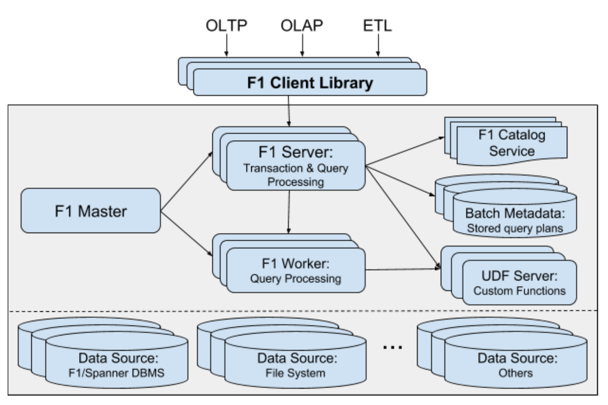

小型查询和事务直接在接收请求的 F1 server 上开始执行。对较大的查询，F1 从 worker 池中动态配置 worker 执行线程，调度分布式执行。最大的查询在使用 MapReduce 框架的可靠批处理模式中调度。最终结果在 F1 server 上汇集，再返回给客户端。F1 server 和 worker 通常无状态，客户端每次可与任意 F1 server 通信。由于它们不存储数据，添加 server 或 worker 不会触发数据重分布，因而数据中心内的 F1 Query 部署可通过增加节点轻松水平扩展。

### 查询执行

客户端查询请求可以到达任意一台 F1 server。收到请求后，server 首先解析和分析 SQL，然后提取查询访问的全部数据源和数据汇。如果某些源或汇在本地数据中心不可用，而其他数据中心有更接近它们的 F1 server，则当前 server 会将查询退回给客户端，同时告知可用于执行的最优数据中心集合。客户端随后将查询重新发送给目标数据中心的 F1 server。存储计算解耦和高性能网络已消除数据中心内的许多局部性顾虑，但在地理分散的多个数据中心中选择靠近数据的一个，仍会显著影响查询延迟。

查询在 F1 server 上以规划阶段开始执行。优化器把分析后的查询抽象语法树转换成关系代数算子的有向无环图（DAG），再在逻辑和物理层面优化。最终执行计划交给执行层。根据客户端指定的执行模式偏好，F1 Query 会在 server 和 worker 上使用交互式模式，或使用 MapReduce 框架的批处理模式，如图 2 所示。

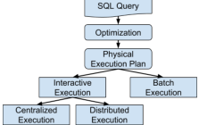

交互式执行时，优化器使用启发式方法在单节点集中式执行与分布式执行之间选择。在集中式模式中，首个收到查询的 server 立即分析、规划并执行查询；在分布式模式中，它只担任查询协调者，将工作调度到多个 worker 并行执行。这两种交互式模式对中小型查询都有较好的性能和资源效率。批处理模式面向处理大量数据的长时间查询，它将执行计划放入独立的执行存储库，由批处理分发与调度逻辑使用 MapReduce 异步运行，因此能容忍 server 重启和故障。

### 数据源

F1 server 和 worker 不仅能访问所在数据中心的数据，也能访问其他 Google 数据中心的数据。处理层与存储层解耦，使其能从 Spanner、Bigtable 等分布式存储系统，以及 CSV、面向记录的二进制格式、ColumnIO [51] 和 Capacitor [6] 等压缩列式文件中取回数据。对 Spanner 存储服务等具备相应能力的数据源，F1 Query 提供一致读和/或可重复读。

为了查询异构数据源，F1 Query 会抽象掉各种存储类型的细节：所有数据看起来都存放在关系表中，并可使用 Protocol Buffer [9] 形式的丰富结构化数据类型，因而可在不同数据源之间做连接。全局目录服务维护并检索不同格式和系统中数据源的元信息。对未登记在全局目录的数据源，客户端必须提供 `DEFINE TABLE` 语句，说明如何将底层数据表示为关系表。下例从 Colossus 上的 CSV 文件取回数据；F1 Query 必须知道文件的位置与类型，以及其中列的名称和类型。不同数据源可能需要不同的结构描述信息。

```sql
DEFINE TABLE People(
  format = 'csv',
  path = '/path/to/peoplefile',
  columns = 'name:STRING, DateOfBirth:DATE'
);

SELECT Name, DateOfBirth
FROM People
WHERE Name = 'John Doe';
```

F1 Query 原生支持 Google 内部最常用的数据源，但客户端偶尔需要通过预先未知的机制访问数据。为此，F1 允许通过表值函数（TVF）扩展 API 添加新的定制数据源，第 6.3 节将详细介绍。

### 数据汇

查询输出可以返回给客户端，也可以按查询要求存入外部数据汇。数据汇可以是各种格式的文件，也可使用多种远程存储服务。与数据源一样，它们可以是目录服务管理的表，也可以是手工指定的目标。托管表由 `CREATE TABLE` 创建，默认实现为 Colossus 上的文件。手工指定的存储目标使用 `EXPORT DATA` 语句，其规格与重新读取同一数据时对应的 `DEFINE TABLE` 规格类似。此外，查询还可创建会话局部临时表。

### 查询语言

F1 Query 遵循 SQL 2011 标准，并扩展了对嵌套结构化数据查询的支持。它支持左、右、全外连接、聚合、表子查询与表达式子查询、`WITH` 子句和分析窗口函数等标准 SQL 功能。对结构化数据，它支持可变长 `ARRAY` 类型和与 SQL 标准行类型非常相似的 `STRUCT`；数组能力包括将数组透视成多行表的 `UNNEST(array)`。F1 Query 还支持 Google 内部普遍用于结构化数据交换的 Protocol Buffers [9]，第 7.2 节将详述。文献 [12] 介绍了 F1 Query、Dremel [51]/BigQuery [3] 和 Spanner SQL [12] 共用的 SQL 方言，这使用户和应用可以以很小的成本在这些系统间迁移。

## 3. 交互式执行

F1 Query 默认以同步在线模式执行查询，称为交互式执行（interactive execution）。交互式执行分为集中式和分布式两种。在规划阶段，优化器分析查询并决定使用哪种模式。集中式模式由当前 F1 server 以单个执行线程立即执行计划；分布式模式则由当前 server 担任查询协调者，把工作调度到 F1 worker 进程并行执行。

### 3.1 单线程执行内核

图 3 给出一条 SQL 查询及其集中式执行计划。F1 Query 在该模式中使用单线程执行内核。图中矩形框是执行计划的算子。单线程执行采用递归拉取模型，每批处理 8 KiB 的元组。执行算子递归调用底层算子的 `GetNext()`，直到叶子算子取得一批元组。

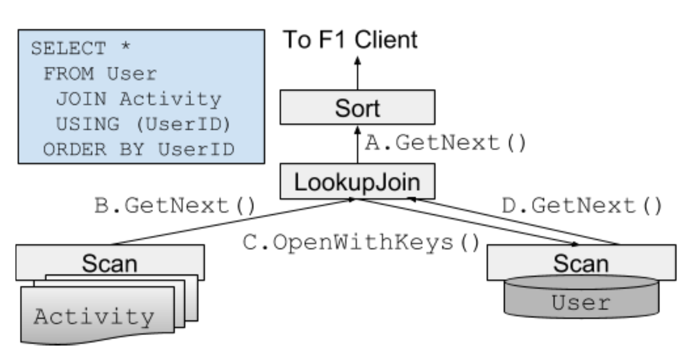

叶子通常是从数据源读取数据的扫描算子。每种数据源都有自己的扫描算子实现，功能集随源类型而异：有些只允许全表扫描，有些支持基于键的索引查找，还有些支持下推非键字段上的简单过滤表达式。独立的 `ARRAY` 扫描算子可在需要时将数组类型表达式产生为多行。

对可能包含 Protocol Buffer 的输入，所有扫描算子都支持在数据源扫描节点就立即解码，避免执行器在不需要完整值时仍传递巨大的编码数据块。扫描算子只提取查询所需的最小字段集合（第 7.2 节将详述）。F1 Query 还支持多种高性能列式数据源，它们将 Protocol Buffer 或 SQL `STRUCT` 的字段分开存储，完全不需要进行 Protocol Buffer 解码。

F1 Query 支持查找连接（索引嵌套循环连接）、哈希连接、归并连接和数组连接等多种连接算子。哈希连接是多级递归混合哈希连接，可将数据溢写到 Colossus 分布式文件系统。查找连接从左输入读取含键的行，然后用这些键在右输入做索引查找，其右输入必须是扫描算子。归并连接合并具有相同排序的两个输入。F1 Query 还为 Spanner 表提供集成扫描/连接算子，在底层表的数据流上实现归并连接。数组连接是对数组扫描的相关连接，数组表达式引用左输入，SQL 写作 `T JOIN UNNEST(f(T))`。

除扫描与连接外，F1 Query 还有投影、聚合（基于排序或可溢写到磁盘）、排序、并集和分析窗口函数算子。包括扫描和连接在内的所有执行算子，都内置支持对输出行施加过滤谓词以及 `LIMIT` 和 `OFFSET`。

### 3.2 分布式执行

当优化器判断高度并行的分区读更适合输入表时，便生成分布式执行计划。查询执行计划被拆成图 4 所示的查询片段（fragment），每个片段调度到一组 F1 worker 节点。各片段并发执行，同时具备流水线并行和丛林式并行。worker 节点是多线程的，同一 worker 也可执行同一查询的多个独立部分。

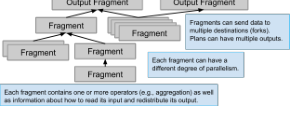

优化器使用自底向上的策略，按计划中每个算子对输入数据分布的要求来计算片段边界。算子可以要求其输入在 worker 间按某些字段哈希分布，典型例子是聚合的分组键或哈希连接键。若该要求与输入算子元组的当前分布兼容，优化器就将两个算子放在同一片段；否则在两者之间插入交换算子，形成片段边界。

接下来为每个片段选择并行 worker 数量。片段可有相互独立的并行度。叶子扫描中底层数据组织决定初始并行度，并受上限限制；宽度计算器随后沿计划树向上递归传播。例如，一个连接两个输入片段的哈希连接，若两个片段分别使用 50 和 100 个 worker，则连接使用 100 个 worker，以适应较大的输入。

下列查询说明了分布式执行。`Ads` 是存储广告信息的 Spanner 表，`Clicks` 是 Google 分析数据仓库 Mesa 中存储广告点击的表。查询找出在 Chrome OS 上发生、且广告开始日期晚于 2018-05-14 的所有点击，再按地区汇总合格元组，并按点击数降序排列：

```sql
SELECT Clicks.Region, COUNT(*) ClickCount
FROM Ads JOIN Clicks USING (AdId)
WHERE Ads.StartDate > '2018-05-14'
  AND Clicks.OS = 'Chrome OS'
GROUP BY Clicks.Region
ORDER BY ClickCount DESC;
```

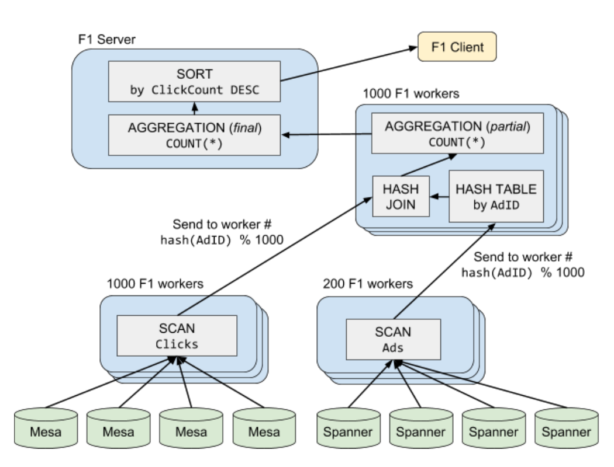

图 5 是该查询的一种可能计划。执行时，数据流自底向上经过各算子，直到聚合和排序算子。一千个 worker 分别扫描 `Clicks`，规划器将 `Clicks.OS = 'Chrome OS'` 下推到 Mesa 扫描中，使 Mesa 只向 F1 worker 返回符合过滤条件的行。两百个 worker 扫描 `Ads`，并应用 `Ads.StartDate > '2018-05-14'` 过滤。两个扫描的数据进入哈希连接，随后由同一 F1 worker 对连接结果做局部聚合。最后，F1 server 完成全局聚合，将排序后的输出返回客户端。

### 3.3 分区策略

在分布式模式中，F1 Query 并行执行多个片段，整体执行和数据流可视为图 4 所示的 DAG。数据通过交换算子重分区，跨越每个片段边界。对每个元组，发送端用分区函数确定其目标分区；每个分区号对应目标片段中的特定 worker。

交换操作由每个源片段分区到所有目标片段分区的直接 RPC 实现，每对发送端和接收端之间都有流量控制。这种 RPC 通信可扩展到每个片段数千个分区；需要更高并行度的查询通常放到第 4 节的批处理模式。交换算子只在数据中心内运行，利用 Google Jupiter 网络 [56]：在数万台主机组成的集群中，每台 server 均可以至少 10 Gb/s 的持续带宽与任意其他 server 通信。

优化器将每个扫描算子规划为执行计划的叶子，并指定期望并行度 `N`。要并行扫描，每个 worker 必须产生互不重叠的元组子集，所有 worker 合起来产生完整输出。调度器请求扫描算子把自身分成 `N` 份，扫描算子返回不少于 `N` 个分区描述。调度器再将计划副本调度到 `N` 个 worker，并向每个 worker 发送一个分区描述，worker 据此产生对应数据子集。若实际分区数（例如文件表的文件数）超过 `N`，执行器会随时间把分区动态分配给可用 worker，从而避免倾斜导致扫描长尾。

某些算子与其中一个输入在同一片段执行。例如，查找连接与左输入在同一片段，只处理该输入同一分区产生的元组。相反，图 5 中的哈希连接通常需要多个片段，且每个片段又有多个分区。除非输入的现有数据分布已与哈希连接键兼容，优化器会把每个输入扫描（或子计划）放在独立片段。两个源片段用同一个基于连接键哈希的分区函数，将数据发送给包含哈希连接的同一目标片段。这样，具有相同连接键的所有行都到达同一目标分区，每个哈希连接分区只处理键空间的一个子集。

聚合算子通常也需要重分区。有分组键时，计划按分组键哈希对输入重分区，将元组发往包含聚合算子的目标片段；没有分组键时，所有元组都发往单一目标。图 5 的无分组键聚合在交换算子之前增加了第二个聚合算子，尽力在内存中做局部聚合以减少传输数据量。对有分组键的聚合，同样的局部聚合还能缓解热分组键对目标片段全局聚合的不利影响。

F1 执行计划是可有多个根的 DAG。数据流 DAG 出现分叉时，一个计划片段可按各自的分区函数向多个目标片段重分区。这些分叉为 SQL `WITH` 子句和优化器去重后的相同子计划实现“只运行一次”语义，也用于分析函数、对 `DISTINCT` 输入做多次聚合等复杂计划。DAG 分叉对不同消费片段的数据消费速度差异很敏感；多条分支稍后再合并时，也可能引入分布式死锁，例如从 DAG 分叉产生的自哈希连接在构建阶段企图先消费所有元组。实现 DAG 分叉的交换算子先在内存中缓冲数据；所有消费者均阻塞时，再将数据溢写到 Colossus，以解决这些问题。

### 3.4 性能考虑

F1 Query 查询的主要性能问题来自数据倾斜和次优的数据源访问模式。哈希连接对两个输入的热键尤其敏感。被加载到哈希表的构建输入出现热键时，某个 worker 将比其他 worker 存储更多元组，可能导致溢写；探测输入出现热键则可能造成 CPU 或网络瓶颈。若一个输入小到可放入内存，F1 Query 支持广播哈希连接：读取较小的构建输入，将所有元组副本广播到每个哈希连接 worker，由各 worker 构建相同的哈希表。它不容易受倾斜影响，但对超出预期的大构建输入敏感。

查找连接在执行时都用索引键取回远程数据。简单的逐键实现会因底层分布式数据源的长尾延迟而非常慢，因此 F1 Query 的查找连接使用大批量外部行。若同一批中多次请求同一查找键，可先去重。扫描算子也能利用大批量优化数据取回：例如，分区数据源可找到必须从同一远程分区读取的多个键，将它们合并为一次高效访问。若一批所需远程请求数超过并行请求上限，请求可以乱序完成，长请求不会阻止较短请求继续前进，从而隐藏存储系统长尾延迟。

将查找连接直接放在左输入之上，也常会产生倾斜和不理想的访问模式。访问模式可能是任意的，而且同一键的请求若分散在不同片段分区，就完全无法去重。连续堆叠多个查找连接时，某些键在中间步骤中与过多行连接，也会导致倾斜。为此，优化器可用多种分区函数重分区左输入；分区函数决定查找连接的数据源访问模式，对性能影响很大。

哈希分区可保证每个键只从一个节点发出，从而能对查找去重，但从每个节点观察，对数据源仍是随机访问。Spanner 和 Bigtable 等范围分区数据源可从查找期间的键空间局部性中获得巨大收益：键集中于较小范围时，它们很可能落在同一数据源分区，可由一次远程访问返回。一种利用方式是显式静态范围分区，将固定键范围分配给每个目标片段分区，但它有时对倾斜敏感。

更好的范围策略是动态范围重分区：每个发送端根据本地分布信息单独计算范围分区函数。它基于一个原则：某个输入计划片段分区观测到的分布，往往能较好地近似整体数据分布。许多情况下，它能生成键空间局部性更强的查找模式，同时将查找工作负载完全均匀地分配给 worker。我们观察到，该策略甚至比根据查找数据源键分布静态计算的理想范围分区更好，尤其是在左输入倾斜、只用了部分键空间时。它还会将输入流中暂时的热键分散到更多目标节点，自适应地避免静态范围分区造成的临时热点。

F1 Query 算子一般在内存中执行，不将检查点写入磁盘，并尽可能以流方式传输数据。这避免了将中间结果保存到磁盘的代价，让查询以消费输入所允许的最快速度运行。配合数据源的积极缓存，复杂分布式查询可在数十或数百毫秒内完成 [50]。但内存执行对 F1 server 和 worker 故障敏感，客户端库会透明重试失败查询。实践中，运行一小时以内的查询足够可靠；运行更久的查询可能反复失败，此时下一节的批处理模式更合适。

## 4. 批处理执行

除交互式分析外，F1 Query 也支持对大量数据执行长时间、大规模的转换。这类转换通常实现 ETL 工作流。Google 历史上的许多 ETL 管道使用 MapReduce 或 FlumeJava [19] 开发，大量使用定制数据转换代码。虽然这种管道有效，但开发和维护成本很高，而且很难享受 SQL 优化器的过滤下推、属性裁剪等优化。例如，手写管道可能在阶段间传送巨大数据结构，即使只需要少数字段，因为针对此优化会带来难以接受的开发和维护开销。SQL 的声明式特性使这些手工优化不再必要，因而更适合用于此类管道。

交互式模式的内存处理模型不适合处理 worker 故障，而长时间查询又很可能遇到故障。为此，F1 Query 增加了批处理模式（batch mode），使长查询在 F1 server 或 worker 失败时仍能可靠执行。它还容忍客户端故障：客户端可以提交查询供异步处理，然后断开连接。

批处理模式构建在图 2 的 F1 Query 框架之上，与两种交互式模式共用查询规格、查询优化和执行计划生成组件，关键差异在于执行调度。交互式模式同步执行，F1 server 监督整个查询直至完成；批处理模式由 F1 server 异步调度，并在中央注册表中记录进度。这种架构带来三项挑战：

- 批处理中的执行算子必须换一种通信方式，因为计划片段是异步执行的。分布式交互模式中，所有片段同时活跃并用 RPC 通信；批处理片段在不同时间执行，无法如此通信。
- 批处理查询运行时间长，必须考虑执行中的短暂故障，包括机器重启。系统需要容错机制来持久化查询中间状态，并保证持续前进。
- 需要更高层的新服务框架跟踪数千个处于不同执行阶段的批处理查询，保证它们最终完成。

### 4.1 批处理执行框架

批处理模式使用 MapReduce（MR）框架作为执行平台。在抽象层面，查询计划的每个片段（见图 4）都可映射为一个 MapReduce 阶段，处理管道的每个阶段都把输出存入 Colossus。这种通信模型允许不同 MapReduce 阶段异步执行，同时提供所需容错性。整个阶段失败时，由于输入已存在 Colossus，可重新启动；阶段内的故障则由 MapReduce 自身的容错能力处理。

最简单的映射是每个 F1 计划片段对应一个 MapReduce 阶段，但 F1 Query 进行了与 FlumeJava [19] 的 MSCR 融合类似的优化。在该优化中，叶子节点抽象为 map 操作，内部节点抽象为 reduce 操作。但这会产生 map-reduce-reduce 处理，与 MapReduce 框架并不完全对应。F1 Query 在中间插入实现恒等函数的特殊 map 算子，将其拆成 `map-reduce` 与 `map<identity>-reduce` 两个阶段。

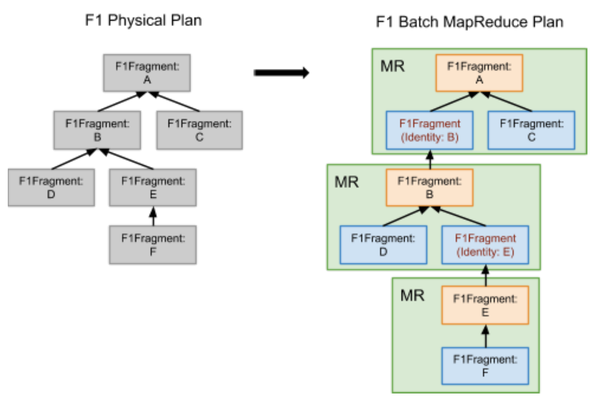

图 6 展示常规物理执行计划到批处理 MapReduce 计划的映射。图中左侧计划只映射为三个 MapReduce 阶段，而默认的逐片段映射会产生六个阶段。一种还未实现的进一步改进，是使用 Cloud Dataflow [10] 这类原生支持 map-reduce-reduce 处理的框架。

分布式交互模式通过 RPC 在片段间经网络发送数据；批处理模式则将数据物化到暂存文件，再读回并馈入下一个计划片段。两种模式通过计划片段执行器的通用 I/O 接口实现。交互式分布执行中，计划所有节点同时活跃，可流水线并行；批处理没有流水线，只有当所有输入完全可用时才启动 MapReduce 阶段，但它仍支持丛林式并行，即独立 MR 阶段可并行运行。

F1 Query 批处理运行规模非常大，而计划中每个交换算子都带来巨大的数据物化开销，因此尽可能减少交换算子很有价值，对超大表尤其如此。一种方法是将哈希连接替换为查找连接。对较小输入仍大到无法使用广播哈希连接，或倾斜明显的连接，批处理模式可将较小输入物化为基于磁盘的查找表，即排序字符串表（SSTable）[20]。然后它在较大输入所在片段中使用查找连接访问这些表，避免对较大输入进行高成本重分区。查找还使用分布式缓存层减少磁盘 I/O。

### 4.2 批处理服务框架

F1 Query 批处理服务框架编排所有批处理查询，负责注册传入查询、将其分发到不同数据中心，并调度和监控对应的 MapReduce 处理。图 7 展示了该服务框架。当 F1 客户端发出批处理查询时，一台 F1 server 接收查询、生成执行计划，然后在 Query Registry 中注册。Query Registry 是全局分布式 Spanner 数据库，跟踪所有批处理查询的元数据。Query Distributor 再根据负载均衡与执行所需数据源的可用性，为查询分配数据中心。

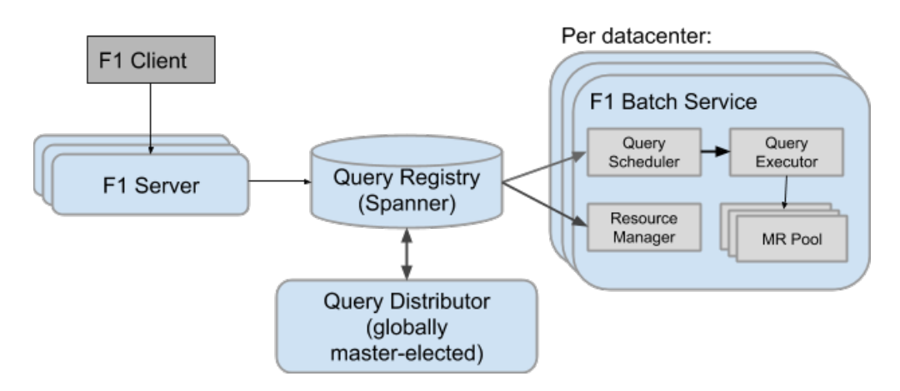

随后，目标数据中心内的框架组件接手查询。每个数据中心的 Query Scheduler 定期从 Query Registry 取得新分配的查询，创建查询执行任务的依赖图。当任务就绪且资源可用时，Scheduler 将任务发送给 Query Executor，后者使用 MapReduce worker 池执行。

服务框架在各层都具有恢复能力。所有组件都有冗余：全局 Query Distributor 具有多副本并选主，每个数据中心也有多个冗余 Query Scheduler。查询的全部执行状态都保存在 Query Registry，所有其他组件因而可以有效无状态、随时替换。数据中心内失败的 MapReduce 阶段会重试数次；若整个查询停滞，例如遇到数据中心中断，Distributor 会把查询重新分配到另一个数据中心，并从头开始执行。

## 5. 查询优化器架构

查询优化器开发出名复杂。F1 Query 通过对所有查询复用同一套规划逻辑来缓解这一问题，不论查询使用哪种执行模式。交互式和批处理模式的执行框架差异很大，但使用相同计划和相同执行内核；因而在 F1 Query 优化器中实现的任何规划功能，都会自动应用于两种模式。

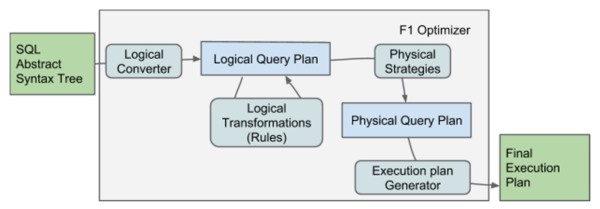

图 8 给出优化器的高层结构，其思路受 Cascades [35] 式优化启发。该基础设施与 Spark Catalyst 规划器 [11] 共享一些设计原则和术语，这源于 F1 Query 团队和 Catalyst 团队成员对此早期的讨论。首先调用 Google SQL resolver 解析和分析原始 SQL，生成已解析的抽象语法树（AST）。优化器将 AST 转换成关系代数计划，并在其上执行多项规则，直到达到不动点，得到启发式确定的最优关系代数计划。

优化器随后将最终代数计划转为物理计划，包括全部数据源访问路径和执行算法，再将物理计划转换为适合查询执行的最终数据结构，交给查询协调者。需要注意，F1 Query 优化器主要基于启发式规则；它会在统计数据属性存在时有限利用，但由于数据源极其多样，一条典型 F1 查询往往只能根据事先可行的情况获得某些数据源的统计信息。

### 5.1 优化器基础设施

优化器的所有阶段都建立在共通基础设施层上，该层表示各种计划树及作用于其上的转换。所有计划树结构都不可变：转换阶段必须构建新算子才能修改查询计划。这一属性支持探索式规划和子树复用。为减轻反复构造、销毁数据结构对性能的影响，优化器在内存区（arena）中构建所有数据结构，并在查询关键路径之外销毁它们。

优化器为表达式、逻辑计划和物理计划分别使用独立的树层次结构。数百种树节点的样板代码由约 3,000 行 Python 和约 5,000 行 Jinja2 [7] 模板生成，最终得到约 60 万行 C++。生成代码为查询规划提供领域专用语言（DSL），包含计算每个树节点哈希、比较树相等性等方法，以及在标准容器和测试框架中存储、表示树所需的辅助方法。代码生成为工程师节省大量时间、减少开发错误，并使新功能能高效推广到各种树层次。

所有关系代数规则和计划转换阶段，都通过用 C++ 嵌入的树模式匹配与构建 DSL 检查和操作树。借助代码生成和 C++ 模板，树模式表达式性能与手工优化代码相当，同时更简洁、更清晰地表达每条重写的意图。

### 5.2 逻辑查询计划优化

SQL 查询分析器将原始查询文本变成已解析 AST，F1 Query 优化器再将其转成关系代数树，并用逻辑重写规则做启发式更新。规则按批次组织，每批或只运行一次，或运行到不动点。应用的规则包括过滤下推、常量折叠、属性裁剪、约束传播、外连接收窄、排序消除、公共子计划去重和物化视图重写。

F1 Query 的数据源可在关系表列中包含结构化 Protocol Buffer 数据，所有规则都将 Protocol Buffer 视为一等公民。例如，核心属性裁剪规则会把单个 Protocol Buffer 字段的提取表达式尽可能沿查询计划向下递归推送。若提取操作到达计划叶子，往往能直接集成到扫描中，减少从磁盘读取或经网络传输的字节数。

### 5.3 物理查询计划构造

优化器根据关系代数计划创建物理计划树，其中表示真正的执行算法和数据源访问路径。物理计划构造逻辑封装在称为“策略”（strategy）的模块中。每个策略尝试匹配一种特定的关系代数算子组合，然后生成实现这些逻辑算子的物理算子。例如，一个策略只处理查找连接：它识别适用索引的逻辑表连接，并生成物理查找连接。

每个物理算子由一个跟踪多项数据属性的类表示，包括分布、排序、唯一性、估计基数和易变性等。优化器用这些属性决定何时插入交换算子，将输入元组重分区为下一个算子所需的新数据分布。它也用物理计划属性决定查询采用集中式还是分布式模式。若任一扫描对集中式查询而言代价过高，例如它是全表扫描，则整个查询都按分布式查询规划。

### 5.4 执行计划 Fragment 生成器

优化器的最后阶段将物理查询计划转换成可直接执行的一系列计划片段。片段生成器把物理计划树节点转换为对应的执行算子，并在每个交换算子处建立片段边界。它还负责计算每个片段的最终并行度：从包含分布式表扫描的叶子片段开始，沿查询计划向上传播。

## 6. 可扩展性

F1 Query 可以以多种方式扩展：它支持定制数据源，以及用户定义标量函数（UDF）、聚合函数（UDA）和表值函数（TVF）。用户定义函数可将任意数据类型作为输入和输出，包括 Protocol Buffer。客户端可用 SQL 语法表达自定义逻辑，从查询中抽象出公共概念，提高可读性和可维护性；也可用 Lua [42] 脚本为即席查询和分析定义新函数。对 C++ 和 Java 等编译型或托管语言，F1 Query 与名为 UDF server 的专用辅助进程集成，使客户端可在 SQL 查询和其他系统之间复用通用业务逻辑。

UDF server 是由 F1 Query 客户端自行拥有、独立部署的 RPC 服务，通常用 C++、Java 或 Go 编写，与调用它们的 F1 server 和 worker 运行在同一数据中心。每个客户端完全控制自己的 UDF server 发布周期和资源配置。UDF server 暴露统一 RPC 接口，使 F1 server 能查明其导出函数的详细信息，并实际执行函数。

要使用某个 UDF server 的扩展，F1 Query 客户端必须在发送给 F1 server 的查询 RPC 中附上 UDF server 池地址。作为替代，F1 数据库所有者可配置默认 UDF server，供该数据库上下文内的所有查询使用。执行期间 F1 会与 UDF server 通信，但它们仍是独立进程，可将核心 F1 系统与定制函数故障隔离。

SQL 和 Lua 脚本函数不使用 UDF server，也没有存放其定义的单一中心仓库。客户端必须在每个发往 F1 Query 的 RPC 中提供定义。F1 Query 命令行等客户端工具会从显式加载的配置文件、其他源和当前命令中收集函数定义，随后在每个 RPC 中附上全部相关定义。F1 Query 还可将多个 SQL UDF、UDA 和 TVF 组织为模块，便于客户团队结构化定制业务逻辑、改进可维护性并促进复用。模块与单个 UDF 一样，通过查询 RPC 传给 F1 Query。

### 6.1 标量函数

F1 Query 支持用 SQL、Lua 和 UDF server 上的编译代码编写标量 UDF。SQL UDF 允许用户将复杂表达式封装为可复用库，并在查询的调用位置就地展开。对 Lua 这类脚本语言，查询执行器维护沙箱解释器，在运行时求值。例如，以下 Lua UDF 将字符串编码的日期转换为表示对应 Unix 时间的无符号整数：

```lua
local function string2unixtime(value)
  local y,m,d = match("(%d+)%-(%d+)%-(%d+)")
  return os.time({year=y, month=m, day=d})
end
```

UDF server 导出的函数只能在投影执行算子中求值。解析查询时，系统为每个 UDF 生成函数表达式，优化器再将它们全部移入投影。执行时，投影算子缓冲输入行并计算对应 UDF 参数，直到大小上限；worker 随后向相应 UDF server 发送 RPC。通过将多个 RPC 流水化，可隐藏 UDF server 延迟，因此延迟相当高的 UDF 实现也不会明显影响查询延迟。

### 6.2 聚合函数

F1 Query 还支持用户定义聚合函数，将一个分组的多行输入合并为一个结果。用户可在 SQL 中定义 UDA，由优化器在每个调用点展开；对编译型和托管语言，系统也支持将 UDA 托管在 UDF server 中。基于 UDF server 的 UDA 定义必须实现典型的 `Initialize`、`Accumulate` 和 `Finalize` 操作 [31,43,44]，以及用于合并局部聚合缓冲区（见图 5）的 `Reaccumulate` 操作。

执行时，聚合算子处理输入行，并在内存中为每个 UDA 聚合值缓冲聚合输入。当哈希表中所有缓冲输入的内存用量之和超过阈值，执行器将每个分组的现有聚合值和新输入发送给 UDF server，后者调用适当 UDA 操作，为每组产生新聚合值。UDF server 无状态，每个 F1 server 因而可将请求并行分发到多个 UDF server 进程。

### 6.3 表值函数

F1 Query 还提供表值函数（TVF）框架，供客户端构建自己的用户定义数据库执行算子。TVF 的显著用途包括在 SQL 执行中集成模型训练等机器学习步骤，让用户能在单一步骤中消费数据并执行高级预测。公司各处的开发团队都可按需添加 TVF 数据源，无需与 F1 Query 核心开发人员交互，也无需重启正在运行的数据库 server。

TVF 既可接收常量标量值，也可接收整张表，并使用这些输入返回新表。查询可在 `FROM` 子句中调用 TVF，传入标量参数、数据库表或表子查询。例如，以下调用使用标量参数和数据库表计算过去 3 天的广告点击活动：

```sql
SELECT *
FROM EventsFromPastDays(3, TABLE Clicks);
```

TVF 与 UDF、UDA 一样可用 SQL 定义。这种 TVF 类似带参数的视图，且参数可以是整张表。在查询优化之前，TVF 就展开到查询计划中，因而优化器能完整优化它。上述 TVF 可以定义为：

```sql
CREATE TABLE FUNCTION EventsFromPastDays(
  num_days INT64, events ANY TABLE) AS
SELECT * FROM events
WHERE date >= DATE_SUB(
  CURRENT_DATE(), INTERVAL num_days DAY);
```

此例使用 `ANY TABLE` 表明函数可接受任意表作为参数。在这种情况下，TVF 在查询分析时根据实际输入表动态计算输出 schema，然后 schema 在该查询整个执行期间保持固定。也可以要求输入表具有特定 schema，F1 Query 会在分析期间强制该不变量。

更复杂的 TVF 可在 UDF server 中定义。UDF server 通过函数签名暴露 TVF 定义，签名可像 SQL TVF 一样包含泛型参数。TVF 定义还提供根据具体调用计算输出表 schema 的函数。输出 schema 不仅可依赖输入表列类型，还可依赖标量常量参数值，因此即使签名中没有泛型参数，TVF 也会用该函数计算输出 schema。定义还向优化器暴露执行属性，例如某个作用于输入表的 TVF 能否通过按特定键分区输入表，然后分别对每个分区调用 TVF 实现来并行化。

优化器使用两种算子之一经网络求值远程 TVF。第一种专用于没有输入表参数的 TVF：此时它代表远程数据源，规划和执行方式与其他数据源相同，包括支持分区扫描和查找连接。带输入表参数的函数使用专用 TVF 执行算子。对两种 TVF，优化器都可将过滤、限制和聚合步骤下推到 TVF 内，TVF 可借此减少工作。

远程 TVF 求值的 RPC 协议使用持久双向流网络连接，向 UDF server 发送输入行并接收输出行，如图 9 所示。对远程数据源，优化器还向 UDF server 发送 RPC，取回 TVF 的分区描述，使多个 worker 能并行扫描数据源。

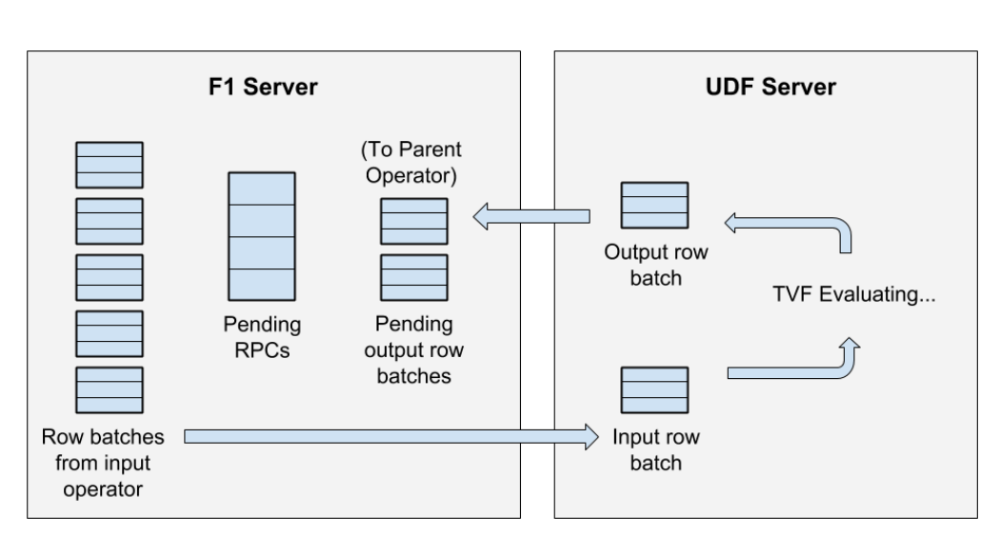

## 7. 高级功能

### 7.1 鲁棒性能

F1 Query 将性能鲁棒性视为数据库查询处理的关键问题，也是效率和可扩展性之外影响用户体验的第三个维度。鲁棒性要求性能在面对意外的输入规模、意外的选择率和其他因素时平滑退化。如果无法平滑退化，用户就会看到性能断崖，即算法或计划代价函数的不连续点。例如，从内存快速排序转向外部归并排序时，一旦整个输入开始溢写到临时文件，端到端排序时间可增加一倍或更多。

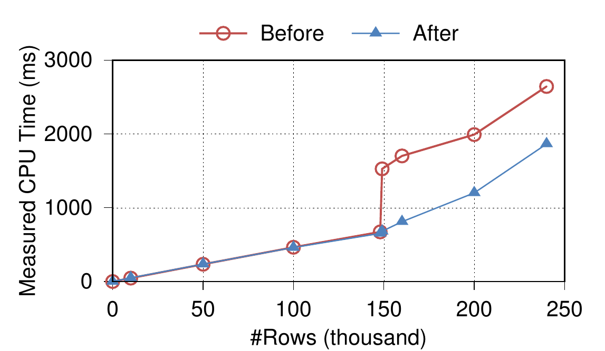

图 10 对比了 F1 Query 排序操作在消除断崖前后的表现。断崖会带来多个问题：性能无法预测，用户体验差；优化器选择更易出错，因为很小的基数估计误差可放大为巨大的代价计算误差；在并行执行中，计算节点之间的轻微负载不均也可变成实际运行时间的巨大差距。

F1 Query 使用鲁棒算法防止断崖。核心思想不是在优化时或执行时使用二元开关，而是让执行算子在不同操作模式之间逐步过渡。例如，排序算子只从内存工作区溢写刚好足以为新输入腾出空间的数据。排序转向多次归并时，多一个输入字节本可能迫使所有记录经历两次归并而非一次 [36]，F1 Query 已从排序和聚合实现中消除这两类断崖。SmoothScan [16] 和哈希连接的动态移出（dynamic destaging）[52] 也是成功的断崖避免或消除案例。相反，若多出“一行”就停止执行、重启编译时优化器，动态重优化本身会引入巨大断崖。

### 7.2 Google Protocol Buffers 中的嵌套数据

Protocol Buffers [9] 在 Google 内部无处不在，既用于数据交换也用于存储。它是一种结构化数据格式，记录类型称为 message，支持数组值或 repeated 字段，既有人类可读的文本格式，也有紧凑高效的二进制表示。Protocol Buffer 是 F1 Query 数据模型的一等数据类型。SQL 方言提供操作单个 message 的扩展，例如用 `msg.field` 访问字段，用 `NEW Point(3 AS x, 5 AS y)` 创建新 message，并支持对 repeated 字段的相关子查询表达式和连接。

查询 Protocol Buffer 与处理 XML [18] 和 JSON [21] 等半结构化格式面临许多相同挑战，但也有关键差异。JSON 是完全动态类型的，且常以人类可读格式存储；Protocol Buffer 静态定型，通常使用紧凑二进制格式，可更高效地解码。其二进制编码与 MongoDB [2] 的二进制 JSON 有些相似，但字段静态定型且以整数而非字符串标识，效率更高。有些数据源还像 XML 数据库对文档做纵向切分 [29] 那样，将 message 纵向分解为列式格式 [51]。

查询引用的所有 Protocol Buffer 的准确结构和类型在规划时已知，优化器会从数据源扫描中裁掉全部未使用字段。对列式数据源，这会减少 I/O，并使过滤器能高效地按列求值。对使用行式二进制格式的面向记录数据源，F1 Query 使用高效流式解码器，只扫描一次编码数据，提取必需字段、跳过无关数据。这只有借助每种 Protocol Buffer 类型的固定定义，以及能快速识别、跳过的整数字段标识才可能实现。

## 8. 生产指标

本节报告 F1 Query 生产部署中一个代表性子集的查询处理性能和流量指标。F1 Query 高度去中心化，在多个数据中心复制，每个数据中心使用数百到数千台机器。论文没有公开部署的专有细节，但本节的指标足以说明该系统的高度分布与大规模特征。多天指标同时展示了其变化性与稳定性；多季度的 QPS 增长与查询延迟则说明系统如何在需求增长时扩展而不导致性能退化。

F1 Query 模糊了工作负载间的边界，因此无法报告流量中哪些比例属于 OLTP、OLAP 或 ETL。但不同执行模式的延迟指标表明，无论查询意图如何，F1 Query 都可从极小到巨大的各种规模处理查询。每周有超过 10,000 名 Google 内部用户使用 F1 Query，既包括做即席分析的个人，也包括代表整个产品活动的系统用户。F1 Query 还是数百个生产 F1/Spanner 数据库的 SQL 层。

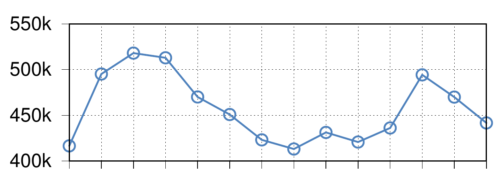

图 11 和图 12 报告交互式执行子系统的总吞吐和延迟。图 11 表明，多天内交互式子系统的平均吞吐约为每秒 450,000 个查询，即每天约 400 亿个查询。我们观察到，系统可轻松处理高达平均吞吐两倍的峰值，而不会不利影响查询延迟。

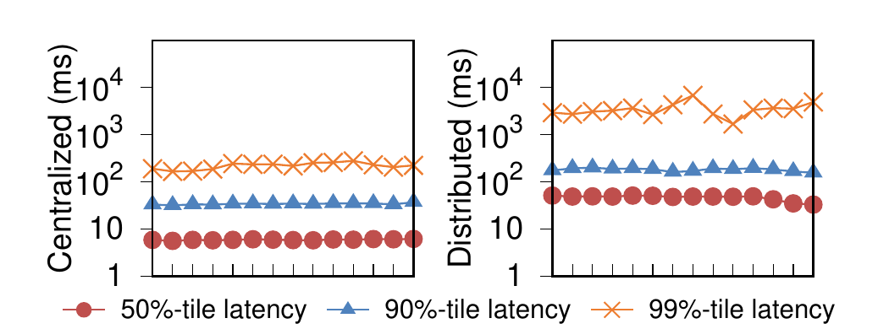

图 12 报告集中式和分布式交互查询的延迟。集中式查询的第 50、90 和 99 百分位延迟分别低于 10 ms、50 ms 和 300 ms。分布式执行的延迟更高，三个百分位约为 50 ms、200 ms 和 1,000 ms 以上。由于长时间即席查询的方差很大，分布式执行的第 99 百分位波动也大得多。

图 13 报告批处理模式的查询数和数据处理量。批处理平均每天约 55,000 个查询，明显少于交互式执行；主要原因是只有超大分析查询和 ETL 管道才需要批处理。批处理查询的平均延迟明显低于 500 秒（少于 10 分钟），最大延迟可达 10,000 秒以上（数小时）。它比交互式模式更慢，是因为这些查询更复杂、处理数据更多。批处理每天的总输入数据量约为 8-16 PB，这些数字明确表明 F1 Query 在 Google 内部的运行规模。

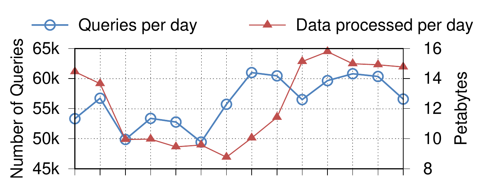

最后看 F1 Query 多季度的长期查询吞吐增长。图 14 以相对值表明，查询吞吐在四个季度中几乎翻倍。F1 Query 的可扩展设计使它能承担增长的吞吐，而图 15 显示集中式与分布式交互查询的延迟没有受到不利影响。

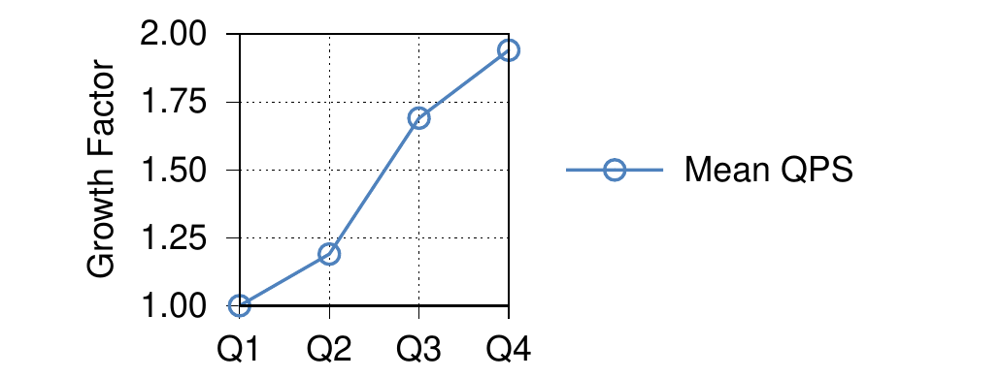

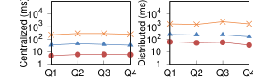

## 9. 相关工作

分布式查询处理在数据库研究中历史悠久 [14,30,47,49,61]。20 世纪 70 年代末到 80 年代初，计算机网络的出现使研究者开始构想跨多台机器的分布式数据库架构。代表性工作包括 Computer Corporation of America 发起的 SDD-1（分布式数据库系统）[14]，以及 IBM 圣何塞研究院发起的 System R* [49]。两者在分布式事务管理、并发控制、恢复、查询处理和查询优化上都取得重大进展，但当时网络带宽和延迟的制约使分布式数据库难以实现。

相关地，多处理器和多块物理磁盘上的数据并行架构催生了大量并行关系查询处理工作 [15,27,28,32,34,41,45]。与当时的分布式查询处理不同，并行数据库非常成功，相关研究大量被 DBMS 厂商商业化，尤其用于构建处理分析查询的大型数据仓库。

较早和当今的许多研究仍主要面向经典的客户端-服务器或集群架构。据我们所知，利用数据中心级计算与存储资源的分布式并行数据库系统性设计工作仍然很少。商业 DBMS 厂商开始提供云数据库解决方案 [8,13,17,37,59]，支持将数据分区到多台数据中心机器并对其查询。Snowflake [24] 等并行数据库也像最初塑造 F1 [55] 的设计原则那样分离存储和计算。但这些系统即使在物理上分离了存储与计算，仍然紧密耦合：它们预期数据原生存在自己完全控制的存储层，或在查询前先摄取数据。

F1 Query 却能对任意数据中心中以任意格式存储的数据集执行查询，不对格式作假设，也不需要提取步骤。上述其他系统还常专注于一种场景，最常见的是分析查询，而 F1 Query 覆盖全部场景。例如 Impala [46] 声称受 Google F1 启发，也分离存储与计算，但它从头就是分析查询引擎，不支持 OLTP 式查询和 F1 Query 查找连接这类相关构件。

Pig Latin [53]、Hive [58] 和近期之前的 Spark [62] 与 F1 Query 批处理模式类似，以近似 MapReduce 的批处理范式实现查询处理。这些系统提供大致声明式的抽象，也可用定制代码扩展。F1 Query 的主要优势是多功能性：同一 SQL 查询既可在少量数据上交互式执行，也可在巨量数据上以可靠批处理模式运行。其中一些系统必须使用定制数据流语言而不支持 SQL，因而查询也难以迁移到低延迟系统等其他系统上。

关系 DBMS 长期以来都支持在 SQL 查询执行中消费和返回值的 UDF [48,60]。SQL/MapReduce [31] 探索了在与数据库 worker 共置的独立进程中运行 TVF。F1 Query 将此思路扩展为 UDF server 与数据库完全解耦，可独立部署与扩展，并由 F1 server、worker 和批处理 MapReduce worker 共享。文献 [54] 也研究了不透明 TVF 的优化支持。AWS Lambda [1] 和 Google Cloud Functions [5] 用 serverless 架构 [40] 实现解释型和托管语言的 UDF；F1 Query UDF server 还支持完全编译的 C++ 和 Go，以运行低延迟交互查询，但原理上 UDF server 也可用 serverless 架构实现。

### 9.1 Google 相关技术

F1 Query 与对外提供的 Google 系统 Spanner 和 BigQuery 有一些共同功能。三者的关键相似之处是共用 SQL 方言，让开发者和分析人员能以很小的成本在系统间迁移。

Spanner SQL [12] 和 F1 Query 有许多共同点，但前者是运行在事务核心上的单一焦点 SQL 系统，而 F1 Query 与数据源松耦合。Spanner SQL 还能以很细的粒度重启查询，F1 Query 的可重启粒度则更粗。BigQuery 是 Google 云数据仓库，其查询由 Google 内部广泛用于即席分析的 Dremel [51] 提供服务。Dremel 针对列式数据上的分析查询优化，能做大规模聚合与连接。F1 Query 支持这些场景，另外还支持对能做键查找的数据源执行 OLTP 式查询。

PowerDrill [39] 是 Google 内部的交互式数据分析探索引擎，它是为某类查询预处理数据的紧耦合系统。F1 Query 范围更广，但在数据探索场景上还没有等效优化水平。Tenzing [22] 用 MapReduce 执行 SQL，其查询后来迁移到 Dremel 或 F1 Query，长时间 ETL 式查询主要由 F1 Query 批处理模式服务。两者都以 MapReduce 为执行框架，但 F1 Query 批处理服务有更好的容错、用户隔离和调度公平性，因而吞吐更高，高负载下的查询延迟约为 Tenzing 的 45%。

FlumeJava [19] 和 Cloud Dataflow [4,10] 是 MapReduce 的现代替代，允许以类似 Pig Latin 的更高抽象层指定管道操作。它们是面向批处理的系统，不支持交互式查询，也不原生支持 SQL。它们可对数据流做部分优化，但缺少属性裁剪等能力。论文发表时，团队正在扩展 F1 Query 批处理模式，以利用 FlumeJava 相比经典 MapReduce 的改进。

## 10. 结论与未来工作

本文证明，可以构建一个查询处理系统，覆盖存放在任意数据源中的数据所需的大量处理与分析场景。将这些场景统一到单一系统，相比不同场景各有独立系统能获得明显的协同效应。查询解析、分析和优化等通用功能不需重复开发，因而为一个场景实现的改进会自动惠及其他场景。

更重要的是，单一系统为客户端的数据查询需求提供一站式服务，消除了客户端触及更专用系统的场景边界时会遇到的不连续或“断崖”。我们认为，F1 Query 的广泛适用性，正是它在 Google 内部建立庞大用户群的基础。

F1 Query 仍在积极开发，以处理新场景，并缩小与专用系统的性能差距。例如，由于执行内核面向行，它还无法匹配 Vectorwise [63] 等向量化列式执行引擎的性能，转向向量化执行内核是未来工作。另外，由于数据源都已解耦且位于远端，F1 Query 不像无共享架构那样为数据维护查询引擎原生格式的本地缓存，目前依赖数据源现有缓存或 TableCache [50] 等远程缓存层。

要支持 PowerDrill [39] 所提供的内存或近内存分析，F1 Query 需要支持单个 worker 的本地缓存，以及感知局部性的工作调度，将工作导向最可能缓存了数据的 server。远程数据源也使收集优化统计信息更困难，团队正设法使其可用，以便 F1 Query 能使用基于代价的优化规则。虽然 F1 Query 的水平扩展表现出色，团队也在研究如何改进缩容性能：例如仅用少数 server 执行中等规模的分布式查询，减少交换操作的成本和延迟。

## 致谢

我们感谢 Alok Kumar、Andrew Fikes、Chad Whipkey、David Menestrina、Eric Rollins、Grzegorz Czajkowski、Haifeng Jiang、James Balfour、Jeff Naughton、Jordan Tigani、Sam McVeety、Stephan Ellner 和 Stratis Viglas 为 F1 Query 作出的贡献或对论文提供的反馈；也感谢实习生和博士后 Michael Armbrust、Mina Farid、Liam Morris 与 Lia Guy 对 F1 Query 的工作。最后，我们感谢 F1 SRE 团队为 F1 Query 生产环境提供出色支持，并协助将服务扩展至数千用户。

## 11. 参考文献

- [1] AWS Lambda. https://aws.amazon.com/lambda/.
- [2] BSON (binary JSON). http://bsonspec.org.
- [3] Google BigQuery. https://cloud.google.com/bigquery.
- [4] Google Cloud Dataflow. https://cloud.google.com/dataflow.
- [5] Google Cloud Functions. https://cloud.google.com/functions/docs/.
- [6] Inside Capacitor, BigQuery's next-generation columnar storage format. https://cloud.google.com/blog/big-data/2016/04/inside-capacitor-bigquerys-next-generation-columnar-storage-format.
- [7] Jinja. http://jinja.pocoo.org.
- [8] Oracle database cloud service. https://cloud.oracle.com/database.
- [9] Protocol Buffers. https://developers.google.com/protocol-buffers.
- [10] T. Akidau, R. Bradshaw, C. Chambers, S. Chernyak, R. Fernandez-Moctezuma, R. Lax, S. McVeety, D. Mills, F. Perry, E. Schmidt, and S. Whittle. The Dataflow model: A practical approach to balancing correctness, latency, and cost in massive-scale, unbounded, out-of-order data processing. PVLDB, 8(12):1792-1803, 2015.
- [11] M. Armbrust, R. S. Xin, C. Lian, Y. Huai, D. Liu, J. K. Bradley, X. Meng, T. Kaftan, M. J. Franklin, A. Ghodsi, and M. Zaharia. Spark SQL: Relational data processing in Spark. In SIGMOD, pages 1383-1394, 2015.
- [12] D. F. Bacon, N. Bales, N. Bruno, B. F. Cooper, A. Dickinson, A. Fikes, C. Fraser, A. Gubarev, M. Joshi, E. Kogan, A. Lloyd, S. Melnik, R. Rao, D. Shue, C. Taylor, M. van der Holst, and D. Woodford. Spanner: Becoming a SQL system. In SIGMOD, pages 331-343, 2017.
- [13] P. A. Bernstein, I. Cseri, N. Dani, N. Ellis, A. Kalhan, G. Kakivaya, D. B. Lomet, R. Manne, L. Novik, and T. Talius. Adapting Microsoft SQL server for cloud computing. In ICDE, pages 1255-1263, 2011.
- [14] P. A. Bernstein, N. Goodman, E. Wong, C. L. Reeve, and J. B. Rothnie, Jr. Query processing in a system for distributed databases (SDD-1). TODS, 6(4):602-625, 1981.
- [15] D. Bitton, H. Boral, D. J. DeWitt, and W. K. Wilkinson. Parallel algorithms for the execution of relational database operations. TODS, 8(3):324-353, 1983.
- [16] R. Borovica-Gajic, S. Idreos, A. Ailamaki, M. Zukowski, and C. Fraser. Smooth scan: Statistics-oblivious access paths. In ICDE, pages 315-326, 2015.
- [17] D. G. Campbell, G. Kakivaya, and N. Ellis. Extreme scale with full SQL language support in Microsoft SQL Azure. In SIGMOD, pages 1021-1024, 2010.
- [18] D. Chamberlin. Xquery: A query language for XML. In SIGMOD, pages 682-682, 2003.
- [19] C. Chambers, A. Raniwala, F. Perry, S. Adams, R. Henry, R. Bradshaw, and N. Weizenbaum. Flumejava: Easy, efficient data-parallel pipelines. In PLDI, pages 363-375, 2010.
- [20] F. Chang, J. Dean, S. Ghemawat, W. C. Hsieh, D. A. Wallach, M. Burrows, T. Chandra, A. Fikes, and R. E. Gruber. Bigtable: A distributed storage system for structured data. TOCS, 26(2):4:1-4:26, 2008.
- [21] C. Chasseur, Y. Li, and J. M. Patel. Enabling JSON document stores in relational systems. In WebDB, pages 1-6, 2013.
- [22] B. Chattopadhyay, L. Lin, W. Liu, S. Mittal, P. Aragonda, V. Lychagina, Y. Kwon, and M. Wong. Tenzing: A SQL implementation on the MapReduce framework. PVLDB, 4(12):1318-1327, 2011.
- [23] J. C. Corbett, J. Dean, M. Epstein, A. Fikes, C. Frost, J. J. Furman, S. Ghemawat, A. Gubarev, C. Heiser, P. Hochschild, W. C. Hsieh, S. Kanthak, E. Kogan, H. Li, A. Lloyd, S. Melnik, D. Mwaura, D. Nagle, S. Quinlan, R. Rao, L. Rolig, Y. Saito, M. Szymaniak, C. Taylor, R. Wang, and D. Woodford. Spanner: Google's globally-distributed database. In OSDI, pages 261-264, 2012.
- [24] B. Dageville, T. Cruanes, M. Zukowski, V. Antonov, A. Avanes, J. Bock, J. Claybaugh, D. Engovatov, M. Hentschel, J. Huang, A. W. Lee, A. Motivala, A. Q. Munir, S. Pelley, P. Povinec, G. Rahn, S. Triantafyllis, and P. Unterbrunner. The Snowflake elastic data warehouse. In SIGMOD, pages 215-226, 2016.
- [25] J. Dean and L. A. Barroso. The tail at scale. CACM, 56(2):74-80, 2013.
- [26] J. Dean and S. Ghemawat. MapReduce: A flexible data processing tool. CACM, 53(1):72-77, 2010.
- [27] D. J. DeWitt and J. Gray. Parallel database systems: The future of database processing or a passing fad? ACM SIGMOD Record, 19(4):104-112, 1990.
- [28] D. J. DeWitt and J. Gray. Parallel database systems: The future of high performance database systems. CACM, 35(6):85-98, 1992.
- [29] F. Du, S. Amer-Yahia, and J. Freire. ShreX: Managing XML documents in relational databases. In VLDB, pages 1297-1300, 2004.
- [30] R. Epstein, M. Stonebraker, and E. Wong. Distributed query processing in a relational data base system. In SIGMOD, pages 169-180, 1978.
- [31] E. Friedman, P. Pawlowski, and J. Cieslewicz. SQL/MapReduce: A practical approach to self-describing, polymorphic, and parallelizable user-defined functions. PVLDB, 2(2):1402-1413, 2009.
- [32] S. Fushimi, M. Kitsuregawa, and H. Tanaka. An overview of the system software of a parallel relational database machine GRACE. In VLDB, pages 209-219, 1986.
- [33] S. Ghemawat, H. Gobioff, and S. Leung. The Google file system. In SOSP, pages 29-43, 2003.
- [34] G. Graefe. Encapsulation of parallelism in the Volcano query processing system. In SIGMOD, pages 102-111, 1990.
- [35] G. Graefe. The cascades framework for query optimization. IEEE Data Engineering Bulletin, 18(3):19-29, 1995.
- [36] G. Graefe. Implementing sorting in database systems. ACM Computing Surveys (CSUR), 38(3), 2006.
- [37] A. Gupta, D. Agarwal, D. Tan, J. Kulesza, R. Pathak, S. Stefani, and V. Srinivasan. Amazon Redshift and the case for simpler data warehouses. In SIGMOD, pages 1917-1923, 2015.
- [38] A. Gupta, F. Yang, J. Govig, A. Kirsch, K. Chan, K. Lai, S. Wu, S. G. Dhoot, A. R. Kumar, A. Agiwal, S. Bhansali, M. Hong, J. Cameron, M. Siddiqi, D. Jones, J. Shute, A. Gubarev, S. Venkataraman, and D. Agrawal. Mesa: Geo-replicated, near real-time, scalable data warehousing. PVLDB, 7(12):1259-1270, 2014.
- [39] A. Hall, O. Bachmann, R. Bussow, S. Ganceanu, and M. Nunkesser. Processing a trillion cells per mouse click. PVLDB, 5(11):1436-1446, 2012.
- [40] S. Hendrickson, S. Sturdevant, T. Harter, V. Venkataramani, A. C. Arpaci-Dusseau, and R. H. Arpaci-Dusseau. Serverless computation with OpenLambda. In HotCloud, pages 33-39, 2016.
- [41] W. Hong. Parallel query processing using shared memory multiprocessors and disk arrays. PhD thesis, University of California, Berkeley, 1992.
- [42] R. Ierusalimschy, L. H. De Figueiredo, and W. Celes Filho. Lua-an extensible extension language. Software: Practice and Experience, 26(6):635-652, 1996.
- [43] M. Jaedicke and B. Mitschang. On parallel processing of aggregate and scalar functions in object-relational DBMS. In SIGMOD, pages 379-389, 1998.
- [44] M. Jaedicke and B. Mitschang. User-defined table operators: Enhancing extensibility for ORDBMS. In VLDB, pages 494-505, 1999.
- [45] M. Kitsuregawa, H. Tanaka, and T. Moto-Oka. Relational algebra machine GRACE. In RIMS Symposia on Software Science and Engineering, pages 191-214. Springer, Berlin, Heidelberg, 1983.
- [46] M. Kornacker, A. Behm, V. Bittorf, T. Bobrovytsky, C. Ching, A. Choi, J. Erickson, M. Grund, D. Hecht, M. Jacobs, I. Joshi, L. Kuff, D. Kumar, A. Leblang, N. Li, I. Pandis, H. Robinson, D. Rorke, S. Rus, J. Russell, D. Tsirogiannis, S. Wanderman-Milne, and M. Yoder. Impala: A modern, open-source SQL engine for Hadoop. In CIDR, 2015.
- [47] D. Kossmann. The state of the art in distributed query processing. ACM Computing Surveys (CSUR), 32(4):422-469, 2000.
- [48] V. Linnemann, K. Kuspert, P. Dadam, P. Pistor, R. Erbe, A. Kemper, N. Sudkamp, G. Walch, and M. Wallrath. Design and implementation of an extensible database management system supporting user defined data types and functions. In VLDB, pages 294-305, 1988.
- [49] G. M. Lohman, C. Mohan, L. M. Haas, D. Daniels, B. G. Lindsay, P. G. Selinger, and P. F. Wilms. Query processing in R*. In Query Processing in Database Systems, pages 31-47. Springer, Berlin, Heidelberg, 1985.
- [50] G. N. B. Manoharan, S. Ellner, K. Schnaitter, S. Chegu, A. Estrella-Balderrama, S. Gudmundson, A. Gupta, B. Handy, B. Samwel, C. Whipkey, L. Aharkava, H. Apte, N. Gangahar, J. Xu, S. Venkataraman, D. Agrawal, and J. D. Ullman. Shasta: Interactive reporting at scale. In SIGMOD, pages 1393-1404, 2016.
- [51] S. Melnik, A. Gubarev, J. J. Long, G. Romer, S. Shivakumar, M. Tolton, and T. Vassilakis. Dremel: Interactive analysis of web-scale datasets. PVLDB, 3(1):330-339, 2010.
- [52] M. Nakayama, M. Kitsuregawa, and M. Takagi. Hash-partitioned join method using dynamic destaging strategy. In VLDB, pages 468-478, 1988.
- [53] C. Olston, B. Reed, U. Srivastava, R. Kumar, and A. Tomkins. Pig Latin: A not-so-foreign language for data processing. In SIGMOD, pages 1099-1110, 2008.
- [54] A. Pandit, D. Kondo, D. E. Simmen, A. Norwood, and T. Bai. Accelerating big data analytics with collaborative planning in Teradata Aster 6. In ICDE, pages 1304-1315, 2015.
- [55] J. Shute, R. Vingralek, B. Samwel, B. Handy, C. Whipkey, E. Rollins, M. Oancea, K. Littlefield, D. Menestrina, S. Ellner, J. Cieslewicz, I. Rae, T. Stancescu, and H. Apte. F1: A distributed SQL database that scales. PVLDB, 6(11):1068-1079, 2013.
- [56] A. Singh, J. Ong, A. Agarwal, G. Anderson, A. Armistead, R. Bannon, S. Boving, G. Desai, B. Felderman, P. Germano, A. Kanagala, H. Liu, J. Provost, J. Simmons, E. Tanda, J. Wanderer, U. Holzle, S. Stuart, and A. Vahdat. Jupiter rising: A decade of Clos topologies and centralized control in Google's datacenter network. CACM, 59(9):88-97, 2016.
- [57] M. Stonebraker. The case for shared nothing. IEEE Database Engineering Bulletin, 9(1):4-9, 1986.
- [58] A. Thusoo, J. S. Sarma, N. Jain, Z. Shao, P. Chakka, S. Anthony, H. Liu, P. Wyckoff, and R. Murthy. Hive: a warehousing solution over a Map-Reduce framework. PVLDB, 2(2):1626-1629, 2009.
- [59] A. Verbitski, A. Gupta, D. Saha, M. Brahmadesam, K. Gupta, R. Mittal, S. Krishnamurthy, S. Maurice, T. Kharatishvili, and X. Bao. Amazon Aurora: Design considerations for high throughput cloud-native relational databases. In SIGMOD, pages 1041-1052, 2017.
- [60] H. Wang and C. Zaniolo. User defined aggregates in object-relational systems. In ICDE, pages 135-144, 2000.
- [61] C. T. Yu and C. C. Chang. Distributed query processing. ACM Computing Surveys (CSUR), 16(4):399-433, 1984.
- [62] M. Zaharia, R. S. Xin, P. Wendell, T. Das, M. Armbrust, A. Dave, X. Meng, J. Rosen, S. Venkataraman, M. J. Franklin, A. Ghodsi, J. Gonzalez, S. Shenker, and I. Stoica. Apache Spark: a unified engine for big data processing. CACM, 59(11):56-65, 2016.
- [63] M. Zukowski, M. van de Wiel, and P. A. Boncz. Vectorwise: A vectorized analytical DBMS. In ICDE, pages 1349-1350, 2012.
