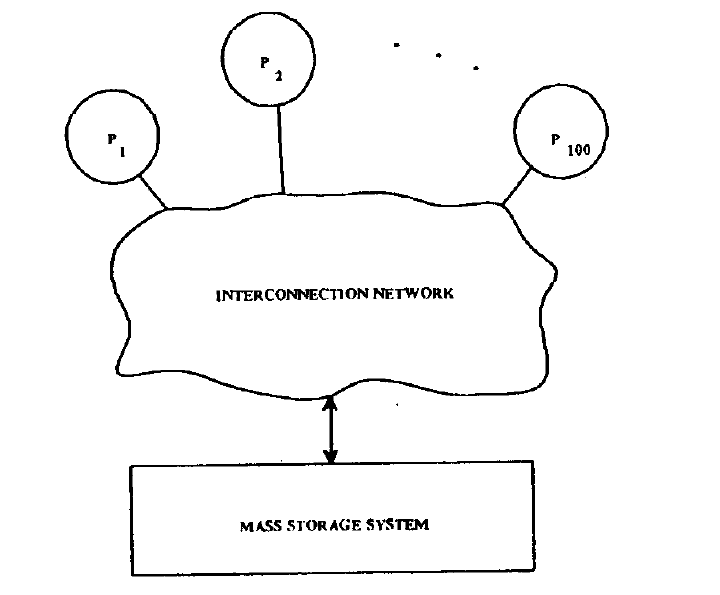
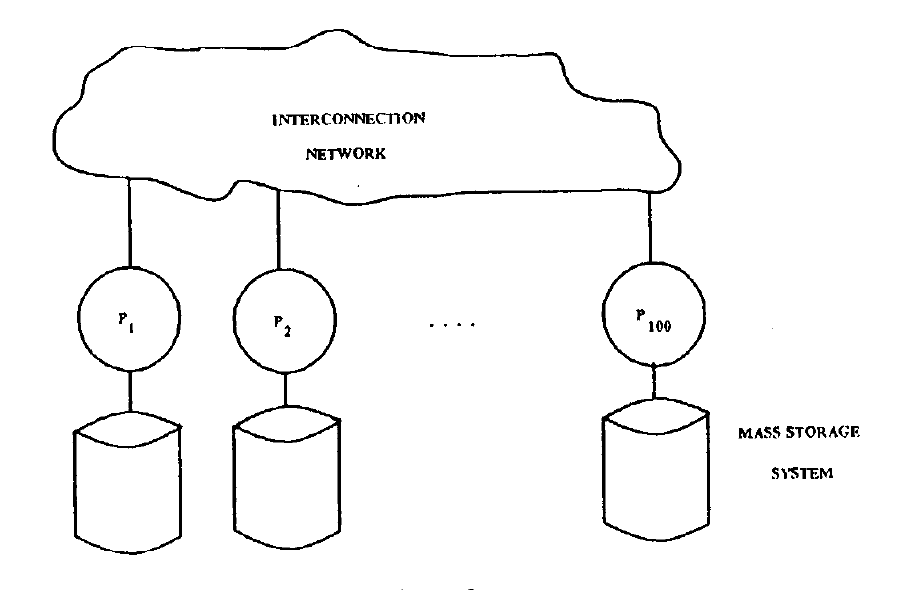
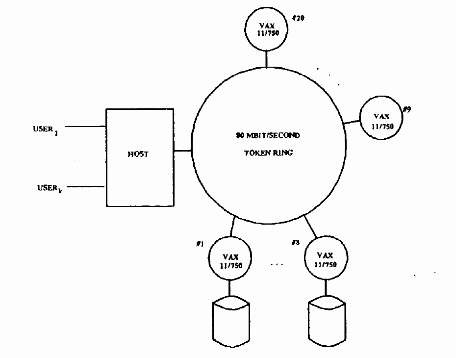
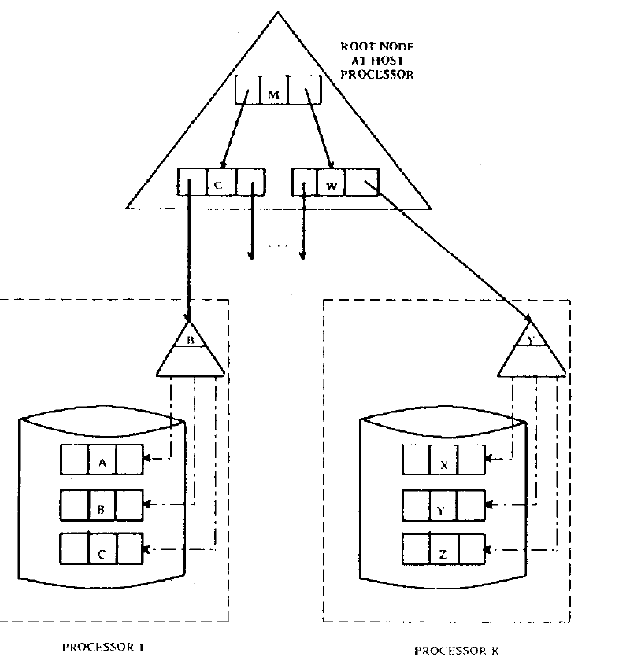
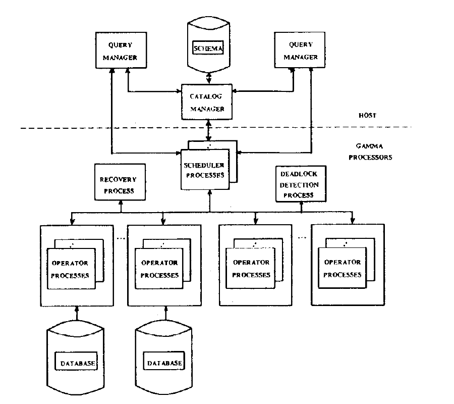
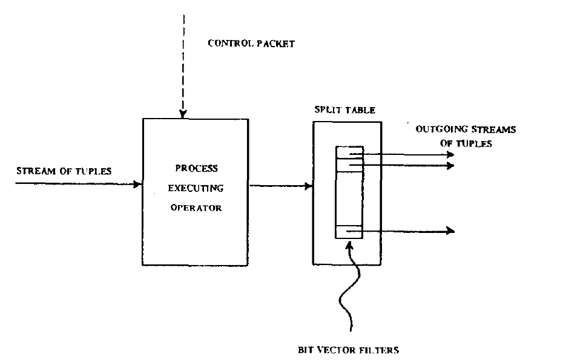
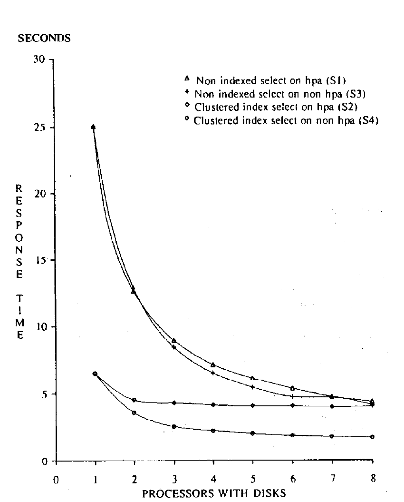
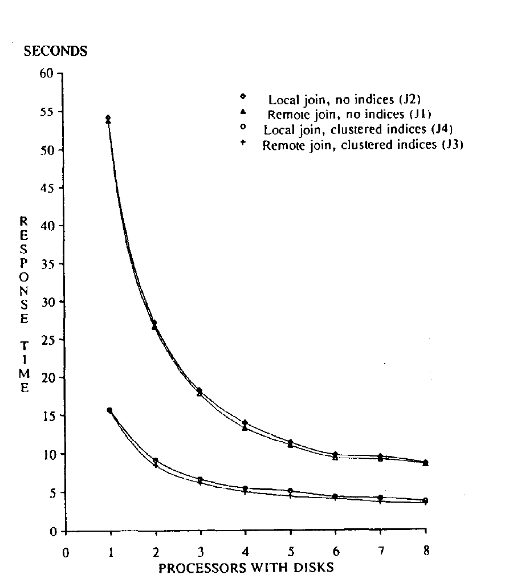
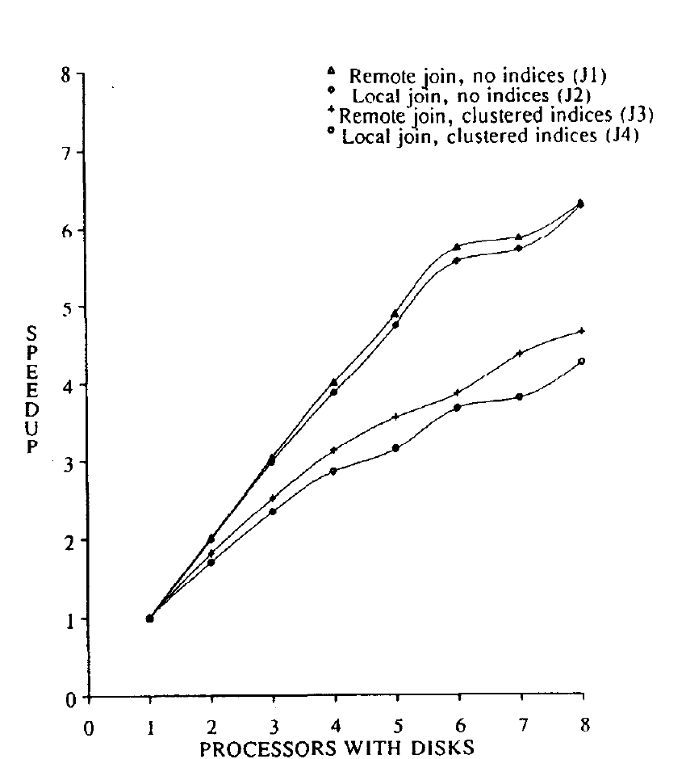

# GAMMA - A High Performance Dataflow Database Machine（中文译文）

## 译者说明

本文依据同目录的 `source.pdf` 翻译。章节、图表、公式、算法、代码与参考文献按原文结构保留。

## 作者与出处

David J. DeWitt、Robert H. Gerber、Goetz Graefe、Michael L. Heytens、Krishna B. Kumar、M. Muralikrishna

威斯康星大学计算机科学系（Computer Sciences Department, University of Wisconsin）

载于第十二届超大型数据库国际会议论文集（Proceedings of the Twelfth International Conference on Very Large Data Bases），日本京都，1986 年 8 月，第 228–237 页。

在满足以下条件时，可以免费复制本文的全部或部分内容：副本不得以直接商业获利为目的制作或分发；副本中须出现 VLDB 版权声明、出版物标题及出版日期；并须注明复制已经 Very Large Data Base Endowment 授权。除此之外的复制或再版，需要付费和/或取得该基金会的特别许可。

## 摘要

我们在本文中介绍 Gamma 的设计、实现技术和初步性能评估。Gamma 是一台采用数据流查询处理技术的新型关系数据库机；它已经形成一套可运行的原型，由 20 台 VAX 11/750 计算机构成。Gamma 原型不仅表明并行机制确实可以在数据库机中有效工作，还展示了如何把基于散列的算法与进程间数据流水线结合起来，以极低的控制开销驾驭并行执行。

## 1. 引言

在过去 10 年里，数据库机一直是非常活跃的研究领域，但真正建成的研究原型只有寥寥几种 [OZKA75, LEIL78, DEWI79, STON79, HELL81, SU82, GARD83, FISH84, KAKU85, DEMU86]，商业产品也只有三种 [TERA83, UBEL85, IDM85]。这些系统都没有证明一台高度并行的关系数据库机实际上能够建成。

我们在本文中提出 Gamma 的设计。Gamma 是一台采用数据流查询处理技术的新型关系数据库机，也是一套已经完全投入运行的原型。它的设计以我们在构建我们的早期多处理器数据库机原型 DIRECT，以及随后数年研究 DIRECT 原型所暴露问题的过程中得到的认识为基础。我们对 DIRECT 的评估 [BITT83] 揭示了其设计中的若干重大缺陷。

首先，对某些类型的查询，DIRECT 的性能受到其有限 I/O 带宽的严重制约。DIRECT 试图以并行性代替索引，进一步放大了这一问题。从 I/O 带宽和 CPU 资源的角度看，索引所提供的正是一种机制：回答某些查询时，不必搜索数据库中的大块内容。I/O 带宽是任何数据库机中的关键资源 [BORA83]；因此，DIRECT 的方法虽在概念上很吸引人，却会导致灾难性的性能 [BITT83]。DIRECT 的另一个主要问题是：控制复杂关系操作（例如连接）所用并行算法执行所需的控制动作（消息）数，与两个输入关系大小的乘积成正比。即使通过共享内存实现消息传递，传递和处理消息所花的时间仍然压倒了这类查询的处理时间和 I/O 时间。

本文其余部分安排如下。第 2 节给出 Gamma 的体系结构及其设计依据。第 3 节中，我们描述 Gamma 软件的进程结构，并讨论这些进程如何协作执行查询。第 4 节中，我们介绍各种关系代数操作的实现算法和技术。第 5 节中，我们给出我们对 Gamma 所做初步性能评估的结果。第 6 节给出我们的结论和未来研究方向。

## 2. GAMMA 的硬件体系结构

### 2.1 I/O 瓶颈问题的解决方案

完成我们对 DIRECT 原型的评估后不久，我们就认识到，I/O 带宽有限并非 DIRECT 独有的问题。如 [BORA83] 所述，处理器和海量存储技术的变化已经影响了所有数据库机设计。在过去十年中，单芯片微处理器的 CPU 性能至少提高了两个数量级（例如从 Intel 4040 到 Motorola 68020），而商用磁盘驱动器的 I/O 带宽仅提高约 3 倍（例如从 IBM 3330 到 IBM 3380）。这些技术变化已经使若干数据库机设计失去实用价值，也使任何数据库机设计都更难利用大规模并行性。

在 [BORA83] 中，我们提出过两种提高 I/O 带宽的策略。一种思路是用很大的主存作为磁盘缓存 [DEWI84a]。另一种思路是以新颖方式组织许多小型磁盘驱动器，用它们代替大型磁盘驱动器，并模拟并行读出磁盘驱动器的特性。已有多位研究者开始考察这些思路 [SALE84, KIM85, BROW85, LIVN85]，Tandem 也推出了基于这一概念的产品 [TAND85]。

尽管这一概念看起来很有吸引力，我们认为它有如下缺点。假设确实可以用这种方法构造有效带宽为 100 MB/s 的海量存储子系统。图 1 表明，数据在得到处理之前，必须经由互连网络（例如 banyan 交换机或纵横交换机）路由，而该网络的带宽至少也必须达到 100 MB/s。若相信广为流传的“90-10”规则，搬运的大部分数据从一开始就不是所需数据。



*图 1*

图 2 展示了另一种设计。在这种设计中，系统采用常规磁盘驱动器，并为每个磁盘驱动器配备一个处理器。只要磁盘驱动器足够多（50 个驱动器，每个 2 MB/s），两种方案的 I/O 带宽就相同。[^1] 不过，第二种设计具备我们认为非常重要的若干优点。第一，它把互连网络所需提供的带宽降低了 100 MB/s。通过让每个磁盘驱动器都配有一个处理器，并采用尽可能在本地完成处理的算法，[DEWI85] 的结果表明通信开销可以显著降低。第二，这种设计允许逐步扩展 I/O 带宽。最后，它还可能简化对磁盘技术进步成果的利用。



*图 2*

Gamma 正是基于这一方案。Goodman 在其有关将 X-tree 多处理器用于数据库应用的学位论文 [GOOD81] 中，似乎率先提出了这种方案；其他几项正在开展的数据库机项目也以它为基础。MBDS 数据库机 [DEMU86] 的互连网络是 10 Mbit/s 以太网。SM3 项目 [BARU84] 用带可切换共享内存模块的总线实现互连网络。Teradata 产品 [TERA83] 则采用称为 Y-net 的树形互连网络。

### 2.2 Gamma 硬件

当前 Gamma 数据库机原型的体系结构如图 3 所示。目前 Gamma 由 20 个 VAX 11/750 处理器组成，每个处理器配有 2 MB 内存。处理器之间以及处理器与另一台运行 Berkeley UNIX 的 VAX 之间，采用 Proteon Associates 为我们研制的 80 Mbit/s 令牌环 [DEWI84b] 连接。后一台处理器充当 Gamma 的主机。其中 8 个处理器分别连接一个 160 MB 的 8 英寸 Fujitsu 磁盘驱动器，用于数据库存储。



*图 3：Gamma 硬件配置*

### 2.3 讨论

人们或许会问，Gamma（或 MBDS [DEMU86]）与运行在局域网上的分布式数据库系统有何不同。下一节将清楚表明：Gamma 不存在站点自治的概念，它采用集中式模式，并且所有查询都从一个统一入口发起执行。此外，Gamma 所用操作系统不能动态装入新程序；它提供共享内存的轻量级进程，但不提供请求分页。

## 3. Gamma 系统软件的设计

### 3.1 存储组织

Gamma 中的所有关系都在系统全部磁盘驱动器上做水平分区 [RIES78]。Gamma 查询语言 gdl（QUEL [STON76] 的扩展）为用户提供四种关系元组分布方式：

- 轮转（round robin）；
- 散列（hashed）；
- 按键值范围分区，并由用户指定放置位置；
- 按范围分区并均匀分布。

顾名思义，在第一种策略下，元组装入关系时以轮转方式分布到所有磁盘驱动器。这也是 MBDS [DEMU86] 采用的策略；对查询结果所创建的关系，它还是 Gamma 的默认策略。若选择散列策略，系统会对每个元组的键属性（由 gdl 的 `partition` 命令指定）应用随机化函数，以选择存储单元；Teradata 数据库机 [TERA83] 采用了这种技术。在第三种策略下，用户为每个站点指定一个键值范围。例如，在四磁盘系统中，命令 `partition employee on emp_id (100, 300, 1000)` 会得到如下元组分布：

| 分布条件 | 处理器编号 |
| --- | ---: |
| `emp_id <= 100` | 1 |
| `100 < emp_id <= 300` | 2 |
| `300 < emp_id <= 1000` | 3 |
| `emp_id > 1000` | 4 |

乍看之下，这种分布与 VSAM [WAGN73] 和 Tandem 文件系统 [ENSC85] 支持的分区机制相似，但二者存在显著差异。在 VSAM 和 Tandem 文件系统中，文件一旦按某个键分区，每个站点上的文件就必须按该键保持有序；Gamma 并无此要求。在 Gamma 中，文件的分区属性与站点内元组的顺序没有关系。

下面的银行示例说明这一能力背后的动机。每个元组包含三个属性：账号、余额和分行号。90% 的查询用账号取得单个元组，另外 10% 的查询则查找每个分行的当前余额。为使吞吐量最大，应按账号对文件分区。然而，Gamma 不会像 VSAM 和 Tandem 文件系统所要求的那样在账号上建立聚簇索引，而会在分行号上建立聚簇索引，在账号上建立非聚簇索引。这样的物理设计既能为单元组查询提供相同的响应时间，又能显著降低另外那些查询的响应时间。

如果用户对数据文件掌握的信息不足以选择键范围，可以选择最后一种分布策略。在这种策略下，若关系尚未装入，系统先以轮转方式装入它；接着按分区属性对关系排序（使用并行归并排序），再重新分布排序后的关系，尽量使每个站点上的元组数相等；最后，把各站点的最大键值返回主处理器。

关系完成分区后，Gamma 可按常规方式在关系的每个片段上建立聚簇（主）索引和非聚簇（辅助）索引。不过，当关系采用任一范围技术进行水平分区时，系统还会构造一种特殊的多处理器索引。如图 4 所示，可以把磁盘及其关联处理器看作一棵主聚簇索引中的节点。[^2] 索引的根页作为该索引相关模式信息的一部分，保存在主机上。后文将说明，查询优化器使用这个根页，把针对键属性的选择查询引导到适当站点执行。



*图 4*

### 3.2 Gamma 进程结构

图 5 给出了构成 Gamma 软件的各类进程。除了表示进程之间的关系，图 5 还给出了把进程映射到处理器的一种可能方案。讨论每类进程在 Gamma 中的作用时，我们也会指出把 Gamma 进程映射到机器的其他方案。下面先简要说明各类进程的职责；下一节将更详细地说明它们之间的交互。



*图 5：Gamma 进程结构*

**目录管理器（Catalog Manager）。** 目录管理器充当每个数据库全部概念模式和内部模式信息的中央存储库。模式信息永久存储在主机上的一组 UNIX 文件中，并在数据库第一次打开时装入内存。多个用户可能同时打开同一个数据库，而且每个用户可能位于不同于目录管理器所在机器的另一台机器上，因此，目录管理器负责保证各用户所缓存副本之间的一致性。

**查询管理器（Query Manager）。** 每个活跃的 Gamma 用户都关联一个查询管理器进程。查询管理器负责在本地缓存模式信息、为使用 gdl 的即席查询提供接口，以及进行查询解析、优化和编译。

**调度器进程（Scheduler Processes）。** 每个“复杂”（即多站点）查询在执行期间都由一个调度器进程控制。该进程负责激活执行已编译查询树各节点所需的算子进程。两个查询处理器之间传递消息的速度，是查询处理器与主机之间传递消息速度的两倍；原因在于数据包穿过 UNIX 操作系统会产生额外开销。因此，我们选择让调度器进程运行在数据库机中，而不是主机上。目前，所有调度器都运行在同一个处理器上。把调度器进程分布到多台机器相对简单，因为它们之间唯一共享的信息是每个查询处理器的可用内存摘要。为便于负载均衡，这些信息目前集中保存；若调度器采用分布式部署，可通过远程过程调用访问它们。

**算子进程（Operator Process）。** 对查询树中的每个算子，在参与执行该算子的每个处理器上至少使用一个算子进程。下文将更详细地讨论算子进程的结构，以及关系算子到算子进程的映射。

**死锁检测进程（Deadlock Detection Process）。** Gamma 采用集中式死锁检测机制。该进程负责从每个锁管理器收集“等待图”片段、查找环，并选择一个牺牲者中止。

**日志管理器（Log Manager）。** 日志管理器进程负责从查询处理器收集日志片段并写入日志。系统使用 [AGRA85] 所述算法协调事务提交、中止和回滚。

### 3.3 查询执行概览

#### 系统初始化与 Gamma 调用

系统初始化时，会启动目录管理器（CM）的 UNIX 守护进程，同时启动一组调度器进程、一组算子进程、死锁检测进程和恢复进程。用户要调用 Gamma，需从 UNIX shell 执行 `gdl` 命令。该命令会启动一个查询管理器（QM）进程；QM 立即通过 UNIX IPC 机制连接到 CM 进程，然后向用户提供命令解释器接口。

#### 数据库实用命令的执行

QM 解析 `create database` 或 `destroy database` 命令后，将其交给 CM 执行。`create database` 命令使 CM 创建并初始化适当的模式条目，并创建必要的文件，以便在数据库关闭时保存关系信息。目录管理器虽然用 UNIX 文件而非关系来保存模式信息，但所采用的目录结构与典型关系数据库系统相同。执行 `destroy database` 命令时，要等数据库的所有当前用户退出后才真正执行销毁。

执行 `open database` 命令的第一步，是由 QM 向 CM 请求模式。如果当前没有其他用户打开所请求的数据库，CM 会先从磁盘把模式读入内存，再把模式副本返回给提出请求的 QM。QM 在本地缓存自己的模式副本，直至数据库关闭。

用户尝试执行任何会改变数据库模式的命令（例如创建/销毁关系、建立/删除索引、分区等）时，QM 首先向 CM 请求许可。若获准，QM 执行命令，然后把结果告知 CM。如果命令成功执行，CM 会把变更记录到自己的模式副本中，再把变更传播给所有打开了同一数据库的查询管理器 [HEYT85]。CM 内部的锁管理器保证目录一致性。

#### 查询执行

Gamma 使用传统的关系技术进行查询解析、优化 [SELI79, JARK84] 和代码生成。由于 Gamma 对连接及其他复杂操作只采用基于散列的算法 [DEWI85]，优化过程有所简化。查询被编译为一棵算子树。执行时，每个算子由各参与站点上的一个或多个算子进程执行。

查询优化器在优化过程中会识别某些只需在单个站点执行的查询。例如，考虑一个只对图 4 所示关系执行选择操作的查询，并假设 `q` 是该关系的分区属性名。若选择条件为 `q >= A and q <= C`，优化器可以利用 `q` 上多处理器索引的根页，判定该查询只需发送给 1 号处理器。

对单站点查询，QM 直接把查询发送到适当处理器执行。对多站点查询，优化器通过分派器进程与空闲的调度器进程建立连接。分派器控制活跃调度器的数量，并根据各处理器的 CPU 和内存利用率信息实现一种简单的负载控制机制。与调度器建立连接后，QM 把已编译查询发送给该调度器，并等待查询完成。调度器随后在每个被选来执行算子的查询处理器上激活算子进程。最后，QM 读取查询结果，通过即席查询接口把结果返回给用户，或通过嵌入式查询接口把结果返回给发起查询的程序。

对多站点查询，把算子分配给处理器的任务一部分由优化器完成，另一部分由负责控制该查询执行的调度器完成。例如，查询树叶节点上的算子只引用永久关系。优化器利用查询信息和模式信息，可以确定把这些算子分配给处理器的最佳方式。对 `retrieve into` 查询，查询树根节点是 `store` 算子；对 `retrieve` 查询，根节点则是 `spool` 算子（即把结果返回主机）。

若根节点是 `store` 算子，优化器会在每个带磁盘的处理器上，把该查询树节点的一个副本分配给某个进程。每个站点上的 `store` 算子采用下述技术，从执行其查询树子节点的进程接收结果元组，并把它们存入结果关系在本站点的片段（请记住，所有永久关系都做了水平分区）。若查询树根节点是 `spool` 节点，优化器把它分配给单个进程，通常位于无磁盘的处理器上。[^3]

### 3.4 算子与进程结构

Gamma 中所有算子的算法，都按照仿佛只在单个处理器上运行的方式编写。如图 6 所示，算子进程的输入是一条元组流，输出也是一条元组流；输出通过一种我们称为拆分表（split table）的结构进行多路分解。查询进程启动后，等待控制消息到达一个全局、众所周知的控制端口。进程收到算子控制包后，会用一条标识自身身份的消息回复调度器。



*图 6*

进程开始执行后，会持续从输入流读取元组，对每个元组执行操作，并使用拆分表把结果元组路由到表中指定的进程。检测到输入流末尾时，进程先关闭输出流，再向调度器发送一条控制消息，表明执行已经完成。关闭输出流还有一个副作用：它会向每个目的进程发送“流结束”消息。除这三条控制消息外，算子的执行完全是自调度的；数据以数据流方式在执行查询树的进程之间流动。

拆分表定义了从值到一组目的进程的映射。Gamma 根据所执行操作的类型使用三种不同拆分表。以图 7 所示拆分表用于四处理器连接操作为例：为连接生成源元组的每个进程，都对每个输出元组的连接属性应用散列函数，得到 0 到 3 之间的值；再用该值索引拆分表，取得应接收此元组的目的进程地址。

| 值 | 目的进程 |
| ---: | --- |
| 0 | 3 号处理器，5 号端口 |
| 1 | 2 号处理器，13 号端口 |
| 2 | 7 号处理器，6 号端口 |
| 3 | 9 号处理器，15 号端口 |

*图 7：拆分表示例*

Gamma 使用的第二种拆分表，会产生按未散列属性值的离散范围分区的元组流。此时，每个分区范围的上界充当拆分表相应条目的键值。永久关系采用第 3.1 节所述任一种范围分区策略切分时，会使用这种范围分区拆分表。当查询树叶节点上某个操作的目标拆分属性，正好是关系的水平分区属性（HPA）时，这类拆分表同样适用。在这种情况下，用源关系 HPA 已定义的边界值初始化拆分表，从而使源关系的每个片段都在本地处理。

对于连接操作，如果外关系按连接属性水平分区，通常就不必通过网络传输该关系。此时，连接的内关系会根据外关系在各站点片段的 HPA 范围来分区和分发。

当元组以轮转方式分布到目的进程时，Gamma 使用第三种拆分表。在这种分布策略下，元组会被依次路由到拆分表所代表的目的进程，与表中的键值无关。

为提高某些操作的性能，系统如图 6 所示，把一组位向量过滤器 [BABB79, VALD84] 插入拆分表。对于连接操作，每个连接进程在用外关系构建散列表的同时，通过散列连接属性值来构建一个位向量过滤器 [BRAT84, DEWI85, DEWI84a, VALD84]。外关系的散列表构建完成后，进程把过滤器发送给调度器。调度器收齐所有过滤器后，再把它们发送给负责生成连接内关系的进程。各进程使用这组过滤器，剔除不可能在连接操作中产生任何结果元组的元组。

### 3.5 操作系统与存储系统

Gamma 构建在一个专门为支持数据库管理系统而开发的操作系统之上。NOSE 提供多个共享内存的轻量级进程。它采用非抢占式调度策略，以帮助防止护航现象（convoy）[BLAS79]。NOSE 在 Gamma 处理器上的 NOSE 进程之间，以及这些进程与主机上的 UNIX 进程之间，提供可靠通信。其可靠通信机制是一种基于计时器、单比特停等、肯定确认协议 [TANE81]；系统采用 delta-T 机制重新建立序列号 [WATS81]。

NOSE 的文件、记录、索引和扫描服务以 Wisconsin Storage System（WiSS）[CHOU85] 为基础。WiSS 的临界区由 NOSE 提供的信号量机制保护。为提升性能，WiSS 的页面格式中包含 NOSE 处理器间通信所需的消息格式。因此，从磁盘读出一页后，可直接将其发送到另一处理器，不必先把元组从缓冲池中的页面复制到出站消息模板。

## 4. 查询处理算法

### 4.1 选择算子

选择算子的性能是任何查询计划整体性能的关键因素。如果选择算子无法提供足够吞吐量，后续算子能够有效利用的并行度就会受到限制。Gamma 通过水平分区关系以及紧密耦合的处理器/磁盘对，从宏观系统角度解决 I/O 瓶颈；不过，不同处理器上各个选择算子进程的效率仍然很重要。对给定资源集合，经过良好调优的选择算子应提供必要吞吐量，确保系统其余部分得到有效利用。

为获得尽可能高的吞吐量，Gamma 采用三项互补技术。第一，只要可能就使用索引。第二，把选择谓词编译为机器语言过程，以尽量缩短执行时间。第三，采用一种有限的预读形式，在处理当前页面的同时，重叠从磁盘读取关系“下一”页的 I/O。

### 4.2 连接

Gamma 使用的多处理器散列连接算法，以把源关系划分为互不相交的子集（称为桶）为基础 [GOOD81, KITS83a,b, BRAT84, DEWI84a, VALD84, DEWI85]。分区后的桶代表原关系互不相交的子集，并具有一个重要特性：连接属性值相同的所有元组都位于同一个桶。这样分区的潜在威力在于，可以把两个大关系的连接化为许多较小关系桶各自独立的连接 [KITS83a,b]。

#### Gamma 的散列连接算法

在 Gamma 中，散列连接操作所消费的元组流，由使用基于散列的拆分表的算子产生。这些元组流按连接属性值对元组分区。由于连接的两个源关系都应用相同的拆分表，两个大关系的连接就被化为许多较小关系桶的独立连接。在 Gamma 中，这些相互独立的连接自然构成并行执行的基础。下面详细说明如何实现和利用这种并行性。

散列连接算子的激活方式与其他算子一致，但它还需要一种散列连接独有的额外控制交互，因为散列分区连接算法包含两个不同阶段。第一阶段称为构建阶段：连接算子接收来自第一个源关系的元组，并用它们构建内存散列表和位向量过滤器。构建阶段结束时，散列连接算子向调度器发送消息，表明构建已经完成。

调度器判定所有散列连接算子都完成构建阶段后，向每个连接算子发送消息，指示它们开始第二阶段，即探测阶段。在此阶段，各连接算子进程接收来自第二个源关系的元组，并用这些元组探测先前建立的散列表，查找连接属性值匹配的元组。探测阶段结束时，每个连接算子都向调度器发送消息，表明连接操作已经完成。

这一算法的重要特征，是调度器与参与执行的算子进程之间的交互非常简单。激活并控制一个散列连接算子的净成本，是每个站点 5 条消息。（为控制目的，连接的构建阶段和探测阶段实际上被视为两个独立算子。）其他所有数据传输都可以继续进行，不再需要调度器干预控制。

除了控制各连接算子，调度器还必须让连接与查询树相邻节点上的算子同步。具体而言，调度器必须启动将为连接生成输入元组流的那些算子；这些元组流的生成，必须与散列连接算子构建阶段和探测阶段的激活相吻合。

#### 散列表溢出

在多处理器散列连接算法的构建阶段，如果桶增长得过大，内存散列表就可能溢出。选择适当的散列函数，可以使元组在各桶之间的分布趋于随机，从而尽量减少散列表溢出的发生。此外，为降低溢出的可能性，优化器会尝试构造查询树，使散列连接构建阶段所访问关系的大小尽可能小。对于查询树内部的连接，这是一项困难任务。

散列表发生溢出时，本地连接算子会缩小用于构建散列表的元组分区范围，实际上把它分成两个子分区。其中一个子分区用于构建散列表，另一个则转储到磁盘上的溢出文件中（磁盘可能是远程的）。已经加入散列表、但现在归入溢出子分区的元组，会从表中移除。此后从输入流读到的元组，要么加入散列表，要么追加到溢出文件。

本地连接算子通知调度器构建阶段完成时，也会标明处理溢出所采用的重新分区方案。调度器据此修改第二个（用于探测的）源关系的拆分表，使溢出子分区绕过连接算子，直接假脱机到磁盘。初始的非溢出子分区完成连接后，调度器递归地对已假脱机的溢出子分区应用连接操作。

如果连接属性值相同的元组合计大小超过可用内存，上述方法就会失败；这时系统采用嵌套循环连接算法的一种基于散列的变体 [BRAT84, DEWI85]。

### 4.3 更新算子

更新算子（`replace`、`delete` 和 `append`）大体采用标准技术实现。唯一的例外，是会修改分区属性的 `replace` 操作。此时，系统不把修改后的元组写回关系的本地片段，而是让它通过拆分表，以确定修改后的元组应当驻留在何处。

## 5. 性能评估

本节中，我们给出由我们完成的 Gamma 初步性能评估结果。这项评估既不广泛，也不穷尽所有情况；例如，我们尚未进行任何多用户测试。这些测试只是用于证明 Gamma 硬件体系结构和软件设计的可行性。在当前开发阶段，开发工作必然更关心正确性，而不是绝对速度。

我们的所有测试都在主机处于单用户模式时运行。主要性能指标是主机端的经过时间，测量区间从用户输入查询的时刻开始，到查询完成执行的时刻结束。

### 5.1 测试数据库的设计与结果

测试数据库以 [BITT83] 所述合成关系为基础。每个关系包含 10,000 个元组，每个元组长 208 字节；每个元组先有 13 个 4 字节整数属性，再有 3 个 52 字节字符串属性。

后续测试所用的所有永久关系，都按属性 `Unique1` 进行水平分区。`Unique1` 是候选键，值域为 0 到 9,999。系统采用范围分区，把元组等量分布到所有站点。例如，在四磁盘配置中，所有满足 `Unique1 < 2500 * i` 的元组都驻留在磁盘 `i` 上。所有结果关系都采用轮转分区，分布到全部站点。

文中给出的响应时间，是一组查询的平均值；这组查询经过专门设计，以保证查询 `i` 不会在缓冲池中留下任何可供查询 `i + 1` 使用的内容。

### 5.2 选择查询

评估支持水平分区和多处理器索引的数据库机中选择查询的性能时，必须考虑许多因素：查询的选择率、参与站点数、限定属性是否也是水平分区属性、所采用的分区策略、是否存在合适索引，以及索引类型（聚簇或非聚簇）。

如果限定属性就是水平分区属性（HPA），而且关系采用任一种范围分区命令分区，那么可以利用分区信息，把 HPA 上的选择查询引导到适当站点。如果选择散列分区策略，则可以把精确匹配查询（例如 `HPA = value`）有选择地路由到正确机器。如果选择轮转分区策略，查询必须发送到所有站点。限定属性不是 HPA 时，查询同样必须发送到所有站点。

为了减少这项初步评估需要考察的情况，我们把我们关注的范围限制在以下四类选择查询上：

| 类别 | 选择条件所用属性 | 聚簇索引所用属性 |
| --- | --- | --- |
| S1 | `Unique1`（HPA） | 无索引 |
| S2 | `Unique1`（HPA） | `Unique1` |
| S3 | `Unique2`（非 HPA） | 无索引 |
| S4 | `Unique2`（非 HPA） | `Unique2` |

我们进一步限制 S1 和 S2：通过设计测试查询，使操作总是在单个站点执行，具体做法是让水平分区范围覆盖选择查询的限定条件。S3 和 S4 都引用非 HPA 属性，因此必须发送到每个站点执行。每项选择测试都从 10,000 个元组中取得 1,000 个，选择率为 10%。无论实际参与执行查询的站点有多少，每个查询的结果关系都以轮转方式在所有站点上分区。因此，磁盘数增加会缩短存储结果关系所需时间，各种选择都同等受益。

这些选择测试的结果如图 8 所示。对每类查询，图中都以执行查询所用（带磁盘）处理器数量为横轴，绘制平均响应时间。图 8 包含若干有趣结果。



*图 8*

首先，随着处理器数量增加，S1 和 S3 查询的执行时间都会下降。原因在于处理器越多，每个处理器扫描的数据就按比例减少。S3 始终扫描整个关系，因此它的结果说明：只要 I/O 带宽充足，在大型多处理器配置中采用并行、无索引访问也能得到可接受的性能。

理解图 8 中 S1 与 S3 的差别很重要。两者响应时间大致相同，但在多用户测试中，S1 会有更高的吞吐率，因为执行查询只涉及单个处理器——当然，这里假定查询均匀分布在所有处理器上。

起初，我们对 S3 略快于 S1 感到困惑。事实上，考虑到 S3 要在多个站点启动查询所产生的开销，人们原本可能预期完全相反的结果。两种情况下，每个处理器扫描的源元组数相同；此外，结果关系大小相同，而且都在所有站点上分区，因此存储结果关系的成本也相同。差别似乎在于，用来分发结果关系中元组的处理器数量。

在 S1 中，一个处理器生成所有结果元组，随后必须把它们分发到其他站点。在 S3 中，所有处理器生成大致相同数量的结果元组，因为文件按 `Unique1` 水平分区后，`Unique2` 的属性值呈随机次序。因此，分发结果元组的成本分摊到所有处理器。这解释了处理器数量增加时，S1 与 S3 曲线之间的差距为何略有扩大。使用 7 或 8 个处理器时曲线出现的异常，将在第 5.4 节讨论。

S2 和 S4 展示了水平分区与物理数据库设计对响应时间的不同影响。对于像 S2 这样在分区属性上执行的单站点索引选择，增加磁盘数（因而减小各站点关系片段的大小）只能通过减少索引层数来降低索引遍历成本，而不会减少从磁盘取得的叶（数据）页数量。单元组读取时，这一效应或许能被观察到；但在所评估的站点数范围内，索引层数并未变化。

相反，我们把处理器从 1 个增至 2 个时响应时间的下降，归因于存储结果关系所用磁盘数的增加。这样，在 1 号站点扫描源关系，可以与在 2 号站点存储一半结果关系部分重叠。处理器从 2 个增至 3 个时，只能看到很小的改善。超过 3 个处理器后，改善很少甚至完全消失，因为生成结果关系的那个处理器成为瓶颈。

对于 S4（在非分区属性上执行索引选择），查询在每个站点执行。由于 `Unique2` 属性值随机分布在所有站点上，各处理器生成的结果元组数大致相同。因此，站点数越多，响应时间越短。S4 相对于 S3 的表现说明，可以让并行机制与索引彼此补充。

细心的读者或许已经注意到：S1 和 S3 的加速比都相当接近线性，但处理器数量从 4 个翻倍到 8 个时，S4 的响应时间改善却很小。按照 S4 查询的执行方式，处理器增加时原本理应获得线性加速。没有出现这种结果的原因虽然不太容易说明，却颇为有趣。

首先，问题并非通信带宽不足。考虑一个四处理器系统。每个站点生成约四分之一的结果关系，也就是 250 个元组。结果元组总以轮转方式分布，因此每个站点会向其他三个站点各发送 63 个元组，总计有 750 个元组通过网络发送。按每元组 208 字节计算，共计 120 万比特；在 80 Mbit/s 下，重新分布结果关系大约只需 0.02 秒。

问题似乎出在网络接口拥塞。目前，轮转分布策略按逐元组方式把元组分配到输出缓冲区。在八处理器系统的每个站点，只要有 8 个符合条件的元组，就会使 8 个输出缓冲区从非空变为已满。由于选择通过聚簇索引完成，这 8 个元组很可能来自单个磁盘页，最多也只来自两个页面。于是，在 8 个处理器上，64 个输出缓冲区几乎会在完全相同的时刻变满。

当前使用的网络接口只能为两个传入数据包提供缓冲空间，因此每个站点有 5 个数据包必须重传（通信软件会把处理器发给自身的数据短路处理）。情况还会进一步复杂化：成功通过的两条消息，其确认必须与重传回原站点的数据包竞争——请记住，每个站点都在向所有站点发送。某些确认很可能在传输计时器超时之前未被收到，因而原数据包即使安全到达，也可能再次重传。

至少可以采用逐页轮转策略来缓解这一问题。我们所说的“逐页”，是指先填满第一个输出缓冲区，然后才向第二个缓冲区添加元组。若再配合一个随机选择每个处理器首个输出页发送对象的策略，输出页的产生就会在整个操作执行期间分布得更均匀，应能显著改善性能。

我们没有修复问题并重跑测试，而选择把这个相当负面的结果保留在论文中，原因有二。第一，它说明通信问题可能何等关键。构建 Gamma 原型的一项主要目标，就是让我们能够研究和测量处理器间通信，从而使我们能够更好地理解把设计扩展到更大配置时会遇到的问题。若把问题扫到地毯下面，Gamma 看起来会更好，但一项重要结果也会丢失——除了我们自己，其他人将无从得知。

第二，这个问题说明了单用户基准的重要性。在多用户基准中，同样的问题可能不会出现，因为各处理器不大可能同步得如此紧密。

作为参照，IDM500 数据库机（10 MHz CPU、数据库加速器和同等磁盘）执行 S1 选择需要 22.3 秒，执行 S2 选择需要 5.2 秒。最后，Gamma 使用 S2 所用这类多处理器索引取得单个元组，需要 0.14 秒。

### 5.3 连接查询

与选择查询一样，评估 Gamma 连接操作的性能时，也要考虑许多因素。在这项初步评估中，我们尤其关心在带磁盘处理器与无磁盘处理器上执行连接的相对性能。我们使用下列查询作为我们的测试基础：

```text
range of X is tenKtupA
range of Y is tenKtupB
retrieve into temp (X.all, Y.all)
where (X.Unique2A = Y.Unique2B) and (Y.Unique2B < 1000)
```

每个关系都按自身的 `Unique1` 属性水平分区。该查询分两步执行。第一步，启动连接的构建阶段（见第 4.2 节），在每个参与连接算子执行的处理器上，用 `tenKtupA` 关系构建散列表。通常，优化器会选择以字节数计最小的源关系在构建阶段处理。对这个查询，可以预见两个源关系大小相等，因为 `tenKtupB` 关系上的限定条件可以传播到 `tenKtupA` 关系。

散列表构建完毕，调度器收集并分发位向量过滤器后，第二阶段开始。在此阶段，对 `tenKtupB` 的选择与连接操作的探测阶段并发执行。

由于 `Unique2` 对两个源关系都不是 HPA，所有站点都要参与执行选择操作。选择和连接操作生成的关系都包含 1,000 个元组。

为减少考察情况，连接要么完全在连接了磁盘的处理器上执行，要么完全在没有磁盘的处理器上执行。为方便起见，我们分别称之为本地连接和远程连接。我们执行的四组连接具有如下特征：

| 类别 | 聚簇索引所用属性 | 执行连接的处理器 |
| --- | --- | --- |
| J1 | 无索引 | 无磁盘（远程） |
| J2 | 无索引 | 带磁盘（本地） |
| J3 | `Unique2B` | 无磁盘（远程） |
| J4 | `Unique2B` | 带磁盘（本地） |

这些连接测试的结果如图 9 所示。对每类查询，图中都以所用带磁盘处理器数量为横轴，绘制平均响应时间；远程连接还使用数量相等的无磁盘处理器。



*图 9*

图 9 表明，在远离数据来源的站点上连接元组并不会带来性能惩罚。实际上，在无磁盘处理器上执行连接，反而略快于在带磁盘处理器上执行。下面讨论这个有些反直觉但颇有启发性的结果。

至少从响应时间指标看，有两个因素使远程连接略快于本地连接。第一，本地执行连接时，连接算子和选择算子会争用同一处理器的 CPU 周期。第二，Gamma 在不同处理器的进程之间传输连续元组流的速率，几乎与同一机器上的进程间传输速率相同，因此远程执行操作只会产生很小的响应时间惩罚。不过，执行通信协议会额外消耗 CPU 周期，所以多用户环境中的吞吐量很可能下降。我们计划在未来的基准测试中探究这种损失的重要性。

远程连接方案使用的处理器数量是本地连接的两倍，人们或许会问，为什么远程连接的响应时间没有缩短为相应本地连接的一半。由于连接算子的构建阶段与探测阶段不重叠，连接响应时间的下界由两个阶段经过时间之和决定。在测试的这些情况中，构建阶段和探测阶段的执行时间主要取决于源关系上的选择。

不过，把连接算子卸载出去还有另一项好处，响应时间指标并未反映它：连接操作卸载后，带磁盘处理器可以有效支持更多并发的选择和存储操作。

远程连接虽只比本地连接略快，我们却认为其意义重大。既然已经证明连接这类复杂操作可以成功从带磁盘处理器卸载出去，多处理器数据库机的设计空间便有了扩展基础。

作为图 9 连接时间的参照，IDM500 执行 J2 连接需要 84.3 秒，执行 J4 连接需要 14.3 秒。

### 5.4 连接经过时间的加速比

图 10 给出了上一节所述连接测试的响应时间加速曲线。结果证实了我们的预期：多处理器分区散列连接算法能够有效构成高度并行数据库机的基础。系统有 7 或 8 个磁盘时，加速曲线形状异常，可归因于两个因素。



*图 10*

第一，后来加入系统的第 7 和第 8 个磁盘，其性能只有其余 6 个磁盘中每个磁盘的 82%。[^4] 源关系均匀分区时，这两个较慢磁盘会增加扫描每个源关系所需的时间。连接操作的构建阶段与探测阶段不重叠，因此所有额外时间都会直接表现为连接响应时间的增加。

第二个因素也会影响处理器较多时的加速曲线形状。随着处理器加入系统，每个处理器上控制消息与数据消息的比率都会上升。只有当每个处理器处理的元组量变小时，这个因素才变得显著。在本文的连接测试中，即使用到的磁盘只有 8 个，它的影响也可能已变得可见：Gamma 查询优化器发现，第一个源关系 `tenKtupB` 上的限定条件可以传播到 `tenKtupA`，所以对每个源关系执行选择都只产生 1,000 个元组。当 8 个处理器上的连接算子同时活跃时，每个连接算子将从每个关系处理大约 14 个数据页和 5 条控制消息。

J3 和 J4 连接的加速比较低（也不那么亮眼），看起来是因为作为 J3、J4 连接查询一部分执行的 S4 选择，其加速也较低（见第 5.2 节）。如上所述，在本文进行的连接测试中，源关系上的选择主导了连接构建阶段和探测阶段的执行时间。

随着 Gamma 进入更成熟的开发阶段，将通过产生大得多数据量的查询获得更多加速结果。目前，我们给出这些加速数据，是为了说明该系统所展现的潜力。

## 6. 结论

我们在本文中介绍了一台新型关系数据库机 Gamma 的设计。Gamma 的硬件设计相当简单：每个磁盘驱动器配有一个处理器，各处理器通过互连网络连接。初始原型包含 20 个 VAX 11/750 处理器，由一条 80 Mbit/s 令牌环互连；其中 8 个处理器各有一个 160 MB 磁盘驱动器。

这种设计虽然简单，却能提供很高的磁盘带宽，无须采用并行读出磁盘驱动器这类非常规海量存储系统。第二项优点是，它允许逐步扩展 I/O 带宽。为了利用这种设计所提供的 I/O 带宽，Gamma 中的所有关系都在全部磁盘驱动器上进行水平分区。

为尽量降低控制查询内并行性所产生的开销，Gamma 采用数据流查询处理技术。关系查询树中的每个算子由一个或多个进程执行；调度器把这些进程放置到带磁盘和无磁盘处理器的组合上。除了 3 条控制消息——算子开始时 2 条、终止执行时 1 条——执行查询的进程之间的数据流动不受任何集中式控制。

Gamma 的初步性能评估非常令人鼓舞。随着用于执行操作的处理器数量增加，选择和连接操作都获得了近线性加速。此外，单处理器配置所得结果已经证明，Gamma 与商用数据库机相比很有竞争力。在我们完成原型后，我们计划对系统的单用户和多用户性能进行全面评估；评估将包括更复杂的查询，以及属性值的非均匀分布。

## 致谢

本研究得到美国能源部合同 DE-AC02-81ER10920、美国国家科学基金会资助项目 DCR-8512862、MCS82-01870 和 MCS81-05904，以及 Digital Equipment Corporation External Research Grant 的部分支持。

## 7. 参考文献

[AGRA85] Agrawal, R., and D. J. DeWitt, “Recovery Architectures for Multiprocessor Database Machines,” Proceedings of the 1985 SIGMOD Conference, Austin, TX, May, 1985.

[BABB79] Babb, E., “Implementing a Relational Database by Means of Specialized Hardware,” ACM Transactions on Database Systems, Vol. 4, No. 1, March, 1979.

[BARU84] Baru, C. K. and S. W. Su, “Performance Evaluation of the Statistical Aggregation by Categorization in the SM3 System,” Proceedings of the 1984 SIGMOD Conference, Boston, MA, June, 1984.

[BITT83] Bitton, D., D. J. DeWitt, and C. Turbyfill, “Benchmarking Database Systems—A Systematic Approach,” Proceedings of the 1983 Very Large Database Conference, October, 1983.

[BLAS79] Blasgen, M. W., J. Gray, M. Mitoma, and T. Price, “The Convoy Phenomenon,” Operating System Review, Vol. 13, No. 2, April, 1979.

[BORA83] Boral, H. and D. J. DeWitt, “Database Machines: An Idea Whose Time has Passed,” in Database Machines, edited by H. Leilich and M. Missikoff, Springer-Verlag, Proceedings of the 1983 International Workshop on Database Machines, Munich, 1983.

[BRAT84] Bratbergsengen, Kjell, “Hashing Methods and Relational Algebra Operations,” Proceedings of the 1984 Very Large Database Conference, August, 1984.

[BROW85] Browne, J. C., A. G. Dale, C. Leung, and R. Jenevein, “A Parallel Multi-Stage I/O Architecture with Self-Managing Disk Cache for Database Management Applications,” in Database Machines: Proceedings of the 4th International Workshop, Springer Verlag, edited by D. J. DeWitt and H. Boral, March, 1985.

[CHOU85] Chou, H.-T., D. J. DeWitt, R. Katz, and T. Klug, “Design and Implementation of the Wisconsin Storage System (WiSS),” Software Practices and Experience, Vol. 15, No. 10, October, 1985.

[DEMU86] Demurjian, S. A., D. K. Hsiao, and J. Menon, “A Multi-Backend Database System for Performance Gains, Capacity Growth, and Hardware Upgrade,” Proceedings of Second International Conference on Data Engineering, Feb. 1986.

[DEWI79] DeWitt, D. J., “DIRECT—A Multiprocessor Organization for Supporting Relational Database Management Systems,” IEEE Transactions on Computers, June, 1979.

[DEWI84a] DeWitt, D. J., R. Katz, F. Olken, D. Shapiro, M. Stonebraker, and D. Wood, “Implementation Techniques for Main Memory Database Systems,” Proceedings of the 1984 SIGMOD Conference, Boston, MA, June, 1984.

[DEWI84b] DeWitt, D. J., R. Finkel, and M. Solomon, “The Crystal Multicomputer: Design and Implementation Experience,” to appear, IEEE Transactions on Software Engineering. Also University of Wisconsin-Madison Computer Sciences Department Technical Report, September, 1984.

[DEWI85] DeWitt, D., and R. Gerber, “Multiprocessor Hash-Based Join Algorithms,” Proceedings of the 1985 VLDB Conference, Stockholm, Sweden, August, 1985.

[ENSC85] “Enscribe Programming Manual,” Tandem Part #82583-A00, Tandem Computers Inc., March 1985.

[FISH84] Fishman, D. H., M. Y. Lai, and K. Wilkinson, “Overview of the Jasmin Database Machine,” Proceedings of the 1984 SIGMOD Conference, Boston, MA, June, 1984.

[GARD83] Gardarin, G., et al., “Design of a Multiprocessor Relational Database System,” Proceedings of the 1983 IFIP Conference, Paris, 1983.

[GOOD81] Goodman, J. R., “An Investigation of Multiprocessor Structures and Algorithms for Database Management,” University of California at Berkeley, Technical Report UCB/ERL M81/33, May, 1981.

[HELL81] Hell, W., “RDBM—A Relational Database Machine,” Proceedings of the 6th Workshop on Computer Architecture for Non-Numeric Processing, June, 1981.

[HEYT85a] Heytens, M., “The Gamma Query and Catalog Managers,” Gamma internal design documentation, December, 1985.

[IDM85] The IDM 310 Database Server, Britton-Lee Inc., 1985.

[JARK84] Jarke, M. and J. Koch, “Query Optimization in Database System,” ACM Computing Surveys, Vol. 16, No. 2, June, 1984.

[KAKU85] Kakuta, T., N. Miyazaki, S. Shibayama, H. Yokota, and K. Murakami, “The Design and Implementation of the Relational Database Machine Delta,” in Database Machines: Proceedings of the 4th International Workshop, Springer Verlag, edited by D. DeWitt and H. Boral, March, 1985.

[KIM85] Kim, M. Y., “Parallel Operation of Magnetic Disk Storage Devices,” in Database Machines: Proceedings of the 4th International Workshop, Springer Verlag, edited by D. DeWitt and H. Boral, March, 1985.

[KITS83a] Kitsuregawa, M., H. Tanaka, and T. Moto-oka, “Application of Hash to Data Base Machine and Its Architecture,” New Generation Computing, Vol. 1, No. 1, 1983.

[KITS83b] Kitsuregawa, M., H. Tanaka, and T. Moto-oka, “Architecture and Performance of Relational Algebra Machine Grace,” University of Tokyo, Technical Report, 1983.

[LEIL78] Leilich, H. O., G. Stiege, and H. Ch. Zeidler, “A Search Processor for Database Management Systems,” Proceedings of the 4th VLDB International Conference, 1978.

[LIVN85] Livny, M., S. Khoshafian, and H. Boral, “Multi-Disk Management Algorithms,” Proceedings of the International Workshop on High Performance Transaction Systems, Pacific Grove, CA, September 1985.

[OZKA75] Ozkarahan, E. A., S. A. Schuster, and K. C. Smith, “RAP—An Associative Processor for Data Base Management,” Proceedings 1975 NCC, Vol. 45, AFIPS Press, Montvale, N.J.

[RIES78] Ries, D. and R. Epstein, “Evaluation of Distribution Criteria for Distributed Database Systems,” UCB/ERL Technical Report M78/22, UC Berkeley, May, 1978.

[SALE84] Salem, K., and H. Garcia-Molina, “Disk Striping,” Technical Report No. 332, EECS Department, Princeton University, December 1984.

[SELI79] Selinger, P. G., et al., “Access Path Selection in a Relational Database Management System,” Proceedings of the 1979 SIGMOD Conference, Boston, MA, May 1979.

[STON76] Stonebraker, Michael, Eugene Wong, and Peter Kreps, “The Design and Implementation of INGRES,” ACM Transactions on Database Systems, Vol. 1, No. 3, September, 1976.

[STON79] Stonebraker, M. R., “MUFFIN: A Distributed Database Machine,” University of California, Electronics Research Laboratory, Memorandum UCB/ERL M79/28, May 1979.

[SU82] Su, S. Y. W. and K. P. Mikkilineni, “Parallel Algorithms and their Implementation in MICRONET,” Proceedings of the 8th VLDB Conference, Mexico City, September, 1982.

[TAND85] 4120-V8 Disk Storage Facility, Tandem Computers Inc., 1985.

[TANE81] Tanenbaum, A. S., Computer Networks, Prentice-Hall, 1981.

[TERA83] Teradata: DBC/1012 Data Base Computer Concepts & Facilities, Teradata Corp. Document No. C02-0001-00, 1983.

[UBEL85] Ubell, M., “The Intelligent Database Machine (IDM),” in Query Processing in Database Systems, edited by W. Kim, D. Reiner, and D. Batory, Springer-Verlag, 1985.

[VALD84] Valduriez, P., and G. Gardarin, “Join and Semi-Join Algorithms for a Multiprocessor Database Machine,” ACM Transactions on Database Systems, Vol. 9, No. 1, March, 1984.

[WAGN73] Wagner, R. E., “Indexing Design Considerations,” IBM System Journal, Vol. 12, No. 4, Dec. 1973, pp. 351–367.

[WATS81] Watson, R. W., “Timer-based mechanisms in reliable transport protocol connection management,” Computer Networks 5, pp. 47–56, 1981.

[^1]: 要承载磁盘流量需要 100 MB/s；处理器之间的通信还需要额外带宽。

[^2]: 如果各磁盘上没有建立索引，多处理器索引可能只有一层。

[^3]: 通信软件提供反压机制：如果主机跟不上，便可减慢元组的产生速率。

[^4]: 该数值通过测量两组磁盘驱动器扫描一个 10,000 元组关系的经过时间得到。所有驱动器都是 160 MB Fujitsu 驱动器，但其中 6 个是较新的 8 英寸驱动器，另外 2 个是较旧的 14 英寸驱动器。
