# HAWQ: A Massively Parallel Processing SQL Engine in Hadoop（中文译文）

## 译者说明

本文依据同目录的 `source.pdf` 翻译。章节、图表、公式、算法、代码与参考文献按原文结构保留。

## 作者与机构

Lei Chang、Zhanwei Wang、Tao Ma、Lirong Jian、Lili Ma、Alon Goldshuv、Luke Lonergan、Jeffrey Cohen、Caleb Welton、Gavin Sherry、Milind Bhandarkar；Pivotal Inc。

联系邮箱：`{lchang, zwang, tma, ljian, lma, agoldshuv, llonergan, jcohen, cwelton, gsherry, mbhandarkar}@gopivotal.com`

## 出版信息

SIGMOD’14，June 22–27, 2014，Snowbird, UT, USA。ACM ISBN 978-1-4503-2376-5/14/06。doi:[10.1145/2588555.2595636](https://doi.org/10.1145/2588555.2595636)。

## 摘要

HAWQ 由 Pivotal 开发，是运行于 HDFS 之上的大规模并行处理（MPP）SQL 引擎。它是 MPP 数据库与 Hadoop 的混合体，继承二者优点：采用分层架构，依赖分布式文件系统提供数据复制与容错；兼容标准 SQL；不同于其他 Hadoop SQL 引擎，它完整支持事务。

本文介绍 HAWQ 的新设计，包括查询处理、基于 UDP 协议的可扩展软件互连、事务管理、容错、读优化存储、支持常见 Hadoop 数据存储与格式的可扩展框架，以及我们为提升查询性能而考虑的多项优化。大量性能实验表明，HAWQ 比 Stinger 快约 40 倍，而后者据报告比原始 Hive 快 35-45 倍。

**分类与主题描述：** H.2.4 Database Management - System - parallel databases。

**一般术语：** Database，Hadoop，Query Processing。

## 1. 引言

Hadoop [1] 存储成本持续下降，改变了企业处理存储与计算需求的方式。越来越多 Pivotal Hadoop 客户用 HDFS 作为所有历史数据的中央仓库（data lake），数据来自运营系统、Web、传感器和智能设备等，既有结构化也有非结构化。新范式不再通过重型 ETL 把数据严格过滤、转换进针对预定义分析应用的数据仓库，而是少量甚至不转换地把源数据直接摄取到中央仓库。

这样可提高新分析应用开发敏捷性。应用需要新数据时，分析用户不必回到源端修改或重做 ETL，以取回既有刚性设计漏掉或过滤的数据；数据科学家也能更灵活地即席分析、探索。客户日常使用 Hadoop 做分析的典型要求是：

- **交互式查询：** 响应时间决定数据探索、快速原型等任务的体验。
- **可伸缩性（Scalability）：** 数据爆炸式增长要求线性扩展。
- **一致性：** 事务把一致性责任从应用开发者转移到基础设施。
- **可扩展性（Extensibility）：** 支持 plain text、SequenceFile 及新格式等常见数据格式。
- **标准兼容：** 兼容 SQL 和 BI 标准，保护既有 BI/可视化工具投资。
- **生产力：** 应利用组织既有技能，不牺牲生产力。

当时 Hadoop 软件栈仍难同时满足这些要求。MapReduce [19, 20] 是处理结构化、非结构化数据的基础，运行在商品硬件上并可扩展、容错，但性能不适合交互分析 [27, 29, 32]，低级编程模型对业务分析师也不友好。Hive [36, 37]、Pig [30] 虽缓解易用性，实时探索性能仍不足；没有基础事务能力时，应用自行维持一致性容易出错，产生难以维护的代码 [18, 34]。

数据库领域近年来广泛采用 MPP [4, 6, 11]：由独立节点集群构成的分布式 shared-nothing 系统。它和 Hadoop 一样可扩展，尤其擅长结构化数据处理，查询比 MapReduce/Hive 快多个数量级 [27, 32]，内建自动优化，接口兼容工业 SQL 与 BI 工具，分析师易用。

基于 Hadoop 的不足和 MPP 的性能优势，我们开发 HAWQ，把 Greenplum Database [4] 与 Hadoop 分布式存储结合。底层存储特性和与 Hadoop 栈紧密集成的要求，使其架构不同于 Greenplum。HAWQ 于 2012 年 alpha、2013 年初投入生产，论文发表时已有数百 Pivotal Hadoop 客户使用。它兼容 SQL，面向大规模大数据分析 [17, 25]，查询性能优秀，也能交互查询多种 Hadoop 格式的数据源。

HAWQ 与 HDFS 并行部署。典型集群有一个 master host、一个 standby master、两个 HA HDFS NameNode host，以及多个同时运行 DataNode 和无状态 segment 的 compute host。用户数据在 HDFS。master 通过 JDBC、ODBC、libpq 接收查询，解析、分析、优化为物理计划，再由 dispatcher 分发给 segment。executor 以 pipeline 执行，最终结果返回 master 和客户端。master 上 fault detector 在节点失败时把其 segment 标为 down，后续查询不再调度到它们。

具体而言，我们在本文中作出如下贡献：

- 提出基于无状态 segment 的数据库架构，以 metadata dispatch 和 self-described plan execution 支持。
- 设计 UDP 互连，消除 TCP 在 execution slice 间传 tuple 时的局限。
- 提出 swimming-lane 事务模型支持并发更新，并给 HDFS 添加 truncate 以支持事务回滚。
- 工业 benchmark 显示 HAWQ 比 Stinger 快约 40 倍；后者据报告比原始 Hive 快多个数量级。

我们首先在第 2 节概览 HAWQ 架构，第 3 节简述查询处理，第 4 节介绍互连，第 5 节讨论事务，第 6 节介绍扩展框架，第 7 节给出相关工作，第 8 节展示工业 benchmark。最后，我们在第 9 节总结本文。

## 2. 架构

HAWQ 集群使用商品硬件，不依赖专有设备，也刻意避免针对特殊硬件特征定制软件。这使代码易维护、跨平台可移植，并降低对硬件配置差异的敏感度。

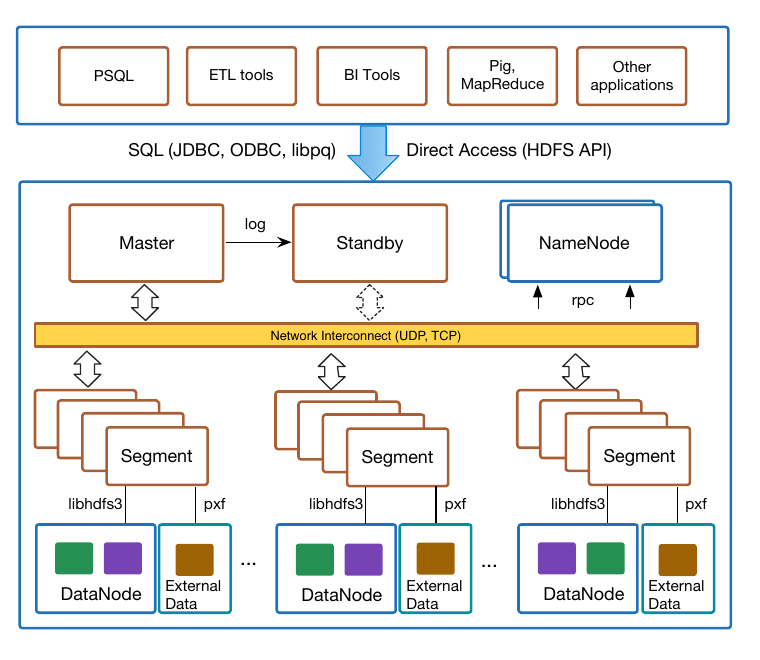

**图 1：HAWQ 架构。**

如图 1，shared-nothing MPP 计算层位于分布式存储层之上。最小生产配置有 HAWQ master、HDFS NameNode、同时运行 HAWQ segment 与 DataNode 的 segment host 三类节点；实际还可与 Hadoop MapReduce 等组件并行安装。master 是外部接口，负责认证授权、解析、生成计划、启动 executor、分发计划、跟踪执行并汇总最终结果。对应的 warm standby 通过 log shipping 同步。

segment host 通常有一个 DataNode 和多个 segment，以利用多核资源；DataNode 与 segment 共置提高 locality。segment 通过基于 protobuf 的 C++ HDFS 客户端 libhdfs3 访问 HDFS。Pivotal Extension Framework（PXF）让 SQL 可访问 HBase、Accumulo 等外部数据源。

### 2.1 接口

应用和工具通过 JDBC、ODBC、PostgreSQL/Greenplum 使用的 libpq 等标准协议连接。为方便 Hadoop 新应用，标准接口又增加 open data format 支持。外部系统可绕过 HAWQ，直接经 HDFS API 访问 HDFS 上的表文件；底层格式还提供开放的 MapReduce InputFormat/OutputFormat，有利于装载和交换。例如 MapReduce 可直接读 HDFS 表文件而不经 SQL。

### 2.2 Catalog Service

系统有 catalog 与 user data 两类数据。catalog 是系统“大脑”，描述系统和所有用户对象，创建数据库/表、启停、计划和执行几乎都依赖它。分类包括：

- **Database objects：** filespace、tablespace、schema、database、table、partition、column、index、constraint、type、statistics、resource queue、operator、function、对象依赖。
- **System information：** segment 与状态。
- **Security：** user、role、privilege。
- **Language and encoding：** 支持的语言与编码。

catalog 存在 Unified Catalog Service（UCS）中，外部应用可用标准 SQL 查询。HAWQ 内部用 SQL 子集 Catalog Query Language（CaQL）访问，替代开发者用 C 原语手工组合 cache、heap、index、lock，并自行指定 key comparison 与 type conversion 的繁琐、易错过程。

选择 CaQL 而非完整 SQL，是因为多数内部访问只是使用固定索引的 OLTP-style lookup，不需要复杂计划、join optimization 和 DDL；简化语言更快且更易工程实现和扩展。当前 CaQL 只支持基础单表 SELECT、COUNT()、多行 DELETE、单行 INSERT/UPDATE；原文因篇幅限制省略具体语法。论文版本 UCS 仅在 master，未来计划外部化为服务，方便与其他 Hadoop 组件集成。

### 2.3 数据分布

除 UCS 中 catalog table 外，所有数据像 Gamma [21] 的 horizontal partitioning 一样分布在集群。每 segment 在 HDFS 有独立目录；把数据分配给 segment 即存入这些目录。最常用策略是按指定 distribution column 哈希。用户可对齐表以优化重要模式：频繁 join 的两表若都按 join key 哈希分布，equi-join 可在本地执行，无需 redistribution/shuffle，节省 CPU 和网络。

TPC-H `orders` 按 `o_orderkey` 分布的语法如下，同哈希值进入同一 segment：

```sql
CREATE TABLE orders (
    o_orderkey INT8 NOT NULL,
    o_custkey INTEGER NOT NULL
    o_orderstatus CHAR(1) NOT NULL,
    o_totalprice DECIMAL(15,2) NOT NULL,
    o_orderdate DATE NOT NULL,
    o_orderpriority CHAR(15) NOT NULL,
    o_clerk CHAR(15) NOT NULL,
    o_shippriority INTEGER NOT NULL,
    o_comment VARCHAR(79) NOT NULL
) DISTRIBUTED BY (o_orderkey);
```

> 原文如此：`source.pdf` 第 3 页的 SQL 示例在 `o_custkey INTEGER NOT NULL` 行末缺少逗号，以上代码按原文保留。

另一策略 `RANDOMLY` 以 round-robin 跨 segment 分布，同值行不必共置。它确保均匀，尤其适合 distinct row 很少的表；这类表若哈希会只落少数 segment 形成 skew。

**表分区。** HAWQ 以表分区支持大表和滚动移除旧数据等维护任务。`CREATE TABLE ... PARTITION BY` 支持 range/list partitioning，实际上创建 top-level parent table 与一层或多层 child table，以继承关系相连。每个 partition 像独立表一样按 distribution column 分布：

```sql
CREATE TABLE sales (
    id INT,
    date DATE,
    amt DECIMAL(10,2)
)
DISTRIBUTED BY (id)
PARTITION BY RANGE (date) (
    START (date '2008-01-01') INCLUSIVE
    END (date '2009-01-01') EXCLUSIVE
    EVERY (INTERVAL '1 month')
);
```

planner 自动在生成计划时做 partition elimination，查询只触及部分 partition 时节省 I/O，优于全表扫描。

### 2.4 查询执行流程

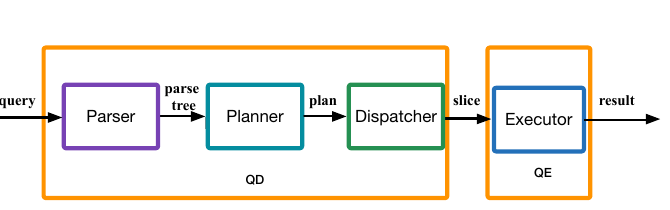

**图 2：查询执行流程。**

用户连接 master 时，postmaster fork Query Dispatcher（QD）进程。QD 管理 session、与用户交互并控制整个查询。它把查询解析为 raw parse tree，语义分析访问 catalog 验证表、列、类型，再按 rewrite rule（如 view definition）改写。planner 从 parse tree 生成描述执行方式的 parallel execution plan。

计划在数据移动（motion）边界切成 plan slice；slice 是不跨 motion boundary 的执行单位。QD 为一个 slice 启动一 gang Query Executor（QE）并分发计划；gang 中 QE 对不同数据部分执行相同 slice，结果最终汇总，经 QD 返回。

### 2.5 存储

OLTP 通常按行把 tuple 所有列一起存盘；分析数据库多为大而复杂的 read-mostly scan，常只读选定列，偶尔批量 append。HAWQ 在 HDFS 上支持多种存储模型，每个表或 partition 可按访问方式选择存储和压缩。不同模型之间由用户层转换，自动转换列入 roadmap。

- **Row-oriented / Read-optimized AO：** 面向以读为主的全表 scan 与 bulk append load；DDL 可选择从 fast/light 到 gzip、quicklz 等 deep/archival 压缩。
- **Column-oriented / Read-optimized CO：** 数据垂直分区 [24]，每列保存为一系列大而紧密的 block，可用 gzip、quicklz、RLE；通常比 row table 压缩更高，只扫描查询所需列，列存于独立 segment file。
- **Column-oriented / Parquet：** 同样垂直分区，但 Parquet 是类似 PAX [13] 的格式，在 row group 内垂直存列而非分文件，并原生支持 nested data。

### 2.6 容错

master 高可用可在独立 host 部署 warm standby。standby 上事务日志复制进程保持同步。master 不含 user data，只需同步不频繁更新的 system catalog table；一旦变更便自动复制。

segment 容错不同于 master mirror。HAWQ segment 无状态，不含失败后必须恢复的私有持久数据，任何活 segment 都可替代失败者。master fault detector 定期检查。失败发生时 in-flight query 失败，由事务机制保持一致性；设计依据是重物化恢复通常不如重启查询快。失败 host 的 segment 在 catalog 标 down，不同 session 随机把它们 failover 到剩余 segment，从而在并发查询下均衡。host 修复后用 recovery utility 恢复 segment，未来查询重新调度；也可把失败 segment 移至新 host。

磁盘失败有两级。user data 位于 HDFS，数据盘失败由 HDFS 屏蔽并从有效卷列表移除。大查询 intermediate data 为性能 spill 到本地盘，例如大表 sort 内存不足时 external sort；访问 intermediate data 遇到盘失败，HAWQ 标 down，未来查询不再使用该盘。

## 3. 查询处理

本节中，我们讨论查询处理的工作方式。planner 输入 parse tree，输出优化的 parallel plan；以 cost-based optimization 评估大量候选并选择最有效者。根据查询访问的数据，我们将其分为三类：

- **Master-only：** 只访问 master catalog，或表达式无需向 segment 分发 slice，可像单节点数据库执行。
- **Symmetrically dispatched：** 物理计划发给所有 segment，并行处理各自数据部分；这是分布式 user data 的常见情形。计划可简单到 scan + gather，也可含大量中间 redistribution。
- **Directly dispatched：** planner 保证 slice 只访问一个 segment directory 时，仅发该 segment；典型为单值 lookup 或单行 insert，可节省网络并提高小查询并发。

在下面几节中，我们关注常涉及数据移动的对称分发查询。计划除 scan、join、sort、aggregation 等关系 operator 外，还有 motion operator 描述何时、如何跨节点传数据。各表分布在 catalog 中，编译时 planner 已知。join/aggregation 要求特定分布才能正确；redistribution 有 CPU/网络开销，所以计划要么利用 colocation 和现有分布，要么先正确重分布。三类 motion 是：

- **Broadcast Motion（N:N）：** 每 segment 把输入 tuple 发给所有 segment。常用于非等值 join：大关系分布，小关系广播并在每 segment 复制。
- **Redistribute Motion（N:N）：** 每 segment 按一组列重新哈希输入 tuple，发往对应 segment。用于按 join column 重分布未共置关系，或按 aggregation column 分组。
- **Gather Motion（N:1）：** 所有 segment 发给单 segment（通常 master），用于 QD 汇总最终结果，或计划中间某个无法并行的操作。

把分布逻辑封装为独立 operator，使计划推理简洁 [23]。motion 也流水化，数据可用即交换；底层由第 4 节 UDP 软件互连实现。

### 3.1 Metadata Dispatch

不同执行阶段使用不同 catalog metadata：parser 语义分析需要 table schema、database、tablespace；planner 需要 statistics；执行需要 table、column、function definition。catalog 只在 master，segment 无状态；QE 执行 QD slice 时却需要 metadata，例如 scan 需 schema/type 解码格式。若每个 QE 连 master 查询，大集群会让并发 QE 把 master 变成瓶颈。

因此，在生成 parallel plan 后，我们把执行期需要的 metadata 装饰进计划，形成 self-described plan。QE 无需再查 UCS。insert 等查询可能让 QE 改 metadata；为记录这些变更，我们将其 piggyback 于 master-segment 连接，最后由 master 批量更新；通常很小。

复杂计划可达数 MB，故两项优化：（1）native type/function 等只读、生命周期内不变的常量 metadata，我们在每个 segment bootstrap 一份包含它们的 readonly catalog store，不放入 plan；（2）对生成计划再压缩。

### 3.2 查询处理示例

图 3 是以下 TPC-H 查询在不同分布下的计划：

```sql
SELECT l_orderkey, count(l_quantity)
FROM lineitem, orders
WHERE l_orderkey = o_orderkey
  AND l_tax > 0.01
GROUP BY l_orderkey;
```

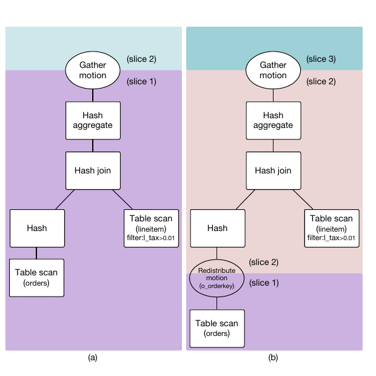

**图 3：切分后的查询计划。**

图 3(a) 中 `lineitem`、`orders` 都按 `l_orderkey` 分布。distribution key 与 join key 一致，可在各 segment 本地 join，无数据移动；aggregation key 也相同，可本地聚合；最后 gather 到 QD。从图中，我们可以看到，gather motion boundary 把计划切成两个 slice。motion 在相邻 slice 分为 send 与 receive；下层发送、上层接收。执行创建两 gang：QD 执行 gather receive 的 1-Gang；N-Gang 每 segment 一 QE，执行底部并向 QD 发送。

图 3(b) 中 `orders` 随机分布，join 前按 `o_orderkey` 哈希重分布，多一个 slice。planner 以 cost-based 方式决定。三个 slice 对应两个 N-Gang 和一个 1-Gang；两个 N-Gang 分别执行 redistribution 的 send/receive。

## 4. 互连

互连负责 execution slice 之间的 tuple 通信（图 4），为 motion node 提供通信原语。每个 motion node 通过许多 stream 与 peer 通信。HAWQ 有 TCP、UDP 两种实现。TCP 受 port 数（每 IP 约 60k）和海量并发连接建立成本限制；1000 segment 的典型 5-slice 查询约需 300 万连接，每节点数千。无连接 UDP 让每 segment 仅用一个 socket multiplex 多条 tuple stream，解决这两项问题并提高可扩展性。

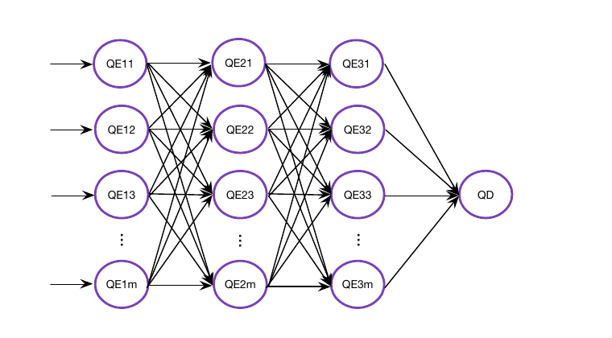

**图 4：流水执行的互连。**

本节中，我们将说明 UDP 互连的设计；它应达到以下目标：

- **可靠性：** 网络设备与 OS 可丢包，UDP 不保证可靠交付，互连必须恢复。
- **有序性：** UDP 不保序，互连必须按序交付。
- **流控：** receiver、OS、网络元件速度可能不匹配 sender。
- **性能与扩展：** 高性能且不触及 OS 限制。
- **可移植：** 跨平台，不依赖特定硬件/OS 私有特性。

### 4.1 协议

packet 有 self-describing header，包含完整 motion node、peer identity、session 和 command-id；字段均匀对齐以提高性能、可移植性。图 5 是发送/接收状态机。sender 完成 stream 后发 End of Stream（EoS）；receiver 在 `LIMIT` 已收够数据等情况下以 Stop 停止 sender。

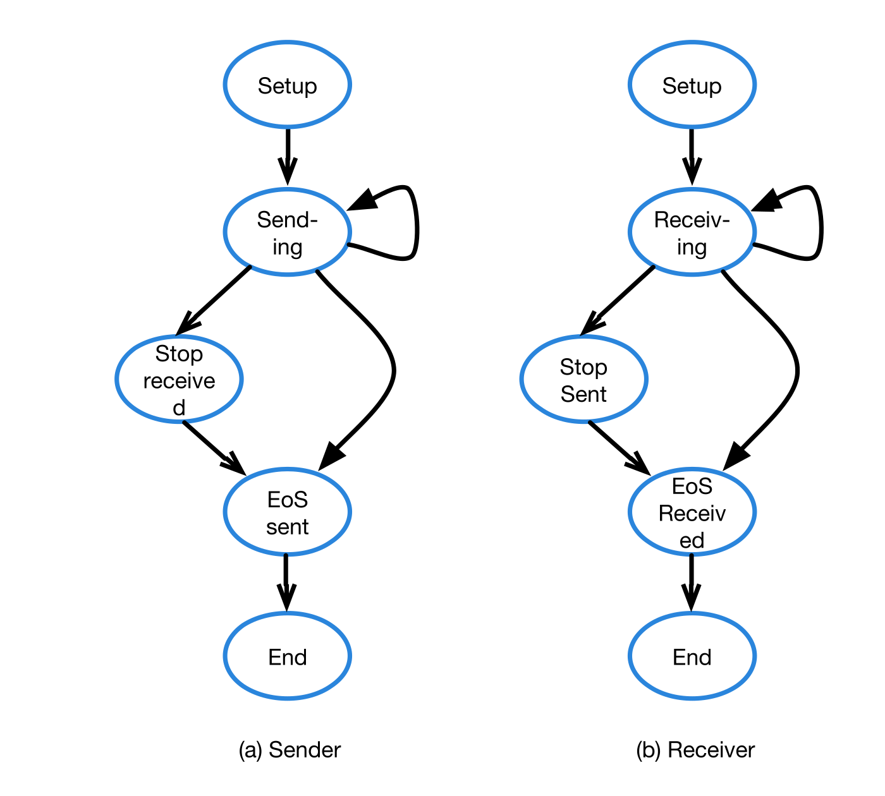

**图 5：互连 Sender 与 Receiver 状态机。**

### 4.2 实现

这里，我们将每个 sender-receiver 对之间的 connection 称为“virtual”，因为它没有独立的物理连接；物理上所有连接共享 sender socket。为快速清空 kernel socket buffer、避免丢包，通信多线程化，使 receive、verification、acknowledgement、receive-buffer management 与 executor 其余部分并发。

sender 每连接有 send queue，还有保存未确认 packet、快速检查过期的 expiration queue ring；ring 在同一 sender 进程所有连接共享。packet 填满后进入 send queue；receiver 尚有容量且 flow-control window `cwnd` 未满才发送。`cwnd` 限制未收到 ACK 的最大 packet 数。收到 ACK 后释放 buffer 并继续；timer 到期则重传。

receiver 接收线程监听端口，连续接收所有 sender。每 sender 有独立 channel 缓存 packet，避免某些查询潜在 deadlock。收到 packet 后进入对应 queue 并回 ACK；executor 线程持续取 packet 组装 tuple。

ACK 有两个重要字段：SC 是 receiver 已消费的 packet sequence number，SR 是已接收且入队的最大 sequence number。SC 计算 receiver 剩余容量；SR 识别已收到 packet，使 sender 从 expiration ring 移除已排队项。

### 4.3 流量控制

流控防止 sender 压垮 receiver、OS、NIC、switch。Retransmission timeout（RTO）按 round-trip time（RTT）动态计算，RTT 是发送到收到 ACK 的间隔。loss-based 方法动态调整发送速度：过期 packet 表示 OS/网络可能丢失，立即把 window 降到预定义最小值，再用 slow start 增长到合适大小。

### 4.4 丢包与乱序

互连保持输入 packet 有序。直接排序低效；这里，我们使用 ring buffer 保存 packet，不引入排序开销。检测丢包/乱序后，receiver 立即发 OUT-OF-ORDER 消息，列出可能丢失 packet；sender 重发。receiver 检测 duplicate 后，后台线程立刻发带 cumulative ACK 的 DUPLICATE 消息；sender 移除已接收项，避免未来重复重传。

### 4.5 消除死锁

大量 ACK 丢失可能死锁。假设连接双方各两 buffer，sender 发 `p1,p2` 填满 receiver。receiver 很慢，sender 可能重传 `p1`；receiver 回 ACK 表示两包已缓冲，sender 从 expiration ring 移除。receiver 消费后再 ACK 表示容量恢复；若这条 ACK 丢失，sender 以为无容量且因 ring 空而不再重传，receiver 等待新包，形成死锁。

消除机制是：sender 长时间没收到 peer ACK，且知道 receiver 无容量、unacknowledged queue 为空、自己仍有待发 packet 时，主动发 status query；receiver 以 SC、SR ACK 响应。

## 5. 事务管理

本节中，我们讨论 HAWQ 的事务管理与并发控制。HAWQ 完整支持事务，把一致性从易错应用代码移入系统。catalog 与 user data 处理不同：catalog 以 WAL、MVCC 实现事务和并发；user data 可 append 但不可原地 update，不写日志也不保多版本，而在 system catalog 记录数据文件 logical length 控制可见性。HDFS 文件 append-only；失败 insert 后 physical length 可能大于 useful-data logical length，下次写前须 truncate 垃圾尾部。

HAWQ 不像 Greenplum 等系统使用 2PC。事务只在 master 可见，segment 不保事务状态。self-described plan 含控制各表可见性的 snapshot。segment 执行时可能修改 dispatched catalog，结束后回传，由 master 批量更新 UCS；commit 只在 master。abort 时截断已写入 HDFS segment file 的数据。

### 5.1 隔离级别

HAWQ 用 MVCC，支持 snapshot isolation [14]。用户可请求四种 SQL 标准隔离级别，但内部与 PostgreSQL 类似，只实现 read committed 与 serializable：read uncommitted 当作 read committed；repeatable read 当作 serializable。所谓 serializable 禁止 dirty read、non-repeatable read、phantom read，但不等于数学上的真正 serializability，不能阻止 snapshot isolation 中的 write skew 等现象 [33]。

- **Read committed：** 语句只见开始前已提交行；请求 read uncommitted 实际仍得到它。
- **Serializable：** 当前事务所有语句只见第一条查询前已提交行，或本事务自己的修改。

默认 read committed，每条 query 在启动瞬间取得 snapshot；serializable 则事务内查询共享事务开始时 snapshot。

### 5.2 Locking

锁控制并发 DDL/DML 冲突。例如 select 前取得 access shared lock，并发 ALTER TABLE 等待 access exclusive，直到 select 提交或中止。master 与 segment 都周期运行 deadlock checker，检测后中止事务。

### 5.3 HDFS Truncate

事务中止需撤销底层修改。原 HDFS 不支持与 append 相反的标准 POSIX truncate，上层只能在额外 metadata store 跟踪每文件废弃 byte range，再周期 vacuum 重写 compact file。在 Pivotal Hadoop HDFS 中，我们添加了 truncate 以支持事务：

```java
void truncate(Path src, long length) throws IOException;
```

它把文件截到小于等于现长的目标长度；若文件小于目标则抛 IOException。这不同于 POSIX，因为 HDFS 不支持任意位置覆盖。并发时只允许一个 writer/appender/truncater，只能 truncate 已关闭文件；操作原子成功或失败，不留未定义状态。并发 reader 可以读正在截断的文件，但必须能读完不受截断影响的数据。

实现先取得文件 F 的 lease。若目标在 block boundary，NameNode 只删除尾部 block；否则设截断结果为 R，把 R 最后 block B 复制到临时文件 T，删除 F 的 B、B+1 到尾部，再把 F 与 T concatenate 得到 R，最后释放 lease。

### 5.4 并发更新

catalog table 用 MVCC 和 locking；HDFS user table append-only。轻量 swimming-lane 方法支持并发 insert：不同 insert 写不同文件，像泳道互不干扰。典型 OLAP 在夜间批量装载，或只有少数持续 writer；一个事务完成后文件又可由另一个 append，所以每并发 writer 分配文件不会导致无限小文件。

每个 user table 有 catalog table 记录所有 data file；每 tuple 记录 segment file 的 logical length、uncompressed length 等。事务关键是 logical length。失败事务可能使 physical 与 logical 不同；query 按 transaction snapshot 中 logical length 扫描。

## 6. 扩展框架

本节中，我们介绍 PXF：它是把 HAWQ 连接到任意数据存储的快速可扩展框架，让 HAWQ 的 SQL、智能 planner、高速 executor 通过 external table 访问外部数据。已有 connector 并行、透明连接 HBase、Accumulo、GemFireXD、Cassandra、Hive，以及 SequenceFile、Avro、RCFile、plain text（delimited、CSV、JSON）和多种序列化格式。

框架公开 parallel connector API，用户可为任意 store 或私有格式实现。HAWQ 可直接对外部数据运行 SQL，透明执行 internal HAWQ table 与 PXF table（如 HDFS Avro）的复杂 join，也可把内部数据导出到 HDFS 文件。PXF 本身不感知事务。

### 6.1 使用

要连接已有内建 connector 的数据存储，我们需要指定 connector 名与数据源；没有时可按第 6.4 节扩展。举例来说，让我们假设我们想并行访问 HBase 表 `sales`，并假设我们只关注 column family `details` 的 `store`、`price` 两个 qualifier；原文随后的建表示例将前者写作 `details:storeid`：

```sql
CREATE EXTERNAL TABLE my_hbase_sales (
    recordkey BYTEA,
    "details:storeid" INT,
    "details:price" DOUBLE
)
LOCATION ('pxf://<pxf service location>/sales?profile=HBase')
FORMAT 'CUSTOM' (formatter='pxfwritable_import');
```

随后，我们可以对这些 HBase attribute 与 row key 执行各种 SQL：

```sql
SELECT sum("details:price")
FROM my_hbase_sales
WHERE recordkey < 20130101000000;
```

也可与内部表 join：

```sql
SELECT <attrs>
FROM stores s, my_hbase_sales h
WHERE s.name = h."details:storeid";
```

### 6.2 收益

PXF 打破过去对数据放置和处理的刚性选择，按需连接不同 store，真正共享数据。同一数据兼顾 operational 与 analytical 时，可以放入 GemFireXD 等内存事务数据库，再由 HAWQ 即席分析。跨源 join 让大数据设计更灵活；若以后频繁分析，也可把目标数据插入本地 HAWQ 表。由于 planner/executor 高效，能翻译成 SQL 的外部 MapReduce 等 job 往往在 HAWQ/PXF 上快得多。

### 6.3 高级功能

PXF 感知性能并内建优化。data locality awareness 把 parallel unit 分配给本地 segment，减少网络。可 split 数据源由 data fragment 构成：HDFS/Hive 可是 file block，HBase 可是 region。planner 利用 fragment 及 host/IP，把读取交给本地 segment。

filter pushdown API 在数据所在地过滤，而非全读入 HAWQ；还可排除与 filter 不匹配的 partition，例如 Hive connector 忽略相应嵌套目录。两者都由 HAWQ 推出 scan qualifier，PXF 按需使用。

PXF 还收集 planner statistics。对 PXF table 运行 ANALYZE，可把外部数据的 tuple 数、page 数等统计写入 HAWQ catalog，供涉及该表的计划使用。

### 6.4 构建 Connector

API 有三个必需 plugin、一个可选 plugin。实现后编译并部署到所有 PXF 运行时可访问节点：

- **Fragmenter：** 给定数据源位置与名称，返回 fragment 列表和位置。
- **Accessor：** 给定 fragment，读取其所有 record。
- **Resolver：** 接收 accessor record，必要时反序列化并解析为 attribute；输出转为普通 HAWQ record。
- **Analyzer（可选）：** 给定源位置和名称，估计 record 数及其他统计。

## 7. 相关工作

分布式数据处理工作分四类：

- **处理框架。** MapReduce [19, 20] 及 Hadoop [1] 面向 batch，在高度可扩展分布式存储上提供高可用服务；Dryad [26] 是 coarse-grained data-parallel 的通用 dataflow engine；Spark [8] 的 RDD [40] 是在大集群容错内存计算的分布式内存抽象。
- **框架扩展。** MapReduce 上的 Pig [30]、Hive [36, 37]、Tenzing [16]、FlumeJava [15]，Dryad 上的 DryadLINQ [39]，向用户提供 procedural/declarative language；Spark 上 Shark [38] 运行 SQL 和复杂分析函数。
- **HDFS 原生 SQL 引擎。** HAWQ、Impala [5]、Presto [7]、作为 Dremel [29] 开源实现的 Drill [3]，都用数据库技术提高即席查询并采用 pipeline。HAWQ 的架构差异是事务支持、无状态 segment、UDP 互连；其他系统均无事务。
- **数据库与 Hadoop 混合。** DB2 [31]、Oracle [35]、Greenplum [4]、Asterdata [2]、Netezza [6]、Vertica [11]、Polybase [22] 把 Hadoop 接入自身数据库；HadoopDB [12]（商业化为 Hadapt [28]）结合 MapReduce 与 DBMS。

## 8. 实验

使用 TPC-H 数据和查询评估 HAWQ。所有系统部署于 20 节点集群，经 48-port 10 GigE switch 相连；16 节点运行 segment/DataNode，4 节点用于 master/NameNode。每节点两颗 2.93 GHz Intel Xeon 6-core，64-bit CentOS 6.3、2.6.23 kernel、48 GB RAM、12×300 GB 磁盘、一块 Intel X520 dual-port 10 GigE NIC。

### 8.1 被测系统

**Stinger。** Stinger [9] 是优化 Apache Hive 的社区工作。Hive 0.12 的 phase 2 引入 ORCFile、基础/高级优化、VARCHAR、DATE，据称比原 Hive 快 35-45 倍 [9]。实验中 MapReduce job 由 YARN 管理，数据在 HDFS，每节点一个 DataNode 与 NodeManager。我们为每个节点的 YARN 分配 36 GB，共 576 GB；container 最小 4 GB。为使性能比较公平，我们调优 YARN/Stinger 默认参数，并调整查询、schema、格式以利用 Stinger 的改进；Stinger 不能直接运行标准 TPC-H，使用 [10] 的转换查询。

**HAWQ。** 每节点 6 segment，共 96；每 segment 6 GB，其余默认。

### 8.2 TPC-H 结果

dbgen 生成 plain text 到 HDFS，再装入系统格式。HAWQ 原生 AO、CO、Parquet，默认表 hash partitioned；Stinger 用默认 ORCFile。系统分别独占集群。规模为 160 GB（10 GB/node，可全入内存，CPU-bound）和 1.6 TB（100 GB/node，I/O-bound）。我们先给出总体查询执行时间，然后聚焦若干具体查询，解释 HAWQ 如何以及为何胜过 Stinger。

#### 8.2.1 总体结果

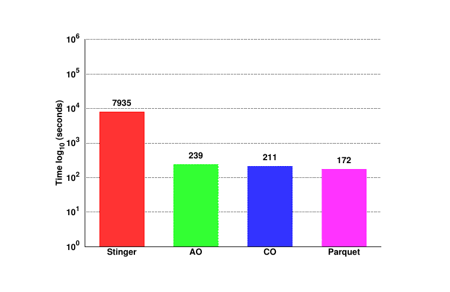

**图 6：160 GB 数据集的总体执行时间。**

160 GB 上 22 个查询：HAWQ Parquet 172 秒，CO 211 秒，AO 239 秒；Stinger 超过 7,900 秒。不论 HAWQ 格式，CPU-bound 情形约快 45 倍。

> **原文脚注 3：**我们原计划比较 Impala 和 Presto，但由于这两个系统在我们的系统上运行大数据集 TPC-H 查询时频繁因内存不足而失败，因此停止比较。

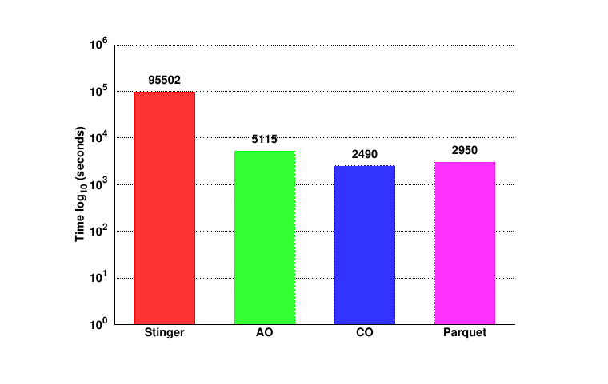

**图 7：1.6 TB 数据集的总体执行时间。**

对于 1.6 TB 数据集，我们只报告 22 个 TPC-H 查询中的 19 个，因为另 3 个 Stinger reducer OOM。HAWQ CO 2,490 秒最快，Parquet 2,950，AO 5,115；Hive 约 96,000 秒，比 HAWQ 慢约 40 倍。两组一致表明 CPU-bound 和 I/O-bound 均显著领先。

#### 8.2.2 具体查询

根据执行计划的复杂度，我们把 22 个 TPC-H 查询中的 12 个分成简单 selection 和复杂 join 两组。由于篇幅限制，我们这里只考虑 1.6 TB 数据集。

**简单 selection。** Q1、Q6 是单表选择聚合；Q4、Q11、Q13、Q15 是两三表直接 join。这里，我们以 Q6 为例：它估算某年消除给定比例公司折扣带来的收入增加，只涉及 `lineitem`，计划是 sequential scan 后 two-phase aggregation。

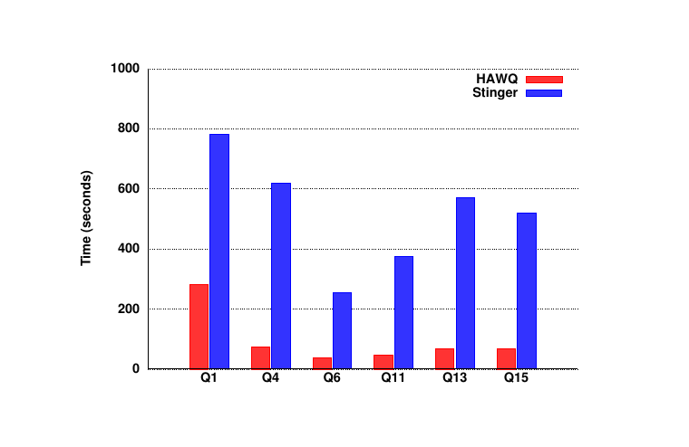

**图 8：简单 Selection 查询。**

HAWQ 对这些查询快 10 倍：HAWQ task startup/coordination 比 YARN 高效；HAWQ data movement 流水化，MapReduce 每阶段把输出物化在本地或 HDFS。

**复杂 join。** Q5、Q7、Q8、Q9、Q10、Q18 对多个不同规模表做 selection/aggregation，join 三表以上，包括最大 `orders`、`lineitem`，难以手工优化。Q5 计算本地供应商收入，join `customer`（240M）、`orders`（2.4B）、`lineitem`（9.6B）、`supplier`（16M）、`nation`（25）、`region`（5），join order 和移动效率至关重要。

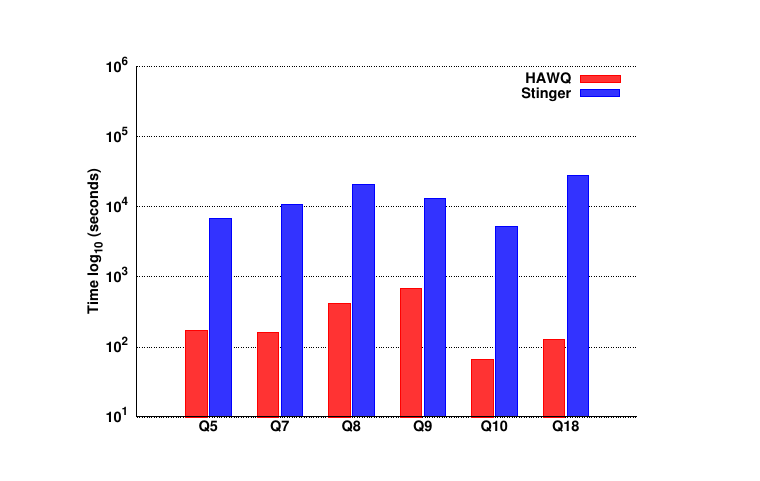

**图 9：复杂 Join 查询。**

HAWQ 约快 40 倍，除上述流水因素外还来自计划算法。HAWQ 根据统计用 cost-based optimizer 找近优计划；Stinger 以简单 rule-based、很少利用提示，通常只能给次优计划。多表 join 的大数据移动还受益于 HAWQ 互连比 MapReduce HTTP 更高的吞吐。

### 8.3 数据分布

正如我们在第 2.3 节所述，HAWQ 支持 RANDOMLY 与指定列 HASH。Q5、Q8、Q9、Q18 显示合适 distribution key 总体带来 2x 改善。

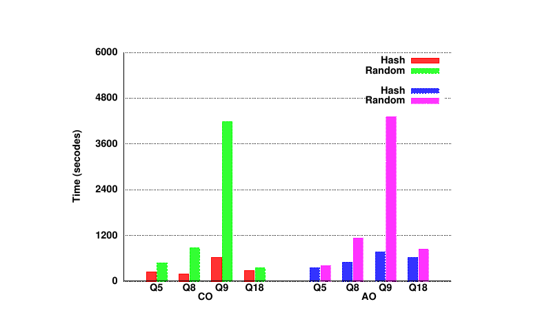

**图 10：数据分布。**

这里，我们以 Q9 为例说明其工作方式。Q9 按 supplier nation 与年份计算某类零件利润，equi-join `part`、`supplier`、`lineitem`、`partsupp`、`orders`、`nation`，join key 分别是 `part`、`supplier`、`partsupp`、`nation` 主键。各表以主键作 distribution key，相对 random 大幅减少重分布。

### 8.4 压缩

我们评估不同压缩算法如何影响存储占用和查询执行时间。AO/CO 考察无压缩、quicklz、zlib level 1/5/9；对于 Parquet，我们测试无压缩、snappy、gzip 1/5/9。图 11 给 `lineitem` 大小和 TPC-H 时间。

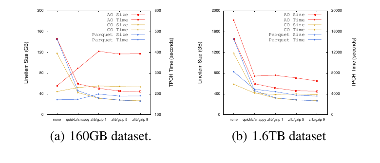

**图 11：压缩。**

两规模下，quicklz 约 3x；zlib level 1 略好，继续升 level 改善极小，故 TPC-H 类数据 level 1 已足够。CO、Parquet 是列格式，压缩优于 row-oriented AO。

执行时间则不同。160 GB 可无论压缩与否全入内存，更高压缩增加 CPU 密集压缩/解压而几乎无 I/O 收益，所以三种格式都变慢；AO 退化更严重，因为它取出并解压所有列，CO/Parquet 只处理查询所需列。1.6 TB 相反，压缩率提高使查询更快；I/O 收益使解压 CPU 可忽略。

### 8.5 互连

本节中，我们在 160 GB 数据集上评估 TCP/UDP 两种互连实现。

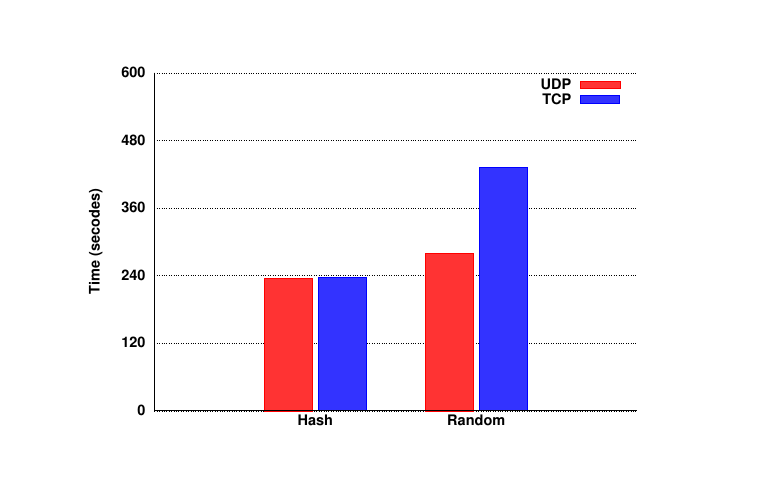

**图 12：TCP 与 UDP。**

hash distribution 下二者相近；random 下 UDP 比 TCP 快 54%。random 产生更深计划、更多移动和互连连接；UDP 建连成本更低，高并发传输率更高。

### 8.6 可扩展性

两组测试：（1）固定每节点 40 GB；（2）固定总量 160 GB，按 distribution column 分到不同节点。我们在 4、8、12、16 节点的集群规模上运行该任务。

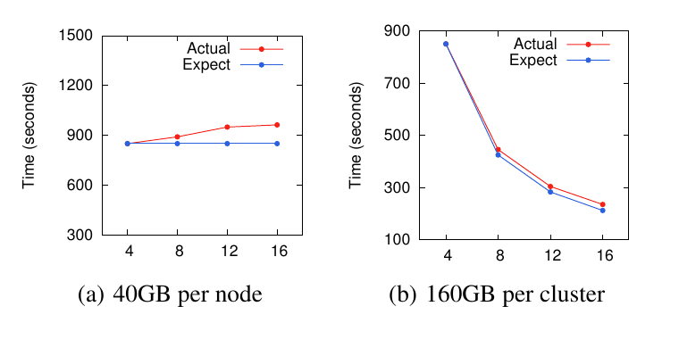

**图 13：可扩展性。**

第一组从 4 到 16 节点，数据从 160 到 640 GB，执行时间仅增约 13%，可处理数据量随集群近线性增长。第二组固定数据，时间从 850 秒降至 236 秒，约为原 28%，执行时间随节点数近线性降低。

## 9. 结论

本文介绍 HAWQ：把 MPP 数据库与 Hadoop 优点统一在单一 runtime 的 MPP SQL 引擎。HDFS 底层带来数据复制与容错；继承 MPP 则使其兼容标准 SQL、高效、完整支持事务。文中讨论了查询处理、UDP 互连、事务管理、容错、读优化存储和支持多数据存储/格式的扩展框架。实验表明 HAWQ 大幅领先 Stinger。

## 10. 参考文献

[1] Apache Hadoop, http://hadoop.apache.org/.

[2] Asterdata, http://www.asterdata.com/sqlh/.

[3] Drill, http://incubator.apache.org/drill/.

[4] Greenplum database, http://www.gopivotal.com.

[5] Impala, https://github.com/cloudera/impala.

[6] Netezza, http://www-01.ibm.com/software/data/netezza/.

[7] Presto, http://prestodb.io.

[8] Spark, http://spark.incubator.apache.org/.

[9] Stinger, http://hortonworks.com/labs/stinger/.

[10] TPC-H on Hive, https://github.com/rxin/TPC-H-Hive.

[11] Vertica, http://www.vertica.com.

[12] A. Abouzeid, K. Bajda-Pawlikowski, D. Abadi, A. Silberschatz, and A. Rasin. HadoopDB: An architectural hybrid of MapReduce and DBMS technologies for analytical workloads. In VLDB, 2009.

[13] A. Ailamaki, D. J. Dewitt, M. D. Hill, and M. Skounakis. Weaving relations for cache performance. In VLDB, 2001.

[14] H. Berenson, P. Bernstein, J. Gray, J. Melton, E. O'Neil, and P. O'Neil. A critique of ANSI SQL isolation levels. In SIGMOD, 1995.

[15] C. Chambers, A. Raniwala, F. Perry, S. Adams, R. R. Henry, R. Bradshaw, and N. Weizenbaum. FlumeJava: Easy, efficient data-parallel pipelines. In PLDI, 2010.

[16] B. Chattopadhyay, L. Lin, W. Liu, S. Mittal, et al. Tenzing: A SQL implementation on the MapReduce framework. In VLDB, 2011.

[17] J. Cohen, B. Dolan, M. Dunlap, J. M. Hellerstein, and C. Welton. MAD skills: New analysis practices for big data. In VLDB, 2009.

[18] J. C. Corbett, J. Dean, M. Epstein, et al. Spanner: Google's globally-distributed database. In OSDI, 2012.

[19] J. Dean and S. Ghemawat. MapReduce: Simplified data processing on large clusters. In OSDI, 2004.

[20] J. Dean and S. Ghemawat. MapReduce: simplified data processing on large clusters. Communications of the ACM, 51(1):107-113, 2008.

[21] D. J. DeWitt, S. Ghandeharizadeh, D. Schneider, A. Bricker, H. Hsiao, and R. Rasmussen. The Gamma database machine project. IEEE Trans. Knowl. Data Eng., 2(1):44-62, 1990.

[22] D. J. DeWitt, A. Halverson, R. V. Nehme, S. Shankar, J. Aguilar-Saborit, A. Avanes, M. Flasza, and J. Gramling. Split query processing in Polybase. In SIGMOD, 2013.

[23] G. Graefe. Encapsulation of parallelism in the Volcano query processing system. In SIGMOD, 1990.

[24] S. Harizopoulos, P. A. Boncz, and S. Harizopoulos. Column-oriented database systems. In VLDB, 2009.

[25] J. Hellerstein, C. Ré, F. Schoppmann, D. Z. Wang, E. Fratkin, A. Gorajek, K. S. Ng, C. Welton, et al. The MADlib analytics library or MAD skills, the SQL. In VLDB, 2012.

[26] M. Isard, M. Budiu, Y. Yu, A. Birrell, and D. Fetterly. Dryad: Distributed data-parallel programs from sequential building blocks. In EuroSys, 2007.

[27] D. Jiang, B. C. Ooi, L. Shi, and S. Wu. The performance of MapReduce: An in-depth study. In VLDB, 2010.

[28] D. J. A. Kamil Bajda-Pawlikowski and, A. Silberschatz, and E. Paulson. Efficient processing of data warehousing queries in a split execution environment. In SIGMOD, 2011.

[29] S. Melnik, A. Gubarev, J. J. Long, G. Romer, S. Shivakumar, M. Tolton, and T. Vassilakis. Dremel: Interactive analysis of web-scale datasets. In VLDB, 2010.

[30] C. Olston, B. Reed, U. Srivastava, R. Kumar, and A. Tomkins. Pig Latin: a not-so-foreign language for data processing. In SIGMOD, 2008.

[31] F. Özcan, D. Hoa, K. S. Beyer, A. Balmin, C. J. Liu, and Y. Li. Emerging trends in the enterprise data analytics: connecting Hadoop and DB2 warehouse. In SIGMOD, 2011.

[32] A. Pavlo, E. Paulson, A. Rasin, D. J. Abadi, D. J. DeWitt, S. Madden, and M. Stonebraker. A comparison of approaches to large-scale data analysis. In SIGMOD, 2009.

[33] D. R. K. Ports and K. Grittner. Serializable snapshot isolation in PostgreSQL. In VLDB, 2012.

[34] J. Shute, R. Vingralek, B. Samwel, et al. F1: A distributed SQL database that scales. In VLDB, 2013.

[35] X. Su and G. Swart. Oracle in-database Hadoop: When MapReduce meets RDBMS. In SIGMOD, 2012.

[36] A. Thusoo, J. S. Sarma, N. Jain, et al. Hive - a warehousing solution over a MapReduce framework. In VLDB, 2009.

[37] A. Thusoo, J. S. Sarma, N. Jain, et al. Hive - a petabyte scale data warehouse using Hadoop. In ICDE, 2010.

[38] R. S. Xin, J. Rosen, M. Zaharia, M. J. Franklin, S. Shenker, and I. Stoica. Shark: SQL and rich analytics at scale. In SIGMOD, 2013.

[39] Y. Yu, M. Isard, D. Fetterly, et al. DryadLINQ: a system for general-purpose distributed data-parallel computing using a high-level language. In OSDI, 2008.

[40] M. Zaharia, M. Chowdhury, T. Das, et al. Resilient distributed datasets: A fault-tolerant abstraction for in-memory cluster computing. In NSDI, 2012.
