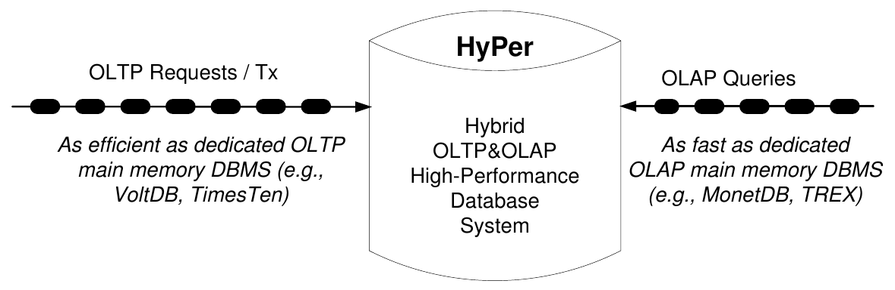
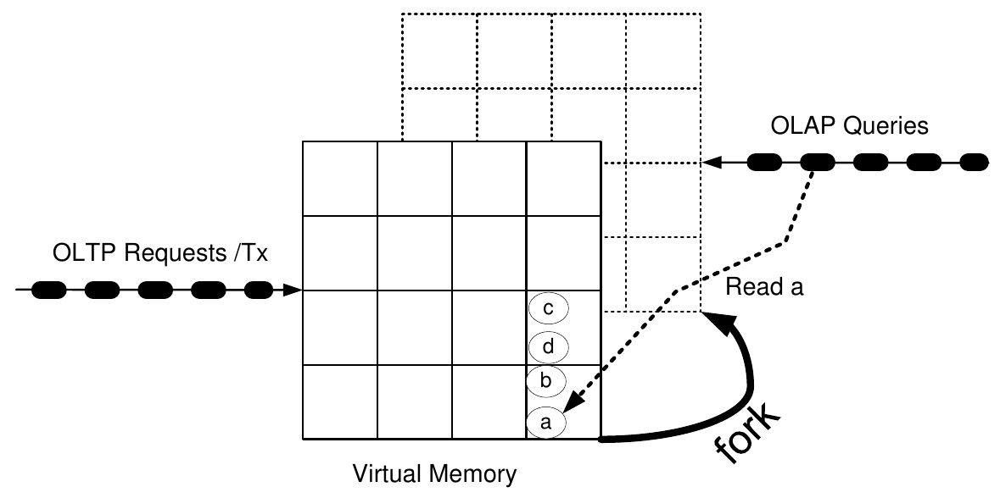
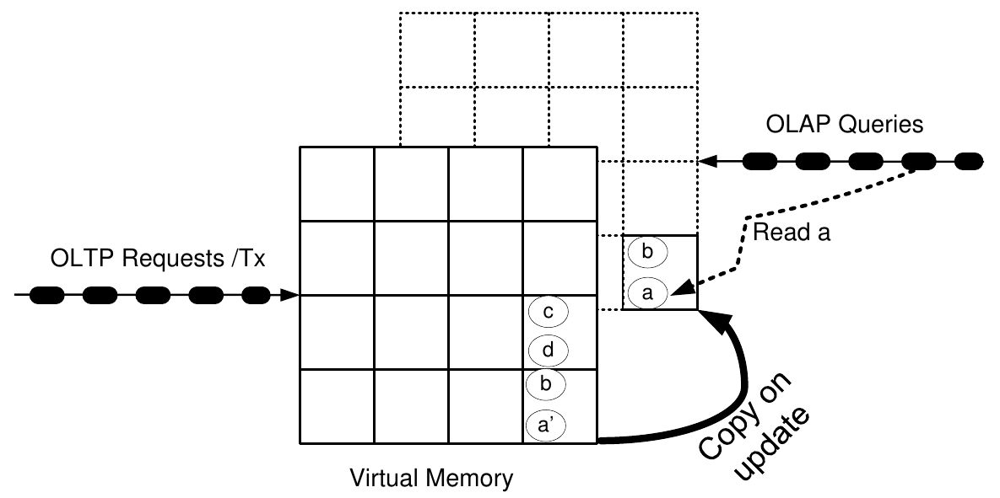
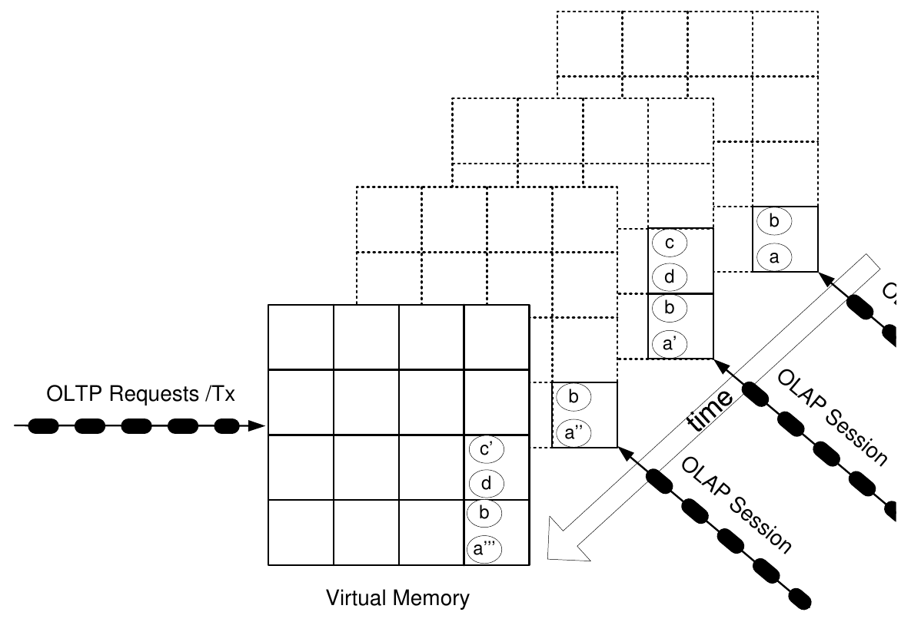
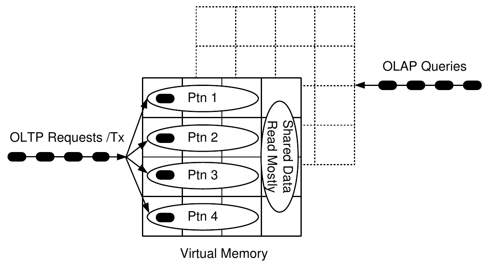
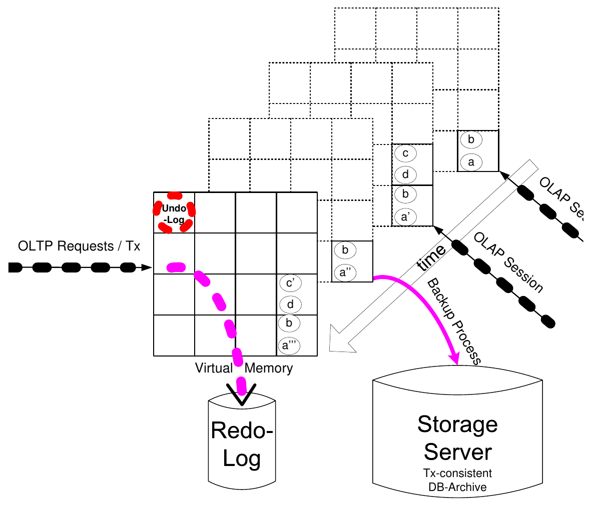
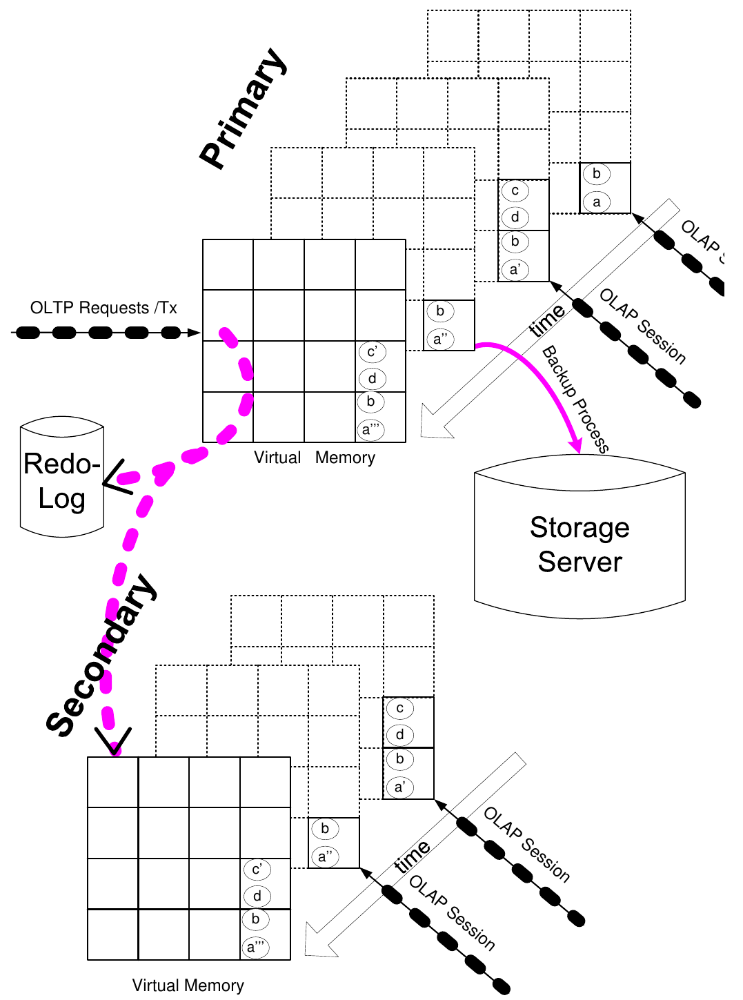
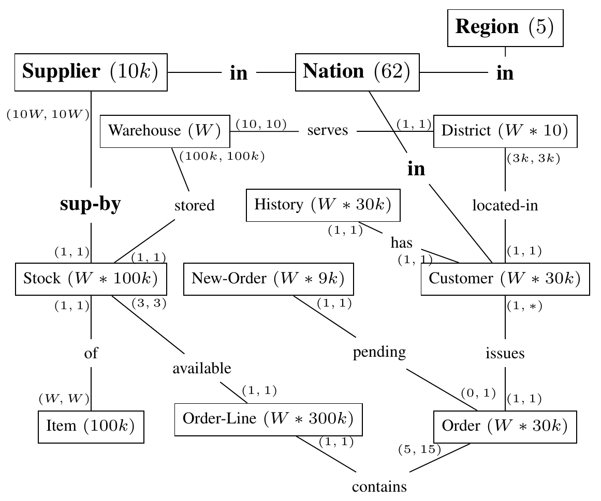
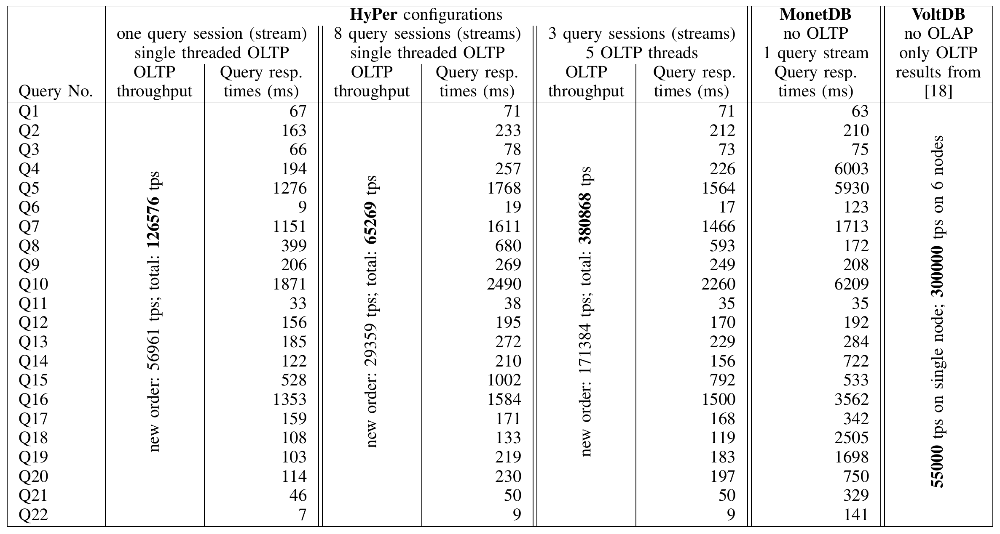
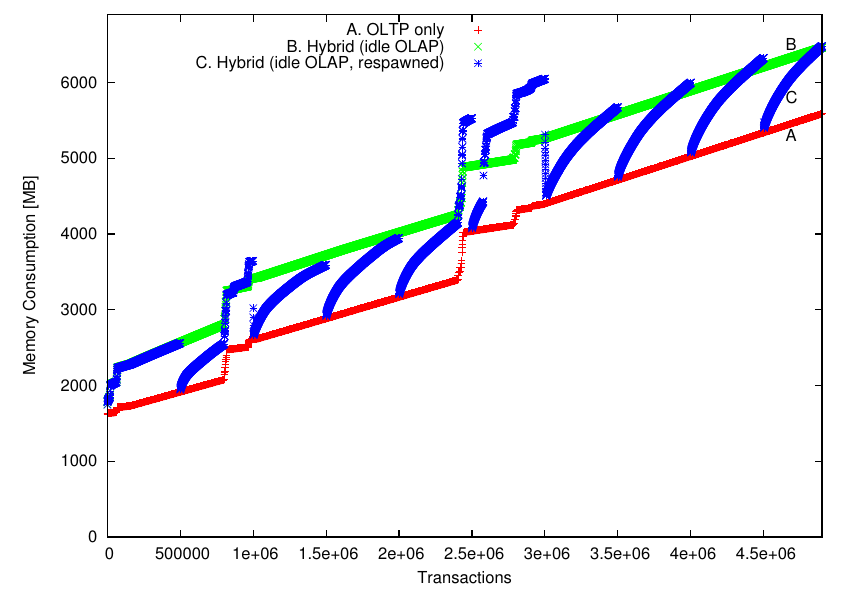

# HyPer: A Hybrid OLTP&OLAP Main Memory Database System Based on Virtual Memory Snapshots（中文译文）

## 译者说明

本文依据同目录的 `source.pdf` 翻译。章节、图表、公式、算法、代码与参考文献按原文结构保留。

Alfons Kemper¹，Thomas Neumann²<br>
慕尼黑工业大学计算机科学系（Fakultät für Informatik, Technische Universität München）<br>
Boltzmannstraße 3, D-85748 Garching<br>
¹ kemper@in.tum.de<br>
² neumann@in.tum.de

## 摘要

联机事务处理（OLTP）和联机分析处理（OLAP）这两个领域，对数据库架构提出了不同的挑战。目前，具有高频率关键业务事务的客户，已将数据拆分到两个独立系统中：一个数据库用于 OLTP，另一个所谓的数据仓库用于 OLAP。这种分离虽然能取得可观的事务处理速率，却有许多缺点，包括仅周期性启动抽取—变换—加载数据暂存过程而造成延迟，进而带来的数据新鲜度问题，以及维护两个独立信息系统产生的过高资源消耗。我们提出一种名为 HyPer 的高效混合系统，利用硬件辅助的复制机制维护事务数据的一致快照，同时处理 OLTP 和 OLAP。HyPer 是一种内存数据库系统，保证 OLTP 事务的 ACID 属性，并在同一个、可任意设定新鲜程度的一致快照上执行 OLAP 查询会话（多条查询）。利用处理器内建的虚拟内存管理支持（地址转换、缓存、更新时复制），可以在同时并行执行两种工作负载的单一系统中，兼得前所未有的高事务速率（每秒高达 100000 次）与极快的 OLAP 查询响应。性能分析基于 TPC-C 与 TPC-H 的组合基准。

## I 引言

历史上，数据库系统主要用于联机事务处理。典型例子是销售订单录入或银行事务处理。这些事务仅访问和处理全部数据中的很小一部分，因此能够很快执行。根据标准 TPC-C 基准测试结果，目前最强大的系统每秒可以处理超过 100,000 次此类销售事务。

大约二十年前，数据库系统出现了一种新用途：商业智能（BI）。BI 应用依赖长时间运行的、所谓联机分析处理（OLAP）查询，处理相当大一部分数据，为业务分析人员生成报告。典型报告包括按地理区域、产品类别或客户分类等分组的汇总销售统计。最初曾尝试在运行中的 OLTP 数据库上执行这些查询，例如 SAP 的 EIS 项目 [1]，但由于 OLAP 查询处理导致资源争用，严重损害关键业务事务处理，这类尝试最终被放弃。因此，人们设计了数据暂存（data staging）架构：在专用 OLTP 数据库系统上处理事务，另外安装独立的数据仓库系统处理商业智能查询。周期性地（例如夜间）抽取 OLTP 数据库的变化，将其变换为数据仓库模式的布局，再载入数据仓库。这种数据暂存及其相关的 ETL（抽取—变换—加载）显然会造成数据陈旧问题，因为 ETL 过程只能周期性执行。

最近，支持所谓实时商业智能的论据日益有力。SAP 联合创始人 Hasso Plattner 为企业资源规划系统倡导“数据触手可及”的目标 [2]。现行架构将 OLTP 数据库上的事务处理，与仅周期性刷新的数据仓库上的 BI 查询处理分离，这违背了上述目标，因为业务分析人员不得不根据陈旧、过时的数据作决策。实时/运营型商业智能要求对事务性 OLTP 数据的当前最新状态执行 OLAP 查询。我们提出用高效查询处理能力增强事务数据库，从而将一部分查询处理从数据仓库转移到 OLTP 系统。因此，需要在同一数据库上支持 OLTP 事务处理与 OLAP 查询处理的混合工作负载。这在一定程度上与近期针对不同应用场景构建专用系统的趋势相反。在同一系统中集成这两种截然不同的工作负载，需要大幅提升性能，而内存数据库架构能够实现这一点。

乍看之下，（可通过互联网访问的）数据量急剧膨胀，似乎与把全部事务数据保留在内存中的前提矛盾。然而，仔细考察就会发现，关键业务事务数据库的数据量是有限的，这有利于采用内存数据管理。为支持这一假设，我们分析最大的商业企业之一 Amazon，其年收入约为 150 亿欧元。假定每个订单行的金额约为 15 欧元，而每个订单行产生约 54 字节存储数据（与 TPC-C 基准的规定一致），则每年订单行数据总量为 54 GB；订单行是这类销售应用中的主要数据集合。该估计既未包含会增加数据量的其他数据（客户和产品数据），也未考虑通过压缩减小数据量的可能性。尽管如此，仍可以合理地认为，一年的销售数据能够装入大型服务器的内存。Ousterhout 等人 [3] 也对此作了分析，他们主张将所谓 RAMcloud 作为最大规模互联网软件应用的内存存储设备。外推过去的发展，可以有把握地预测：普通及高端服务器的内存容量增长，都将快于最大型商业客户的需求增长。例如，Intel 在其所谓 Tera Scale 计划 [4] 中宣布了一种配有数 TB 内存的大型多核处理器。我们目前正在向 Dell 订购一台 TB 级服务器，价格“仅”为 60,000 欧元。

对于这样一家收入为 150 亿欧元的大型企业，可以估计其事务速率约为每秒 32 个订单行。虽然这类业务事务的到达速率高度偏斜（例如圣诞节销售高峰），但可以合理假定，峰值负载仍低于每秒几千个订单行。

HyPer 采用内存架构进行事务处理。我们遵循 [5] 首先倡导的无锁方法：所有 OLTP 事务顺序执行，或在私有分区上执行。由于唯一的更新事务“拥有”整个数据库，或者数据库中的私有分区，这种架构免去了对数据对象或索引结构进行昂贵加锁和加闩锁的需要。显然，这种串行执行方法只适用于纯内存数据库：这里不需要通过交错使用 CPU 为其他事务工作，来掩盖某个事务的 I/O 操作。在内存架构中，典型业务事务（例如订单录入或支付处理）只需几微秒至十微秒。Mike Stonebraker 领导的 MIT、Yale 和 Brown 大学研究人员开发的研究原型 H-Store [6]，此前已经证明这种系统能够胜任 OLTP 处理。H-Store 原型最近由一家名为 VoltDB 的初创公司商业化。

不过，H-Store 架构仅限于 OLTP 事务处理。如果直接允许把复杂的 OLAP 风格查询加入工作负载队列，就会堵塞系统，因为所有后续 OLTP 事务必须等待这个长查询完成。即使这种 OLAP 查询在 30 ms 内结束，在它锁住系统的这段时间里，本可完成约 1000 次或更多 OLTP 事务。

尽管如此，我们的目标仍是构建一种内存数据库系统，能够：

- 与 VoltDB 或 TimesTen 等专用 OLTP 内存系统一样高效，以每秒数万乃至数十万次的速率处理 OLTP 事务；同时，
- 与 MonetDB 或 TREX 等专用 OLAP 内存 DBMS 一样高效，在事务数据的最新快照上处理 OLAP 查询。



图 1：OLTP 与 OLAP 混合数据库架构。

图 1 概括了这一挑战。我们构建了这样一种名为 HyPer 的高效混合系统，利用硬件辅助的复制机制维护事务数据的一致快照，同时处理 OLTP 和 OLAP。HyPer 是保证 OLTP 事务 ACID 属性的内存数据库系统。具体而言，我们设计了日志和备份归档方案，以提供持久性、原子性和快速恢复。在并行处理 OLTP 的同时，HyPer 在同一个、可任意设定新鲜程度的一致快照上执行 OLAP 查询会话（多条查询）。快照通过 fork OLTP 进程创建，从而产生一致的虚拟内存快照。该快照由操作系统/处理器控制的隐式、惰性写时复制机制保持一致。利用处理器内建的虚拟内存管理支持（地址转换、缓存、更新时复制），在同一系统中同时实现了：前所未有的、每分钟数百万次的高事务速率，与任何面向 OLTP 优化的数据库系统一样高；以及超低的 OLAP 查询响应时间，与最好的面向 OLAP 优化的列存一样低。这些数字是在一台普通桌面级服务器上取得的。即使创建新的事务一致快照，也能在不到一秒内完成。

## II 相关工作与系统

HyPer 是一种新的 RISC 风格数据库系统 [7]，与 RDF-3X [8] 类似（不过用途完全不同）。这两个系统都从头开发。因此，我们可以去掉传统数据库系统中因历史原因而保留的负担，并利用新的硬件和操作系统功能。

内存数据库系统（in-memory DBMS）的开发最初始于 OLTP 领域。TimesTen [9] 是最早的此类系统之一，最近被 Oracle 收购，主要用作 Oracle 主流数据库系统的“前端”缓存。P*TIME / Transact in Memory [10] 于 2005 年被 SAP 收购。Solid Information Technology 的 SolidDB 是在赫尔辛基开发的内存数据库；此后 IBM 收购了该公司。针对 SolidDB，人们提出了元组级快照 [11]，通过元组影子副本而非页影子副本保持一致性。该研究 [11] 的作者报告事务吞吐量提高 30%，内存占用也更小。页级影子技术可追溯至关系数据库系统开发的早期 [12]。HyPer 依赖由处理器内存管理单元（MMU）控制、硬件支持的页影子技术。对于磁盘数据库系统，影子技术并不十分成功，因为它破坏页聚簇，磁盘读写头需要移动，从而损害扫描性能，例如全表扫描。HyPer 基于虚拟内存支持的影子分页，影子操作不会损害扫描性能。在内存中，访问两个相邻物理内存页，与访问两个距离更远的物理页，没有区别。此外，基于虚拟内存影子技术的快照不影响逻辑页布局，也就是说，可能出现的非连续物理页访问被硬件隐藏了。

最近，内存容量的大幅增加及对实时/运营型商业智能的需求，使内存数据库系统的研究与商业开发重新活跃起来。近期的内存数据库系统可按应用领域分为 OLAP 和 OLTP 两类。MonetDB 是关于内存 OLAP 数据库列存储方案最有影响力的数据库研究项目。关于该系统的概述，可参见其获得 VLDB 会议十年时间检验奖时发表的总结论文 [13]。TREX [14] 是 SAP 最重要的数据库项目，与 MonetDB 一样依赖列优先存储方案。它现在称为 Business Warehouse Accelerator，是 SAP 商业智能功能的基础。根据 Hasso Plattner 在 SIGMOD 2009 的主题演讲 [2]，SAP 打算扩展它，纳入 OLTP 功能，进而将其作为 Business by Design 等托管应用的基础。该混合系统显然是 TREX 与 P*TIME 的结合，依赖周期性地将 OLTP 更新合并到 OLAP TREX 数据库的列存中 [15]。在 HyPer 中，这种合并通过创建新的虚拟内存快照隐式完成，并得到硬件支持。

以一项早期银行事务研究 [16] 为基础，H-Store 的作者 [17, 6, 5] 分析了各种传统数据库管理功能（缓冲管理、日志、锁等）施加的开销，这一贡献值得肯定。他们证明了无同步开销、顺序处理事务的内存数据库系统的可行性。VoltDB [18] 是 H-Store 的商业化产品。公布的 VoltDB 性能数字很大程度上来自跨计算集群的数据库分区。[19] 设计了允许跨分区事务的同步概念。Ulusoy 和 Buchmann [20] 研究了内存数据库分区，用于优化实时应用的并发控制。自动推导分区方案是分布式数据库设计中的老问题，如今再次受到关注 [21]。

HyPer 的分区技术（见第 III-D 节）主要用于节点内并行，对多租户数据库应用尤其有益 [22]。

Crescando 是苏黎世联邦理工学院的研究项目 [23]，通过周期性扫描全部数据，成批处理查询，其方式类似于在流数据上执行连续查询。洛桑联邦理工学院围绕 Shore 数据库系统开展的多个项目，旨在优化现代多核处理器上的锁 [24] 与日志 [25] 性能。Blink 及其商业产品 IBM Smart Analytics Optimizer（ISAO）[26, 27] 是 IBM 最近的开发成果，以用于 OLAP 查询的内存数据库增强 OLTP 数据库系统。其初始设计基于物化全部连接，并使用压缩来减少产生的内存数据量。

## III 系统架构

HyPer 架构旨在使 OLTP 事务和 OLAP 查询在同一个驻留内存的数据库上执行，而互不干扰。与旧式磁盘存储服务器不同，我们去掉了全部数据库专用缓冲管理与页结构。数据以相当简单、针对内存优化的数据结构驻留于虚拟内存中。这样，我们可以“全速”利用操作系统/CPU 实现的地址转换，无需任何额外间接寻址。我们目前正试验两种主要的关系数据库存储方案：行存将关系维护为完整记录的数组；列存将关系垂直划分为属性值向量。目前，HyPer 原型通过全局配置选择作为列存或行存运行；未来工作将使表布局能根据访问模式调整。

虽然虚拟内存可能显著超出物理内存，我们仍将数据库限制在物理内存大小以内，以避免由操作系统控制的虚拟内存页交换。

### A. OLTP 处理

由于全部数据都驻留内存，系统不会停下来等待 I/O。因此，我们可以依赖 [5] 首先倡导的单线程方法，顺序执行全部 OLTP 事务。由于唯一的更新事务“拥有”整个数据库，这种架构免去了对数据对象进行昂贵加锁和加闩锁的需要。显然，这种串行执行方法只适用于纯内存数据库，其中无须交错使用 CPU 处理其他事务，来掩盖某个事务的 I/O 操作。在内存架构中，典型业务事务（例如订单录入或支付处理）只需约 10 μs。这相当于每秒数万次事务的吞吐量，远高于大型业务应用的需求，正如引言中的分析。



图 2：通过 fork 创建新快照。

图 2 左侧的队列展示了 OLTP 事务的串行执行：事务在这里排队等待执行。事务由高级脚本语言编写为存储过程。这种语言提供按搜索键查找数据库条目、遍历对象集合、插入、更新和删除数据记录等功能。随后，HyPer 系统将高级脚本代码编译为直接操作内存数据结构的低级代码。

显然，OLTP 事务必须保证短响应时间，以避免后续事务在队列中长时间等待。这禁止任何形式的交互式事务，例如请求用户输入，或同步调用外部机构进行信用卡检查。不过，这并不构成真正的限制，因为我们对 SAP R/3 [28, 29] 等高性能业务应用的经验表明，这类交互发生在数据库上下文之外的应用服务器中。[^1]

### B. OLAP 快照管理

如果直接允许把复杂的 OLAP 风格查询加入 OLTP 工作负载队列，就会堵塞系统，因为所有后续 OLTP 事务必须等待这个长查询完成。即使这种 OLAP 查询在 30 ms 内结束，在它锁住系统的这段时间里，本可完成数千次 OLTP 事务。为实现下列内存数据库架构目标：

- 以每秒数万次的速率处理 OLTP 事务，同时，
- 在事务数据的最新快照上处理 OLAP 查询，

我们利用操作系统为新建的复制进程创建虚拟内存快照的功能。例如，在 Unix 中，可以通过 fork() 系统调用创建 OLTP 进程的子进程。为保证事务一致性，fork() 只能在两个串行事务之间执行，绝不能在某个事务执行中途进行。在第 IV-F 节，我们会放宽这一约束：利用撤销日志，把事务中途创建的动作一致快照转换为事务一致快照。

fork 出的子进程获得父进程地址空间的精确副本，图 2 中重叠的页框面板展示了这一点。由 fork() 操作创建的虚拟内存快照，将用于执行一个 OLAP 查询会话，如图 2 右侧所示。

快照精确保留 fork() 发生时的状态。幸运的是，现代操作系统不会立即物理复制内存段，而是采用惰性的更新时复制策略，如图 3 所示。起初，父进程（OLTP）和子进程（OLAP）共享同一物理内存段，将各自的虚拟地址（例如对象 a 的地址）转换为相同的物理内存位置。图中的虚线框突出显示了内存段共享。一个虚线框表示尚未复制的虚拟内存页。只有当数据项 a 这样的对象被更新时，操作系统与硬件支持的更新时复制机制才启动对 a 所在虚拟内存页的复制。此后，执行事务的 OLTP 进程可访问记为 a′ 的新状态，OLAP 查询会话则可访问记为 a 的旧状态。与图示给人的印象不同，新增的页实际是为发起页修改的 OLTP 进程创建的，OLAP 快照引用旧页；这一细节对估算创建多个快照时的空间消耗很重要（见图 4）。



图 3：通过更新时复制保持一致快照。

另一种直观理解如下：OLTP 进程操作整个数据库，其中一部分与 OLAP 模块共享。所有 OLTP 修改都作用于独立的副本区域 Delta，该区域由复制的（影子）数据库页组成。因此，OLTP 进程按需创建由更新页组成的工作集。这有些类似于将页换入缓冲池；不过，按需复制更新页要快三到四个数量级，因为复制一个内存页只需 2 μs，而处理缓冲池中的页缺失需要 10 ms。每隔一段时间，通过为最新的 OLAP 会话 fork 新进程，Delta 就会与 OLAP 数据库合并。由此，Delta 在概念上重新并入（主快照）数据库。与任何把 Delta 合回主数据库的软件方案不同，硬件支持的虚拟内存合并（fork）可以在不到一秒内高效完成。

复制到 Delta 的操作以整页为粒度，页的默认大小通常是 4 KB。在示例中，a 变为 a′ 不仅导致复制 a，还会复制该页上的全部其他数据项，例如 b，即使它们并未变化。这是我们选择付出的代价，以换取操作系统和处理器提供的高效、快速的虚拟内存管理，例如利用 TLB 缓存实现极高效的虚拟地址转换，以及强制执行写时复制。另外还需注意，复制页只保留到 OLAP 会话结束，通常只有几秒或几分钟。传统数据库系统的影子技术基于纯软件机制，维护页级影子副本 [30]，或者对单个对象生成影子副本 [11]。

我们的快照产生的存储开销，与父进程（即执行 OLTP 请求的进程）更新的页数成正比。它复制的是 fork() 创建快照时 OLTP 进程的内存状态，与 OLTP 进程当前内存状态之间的 Delta（对应变化的页）。OLAP 进程从不修改共享页；当然，即使修改，有更新时复制机制也不会出问题。不过，为提高性能，它们应在非共享内存区域分配临时数据结构。如果内存容量紧张，OLAP 查询引擎可以使用二级存储设备（例如磁盘），以更长执行时间换取较低内存容量需求。通过创建基于磁盘的有序段对关系排序，就是一个典型例子。“OLAP Queries”队列中由椭圆表示的全部 OLAP 查询，都访问数据库同一个一致快照状态。我们把这样一组查询称为“查询会话”，表示业务分析人员可以通过反复查询同一状态，开展详细分析，例如下钻查看更多细节，或者上卷获取更好的总体视图。

### C. 多个 OLAP 会话

前面概述的数据库架构使用两个进程：一个用于 OLTP，另一个用于 OLAP。由于 OLAP 查询是只读的，很容易让它们在共享同一地址空间的多个线程中并行执行。我们仍然能避免任何同步（锁和闩锁）开销，因为 OLAP 查询不共享任何可变数据结构。现代多核计算机通常具有十个以上核心，通过这种查询间并行，当然能获得显著加速。

另一种充分利用多核服务器的方式，是创建多个快照。HyPer 架构允许创建任意新鲜程度的快照。只需周期性或按需 fork() 新快照，启动一个新的 OLAP 查询会话进程即可。图 4 展示这一过程：最前方的面板是唯一 OLTP 进程的当前数据库状态，后面是三个活动查询会话进程的快照，最旧的位于最后方。数据项 a 的四个状态突出显示连续的状态变化：a 是最旧状态，随后是 a′、a″，以及最新的事务一致状态 a‴。显然，不同快照之间大多数数据项不会变化，因为我们预期每隔几秒就创建一个快照以查询最新数据，而不像当前采用 ETL 暂存的独立数据仓库方案那样，间隔几分钟甚至几小时。活动快照数量原则上没有限制，因为每个快照都“生活”在自己的进程中。通过调整优先级，我们可以确保关键业务 OLTP 进程始终获得一个核心，即使 OLAP 进程很多、使用多线程，或者两者兼有，从而超过核心数量。



图 4：不同时刻的多个 OLAP 会话。

会话最后一个查询完成之后，快照就被删除。只需终止执行该查询会话的进程即可。无须按创建顺序删除快照。某些快照可能保留更久，例如用于详细盘点。不过，一个快照的内存开销，与从该快照创建到下一个较新快照创建期间执行的事务数成正比；如果没有更年轻快照，就计算至当前时刻。图中数据项 c 展示这一点：它为“中年”快照被物理复制，因此也被最旧快照共享和访问。有些违背直觉的是，仍可先于最旧快照终止中年快照，因为操作系统/处理器通过物理页关联的引用计数器，会自动检测到 c 所在页仍与最旧快照共享。因此，该页能在中年快照终止后继续存在；而 a′ 所在页会在中年快照进程终止时释放。最年轻的快照访问 c′ 状态，它包含在当前 OLTP 进程的地址空间中。

### D. 多线程 OLTP 处理

前文已说明，可以把 OLAP 进程配置为多个线程，以更好利用现代计算机的多个核心。OLTP 进程也可以如此，下面予以介绍。一种简单扩展是允许多个只读 OLTP 事务并行运行。一旦读写事务来到 OLTP 工作负载队列前端，系统就等待当前工作静止并切回顺序模式，直到队列前端不再有更新事务。在实际应用中，我们预期只读事务远多于更新事务，因此可以获得一定程度的并行；通过谨慎重排 OLTP 工作负载队列，还可以进一步提高并行度。



图 5：对分区数据进行多线程 OLTP 处理。

很多应用场景天然适合数据分区。多租户是其中非常重要的一类 [22]。不同数据库用户（称为租户）使用相同或相似的数据库模式，却不共享事务数据，而是维护各自的私有数据分区。只有某些以读为主的数据（例如产品目录、地理信息、Dun & Bradstreet 这样的商业信息目录）由不同租户共享。

有趣的是，TPC-C 基准也有类似分区：大多数数据可以按所属 Warehouse 水平划分。唯一的例外是 Items 表，它对应以读为主的共享数据分区。

在这种分区应用场景中，HyPer 的 OLTP 进程可以配置为多个线程，通过并行进一步提高性能，如图 5 所示。只要事务仅访问和更新其私有分区，并访问而不更新共享数据，就能并行运行多个此类事务，每个分区一个。图中面板内的每个椭圆代表一个事务，对应一个由独立线程执行的受限于分区的事务。

不过，跨分区读取或更新共享数据分区的事务需要同步。[21] 分析了 VoltDB 分区数据库的两种同步方法：一种基于锁，另一种是可能需要级联回滚的乐观方法。

在当前 HyPer 原型中，跨分区事务请求独占访问系统，与最初的纯顺序方案一样。在全部分区驻留于单个节点的集中式系统中，这已经足够高效。但如果节点分布在计算集群中，多分区事务就需要两阶段提交协议，此时更先进的同步方法会有益。第 IV-C 节进一步讨论同步问题。

仍可以像以前一样 fork OLAP 快照，只是要先让全部线程静止，才能以事务一致方式完成。第 IV-F 节会再次说明如何利用撤销日志，把动作一致快照转换成事务一致快照，放宽这一要求。OLAP 查询可以跨全部分区与共享数据定义；即使在多租户应用中，管理任务也需要这种能力。

还可以进一步利用数据库分区构建分布式系统，将私有分区分配到计算集群的不同节点。以读为主的共享分区可以复制到全部节点。这样，受限于分区的事务可以转发至对应节点，无须任何同步开销即可并行运行。跨分区事务，以及跨全部节点同步创建快照，则需要同步。

## IV 事务语义与恢复

我们的 OLTP/OLAP 事务模型，最接近 Bernstein、Hadzilacos 和 Goodman [31] 第 5.5 节描述的多版本混合同步方法。在该模型中，更新者（按我们的术语，即包括只读 OLTP 事务在内的 OLTP 事务）具有完全可串行化语义；只读查询（我们的 OLAP 查询）则访问数据库的一个“冻结”的事务一致状态，该状态存在于查询开始前的某个时刻。

最近，这类放宽的同步方法再次受到关注，因为以往人们认为，实现完全可串行化对于可扩展系统过于昂贵。HyPer 兼得两者：通过 OLAP 快照实现极高可扩展性，同时为 OLTP 处理提供完全可串行化。多版本同步的一种变体称为快照隔离，最早由 [32] 描述，目前又受到数据库研究界的关注，例如 [33, 34]。其中，快照同步不仅限于只读查询，也用于更新事务中的读请求。

### A. OLAP 查询会话的快照隔离

在快照隔离下，事务或查询持续看到的是该事务开始前某个时刻的事务一致数据库状态。在数据库修改并行运行的情况下，有几种实现这种快照的方法：

**回滚（Roll-Back）。** Oracle 使用这种方法，原地更新数据库对象。如果较早的查询需要某个数据项的旧版本，就通过撤销该对象的全部更新来创建。因此，逆序应用直到所需时刻为止的全部撤销日志记录，会在所谓回滚段中创建该对象的旧副本。

**版本化（Versioning）。** 每次对象更新都创建一个带时间戳的新版本。因此，查询读取的是时间戳小于查询开始时间的最新版本，即这些版本中时间戳最大的一个。版本化对象可以持久保留，支持时间旅行查询；也可以只暂时保留，直到没有活动查询还需要访问它们。

**影子技术（Shadowing）[30]。** 影子技术最初是为了免去撤销日志：所有修改先写入影子副本，然后在事务提交时安装到数据库中。不过，影子技术也可以用于维护快照。

**虚拟内存快照。** 我们的快照机制为一系列查询显式创建快照，这组查询称为查询会话。从这一角度看，一个查询会话中的全部查询被捆绑成一个事务，可以依赖 fork() 过程保留的事务一致状态。

### B. 事务一致归档

我们也可以利用虚拟内存快照，在非易失性存储上创建整个数据库的备份归档。图 6 右下部分展示这一过程。通常，通过 1～10 Gb/s 的高带宽网络，把归档写入同一计算中心的专用存储服务器。使用 rDMA 接口（例如 Myrinet 或 Infiniband）可以减轻服务器 CPU 的数据传输负担。为维持这种传输速度，存储服务器必须使用多块（超过 10 块）磁盘，以获得相应的聚合带宽。



图 6：持久重做日志与易失撤销日志。

### C. OLTP 事务同步

在单线程模式下，OLTP 事务不需要任何同步机制，因为它们拥有整个数据库。

在多线程模式下（见第 III-D 节），我们区分两类事务：

- **受限于分区的事务**可以读取和更新自己分区的数据，也可以读取共享分区的数据；但更新仅限于自己的分区。
- **跨分区事务**还会更新共享数据，或访问（读或更新）另一分区中的数据。

跨分区事务应当很少，因为共享数据很少更新，而且分区是按照事务通常只操作自身数据的原则推导出来的。对 OLTP 工作负载中存储过程事务的分类，通过分析实现代码和调用参数自动完成。如果执行期间发现某个事务被错误地分类为“受限于分区”，就回滚它，并以“跨分区”事务重新插入 OLTP 工作负载队列。

HyPer 允许每个分区最多一个受限于分区的事务并行运行。因此不需要任何形式的锁或闩锁，因为分区的数据结构互不重叠，而共享数据仅被只读访问。

跨分区事务则必须以独占模式获准执行。实际上，在准入之前，它必须预先声明对整个数据库的独占锁；用 POSIX 术语说，就是在准入前通过一个屏障。因此，跨分区事务的执行相对昂贵，因为它必须等待全部其他事务终止，而且在它执行期间，不准入其他任何事务。一旦获准进入系统，它便全速运行，因为跨分区事务的独占准入，再次免除了共享数据分区或私有数据分区上任何锁或闩锁同步的需要。

### D. 持久性

事务持久性要求在故障后恢复已提交事务的全部效果。为此，HyPer 使用经典的重做日志。图 6 中，从串行事务流引出、通向非易失重做日志存储设备的灰色/粉色椭圆突出显示这一点。我们采用逻辑重做日志 [35]，记录代表事务的存储过程参数。在传统数据库系统中，逻辑日志存在问题，因为系统崩溃后，数据库可能处于动作不一致状态。这不会在 HyPer 中发生，因为我们从事务一致的归档重新启动（见图 6）。关键仅在于按事务执行顺序写入这些逻辑日志记录，从而能够正确恢复数据库。在单线程 OLTP 配置中，这很容易做到。对于多线程系统，只有跨分区事务的日志记录需要相对于全部事务形成全序；受限于分区的事务的日志记录则可以并行写入，只需在各分区内排序。

**通过备用服务器实现高可用与 OLAP 负载均衡。** 重做日志流也可用于维护备用服务器。备用 HyPer 服务器只需执行与主服务器相同的事务。主服务器发生故障时，把事务处理切换到备用服务器。不过，我们并不建议放弃向稳定存储写入重做日志记录，只依赖备用服务器来容错。最坏情况下，软件错误可能使主、备服务器“同步”崩溃。

备用服务器通常负载较低，因为它无须执行任何只读 OLTP 事务，所以 OLTP 负载比主服务器小。可以利用这一点，把部分或全部 OLAP 查询会话交给备用服务器。我们完全可以在备用服务器上 fork OLAP 会话进程，以替代主服务器，或与主服务器同时执行。



图 7：备用服务器作为 OLTP 待命节点，同时主动处理 OLAP。

图 7 展示备用服务器一方面作为 OLTP 待命节点、另一方面作为活动 OLAP 处理器的使用方式。图中未画出的另一种可能，是由备用服务器而非主服务器将一致快照写入存储服务器的归档。这样，备份过程也从主服务器转交给负载较低的备用服务器。

**日志优化。** 预写式日志（WAL）原则要求在事务提交前将日志记录刷出，因此可能成为性能瓶颈。单线程执行时尤其昂贵，因为当前事务以及全部后续事务都必须等待。

有两种常用策略可选：组提交和异步提交。DeWitt 等人 [36] 已描述过它们，近期关于 Aether 系统的论文 [25] 又作了扩展。

例如，DB2 或 MS SQL Server 可以配置**组提交**。事务结束后，并不立即进行最终提交；而是累积若干事务的日志记录，成批刷出。因此，提交确认被延迟。在等待这一批事务完成并刷出日志记录时，它们的全部锁已经释放。这称为提前日志释放（early log release，ELR），不危害可串行化的正确性。在我们的无锁系统中，这对应于准入相关分区的下一个或下一组事务，即把准入看作授予整个分区的独占锁。当这组事务的日志缓冲区刷出后，再向客户端确认提交。

Oracle 和 PostgreSQL 还可以配置另一种安全性较低的方法。它不等待日志记录刷出，从而放宽 WAL 原则。日志记录一写入易失的日志缓冲区，事务就提交。这称为**异步提交**。发生故障时，部分日志记录可能丢失，因此恢复过程在重新启动时会遗漏这些已经提交的事务。

### E. 原子性

事务原子性要求能够从数据库中消除失败事务的全部效果。我们只需考虑显式中止的事务，这称为 R1 恢复。所谓 R3 恢复要求：在恢复后的数据库中，撤销“失败者”事务的更新，这些事务在崩溃时仍处于活动状态。HyPer 无须 R3 恢复，因为数据库只存在于易失内存中，而且只有确定事务能够成功提交时，才会写入逻辑重做日志。此外，作为恢复起点的数据库归档副本是事务一致的，因此不包含恢复时需要撤销的操作（见图 6）。所以，撤销日志只需为活动事务维护；在多线程模式下，则为全部活动事务维护，而且仅保留在易失内存中即可。图 6 中页框面板左上方的环形缓冲区显示这一点。事务处理期间，所有被更新数据对象的前映像都记录到该缓冲区。环形缓冲区很小，因为其大小由每个事务的更新数量限定；多线程运行时，再乘以活动事务数。

### F. 清理动作一致快照

如果创建虚拟内存快照时，某些事务仍然活动，该快照仅具有动作一致性。也可以通过撤销日志，将它转换为事务一致快照。这对多线程 OLTP 系统尤其有益，因为它避免完全停止事务处理。fork 出 OLAP 进程及其关联的虚拟内存快照后，以逆时间顺序将撤销日志记录应用到快照状态。由于撤销日志缓冲区反映的恰好是在 fork 时仍活动的事务的全部效果，且仅有这些效果，所以最终快照是事务一致的，反映的是 fork 时仍活动的那些事务开始之前的数据库状态。

### G. 系统故障后的恢复

恢复过程依赖持久保存的数据库归档和重做日志，见图 6。恢复时，可以从最新的、已完整写出的归档开始，将其恢复到内存。然后按时间顺序应用重做日志，从为该归档快照执行 fork 之后的第一条重做日志记录开始。归档恢复带宽可达 10 Gb/s（受存储服务器网络带宽限制），重做日志可以每秒 100,000 次事务的速率应用；因此，如果每小时写一次备份归档，典型大型企业（例如 100 GB 数据库、每秒数千次事务）的故障接管时间仅为一分钟至几分钟。如果不能容忍这种故障接管时间，也可以依赖复制的 HyPer 服务器，如图 7 所示。发生故障时，一次简单切换就能很快恢复 OLTP 系统。

## V 评估

我们对 HyPer 原型的性能评估基于一个称为 TPC-CH 的基准，表示它“合并”了两个标准 TPC 基准（[www.tpc.org](https://www.tpc.org)）：TPC-C 用于评估 OLTP 数据库系统性能，TPC-H 用于分析 OLAP 查询性能。两个基准都“模拟”一家商业公司的销售订单处理系统，包括订单录入、支付和发货。该基准构成 Amazon 这类商业零售商的核心功能。

### A. TPC-CH 基准



图 8：TPC-C&H 数据库的实体关系图。

图 8 以实体关系图展示 TPC-CH 基准的数据库模式，标注实体基数，并用 (min,max) 表示法指定联系的基数。这些基数对应 TPC-C 基准开始时数据库的初始状态，在基准运行期间会增长，特别是 Orders 和 Order-Lines 的数量。增加 Warehouse 数可以放大初始数据库状态，同时增加 Customers、Orders 和 Order-Lines 数量，因为每个 Customer 都已提交一个 Order，平均有 10 个 Order-Line。我们完整保留了原始 TPC-C 模式，由图中非粗体的 9 个关系组成。

此外，我们从 TPC-H 基准引入三个关系（以粗体突出显示），以便能够有意义地表达该基准的全部 22 条查询。这些关系是：

- **Supplier：** 有 10000 个 Supplier，通过 Stock 关系中的外键引用。因此，每种 Item/Warehouse 组合，都有一个随机选定、固定的 Supplier。
- **Nation 和 Region：** 这两个关系描述 Supplier 和 Customer 的地理位置，共有 62 个 Nation、5 个 Region。

TPC-C 的 OLTP 事务包括录入订单、发货、记录付款、检查订单状态，以及监控仓库库存水平。所有这些事务，包括只读事务 Order-Status 和 Stock-Level，都通过 HyPer 的 OLTP 工作负载队列，以可串行化语义执行。

为了将结果与专用的纯 OLTP 系统 VoltDB 比较，我们采用了它们的设置，其中包含对基准的一些修改。这里引用其基准说明 [37]：

> VoltDB 基准与正式 TPC-C 基准在两个重要方面不同。在运行方式上，VoltDB 基准不包含任何等待时间，我们认为它们已不再相关。它也不包含这样的履单情况：订单提交给一个仓库，却使用另一个仓库的商品；这约占正式基准中新订单事务的 10%。每项基准在每个节点上使用 12 个仓库（分区）。

后一项修改仅与 HyPer 在分区上进行的多线程 OLTP 处理有关，因为排除跨分区事务对它有利。对于单线程进程，这一简化无关紧要，即没有性能差别。

基准的事务混合，使三种更新事务（New-Order、Payment 和 Delivery）反映典型业务流程。系统保持平衡的数据库状态，即每个订单最终都会付款并发货。由于 Delivery 事务一次批量处理十个订单，其调度频率仅为另外两种事务的十分之一。

系统性能通常以处理的 New-Order 事务数表示，当然，所有其他事务也必须被处理。为便于与其他系统比较，我们也报告全部五种事务的每秒总数（tps）。

### B. OLAP 查询

为了构造完整的 OLTP 与 OLAP 组合基准，我们将 TPC-H 基准的 22 条查询适配到图 8 的 TPC-CH 模式。改写时，我们确保查询保留其业务语义及语法结构。OLAP 查询不会从数据库分区中受益，因为它们都需要跨全部分区边界扫描数据。例如，TPC-H 的 Q5 列出通过本地供应商获得的收入，在 TPC-CH 模式上改写如下：

```sql
select n_name, sum(ol_amount) as revenue
from Nation join Customer on ... join Order on ...
         join Order-Line on ... join Stock on ...
         join Supplier on ... join Region on ...
where su_nationkey=n_nationkey /* Cu and Su in the */
      and r_name='Europe'     /* same N of this R */
      and o_entry_d>= ...
group by n_name
order by revenue desc;
```

代码中的注释表示：客户（Cu）和供应商（Su）位于这一地区（R）的同一个国家（N）。

### C. 不同 HyPer 配置的性能

全部基准均使用含 12 个 Warehouse 的 TPC-C 设置。因此，初始数据库包含 360,000 个 Customer 和 360 万个订单行，净数据总量约为 1 GB。为保证可重复性，所有查询会话都在基准开始时启动（fork），即从初始 12 个 Warehouse 状态开始；在每个查询会话中，22 条查询依次运行五轮，并改变顺序以排除缓存效应。因此，每个 OLAP 会话/进程顺序执行 110 条查询。我们报告各查询响应时间的中位数。这些查询会话与单线程或多线程 OLTP 进程并行执行，见图 9。

HyPer 可以配置为行存或列存。对于 OLTP，我们未观察到显著性能差异；但采用按列存储方案，能显著加速 OLAP 查询处理。因此，我们仅报告列存配置的 OLTP 与 OLAP 性能。



图 9：性能比较：HyPer 同时执行 OLTP 与 OLAP；MonetDB 仅执行 OLAP；VoltDB 仅执行 OLTP。

图中配置与事务吞吐量如下，tps 表示每秒事务数：

| 系统配置 | New-Order 吞吐量（tps） | 全部事务吞吐量（tps） |
| --- | ---: | ---: |
| HyPer：1 个查询会话（流），单线程 OLTP | 56,961 | 126,576 |
| HyPer：8 个查询会话（流），单线程 OLTP | 29,359 | 65,269 |
| HyPer：3 个查询会话（流），5 个 OLTP 线程 | 171,384 | 380,868 |
| MonetDB：无 OLTP，1 个查询流 | — | — |
| VoltDB：无 OLAP，仅 OLTP，结果来自 [18] | — | 单节点 55,000；6 节点 300,000 |

图中查询响应时间转录如下，单位均为 ms。HyPer 三列的配置与上表前三行对应：

| 查询 | HyPer：1 个查询流/单线程 OLTP | HyPer：8 个查询流/单线程 OLTP | HyPer：3 个查询流/5 个 OLTP 线程 | MonetDB：仅 1 个查询流、无 OLTP |
| --- | ---: | ---: | ---: | ---: |
| Q1 | 67 | 71 | 71 | 63 |
| Q2 | 163 | 233 | 212 | 210 |
| Q3 | 66 | 78 | 73 | 75 |
| Q4 | 194 | 257 | 226 | 6003 |
| Q5 | 1276 | 1768 | 1564 | 5930 |
| Q6 | 9 | 19 | 17 | 123 |
| Q7 | 1151 | 1611 | 1466 | 1713 |
| Q8 | 399 | 680 | 593 | 172 |
| Q9 | 206 | 269 | 249 | 208 |
| Q10 | 1871 | 2490 | 2260 | 6209 |
| Q11 | 33 | 38 | 35 | 35 |
| Q12 | 156 | 195 | 170 | 192 |
| Q13 | 185 | 272 | 229 | 284 |
| Q14 | 122 | 210 | 156 | 722 |
| Q15 | 528 | 1002 | 792 | 533 |
| Q16 | 1353 | 1584 | 1500 | 3562 |
| Q17 | 159 | 171 | 168 | 342 |
| Q18 | 108 | 133 | 119 | 2505 |
| Q19 | 103 | 219 | 183 | 1698 |
| Q20 | 114 | 230 | 197 | 750 |
| Q21 | 46 | 50 | 50 | 329 |
| Q22 | 7 | 9 | 9 | 141 |

HyPer 基准和 MonetDB 查询基准，都运行于一台普通服务器，其规格如下：

- 两颗 Intel X5570 四核 CPU，8 MB 缓存；
- 64 GB RAM；
- 16 块 300 GB SAS 硬盘（基准中未使用）；
- Linux 操作系统 RHEL 5.4；
- 价格：13,886 欧元（大学优惠价格）。

为比较而列出的 VoltDB OLTP 性能，并非在我们的硬件上测量，而是取自产品概述手册 [18] 和其网站上的讨论 [37]。VoltDB 基准采用类似硬件，即双路四核 Xeon CPU 的 Dell R610 服务器。主要区别是，HyPer 基准运行于单台服务器，而 VoltDB 横向扩展到 6 个节点。此外，HyPer 基准把重做日志写入另一台存储服务器；VoltDB 则在没有任何日志或复制的情况下运行。

HyPer 在单台普通服务器上取得的吞吐量，与公布的 VoltDB [18] 六节点集群吞吐量相当。正如 VoltDB 出版物 [18] 指出的，这些吞吐量对应大规模磁盘数据库配置中已公布的最佳 TPC-C 结果。HyPer 的这些 OLTP 吞吐量，还是在一个、八个或三个并行 OLAP 进程持续执行查询、与 OLTP 工作负载并行运行时取得的，依次对应图 9 从左到右的三个配置。VoltDB 系统无法支持并行的 OLAP 查询会话。性能结果表明，最左侧的 HyPer 配置未充分利用八核服务器，而中间配置的九个进程（1 个 OLTP、8 个 OLAP）使八核服务器过载。从该配置得到的教训是，应当为关键业务 OLTP 进程设置更高优先级，而我们在实验中没有这样做。最右侧配置采用 5 个 OLTP 线程和 3 个 OLAP 进程，充分利用了服务器。

HyPer 与 MonetDB 的查询响应时间比较表明，这两个查询执行引擎本质上具有相同性能。对于响应时间差异很大的离群查询，只是我们未能通过提示、查询改写或去嵌套等方式“调好”MonetDB，使它执行与 HyPer 相同的逻辑计划。此外，我们使用的开箱即用 MonetDB 安装似乎没有采用先进的“cracking”技术；该技术按需对列进行水平分区，以优化依次执行的相似查询。MonetDB 作为专用 OLAP 引擎运行，因为我们无法有效地在 MonetDB 上执行 OLTP 工作负载：缺乏索引使它无法在 TPC-C 基准上达到任何合理的吞吐量。

### D. 内存消耗

在这些实验中，我们监控内存消耗，以评估保持 fork 出的 OLAP 会话一致性的写时复制机制所带来的开销。为把快照维护的影响与查询执行的临时内存消耗分离，在 OLTP 进程执行、并通过隐式写时复制维护快照时，OLAP 进程保持空闲。图 10 的下方曲线 A 表示没有任何 OLAP 快照时，纯 OLTP 系统的内存占用。内存占用与新产生事务数据的量成正比增长。曲线的台阶来自数据结构扩容，因为预分配的列向量容量已用尽。上方曲线 B 表示在 OLTP 事务处理开始时 fork 一个 OLAP 快照/进程的系统内存消耗。可以看到，OLTP 进程最初逐步建立由复制页组成的工作集。工作集一旦形成，在基准持续运行期间就不再明显增长，因为更新主要涉及新产生的数据，所以曲线 A 与 B 大体平行。锯齿状曲线 C 表示由一个 OLTP 进程与一个 OLAP 进程组成的系统：OLAP 进程最初被 fork，此后每隔 500,000 次事务刷新一次，即终止后重新 fork。该配置的内存消耗在纯 OLTP 系统与保留一个“长期”OLAP 快照的配置之间振荡。高于另一 OLTP 与 OLAP 配置 B 的尖峰，来自向量容量增加时的存储分配现象以及进程 fork 开销；内存占用是在操作系统层面按已物理分配的页数测量的。



图 10：内存消耗：（A）纯 OLTP；（B）OLTP 与一个固定 OLAP 快照；（C）OLTP 与持续刷新的 OLAP 快照。横轴为事务数，纵轴为内存消耗（MB）；B、C 的 OLAP 进程保持空闲。

### E. 扩展到非常大的内存容量

技术进步很快就能使内存容量达到数 TB。默认页大小为 4 KB 时，TB 级数据库需要管理包含 2.5 亿个条目、总大小 4 GB 的页表。对于如此大规模的内存数据库，可以用几种方式优化 fork 的执行：

1. 使用 [38] 设计的惰性页表复制。仅立即复制层次页表的高层，含有所谓 pte 条目的最底层则按需复制。
2. 仅对备用服务器执行 fork，并在 fork 期间缓冲传入日志记录。
3. 增大那些最可能保持不变的数据对象所在段的页大小。

当前操作系统和处理器支持不同页大小，例如默认 4 KB，以及用于大段的 2 MB。我们提出以自组织方式，把数据划分为所谓冷分区和温分区。更新冷元组时，会触发将该元组与热分区中一个老化（“冷却”）的元组交换。冷分区存储在大的 2 MB 页上，热分区存储在默认的小 4 KB 页上；后者会因快照维护而产生复制成本。下表展示两种页大小下，对不同大小的内存数据库执行 fork 的成本：

| 数据库大小（MB） | 小页（4 KB）：fork 时长 | 小页：每 MB 数据库的时长 | 大页（2 MB）：fork 时长 | 大页：每 MB 数据库的时长 |
| --- | ---: | ---: | ---: | ---: |
| 409.6 | 7 ms | 17 μs | 0.087 ms | 0.21 μs |
| 819.2 | 14 ms | 17 μs | 0.119 ms | 0.15 μs |
| 1638.4 | 28 ms | 17 μs | 0.165 ms | 0.10 μs |
| 4096 | 34 ms | 8 μs | 0.300 ms | 0.07 μs |
| 8192 | 69 ms | 14 μs | 0.529 ms | 0.06 μs |
| 16384 | 136 ms | 8 μs | 0.958 ms | 0.06 μs |
| 32768 | 271 ms | 8 μs | 1.863 ms | 0.06 μs |
| 40960 | 344 ms | 8 μs | 2.702 ms | 0.06 μs |

译注：8192 MB 行的小页“每 MB 数据库的时长”在原表中为 14 μs，此处保留原值。

## VI 总结

HyPer 架构基于虚拟内存支持的事务数据快照，服务多个查询会话。由此，OLTP 事务与 OLAP 查询这两种工作负载，可以在同一数据上执行而互不干扰。通过硬件支持的按需复制（即写时复制）保持快照一致性，实现了快照维护，以及以 OLTP 吞吐量和 OLAP 查询响应时间衡量的高处理性能。操作系统在内存管理单元（MMU）辅助下，高效检测需要复制的共享页。并发的事务工作负载和 BI 查询处理，通过虚拟内存快照隔离，能够有效利用多核架构而不产生并发干扰。

这样，HyPer 达到了 SAP TREX、MonetDB 等以 OLAP 为中心的系统的查询性能，同时在同一系统上保留了 Oracle TimesTen、SAP P*Time 或 VoltDB H-Store 等以 OLTP 为中心的系统的高事务吞吐量。通过 fork 新 OLAP 会话，OLAP 快照可以按需达到任意新鲜程度；因此，我们相信 HyPer 的虚拟内存快照方法，是实时商业智能系统中很有前景的架构。

当前 HyPer 原型是单服务器纵向扩展系统，但虚拟内存快照机制与跨计算集群横向扩展的分布式架构是正交的，我们将在未来证明这一点。快照机制也可用于数据仓库配置，其中事务工作负载队列对应由一个或多个 OLTP 系统持续传来的刷新流。此时，“拥有数据”的进程对应安装这些更新的进程，而 OLAP 查询可以并行地针对一致快照执行。

## 致谢

感谢 Florian Funke 和 Michael Seibold 帮助进行性能评估。感谢与我们讨论 HyPer 虚拟内存快照架构的诸多同事。

## 脚注

[^1]: 尽管如此，我们目前正在为系统中执行的长事务设计一种乐观、无锁的并发方案。

## 参考文献

[1] J. Doppelhammer, T. Höppler, A. Kemper, and D. Kossmann, “Database performance in the real world - TPC-D and SAP R/3,” in SIGMOD, 1997.

[2] H. Plattner, “A common database approach for OLTP and OLAP using an in-memory column database,” in SIGMOD, 2009.

[3] J. K. Ousterhout, P. Agrawal, D. Erickson, C. Kozyrakis, J. Leverich, D. Mazières, S. Mitra, A. Narayanan, G. M. Parulkar, M. Rosenblum, S. M. Rumble, E. Stratmann, and R. Stutsman, “The case for RAMClouds: scalable high-performance storage entirely in DRAM,” Operating Systems Review, vol. 43, no. 4, 2009.

[4] Intel, “Tera-scale computing research program,” 2010, http://techresearch.intel.com/articles/Tera-Scale/1421.htm.

[5] S. Harizopoulos, D. J. Abadi, S. Madden, and M. Stonebraker, “OLTP through the looking glass, and what we found there,” in SIGMOD, 2008.

[6] R. Kallman, H. Kimura, J. Natkins, A. Pavlo, A. Rasin, S. B. Zdonik, E. P. C. Jones, S. Madden, M. Stonebraker, Y. Zhang, J. Hugg, and D. J. Abadi, “H-store: a high-performance, distributed main memory transaction processing system,” PVLDB, vol. 1, no. 2, 2008.

[7] S. Chaudhuri and G. Weikum, “Rethinking database system architecture: Towards a self-tuning risc-style database system,” in VLDB, 2000.

[8] T. Neumann and G. Weikum, “The RDF-3X engine for scalable management of RDF data,” VLDB J., vol. 19, no. 1, 2010.

[9] Oracle, Extreme Performance Using Oracle TimesTen In-Memory Database, http://www.oracle.com/technology/products/timesten/pdf/wp/wp_timesten_tech.pdf, July 2009.

[10] S. K. Cha and C. Song, “P*TIME: Highly scalable OLTP DBMS for managing update-intensive stream workload,” in VLDB, 2004.

[11] A.-P. Liedes and A. Wolski, “Siren: A memory-conserving, snapshot-consistent checkpoint algorithm for in-memory databases,” in ICDE, 2006.

[12] R. A. Lorie, “Physical integrity in a large segmented database,” TODS, vol. 2, no. 1, 1977.

[13] P. A. Boncz, S. Manegold, and M. L. Kersten, “Database architecture evolution: Mammals flourished long before dinosaurs became extinct,” PVLDB, vol. 2, no. 2, 2009.

[14] C. Binnig, S. Hildenbrand, and F. Färber, “Dictionary-based order-preserving string compression for main memory column stores,” in SIGMOD, 2009.

[15] J. Krüger, M. Grund, C. Tinnefeld, H. Plattner, A. Zeier, and F. Faerber, “Optimizing write performance for read optimized databases,” in DASFAA, 2010.

[16] A. Whitney, D. Shasha, and S. Apter, “High volume transaction processing without concurrency control, two phase commit, SQL or C,” Intl. Workshop on High Performance Transaction Systems, 1997.

[17] M. Stonebraker, S. Madden, D. J. Abadi, S. Harizopoulos, N. Hachem, and P. Helland, “The end of an architectural era (it’s time for a complete rewrite),” in VDLB, 2007.

[18] VoltDB, “Overview,” http://www.voltdb.com/_pdf/VoltDBOverview.pdf, March 2010.

[19] C. Curino, Y. Zhang, E. P. C. Jones, and S. Madden, “Schism: a workload-driven approach to database replication and partitioning,” in VLDB, 2010.

[20] Ö. Ulusoy and A. P. Buchmann, “A real-time concurrency control protocol for main-memory database systems,” Inf. Syst., vol. 23, no. 2, 1998.

[21] E. P. C. Jones, D. J. Abadi, and S. Madden, “Low overhead concurrency control for partitioned main memory databases,” in SIGMOD, 2010.

[22] S. Aulbach, D. Jacobs, A. Kemper, and M. Seibold, “A comparison of flexible schemas for software as a service,” in SIGMOD, 2009.

[23] P. Unterbrunner, G. Giannikis, G. Alonso, D. Fauser, and D. Kossmann, “Predictable performance for unpredictable workloads,” PVLDB, vol. 2, no. 1, 2009.

[24] I. Pandis, R. Johnson, N. Hardavellas, and A. Ailamaki, “Data-oriented transaction execution,” in VLDB, 2010.

[25] R. Johnson, I. Pandis, R. Stoica, M. Athanassoulis, and A. Ailamaki, “Aether: A scalable approach to logging,” in VLDB, 2010.

[26] V. Raman, G. Swart, L. Qiao, F. Reiss, V. Dialani, D. Kossmann, I. Narang, and R. Sidle, “Constant-time query processing,” in ICDE, 2008.

[27] L. Qiao, V. Raman, F. Reiss, P. J. Haas, and G. M. Lohman, “Main-memory scan sharing for multi-core cpus,” PVLDB, vol. 1, no. 1, 2008.

[28] A. Kemper, D. Kossmann, and F. Matthes, “SAP R/3: A database application system (tutorial),” in SIGMOD, 1998.

[29] S. Finkelstein, D. Jacobs, and R. Brendle, “Principles for inconsistency,” in CIDR, 2009.

[30] S. Bailey, “Us patent 7389308b2: Shadow paging,” 17. Juni 2008, filed: 30. Mai 2004, granted to Microsoft.

[31] P. A. Bernstein, V. Hadzilacos, and N. Goodman, Concurrency Control and Recovery in Database Systems. Addison-Wesley, 1987.

[32] H. Berenson, P. A. Bernstein, J. Gray, J. Melton, E. J. O’Neil, and P. E. O’Neil, “A critique of ANSI SQL isolation levels,” in SIGMOD, 1995.

[33] M. J. Cahill, U. Röhm, and A. D. Fekete, “Serializable isolation for snapshot databases,” TODS, vol. 34, no. 4, 2009.

[34] T. Neumann and G. Weikum, “x-RDF-3X: fast querying, high update rates, and consistency for RDF databases,” in VLDB, 2010.

[35] J. Gray and A. Reuter, Transaction Processing: Concepts and Techniques. Morgan Kaufmann, 1993.

[36] D. J. DeWitt, R. H. Katz, F. Olken, L. D. Shapiro, M. Stonebraker, and D. A. Wood, “Implementation techniques for main memory database systems,” in SIGMOD, 1984.

[37] VoltDB, VoltDB TPC-C-like Benchmark Comparison-Benchmark Description, https://community.voltdb.com/node/134, May 2010.

[38] D. McCracken, “Sharing page tables in the Linux kernel,” in Proceedings of the Linux Symposium. Ottawa, CA: IBM Linux Technology Center, July 23rd, 2003, http://www.kernel.org/doc/ols/2003/ols2003-pages-315-320.pdf.
