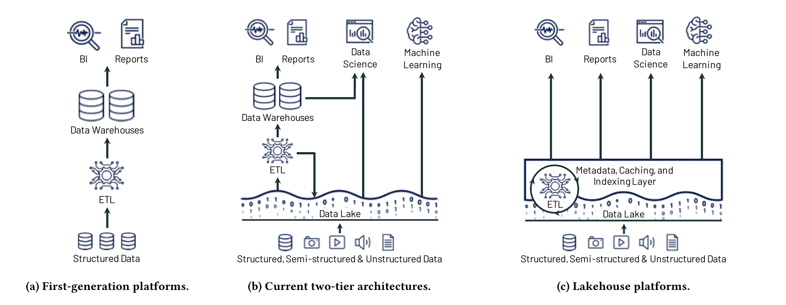
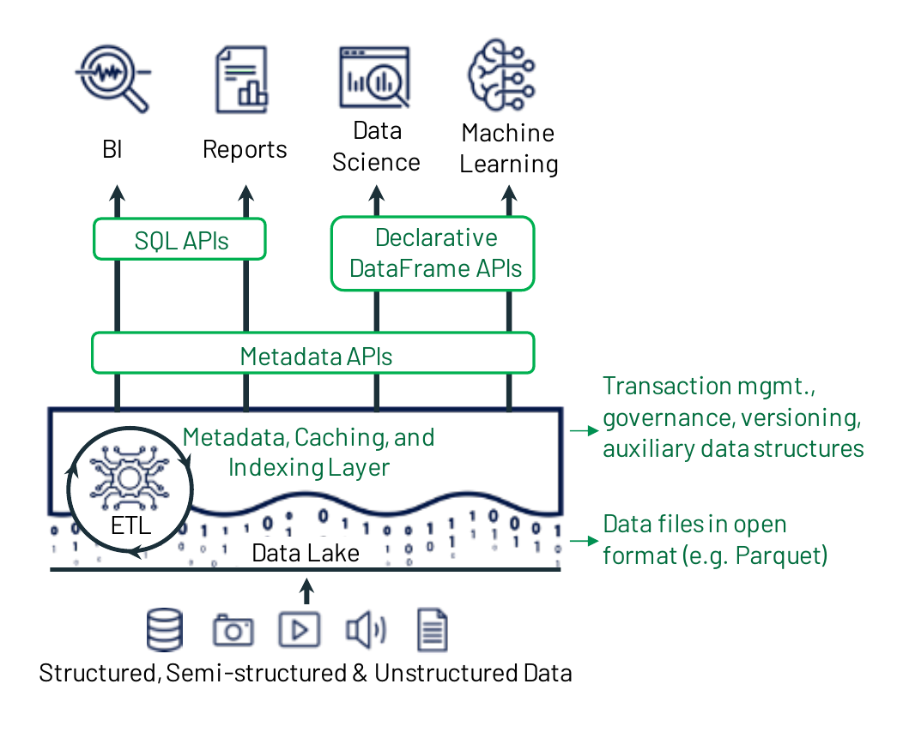
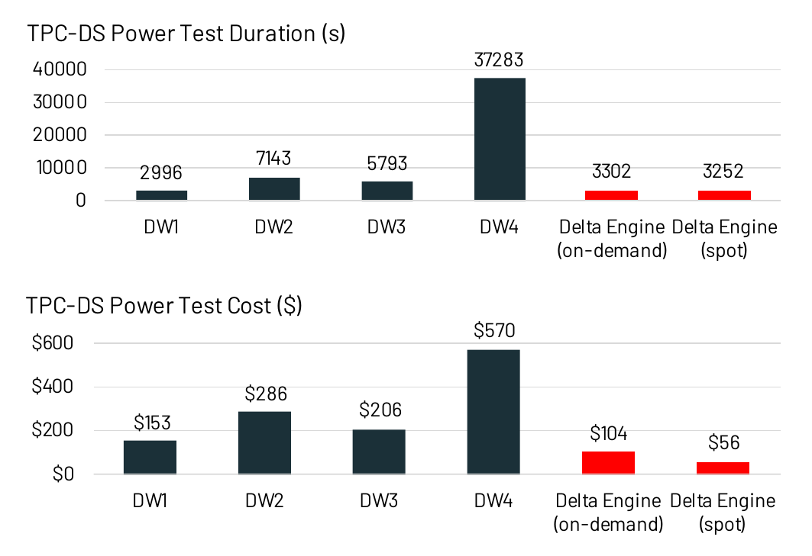
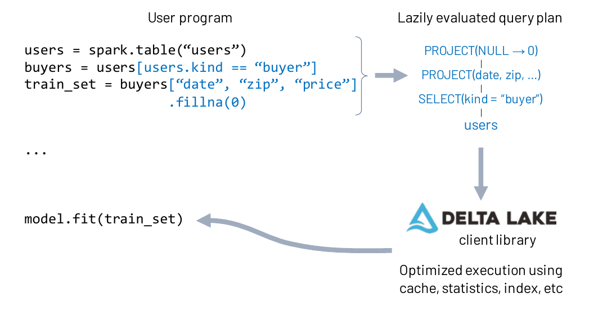

# Lakehouse: A New Generation of Open Platforms that Unify Data Warehousing and Advanced Analytics（中文译文）

## 译者说明

本文依据同目录的 `source.pdf` 翻译。章节、图表、公式、算法、代码与参考文献按原文结构保留。

作者：Michael Armbrust、Ali Ghodsi、Reynold Xin、Matei Zaharia

机构：Databricks、加州大学伯克利分校、斯坦福大学

会议：第 11 届创新数据系统研究会议（CIDR '21），2021 年 1 月 11-15 日，线上

> 本文依据知识共享署名许可协议（Creative Commons Attribution License，<http://creativecommons.org/licenses/by/3.0/>）发表。

## 摘要

本文认为，我们今天所熟知的数据仓库架构将在未来几年逐渐式微，并被一种新的架构模式 Lakehouse（湖仓一体）所取代。Lakehouse 将具备三项特征：（i）以 Apache Parquet 等开放、可直接访问的数据格式为基础；（ii）为机器学习和数据科学提供一等支持；（iii）提供最先进的性能。Lakehouse 有助于解决数据仓库面临的若干重大挑战，包括数据陈旧、可靠性、总体拥有成本、数据锁定以及支持的用例有限。我们讨论了业界如何已经开始向 Lakehouse 迁移，以及这一转变可能如何影响数据管理领域的工作。我们还报告了一个使用 Parquet 的 Lakehouse 系统的结果：在 TPC-DS 上，它的表现可与流行的云数据仓库竞争。

## 1 引言

本文认为，我们今天所熟知的数据仓库架构将在未来几年走向衰落，并被一种新的架构模式取代；我们把它称为 Lakehouse。其特点是：（i）采用 Apache Parquet 和 ORC 等开放、可直接访问的数据格式；（ii）为机器学习和数据科学工作负载提供一等支持；（iii）具备最先进的性能。

数据仓库的历史始于帮助企业领导者获取分析洞察：把来自运营数据库的数据汇集到集中式仓库中，再用这些仓库支持决策和商业智能（BI）。这些仓库中的数据采用写时模式（schema-on-write），从而确保数据模型针对下游 BI 消费进行了优化。我们把这类系统称为第一代数据分析平台。

大约十年前，第一代系统开始面临若干挑战。第一，它们通常把计算和存储耦合在一台本地部署的一体机中。这迫使企业按照用户负载和受管数据量的峰值来配置资源并付费；随着数据集增长，成本变得非常高。第二，数据集不仅增长迅速，而且越来越多的数据集完全是非结构化的，例如视频、音频和文本文档，而数据仓库根本无法存储和查询这些数据。

为解决这些问题，第二代数据分析平台开始把全部原始数据卸载到数据湖中。数据湖是一类低成本、提供文件 API 的存储系统，以通用且通常开放的文件格式保存数据，例如 Apache Parquet 和 ORC [8, 9]。这种方法始于 Apache Hadoop 运动 [5]，它使用 Hadoop 文件系统（HDFS）提供低成本存储。数据湖采用读时模式（schema-on-read），能够以低成本灵活存放任意数据，但另一方面又把数据质量和下游治理的问题留待以后处理。在这种架构中，湖中的少量数据随后会通过 ETL 送入下游数据仓库（例如 Teradata），以支撑最重要的决策支持和 BI 应用。开放格式还让各类其他分析引擎能够直接访问数据湖中的数据，例如机器学习系统 [30, 37, 42]。

从 2015 年起，S3、ADLS 和 GCS 等云数据湖开始取代 HDFS。它们具有更好的持久性（通常超过 10 个 9）、地理复制能力，以及最重要的极低成本；它们还可以自动转入更便宜的归档存储，例如 AWS Glacier。云上的其余架构大体与第二代系统相同，下游仍是 Redshift 或 Snowflake 等数据仓库。根据我们的经验，这种“数据湖 + 数据仓库”的双层数据架构如今已成为业界主流，几乎所有《财富》500 强企业都在使用。

这也引出了当前数据架构的问题。云数据湖和数据仓库架构通过分离存储（如 S3）与计算（如 Redshift），表面看来成本低廉，但双层架构对用户而言非常复杂。在第一代平台中，所有数据都从运营数据系统通过 ETL 直接进入仓库。在今天的架构中，数据先经 ETL 进入数据湖，再经 ELT 进入数据仓库，因而增加了复杂性、延迟和新的故障模式。此外，企业用例如今已包括机器学习等高级分析，而数据湖与数据仓库都不能理想地支持这类用例。具体来说，当今的数据架构普遍存在以下四类问题。

**可靠性。** 保持数据湖与数据仓库一致既困难又昂贵。要在两个系统之间持续执行 ETL，并让数据可供高性能决策支持和 BI 使用，就需要持续投入工程资源。每一个 ETL 步骤还可能失败或引入降低数据质量的缺陷，例如数据湖引擎和数据仓库引擎之间细微的语义差异所致的缺陷。

**数据陈旧。** 数据仓库中的数据比数据湖中的数据更陈旧，新数据往往需要数天才能完成加载。这相较第一代分析系统是一种倒退；在第一代系统中，新的运营数据会立即可供查询。根据 Dimensional Research 和 Fivetran 的一项调查，86% 的分析师使用过时数据，62% 的分析师称自己每月多次需要等待工程资源 [47]。

**对高级分析的支持有限。** 企业希望利用仓库数据提出预测性问题，例如“我应该向哪些客户提供折扣？”尽管机器学习与数据管理的融合已得到大量研究，TensorFlow、PyTorch 和 XGBoost 等领先的机器学习系统都不能很好地运行在数据仓库之上。BI 查询只提取少量数据，而这些系统需要用复杂的非 SQL 代码处理大型数据集。通过 ODBC/JDBC 读取这些数据效率低下，而且无法直接访问仓库的专有内部格式。对于这类用例，数据仓库厂商建议把数据导出为文件，这进一步增加了复杂性和数据陈旧程度（又增加了第三次 ETL！）。另一种做法是让这些系统直接处理数据湖中采用开放格式的数据，但用户随之失去数据仓库提供的丰富管理能力，例如 ACID 事务、数据版本控制和索引。

**总体拥有成本。** 除了持续执行 ETL 的成本之外，用户还要为复制到数据仓库的数据支付双份存储费用；商业数据仓库又把数据锁定在专有格式中，提高了把数据或工作负载迁移到其他系统的成本。

一种采纳程度有限的稻草人方案，是彻底取消数据湖，把全部数据存入一个内置计算存储分离能力的数据仓库。我们将论证，这种做法的可行性有限，采纳率不高也印证了这一点，因为它仍然不能轻松管理视频、音频和文本数据，也不能让机器学习和数据科学工作负载快速直接访问数据。

**图 1：** 数据平台架构从第一代平台（a）演进到当前的双层模型（b），以及新的 Lakehouse 模型（c）。

本文讨论如下技术问题：能否把基于 Parquet、ORC 等标准开放数据格式的数据湖，转变为一种高性能系统，既提供数据仓库的性能和管理能力，又让高级分析工作负载快速、直接地执行 I/O？我们认为，这类系统设计，即 Lakehouse（图 1），不仅可行，而且已在业界以多种形式显现成功迹象。随着越来越多的业务应用开始依赖运营数据和高级分析，我们认为 Lakehouse 是一种极具吸引力的设计点，能够消除数据仓库面临的一些主要挑战。

具体而言，我们认为 Lakehouse 的时代已经到来，因为近期的解决方案开始处理以下关键问题。

**1. 数据湖上的可靠数据管理。** Lakehouse 既要像今天的数据湖一样存储原始数据，又要同时支持通过 ETL/ELT 整理数据、提高数据分析质量的过程。传统上，数据湖以半结构化格式把数据当作“一堆文件”来管理，因此很难提供数据仓库中那些能够简化 ETL/ELT 的关键管理能力，例如事务、回滚到旧表版本以及零复制克隆。然而，Delta Lake [10] 和 Apache Iceberg [7] 等新近出现的系统家族在数据湖之上提供了事务性视图，并支持这些管理能力。当然，使用 Lakehouse 时，组织仍须完成编写 ETL/ELT 逻辑以创建精选数据集的艰苦工作，但总体上的 ETL 步骤更少；如有需要，分析人员还可以像在第一代分析平台中一样，轻松且高效地查询原始数据表。

**2. 支持机器学习和数据科学。** 机器学习系统已经支持直接读取数据湖格式，因此处于能够高效访问 Lakehouse 的有利位置。此外，许多机器学习系统已经采用 DataFrame 作为数据操作抽象；近期系统还设计了声明式 DataFrame API [11]，使机器学习工作负载的数据访问能够接受查询优化。这些 API 让机器学习工作负载可以直接受益于 Lakehouse 中的许多优化。

**3. SQL 性能。** Lakehouse 需要在过去十年积累的海量 Parquet/ORC 数据集之上提供最先进的 SQL 性能；从长期看，也可以使用某种其他的标准格式，只要它向应用开放直接访问。相比之下，经典数据仓库接收 SQL，并可自由优化底层的一切，包括专有存储格式。尽管如此，我们将展示：可以使用多种技术维护 Parquet/ORC 数据集的辅助数据，并在这些现有格式内部优化数据布局，从而获得有竞争力的性能。我们给出了一个运行在 Parquet 上的 SQL 引擎 Databricks Delta Engine [19] 的结果；它在 TPC-DS 上胜过领先的云数据仓库。

本文余下部分将详细说明 Lakehouse 平台的动机、可能的技术设计及其研究意义。

## 2 动机：数据仓库的挑战

数据仓库对许多业务流程至关重要，但错误数据、数据陈旧和高成本仍经常令用户困扰。我们认为，其中每一项挑战至少有一部分属于企业数据平台设计方式造成的“偶然复杂性” [18]，而 Lakehouse 可以消除这些复杂性。

首先，今天企业数据用户最常报告的首要问题通常是数据质量与可靠性 [47, 48]。实现正确的数据流水线本身就很困难，而今天这种数据湖和数据仓库彼此分离的双层数据架构又增加了额外复杂性，使问题进一步恶化。例如，数据湖和数据仓库系统支持的数据类型、SQL 方言等可能具有不同语义；数据在湖和仓库中可能采用不同模式（例如在其中一处进行了反规范化）；横跨多个系统的 ETL/ELT 作业数量增加，也会提高故障和缺陷发生的概率。

其次，越来越多的业务应用需要最新数据，但今天的架构先在仓库之外为传入数据设置独立暂存区，再通过周期性 ETL/ELT 作业加载数据，因此加剧了数据陈旧。理论上，组织可以构建更多流式流水线来更快更新数据仓库，但这些流水线仍比批处理作业更难运维。相比之下，在第一代平台中，仓库用户可以在存放派生数据集的同一环境中，立即访问从运营系统加载的原始数据。客户支持系统、推荐引擎等业务应用在数据陈旧时根本无法有效工作；即使是查询数据仓库的人类分析师，也把数据陈旧列为主要问题 [47]。

第三，在许多行业中，随着组织收集图像、传感器数据、文档等内容，大部分数据如今已是非结构化数据 [22]。组织需要易用的系统来管理这些数据，但 SQL 数据仓库及其 API 并不容易支持它们。

最后，大多数组织如今都在部署机器学习和数据科学应用，但数据仓库和数据湖都不能很好地服务这些应用。如前所述，这些应用需要用非 SQL 代码处理大量数据，因此无法通过 ODBC/JDBC 高效运行。随着高级分析系统继续发展，我们认为，以开放格式直接向它们提供数据访问，是支持这些系统最有效的方式。此外，机器学习和数据科学应用也面临传统应用的数据管理问题，例如数据质量、一致性和隔离性 [17, 27, 31]；因此，把 DBMS 能力带给它们具有巨大价值。

**走向 Lakehouse 的现有步骤。** 当前业界的几种趋势进一步表明，客户对“数据湖 + 数据仓库”的双层模型并不满意。第一，近年来几乎所有主要数据仓库都增加了对 Parquet 和 ORC 格式外部表的支持 [12, 14, 43, 46]。这让数据仓库用户能够用同一个 SQL 引擎查询数据湖，但既没有让数据湖中的表更易管理，也没有消除仓库数据在 ETL 复杂性、数据陈旧和高级分析方面的问题。在实践中，这些连接器的性能往往也不理想，因为 SQL 引擎主要针对自身内部数据格式进行优化。第二，业界还广泛投入于直接针对数据湖存储运行的 SQL 引擎，例如 Spark SQL、Presto、Hive 和 AWS Athena [3, 11, 45, 50]。然而，单靠这些引擎无法解决数据湖的全部问题，也无法取代数据仓库：数据湖仍然缺少 ACID 事务等基本管理能力，以及索引等足以匹配数据仓库性能的高效访问方法。

## 3 Lakehouse 架构

我们把 Lakehouse 定义为一种建立在低成本、可直接访问的存储之上的数据管理系统，同时提供传统分析型 DBMS 的管理与性能能力，例如 ACID 事务、数据版本控制、审计、索引、缓存和查询优化。因此，Lakehouse 结合了数据湖与数据仓库的关键优势：前者以开放格式提供低成本存储，各类系统都能访问；后者则提供强大的管理和优化能力。关键问题是，能否有效结合这些优势。尤其是，Lakehouse 为支持直接访问而放弃了部分数据独立性，而数据独立性一直是关系型 DBMS 设计的基石。

我们注意到，Lakehouse 特别适合计算与存储分离的云环境：不同计算应用可以在完全独立的计算节点上按需运行，例如用于机器学习的 GPU 集群，同时又直接访问同一份存储数据。不过，也可以在 HDFS 等本地存储系统之上实现 Lakehouse。

本节基于三项近期以不同形式出现在业界的技术思想，勾勒一种可能的 Lakehouse 系统设计。在 Databricks，我们一直通过 Delta Lake、Delta Engine 和 Databricks ML Runtime 项目 [10, 19, 38] 构建采用这种设计的 Lakehouse 平台。不过，其他设计也可能可行，而且我们的高层设计中也可以采用其他具体技术选择。例如，Databricks 当前的技术栈建立在 Parquet 存储格式之上，但也可以设计一种更好的格式。我们还将讨论若干替代方案和未来研究方向。

### 3.1 实现 Lakehouse 系统

我们提出的第一个关键思想是：系统使用 Apache Parquet 等标准文件格式，把数据存放在低成本对象存储（例如 Amazon S3）中；同时在对象存储之上实现一个事务性元数据层，由它定义哪些对象属于某个表版本。这样，系统可以在元数据层中实现 ACID 事务、版本控制等管理能力，同时把绝大部分数据保留在低成本对象存储中，并允许客户端在大多数情况下通过标准文件格式直接读取该存储中的对象。包括 Delta Lake [10] 和 Apache Iceberg [7] 在内的若干新系统已经用这种方式成功为数据湖增加了管理能力。例如，Delta Lake 如今已用于 Databricks 约一半的工作负载，覆盖数千名客户。

元数据层虽然增加了管理能力，但还不足以实现良好的 SQL 性能。数据仓库会使用多种技术获得最先进的性能，例如把热数据存放在 SSD 等快速设备上、维护统计信息、构建索引等高效访问方法，并协同优化数据格式和计算引擎。在基于现有存储格式的 Lakehouse 中，无法改变格式；但我们将说明，可以在不改动数据文件的前提下实现其他优化，包括缓存、索引和统计信息等辅助数据结构，以及数据布局优化。

最后，声明式 DataFrame API 的发展 [11, 37] 让 Lakehouse 既能加速高级分析工作负载，也能为它们提供更好的数据管理能力。TensorFlow 和 Spark MLlib 等许多机器学习库已经可以读取 Parquet 等数据湖文件格式 [30, 37, 42]。因此，把它们与 Lakehouse 集成的最简单方法，是查询元数据层以确定当前哪些 Parquet 文件属于某个表，再把这些文件直接交给机器学习库。不过，这些系统大多支持用于数据准备的 DataFrame API，因此还创造了更多优化机会。DataFrame 因 R 和 Pandas [40] 而普及，它只是向用户提供一种包含多种转换算子的表抽象，其中大多数算子都可以映射到关系代数。Spark SQL 等系统通过延迟执行这些转换，并把所得算子计划交给优化器，使该 API 变为声明式 [11]。因此，这些 API 可以利用 Lakehouse 中的缓存和辅助数据等新优化能力，进一步加速机器学习。

**图 2：** Lakehouse 系统设计示例，关键组件以绿色显示。系统以 Delta Lake 之类的元数据层为中心：该层在开放格式文件之上增加事务、版本控制和辅助数据结构，并可由不同的 API 和引擎查询。

图 2 展示了这些思想如何组合成一个 Lakehouse 系统设计。接下来三节将更详细地阐述这些技术思想，并讨论相关研究问题。

### 3.2 用于数据管理的元数据层

我们认为，实现 Lakehouse 的第一个组件，是位于数据湖存储之上的元数据层。它可以提升数据湖的抽象层级，实现 ACID 事务和其他管理能力。S3 或 HDFS 等数据湖存储系统只提供低层对象存储或文件系统接口，甚至连更新一个跨多个文件的表这样的简单操作都不是原子的。组织很快开始在这些系统之上设计更丰富的数据管理层。较早的例子是 Apache Hive ACID [33]：它使用 OLTP DBMS 跟踪某个表版本中哪些数据文件属于 Hive 表，并允许以事务方式更新这个文件集合。近年来，新系统提供了更多能力并提高了可扩展性。

2016 年，Databricks 开始开发 Delta Lake [10]。它把“哪些对象属于某个表”的信息作为 Parquet 格式的事务日志，存储在数据湖本身，从而能够扩展到每张表数十亿个对象。始于 Netflix 的 Apache Iceberg [7] 采用类似设计，同时支持 Parquet 和 ORC 存储。始于 Uber 的 Apache Hudi [6] 是该领域的另一套系统，重点是简化数据湖的流式摄取，但不支持并发写入者。

使用这些系统的经验表明，它们通常可以提供与原始 Parquet/ORC 数据湖相当或更好的性能，同时增加事务、零复制克隆和回溯到表的历史版本等非常有用的管理能力 [10]。此外，对于已经拥有数据湖的组织，它们很容易采用。例如，Delta Lake 只需添加一份事务日志，并让日志的首条记录引用所有现有文件，就能以零复制方式把一个现有 Parquet 文件目录转换成 Delta Lake 表。因此，组织正在迅速采用这些元数据层；例如，Delta Lake 在三年内增长到覆盖 Databricks 一半的计算小时数。

此外，元数据层是实现数据质量强制机制的自然位置。例如，Delta Lake 实现了模式强制，确保上传到表的数据符合其模式；它还提供约束 API [24]，让表所有者能够为摄取的数据设置约束，例如“国家只能是给定列表中的一个值”。Delta 的客户端库会自动拒绝违反这些预期的记录，或把它们隔离到专门位置。客户发现，这些简单能力对提高基于数据湖的流水线质量非常有用。

最后，元数据层也是实现访问控制和审计日志等治理能力的自然位置。例如，元数据层可以在向客户端授予凭据、允许其从云对象存储读取表中原始数据之前，检查该客户端是否有权访问该表；同时还可以可靠地记录所有访问。

**未来方向与替代设计。** 数据湖元数据层是一项相当新的发展，因此存在许多开放问题和替代设计。例如，我们把 Delta Lake 设计成在它所运行的同一个对象存储（如 S3）中存放事务日志，以简化管理（无需运行独立存储系统），并让日志获得高可用性和高读取带宽，与对象存储相同。不过，由于对象存储具有较高延迟，这种设计限制了系统每秒可支持的事务速率。在某些情况下，让元数据使用速度更快的存储系统可能更合适。同样，Delta Lake、Iceberg 和 Hudi 每次只支持单表事务，但应该能够扩展它们以支持跨表事务。如何优化事务日志格式以及所管理对象的大小，也是开放问题。

### 3.3 Lakehouse 中的 SQL 性能

Lakehouse 方法面临的最大技术问题或许是：在放弃传统 DBMS 设计中相当大一部分数据独立性的同时，如何提供最先进的 SQL 性能。答案显然取决于多种因素，例如可用的硬件资源（我们是否能在对象存储之上实现缓存层），以及能否改变数据对象的存储格式，而不局限于 Parquet 和 ORC 等现有标准；优于这些格式的新设计仍在不断出现 [15, 28]。不过，无论具体设计如何，核心挑战都在于：为允许快速直接访问，数据存储格式会成为系统公共 API 的一部分，这一点与传统 DBMS 不同。

我们提出了几种实现 Lakehouse SQL 性能优化的技术。这些技术独立于所选数据格式，因此既可以应用于现有格式，也可以应用于未来格式。我们还在 Databricks Delta Engine [19] 中实现了这些技术，并表明它们可以获得与流行云数据仓库相竞争的性能，尽管性能仍有很大的进一步优化空间。这些与格式无关的优化包括：

**缓存。** 使用 Delta Lake 这样的事务性元数据层时，Lakehouse 系统可以安全地把云对象存储中的文件缓存在处理节点的 SSD、RAM 等更快存储设备上。正在运行的事务可以轻松判断缓存文件是否仍然有效、可供读取。此外，缓存可以采用一种对查询引擎运行更高效的转码格式，从而使用与传统“封闭世界”数据仓库引擎相同的优化。例如，Databricks 的缓存会对加载的 Parquet 数据进行部分解压缩。

**辅助数据。** Lakehouse 必须开放基表存储格式以供直接 I/O，但它仍可以在自己完全控制的辅助文件中维护其他有助于查询优化的数据。在 Delta Lake 和 Delta Engine 中，我们在用于存放事务日志的同一个 Parquet 文件中，维护表内每个数据文件的列最小值-最大值统计信息。当基础数据按特定列聚簇时，这些信息支持数据跳过优化。我们还在实现基于布隆过滤器的索引。也可以设想在这里实现各种辅助数据结构，类似于针对“原始”数据建立索引的方案 [1, 2, 34]。

**数据布局。** 数据布局对访问性能影响很大。即使固定使用 Parquet 这样的存储格式，Lakehouse 系统仍可以优化多种布局决策。最明显的是记录排序：哪些记录聚集在一起，因而最容易一起读取。在 Delta Lake 中，我们支持按单个维度或采用 Z-order [39]、Hilbert 曲线等空间填充曲线对记录排序，以在多个维度上提供局部性。还可以设想一种新格式：在每个数据文件中以不同顺序放置各列；针对不同记录组选择不同的压缩策略；或者采用其他策略 [28]。

对于分析系统的典型访问模式，这三种优化结合使用时尤其有效。在典型工作负载中，大多数查询往往集中于一个“热”数据子集。Lakehouse 可以使用与封闭世界数据仓库相同的优化数据结构缓存这一子集，从而提供有竞争力的性能。对于云对象存储中的“冷”数据，性能的主要决定因素很可能是每次查询读取的数据量。在这种情况下，数据布局优化（把共同访问的数据聚集起来）与区间映射（zone map）等辅助数据结构（让引擎迅速确定需要读取数据文件中的哪些范围）相结合，可以让 Lakehouse 系统像封闭世界的专有数据仓库一样最小化 I/O，即使它处理的是标准开放文件格式。

**图 3：** 在比例因子 30K 下，Delta Engine 与运行在 AWS、Azure 和 Google Cloud 上的流行云数据仓库的 TPC-DS 功率得分（运行全部查询所需时间）和成本。

**性能结果。** 在 Databricks，我们把上述三种 Lakehouse 优化与一个面向 Apache Spark 的新 C++ 执行引擎 Delta Engine [19] 结合。为了评估 Lakehouse 架构的可行性，图 3 在 TPC-DS 比例因子 30,000 下，将 Delta Engine 与四种广泛使用的云数据仓库进行比较；这些仓库既包括云提供商的产品，也包括运行在公有云上的第三方产品。实验在 AWS、Azure 和 Google Cloud 上使用可比的集群，每个集群有 960 个 vCPU 和本地 SSD 存储。[^1] 我们报告了运行全部 99 条查询所需的时间，也按各服务的定价模型报告了客户的总成本。Databricks 允许用户选择竞价实例和按需实例，因此两者都给出。Delta Engine 以更低的价格提供了与这些系统相当或更好的性能。

[^1]: 在适用时，我们让所有系统都从已缓存在 SSD 上的数据开始，因为参与比较的一些数据仓库只支持节点挂载存储。不过，Delta Engine 从冷缓存开始时也只慢 18%。

**未来方向与替代设计。** 如何设计既高性能又可直接访问的 Lakehouse 系统，是一个内容丰富的未来研究领域。我们尚未探索的一个明确方向，是设计更适合这一用例的新数据湖存储格式，例如，让 Lakehouse 系统能够更灵活地实现数据布局优化或索引，或只是更适合现代硬件的格式。当然，处理引擎采纳这类新格式可能需要一段时间，从而限制能够读取它们的客户端数量；但为下一代工作负载设计高质量、可直接访问的开放格式，是一个重要的研究问题。

即使不改变数据格式，也有多种缓存策略、辅助数据结构和数据布局策略值得在 Lakehouse 中探索 [4, 49, 53]。对于云对象存储中的海量数据集，哪些方法最有效，仍是开放问题。

最后，另一个令人振奋的研究方向，是确定何时以及如何使用无服务器计算系统回答查询 [41]，并优化存储、元数据层和查询引擎设计，使这种场景下的延迟最小化。

### 3.4 高级分析的高效访问

如前文所述，高级分析库通常使用无法作为 SQL 运行的命令式代码编写，但又需要访问大量数据。如何设计这些库中的数据访问层，使上层运行的代码获得最大灵活性，同时仍能受益于 Lakehouse 中的优化机会，是一个有趣的研究问题。

我们成功采用的一种方法，是为这些库使用的 DataFrame API 提供声明式版本，把数据准备计算映射成 Spark SQL 查询计划，使其可以受益于 Delta Lake 和 Delta Engine 的优化。我们在 Spark DataFrame [11] 和 Koalas [35] 中都采用了这种方法；Koalas 是一个面向 Spark、与 Pandas 具有更好兼容性的新 DataFrame API。DataFrame 是向 Apache Spark 高级分析库生态传递输入时使用的主要数据类型，这些库包括 MLlib [37]、GraphFrames [21]、SparkR [51] 以及许多社区库。因此，只要我们能够优化 DataFrame 计算，所有这些工作负载都能享受加速后的 I/O。Spark 查询规划器会把用户 DataFrame 计算中的选择和投影，直接下推到各数据源读取所用的“数据源”插件类。因此，在 Delta Lake 数据源的实现中，我们利用第 3.3 节所述的缓存、数据跳过和数据布局优化，加速从 Delta Lake 读取数据，进而加速机器学习和数据科学工作负载，如图 4 所示。

**图 4：** Spark MLlib 所用声明式 DataFrame API 的执行过程。用户代码中的 DataFrame 操作被延迟执行，使 Spark 引擎能够捕获数据加载计算的查询计划，并把它交给 Delta Lake 客户端库。该库查询元数据层，以确定要读取哪些分区、是否使用缓存等。

不过，机器学习 API 正在快速演进，而且还有其他数据访问 API，例如 TensorFlow 的 `tf.data`；它们不会尝试把查询语义下推到下层存储系统。许多这类 API 还专注于让 CPU 上的数据加载与 CPU 到 GPU 的传输和 GPU 计算重叠，而数据仓库领域对此关注不多。近期系统研究表明，让现代加速器保持充分利用可能很困难，机器学习推理场景尤其如此 [44]；因此，Lakehouse 访问库需要应对这一挑战。

**未来方向与替代设计。** 除了刚刚讨论的现有 API 与效率问题之外，还可以探索完全不同的机器学习数据访问接口设计。例如，近期工作提出了“因子分解机器学习”框架，把机器学习逻辑下推到 SQL 连接中；也提出了其他可应用于用 SQL 实现的机器学习算法的查询优化 [36]。最后，我们仍需要标准接口，让数据科学家充分利用 Lakehouse（甚至数据仓库）强大的数据管理能力。例如，在 Databricks，我们把 Delta Lake 与 MLflow [52] 的机器学习实验跟踪服务集成，使数据科学家能够轻松跟踪实验所用的表版本，并在以后复现该版本的数据。业界还出现了特征存储（feature store）这一抽象，把它作为存储和更新机器学习应用所用特征的数据管理层 [26, 27, 31]；这种抽象将受益于 Lakehouse 设计中的事务和数据版本控制等标准 DBMS 功能。

## 4 研究问题及其意义

除了第 3.2-3.4 节作为未来方向提出的研究挑战，Lakehouse 还带来了若干其他研究问题。此外，业界向功能日益丰富的数据湖发展的趋势，也会影响数据系统研究的其他领域。

**是否还有其他方法可以实现 Lakehouse 的目标？** 可以设想用其他方式实现 Lakehouse 的主要目标，例如为数据仓库构建一个大规模并行服务层，支持高级分析工作负载并行读取。然而，我们认为，与让工作负载直接访问对象存储相比，这类基础设施的运行成本会高得多，管理更困难，而且性能可能更差。我们尚未看到 Hive LLAP [32] 这类为数据湖增加此种服务层的系统得到广泛部署。此外，这种方法把选择高效读取数据格式的问题推给了服务层，而这种格式仍必须能够轻松地从数据仓库的内部格式转码而来。云对象存储的主要吸引力在于成本低、弹性工作负载可以高带宽访问，以及可用性极高；如果在对象存储前面另加一个服务层，这三项优势都会削弱。

除这些替代方案的性能、可用性、成本和锁定问题外，企业偏好以开放格式保存数据还有重要的治理原因。随着数据管理监管要求不断增加，组织可能需要搜索旧数据集、删除各类数据，或在很短时间内改变数据处理基础设施；标准化采用开放格式，意味着它们始终可以直接访问数据，而不必受制于厂商。软件行业的长期趋势一直朝向开放数据格式发展，我们认为企业数据也会延续这一趋势。

**什么才是合适的存储格式和访问 API？** Lakehouse 的访问接口包括原始存储格式、直接读取该格式的客户端库（例如把数据读入 TensorFlow 时使用的库），以及高层 SQL 接口。可以用多种方式在这些层次之间分配丰富功能，例如让读取器执行更复杂、可“编程”的解码逻辑，以使存储方案能为系统提供更大灵活性 [28]。哪一种存储格式、元数据层设计和访问 API 的组合效果最好，仍有待观察。

**Lakehouse 会如何影响其他数据管理研究与趋势？** 数据湖的普及，以及位于其上的丰富管理接口（无论是元数据层还是完整的 Lakehouse 设计）越来越广泛的使用，将影响数据管理研究的多个其他领域。

多存储系统（polystore）旨在解决跨不同存储引擎查询数据这一难题 [25]。这个问题在企业中仍会存在，但云数据湖中以开放格式提供的数据比例不断上升，意味着许多多存储查询可以直接针对云对象存储回答，即使底层数据文件在逻辑上属于不同的 Lakehouse 部署。

数据集成和清洗工具也可以设计成就地运行在 Lakehouse 上，快速并行访问全部数据。这可能催生新的算法，例如在组织的众多数据集上执行大型连接和聚类算法。

也许可以在 Lakehouse 前方构建作为“外挂”层的 HTAP 系统，使用 Lakehouse 的事务管理 API，把数据直接归档到 Lakehouse 系统中。Lakehouse 将能够查询这些数据的一致性快照。

如果在 Lakehouse 上实现面向机器学习的数据管理，它也可能变得更简单、更强大。今天，组织正在构建各种机器学习专用的数据版本控制系统和“特征存储”系统 [26, 27, 31]，重复实现标准 DBMS 功能。直接使用一种内置 DBMS 管理功能的数据湖抽象来实现特征存储功能，或许会更简单。同时，因子分解机器学习 [36] 等声明式机器学习系统很可能可以很好地运行在 Lakehouse 上。

无服务器引擎 [41] 等云原生 DBMS 设计，需要与 Delta Lake 这类更丰富的元数据管理层集成，而不能只扫描数据湖中的原始文件；这样做也可能提高性能。

最后，业界一直在讨论如何组织数据工程流程和团队。与传统“中央数据团队”方法相比，“数据网格” [23] 等概念日益流行；在数据网格中，不同团队端到端拥有不同的数据产品。Lakehouse 设计天然适合分布式协作结构，因为所有数据集都可以从对象存储直接访问，无需让用户接入相同的计算资源。无论哪些团队生产和消费数据，都可以直接共享。

## 5 相关工作

Lakehouse 方法建立在大量面向云的数据管理系统研究成果之上，包括早期把 S3 用作 DBMS 块存储的工作 [16]，以及在云对象存储上“外挂”一致性的工作 [13]。它还大量借鉴了通过围绕固定数据格式构建辅助数据结构来加速查询处理的研究 [1, 2, 34, 53]。

与之最相关的系统，是采用存储分离架构的“云原生”数据仓库 [20, 29] 和 Apache Hive [50] 等数据湖系统。Snowflake 和 BigQuery [20, 29] 等云原生数据仓库在商业上取得了巨大成功，但它们仍不是大多数大型组织的主要数据存储：绝大多数数据仍在数据湖中，后者可以轻松存储高吞吐企业数据所包含的时间序列、文本、图像、音频和半结构化格式。因此，云数据仓库系统都增加了读取数据湖格式外部表的支持 [12, 14, 43, 46]。然而，这些系统无法像管理内部数据一样，为数据湖中的数据提供管理能力（例如在其上实现 ACID 事务），所以把它们与数据湖结合使用仍然困难且容易出错。数据仓库也不适合大规模机器学习和数据科学工作负载，因为与直接访问对象存储相比，从数据仓库流式导出数据的效率很低。

另一方面，早期数据湖系统为了简化实现，有意削减了关系型 DBMS 的功能集；但所有这些系统的发展趋势，都是增加 ACID 支持 [33]，以及日益丰富的管理与性能能力 [6, 7, 10]。本文沿着这一趋势继续推演，讨论哪些技术设计可能让 Lakehouse 系统完全取代数据仓库；展示一个针对 Lakehouse 优化的新查询引擎的定量结果；并勾勒该领域若干重要研究问题和设计替代方案。

## 6 结论

我们论证了这样一种统一数据平台架构：它在开放的数据湖文件格式之上实现数据仓库功能，能够提供与今天的数据仓库系统相竞争的性能，并帮助解决数据仓库用户面临的许多挑战。乍看之下，把数据仓库的存储层限制为采用标准格式、开放且可直接访问的文件，似乎是一项重大限制；但热数据缓存、冷数据布局优化等方法，可以让 Lakehouse 系统获得有竞争力的性能。鉴于数据湖中已经积累了海量数据，而且 Lakehouse 有机会大幅简化企业数据架构，我们认为业界很可能会逐步汇聚到 Lakehouse 设计。

## 致谢

感谢 Databricks 的 Delta Engine、Delta Lake 和 Benchmarking 团队对本文所述结果作出的贡献。Awez Syed、Alex Behm、Greg Rahn、Mostafa Mokhtar、Peter Boncz、Bharath Gowda、Joel Minnick 和 Bart Samwel 对本文观点提出了宝贵意见。我们还感谢 CIDR 审稿人的反馈。

## 参考文献

[1] I. Alagiannis, R. Borovica-Gajic, M. Branco, S. Idreos, and A. Ailamaki. NoDB: Efficient query execution on raw data files. *CACM*, 58(12):112-121, Nov. 2015.

[2] I. Alagiannis, S. Idreos, and A. Ailamaki. H2O: a hands-free adaptive store. In *SIGMOD*, 2014.

[3] Amazon Athena. <https://aws.amazon.com/athena/>.

[4] G. Ananthanarayanan, A. Ghodsi, A. Warfield, D. Borthakur, S. Kandula, S. Shenker, and I. Stoica. PACMan: Coordinated memory caching for parallel jobs. In *NSDI*, pages 267-280, 2012.

[5] Apache Hadoop. <https://hadoop.apache.org>.

[6] Apache Hudi. <https://hudi.apache.org>.

[7] Apache Iceberg. <https://iceberg.apache.org>.

[8] Apache ORC. <https://orc.apache.org>.

[9] Apache Parquet. <https://parquet.apache.org>.

[10] M. Armbrust, T. Das, L. Sun, B. Yavuz, S. Zhu, M. Murthy, J. Torres, H. van Hovell, A. Ionescu, A. Łuszczak, M. Świtakowski, M. Szafrański, X. Li, T. Ueshin, M. Mokhtar, P. Boncz, A. Ghodsi, S. Paranjpye, P. Senster, R. Xin, and M. Zaharia. Delta Lake: High-performance ACID table storage over cloud object stores. In *VLDB*, 2020.

[11] M. Armbrust, R. S. Xin, C. Lian, Y. Huai, D. Liu, J. K. Bradley, X. Meng, T. Kaftan, M. J. Franklin, A. Ghodsi, and M. Zaharia. Spark SQL: Relational data processing in Spark. In *SIGMOD*, 2015.

[12] Azure Synapse: Create external file format. <https://docs.microsoft.com/en-us/sql/t-sql/statements/create-external-file-format-transact-sql>.

[13] P. Bailis, A. Ghodsi, J. Hellerstein, and I. Stoica. Bolt-on causal consistency. pages 761-772, 06 2013.

[14] BigQuery: Creating a table definition file for an external data source. <https://cloud.google.com/bigquery/external-table-definition>, 2020.

[15] P. Boncz, T. Neumann, and V. Leis. FSST: Fast random access string compression. In *VLDB*, 2020.

[16] M. Brantner, D. Florescu, D. Graf, D. Kossmann, and T. Kraska. Building a database on S3. In *SIGMOD*, pages 251-264, 01 2008.

[17] E. Breck, M. Zinkevich, N. Polyzotis, S. Whang, and S. Roy. Data validation for machine learning. In *SysML*, 2019.

[18] F. Brooks, Jr. No silver bullet - essence and accidents of software engineering. *IEEE Computer*, 20:10-19, April 1987.

[19] A. Conway and J. Minnick. Introducing Delta Engine. <https://databricks.com/blog/2020/06/24/introducing-delta-engine.html>.

[20] B. Dageville, J. Huang, A. Lee, A. Motivala, A. Munir, S. Pelley, P. Povinec, G. Rahn, S. Triantafyllis, P. Unterbrunner, T. Cruanes, M. Zukowski, V. Antonov, A. Avanes, J. Bock, J. Claybaugh, D. Engovatov, and M. Hentschel. The Snowflake elastic data warehouse. pages 215-226, 06 2016.

[21] A. Dave, A. Jindal, L. E. Li, R. Xin, J. Gonzalez, and M. Zaharia. GraphFrames: An integrated API for mixing graph and relational queries. In *Proceedings of the Fourth International Workshop on Graph Data Management Experiences and Systems*, GRADES '16, New York, NY, USA, 2016. Association for Computing Machinery.

[22] D. Davis. AI unleashes the power of unstructured data. <https://www.cio.com/article/3406806/>, 2019.

[23] Z. Dehghani. How to move beyond a monolithic data lake to a distributed data mesh. <https://martinfowler.com/articles/data-monolith-to-mesh.html>, 2019.

[24] Delta Lake constraints. <https://docs.databricks.com/delta/delta-constraints.html>, 2020.

[25] J. Duggan, A. J. Elmore, M. Stonebraker, M. Balazinska, B. Howe, J. Kepner, S. Madden, D. Maier, T. Mattson, and S. Zdonik. The BigDAWG polystore system. *SIGMOD Rec.*, 44(2):11-16, Aug. 2015.

[26] Data Vesion Control (DVC). <https://dvc.org>.

[27] Feast: Feature store for machine learning. <https://feast.dev>, 2020.

[28] B. Ghita, D. G. Tomé, and P. A. Boncz. White-box compression: Learning and exploiting compact table representations. In *CIDR*. <www.cidrdb.org>, 2020.

[29] Google BigQuery. <https://cloud.google.com/bigquery>.

[30] Getting data into your H2O cluster. <https://docs.h2o.ai/h2o/latest-stable/h2o-docs/getting-data-into-h2o.html>, 2020.

[31] K. Hammar and J. Dowling. Feature store: The missing data layer in ML pipelines? <https://www.logicalclocks.com/blog/feature-store-the-missing-data-layer-in-ml-pipelines>, 2018.

[32] Hive LLAP. <https://cwiki.apache.org/confluence/display/Hive/LLAP>, 2020.

[33] Hive ACID documentation. <https://docs.cloudera.com/HDPDocuments/HDP3/HDP-3.1.5/using-hiveql/content/hive_3_internals.html>.

[34] S. Idreos, I. Alagiannis, R. Johnson, and A. Ailamaki. Here are my data files. here are my queries. where are my results? In *CIDR*, 2011.

[35] koalas library. <https://github.com/databricks/koalas>, 2020.

[36] S. Li, L. Chen, and A. Kumar. Enabling and optimizing non-linear feature interactions in factorized linear algebra. In *SIGMOD*, page 1571-1588, 2019.

[37] X. Meng, J. Bradley, B. Yavuz, E. Sparks, S. Venkataraman, D. Liu, J. Freeman, D. Tsai, M. Amde, S. Owen, D. Xin, R. Xin, M. J. Franklin, R. Zadeh, M. Zaharia, and A. Talwalkar. MLlib: Machine learning in Apache Spark. *J. Mach. Learn. Res.*, 17(1):1235-1241, Jan. 2016.

[38] Databricks ML runtime. <https://databricks.com/product/machine-learning-runtime>.

[39] G. M. Morton. A computer oriented geodetic data base; and a new technique in file sequencing. IBM Technical Report, 1966.

[40] pandas Python data analysis library. <https://pandas.pydata.org>, 2017.

[41] M. Perron, R. Castro Fernandez, D. DeWitt, and S. Madden. Starling: A scalable query engine on cloud functions. In *SIGMOD*, page 131-141, 2020.

[42] Petastorm. <https://github.com/uber/petastorm>.

[43] Redshift CREATE EXTERNAL TABLE. <https://docs.aws.amazon.com/redshift/latest/dg/r_CREATE_EXTERNAL_TABLE.html>, 2020.

[44] D. Richins, D. Doshi, M. Blackmore, A. Thulaseedharan Nair, N. Pathapati, A. Patel, B. Daguman, D. Dobrijalowski, R. Illikkal, K. Long, D. Zimmerman, and V. Janapa Reddi. Missing the forest for the trees: End-to-end ai application performance in edge data centers. In *2020 IEEE International Symposium on High Performance Computer Architecture (HPCA)*, pages 515-528, 2020.

[45] R. Sethi, M. Traverso, D. Sundstrom, D. Phillips, W. Xie, Y. Sun, N. Yegitbasi, H. Jin, E. Hwang, N. Shingte, and C. Berner. Presto: SQL on everything. In *ICDE*, pages 1802-1813, April 2019.

[46] Snowflake CREATE EXTERNAL TABLE. <https://docs.snowflake.com/en/sql-reference/sql/create-external-table.html>, 2020.

[47] Fivetran data analyst survey. <https://fivetran.com/blog/analyst-survey>, 2020.

[48] M. Stonebraker. Why the 'data lake' is really a 'data swamp'. BLOG@CACM, 2014.

[49] L. Sun, M. J. Franklin, J. Wang, and E. Wu. Skipping-oriented partitioning for columnar layouts. *Proc. VLDB Endow.*, 10(4):421-432, Nov. 2016.

[50] A. Thusoo et al. Hive - a petabyte scale data warehouse using Hadoop. In *ICDE*, pages 996-1005. IEEE, 2010.

[51] S. Venkataraman, Z. Yang, D. Liu, E. Liang, H. Falaki, X. Meng, R. Xin, A. Ghodsi, M. Franklin, I. Stoica, and M. Zaharia. SparkR: Scaling R programs with Spark. In *Proceedings of the 2016 International Conference on Management of Data*, SIGMOD '16, page 1099-1104, New York, NY, USA, 2016. Association for Computing Machinery.

[52] M. Zaharia, A. Chen, A. Davidson, A. Ghodsi, S. Hong, A. Konwinski, S. Murching, T. Nykodym, P. Ogilvie, M. Parkhe, F. Xie, and C. Zumar. Accelerating the machine learning lifecycle with mlflow. *IEEE Data Eng. Bull.*, 41:39-45, 2018.

[53] M. Ziauddin, A. Witkowski, Y. J. Kim, D. Potapov, J. Lahorani, and M. Krishna. Dimensions based data clustering and zone maps. *Proc. VLDB Endow.*, 10(12):1622-1633, Aug. 2017.
