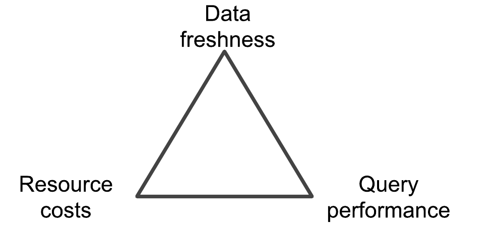
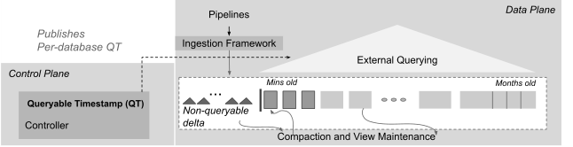
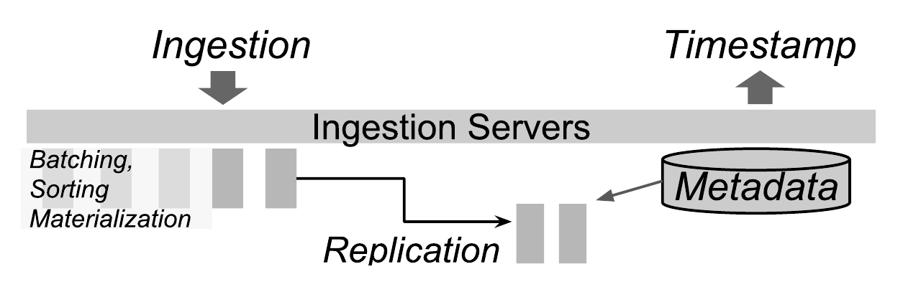
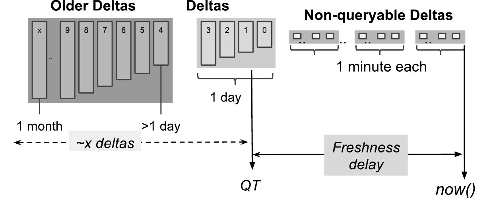
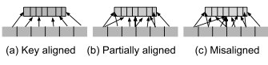
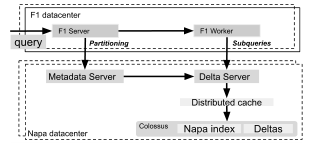
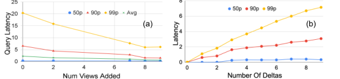
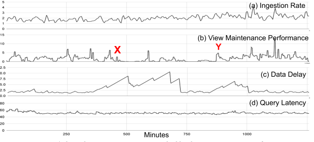
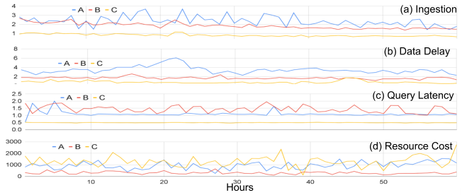

# Napa: Powering Scalable Data Warehousing with Robust Query Performance at Google（中文译文）

## 译者说明

本文依据同目录的 `source.pdf` 翻译。章节、图表、公式、算法、代码与参考文献按原文结构保留。

Ankur Agiwal, Kevin Lai, Gokul Nath Babu Manoharan, Indrajit Roy, Jagan Sankaranarayanan, Hao Zhang, Tao Zou, Min Chen, Zongchang (Jim) Chen, Ming Dai, Thanh Do, Haoyu Gao, Haoyan Geng, Raman Grover, Bo Huang, Yanlai Huang, Zhi (Adam) Li, Jianyi Liang, Tao Lin, Li Liu, Yao Liu, Xi Mao, Yalan (Maya) Meng, Prashant Mishra, Jay Patel, Rajesh S. R., Vijayshankar Raman, Sourashis Roy, Mayank Singh Shishodia, Tianhang Sun, Ye (Justin) Tang, Junichi Tatemura, Sagar Trehan, Ramkumar Vadali, Prasanna Venkatasubramanian, Gensheng Zhang, Kefei Zhang, Yupu Zhang, Zeleng Zhuang, Goetz Graefe, Divyakant Agrawal, Jeff Naughton, Sujata Kosalge, Hakan Hacıgümüş

Google Inc

napa-paper@google.com

PVLDB 引用信息：Ankur Agiwal, Kevin Lai, Gokul Nath Babu Manoharan, Indrajit Roy, Jagan Sankaranarayanan, Hao Zhang, Tao Zou, Min Chen, Zongchang (Jim) Chen, Ming Dai, Thanh Do, Haoyu Gao, Haoyan Geng, Raman Grover, Bo Huang, Yanlai Huang, Zhi (Adam) Li, Jianyi Liang, Tao Lin, Li Liu, Yao Liu, Xi Mao, Yalan (Maya) Meng, Prashant Mishra, Jay Patel, Rajesh S. R., Vijayshankar Raman, Sourashis Roy, Mayank Singh Shishodia, Tianhang Sun, Ye (Justin) Tang, Junichi Tatemura, Sagar Trehan, Ramkumar Vadali, Prasanna Venkatasubramanian, Gensheng Zhang, Kefei Zhang, Yupu Zhang, Zeleng Zhuang, Goetz Graefe, Divyakant Agrawal, Jeff Naughton, Sujata Kosalge, Hakan Hacıgümüş. Napa: Powering Scalable Data Warehousing with Robust Query Performance at Google. *PVLDB*, 14(12): 2986–2998, 2021. DOI: `10.14778/3476311.3476377`。

## 摘要

Google 服务持续产生海量应用数据。这些数据为业务用户提供有价值的洞察。我们需要在极其严苛的要求下存储并服务这些全球规模的数据集：可扩展性、亚秒级查询响应时间、可用性和强一致性；同时还要摄取来自全球应用的一条巨大更新流。为满足这些要求，我们开发并在生产环境部署了分析型数据管理系统 Napa。Napa 是 Google 内部大量客户端的后端。这些客户端强烈期望无抖动、鲁棒的查询性能。Napa 用于鲁棒查询性能的核心技术包括积极使用物化视图，并且这些视图会在跨多个数据中心摄取新数据时被一致维护。我们的客户端还要求能够灵活调整查询性能、数据新鲜度和成本，以适配各自需求。鲁棒查询处理以及客户端数据库的灵活配置，是 Napa 设计的标志。

多数相关工作利用从零设计整个系统的自由度，而无需支持多样的既有用例。相比之下，我们面临的特殊挑战是 Napa 必须处理来自现有应用和基础设施的硬约束，因此我们无法构建一个“green field”系统，而必须满足既有约束。这些约束促使我们做出特定设计决策，并设计新技术来应对挑战。本文中，我们分享自己在设计、实现、部署和运行 Napa 时的经验；Napa 服务于 Google 内部一些要求最高的应用。

## 1. 引言

Google 在全球运营多个拥有超过十亿用户的服务。为了提供这些服务，Google 服务依赖应用数据来改善用户体验、提升服务质量并完成计费。Google 业务用户通过复杂的分析前端与这些数据交互，从而获得业务洞察。这些前端会在海量数据上发起复杂分析查询，并施加严格时间约束。在某些情况下，约定的查询响应时间目标是毫秒级。相关数据达到多个 PB，并由全球规模的更新流持续更新。用户要求查询结果一致且新鲜，并要求在数据中心故障或网络分区时仍持续可用。本文描述的 Napa 是满足这些挑战性需求的分析型数据存储系统。

OLAP（Online Analytical Processing）和数据仓库在研究与工业界已有长期创新历史。多数工作针对需求的某个子集，例如可扩展性或高查询性能；目标通常是在从头设计整个方案时找到最优或有竞争力的解决方案。相比之下，设计 Napa 时我们必须满足一组综合需求，并且不能从完全干净的起点开始。

Napa 被构建为 Mesa [19, 20] 的替代系统。Napa 已运行多年，继承了 Mesa 中多个 PB 的历史数据，并接入许多新客户端。Mesa 构建之初是为了服务一个具有极端延迟要求的关键客户端，而 Napa 的职责范围更宽。我们会在相关工作中比较 Mesa 和 Napa；简言之，与 Mesa 不同，Napa 被设计为在 Google 范围内使用，并服务许多分析应用的多样需求。以下几个方面是 Napa 设计的基石，并与我们的客户端需求一致：

**鲁棒查询性能。** 一致的查询性能对数据分析用户至关重要。我们的客户端期望低查询延迟，通常约几百毫秒；也期望无论查询负载和数据摄取负载如何，延迟方差都低。尽管面临规模和系统可用性的严峻要求，Napa 仍能提供鲁棒查询性能和一致结果。

**灵活性。** 性能很重要，但我们的经验表明，它不是我们的客户端唯一关心的标准。例如，不是所有应用都需要毫秒级响应时间；不是所有应用都要求同样的数据新鲜度；也不是所有客户端都愿意为“不计成本的性能”付费。客户端还需要能够改变系统配置以适应动态需求。

**高吞吐数据摄取。** Napa 的所有功能，包括存储、物化视图维护和索引，都必须在巨大更新负载下执行。Napa 实现了一个分布式表和视图维护框架，基于 LSM-tree（Log-Structured Merge-Tree）范式 [25]。LSM 在当前一代数据仓库和数据库中被广泛使用，主要用于高效把持续产生的新数据整合到已有数据中。Napa 将 LSM 扩展到 Google 运行环境的要求。

Napa 的鲁棒查询性能方法包括积极使用物化视图，并在跨多个数据中心摄取新数据时一致维护这些视图。这与其他系统通过高效扫描基表获得性能的当前趋势形成对比。没有带索引的物化视图，就很难为我们的多数工作负载提供鲁棒的亚秒级响应。一个查询工作负载被物化视图覆盖的程度决定查询性能，而视图刷新速率影响新鲜度。将“多少工作负载被视图覆盖”和“视图多频繁刷新”组合起来，客户端就能选择不同的成本/性能权衡。

我们希望 Napa 的目标、我们面对的约束、我们作出的设计决策和我们开发的技术具有普遍参考价值。

## 2. Napa 的设计约束

Napa 服务 Google 内部许多应用，这些应用在三个关键目标上有不同要求：（1）查询性能，（2）数据新鲜度，（3）成本。理想情况当然是在最低成本下获得最高查询性能和最高数据新鲜度。全文中，我们交替使用查询性能和查询延迟，因为对我们的目的而言它们高度相关：高性能意味着低延迟。数据新鲜度由一行被加入表到它可查询之间的时间衡量。新鲜度需求从对新鲜度敏感客户端的几分钟，到成本敏感客户端的数小时不等。成本主要是由数据处理产生的机器资源成本，包括摄取成本、后台维护操作和查询执行成本。通常摄取和维护成本占主导。

三个目标中，查询性能还带来额外挑战。客户端不仅关心低查询执行延迟，也显著关心可预测查询性能，即查询延迟的低方差。例如，无论新数据到达速率如何，Google 外部报表 dashboard 都应继续以亚秒级延迟加载。换言之，鲁棒查询性能与原始查询性能同样重要。此外，查询可能包含一个或多个表的 join，并且是 recurring 的：相同查询会以不同参数多次发出。

### 2.1 客户端需要灵活性

Napa 的客户端可被看作在数据新鲜度、资源成本和查询性能之间进行三方权衡。有些客户端需要高新鲜度，有些则希望优化原始查询性能或降低成本。

**图 1：Napa 提供三方权衡，使数据库维持在合适的查询性能、数据新鲜度和成本水平。**

我们的客户端需要考虑的一个重要问题，是摄取与存储的耦合。这里的“摄取”指数据被提交给 Napa 并开始合并进系统；“存储”指新数据已经应用到基表以及它影响的所有物化视图。可以把摄取与存储耦合起来，即新数据必须在完全处理后才能继续摄取。也可以把新数据与查询耦合起来，但这会降低查询性能。这两种方式都无法被客户端接受，因为会导致不理想的权衡。

**总是牺牲新鲜度。** 如果摄取与存储紧耦合，摄取速度只能和存储带宽一样快。例如，在这种系统中，一个更新只有在应用到表和所有视图之后才会提交。这种设计（Mesa 使用）的问题是，给表增加一个额外视图会使摄取变慢。围绕这种设计构建的系统可以提供高查询性能，但会遭受更慢摄取，并可能被迫服务相对陈旧的数据。

**牺牲查询性能或一致性。** 视图生成可以作为查询的一部分机会性执行，例如使用即时视图物化加速后续查询（如 database cracking [21] 和 adaptive merging [17]）。异步惰性视图维护模型也存在（如 [1]），但这些系统无法提供表和视图之间的一致性。这些方案对我们的客户端用例帮助不大。一个采用这种方案的概念性 Napa 系统可能提供高新鲜度，但无法满足鲁棒且高查询性能的要求。

因此，Napa 需要为客户端提供灵活性，使其能够调节系统并满足数据新鲜度、资源成本和查询性能目标。

## 3. Napa 的设计选择

Napa 必须具备高度可扩展性，一边处理更新流，一边以良好性能服务数百万查询。Napa 的一个关键设计选择，是依赖物化视图提供可预测且高的查询性能。

**图 2：Napa 的概念设计包含三个组件。**

Napa 的高层架构由三个主要组件组成，如图 2 所示。

1. Napa 的摄取框架负责把更新提交到表中。这些更新在 Napa 中称为 deltas。摄取框架写入的 deltas 只用于满足摄取框架的持久性要求，因此针对写入优化。这些 deltas 需要进一步合并，才能应用到表及相关视图。
2. 存储框架负责把更新增量应用到表和视图。Napa 表及其视图以 log-structured merge-forests [25] 的形式增量维护。因此，每张表都是更新的集合。Deltas 会持续合并形成更大的 deltas；我们称这个过程为 compaction。视图维护层通过应用相应 SQL 转换，把表 delta 转换为视图 delta。存储层也负责周期性压缩表和视图。
3. 查询服务负责回答客户端查询。系统在查询时对表（或视图）所需 deltas 执行合并。注意，查询延迟是查询时合并工作量的函数，因此存储子系统处理更新越快，查询时需要合并的 deltas 就越少。Napa 使用 F1 Query [27] 作为存储数据的查询引擎。我们会在第 8 节提供更多查询服务细节。

Napa 将摄取与视图维护解耦，也将视图维护与查询处理解耦。这种解耦为客户端提供了满足需求的 knobs，使它们能在新鲜度、性能和成本之间权衡。注意，Napa 要求基表和视图一致，因此解耦是一个微妙但重要的设计选择，它确保 Napa 无论单个组件性能如何都能继续推进。摄取只依赖初始 run 生成，即提交更新，而不依赖合并或视图维护。Napa 还提供高层选择，这些选择会转化为选择性索引数据，并限制查询时需要合并的数量。

正如我们在下一节讨论的，借助这些设计选择，Napa 客户端可以选择“low effort”以优化成本，并接受较低查询性能。“Low effort”意味着不那么积极的 compaction，从而查询执行时有更高合并成本。类似地，low effort 也可以表示更少物化视图或更低新鲜度，同时仍在匹配视图的查询上保持良好性能。客户端也可以选择通过支付“higher effort”来优化查询性能，使查询时 fan-in merge 更低，或选择更有针对性的视图。

### 3.1 向客户端提供灵活性

用户用期望查询性能、数据新鲜度和成本来指定需求。这些需求会被转换为内部数据库配置，例如视图数量、处理任务 quota 限制、查询处理期间可打开的最大 deltas 数等。这些构成某个时间点上客户端数据库的配置。然而系统不是静态的，因为数据持续摄取到表中；因此，需要一个动态但易于理解的指标，用于在由客户端需求生成的配置上下文中表示数据库状态。

为此，Napa 引入 Queryable Timestamp（QT）概念，为客户端提供一个实时标记，类似持续前进的 timestamp。QT 是新鲜度的直接指标，因为 $[\mathrm{Now}() - QT]$ 表示数据延迟。客户端可以查询所有时间戳不超过 QT 的数据。由于 QT 只有在所需数量的视图已经生成，并且 deltas 数量有上界时才能推进，因此可以保证服务查询的数据已满足预期查询性能条件。此外，QT 持续推进并保持在新鲜度目标内，表示系统能够在数据库配置指定的成本约束内，把更新应用到表和视图。我们会在第 6 节更详细地讨论 QT。

我们用三类 Napa 客户端说明系统如何使用 QT 推进条件来调节 Napa。

**牺牲新鲜度。** Napa 有一个成本敏感客户端，运行 Google 范围的内部实验分析框架。对该客户端而言，良好查询性能和适中成本很重要，即使系统需要较低数据新鲜度。对此客户端，Napa 的 QT 推进条件取决于维持适中数量的视图，以及较少需要在查询执行时合并的 deltas。为降低成本，Napa 的执行框架为视图维护使用较少 worker 任务和更便宜的机会性机器资源。因此，尽管视图维护速度较慢、数据新鲜度受影响，Napa 仍以适中资源成本为该客户端提供良好查询性能。

**牺牲查询性能。** 一些 Napa 客户端需要新鲜答案，但查询性能需求较低或适中。对这些客户端，QT 推进条件取决于较少视图，但查询执行时可能需要合并相对更多 deltas。由于每张表和视图有更多 deltas，查询性能更低。查询服务框架会花更多时间在 I/O 上，并在运行时折叠更多行；这些本可以在视图维护和 compaction 期间离线完成。Napa 的执行框架把更多 worker 用于摄取而不是视图维护，因为视图维护工作量较低。因此，这些客户端能用查询性能换取更好新鲜度和更低资源成本。

**牺牲成本。** Napa 有一个支撑 Google 外部 dashboard 的客户端。对它而言，良好查询性能和数据新鲜度极其重要，即使成本更高。对这类客户端，Napa 的 QT 推进条件取决于大量视图（单表有时上百个），并要求合并时 deltas 数量很低，以确保更短查询执行时间。Napa 使用大量 worker 任务来保证该 QT 条件可以通过更快摄取和高吞吐视图维护快速满足。这种 QT 推进条件为客户端提供期望查询性能和数据新鲜度，但资源成本相对较高。

这些不同类别的客户端需求都是系统配置的一部分，Napa 使用这些配置作为指导，以交付规定的查询性能、数据新鲜度和资源成本。

### 3.2 数据可用性

过去十年中，Google 内部多数服务都被设计为能承受数据中心级 outage，这些 outage 可能来自灾难性故障或计划维护。Google 服务（包括 Napa）保证即使发生这类 outage，系统仍保持运行。提供这一级容错的底层范式，是在多个数据中心复制客户端数据库，并确保数据库副本相互一致。一个直接方法是使用 Google Spanner [7] 等全球一致事务系统，把 Napa 摄取活动作为同步事务执行。Napa 采用另一种方法：解耦数据和元数据操作的执行，使数据操作在每个数据中心的各副本异步执行，而元数据操作周期性用于保证副本之间保持同步。具体而言，相对不频繁的元数据操作使用 Spanner 保证所有副本的相互一致。协调这个高度分布式机制的同步与异步模式是 Napa 的关键创新。Queryable timestamp 表示一种状态，在该状态下，一个数据库中的所有表和视图在所有数据中心全局一致。虽然 compaction 和视图维护在每个副本异步执行，系统仍从一个一致状态移动到另一个一致状态。

## 4. 系统架构

Napa 的高层架构由数据平面和控制平面组成，如图 3 所示。该架构部署在多个数据中心，以管理每个数据中心的副本。数据平面包含摄取、存储和查询服务。控制平面由 controller 组成，controller 协调各子系统之间的工作，也负责跨多个数据中心同步并协调元数据事务。Napa 客户端创建数据库和表及其相关 schema。客户端还可以选择为每张表创建物化视图。

**图 3：Napa 架构及主要系统组件。**

Napa 通过利用 Google 现有基础设施组件构建，这降低了总体开发成本，但也带来挑战，因为某些设计选择已经被替我们决定。例如，Napa 构建在 Google Colossus File System [12, 14] 及其解耦存储基础设施之上。因此，Napa 中的一张表是一组 Colossus 文件。Napa 对需要严格事务语义的功能使用 Spanner，例如元数据管理和存储系统状态。Napa 使用 F1 Query [27] 进行查询服务和大规模数据处理，例如视图创建与维护。F1 Query 是 Google 内部重要的 SQL 兼容查询处理系统，也是 Napa 存储数据的查询引擎。F1 Query 支持流处理和批处理，这意味着同一个系统可用于交互式 lookup 查询，也可用于处理大量数据。若不使用已有 Google 基础设施，替代方案是由我们自己开发这些组件，这在工程成本上会非常高，更不用说重复建设。

Napa 客户端使用 ETL pipeline 向表中插入数据。摄取框架可以承受很高负载，例如每秒数十 GB 压缩数据。客户端数据会被交付到任意 Napa 副本，Napa 确保数据摄取被纳入所有数据中心。这显著简化了摄取 pipeline 的设计。

Napa 擅长服务客户端发起带复杂过滤的聚合查询的工作负载，例如支撑 dashboard 的查询。因此，存储和视图维护框架是 Napa 中维护这些聚合的关键组件。存储框架负责 compact 表并增量更新视图。Compaction 需要合并 deltas，通常有很高 fan-in，以创建更大的 deltas，从而减少在线查询期间的合并操作。这类似 LSM-tree 中的后处理：离线过程消耗 I/O，把工作从在线查询转移出去。

查询服务在运行时处理必要的缓存、预取和 delta 合并。查询服务的目标是以低延迟和低方差服务查询。低延迟通过把查询导向预计算物化视图而非基表，以及并行执行查询实现。低方差通过控制合并 fan-in 以及一系列 I/O 降低和 tail tolerance 技术实现。

Napa 依赖视图作为良好查询性能的主要机制。Napa 表（包括物化视图）会按其多部分主键排序、索引和范围分区。鉴于数据库社区近来的趋势偏向基于扫描的查询处理，这可能是一个令人意外的设计选择。Napa 的选择主要由其工作负载的严格延迟和资源要求驱动，因此必须利用带索引的 key lookup。多数 Napa 查询都能由范围分区的索引表有效回答。需要注意，范围分区有自身问题，例如由时间键导致的热点和负载均衡。对于这些情况，其他分区方案也在研究中，但超出本文范围。LSM 和大规模索引的后果是 Napa 高度依赖 merge、sort 性能来获得效率。因此，为提升 sort、merge 和 group-by 算子的性能投入了大量精力。

Napa controller 调度 compaction 和视图更新任务，使表的 delta 数量维持在可配置值。为了在给定成本权衡下让 Queryable Timestamp（QT）尽可能新鲜，这些存储任务是必要的。数据库 QT 构成数据库新鲜度的基础，并被查询系统用于提供前文所述的鲁棒查询性能。Napa 支持从近实时到数小时的数据库新鲜度；多数客户端要求数据库达到约数十分钟的新鲜度。如果新鲜度超出期望范围，系统仍继续服务客户端查询。然而，此时服务的数据相对新鲜度需求是陈旧的，可能需要采取管理动作，例如临时允许更高成本来把新鲜度拉回范围。Napa 有数百个数据库，每个数据库包含数百到数千张表和视图，并且有稳定摄取速率。系统仍能让这些数据库保持在期望新鲜度，这证明了我们的设计具有鲁棒性。

## 5. 摄取万亿级行

摄取框架的目标，是允许摄取 pipeline 将大量数据插入 Napa，同时不产生显著开销。回顾 Napa 的关键技术之一，是将摄取与视图维护和索引解耦，以便向客户端提供新鲜度、查询性能和成本之间的权衡。摄取框架通过图 4 所示的两个机制参与这一设计。第一，摄取框架的目标是接受数据、执行最少处理并使其持久，而不考虑后续视图维护的速度。所有摄取行都会被赋予用于排序的元数据 timestamp，然后在复制等其他持久性条件满足后标记为 committed。第二，摄取框架提供 knobs 来限制峰值机器成本，允许配置增加或减少接受数据并执行 batching、aggregating 和 replicating 等摄取工作的任务数量。

**图 4：Napa 摄取负责向表插入更新。**

客户端把要摄取的数据交付给任意 Napa 副本，Napa 负责确保数据被摄取到所有副本以保证可用性。摄取框架生成写优化 deltas：它们很小，物理大小受服务器内存缓冲限制。这些 deltas 不会立即可查询，因为数量太多，会迫使查询服务合并它们并变慢。我们称这些 deltas 为 unqueryable，并要求它们被 compact 后才能查询。

## 6. Queryable Timestamp

表的 queryable timestamp（QT）是一个 timestamp，表示可查询数据的新鲜度。如果 $QT(\mathrm{table}) = X$，则所有在时间 $X$ 之前摄取到表中的数据都能被客户端查询，而时间 $X$ 之后的数据不属于查询结果。换言之，表的新鲜度是：

$$
[\mathrm{Now}() - QT]
$$

QT 充当屏障，使时间 $X$ 之后摄取的任何数据都对客户端查询隐藏。当 $(Y - X)$ 范围内摄取的数据已被优化到满足查询性能需求时，QT 值会从 $X$ 推进到 $Y$。反过来，客户端可以使用 Napa 的配置选项以及这个单一的客户端可见指标，来调节新鲜度、查询性能和成本。例如，如果客户端希望高查询性能和低成本，但可以牺牲新鲜度，系统会优先使用更少机器资源进行视图维护以降低成本，QT 可能推进较慢，从而表示数据新鲜度降低。

确保良好查询性能的一个重要标准，是优化底层数据以便读取，并确保视图可用于加速查询。Napa 中的一张表是一组 delta 文件，每个 delta 对应某个时间窗口内表收到的更新，如图 5 所示。Non-queryable deltas 对应摄取框架在最近时间窗口（通常是数秒）写入的新更新。最大的 deltas 则跨越数周甚至数月。每个 delta 都按 key 排序、范围分区，并拥有本地 B-tree 类索引。这些 deltas 会在查询时按需合并。虽然 Napa 是列存储，但它必须同时处理在表上维护视图和实现快速 lookup 的双重要求。我们在物理设计中借鉴了 row-store 的思想，例如 B-tree 和 PAX [2] 布局，以实现这些看似不同的目标。

**图 5：Queryable timestamp 将查询性能与存储性能解耦。**

多数客户端查询有严格延迟约束，这对查询执行期间可以打开并合并的最大 deltas 数量（记为 x）设置了硬限制。具体而言，queryable timestamp 是从最旧 delta 向最新 delta 计数时形成 x 边界的那个 delta。这个限制通常是几十个 deltas，并会根据数据库上的查询性能要求自动配置。一个自动化模块会基于查询工作负载动态调整该限制；查询负载高且查询性能要求严格的表有较低限制，而需求较低的表有较高限制。可支持的 x 上限有实际约束。随着该数量增大，查询会受到 tail effects 影响。鉴于查询时合并非常昂贵，通过使给定数据库的 delta 数量接近常数，Napa 能提供鲁棒查询性能，即强保证查询延迟方差较低。

QT 本质上依赖 compaction 和增量视图维护等后台操作的进度。数据库 QT 是数据库中所有表 QT 的最小值。QT 也用于向客户端提供跨所有 Napa 副本的数据一致视图。每个副本都有本地 QT 值，表示该本地副本中数据有多新鲜。全局 QT 基于本地 QT 值和查询服务可用性要求计算。例如，如果我们有 5 个 Napa 副本，它们的本地 QT 值分别是 100、90、83、75、64，且查询服务要求多数副本可用，则所有站点的新 QT 设置为 83，因为多数副本至少更新到 83。Napa 会使用 QT 至少为 83 的副本回答查询，因为可以保证对这些副本的查询只需要读取本地可用 deltas。

## 7. 大规模维护视图

Napa 的存储子系统负责维护视图和 compact deltas。它还负责保证数据完整性、通过跨数据中心复制实现持久性，并处理从单机到整个数据中心的 outage。

构建 Napa 时，我们的目标是确保存储子系统能高效管理数千张表和视图，规模经常达到 PB 级，并且能处理数据倾斜。虽然 Napa 支持由多表 join 构成的物化视图，下面我们讨论单表视图的挑战。视图维护中的倾斜出现在把基表上的更新转换为视图上的更新时。基表 key 空间到视图 key 空间的映射可能产生不连续性，使多数基表更新映射到一个很窄的视图 key 范围，从而产生倾斜。由于数据库 QT 由最慢的视图或表决定，系统必须自动适应大小变化和上述数据倾斜，以确保 QT 不受 straggler 视图或表影响。存储子系统还通过改变视图数量、任务数量和使用的机器资源类型来适应成本预算。视图维护框架的关键方面包括如下内容。

**图 6：基于视图和基表 key 列共性的视图类别。**

**使用 F1 Query 作为 data pump。** Napa 的设计选择是使用 Google 的 F1 Query [27] 作为关系 data pump，以 compact 表并维护视图。视图维护使用查询优化器，该优化器能在备选计划中做出良好选择，正如我们在下文第 7.1 节所示。

**重新规划以避免数据倾斜。** 如果检测到数据倾斜，系统可以即时重新规划。例如，Napa 中许多表的第一个 key 是 date 列，它只有少数不同值。即使基表可能有数百个 key 列，多数 key 列也大多为零或与另一个 key 强相关。在我们的规模下，如果无法检测倾斜，视图维护查询可能永远无法完成，从而导致无界新鲜度延迟。这是 Napa 使用 F1 Query 作为 data pump 的直接收益。

**Intelligence in the loop。** 只有所有表和视图都赶上进度时，数据库才能推进 QT。这意味着 QT 会被最慢的视图阻塞，并需要相当复杂的 straggler 缓解。Napa controller 实现了 tail 缓解智能。这里的主要技术包括：基于历史负载选择执行任务的数据中心；基于进度主动终止 straggler 任务；以及并发任务执行以限制尾部大小。

### 7.1 视图维护中的查询优化挑战

Napa 的视图维护过程会有效利用输入中的数据属性。由于处理数据量大，以及特定数据属性（如 cardinality、sparseness、correlations）会使大规模查询处理复杂化，视图更新查询必须解决独特优化挑战。高效处理大量数据意味着必须小心不破坏有益数据属性，例如 sortedness 和 partitioning，因为它们很难重建。

一个具体数据属性是待更新视图相对于基表的排序顺序。一种方法是无论基表排序顺序如何，都按视图排序顺序重新排序视图 key。鉴于我们的规模，这会非常昂贵。相反，尽可能保持输入 sortedness 更有利；即使视图排序顺序与基表排序顺序只部分重叠，也要利用 sortedness。同样，改变数据分区属性需要跨网络移动数据，通常也会破坏排序，因此除非绝对必要应避免。这些思想并不新，而是数据库文献中“interesting orderings”[28] 的扩展，这也是我们使用 SQL 兼容数据处理系统（即 F1 Query）作为关系 pump 来维护视图的动机。粗略而言，根据维护成本，视图可分为图 6 所示三类。

- 在我们的框架中，最便宜的视图是与基表共享前缀的视图。例如，基表 key 为 `(A, B, C)`，视图在 `(A, B)` 上。在这种情况下，框架通过按共同 key 前缀 `(A, B)` 聚类输入，并以 streaming 方式聚合，从而完全避免排序。
- 第二类视图与基表有部分前缀，但不是完整前缀。例如，基表为 `(A, B, C, D)`，视图为 `(A, B, D)`。即使在这种情况下，我们也能利用输入排序顺序：先按 `(A,B)` 对输入基表聚类，然后对每个唯一 `(A, B)` 组按 `D` 排序。注意，在这里和上一个例子中，按部分前缀聚类可能造成倾斜，需要检测和修复。
- 第三类视图中，基表和视图不共享任何前缀。例如，基表是 `(A, B, C, D)`，视图是 `(D, C, A)`。可优化机会很少，实践中这些视图最昂贵，因为它们同时需要重新分区和重新排序。

与基表相比，一些视图有很高聚合缩减率（甚至 100-1000 倍），因此视图更新相对原始表更新很小。也有一些视图几乎与基表同样大。对于 cardinality reduction 很高的视图，保持排序顺序并不是最关键的，因为输出足够小，可能更适合专注于降低 cardinality，并在需要时重新排序输出。另一方面，如果视图的聚合较低，即视图大小接近基表，则 sort 和 merge 效率会变得重要。因此，我们投入大量工程精力为 Napa 开发先进的 sort 库。同一库在所有需要排序的 Napa 组件中使用，从摄取服务器到 F1 Query 中的 sort 算子。我们的排序与合并库采用的主要技术基于已有文献（如 [15, 22, 23]）：normalized keys 用于高效比较，poor man's normalized keys [15] 用于缓存效率，tree-of-losers priority queues [23] 用于最少比较次数，offset-value coding [22] 用于缓存部分比较。关键成就是实现这些已知技术、调优算法，并将该库部署到 Google 规模处理。

### 7.2 Compaction 机制

Compaction 把多个输入 deltas 合并为一个输出 delta。Compaction 通过（1）一起排序输入和（2）聚合同一行的多个更新，提升查询性能并减少存储消耗。相对于查询异步执行 compaction，可以减少查询时合并工作，并让 compacted 结果跨多个查询复用。然而，对高摄取速率表而言，compaction 很昂贵，而且会延迟数据变为可查询，从而降低数据新鲜度。如前所述，客户端配置控制这一权衡。例如，优化查询性能的配置会频繁 compaction，使查询时合并的最大 deltas 数少于 10；但这种配置会带来显著摄取延迟和高 compaction 成本。

由于 delta 文件各自已排序，compaction 本质上是 merge sort。不同于客户端查询中为了避免 tail effects 而保持小且有界的 merge fan-in，compaction 期间会故意保持很大 fan-in，使 merge tree 高度较小，从而最小化 key 比较。一个 compaction 查询 fan-in 可达到一千个输入，再往上 merge 性能会下降。Merge 过程会在不同输入之间划分固定内存预算。当输入约一千个时，每个输入流可用内存很小。此外，某个输入耗尽时 merge 过程会停止。在千路 merge 中，这会比 10 路 merge 频繁 100 倍发生。这两个效应结合起来使大路数 merge 性能不佳，Napa 通过 I/O prefetching 缓解。

## 8. 鲁棒查询服务性能

对许多 Napa 客户端而言，毫秒量级获得查询结果是业务用例的关键需求。与此同时，它们还要求低方差和高可用性。Napa 查询服务设计围绕减少关键路径数据量、减少顺序 I/O 数量、控制并行 I/O 的 tail amplification，以及容忍尾部和故障展开。

### 8.1 减少关键路径数据量

Napa 使用多种技术减少回答查询所需读取的数据量。只要可能，Napa 会使用视图而非基表回答查询，因为带聚合函数的视图可能显著更小。当 F1 worker 从 Delta Server 读取数据（如图 7）时，过滤和部分聚合会被下推，以最小化通过网络传输到 F1 worker 的字节数。这很关键，因为 F1 Query worker 和 Napa 存储并不总在同一数据中心，而跨数据中心网络传输的延迟方差往往大于数据中心内部传输。

Napa 还依赖并行性来减少每个 subquery 需要读取的数据量。Napa 在已存储数据上维护稀疏 B-tree 索引，并用它们快速把输入查询分割成数千个满足过滤谓词的 subqueries。这个分区机制还会考虑延迟预算和查询服务资源可用性，以获得良好性能。

**图 7：Napa 中客户端查询服务的机制。**

### 8.2 最小化顺序 I/O 数量

鉴于 Google 规模数据集以及我们对共享、解耦存储的依赖，如果元数据（如数据统计、视图定义、delta 元数据）或数据必须从磁盘甚至 SSD 读取，查询很容易遭遇高延迟。查询发出时，Napa 使用 QT 值决定要处理的元数据版本。元数据又决定要处理哪些数据。因此，元数据读取位于查询服务关键路径上。Napa 确保所有元数据总能从内存服务，而无需访问持久存储。这通过基于 affinity 的分布式元数据缓存和周期性后台刷新实现。一个特定 QT 会被延迟，直到元数据周期性后台刷新完成。

所有数据读取都经过一个透明的分布式数据缓存层，文件 I/O 操作通过该层执行。分布式缓存是 read-through 的，并在并发读取同一数据且发生 miss 时共享工作。共享工作对分布式缓存效率很关键：同一个查询的不同 subqueries 通常会使多个 Delta Server 读取重叠的 index 文件范围，分布式数据缓存确保这些读取只处理一次。

分布式缓存层显著减少 I/O 数量，但无法消除它们，因为 Napa 查询服务的总工作集大小显著大于可用聚合缓存内存。因此，Napa 执行离线和在线 prefetching，进一步减少关键路径中的顺序 I/O 数量。离线 prefetching 会在常查表的数据刚摄取后、QT 推进使新数据可查询之前发生。在线 prefetching 在查询到达时启动，由 shadow query executor 执行；该 executor 与主查询 executor 共享数据访问模式，但在不同服务器上运行而不阻塞主执行。

### 8.3 控制并行 I/O 的 tail amplification

为了降低延迟，Napa 会通过把查询分成细粒度单元，并跨 deltas 和被查询列并行化 I/O 调用，积极并行化查询服务工作。然而，并行化本身有成本，尤其体现在 tail latency 上。假设每个 Napa 查询向磁盘发出 1000 个并行 I/O，Napa 的 90 分位延迟会受到底层磁盘存储 99.99 分位延迟影响，而该延迟通常远高于 90、99 和 99.9 分位。为对抗这种 tail latency 放大，Napa 使用 QT 限制 queryable deltas 数量。此外，Napa 还尽可能合并小 I/O，采用两项技术：跨 deltas 的 lazy merging，以及基于大小的磁盘布局。

**跨 deltas 的 lazy merging。** 在直接查询计划中，Napa 会把自己作为带主键的数据源暴露给查询优化器。每个 Delta Server 处理 subquery 时，必须先基于完整主键合并所有 deltas 中的行。当有数千个 subqueries（记为 $N$）和几十个 deltas（记为 $M$）时，并行 I/O 数量达到数万级，即 $N \times M$。然而，由于并行性，每个 subquery 从多数 deltas 读取的数据很少。与此同时，大量 Napa 查询在后续查询计划阶段只需要基于主键子集进行合并。在这些情况下，Napa 会调整查询计划，避免在 Delta Server 中跨 deltas 合并，让每个 Delta Server 只处理一个 delta，把 $N \times M$ 并行 I/O 合并到接近 $N$ 个并行 I/O。

**基于大小的磁盘布局。** Napa 使用自定义列式存储格式，支持多种磁盘布局选项，并基于 delta 大小应用。PAX 布局 [2] 可把 lookup 查询中的所有列访问合并为一次 I/O，因此用于小 deltas。对大 deltas，则使用逐列布局；它对扫描查询 I/O 高效，但 lookup 查询每列需要一次 I/O。这种基于大小的选择既保证 Napa 获得列式存储收益，也减少 I/O 操作。

### 8.4 容忍尾部与故障

Napa 构建在 Google 基础设施上，而这些共享基础设施可能出现性能和可用性波动，尤其在尾部。Napa 采用容忍 tail latency 的原则，而不是消除它，因为对这样复杂且相互依赖的系统，消除所有可变性来源并不可行 [9]。对于非 streaming RPC，例如 Metadata Server 和 Delta Server 之间的 RPC，Napa 使用 hedging 机制：在一定延迟后，向另一个服务器发送与原始 RPC 相同的 secondary RPC，并等待更快回复。对于 streaming RPC，例如 F1 worker 与 Delta Server 之间的 RPC，Napa 估计其预期进度率，并要求执行它的服务器周期性报告进度以及 continuation token。如果报告进度低于预期或报告缺失，则使用最后一个 continuation token 在另一台服务器上重启新的 streaming RPC，且不会丢失进度。过滤和部分聚合等 pushdown 算子在进度报告中需要小心处理，因为它们可能显著减少数据大小，使进度报告表面上很低甚至缺失。Napa 使用过滤和部分聚合前处理的字节数作为进度率指标，并周期性强制这些算子 flush 内部状态，以生成带 continuation token 的进度报告。

对于影响查询服务但不影响摄取的数据中心级问题，上述 tail tolerance 机制会生效，并自动把查询重新路由到邻近数据中心中的服务器。如果摄取受影响，受影响数据中心中的本地 QT 会延迟，查询会基于本地 QT 值直接路由到其他数据中心。

## 9. 生产指标洞察

Napa 在生产中管理数千张表和视图，其中许多表达到 PB 级。它每天服务超过十亿查询，并摄取万亿级行。本节中，我们讨论 Napa 如何通过三项技术提供鲁棒查询性能：（1）通过更积极使用视图，Napa 即使在 99 分位也能降低原始查询延迟和方差；（2）通过改变存储策略，Napa 可以减少 deltas 数量，从而降低 tail latency；（3）通过解耦摄取、视图维护和查询执行，Napa 可以缓解基础设施和工作负载变化对查询性能的影响。我们还描述三个生产 Napa 客户端的工作负载特征，它们有不同的新鲜度、查询性能和成本需求。本节所有图都来自真实生产数据。为保护我们的业务数据机密性，我们对图中 Y 轴单位做了归一化。注意，我们只展示不同曲线的相对改进比绝对值更重要的结果。

### 9.1 视图和 QT 帮助实现鲁棒查询性能

首先，多数客户端查询是聚合查询，物化视图通常比其派生自的基表至少小一个数量级。从视图读取不仅提升原始性能，也改善 tail latency，因为视图更小、更适合缓存，且需要更少计算资源，降低查询资源竞争概率。图 8(a) 展示了某客户端查询延迟随视图数量变化在不同分位上的表现。对这个工作负载，只增加两个视图，客户端平均和 90 分位查询性能就提升 1.5 倍。最显著影响发生在 99 分位查询延迟；随着我们把视图增加到 8 个，它持续改善。超过 8 个视图后，查询性能进入平台期，因为多数查询现在都能使用视图而不是基表。

第二，通过减少查询时必须打开、读取和合并的 deltas 数量，也可以改善延迟。图 8(b) 显示，当我们改变存储策略来减少 deltas 数量时，查询延迟显著改善。对该工作负载，第 8.3 节描述的跨 deltas lazy merge 优化无法应用，因为查询中没有后续聚合，因此限制 deltas 数量很关键。最大影响出现在 99 分位延迟：当 deltas 数量从 8 变为 2 时，延迟降低超过 3.6 倍。主要原因是：（1）更少 deltas 意味着更少小型并行 I/O，而这类 I/O 容易造成延迟尾部；（2）更少 deltas 也意味着数据已经预先合并和聚合，查询时需要处理的数据更少。

**图 8：(a) 随视图数量增加，查询延迟降低；(b) 查询允许跨越的 deltas 数量及对应延迟影响，越低越好。**

### 9.2 处理基础设施问题

图 9 显示，即使摄取负载变化或出现基础设施 outage，Napa 仍能保证客户端稳定查询性能。图 9 展示某客户端数小时内的工作负载。Napa 将摄取与视图维护、查询解耦，使我们可以优化查询延迟低方差，在某些情况下通过牺牲数据新鲜度实现。图 9(a) 显示客户端持续向 Napa 发送数据，输入速率在一周中存在变化。图 9(b) 显示，X 到 Y 期间视图维护性能下降，表示影响视图更新任务的基础设施问题。然而，整个期间查询服务延迟几乎保持常数（图 9(d)）。在这个特定例子中，客户端查询继续保持快速；但在 outage 某些阶段，数据新鲜度受到影响，如图 9(c) 中较高 delay 所示。

**图 9：Napa 的解耦意味着视图维护积压不会影响查询性能。**

### 9.3 客户端工作负载

图 10(a)-(d) 展示 Napa 如何为客户端提供灵活性，使其优化不同性能和成本指标。这些生产客户端有如下不同需求。

**Client A：牺牲新鲜度。** 这是一个内部实验和分析应用，希望获得适中查询性能和低成本，但可以容忍较低新鲜度。它把 Napa 调整为拥有适中数量的视图，并实现了较好查询性能。鉴于它有最高摄取速率，它用数据新鲜度换取适中成本。

**Client B：牺牲查询性能。** 这是一个最关心低成本但可容忍较低查询性能的应用。该客户端使用 Napa 的方式是花更少 effort 来优化客户端查询数据。因此，尽管它的摄取速率高于 Client C，但它有最低资源成本（图 10(d)）。

**Client C：牺牲成本。** 这是一个关键外部用户可见应用，具有高新鲜度和高查询性能要求，并愿意支付高成本来实现它们。该客户端把 Napa 调整为拥有大量视图，并使用频繁 compaction 来保持 deltas 数量较低。因此，该客户端有更好的数据新鲜度（图 10(b)）和查询性能（相比 Client A 和 B），但即使其摄取速率低于另两个客户端，也必须支付更高资源成本（图 10(c)）。

**图 10：来自三个客户端工作负载的生产指标：(a) 摄取负载，(b) 数据延迟，(c) 查询延迟，(d) 每摄取单位的资源成本。**

## 10. 相关工作

分析型数据管理有许多商业产品，例如 Teradata、Oracle、IBM、Microsoft、Snowflake、Amazon 以及许多其他公司。商业系统中的技术进展包括列式存储、查询优化，以及面向写入和更新优化索引的多种设计。

**云产品。** 传统数据分析系统已从紧耦合存储与计算，演进到存储与计算解耦的 disaggregated 模型，以利用云计算范式。Amazon Aurora [30] 将事务和查询处理层与存储层解耦。Redshift [18] 支持不连续维护的物化视图。Snowflake [8] 将自己定位为“virtual data warehouse”，可按需启动和关闭，并提供列式存储、向量化和查询优化变更匹配等现代数据库创新。Napa 提供持续摄取和高性能查询，并具有可调新鲜度。它进一步推进了解耦思想，把架构组件解耦为摄取、聚合（即物化视图中更新的派生）、索引和查询。因此，索引减慢对查询性能的影响会通过牺牲数据新鲜度或承担更高成本来最小化，如第 9 节所示。这一改进通过引入新鲜度作为另一个可调参数实现，使 Napa 获得独特能力。

**Google 内部数据分析。** Google 早期构建大规模数据管理系统的尝试之一是 Tenzing [6]，它在 Colossus [12, 14] 和 Bigtable [4] 中存储的数据上，提供基于 MapReduce [10] 的 SQL。Dremel [24] 是基于扫描的查询系统，可使用数千台机器对 Google 日志数据执行大规模查询。Procella [5] 是近期的基于扫描系统，它通过高级存储格式改进 Dremel，支持过滤表达式、zone maps、bitmaps、bloom filters，以及按 key 分区和排序。与这些系统不同，Napa 是完全索引化系统，针对 key lookup、range scan，以及表和视图上的索引高效增量维护而优化。Napa 可以同时轻松支持 ad hoc 查询，以及高度选择性且多样性较低的查询。早期系统使用 sharded MySQL，后来分叉为两个系统。数据层分叉为 Mesa [19, 20]，查询层则成为 F1 Query [27, 29]。

**与 Mesa 比较。** Napa 被设计为 Mesa 的直接替代系统，因此是多租户、多宿主、分布式、全球复制的数据管理系统，用于 Google 内部 mission-critical 应用。Napa 在配置数据库以满足最终客户端的新鲜度、成本和查询性能权衡方面推进了技术状态。Napa 具有更强一致性语义：它提供单一数据库级 queryable timestamp，意味着用户可以以一致方式引用和查询多个表与视图。Napa 还支持具有完整 SQL 通用性的视图，其中一部分可以连续维护。Mesa 使用自定义框架创建和维护物化视图及其索引。相比之下，Napa 使用 SQL 引擎 F1 Query 同时处理用户查询，以及维护表、物化视图和索引。Napa 在查询延迟和系统运行成本方面相对 Mesa 有显著改进。

**基于 LSM 的索引系统。** B-tree [3, 16] 是许多传统数据库管理系统中的主要索引结构。Napa 使用一种 B+-tree 变体，利用 Napa 表具有多部分 key 的事实。此外，每个非叶块会存储 min/max keys（每列 min/max 值），以支持有效剪枝。Log-structured merge-trees（LSM）[25] 将 B-tree 索引适配到高更新速率场景。Napa 属于一类用高写吞吐换取快速读的 LSM 系统。写入会被写入 level files，随后 compact 成更大的 level files。读取在运行时合并这些文件。LSM 数据结构效率由“write amplification”衡量，即输入行被写入磁盘的次数（跨所有 levels）。由于合并是顺序过程，我们也使用更多顺序 I/O，而不是发起随机 I/O。RocksDB [11] 和 PebblesDB [26] 基于 LevelDB [13]，是使用 LSM 方案的写密集 key-value store 示例。

## 11. 结论

Napa 是一个分析型数据管理系统，服务关键 Google dashboard、应用和内部用户。在某些方面，它与其他相关系统类似：高可扩展性；通过复制和 failover 实现可用性；高用户查询负载；以及大数据量。在其他方面，它具有一组可能独特的特征：依赖物化视图确保多数查询都是亚秒级 lookup；在摄取万亿级行的同时维护视图；并让客户端能够调节系统的数据新鲜度、查询延迟和成本。

当前数据管理存储系统通常依赖列式存储、并行性和压缩加速扫描，而 Napa 则重度依赖视图来保证鲁棒查询性能。视图通过 log-structured merge-forests 为连续高带宽插入而优化。Napa 为客户端提供灵活可配置参数，以调节查询性能、新鲜度和成本。Queryable Timestamp（QT）针对这些需求，为客户端数据库生产性能提供实时指标。Napa 的可配置性意味着，同一系统在不同配置下既能服务成本敏感客户端，也能满足高性能和高新鲜度需求。

虽然 Napa 很好地服务了 Google，但它仍在持续演进，方向包括自动建议视图、让调优工作自驱动，以及支持新兴应用。随着新应用和用户频繁加入 Napa 生态，新的挑战也持续出现。

## 致谢

Napa 是许多人努力的结果，尤其是我们以前和现在的团队成员。我们感谢 F1 Query 和 EngProd 团队，也感谢 Alejandro Estrella Balderrama、Pablo Boserman、Dennis Frostlander、Afief Halumi、Taihua He、Mingsheng Hong、Rohit Khare、Sugeeti Kochhar、Ioannis Koltsidas、Lina Kulakova、Romit Kusarye、Andrew Lamb、Ruocheng Li、Sandeep Mariserla、Jeff Shute、Zhaozhe Song、Dao Tao、Dexin Wang、Chad Whipkey、Adam Xu、Yin Ye、Lingyi You、David Zhou、Ed Zhou 和 Min Zhou 对 Napa 的巨大贡献。我们还感谢 Ashish Gupta 和 Shiv Venkataraman 为 Napa 团队提供战略愿景和指导。

## 参考文献

- [1] P. Agrawal, A. Silberstein, B. F. Cooper, U. Srivastava, and R. Ramakrishnan. 2009. Asynchronous view maintenance for VLSD databases. In SIGMOD. Providence, RI, 179-192.
- [2] A. Ailamaki, D. J. DeWitt, and M. D. Hill. 2002. Data page layouts for relational databases on deep memory hierarchies. VLDBJ 11, 3 (2002), 198-215.
- [3] R. Bayer and E. M. Mccreight. 1972. Organization and Maintenance of Large Ordered Indexes. In Software Pioneers. Vol. 1. Springer-Verlag, Berlin, Heidelberg, 173-189.
- [4] F. Chang, J. Dean, S. Ghemawat, W. C. Hsieh, D. A. Wallach, M. Burrows, T. Chandra, A. Fikes, and R. E. Gruber. 2008. Bigtable: A Distributed Storage System for Structured Data. ACM Trans. Comput. Syst. 26, 2 (2008), 4:1-4:26.
- [5] B. Chattopadhyay, P. Dutta, W. Liu, O. Tinn, A. McCormick, A. Mokashi, P. Harvey, H. Gonzalez, D. Lomax, S. Mittal, R. Ebenstein, N. Mikhaylin, H.-C. Lee, X. Zhao, T. Xu, L. Perez, F. Shahmohammadi, T. Bui, N. Mckay, S. Aya, V. Lychagina, and B. Elliott. 2019. Procella: Unifying serving and analytical data at YouTube. PVLDB 12, 12 (2019), 2022-2034.
- [6] B. Chattopadhyay, L. Lin, W. Liu, S. Mittal, P. Aragonda, V. Lychagina, Y. Kwon, and M. Wong. 2011. Tenzing: A SQL Implementation On The MapReduce Framework. PVLDB 4, 12 (2011), 1318-1327.
- [7] J. C. Corbett et al. 2013. Spanner: Google's Globally Distributed Database. ACM Trans. Comput. Syst. 31, 3 (2013), 8:1-8:22.
- [8] B. Dageville et al. 2016. The Snowflake Elastic Data Warehouse. In SIGMOD. San Francisco, CA, 215-226.
- [9] J. Dean and L. A. Barroso. 2013. The tail at scale. CACM 56, 2 (2013), 74-80.
- [10] J. Dean and S. Ghemawat. 2008. MapReduce: Simplified Data Processing on Large Clusters. CACM 51, 1 (Jan. 2008), 107-113.
- [11] S. Dong, M. Callaghan, L. Galanis, D. Borthakur, T. Savor, and M. Strum. 2017. Optimizing Space Amplification in RocksDB. In CIDR. Chaminade, CA, 9.
- [12] A. Fikes. 2010. Storage Architecture and Challenges. https://cloud.google.com/files/storage_architecture_and_challenges.pdf.
- [13] S. Ghemawat and J. Dean. 2011. LevelDB. https://github.com/google/leveldb/.
- [14] S. Ghemawat, H. Gobioff, and S.-T. Leung. 2003. The Google file system. In SOSP. Bolton Landing, NY, 29-43.
- [15] Goetz Graefe. 2006. Implementing Sorting in Database Systems. ACM Comput. Surv. 38, 3 (Sept. 2006), 10-es.
- [16] G. Graefe. 2011. Modern B-Tree Techniques. Foundational Trends in Databases 3, 4 (April 2011), 203-402.
- [17] G. Graefe and H. A. Kuno. 2010. Adaptive indexing for relational keys. In ICDE Workshop. Long Beach, CA, 69-74.
- [18] A. Gupta, D. Agarwal, D. Tan, J. Kulesza, R. Pathak, S. Stefani, and V. Srinivasan. 2015. Amazon Redshift and the Case for Simpler Data Warehouses. In SIGMOD. Melbourne, Victoria, Australia, 1917-1923.
- [19] A. Gupta et al. 2014. Mesa: Geo-Replicated, Near Real-Time, Scalable Data Warehousing. PVLDB 7, 12 (2014), 1259-1270.
- [20] A. Gupta et al. 2016. Mesa: a geo-replicated online data warehouse for Google's advertising system. CACM 59, 7 (2016), 117-125.
- [21] S. Idreos, M. L. Kersten, and S. Manegold. 2007. Database Cracking. In CIDR. Asilomar, CA, 68-78.
- [22] B. R. Iyer. 2005. Hardware assisted sorting in IBM's DB2 DBMS. In COMOD. Goa, India, 9.
- [23] D. E. Knuth. 1998. The Art of Computer Programming, Volume III: Sorting and Searching, 2nd edition. Addison-Wesley-Longman, Boston, MA.
- [24] S. Melnik, A. Gubarev, J. Jing Long, G. Romer, S. Shivakumar, M. Tolton, and T. Vassilakis. 2011. Dremel: interactive analysis of web-scale datasets. CACM 54, 6 (2011), 114-123.
- [25] P. E. O'Neil, E. Cheng, D. Gawlick, and E. J. O'Neil. 1996. The Log-Structured Merge-Tree (LSM-Tree). Acta Informatica 33, 4 (1996), 351-385.
- [26] P. Raju, R. Kadekodi, V. Chidambaram, and I. Abraham. 2017. PebblesDB: Building Key-Value Stores using Fragmented Log-Structured Merge Trees. In SOSP. Shanghai, China, 497-514.
- [27] B. Samwel et al. 2018. F1 Query: Declarative Querying at Scale. PVLDB 11, 12 (2018), 1835-1848.
- [28] P. G. Selinger, M. M. Astrahan, D. D. Chamberlin, R. A. Lorie, and T. G. Price. 1979. Access Path Selection in a Relational Database Management System. In SIGMOD. Tucson, AZ, 23-34.
- [29] J. Shute et al. 2013. F1: A Distributed SQL Database That Scales. PVLDB 6, 11 (2013), 1068-1079.
- [30] A. Verbitski et al. 2017. Amazon Aurora: Design Considerations for High Throughput Cloud-Native Relational Databases. In SIGMOD. ACM, Chicago, IL, 1041-1052.
