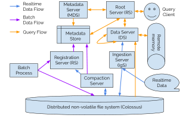
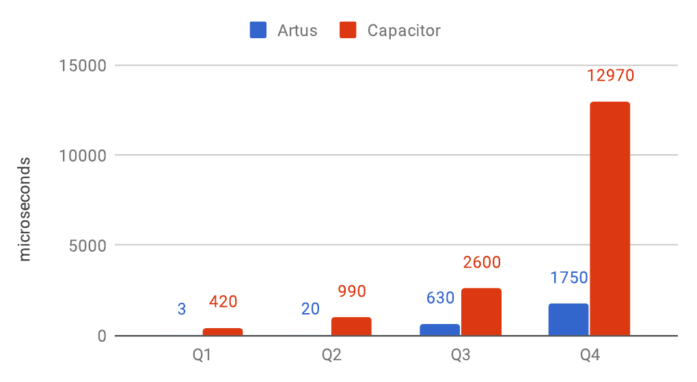
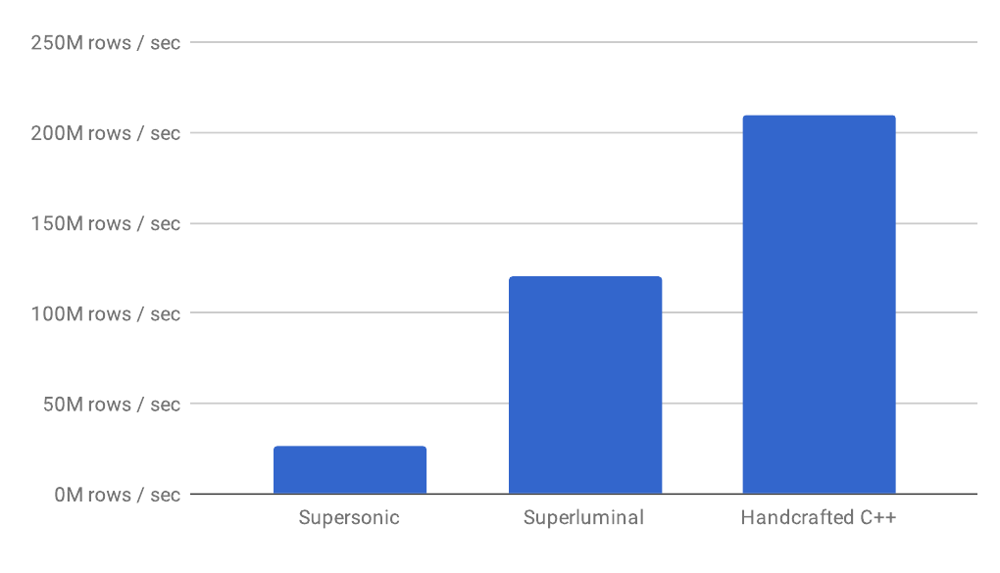
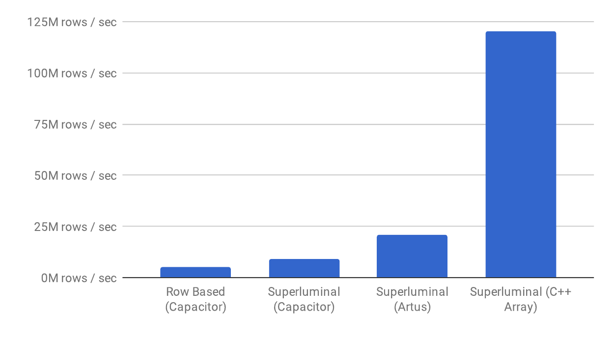
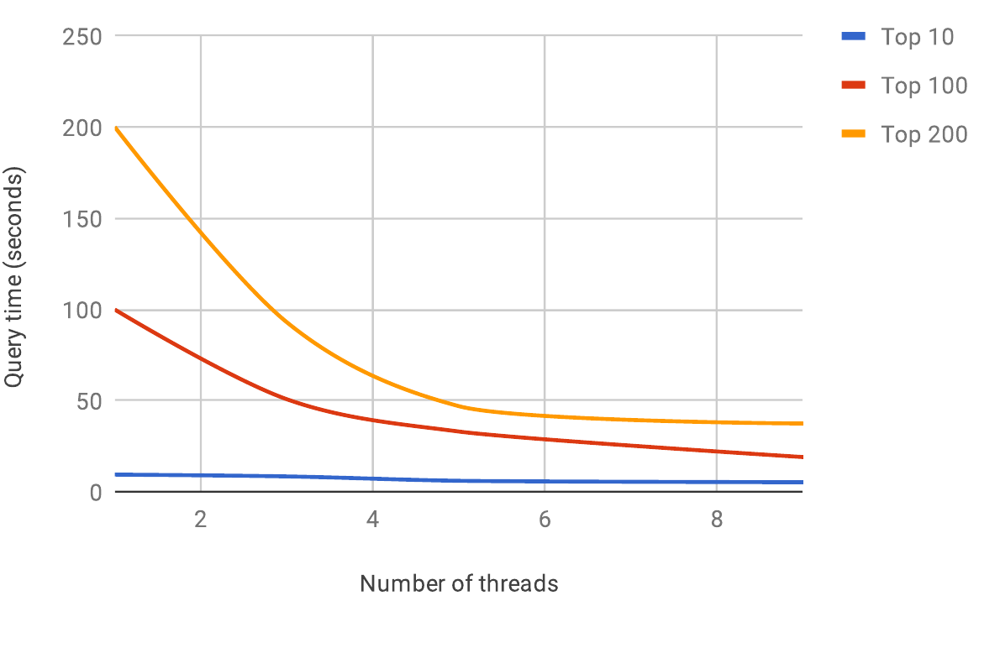
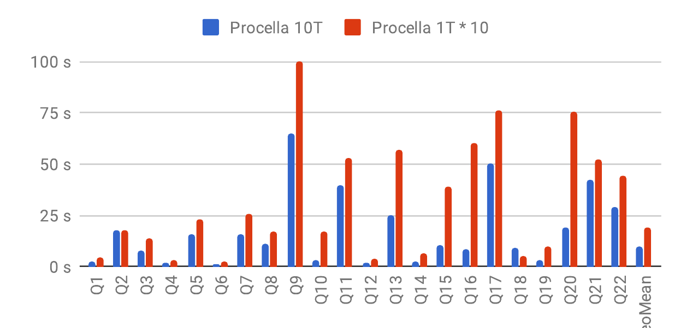
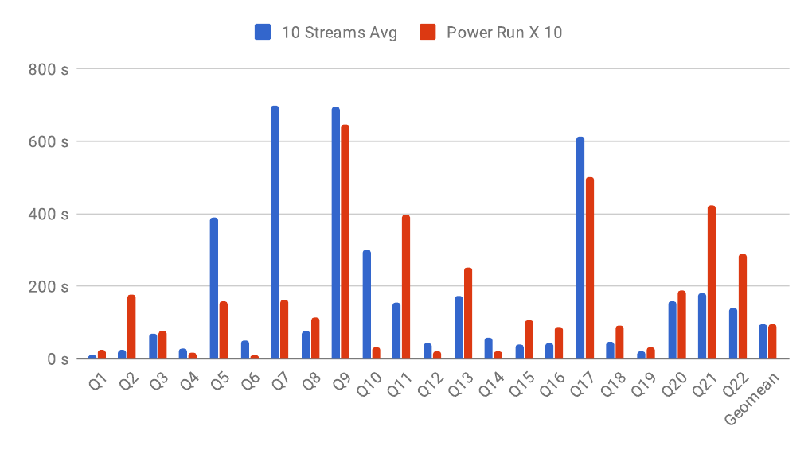

# Procella: Unifying serving and analytical data at YouTube（中文译文）

## 译者说明

本文依据同目录的 `source.pdf` 翻译。章节、图表、公式、算法、代码与参考文献按原文结构保留。

Biswapesh Chattopadhyay、Priyam Dutta、Weiran Liu、Ott Tinn、Andrew Mccormick、Aniket Mokashi、Paul Harvey、Hector Gonzalez、David Lomax、Sagar Mittal、Roee Ebenstein、Nikita Mikhaylin、Hung-ching Lee、Xiaoyan Zhao、Tony Xu、Luis Perez、Farhad Shahmohammadi、Tran Bui、Neil McKay、Selcuk Aya、Vera Lychagina、Brett Elliott（Google LLC）

电子邮件：procella-paper@google.com

## 摘要

YouTube 这类大型组织既面对爆炸式增长的数据量，也面对日益增长的数据驱动应用需求。这些应用大体可分为四类：报表与仪表盘、页面内嵌统计、时间序列监控，以及即席分析。组织通常会为每一种用例建设专门的基础设施，但这会形成数据与处理孤岛，最终得到复杂、昂贵且难以维护的系统。

YouTube 通过构建新的 SQL 查询引擎 Procella 解决了这一问题。Procella 在一个产品中，以很高的规模和性能实现了覆盖上述四类用例所需能力的超集。如今，Procella 在 YouTube 及 Google 的其他多个产品领域中，每天为这四类工作负载处理数千亿次查询。

**PVLDB 引用格式：**Biswapesh Chattopadhyay 等，*Procella: Unifying serving and analytical data at YouTube*，PVLDB 12(12): 2022–2034，2019。DOI：10.14778/3352063.3352121。

## 1. 引言

YouTube 是全球最受欢迎的网站之一。基于数十亿个视频、数亿创作者和观众、数十亿次观看以及数十亿小时观看时长，YouTube 每天都会产生数万亿条新数据。这些数据用于为内容创作者生成报表、监控服务健康状况、在 YouTube 页面中提供视频观看次数等内嵌统计，以及开展即席分析。

这些工作负载的要求各不相同：

- **报表与仪表盘：**视频创作者、内容所有者和 YouTube 内部的多类利益相关者，需要通过详细的实时仪表盘了解视频和频道的表现。系统要以很低的延迟（数十毫秒）每秒执行数万条固定模板查询，而查询又可能含过滤、聚合、集合运算和连接。其独特困难在于：每个数据源每天常新增数千亿行，数据量很大；与此同时，系统仍必须给出近实时响应并允许访问新鲜数据。
- **内嵌统计：**YouTube 向用户公开许多实时统计，例如视频的点赞数或观看次数。这些查询本身简单，却具有非常高的基数。数值持续变化，所以系统必须在每秒数百万次低延迟查询的同时，支持数百万次并发实时更新。
- **监控：**监控与仪表盘工作负载有许多共同点，例如查询多为相对简单的固定模板，而且需要新鲜数据。由于监控主要供内部工程师使用，查询量往往较低；但它需要额外的数据管理功能，例如自动降采样和淘汰旧数据，也需要高效近似函数和其他时间序列函数等查询特性。
- **即席分析：**YouTube 各团队的数据科学家、业务分析师、产品经理和工程师，需要执行复杂的即席分析以理解使用趋势并决定如何改进产品。这类查询量较低（至多每秒数十条），可接受中等延迟（数秒到数分钟），但会在海量数据（数万亿行）上执行多层聚合、集合运算、分析函数和连接，访问模式不可预测，还要处理嵌套或重复数据。虽然星型和雪花型模式等标准建模技术仍可使用，但查询模式本身高度不可预测。

历史上，YouTube 以及 Google 内外的类似产品会分别使用不同的存储和查询后端：即席分析和内部仪表盘使用 Dremel [33]，面向外部的高流量仪表盘使用 Mesa [27] 与 Bigtable [11]，站点健康监控使用 Monarch [32]，页面内嵌统计使用 Vitess [25]。然而，数据指数增长、产品能力增强以及对更多功能、更高性能、更大规模和更高效率的要求，使既有基础设施越来越难以满足需求。具体问题包括：

- 数据必须通过不同的抽取、转换和加载（ETL）流程进入多个系统，造成显著的额外资源消耗、数据质量问题、数据不一致、加载延迟，以及较高的开发维护成本和较慢的上市速度。
- 各内部系统使用不同的语言和 API。为了继续使用既有工具而在系统之间迁移数据，会降低易用性并增加学习成本。尤其是，许多系统并不支持完整 SQL，某些后端因而无法承载某些应用，进一步造成组织内部的数据重复和可访问性问题。
- 若干底层组件在处理 YouTube 规模的数据时存在性能、可扩展性和效率问题。

为解决这些问题，YouTube 构建了新的分布式查询引擎 Procella。它实现了上述多样化工作负载所需功能的超集：

- **丰富 API：**近乎完整地实现标准 SQL，包括复杂的多阶段连接、分析函数和集合运算，并扩展近似聚合、复杂嵌套与重复模式处理、用户自定义函数等功能。
- **高可扩展性：**将运行在 Borg [42] 上的计算与位于 Colossus [24] 上的存储分离，从而以较低成本扩展到数千台服务器、数百 PB 数据。
- **高性能：**运用先进查询执行技术，以毫秒级低延迟高效处理高流量查询，最高可达每秒数百万次。
- **数据新鲜度：**支持批处理和流处理两种高流量、低延迟摄取模式，可以直接处理既有数据，并原生支持 Lambda 架构 [35]。

## 2. 架构

### 2.1 Google 基础设施

Procella 为 Google 基础设施而设计。Google 的分布式系统基础设施十分先进，其中若干特性显著影响了 Procella 的设计：

- **解耦式存储：**所有持久数据都必须存储在 Colossus 中，系统没有可用的本地存储。Colossus 几乎可以无限扩展，但与本地存储有几项重要差异。
  - 数据不可变。文件打开后可以追加，但不能修改；文件一旦最终定稿，就完全不可更改。
  - 列举和打开文件等常见元数据操作，需要与一个或多个 Colossus 元数据服务器通信，其延迟——尤其长尾延迟——会明显高于本地文件系统。
  - 所有持久数据都在远端，因此任何读写都只能通过 RPC 完成。与元数据操作类似，大量小操作的成本和延迟更高，长尾尤其明显。
- **共享计算：**所有服务器必须运行在 Google 的分布式作业调度与容器基础设施 Borg 上。这也带来若干后果。
  - 纵向扩展很难。每台服务器上运行许多任务，各自资源需求不同。为提高整个集群的利用率，运行许多小任务通常优于运行少量大任务。
  - Borg 主控会因维护、升级等原因频繁下线机器。行为良好的任务必须能从驱逐中迅速恢复，并在另一台机器上重启。再加上没有本地存储，保存大量本地状态并不现实，这也是系统采用大量小任务的原因之一。
  - 一个典型 Borg 集群有数千台廉价机器，硬件配置可能不同；每台机器上混合运行多种任务，而隔离并不完美，所以单个任务的性能难以预测。结合前述因素，任何运行在 Borg 上的分布式系统都必须采用成熟策略，处理异常任务、随机任务故障以及驱逐造成的周期性不可用。



图 1 展示整体架构。Procella 由多个组件组成，每个组件都以分布式方式执行。若某个组件没有任何运行实例，它提供的功能就不可用；不同组件彼此独立，例如即使数据服务器停机，摄取和注册仍可工作。

### 2.2 Procella 的数据

#### 2.2.1 数据存储

与多数数据库一样，Procella 在逻辑上把数据组织成表。每张表的数据分布于多个文件中，这些文件也称 tablet 或分区。Procella 的多数数据使用自有列式格式 Artus（第 3.2 节），同时也支持查询 Capacitor [34] 等其他格式中的数据。所有持久数据都存储在 Colossus 中，使 Procella 得以分离存储和计算：处理数据的服务器可以依据流量独立扩展，不受底层数据规模限制；同一份数据也可以同时由多个 Procella 实例提供服务。

#### 2.2.2 元数据存储

与多种现代分析引擎 [18,20] 一样，Procella 不使用传统 B 树式二级索引，而选择分区键、排序键、分区映射（zone map）、位图和布隆过滤器等轻量级辅助结构 [1]。元数据服务器（Metadata Server，MDS）在查询规划阶段提供这些信息。辅助结构一部分由注册服务器在文件注册时从文件头收集，另一部分由数据服务器在查询求值时惰性收集。模式、表到文件的映射、统计信息、分区映射和其他元数据大多保存在由 Bigtable [11] 与 Spanner [12] 支撑的元数据存储中。

#### 2.2.3 表管理

表管理使用标准 DDL 命令（`CREATE`、`ALTER`、`DROP` 等）。命令发送给注册服务器（Registration Server，RgS），再由它写入元数据存储。用户可指定列名、数据类型、分区和排序信息、约束、数据摄取方式（批处理或实时）以及其他选项，以获得合适的表布局。对于实时表，用户还可指定数据淘汰、降采样或压缩方式；这对监控应用，以及“批数据定期替换实时数据”的 Lambda 架构十分重要。

表对象创建后，可用批模式或实时模式填充、摄取其数据。两种摄取模式使用的优化不同。

#### 2.2.4 批量摄取

用户通过离线批处理（例如 MapReduce [15]）生成数据，再通过对 RgS 发起 DDL RPC 注册数据。这是按小时或按日定期刷新数据的自动管道最常用的方式。注册时，RgS 从文件头提取表到文件的映射和第 2.2.2 节所述辅助结构。为了快速注册，系统不会在此阶段扫描数据；但若文件头缺少所需索引信息——例如没有布隆过滤器——Procella 可使用数据服务器惰性生成代价较高的辅助结构。

Procella 也能注册外部生成的数据；注册数据并不要求预先采用某种组织形式 [40]。不过实际使用中，为获得最佳性能，数据仍应通过分区、排序等方式合理布局。RgS 还在表与数据注册期间执行健全性检查：验证模式向后兼容性，裁剪和压缩复杂模式，并确保文件模式与用户注册的表模式兼容。

#### 2.2.5 实时摄取

摄取服务器（Ingestion Server，IgS）是实时数据进入系统的入口。用户可通过 RPC 或 PubSub 等受支持的流式机制写入数据。IgS 接收数据，可选地将其转换为与表结构一致的形式，并追加到 Colossus 上的预写日志；与此同时，它依据表的分区方案把数据发送给数据服务器。数据暂存于数据服务器内存缓冲区中，供查询立即处理。缓冲区也会定期尽力检查点到 Colossus，以帮助从崩溃或驱逐中恢复，但检查点不阻塞查询访问。IgS 还可把数据发送给多个数据服务器以提供冗余；查询会访问缓冲数据的所有副本，并采用其中最完整的一组。

后台压缩任务会压缩预写日志，实现持久摄取。数据沿两条并行路径流动，因此可在数秒甚至亚秒内以“脏读”方式对查询可见，同时最终与较慢的持久摄取路径保持一致。查询会合并内存缓冲区与磁盘 tablet 中的数据，并且只从缓冲区取出尚未被持久处理的数据。也可以关闭缓冲区服务来保证一致性，代价是增加数据延迟。

#### 2.2.6 压缩整理

压缩服务器定期将 IgS 写入的日志压缩、重新分区，生成更大的分区列式数据包，供数据服务器高效服务。在此过程中，它还可执行用户在注册表时指定的 SQL 逻辑，通过过滤、聚合、淘汰旧数据、只保留最新值等方式缩减数据。丰富的 SQL 压缩逻辑让用户能更细致地管理实时数据。

每轮压缩结束后，压缩服务器经 RgS 更新元数据存储，删除旧文件的元数据并插入新文件的元数据；后台进程随后删除旧文件。

### 2.3 查询生命周期

客户端连接根服务器（Root Server，RS）并提交 SQL。RS 执行查询重写、解析、规划和优化，生成执行计划。它从 MDS 获取模式、分区和索引等元数据，并按第 3.4 节所述裁剪需要读取的文件。之后，RS 在查询经过不同阶段时协调执行，强制满足时序和数据依赖并执行限流。

为支持复杂分布式计划中的时序/数据依赖和多种连接策略，RS 构建一棵树：节点是查询块，边是数据流，节点可表示“聚合”“远程执行”“错峰执行”等操作。树式执行可表达需要时序依赖的 shuffle、需要数据依赖的非相关子查询与子查询广播连接，以及多级聚合；系统还可依据查询结构向树中插入定制操作来优化。RS 收到最终结果后，将响应连同统计信息、错误、警告及客户端请求的其他信息返回客户端。

数据服务器（Data Server，DS）从 RS 或另一台 DS 接收计划片段，承担主要计算：从本地内存、Colossus 远程分布式文件、通过 RDMA 访问的远程内存或另一台 DS 读取数据，执行计划片段，再把结果发给请求方 RS 或 DS。与多数分布式 SQL 引擎一样，Procella 会积极将计算推近数据。计划生成器尽可能把过滤、投影表达式、聚合（包括 `TOP`、`UNIQUE`、`COUNT DISTINCT`、`QUANTILE` 等近似聚合）和连接下推至 DS，从而让 DS 直接使用针对底层编码的原生函数。DS 间使用 Stubby [41] 交换数据，shuffle 则通过 RDMA 完成；Procella 在此复用 BigQuery shuffle 库 [4]。

## 3. 优化

Procella 运用多项技术，为点查、报表、即席查询和监控等不同查询模式提供高性能。

### 3.1 缓存

Procella 通过把 Colossus 存储与 Borg 计算分离来获得可扩展性和效率，但打开或读取文件都涉及多次 RPC。为缓解网络开销，它使用多层缓存：

- **Colossus 元数据缓存：**DS 缓存文件句柄，文件句柄实际上保存数据块到相应 Colossus 服务器的映射，从而在打开文件时省去一次或多次名称服务器 RPC 往返。
- **文件头缓存：**列式文件的文件头（有时是文件尾）包含列起始偏移、列大小、最小值和最大值等元数据。DS 将文件头保存在独立的 LRU 缓存中，以避免更多 Colossus 往返。
- **数据缓存：**DS 在另一份缓存中保存列式数据。Artus 的内存和磁盘表示相同，因此填充缓存的成本较低；DS 还会缓存高代价操作的输出、布隆过滤器等派生信息。由于 Colossus 文件关闭后基本不可变，只要不复用文件名即可保证缓存一致性。
- **元数据缓存：**Procella 以 Bigtable 或 Spanner 扩展元数据存储，再以分布式 MDS 提供元数据；但表到文件映射、模式、约束等获取操作本身可能成为瓶颈，因此每台 MDS 都用本地 LRU 缓存这些信息。
- **亲和调度：**每台服务器只缓存数据子集时，缓存最有效。Procella 对 DS 与 MDS 均采用亲和调度，使同一数据或元数据的操作以高概率落到同一服务器，从而提高缓存命中率并显著减少远端读取。这里的亲和是“松散”的：若主服务器停机或变慢，请求仍可发往其他服务器。此时命中率会降低，但数据和元数据本身可靠地存放在 Bigtable、Spanner 或 Colossus 中，所以请求仍能完成。面对共享大集群中的进程驱逐、过载机器等问题，这一性质对服务路径的高可用至关重要。

内存足够时，这些缓存实际上可使 Procella 成为全内存数据库。实际报表实例中只有约 2% 的数据能装入内存，但访问模式与缓存亲和使文件句柄命中率超过 99%，数据缓存命中率约为 90%。

### 3.2 数据格式

Procella 最初使用 Capacitor，它主要为即席分析中的大扫描设计。为了同时支持内嵌统计等需要快速点查和范围扫描的场景，团队构建了新的列式文件格式 Artus，使点查和扫描都能达到高性能。Artus 的设计包括：

- 使用自定义编码，避免 LZW 等通用压缩。系统无须解压整块数据即可定位单行，因而更适合小型点查和范围扫描。
- 使用多遍自适应编码：第一遍收集不同值数量、最小/最大值、排序顺序等轻量信息，再选择最合适的编码。Artus 提供多种字典和索引器类型的字典编码、游程编码、差分编码等；压缩率可达到强通用字符串压缩（如 ZSTD）的两倍以内，同时仍可直接在编码数据上执行。每种编码都能估算其在给定数据上的大小和速度；用户指定“大小相对速度”的目标函数后，Artus 自动选择最优编码。
- 为有序列选择支持二分查找的编码，使查找为 $O(\log N)$。列还支持按行号 $O(1)$ 定位，所以在给定主键下找到含 $K$ 列的一行只需 $O(\log N+K)$。固定位宽整数等可直接索引的列很容易做到 $O(1)$；对游程编码列，则每隔 $B$ 行保存内部状态的“跳块”信息，从最近跳块继续迭代。严格而言这类定位是 $O(B)$，但 $B$ 通常仅为 32 或 128，用于权衡压缩大小与查找速度。快速行查找对点查和分布式 lookup join 至关重要；后者把右表视作分布式哈希表。
- 对嵌套和重复数据采用不同于 ColumnIO [33]、Capacitor、Parquet 的新表示。系统把表模式视为字段树，每个字段单独存一列，而不是只存叶字段的 repetition/definition level。写入记录时，每当父字段存在，就记录每个子字段出现的次数：可选字段为 0 或 1，重复字段为非负数；父字段不存在时，不为子字段记录任何信息，因此稀疏数据比总在叶字段记录信息的 rep/def 表示更紧凑。重建记录时反向执行此过程，根据出现次数决定要复制多少元素。出现次数以累积形式与子字段实际值分开保存，使嵌套和重复数据仍支持 $O(1)$ 定位。
- 将字典索引、游程编码（RLE）[2] 信息及其他底层编码信息直接暴露给求值引擎，并在 API 内原生实现常用过滤。这样可把计算积极下推至数据格式，在常见场景中获得很大性能收益。
- 在文件头和列头中记录丰富元数据，包括模式、排序、最小/最大值、详细编码信息、布隆过滤器等。许多常用裁剪不必读取列数据即可完成。实践中，文件常按主键范围分区，查询过滤条件可据此裁剪文件访问。
- 支持保存倒排索引。倒排索引通常用于加速关键词搜索 [7,38]；Procella 当前主要将其用于实验分析。每条记录有一个含数百个低基数整数的小数组，查询需判断某整数是否存在，例如 `WHERE 123 IN ArrayOfExperiments`，再继续分析。直接求值往往是查询主要开销。Procella 预先计算“每个值出现在哪些记录行”的倒排索引，与普通列一同落盘；查询只加载相应索引。索引使用 Roaring 位图 [10]，因此 `123 IN ... OR 456 IN ...` 等布尔条件也能避开普通求值路径高效完成。生产中的实验分析查询使用该技术后，端到端延迟约降低 500 倍。

| 查询编号 | 查询 |
| --- | --- |
| Q1 | `SUM(views) WHERE pk = X`：纯点查，匹配 1 行 |
| Q2 | `SUM(views) WHERE fk = X`：中等选择性过滤，匹配 5,000 行 |
| Q3 | `SUM(views)`：全扫描，匹配全部约 250,000 行 |
| Q4 | `SUM(views), fk GROUP BY fk`：带分组的全扫描 |

**表 1：Artus 基准测试查询。**

| 格式 | Capacitor | ArtusDisk | ArtusMemory |
| --- | ---: | ---: | ---: |
| 大小（KB） | 2,406 | 2,060 | 2,754 |

**表 2：Artus 数据大小。**ArtusMemory 是未压缩内存大小，ArtusDisk 是 LZW 压缩磁盘大小。

基准在一个典型 YouTube Analytics 数据集上比较 Artus 与 Capacitor。每项数字取测试框架 5 次运行中的最佳值。查询在一个约 25 万行、按视频 ID 排序且完全载入内存的文件上执行，查询见表 1，数据大小见表 2。



图中执行时间（微秒）依次为：Q1，Artus 3、Capacitor 420；Q2，Artus 20、Capacitor 990；Q3，Artus 630、Capacitor 2,600；Q4，Artus 1,750、Capacitor 12,970。

### 3.3 求值引擎

高性能求值对低延迟查询至关重要。许多现代分析系统会在查询时用 LLVM 将执行计划编译为原生代码，但 Procella 既要服务分析，也要服务高 QPS 在线查询；在后者中，编译时间本身常成为瓶颈。Procella 的求值引擎 Superluminal 采用不同方案：

- 大量使用 C++ 模板元编程，在编译期生成代码。这样，一份函数实现可自动应用偏函数求值等优化，同时避免大量虚函数调用开销。
- 分块处理数据，以利用向量化计算 [37] 和缓存感知算法。块大小按适配 L1 缓存估算，代码也经过精心编写，使编译器可自动向量化 [8]。
- 直接在底层数据编码上执行，并在函数应用期间尽量保留编码。编码可来自文件格式，也可在执行过程中按需产生。
- 完全以列式方式处理结构化数据，不物化中间表示。
- 动态合并过滤器并沿执行计划一直下推至扫描节点，使每一列只扫描确实需要的行。

团队使用去掉过滤条件的 TPC-H 查询 1，比较 Superluminal、第一代行式求值器和开源 Supersonic 的聚合性能；数据载入内存数组，以排除文件格式影响，结果均为每 CPU 核性能。





原始 C++ 数组上的 Superluminal 约为 Supersonic 的 5 倍，但专门手工优化的 C++ 仍快约 50%；相反，使用标准库哈希表的朴素 C++ 实现会比 Superluminal 慢一个数量级。脚注指出，在 TPC-H 数据集上，Artus 文件大约只有原始数据的十分之一。

### 3.4 分区与索引

Procella 支持多级分区和聚簇。事实表通常按日期分区，再在每个日期内部按多个维度聚簇；维度表通常按维度键分区并排序。这使系统能快速裁剪无须扫描的 tablet，并执行同分区连接，避免大规模 shuffle。这对面向外部的报表实例尤其关键：它要在数十 PB 数据上，以毫秒延迟处理每秒数千次查询。

MDS 负责高效保存和检索这些信息。MDS 是分布式服务，并使用第 3.1 节的亲和调度提高缓存效率。缓存中的内存结构由 Bigtable 存储格式转换而来，使用前缀、差分、RLE 等编码，从而以内存高效的方式处理数千张表、数十亿文件和数万亿行对应的海量元数据。

| 百分位 | 延迟（ms） | 被裁剪 tablet 数 | 被扫描 tablet 数 |
| ---: | ---: | ---: | ---: |
| 50 | 6 | 103,745 | 57 |
| 90 | 11 | 863,975 | 237 |
| 95 | 15 | 1,009,479 | 307 |
| 99 | 109 | 32,799,020 | 3,974 |
| 99.9 | 336 | 37,913,412 | 7,185 |
| 99.99 | 5,030 | 38,048,271 | 11,125 |

**表 3：MDS 在外部报表实例中的性能。**裁剪依据查询过滤条件执行，例如经哈希处理的 ID 与日期范围。

MDS 从计划中裁剪 tablet 后，单独的叶请求会发往 DS。DS 再利用布隆过滤器、最小/最大值、倒排索引及其他文件级元数据，依据查询过滤条件减少磁盘访问；信息在各 DS 的 LRU 缓存中惰性保存。在主要报表实例中，这使约一半 DS 请求完全无需执行求值。

### 3.5 分布式操作

#### 3.5.1 分布式连接

连接对分布式查询引擎通常很困难 [6,9,21]。Procella 提供多种连接策略，可由 hint 显式控制，也可由优化器依据数据布局和规模隐式选择：

- **广播（broadcast）：**一侧足够小，可载入所有执行查询的 DS 的内存。国家、日期等小维度常使用此策略。
- **同分区（co-partitioned）：**事实表与维度表按同一连接键分区。即使右侧整体很大，每台 DS 也只需加载很小的子集。星型模式中最大的维度（例如 Video 维表）常使用此方式。
- **Shuffle：**两侧都很大且都未按连接键分区时，按连接键将数据 shuffle 到一组中间服务器。
- **流水线（pipelined）：**右侧是复杂查询，但结果集可能很小时，先执行右侧，把结果内联后发送至左侧各分片，形成类似广播的连接。
- **远程查找（remote lookup）：**构建侧维表很大并按连接键分区，但探测侧事实表没有按该键分区时，DS 向承载构建侧 tablet 的 DS 发 RPC，获取所需键值。RPC 开销可能很高，所以系统必须应用所有可用过滤器、将键批量合并成尽可能少的 RPC，并把投影与过滤下推到构建侧，只取最少数据。Artus 可直接快速点查，因此无须先把维表转成内存哈希表即可高效执行这种连接。

#### 3.5.2 处理长尾延迟

在廉价共享硬件上横向扩展的现代分布式系统中，单机经常表现不稳定，低长尾延迟很难实现。Procella 采用并针对自身架构调整了已有技术 [14]：

- 所有数据都在 Colossus 中，所以任意 DS 均可访问任意文件。RS 在查询执行过程中动态维护 DS 响应延迟分位数；若请求耗时明显高于中位数，就向第二台 DS 发送备份 RPC。
- 对大型查询，RS 对发往 DS 的请求进行限速与批处理，避免同一 DS 被过多请求压垮。
- RS 为每个 DS 请求附加优先级；小查询通常为高优先级，大查询为低优先级。DS 分别设置高、低优先级线程，使小查询更快响应，避免一个超大查询拖慢整个系统。

#### 3.5.3 中间合并

对重聚合查询，最终聚合常因必须在单节点处理大量数据而成为瓶颈。Procella 在最终聚合器输入端加入中间算子：该算子缓冲数据；若最终聚合器赶不上叶 DS 返回结果的速度，就动态创建额外线程执行中间聚合。



### 3.6 查询优化

#### 3.6.1 虚拟表

低延迟、高 QPS 报表常通过物化视图 [3] 加速：预先生成基表的多个聚合，并在查询时手动或自动选择合适聚合。Procella 的虚拟表使用类似思想，并增加以下能力：

- **索引感知的聚合选择：**不只按大小，还结合聚簇、分区等数据组织，匹配查询过滤谓词与表布局，选择合适的表，从而减少扫描。
- **拼接查询：**若多个表均含查询所需维度，就用 `UNION ALL` 拼接这些表，从各表提取不同指标。
- **Lambda 架构感知：**用 `UNION ALL` 拼接可用时间范围不同的表。一是拼接更准确完整但较迟到达的批数据与实时数据；二是区分“必须存在、才能覆盖所有维度组合”的批表与“只用于进一步优化”的批表，使批数据更早在一致截止点上可用。
- **连接感知：**理解星型连接；当所选维度属性未反规范化进事实表时，可自动在生成查询中插入连接。

#### 3.6.2 查询优化器

Procella 的优化器同时使用静态和自适应查询优化 [16]。编译时，基于规则的优化器执行必然有利的标准逻辑重写，例如过滤下推、子查询去相关和常量折叠。执行时，自适应优化依据从查询实际数据样本中收集的基数、不同值计数、分位数等统计信息，选择或调节物理算子。

传统代价优化器很难在高速摄取下收集、维护数据统计，也很难建立只对有限查询有效的复杂估算模型 [19,31]。自适应方法直接从流经执行计划的实际数据获得统计信息，因而可在整棵计划树中保持同等准确；传统优化器的估计通常在叶节点最准确，越靠近根越不准确。

自适应优化器向查询计划插入统计“收集点”，并据此改写尚未执行的部分。目前系统在所有 shuffle 操作处插入收集点。Shuffle 可视为 MapReduce：map 阶段将相同键的行汇入同一分片，reduce 阶段在分片上计算。`GROUP BY` 按分组键映射再聚合；连接则把左右表中连接键相同的行映射到同一分片再生成连接结果。Shuffle 是自然的物化点，适合收集统计；这些统计用于决定 reducer 数量、分区函数和未执行计划的重写方式。

- **自适应聚合：**查询含两个片段：叶片段在每个数据分区上做局部聚合，根片段聚合局部结果。系统在一部分分区上计算局部聚合以估计叶片段输出记录数，再按目标每分片行数（例如 100 万行）确定分片数量。
- **自适应连接：**系统分别估计左右侧参与连接的键。每个分区的摘要结构保存键数量、最小值、最大值；若键少于几百万，还保存布隆过滤器。多数情况下摘要来自全部输入，而非样本。系统支持以下优化。
  - **广播：**构建侧较小（例如少于 100,000 行）时，通过 RDMA 广播至探测侧每个分区，并重写计划以避免 shuffle。
  - **裁剪：**若过滤侧的键可用约 $O(10\text{ MB})$、假阳性率约 10% 的布隆过滤器概括，就用它裁剪另一侧。map 只写入高概率能参与连接的记录。
  - **预先 shuffle：**若一侧已经按连接键分区，只对另一侧执行 map，以匹配现有分区。例如已分区侧在过滤后只有 $[1,5]$、 $[10,50]$、 $[150,200]$ 三个范围，就把另一侧映射到这些区间；数据量大时可进一步细分。事实表到维表连接经常适用，因为维表通常按连接键分区。若左右两侧都已按连接键分区，系统在编译期选择 lookup join，完全避免 shuffle。
  - **全量 shuffle：**其他优化均不适用时，对左右侧都执行 map，依据两侧记录总数自动决定分片数。
- **自适应排序：**处理 `ORDER BY` 时，先执行查询估计待排序行数，确定目标分片数 $n$；再执行第二个查询估计 $n$ 个分位点，供 map 阶段按范围分区。reduce 阶段在各分片内局部排序。这样可复用 shuffle 基础设施高效排序大数据集。

自适应优化也有限制。对大查询，统计收集只增加约 10% 开销；对约 10 ms 完成的小查询，开销可能达到 2 倍。低延迟查询可用 hint 完全指定执行策略并绕过自适应优化。即席查询用户通常愿意让 10 ms 查询变成 20 ms，以换取大查询更佳的性能和更好的最坏情况行为。当前框架尚不用于连接顺序；团队正在扩展它，计划用标准动态规划算法配合自适应查询收集表级统计，在统计查询数量与估计准确性之间折中。

### 3.7 数据摄取

为获得最佳查询性能，数据集应合理分区、聚簇和排序；但若把加载完全耦合进查询引擎，想快速导入数 PB 既有数据的团队会失去可扩展性和灵活性。Procella 因而提供离线数据生成工具：输入模式、输出模式及字段映射后，工具运行基于 MapReduce 的离线管道，生成针对 Procella 优化的格式与布局。它可在任何数据中心的廉价低优先级批资源上执行，大幅提高大数据集的摄取扩展性，并把昂贵生产资源留给查询服务。

生成期间可执行均匀且大小合适的分区、聚合、排序、将热表数据放入 SSD、复制和加密等优化。工具并非强制要求；只要格式受支持，Procella 也可接收任意工具生成的数据。

### 3.8 提供内嵌统计

Procella 为 YouTube 观看页和频道页上的观看数、点赞数、订阅数等内嵌统计提供服务。逻辑查询很简单：

```sql
SELECT SUM(views) FROM Table WHERE video_id = N;
```

数据量相对较小，最多数十亿行，每行列数不多；但每个实例要以毫秒级延迟处理每秒超过一百万次查询，数值还在快速更新，必须近实时应用更新。Procella 让这类实例运行在专门的“统计服务（stats serving）”模式，并采用以下优化：

- 注册新数据时，RgS 通知主、备 DS 立即加载，而不是等首个请求惰性加载。即使少数叶服务器停机，服务路径也无须访问远程磁盘。数据量相对较小，因此增加内存占用是合理权衡。
- 将 MDS 模块编译进 RS，省去二者间 RPC，使 RS 能高效处理高 QPS。
- 所有元数据完全预加载，并异步保持最新，避免查询时远程读取造成长尾。系统允许略旧的元数据仍产生正确答案；统计实例表数较少，因此开销可接受。
- 积极缓存查询计划，消除解析和规划开销；统计查询模式高度可预测，所以效果很好。
- RS 将同一键的所有请求批处理，并只发往一对主、备 DS。单键查询因此恰好只有 2 个出站 RPC，取较快响应以降低长尾。
- 监控 RS 与 DS 任务的异常高错误率或延迟，并与同数据中心同类任务比较；自动把异常任务迁移到其他机器，以缓解 Borg 隔离不完美的影响。
- 禁用自适应连接、shuffle 等大多数昂贵优化和操作，避免相关开销与生产风险。

## 4. 性能

Procella 面向共享基础设施上的灵活工作负载，追求高性能和高可扩展性。本节给出三类主要负载——即席分析、实时报表、统计计数器服务——的基准与生产数据。

### 4.1 即席分析

即席分析使用广泛发布的 TPC-H 基准，它代表典型规范化数据库与分析负载。团队在一个含 3,000 个 CPU 核、20 TB RAM、运行于 Borg 的内部 Procella 实例上执行 TPC-H 1T（SF=1,000）和 10T（SF=10,000）查询。数据生成成 Artus 格式，经分区和排序后存入 Colossus；基准开始前预热缓存。10T 测试既执行单流 power run，也执行 10 个并行流的 throughput run。



图 6 比较同一实例上 1T 和 10T 每条查询的执行时间。1T 运行的几何平均约 2 秒，10T power run 约 10 秒，说明系统随数据量增长扩展良好；延迟呈次线性增长，主要因为 10T 能利用更多并行度。



图 7 显示十个并行流的 10T throughput run。并行查询增多时性能总体平滑退化，但方差明显：Q7 的退化远超预期，而 Q2 明显好于预期。主要瓶颈是节点间数据传输，包括 RPC、序列化和反序列化。这符合系统的横向扩展形态：它使用数百或数千个较小任务，而不是十个以内的大任务。

> **原文脚注 2：**这些测试并不完全遵循 TPC-H 规则，例如为适配内部环境而手工调优了一些查询。因此结果不能与公开 TPC-H 成绩直接比较，只用于展示系统原始查询处理速度。

### 4.2 实时报表

Procella 为内外部许多报表和仪表盘服务，外部应用包括 YouTube Analytics、YouTube Music Insights、Firebase Performance Analytics 和 Play Developer Console。本节聚焦最流行的 `youtube.com/analytics`，内部称 YouTube Analytics（YTA）。YTA 每天在数十 PB 数据上运行超过十亿次查询，涵盖数万种独特模式：维度拆分、过滤、连接、聚合、分析函数、集合算子与近似函数等。每位创作者只能访问自己的数据，所以每条查询通常只涉及整个数据集的小切片。数据端到端延迟通常低于一分钟，但系统还要生成覆盖多年数据的大型历史报表，并支持批量导出；最大导出超过 100 GB。

为冗余起见，此用例维护 5 个 Procella 实例，至少 3 个完整提供服务；每个实例约有 6,000 个 CPU 核和 20 TB RAM。

| 属性 | 规模 |
| --- | --- |
| 执行查询数 | 每天 15 亿以上 |
| 实时数据上的查询数 | 每天 7 亿以上 |
| 执行的叶计划数 | 每天 2,500 亿以上 |
| 扫描行数 | 每天 8 京（80 quadrillion）以上 |
| 返回行数 | 每天 1,000 亿以上 |
| 单查询峰值扫描速率 | 每秒 1,000 亿行以上 |
| 模式规模 | 200 多个指标与维度 |
| 表数 | 300 多张 |

**表 4：YTA 实例规模。**该实例还承载少量其他应用。

| 属性 | 50% | 99% | 99.9% |
| --- | ---: | ---: | ---: |
| 端到端延迟 | 25 ms | 412 ms | 2,859 ms |
| 扫描行数 | 16.5M | 265M | 961M |
| MDS 延迟 | 6 ms | 119 ms | 248 ms |
| DS 延迟 | 0.7 ms | 73 ms | 220 ms |
| 查询大小 | 300 B | 4.7 KB | 10 KB |

**表 5：YTA 实例性能分布。**

这些数据表明，对实时与批数据上的高流量、简单到中等复杂度 SQL，Procella 的性能和扩展性都很好；创作者、应用开发者和其他外部用户超过 99% 的请求能在一秒内完成。

### 4.3 内嵌统计

统计服务实例为观看数、点赞数和订阅数等内嵌计数器提供服务，部署在全球十多个数据中心，每秒处理数百万次、每天数千亿次查询，延迟为毫秒级。典型生产日的延迟如下。

| 百分位 | 延迟 |
| ---: | ---: |
| 50% | 1.6 ms |
| 90% | 2.3 ms |
| 95% | 2.6 ms |
| 99% | 3.3 ms |
| 99.9% | 14.8 ms |
| 99.99% | 21.7 ms |

**表 6：统计服务延迟。**在这种配置下，Procella 达到与 NoSQL 键值存储相当的性能，同时仍可对数据执行 SQL 查询。

## 5. 相关工作

### 5.1 Google 技术

- **Dremel** 是针对大型复杂即席查询优化的 exabyte 级列式 SQL 引擎，可在 ColumnIO、Capacitor、Bigtable 等后端上运行，并支撑 BigQuery。Procella 与其共享 RPC 协议、SQL 解析器、Colossus 存储和 Borg 计算等基础，但有显著差异：Procella 大量使用有状态缓存，而 Dremel 基本无状态；Procella 将实例分别针对不同用例优化，而 Dremel 是跨用户的全局共享服务；Procella 使用适合点查的可索引列式格式，而 Capacitor 没有索引。这些差异使 Procella 能服务高 QPS 报表和点查等更多负载。
- **Mesa** 是 Google 构建的 PB 级数据存储与查询系统，主要保存和查询聚合统计表，采用以差分为主、延迟以分钟计的摄取模型。Mesa 本身不支持 SQL；F1 通过底层 Mesa API 在其上提供灵活 SQL。
- **F1** [39] 包含类似 Dremel 的联邦分布式查询引擎，可访问 Mesa、ColumnIO、Bigtable、Spanner 等后端。它用查询联邦支持 OLTP、即席和报表：OLTP 查询 F1/Spanner；低延迟报表查询 F1/Mesa；分析与即席查询访问 Mesa、F1 或 Colossus 上的 Capacitor 文件。Procella 不服务 OLTP，而是紧密结合存储、数据格式和执行，使用同一套存储与格式覆盖其余多类负载。
- **PowerDrill** [28] 是列式内存分布式 SQL 引擎，主要面向 QPS 相对较低、规模较大但结构较简单的查询；这类查询可在分布式树执行架构中直接并行化。它主要用于快速日志分析和内部仪表盘。
- **Spanner** 是通常供 OLTP 应用使用的分布式 SQL 数据库。它与 Bigtable 共享许多底层设计及性能特征，但提供更好的一致性、原子事务和 SQL 接口。Spanner 提供实时数据的外部一致性，常作为事实来源存储，却不以即席分析或实时报表为目标。

### 5.2 外部技术

#### 5.2.1 即席分析

Presto [22] 是最初由 Facebook 开发的开源查询引擎，设计类似 Dremel，Amazon 也以 Athena 云服务提供它。运行于 Spark 框架的开源 Spark SQL [5] 在大量投资 Spark 的组织中很受欢迎。Snowflake [13] 将存储与计算分离，并采用与 Procella 类似的本地缓存、集中式元数据管理等技术。Amazon Redshift [26] 把存储与计算紧密耦合在同一虚拟机上，也可通过 Spectrum 访问 S3 外部数据。这些系统擅长低 QPS 即席分析和仪表盘，但不提供高 QPS、低延迟在线服务，也不具备高带宽实时流式摄取。

#### 5.2.2 实时报表

Druid [43] 与 Pinot [17] 都具备列式存储、流批混合摄取、分布式查询执行、tablet 与列裁剪等特性，因而可支持低延迟、高 QPS 服务。ElasticSearch 通过自定义 API 提供过滤、聚合等结构化查询能力，也常用于低延迟实时仪表盘；但这些引擎的 SQL 支持有限，总体不适合即席分析。Amplitude 和 Mixpanel 等公司为高流量、低延迟实时报表构建了定制后端。Apache Kylin 则从数据立方体生成聚合，并存入 HBase 等键值存储，以高效处理无须大扫描的预定义查询模式。

#### 5.2.3 监控

Stackdriver 与 Cloudwatch 是常见云监控服务，使用自有后端，只向用户公开有限 API。Facebook 的 Gorilla [36] 是实时内存时间序列监控数据库，其开源版本 Beringei [23] 提供定制时间序列 API。InfluxDB [30] 是支持灵活查询的常用开源时间序列实时分析系统。OpenTSDB 常用于监控，以 HBase 等键值存储按时间和用户指定维度键保存指标，并提供定制 API 提取时间序列供绘图。这些系统不能高效执行大数据量上的复杂查询，因此不适合即席分析。

#### 5.2.4 统计服务

HBase 等键值存储经常作为同时处理高 QPS 更新与点查的后端，并通常配有缓存层。但这种方式一般不提供统计值的差分更新、用于唯一计数的 HyperLogLog [29] 等灵活更新模式，也不提供分析处理所需的灵活 SQL 查询 API。

## 6. 未来工作

Procella 仍是较年轻的产品，团队正在推进以下方向：

- 随着其在 YouTube 和 Google 内部普及，改善工具、混合负载的隔离和配额管理、可靠性、更多数据中心可用性、文档和监控，降低采用门槛。
- 持续投入性能、效率和规模，包括 Artus 数据格式、Superluminal 求值引擎、结构化算子和连接等分布式算子；继续改进优化器，尤其以自适应技术提高大型复杂查询性能的最优性与可预测性。
- 增强 SQL 支持，并扩展全文搜索、时间序列、地理空间和图查询。

## 7. 结论

本文介绍了 Procella：一个以极高规模和性能，同时满足 YouTube 实时报表、统计计数器服务、时间序列监控和即席分析需求的 SQL 查询引擎。论文说明了在 Google 基础设施上构建该系统的关键挑战、整体架构，以及为实现目标采用的优化。Artus、Superluminal 等组件，以及亲和调度、分层缓存等设计，正在被 BigQuery、F1 和日志系统等其他 Google 产品采用；许多技术也适用于 AWS、Azure 等类似分布式平台。

Procella 已在 Google 的四类用例中成功应用：

- **报表：**YouTube 几乎所有外部报表和内部仪表盘均由 Procella 支撑，每天数十亿次查询；Google Play、Firebase 等也用它支撑面向外部的报表应用。
- **内嵌统计：**YouTube 的观看数、点赞数、订阅数等高流量统计计数器由 Procella 提供服务，合计每天超过 1,000 亿次查询。
- **即席分析：**YouTube 越来越多地采用 Procella，对 PB 级表执行大型复杂即席分析。
- **监控：**Procella 支撑 Google 的多种实时异常检测、崩溃分析、实验分析及服务器健康仪表盘。

因此，Procella 使 YouTube 获得了一套统一、可扩展、高性能、功能丰富、高效且易用的数据栈，覆盖所有类型的数据驱动应用。它已生产运行多年，部署于十多个数据中心，每天在数十 PB 数据上处理数千亿次查询，覆盖 YouTube 和 Google 其他多个产品的全部四类用例。

## 8. 致谢

我们感谢 Dremel 团队，尤其感谢 Mosha Pasumansky 与团队密切合作，使 Procella 能使用 Capacitor 格式并复用 Dremel 接口；感谢 Google SQL 团队开发并共享 SQL 解析器和测试套件；感谢 YouTube 管理团队，特别是 Joel Truher、John Harding、Christian Kleinerman、Vaishnavi Shashikant、Eyal Manor 和 Scott Silver 对 Procella 项目的支持；感谢 Xing Quan 对 Procella 产品需求的支持；最后感谢帮助审阅论文的众多评审者，特别是 Andrew Fikes、Jeff Naughton 和 Jeff Shute。

## 9. 参考文献

1. D. Abadi, P. Boncz, and S. o. Harizopoulos. “The design and implementation of modern column-oriented database systems.” *Foundations and Trends in Databases*, 5(3):197–280, 2013.
2. D. Abadi, Madden, et al. “Integrating compression and execution in column-oriented database systems.” In *SIGMOD*, pp. 671–682. ACM, 2006.
3. S. Agrawal, S. Chaudhuri, and V. R. Narasayya. “Automated Selection of Materialized Views and Indexes in SQL Databases.” In *VLDB*, VLDB ’00, pp. 496–505, San Francisco, CA, USA, 2000. Morgan Kaufmann Publishers Inc.
4. H. Ahmadi. “In-memory query execution in Google BigQuery,” 2016.
5. M. Armbrust, R. S. Xin, et al. “Spark SQL: Relational data processing in Spark.” In *SIGMOD*, pp. 1383–1394, 2015.
6. C. Barthels, I. Müller, et al. “Distributed Join Algorithms on Thousands of Cores.” *PVLDB*, 10(5):517–528, 2017.
7. T. A. Bjørklund, J. Gehrke, and Øystein Torbjørnsen. “A Confluence of Column Stores and Search Engines: Opportunities and Challenges,” 2016.
8. B. Bramas. “Inastemp: A Novel Intrinsics-as-Template Library for Portable SIMD-Vectorization.” *Scientific Programming*, 2017.
9. N. Bruno, Y. Kwon, and M.-C. Wu. “Advanced Join Strategies for Large-scale Distributed Computation.” *PVLDB*, 7(13):1484–1495, 2014.
10. S. Chambi, Lemire, et al. “Better bitmap performance with roaring bitmaps.” *Software: Practice and Experience*, 46(5):709–719, 2016.
11. F. Chang, J. Dean, et al. “Bigtable: A distributed storage system for structured data.” *TOCS*, 26(2):4, 2008.
12. J. C. Corbett, J. Dean, et al. “Spanner: Google’s globally distributed database.” *TOCS*, 31(3):8, 2013.
13. B. Dageville, T. Cruanes, et al. “The Snowflake Elastic Data Warehouse.” In *SIGMOD*, SIGMOD ’16, pp. 215–226, New York, NY, USA, 2016. ACM.
14. J. Dean and L. A. Barroso. “The Tail at Scale.” *Communications of the ACM*, 56:74–80, 2013.
15. J. Dean and S. Ghemawat. “MapReduce: Simplified data processing on large clusters.” *Communications of the ACM*, 51(1):107–113, 2008.
16. A. Deshpande, Z. Ives, and V. Raman. “Adaptive Query Processing.” *Foundations and Trends in Databases*, 1(1):1–140, 2007.
17. K. G. Dhaval Patel, Xaing Fu and P. N. Naga. “Real-time Analytics at Massive Scale with Pinot,” 2014.
18. R. Ebenstein and G. Agrawal. “Dsdquery dsi-querying scientific data repositories with structured operators.” In *2015 IEEE International Conference on Big Data*, pp. 485–492. IEEE, 2015.
19. R. Ebenstein and G. Agrawal. “Distriplan: An optimized join execution framework for geo-distributed scientific data.” In *Proceedings of the 29th International Conference on Scientific and Statistical Database Management*, p. 25. ACM, 2017.
20. R. Ebenstein, G. Agrawal, J. Wang, J. Boley, and R. Kettimuthu. “Fdq: Advance analytics over real scientific array datasets.” In *2018 IEEE 14th International Conference on e-Science*, pp. 453–463. IEEE, 2018.
21. R. Ebenstein, N. Kamat, and A. Nandi. “Fluxquery: An execution framework for highly interactive query workloads.” In *Proceedings of the 2016 International Conference on Management of Data*, pp. 1333–1345. ACM, 2016.
22. Facebook Inc. “Presto: Distributed SQL Query Engine for Big Data,” 2015.
23. Facebook Inc. “Beringei: A high-performance time series storage engine,” 2016.
24. A. Fikes. “Storage Architecture and Challenges,” 2010.
25. Google, Inc. “Vitess: Database clustering system for horizontal scaling of MySQL,” 2003.
26. A. Gupta, D. Agarwal, et al. “Amazon Redshift and the case for simpler data warehouses.” In *SIGMOD*, SIGMOD ’15, pp. 1917–1923, New York, NY, USA, 2015. ACM.
27. A. Gupta, F. Yang, et al. “Mesa: Geo-Replicated, Near Real-Time, Scalable Data Warehousing.” *PVLDB*, 7(12):1259–1270, 2014.
28. A. Hall, O. Bachmann, et al. “Processing a Trillion Cells per Mouse Click.” *PVLDB*, 5:1436–1446, 2012.
29. S. Heule, M. Nunkesser, and A. Hall. “HyperLogLog in Practice: Algorithmic Engineering of a State of The Art Cardinality Estimation Algorithm.” In *EDBT*, pp. 683–692, Genoa, Italy, 2013.
30. InfluxData Inc. “InfluxDB: The Time Series Database in the TICK Stack,” 2013.
31. Guy Lohman. “Is query optimization a ‘solved’ problem?” 2014.
32. R. Lupi. “Monarch, Google’s Planet Scale Monitoring Infrastructure,” 2016.
33. S. Melnik, A. Gubarev, J. Long, G. Romer, S. Shivakumar, M. Tolton, and T. Vassilakis. “Dremel: Interactive Analysis of Web-Scale Datasets.” *PVLDB*, 3(1):330–339, 2010.
34. Mosha Pasumansky. “Inside Capacitor, BigQuery’s next-generation columnar storage format,” 2016.
35. Nathan Marz. “Lambda Architecture,” 2013.
36. T. Pelkonen, S. Franklin, et al. “Gorilla: A Fast, Scalable, In-memory Time Series Database.” *PVLDB*, 8(12):1816–1827, 2015.
37. O. Polychroniou, A. Raghavan, and K. A. Ross. “Rethinking SIMD Vectorization for In-Memory Databases.” In *SIGMOD*, SIGMOD ’15, pp. 1493–1508, New York, NY, USA, 2015. ACM.
38. I. I. Prakash Das. “Part 1: Add Spark to a Big Data Application with Text Search Capability,” 2016.
39. B. Samwel, J. Cieslewicz, et al. “F1 Query: Declarative Querying at Scale.” *PVLDB*, 11(12):1835–1848, 2018.
40. S. Singh, C. Mayfield, S. Mittal, S. Prabhakar, S. Hambrusch, and R. Shah. “Orion 2.0: Native Support for Uncertain Data.” In *Proceedings of the 2008 ACM SIGMOD International Conference on Management of Data*, pp. 1239–1242. ACM, 2008.
41. Varun Talwar. “gRPC: A true internet-scale RPC framework is now 1.0 and ready for production deployments,” 2016.
42. A. Verma, L. Pedrosa, M. R. Korupolu, D. Oppenheimer, E. Tune, and J. Wilkes. “Large-scale cluster management at Google with Borg.” In *EuroSys*, p. 18, Bordeaux, France, 2015. ACM.
43. F. Yang, E. Tschetter, et al. “Druid: A Real-time Analytical Data Store.” In *SIGMOD*, SIGMOD ’14, pp. 157–168, New York, NY, USA, 2014. ACM.
