# Resilient Distributed Datasets: A Fault-Tolerant Abstraction for In-Memory Cluster Computing（中文译文）

## 译者说明

本文依据同目录的 `source.pdf` 翻译。章节、图表、公式、算法、代码与参考文献按原文结构保留。

Matei Zaharia、Mosharaf Chowdhury、Tathagata Das、Ankur Dave、Justin Ma、Murphy McCauley、Michael J. Franklin、Scott Shenker、Ion Stoica<br>
加州大学伯克利分校

## 摘要

本文提出弹性分布式数据集（Resilient Distributed Dataset，RDD）：一种分布式内存抽象，使程序员能够在大型集群上以容错方式执行内存计算。提出 RDD 的动机来自现有计算框架处理效率不高的两类应用：迭代算法与交互式数据挖掘工具。在这两种场景中，把数据保留在内存中都能带来一个数量级的性能提升。

为了高效实现容错，RDD 提供的是一种受限的共享内存形式：它基于粗粒度转换（coarse-grained transformation），而不是对共享状态的细粒度更新。不过，我们表明 RDD 的表达能力足以覆盖广泛的计算，包括 Pregel 等近期面向迭代作业的专用编程模型，以及这些模型无法表达的新应用。我们在 Spark 系统中实现了 RDD，并通过多种用户应用和基准测试对其进行了评估。

## 1. 引言

MapReduce [10]、Dryad [19] 等集群计算框架已广泛用于大规模数据分析。这些系统允许用户用一组高层算子编写并行计算，而无须操心工作分发和容错。

尽管现有框架为使用集群计算资源提供了许多抽象，却缺少利用分布式内存的抽象。这使它们难以高效处理一类重要的新兴应用：在多次计算之间反复使用中间结果的应用。数据复用常见于许多迭代式机器学习与图算法，包括 PageRank、K-means 聚类和逻辑回归。另一个有吸引力的场景是交互式数据挖掘，用户会在同一数据子集上运行多个即席查询。遗憾的是，在多数现有框架里，两次计算之间复用数据——例如两个 MapReduce 作业之间——唯一的办法是把数据写入外部稳定存储系统，如分布式文件系统。数据复制、磁盘 I/O 和序列化由此产生的巨大开销，可能支配整个应用的执行时间。

研究人员已针对需要数据复用的某些应用开发专用框架。例如，Pregel [22] 面向迭代图计算，并把中间数据保留在内存中；HaLoop [7] 则提供迭代式 MapReduce 接口。然而，这些框架只支持特定计算模式，例如循环执行一系列 MapReduce 步骤，并仅针对这些模式隐式共享数据。它们没有提供更通用的复用抽象，例如让用户把若干数据集载入内存，再在这些数据集上运行即席查询。

本文提出一种称为弹性分布式数据集（RDD）的新抽象，以支持广泛应用中的高效数据复用。RDD 是容错的并行数据结构，用户可以显式地把中间结果持久化到内存中，控制其分区方式以优化数据放置，并通过丰富的算子集合操作它们。

设计 RDD 的主要挑战，是定义一个能够高效提供容错的编程接口。集群上的现有内存存储抽象——如分布式共享内存（DSM）[24]、键值存储 [25]、数据库和 Piccolo [27]——都提供基于细粒度可变状态更新的接口，例如更新表中的单元格。在这种接口下，实现容错只有两条路：跨机器复制数据，或跨机器记录更新日志。对数据密集型工作负载而言，两者都很昂贵，因为它们要通过带宽远低于 RAM 的集群网络复制大量数据，并带来可观的存储开销。

与这些系统不同，RDD 的接口建立在粗粒度转换之上，例如 `map`、`filter` 和 `join`；每个转换把同一操作应用于大量数据项。系统因而可以记录构建数据集所用的转换，即其血缘（lineage），而不是记录实际数据，从而高效容错。若某个 RDD 分区丢失，RDD 保存的信息足以说明该分区如何由其他 RDD 派生，系统只需重算这一分区。因此，丢失数据通常可以很快恢复，而无须昂贵的复制。对于血缘链很长的 RDD，对数据做 checkpoint 仍可能有用，§5.4 将讨论这一点。

粗粒度转换接口乍看之下可能很受限，但 RDD 很适合许多并行应用，因为这些应用本来就会把同一操作应用于大量数据项。事实上，我们表明 RDD 能够高效表达此前分别由独立系统提供的许多集群编程模型，包括 MapReduce、DryadLINQ、SQL、Pregel 和 HaLoop，也能表达交互式数据挖掘等这些系统不支持的新应用。过去需要不断引入新框架才能满足的计算需求，如今能由 RDD 一种抽象容纳；我们认为，这是 RDD 抽象能力最可信的证据。

我们在 Spark 中实现了 RDD。Spark 已用于加州大学伯克利分校和多家公司的研究及生产应用。它在 Scala [2] 中提供与 DryadLINQ [31] 类似、使用方便的语言集成式编程接口；用户还可以从 Scala 解释器交互式查询大型数据集。我们认为，Spark 是首个允许用户以通用编程语言和交互式速度在集群内存中进行数据挖掘的系统。

我们通过微基准和用户应用测量来评估 RDD 与 Spark。结果表明，在迭代应用中 Spark 最多比 Hadoop 快 20 倍；它把一份真实数据分析报告加速了 40 倍；并能以 5–7 秒延迟交互扫描 1 TB 数据集。更根本地，为了说明 RDD 的通用性，我们在 Spark 上实现了 Pregel 和 HaLoop 编程模型，包括它们采用的数据放置优化；每个实现都只是约 200 行代码的小型库。

下文首先概述 RDD（§2）和 Spark（§3），然后讨论 RDD 的内部表示（§4）、系统实现（§5）和实验结果（§6）。最后，§7 说明 RDD 如何覆盖若干现有集群编程模型，§8 综述相关工作，§9 给出结论。

## 2. 弹性分布式数据集（RDD）

本节概述 RDD：先定义 RDD（§2.1）并介绍其在 Spark 中的编程接口（§2.2），再将 RDD 与更细粒度的共享内存抽象比较（§2.3），最后讨论 RDD 模型的局限（§2.4）。

### 2.1 RDD 抽象

形式上，RDD 是只读、分区化的记录集合。RDD 只能通过对以下两类数据执行确定性操作而创建：（1）稳定存储中的数据；（2）其他 RDD。为区别于 RDD 上的其他操作，我们称这些操作为转换（transformation），例如 `map`、`filter` 和 `join`。虽然单个 RDD 不可变，应用仍可用多个 RDD 表示一个数据集的多个版本，从而实现可变状态。我们选择不可变 RDD 是为了更容易描述血缘图；等价的设计也可以把抽象定义为带版本的数据集，并在血缘图中跟踪版本。

RDD 无须始终被物化。一个 RDD 保存了足够的信息，能够说明自己如何从其他数据集派生，因此可以从稳定存储中的数据计算各个分区。这是一项很强的性质：从本质上讲，程序不可能引用一个在故障后无法重建的 RDD。

用户还可以控制 RDD 的两个方面：持久化和分区。用户能够指出将要复用哪些 RDD，并为其选择存储策略，例如内存存储；也可以要求根据每条记录中的键，把 RDD 元素分散到各台机器上。这有助于优化放置，例如确保两个将要连接的数据集采用相同的哈希分区方式。

### 2.2 Spark 编程接口

Spark 通过类似 DryadLINQ [31] 和 FlumeJava [8] 的语言集成 API 暴露 RDD：每个数据集表示为一个对象，转换则通过对象方法调用。

程序员首先从稳定存储中的数据出发，通过 `map`、`filter` 等转换定义一个或多个 RDD。随后可在这些 RDD 上执行动作（action）：动作会向应用返回值，或把数据导出到存储系统。例如，`count` 返回数据集的元素数，`collect` 返回元素本身，`save` 把数据集输出到存储系统。与 DryadLINQ 一样，Spark 在某个 RDD 首次被动作使用时才惰性计算它，因此可以把多个转换流水线化。

程序员还可调用 `persist`，指出希望在后续操作中复用哪些 RDD。默认情况下，Spark 把持久化 RDD 保留在内存中；RAM 不足时则可溢写到磁盘。用户也可通过 `persist` 的标志请求其他策略，如只存磁盘或跨机器复制。最后，用户可以为每个 RDD 设置持久化优先级，指定哪些内存数据应最先溢写到磁盘。

#### 2.2.1 示例：控制台日志挖掘

假设某 Web 服务出现错误，运维人员想在 Hadoop 文件系统（HDFS）中搜索数 TB 日志来寻找原因。使用 Spark，她可以只把日志中的错误消息载入一组节点的 RAM，然后交互查询。首先输入如下 Scala 代码：

```scala
lines = spark.textFile("hdfs://...")
errors = lines.filter(_.startsWith("ERROR"))
errors.persist()
```

第 1 行定义一个由 HDFS 文件支撑的 RDD，即文本行集合；第 2 行由它派生出过滤后的 RDD；第 3 行要求把 `errors` 持久化到内存，使其能在多个查询之间共享。`filter` 的参数是 Scala 的闭包语法。

此时集群上尚未执行任何工作。用户现在可以在动作中使用这个 RDD，例如统计消息数：

```scala
errors.count()
```

也可继续对它做转换并使用结果：

```scala
// 统计提到 MySQL 的错误：
errors.filter(_.contains("MySQL")).count()

// 以数组返回提到 HDFS 的错误的时间字段，
// 假定制表符分隔格式中的第 3 个字段是时间：
errors.filter(_.contains("HDFS"))
      .map(_.split('\t')(3))
      .collect()
```

第一个涉及 `errors` 的动作运行后，Spark 会把 `errors` 的分区保存在内存中，使后续计算大幅加速。注意，基础 RDD `lines` 并未载入 RAM。这正是期望行为，因为错误消息可能只占原始数据的一小部分，因而足以放进内存。

最后，用图 1 说明该模型如何实现容错。第三个查询从 `errors` 开始——它本身是对 `lines` 过滤的结果——又做了一次 `filter` 和 `map`，最后运行 `collect`。Spark 调度器把后两个转换组成流水线，并向缓存了 `errors` 分区的节点发送一组任务。若 `errors` 的某个分区丢失，Spark 只需对 `lines` 的对应分区重新应用一次过滤即可重建它。

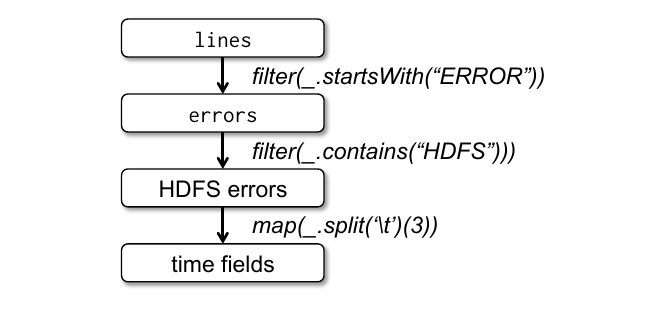

### 2.3 RDD 模型的优势

为了理解 RDD 作为分布式内存抽象的优势，表 1 将它与分布式共享内存（DSM）比较。在 DSM 系统中，应用可以读写全局地址空间中的任意位置。这里的 DSM 不仅包括传统共享内存系统 [24]，也包括应用对共享状态做细粒度写入的其他系统，例如提供共享分布式哈希表的 Piccolo [27] 和分布式数据库。DSM 非常通用，但这种通用性也使其难以在商用集群上高效、容错地实现。

| 方面 | RDD | 分布式共享内存 |
| --- | --- | --- |
| 读取 | 粗粒度或细粒度 | 细粒度 |
| 写入 | 粗粒度 | 细粒度 |
| 一致性 | 很简单（不可变） | 由应用或运行时负责 |
| 故障恢复 | 使用血缘，粒度细且开销低 | 需要 checkpoint 和程序回滚 |
| 缓解慢节点 | 可运行备份任务 | 困难 |
| 工作放置 | 根据数据局部性自动完成 | 由应用负责（运行时通常追求透明） |
| RAM 不足时的行为 | 类似现有数据流系统 | 性能可能因换页而很差 |

**表 1：RDD 与分布式共享内存的比较。**

两者的主要区别是：RDD 只能通过粗粒度转换创建，即“写入”；DSM 则允许读写每个内存位置。RDD 上的读取仍然可以是细粒度的，例如应用可以把 RDD 当作大型只读查找表。这项限制让 RDD 只适用于批量写入的应用，却换来了更高效的容错。具体而言，RDD 不必承担 checkpoint 的日常开销，因为它可由血缘恢复。故障时只需重算丢失分区，而且可在不同节点并行重算，无须回滚整个程序。对于血缘链很长的 RDD，checkpoint 仍可能有益；由于 RDD 不可变，checkpoint 可在后台执行，无须像 DSM 那样为整个应用拍快照。

第二个好处来自 RDD 的不可变性：系统可以像 MapReduce [10] 一样为慢任务运行备份副本，以缓解慢节点（straggler）。DSM 很难采用备份任务，因为同一任务的两个副本会访问相同内存位置并互相干扰更新。

RDD 还有另外两项优势。第一，对 RDD 执行批量操作时，运行时可以根据数据局部性调度任务以改善性能。第二，只要应用主要对 RDD 做扫描式操作，内存不足时性能就会平滑退化；放不进 RAM 的分区可以存入磁盘，其性能将接近现有数据并行系统。

### 2.4 不适合 RDD 的应用

RDD 最适合对数据集所有元素应用同一操作的批处理应用。在这类场景中，系统可以把每个转换高效地记为血缘图中的一步，不必记录大量数据便能恢复丢失分区。RDD 不太适合对共享状态做异步、细粒度更新的应用，如 Web 应用的存储系统或增量式 Web 爬虫。这些应用更适合使用传统更新日志和数据 checkpoint，例如数据库、RAMCloud [25]、Percolator [26] 与 Piccolo [27]。我们的目标是为批量分析提供高效编程模型，把异步应用留给专用系统。

## 3. Spark 编程接口

Spark 使用 Scala [2] 提供 RDD 抽象，其语言集成 API 类似 DryadLINQ [31]。Scala 是运行于 Java VM 的静态类型函数式语言。我们选择它是因为它兼具简洁性——便于交互使用——和静态类型带来的效率。不过，RDD 抽象本身并不要求函数式语言。

开发者编写一个连接工作节点集群的驱动程序，如图 2 所示。驱动程序定义一个或多个 RDD 并在其上调用动作；驱动端的 Spark 代码还会跟踪 RDD 血缘。工作进程长期运行，可以跨操作在 RAM 中保存 RDD 分区。

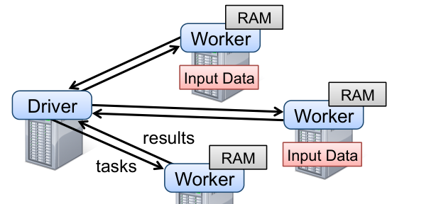

如 §2.2.1 的日志挖掘示例所示，用户通过闭包——即函数字面量——给 `map` 等 RDD 操作传参。Scala 把每个闭包表示为 Java 对象，这些对象可以序列化并载入其他节点，从而经网络传递闭包。Scala 还把闭包绑定的变量保存为 Java 对象的字段。例如，`var x = 5; rdd.map(_ + x)` 会给 RDD 的每个元素加 5。Spark 在闭包创建时保存它，所以即使以后 `x` 改变，该 `map` 仍始终加 5。

RDD 本身是按元素类型参数化的静态类型对象，例如 `RDD[Int]` 表示整数 RDD。由于 Scala 支持类型推断，本文大多数示例省略类型。

虽然这种 Scala API 在概念上很简单，我们仍须使用反射 [33] 绕过 Scala 闭包对象的一些问题。为了让 Spark 能从 Scala 解释器使用，也需要更多改动，详见 §5.2。不过，我们不必修改 Scala 编译器。

### 3.1 Spark 中的 RDD 操作

表 2 列出 Spark 的主要 RDD 转换和动作。类型参数写在方括号中。转换是定义新 RDD 的惰性操作；动作则启动计算，向程序返回一个值或把数据写到外部存储。`join` 等操作只适用于键值对 RDD。函数名遵从 Scala 和其他函数式语言的 API：`map` 是一对一映射，`flatMap` 则将每个输入映射为一个或多个输出，类似 MapReduce 的 map。

| 类别 | 操作签名 | 含义 |
| --- | --- | --- |
| 转换 | `map(f: T => U): RDD[T] => RDD[U]` | 对每个元素做一对一映射 |
| 转换 | `filter(f: T => Bool): RDD[T] => RDD[T]` | 保留满足谓词的元素 |
| 转换 | `flatMap(f: T => Seq[U]): RDD[T] => RDD[U]` | 每个输入产生零到多个输出 |
| 转换 | `sample(fraction: Float): RDD[T] => RDD[T]` | 确定性采样 |
| 转换 | `groupByKey(): RDD[(K,V)] => RDD[(K,Seq[V])]` | 按键分组 |
| 转换 | `reduceByKey(f: (V,V) => V): RDD[(K,V)] => RDD[(K,V)]` | 按键聚合 |
| 转换 | `union(): (RDD[T], RDD[T]) => RDD[T]` | 并集，不去重 |
| 转换 | `join(): (RDD[(K,V)], RDD[(K,W)]) => RDD[(K,(V,W))]` | 按键连接 |
| 转换 | `cogroup(): (RDD[(K,V)], RDD[(K,W)]) => RDD[(K,(Seq[V],Seq[W]))]` | 两个键值 RDD 协同分组 |
| 转换 | `crossProduct(): (RDD[T], RDD[U]) => RDD[(T,U)]` | 笛卡尔积 |
| 转换 | `mapValues(f: V => W): RDD[(K,V)] => RDD[(K,W)]` | 映射值并保留分区方式 |
| 转换 | `sort(c: Comparator[K]): RDD[(K,V)] => RDD[(K,V)]` | 按比较器排序 |
| 转换 | `partitionBy(p: Partitioner[K]): RDD[(K,V)] => RDD[(K,V)]` | 按指定分区器重新分区 |
| 动作 | `count(): RDD[T] => Long` | 返回元素数 |
| 动作 | `collect(): RDD[T] => Seq[T]` | 把元素集合返回驱动程序 |
| 动作 | `reduce(f: (T,T) => T): RDD[T] => T` | 聚合所有元素 |
| 动作 | `lookup(k: K): RDD[(K,V)] => Seq[V]` | 在哈希/范围分区 RDD 中按键查找 |
| 动作 | `save(path: String)` | 把 RDD 输出到 HDFS 等存储系统 |

**表 2：Spark 中 RDD 可用的转换和动作。`Seq[T]` 表示 T 类型的元素序列。**

除这些算子外，用户还可要求持久化 RDD，取得由 `Partitioner` 类表示的 RDD 分区顺序，并据此对另一数据集分区。`groupByKey`、`reduceByKey`、`sort` 等操作会自动得到哈希或范围分区的 RDD。

### 3.2 示例应用

下面用两个迭代应用——逻辑回归和 PageRank——补充 §2.2.1 的数据挖掘示例。PageRank 还展示了控制 RDD 分区如何改善性能。

#### 3.2.1 逻辑回归

许多机器学习算法本质上是迭代式的，因为它们反复运行梯度下降等优化过程以最大化某个函数。把数据保留在内存中能使它们快得多。下面的程序实现常见分类算法逻辑回归 [14]：它寻找一个能最好地区分两组点——例如垃圾邮件与非垃圾邮件——的超平面 $w$。算法从随机 $w$ 开始，每轮对全部数据求一个关于 $w$ 的函数之和，再沿改进方向移动 $w$。

```scala
val points = spark.textFile(...)
                  .map(parsePoint).persist()
var w = // 随机初始向量
for (i <- 1 to ITERATIONS) {
  val gradient = points.map { p =>
    p.x * (1/(1+exp(-p.y*(w dot p.x))) - 1) * p.y
  }.reduce((a,b) => a+b)
  w -= gradient
}
```

首先，将文本文件的每一行解析为 `Point` 对象，并把 `map` 的结果定义为持久化 RDD `points`。随后，在 `points` 上反复执行 `map` 与 `reduce`，对当前 $w$ 的函数求和，从而得到每一步的梯度。跨迭代把 `points` 保存在内存中可获得 20 倍加速，见 §6.1。

#### 3.2.2 PageRank

PageRank [6] 中的数据共享模式更复杂。算法通过累加链接到某个文档的其他文档所贡献的值，迭代更新每个文档的排名。每轮中，每个文档向邻居发送 $r/n$ 的贡献，其中 $r$ 是自身排名、$n$ 是邻居数；随后把自己的排名更新为：

$$
\alpha/N + (1-\alpha)\sum_i c_i,
$$

其中求和项为该文档收到的各个贡献，$N$ 是文档总数。Spark 程序如下：

```scala
// 将图载入为 (URL, outlinks) 对组成的 RDD
val links = spark.textFile(...).map(...).persist()
var ranks = // (URL, rank) 对组成的 RDD
for (i <- 1 to ITERATIONS) {
  // 构建 (targetURL, float) 对组成的 RDD，
  // 内容为每个页面发出的贡献
  val contribs = links.join(ranks).flatMap {
    (url, (links, rank)) =>
      links.map(dest => (dest, rank/links.size))
  }
  // 按 URL 汇总贡献并计算新排名
  ranks = contribs.reduceByKey((x,y) => x+y)
                  .mapValues(sum => a/N + (1-a)*sum)
}
```

该程序产生图 3 所示的 RDD 血缘图。每轮都会基于上一轮的 `contribs`、`ranks` 和静态 `links` 创建一个新的 `ranks` 数据集。虽然 RDD 不可变，程序变量 `ranks` 与 `contribs` 在每轮会指向不同 RDD。

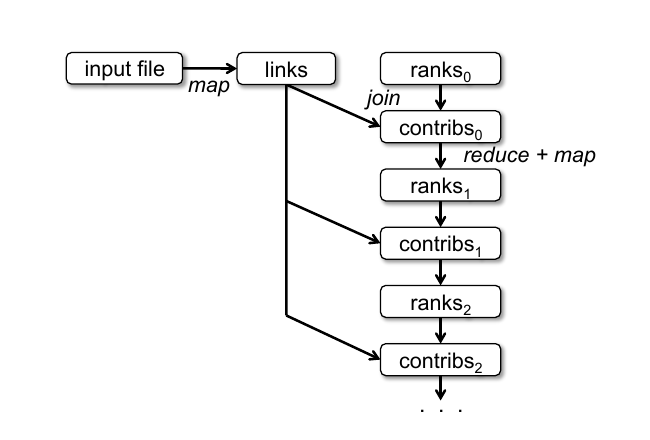

这张图的一个显著特征是血缘随迭代数增长。迭代很多时，可能需要可靠复制某些版本的 `ranks`，以缩短故障恢复时间 [20]；用户可用带 `RELIABLE` 标志的 `persist` 实现。不过，`links` 无须复制，因为它的分区可通过对输入文件块重新运行 `map` 高效重建。`links` 通常远大于 `ranks`，因为每个文档有许多链接，却只有一个排名数值；相较对程序全部内存状态做 checkpoint，使用血缘恢复它能节省时间。

最后，可以通过控制 RDD 分区优化 PageRank 通信。如果为 `links` 指定分区方式——例如按 URL 把链接列表哈希分区到各节点——便可让 `ranks` 使用相同分区，保证 `links` 与 `ranks` 的 `join` 无须通信，因为每个 URL 的排名和链接列表位于同一机器。也可编写自定义 `Partitioner`，把彼此链接的页面放在一起，例如按域名划分 URL。这两项优化都可在定义 `links` 时调用 `partitionBy` 表达：

```scala
links = spark.textFile(...).map(...)
             .partitionBy(myPartFunc).persist()
```

完成首次调用后，`links` 与 `ranks` 的连接会自动把每个 URL 的贡献聚合到存有其链接列表的机器，在那里计算新排名，再与链接列表连接。跨迭代保持一致分区正是 Pregel 等专用框架的主要优化之一；RDD 让用户可以直接表达这一目标。

## 4. RDD 的表示

把 RDD 设计为抽象的一项挑战，是选择一种能跨多种转换跟踪血缘的表示。理想的 RDD 系统应提供尽可能丰富的转换算子——如表 2 所列——并允许用户任意组合。我们提出一种简单的图表示，在 Spark 中用它支持大量转换，而无须让调度器为每种转换加入特殊逻辑，从而大幅简化系统设计。

概括而言，每个 RDD 都通过一个公共接口暴露五类信息：数据集的原子组成部分——分区集合；对父 RDD 的依赖集合；根据父 RDD 计算当前数据集的函数；分区模式元数据；以及数据放置信息。例如，表示 HDFS 文件的 RDD 为文件的每个块建立一个分区，并知道各块位于哪些机器；对这个 RDD 做 `map` 得到的结果拥有相同分区，但在计算元素时会把映射函数应用到父 RDD 数据。

| 操作 | 含义 |
| --- | --- |
| `partitions()` | 返回 `Partition` 对象列表 |
| `preferredLocations(p)` | 返回因数据局部性而能更快访问分区 `p` 的节点列表 |
| `dependencies()` | 返回依赖列表 |
| `iterator(p, parentIters)` | 给定父分区迭代器，计算分区 `p` 的元素 |
| `partitioner()` | 返回 RDD 是否采用哈希/范围分区的元数据 |

**表 3：Spark 用于表示 RDD 的接口。**

设计该接口时最重要的问题，是如何表示 RDD 之间的依赖。我们发现，把依赖分成两类既充分又有用：窄依赖（narrow dependency）中，父 RDD 的每个分区最多被一个子 RDD 分区使用；宽依赖（wide dependency）中，多个子分区可能依赖同一个父分区。例如，`map` 产生窄依赖；`join` 通常产生宽依赖，除非两个父 RDD 已按同一方式哈希分区。图 4 给出更多示例。


这一区分有两个作用。第一，窄依赖允许在一个集群节点上流水线执行；该节点可计算所有所需父分区。例如，`map` 后接 `filter` 可逐元素执行。宽依赖则要求全部父分区的数据可用，并通过类似 MapReduce 的操作在节点间 shuffle。第二，节点故障后，窄依赖恢复更高效：只需重算丢失的父分区，而且可以在不同节点并行完成。宽依赖血缘中，一台节点故障可能使某个 RDD 的所有祖先都丢失一部分分区，因而需要完整重执行。

凭借这一公共接口，Spark 中多数转换只需不到 20 行代码。甚至 Spark 新用户也能在不了解调度器细节的情况下实现采样和多种连接等新转换。下面概述几个 RDD 实现：

- **HDFS 文件。** 示例中的输入 RDD 都是 HDFS 文件。`partitions` 为每个文件块返回一个分区，块偏移量存于相应 `Partition` 对象；`preferredLocations` 给出块所在节点；`iterator` 读取该块。
- **`map`。** 对任意 RDD 调用 `map` 会返回 `MappedRDD` 对象。它与父 RDD 具有相同分区和首选位置，但其 `iterator` 方法会把传入的映射函数应用于父记录。
- **`union`。** 两个 RDD 的 `union` 返回一个分区集合为两者分区并集的 RDD。每个子分区通过对相应父分区的窄依赖计算。这里的 `union` 不删除重复值。
- **`sample`。** 采样类似映射，不过 RDD 会为每个分区保存随机数生成器种子，以确定性地采样父记录。
- **`join`。** 连接两个 RDD 可能产生两个窄依赖——两者都用同一分区器做了哈希/范围分区；也可能产生两个宽依赖；还可能两者混合——一个父 RDD 有分区器，另一个没有。无论哪种情况，输出 RDD 都有分区器，或继承父 RDD 的，或采用默认哈希分区器。

## 5. 实现

Spark 由约 14,000 行 Scala 代码实现，运行在 Mesos 集群管理器 [17] 之上，因此可与 Hadoop、MPI 等应用共享资源。每个 Spark 程序作为独立 Mesos 应用运行，拥有自己的驱动端（master）和工作进程；不同应用之间的资源共享由 Mesos 管理。

Spark 使用 Hadoop 现有输入插件 API，可从任意 Hadoop 输入源读取数据，例如 HDFS 或 HBase；它运行在未经修改的 Scala 上。下面概述系统中几项技术上较有意思的部分：作业调度器（§5.1）、支持交互使用的 Spark 解释器（§5.2）、内存管理（§5.3）和 checkpoint（§5.4）。

### 5.1 作业调度

Spark 调度器使用 §4 所述的 RDD 表示。总体上它类似 Dryad [19] 的调度器，但还会考虑持久化 RDD 的哪些分区已在内存中。

用户在 RDD 上运行动作——如 `count` 或 `save`——时，调度器检查该 RDD 的血缘图，构建待执行 stage 的有向无环图（DAG），如图 5 所示。每个 stage 尽可能包含更多以窄依赖流水线化的转换；需要进行宽依赖 shuffle 的地方构成 stage 边界，已经算出的分区也可形成边界并短路父 RDD 的计算。随后，调度器为各 stage 启动任务来计算缺失分区，直至得到目标 RDD。

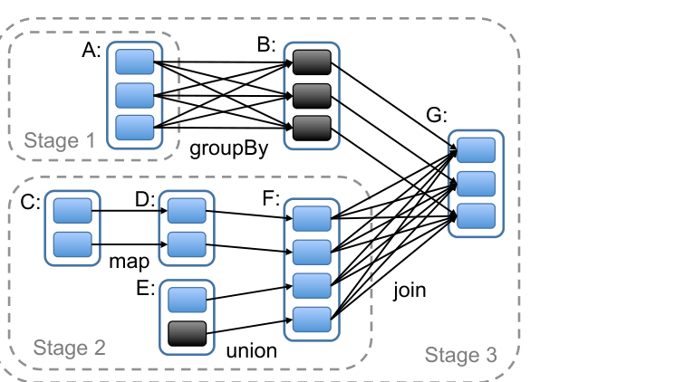

调度器使用延迟调度 [32]，依据数据局部性给机器分配任务。若任务所需分区已在某节点内存中，就把任务发往该节点；否则，如果相应 RDD 给出了分区首选位置——例如 HDFS 文件——便发往这些节点。对宽依赖，即 shuffle 依赖，Spark 当前会在持有父分区的节点上物化中间记录，类似 MapReduce 物化 map 输出，以简化故障恢复。

任务失败时，只要该 stage 的父数据仍可用，系统就在另一节点重跑任务。若某些 stage 已不可用——例如 shuffle 的“map 侧”输出丢失——则重新提交任务，并行计算缺失分区。系统尚不能容忍调度器故障，不过复制 RDD 血缘图并不困难。

目前，Spark 中所有计算都响应驱动程序调用的动作而运行。我们也在实验让集群任务——例如 `map`——调用 `lookup`，按键随机访问哈希分区 RDD 的元素。此时，若所需分区缺失，任务需要通知调度器计算它。

### 5.2 解释器集成

Scala 包含类似 Ruby、Python 的交互式 shell。既然内存数据能带来很低延迟，我们希望用户可以从解释器交互运行 Spark，查询大型数据集。

Scala 解释器通常为用户输入的每一行编译一个类，将其载入 JVM，再调用其中的函数。这个类包含一个单例对象，保存该行的变量或函数，并在初始化方法中执行该行代码。例如，用户先输入 `var x = 5`，再输入 `println(x)`，解释器会定义一个包含 `x` 的 `Line1` 类，并把第二行编译为 `println(Line1.getInstance().x)`。

我们对解释器做了两项修改：

1. **类传送。** 为使工作节点能取得每一行所生成类的字节码，我们让解释器通过 HTTP 提供这些类。
2. **修改代码生成。** 通常，每行代码创建的单例对象通过相应类的静态方法访问。若序列化一个引用前一行变量的闭包——如图 6 中的 `Line1.x`——Java 不会沿对象图继续跟踪并传送包裹 `x` 的 `Line1` 实例，因此工作节点得不到 `x`。我们修改代码生成逻辑，使之直接引用每个行对象的实例。

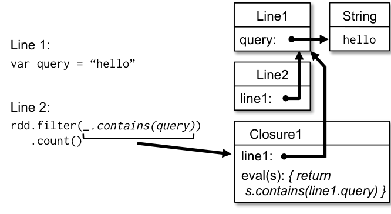

实践中，Spark 解释器很适合处理研究中得到的大型跟踪数据、探索 HDFS 中的数据集。我们还计划用它交互运行 SQL 等更高层查询语言。

### 5.3 内存管理

Spark 为持久化 RDD 提供三种存储选项：（1）在内存中保存为反序列化 Java 对象；（2）在内存中保存为序列化数据；（3）保存在磁盘。第一种最快，因为 Java VM 可原生访问每个 RDD 元素。第二种允许空间有限时选用比 Java 对象图更节省内存的表示，代价是性能下降；具体代价取决于应用对每字节数据执行多少计算，轻量处理时最多可达 2 倍。第三种适合太大而无法放入 RAM、但每次使用时重新计算又很昂贵的 RDD。

为管理有限内存，Spark 在 RDD 级别使用 LRU 淘汰策略。当新算出一个 RDD 分区却没有足够存储空间时，系统从最近最少访问的 RDD 中淘汰一个分区；但若它与新分区属于同一 RDD，则保留旧分区，避免同一 RDD 的分区循环进出内存。这一点很重要，因为多数操作会对整个 RDD 运行任务，已经在内存中的分区很可能很快再次使用。该默认策略在目前全部应用中都表现良好；同时，用户还可通过每个 RDD 的“持久化优先级”进一步控制。

目前，同一集群上的每个 Spark 实例拥有各自独立的内存空间。未来我们计划研究通过统一内存管理器在多个 Spark 实例之间共享 RDD。

### 5.4 Checkpoint 支持

尽管故障后总能用血缘恢复 RDD，血缘链很长时恢复可能耗时，因此把某些 RDD checkpoint 到稳定存储会有帮助。

一般而言，checkpoint 适合血缘图很长且包含宽依赖的 RDD，例如 PageRank 示例（§3.2.2）的排名数据集。在这种情况下，一台节点故障可能使每个父 RDD 都丢失一部分数据，需要完整重算 [20]。相反，对稳定存储中的数据只有窄依赖的 RDD——如逻辑回归的 `points`（§3.2.1）与 PageRank 的链接列表——可能永远不值得 checkpoint。节点故障时，这些 RDD 的丢失分区可在其他节点并行重算，其成本只是复制整个 RDD 的一小部分。

Spark 当前通过 `persist` 的 `REPLICATE` 标志提供 checkpoint API，但由用户决定 checkpoint 哪些数据。我们也在研究自动 checkpoint。调度器知道每个数据集的大小和第一次计算耗时，理论上可以选择一组最优 RDD 做 checkpoint，使系统恢复时间最短 [30]。

最后，RDD 的只读性质使 checkpoint 比一般共享内存更简单。系统无须担心一致性，可以在后台写出 RDD，不必暂停程序或运行分布式快照协议。

## 6. 评估

我们通过 Amazon EC2 上的一系列实验及用户应用基准评估 Spark 与 RDD。结果归纳如下：

- 在迭代式机器学习和图应用中，Spark 最多比 Hadoop 快 20 倍；加速来自把数据以 Java 对象保存在内存中，避免 I/O 和反序列化。
- 用户编写的应用具有良好的性能与扩展性；其中一份原先运行在 Hadoop 上的分析报告被 Spark 加速了 40 倍。
- 节点故障时，Spark 只重建丢失的 RDD 分区，因而可以快速恢复。
- Spark 可用 5–7 秒延迟交互查询 1 TB 数据集。

我们先将迭代机器学习应用（§6.1）和 PageRank（§6.2）与 Hadoop 比较，再评估 Spark 的故障恢复（§6.3）和数据集放不进内存时的行为（§6.4），最后讨论用户应用（§6.5）和交互式数据挖掘（§6.6）。若无特别说明，测试使用 `m1.xlarge` EC2 节点，每台 4 核、15 GB RAM；存储使用块大小 256 MB 的 HDFS。每次测试前都清除操作系统缓冲区缓存，以准确测量 I/O 成本。

### 6.1 迭代式机器学习应用

我们实现逻辑回归和 k-means 两个迭代机器学习应用，比较三套系统：

- **Hadoop：** Hadoop 0.20.2 稳定版。
- **HadoopBinMem：** 第一轮把输入转换成低开销二进制格式，后续轮次不再解析文本，并把数据存入内存 HDFS 实例。
- **Spark：** 本文的 RDD 实现。

两个算法都在 100 GB 数据集上运行 10 轮，机器数为 25–100。二者的主要区别是每字节数据所需计算量：k-means 的迭代时间以计算为主；逻辑回归计算密度较低，因此对反序列化和 I/O 更敏感。典型学习算法需几十轮才能收敛，所以我们分别报告第一轮与后续轮次。结果显示，通过 RDD 共享数据显著加速了后续迭代。

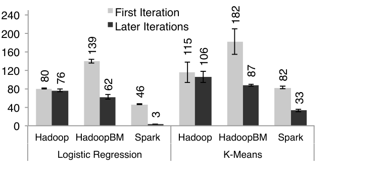

图 7 的数值如下（单位：秒）：

| 应用 | 系统 | 第一轮 | 后续轮次 |
| --- | --- | ---: | ---: |
| 逻辑回归 | Hadoop | 80 | 76 |
| 逻辑回归 | HadoopBinMem | 139 | 62 |
| 逻辑回归 | Spark | 46 | 3 |
| k-means | Hadoop | 115 | 106 |
| k-means | HadoopBinMem | 182 | 87 |
| k-means | Spark | 82 | 33 |

**第一轮。** 三个系统都从 HDFS 读取文本输入。图 7 的浅色柱显示，所有实验中 Spark 都略快于 Hadoop，差异来自 Hadoop master 与 worker 之间心跳协议的信令开销。HadoopBinMem 最慢，因为它额外运行一个 MapReduce 作业把数据转成二进制，还要经网络把数据写入带复制的内存 HDFS 实例。

**后续轮次。** 图 7 给出后续轮次平均时间，图 8 展示其随集群规模变化的情况。逻辑回归在 100 台机器上，Spark 分别比 Hadoop 和 HadoopBinMem 快 25.3 倍与 20.7 倍。计算更密集的 k-means 中，Spark 仍获得 1.9–3.2 倍加速。

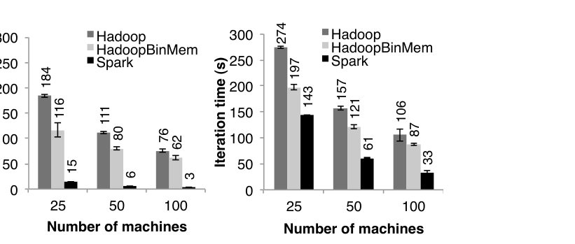

| 应用 | 机器数 | Hadoop（秒） | HadoopBinMem（秒） | Spark（秒） |
| --- | ---: | ---: | ---: | ---: |
| 逻辑回归 | 25 | 184 | 116 | 15 |
| 逻辑回归 | 50 | 111 | 80 | 6 |
| 逻辑回归 | 100 | 76 | 62 | 3 |
| k-means | 25 | 274 | 197 | 143 |
| k-means | 50 | 157 | 121 | 61 |
| k-means | 100 | 106 | 87 | 33 |

**理解加速来源。** 即使 HadoopBinMem 把二进制数据放在内存中，Spark 仍快约 20 倍，令我们意外。HadoopBinMem 使用 Hadoop 标准二进制格式 `SequenceFile`、256 MB 大块，并强制把 HDFS 数据目录置于内存文件系统，但仍受三类因素拖累：（1）Hadoop 软件栈的最低开销；（2）HDFS 提供数据时的开销；（3）把二进制记录转换为可用内存 Java 对象的反序列化成本。

为测量第一项，我们运行空操作 Hadoop 作业，仅完成作业设置、任务启动和清理就至少需要 25 秒。对于第二项，HDFS 在提供每个块时会执行多次内存复制和一次校验和。对于第三项，我们在单机上用 256 MB 输入运行逻辑回归微基准，比较来自 HDFS 和内存本地文件的文本、二进制输入：HDFS 路径体现其软件栈开销，本地内存文件则允许内核高效地把数据交给程序。

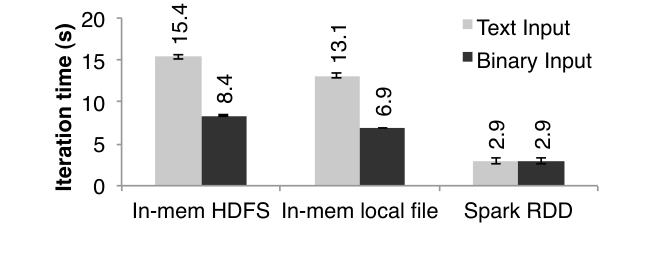

图 9 中，内存 HDFS 的文本/二进制输入分别为 15.4 秒和 8.4 秒；内存本地文件分别为 13.1 秒和 6.9 秒；Spark RDD 两者均约 2.9 秒。内存 HDFS 与本地文件的差异说明，即使数据就在本机内存中，经 HDFS 读取仍引入约 2 秒开销；文本与二进制之差说明解析开销约 7 秒；即便从内存文件读取，把预解析二进制转换为 Java 对象仍需约 3 秒，几乎与逻辑回归本身同样昂贵。Spark 直接把 RDD 元素作为 Java 对象保存在内存中，避开了全部这些开销。

### 6.2 PageRank

我们用 54 GB Wikipedia dump 比较 Spark 与 Hadoop 的 PageRank 性能。算法处理约 400 万篇文章构成的链接图，共运行 10 轮。图 10 表明，仅使用内存存储，Spark 在 30 节点上就比 Hadoop 快 2.4 倍；再按 §3.2.2 控制 RDD 分区，使其跨轮次保持一致，加速提高到 7.4 倍。扩展到 60 节点时结果也近乎线性。

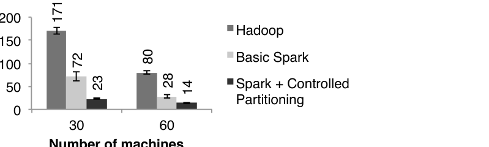

具体地，30 节点上 Hadoop、基础 Spark、受控分区 Spark 分别需要 171、72、23 秒；60 节点上三者分别为 80、28、14 秒。我们也评估了用 §7.1 所述 Spark 上 Pregel 实现编写的 PageRank，其迭代时间与图 10 接近，但每轮约多 4 秒，因为 Pregel 还运行一个额外操作，让顶点“投票”决定作业是否结束。

### 6.3 故障恢复

我们在 k-means 应用中评估节点故障后通过血缘重建 RDD 分区的成本。图 11 比较 75 节点集群上 10 轮 k-means 的正常运行与故障运行；正常情况下每轮有 400 个任务处理 100 GB 数据，故障场景则在第 6 轮开始时杀死一台机器。

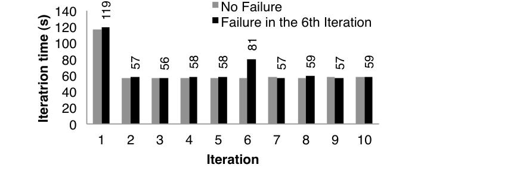

前 5 轮结束前，迭代时间约 58 秒。第 6 轮杀死一台机器后，该机器上正在运行的任务及保存的 RDD 分区一同丢失。Spark 在其他机器并行重跑这些任务，重新读取相应输入数据并经血缘重建 RDD，使该轮时间升到 80 秒左右（图中故障运行第 6 轮为 81 秒）；丢失分区重建后，迭代时间又降回约 58 秒。故障曲线各轮标注值依次为 119、57、56、58、58、81、57、59、57、59 秒；第一轮较慢是首次读取输入。

基于 checkpoint 的恢复机制很可能需要重跑至少若干轮，具体取决于 checkpoint 频率。系统还须经网络复制应用的 100 GB 工作集——即由文本输入转换的二进制数据；若在 RAM 中复制，要消耗 Spark 两倍内存，否则就得等待把 100 GB 写入磁盘。相比之下，示例中所有 RDD 的血缘图都小于 10 KB。

### 6.4 内存不足时的行为

此前实验保证每台机器都有足够内存存放跨迭代的全部 RDD。本实验限制 Spark 在每台机器上只能使用一定比例的内存存储 RDD，观察数据放不下时的表现。图 12 给出 25 台机器运行 100 GB 逻辑回归的结果：内存分别容纳数据集的 0%、25%、50%、75%、100% 时，每轮用时为 68.8、58.1、40.7、29.7、11.5 秒。存储空间减少时，性能平滑退化。

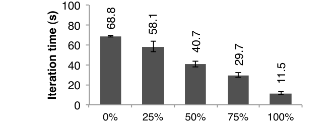

### 6.5 基于 Spark 构建的用户应用

**内存分析。** 视频分发公司 Conviva 使用 Spark 加速原先在 Hadoop 上运行的多份数据分析报告。例如，一份报告通过一系列 Hive [1] 查询为客户计算各种统计量。这些查询都处理同一数据子集——符合客户过滤条件的记录——但要按不同字段做平均值、百分位数和 `COUNT DISTINCT` 聚合，因而原先需要多个独立 MapReduce 作业。公司把查询改用 Spark 实现，只把各查询共享的数据子集载入 RDD 一次，报告速度提高 40 倍。压缩后 200 GB 的一份报告在 Hadoop 集群上需要 20 小时，现在只用两台 Spark 机器便能在 30 分钟内完成。Spark 程序只需 96 GB RAM，因为 RDD 仅保存符合客户过滤条件的行和列，并不保存整个解压文件。

**交通建模。** 伯克利 Mobile Millennium 项目 [18] 的研究人员用 Spark 并行化一个学习算法，从零散汽车 GPS 测量推断道路拥堵。源数据包含某都市区有 10,000 条路段的路网，以及装有 GPS 的车辆产生的 600,000 个点到点行程时间样本；每条路径的行程时间可能覆盖多个路段。系统利用交通模型估计通过各个路段的时间，并用期望最大化（EM）算法训练模型；每轮重复两个 `map` 和 `reduceByKey` 步骤。每台机器 4 核时，应用从 20 节点扩展到 80 节点近乎线性：图 13(a) 的每轮时间在 20、40、80 台机器上分别为 1521、820、422 秒。

**Twitter 垃圾链接分类。** 伯克利 Monarch 项目 [29] 使用 Spark 识别 Twitter 消息中的链接垃圾。它实现了与 §6.1 类似的逻辑回归分类器，但用分布式 `reduceByKey` 并行求梯度向量之和。图 13(b) 给出在 50 GB 数据子集上训练分类器的扩展结果；数据含 250,000 个 URL，每个 URL 有 107 个与页面网络及内容属性有关的特征/维度。在 20、40、80 台机器上，每轮分别为 70.6、38.6、27.6 秒。由于每轮固定通信成本较高，其扩展不如交通建模接近线性。

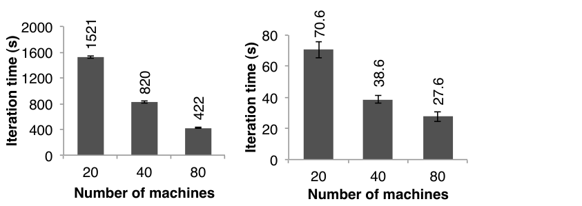

### 6.6 交互式数据挖掘

为展示 Spark 交互查询大型数据集的能力，我们用它分析 1 TB Wikipedia 页面浏览日志，即两年数据。实验使用 100 台 `m2.4xlarge` EC2 实例，每台 8 核、68 GB RAM。三个查询分别求：（1）全部页面的总浏览量；（2）标题与给定单词精确匹配的页面浏览量；（3）标题部分匹配给定单词的页面浏览量。每个查询都扫描全部输入数据。

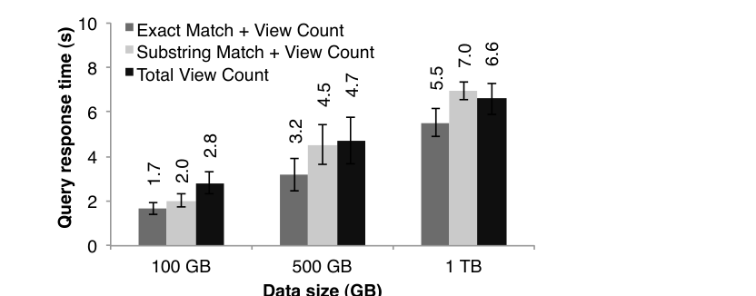

图 14 给出完整数据集、一半数据和十分之一数据的响应时间。输入为 100 GB 时，精确匹配、子串匹配、总浏览量查询分别需 1.7、2.0、2.8 秒；500 GB 时为 3.2、4.5、4.7 秒；1 TB 时为 5.5、7.0、6.6 秒。即使达到 1 TB，Spark 查询仍只需 5–7 秒，比磁盘数据快一个数量级以上；例如从磁盘查询同一 1 TB 文件需要 170 秒。这说明 RDD 使 Spark 成为强大的交互式数据挖掘工具。

## 7. 讨论

RDD 因不可变和粗粒度转换而看似接口受限，但实践证明它适合广泛应用。尤其是，RDD 能表达数量惊人的集群编程模型，而这些模型此前都作为独立框架提出。用户由此可以在一个程序中组合不同模型——例如先用 MapReduce 构图，再在其上运行 Pregel——并在它们之间共享数据。本节讨论 RDD 能表达哪些模型，以及为何它如此普适（§7.1）；此外还讨论血缘信息的另一项潜在收益：帮助跨模型调试（§7.2）。

### 7.1 表达现有编程模型

RDD 能高效表达多种此前分别提出的集群编程模型。这里的“高效”不仅表示 RDD 程序能产生与这些模型相同的输出，也表示它能覆盖这些框架的优化，包括把特定数据保留在内存、通过分区减少通信，以及高效从故障中恢复。可表达的模型包括：

- **MapReduce。** 可用 Spark 的 `flatMap` 和 `groupByKey` 表达；如果有 combiner，则可用 `reduceByKey`。
- **DryadLINQ。** DryadLINQ 在通用 Dryad 运行时上提供比 MapReduce 更广的算子集合，但这些算子都是批量算子，直接对应 Spark 中的 RDD 转换，如 `map`、`groupByKey`、`join`。
- **SQL。** 与 DryadLINQ 表达式一样，SQL 查询对记录集合执行数据并行操作。
- **Pregel。** Google Pregel [22] 是面向迭代图应用的专用模型，表面上与其他系统面向集合的模型差异很大。Pregel 程序运行一系列协调的“超级步”（superstep）。每一步中，图中每个顶点运行一个用户函数，更新顶点状态、改变图拓扑，并向其他顶点发送供下一超级步使用的消息。它可以表达最短路径、二分匹配和 PageRank 等许多图算法。

  RDD 能实现 Pregel 的关键观察是：Pregel 每轮对所有顶点应用同一个用户函数。因此，可把每轮顶点状态存为一个 RDD，用批量转换 `flatMap` 应用该函数并生成消息 RDD，再将消息 RDD 与顶点状态连接以完成消息交换。同样重要的是，RDD 能像 Pregel 一样把顶点状态留在内存，通过控制分区减少通信，并在故障时局部恢复。我们在 Spark 上把 Pregel 实现为 200 行代码的库，细节见 [33]。
- **迭代 MapReduce。** HaLoop [7]、Twister [11] 等系统提供迭代 MapReduce 模型，用户交给系统一系列要循环执行的 MapReduce 作业。它们让数据跨轮次保持一致分区，Twister 还能把数据保留在内存。这两项优化都很容易用 RDD 表达；我们用 Spark 把 HaLoop 实现为 200 行代码的库。
- **批量流处理。** 一些近期增量处理系统 [21, 15, 4] 面向定期用新数据更新结果的应用。例如，每 15 分钟更新广告点击统计的应用，应能把上一 15 分钟窗口的中间状态与新日志合并。这些系统执行类似 Dryad 的批量操作，但把应用状态保存在分布式文件系统。将中间状态放入 RDD 可加快处理。

**为何 RDD 有这样的表达能力？** 原因是 RDD 的限制对许多并行应用影响很小。虽然 RDD 只能通过批量转换创建，但许多并行程序本来就对大量记录应用相同操作，因而很容易表达。RDD 不可变也不是障碍，因为可以创建多个 RDD 表示同一数据集的不同版本。事实上，今天许多 MapReduce 应用本就运行在 HDFS 等不允许原地更新文件的文件系统上。

最后一个问题是，为何早先框架没有提供相同的通用性。我们认为，这些系统各自探索 MapReduce 和 Dryad 处理不好的某个具体问题，例如迭代，却没有发现这些问题共同的根源是缺少数据共享抽象。

### 7.2 利用 RDD 调试

RDD 最初为了容错而设计为可确定性重算，这一性质也有助于调试。记录作业期间创建的 RDD 血缘后，可以：（1）日后重建这些 RDD，让用户交互查询；（2）在单进程调试器中重跑作业中的任意任务，只需重算它依赖的 RDD 分区。

传统通用分布式系统的重放调试器 [13] 必须捕获或推断多节点事件顺序；RDD 方法只需记录血缘图，几乎没有记录开销。若用户函数中存在非确定行为——例如非确定 `map`——RDD 调试器不会像这些系统那样重放该行为，但至少可通过数据校验和报告它。我们正在基于这些思路开发 Spark 调试器 [33]。

## 8. 相关工作

**集群编程模型。** 相关工作可分为几类。第一，MapReduce [10]、Dryad [19]、Ciel [23] 等数据流模型提供丰富的数据处理算子，却通过稳定存储共享数据。RDD 避免数据复制、I/O 和序列化，是比稳定存储更高效的数据共享抽象。即便让 MapReduce/Dryad 运行在 RAMCloud [25] 等内存数据存储上，仍需数据复制和序列化；对某些应用而言，这些成本仍然很高，如 §6.1 所示。

第二，DryadLINQ [31]、FlumeJava [8] 等数据流系统的高层编程接口提供语言集成 API，用户通过 `map`、`join` 等算子操作“并行集合”。不过，这些系统的并行集合要么表示磁盘文件，要么只是表达查询计划的临时数据集。它们会流水线执行同一查询中的算子，例如连续两个 `map`，却无法跨查询高效共享数据。Spark API 采用并行集合模型是因为它使用方便；我们并不声称语言集成接口本身具有新颖性。创新在于用 RDD 作为该接口背后的存储抽象，使它能支持广泛得多的应用。

第三，一些系统为需要数据共享的特定应用提供高层接口。Pregel [22] 支持迭代图应用，Twister [11] 和 HaLoop [7] 是迭代 MapReduce 运行时。但它们只针对各自支持的计算模式隐式共享数据，没有提供一种通用抽象，让用户任选数据在任选操作之间共享。例如，用户不能用 Pregel 或 Twister 先把数据集载入内存，再决定运行什么查询。RDD 显式提供分布式存储抽象，因此能支持交互式数据挖掘等专用系统无法表达的应用。

最后，一些系统暴露共享可变状态，允许用户执行内存计算。例如 Piccolo [27] 让用户运行并行函数，读写分布式哈希表单元；DSM 系统 [24] 和 RAMCloud [25] 等键值存储也提供类似模型。RDD 与它们有两点不同。第一，RDD 提供基于 `map`、`sort`、`join` 等算子的高层接口，Piccolo 和 DSM 的接口则只是读取和更新表单元。第二，Piccolo 与 DSM 通过 checkpoint 和回滚恢复；在许多应用中，这比 RDD 基于血缘的策略更昂贵。此外，如 §2.3 所述，RDD 还有缓解慢节点等其他优势。

**缓存系统。** Nectar [12] 通过程序分析 [16] 识别公共子表达式，可跨 DryadLINQ 作业复用中间结果；把这种能力加入 RDD 系统会很有价值。但 Nectar 不提供内存缓存——数据放在分布式文件系统——也不允许用户显式控制持久化哪些数据以及如何分区。Ciel [23] 与 FlumeJava [8] 同样可缓存任务结果，但不提供内存缓存，也不给用户显式缓存控制。

Ananthanarayanan 等人提出给分布式文件系统增加内存缓存，利用数据访问的时间与空间局部性 [3]。这种方案可以更快访问已在文件系统中的数据，但不如 RDD 适合共享应用内部的中间结果，因为应用在 stage 之间仍须把结果写进文件系统。

**血缘。** 捕获数据血缘或溯源信息长期以来都是科学计算和数据库的研究课题，用于解释结果、让他人复现实验，以及在工作流发现缺陷或数据集丢失时重算数据；综述见 [5, 9]。RDD 提供一种并行编程模型，细粒度血缘捕获成本很低，因而可以直接用于故障恢复。

RDD 的血缘恢复也类似 MapReduce、Dryad 在单次计算——即作业——内部使用的恢复机制；后者会跟踪任务 DAG 的依赖。但这些系统在作业结束后丢弃血缘信息，跨计算共享数据仍须使用复制存储。RDD 则把血缘用于跨计算高效持久化内存数据，避免复制和磁盘 I/O。

**关系数据库。** RDD 在概念上类似数据库视图，持久化 RDD 类似物化视图 [28]。然而，与 DSM 一样，数据库通常允许对所有记录做细粒度读写，容错时必须记录操作和数据，还要为一致性承担额外开销；RDD 的粗粒度转换模型不需要这些开销。

## 9. 结论

本文提出弹性分布式数据集（RDD），一种在集群应用中共享数据的高效、通用、容错抽象。RDD 能表达广泛的并行应用，包括许多专为迭代计算提出的编程模型，以及这些模型无法覆盖的新应用。现有集群存储抽象需要复制数据才能容错；RDD 则提供基于粗粒度转换的 API，使数据可以通过血缘高效恢复。

我们在 Spark 中实现了 RDD。迭代应用中 Spark 最多比 Hadoop 快 20 倍，并可交互查询数百 GB 数据。Spark 已在 `spark-project.org` 开源，作为可扩展数据分析和系统研究的平台。

## 致谢

我们感谢首批 Spark 用户，包括 Tim Hunter、Lester Mackey、Dilip Joseph 和 Jibin Zhan；他们在真实应用中试用系统，提出了许多好建议，也在此过程中发现了若干研究挑战。我们还感谢论文 shepherd Ed Nightingale 及评审给出的反馈。

本研究得到 Berkeley AMP Lab 赞助商 Google、SAP、Amazon Web Services、Cloudera、Huawei、IBM、Intel、Microsoft、NEC、NetApp 和 VMWare 的部分支持；还得到 DARPA（合同号 FA8650-11-C-7136）、Google PhD Fellowship，以及加拿大自然科学与工程研究委员会的支持。

## 参考文献

1. Apache Hive. http://hadoop.apache.org/hive.
2. Scala. http://www.scala-lang.org.
3. G. Ananthanarayanan, A. Ghodsi, S. Shenker, and I. Stoica. Disk-locality in datacenter computing considered irrelevant. In *HotOS ’11*, 2011.
4. P. Bhatotia, A. Wieder, R. Rodrigues, U. A. Acar, and R. Pasquin. Incoop: MapReduce for incremental computations. In *ACM SOCC ’11*, 2011.
5. R. Bose and J. Frew. Lineage retrieval for scientific data processing: a survey. *ACM Computing Surveys*, 37:1–28, 2005.
6. S. Brin and L. Page. The anatomy of a large-scale hypertextual web search engine. In *WWW*, 1998.
7. Y. Bu, B. Howe, M. Balazinska, and M. D. Ernst. HaLoop: efficient iterative data processing on large clusters. *Proc. VLDB Endow.*, 3:285–296, September 2010.
8. C. Chambers, A. Raniwala, F. Perry, S. Adams, R. R. Henry, R. Bradshaw, and N. Weizenbaum. FlumeJava: easy, efficient data-parallel pipelines. In *PLDI ’10*. ACM, 2010.
9. J. Cheney, L. Chiticariu, and W.-C. Tan. Provenance in databases: Why, how, and where. *Foundations and Trends in Databases*, 1(4):379–474, 2009.
10. J. Dean and S. Ghemawat. MapReduce: Simplified data processing on large clusters. In *OSDI*, 2004.
11. J. Ekanayake, H. Li, B. Zhang, T. Gunarathne, S.-H. Bae, J. Qiu, and G. Fox. Twister: a runtime for iterative mapreduce. In *HPDC ’10*, 2010.
12. P. K. Gunda, L. Ravindranath, C. A. Thekkath, Y. Yu, and L. Zhuang. Nectar: automatic management of data and computation in datacenters. In *OSDI ’10*, 2010.
13. Z. Guo, X. Wang, J. Tang, X. Liu, Z. Xu, M. Wu, M. F. Kaashoek, and Z. Zhang. R2: an application-level kernel for record and replay. *OSDI’08*, 2008.
14. T. Hastie, R. Tibshirani, and J. Friedman. *The Elements of Statistical Learning: Data Mining, Inference, and Prediction*. Springer Publishing Company, New York, NY, 2009.
15. B. He, M. Yang, Z. Guo, R. Chen, B. Su, W. Lin, and L. Zhou. Comet: batched stream processing for data intensive distributed computing. In *SoCC ’10*.
16. A. Heydon, R. Levin, and Y. Yu. Caching function calls using precise dependencies. In *ACM SIGPLAN Notices*, pages 311–320, 2000.
17. B. Hindman, A. Konwinski, M. Zaharia, A. Ghodsi, A. D. Joseph, R. H. Katz, S. Shenker, and I. Stoica. Mesos: A platform for fine-grained resource sharing in the data center. In *NSDI ’11*.
18. T. Hunter, T. Moldovan, M. Zaharia, S. Merzgui, J. Ma, M. J. Franklin, P. Abbeel, and A. M. Bayen. Scaling the Mobile Millennium system in the cloud. In *SOCC ’11*, 2011.
19. M. Isard, M. Budiu, Y. Yu, A. Birrell, and D. Fetterly. Dryad: distributed data-parallel programs from sequential building blocks. In *EuroSys ’07*, 2007.
20. S. Y. Ko, I. Hoque, B. Cho, and I. Gupta. On availability of intermediate data in cloud computations. In *HotOS ’09*, 2009.
21. D. Logothetis, C. Olston, B. Reed, K. C. Webb, and K. Yocum. Stateful bulk processing for incremental analytics. *SoCC ’10*.
22. G. Malewicz, M. H. Austern, A. J. Bik, J. C. Dehnert, I. Horn, N. Leiser, and G. Czajkowski. Pregel: a system for large-scale graph processing. In *SIGMOD*, 2010.
23. D. G. Murray, M. Schwarzkopf, C. Smowton, S. Smith, A. Madhavapeddy, and S. Hand. Ciel: a universal execution engine for distributed data-flow computing. In *NSDI*, 2011.
24. B. Nitzberg and V. Lo. Distributed shared memory: a survey of issues and algorithms. *Computer*, 24(8):52–60, Aug 1991.
25. J. Ousterhout, P. Agrawal, D. Erickson, C. Kozyrakis, J. Leverich, D. Mazières, S. Mitra, A. Narayanan, G. Parulkar, M. Rosenblum, S. M. Rumble, E. Stratmann, and R. Stutsman. The case for RAMClouds: scalable high-performance storage entirely in DRAM. *SIGOPS Op. Sys. Rev.*, 43:92–105, Jan 2010.
26. D. Peng and F. Dabek. Large-scale incremental processing using distributed transactions and notifications. In *OSDI 2010*.
27. R. Power and J. Li. Piccolo: Building fast, distributed programs with partitioned tables. In *Proc. OSDI 2010*, 2010.
28. R. Ramakrishnan and J. Gehrke. *Database Management Systems*. McGraw-Hill, Inc., 3rd edition, 2003.
29. K. Thomas, C. Grier, J. Ma, V. Paxson, and D. Song. Design and evaluation of a real-time URL spam filtering service. In *IEEE Symposium on Security and Privacy*, 2011.
30. J. W. Young. A first order approximation to the optimum checkpoint interval. *Commun. ACM*, 17:530–531, Sept 1974.
31. Y. Yu, M. Isard, D. Fetterly, M. Budiu, Ú. Erlingsson, P. K. Gunda, and J. Currey. DryadLINQ: A system for general-purpose distributed data-parallel computing using a high-level language. In *OSDI ’08*, 2008.
32. M. Zaharia, D. Borthakur, J. Sen Sarma, K. Elmeleegy, S. Shenker, and I. Stoica. Delay scheduling: A simple technique for achieving locality and fairness in cluster scheduling. In *EuroSys ’10*, 2010.
33. M. Zaharia, M. Chowdhury, T. Das, A. Dave, J. Ma, M. McCauley, M. Franklin, S. Shenker, and I. Stoica. Resilient distributed datasets: A fault-tolerant abstraction for in-memory cluster computing. Technical Report UCB/EECS-2011-82, EECS Department, UC Berkeley, 2011.
