# Starling: A Scalable Query Engine on Cloud Function Services（中文译文）

## 译者说明

本文依据同目录的 `source.pdf` 翻译。章节、图表、公式、算法、代码与参考文献按原文结构保留。

## 摘要

与本地部署系统类似，在云中运行数据库分析负载时，一个自然选择是预置一组节点来运行数据库实例。然而，分析负载往往具有突发性或低频特征，集群大量时间处于空闲状态，客户仍需为未使用的计算资源付费。AWS Lambda、Azure Functions 等云函数服务（cloud function services）能够运行小粒度任务，看起来很适合这类场景下的查询处理。

但是，在云函数上实现分析系统也带来一组挑战，包括管理数百个微小、无状态且受资源限制的工作节点，处理慢尾任务（stragglers），以及通过不透明的云服务进行数据 shuffle。本文提出 Starling，一个构建在云函数服务上的查询执行引擎。Starling 采用一系列技术缓解这些挑战，在低到中等利用率负载下，以低于预置系统的总成本提供交互式查询延迟。具体而言，在云存储中的 1TB TPC-H 数据集上，当查询到达间隔达到 1 分钟或更长时，Starling 比最佳预置系统更便宜。与其他从云对象存储读取数据的系统相比，Starling 延迟更低，并且能够扩展到更大数据集。

## 1. 引言

现代组织越来越多地将数据服务迁移到云提供商上运行，其中也包括数据库分析负载。Amazon Redshift、Microsoft Azure SQL Data Warehouse 等云分析数据库产品的普及就是例证。这些云系统避免了本地方案的前期投入，并让用户具备更强的弹性。不过，这类系统通常仍要求用户预置特定规模的计算节点集群来执行查询。

问题在于，许多分析负载是不可预测且临时性的，预置规模很难确定，结果经常导致过度预置，资源在大量时间里处于低利用率。虽然一些云服务提供“弹性”功能，允许动态增删计算节点，但这种扩缩容通常需要数分钟，因此很难按查询粒度使用。此外，许多云数据库系统要求先将数据显式加载到专有格式。对于只访问有限次数的数据，例如一次性查询或 ETL 查询，加载步骤会增加查询延迟。与此同时，云存储的成本通常比其他存储服务低一个数量级。因此，Presto [24]、Athena [1] 等系统专门面向直接在云存储上执行查询；Redshift [7] 等系统也提供从云存储读取数据的特殊机制。

与现有方案相比，一个理想系统应当避免为处理或存储数据而预先配置服务器，按查询向用户收费，并保持有竞争力的性能。它也不应要求用户加载数据，并应允许用户按查询粒度在成本和性能之间调节。虽然无法完美且同时达成所有目标，但 AWS Lambda [13]、Azure Functions [14] 等“serverless”云函数服务给出了一个接近这些目标的可能路径。这些服务允许以极低启动时间（通常为几毫秒）调用任意数量的小任务，并提供近乎无限的并行度。用户只为实际执行时间付费，计费粒度通常为 1 秒或更低。借助这些任务，可以调用大量小型并行作业，在原始云存储上扫描、连接和聚合表，并利用并行数据库中的成熟技术实现 SQL 查询处理系统。

然而，用函数服务支持临时分析负载有自身障碍。首先，worker 或 function 的内存有限、执行时间有限，并且网络受限，无法在实例之间直接发送数据。其次，函数实例通常是无状态的，这与需要 shuffle 或聚合数据的有状态分析查询相冲突。因此，为支持 shuffle，函数服务需要其他方式在实例之间移动数据。最后，单个 worker 的延迟不可预测，可能产生比处理同等规模数据的其他 worker 慢得多的 straggler；当 worker 通过专有、闭源且不透明的云存储服务交换状态时尤其如此，因为这些服务经常产生可变且不可预测的延迟。

为探索函数服务在数据库分析中的潜力，我们构建了 Starling，一个运行在 serverless 平台上的查询执行引擎。Starling 利用云服务的优点，同时缓解上述挑战。为实现高资源利用率，Starling 将任务映射到函数调用，用户只为查询实际使用的计算资源付费。每次查询执行期间，调用数量可以按需增减。Starling 利用 Amazon S3 [9] 等云对象存储服务的按需弹性来 shuffle 数据，并以一种针对按请求计费模型优化的格式物化中间结果，同时获得较高聚合吞吐。为缓解 straggler，Starling 使用调优后的模型检测慢尾请求并降低其对查询延迟的影响。最后，Starling 允许通过调整每个阶段的调用数量，在成本或延迟目标之间优化查询。对于运行临时负载的用户来说，能够按成本或性能调节查询是一项重要能力。

借助这些优化，Starling 在中等查询量负载下能够达到接近预置系统的查询延迟，同时降低成本。论文首先考察分析负载可用工具的性质，并说明 Starling 填补了设计空间中此前未被覆盖的一点。

## 2. 动机与设计

Starling 试图为若干重要负载类别提供当前系统无法同时给出的性能、灵活性和低单查询成本之间的平衡。下面先描述当前系统格局，再说明云函数用于查询处理的机会与挑战，随后概述 Starling 架构，并解释为什么实现选择 Amazon AWS。

### 2.1 云分析数据库格局

云分析数据库的普及形成了一个功能和计费模型各异的生态。下表概括了设计空间。行对应一些流行分析数据库，列含义如下：

**表 1：云分析数据库能力对比。**

| 系统 | 不需要加载 | 按查询付费 | 性能可调 |
| --- | --- | --- | --- |
| Amazon Athena | 是 | 是 | 否 |
| Snowflake | 否 | 是* | 是 |
| Presto | 是 | 否 | 是 |
| Amazon Redshift | 否 | 否 | 是 |
| Redshift Spectrum | 是 | 否 | 是 |
| Google BigQuery | 是 | 是 | 否 |
| Azure SQL DW | 是 | 否 | 是 |
| Starling | 是 | 是 | 是 |

**不需要加载。** 一些系统需要先将 CSV、ORC、Parquet 等原始格式数据加载到内部格式中，以便高性能执行查询。这个加载步骤会阻碍用户在廉价云对象存储中的原始文件上运行临时查询。随着企业数据湖兴起，将分析数据以原始格式存放在低成本云对象存储中正日益成为常态。许多系统虽然提供读取云存储等外部数据源的方法，但通常只是附加能力，相比本地磁盘上的原生格式数据会有明显性能下降。

**按查询付费。** 预置系统会启动一个在云中等待处理查询的集群。无论系统是否空闲，云厂商都会对底层虚拟机收费（外加数据分析服务的固定成本）。另一种按查询付费模型只根据用户实际运行的查询收费。如果查询零散或不可预测，这种模型可能显著更便宜。Snowflake 严格说并不是按查询付费，因此表中加星号；但它允许用户在空闲时自动关闭集群，并在新查询到达时恢复处理，从而在查询量低时省钱。

**性能可调。** 在云环境中，查询响应时间和执行成本取决于预置资源量。当系统允许随数据规模调整资源来调节性能和成本时，我们称其为弹性系统。若系统缺乏弹性或不允许调节，查询可能无法执行或超出用户期望时间。不同系统的弹性范围不同。Redshift 增加节点可能需要数分钟，而 Snowflake 可在数秒延迟内启动不同大小的“virtual warehouse”。

Starling 面向低到中等查询量、数据位于云对象存储中的分析用户。它不需要加载数据，只对已执行查询收费，并允许用户在每个查询上调节成本与性能、调整并行度。表中显示，现有云系统没有同时提供这三项能力。云函数正是实现这些目标的构件。

### 2.2 云函数

云函数服务，也称 Function-as-a-Service（FaaS），允许用户在不管理或预置服务器的情况下运行应用。用户将应用代码或可执行文件上传到服务。响应事件或用户直接调用时，函数服务会预置执行环境并运行用户提供的代码。对本文而言，云函数的关键优势是：可以直接从云存储读取；启动时间很低并按调用计费；可以大规模并行调用。这些性质直接对应 Starling 需要的能力：无加载、按查询付费、可调并行度和性能。

不幸的是，尽管云函数在高层看起来很有吸引力，分析负载并不天然适合云函数。首先，分析查询可能运行数小时，而云函数执行时间被限制在数分钟。其次，云函数在受资源限制的容器中执行；例如当前实现通常是每个函数 1 个核心，最多 3GB 内存。第三，分析查询需要 shuffle 数据来计算 join，但云函数出于隔离和安全策略不允许函数调用之间通信。这些限制此前被认为是阻断因素 [20]。本文则提出机制绕过这些缺陷，并交付一个基于云函数、在性能和价格上有竞争力的数据分析系统。

### 2.3 Starling 架构

Starling 是一个查询执行引擎。用户向系统提交已规划查询，系统返回查询结果。架构中，用户将查询提交给一个小型 coordinator，coordinator 编译查询并上传到云函数服务，然后通过函数服务调用任务来调度执行。函数服务负责为执行查询任务的 worker 预置执行环境。worker 从廉价云对象存储读取基础表数据。由于函数无状态，它们通过某种通信介质（例如共享存储）交换状态。所有任务完成后，worker 从函数通信介质读取结果并返回给用户。

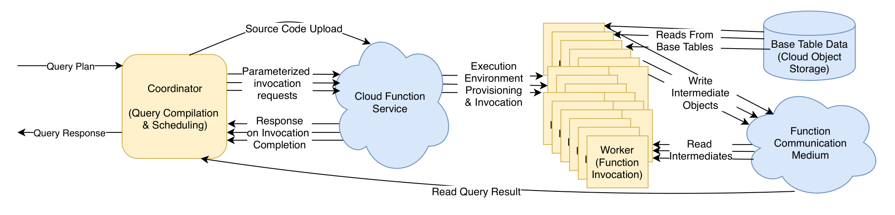

Starling 对底层云服务有若干要求。首先，需要能够从冷启动一次性并行启动数百个函数调用。其次，需要相对便宜且高吞吐的数据交换方式，例如对象存储服务。它的性能依赖于各个并行 worker 即使在其他 worker 并发执行时也能获得高吞吐。

**Coordinator。** coordinator 编译查询、将可执行文件上传到云函数服务，并管理查询执行。它可以运行在一台小型虚拟机上。Starling 没有查询优化器，因此 coordinator 接收物理查询计划作为输入，并将查询编译成一个可执行任意查询计划任务的可执行文件。它将该可执行文件与必要支持文件一起打包上传到函数服务。随后 Starling 调度端到端执行查询的任务，将任务分配给 worker，并监控完成情况。将查询分解为任务并决定何时运行哪些任务，是 Starling 调度器的职责。

**Workers。** 每个 worker 运行一次云函数调用来执行查询的一部分。worker 被调用时带有指示任务的参数；这些参数是 worker 生命周期内 coordinator 发来的唯一通信。由于函数调用无法直接通信，worker 必须使用共享存储等通信介质交换数据。worker 从基础表存储或通信介质读取输入，处理后将输出写回通信介质。对于并行 join 或聚合等需要 shuffle 数据的操作，生成中间输出的 worker 写出各自分区，消费端 worker 再读取这些分区。函数写完输出后退出，函数服务通知 coordinator 该 worker 已完成，查询执行继续。

### 2.4 选择云函数服务

Google Cloud Functions [19]、Azure Functions [14] 和 AWS Lambda [13] 都提供函数服务。Starling 架构可在这些平台上实现，但某些平台的特性更适合 Starling 面向的负载。Google Cloud Functions 和 Azure Functions 对可用语言、函数调用速率或二者都有约束，会影响并行查询处理性能；AWS Lambda 没有这些限制。因此我们选择在 AWS Lambda 上构建 Starling。这也限制 Starling 必须使用 AWS 服务交换中间数据。下一节说明为什么选择 S3 [9] 同时作为基础表存储和通信介质。

## 3. Starling 中的数据管理

存储是任何数据管理系统的重要组成部分。Starling 在云对象存储中的原始数据上提供交互式查询性能。它不管理基础表数据，但必须高效交互；同时，由于云函数无状态，Starling 必须管理查询执行过程中的中间状态。

### 3.1 基础表存储

Starling 在 S3 中的数据上执行查询。其设计与基础表格式无关，常见选择包括 CSV、ORC 和 Parquet。Starling 只要求能从 S3 源对象中按指定 schema 解析出行；但为获得最佳性能，基础表数据应以几百 MB 大小的对象存储。

ORC [12] 等开源列式格式有助于 Starling 获得良好性能，因为它们允许读取列子集而不是整行。这样 worker 可以跳过不需要的列，从而节省时间。ORC 还包含索引和基本统计信息，允许用户跳过部分输入以提升性能。因此，论文评估使用存储在 ORC 中的原始数据。

### 3.2 管理中间状态

由于云函数无状态且无法直接通信，Starling 依赖 AWS 服务来 shuffle 数据。函数调用之间交换数据的介质应当低成本、高吞吐、低延迟，并透明扩展。我们在选择 Amazon S3 之前考虑了多种方案。虚拟机或 Amazon Kinesis [6] 等流系统需要用户提前预置容量，因此不合适。Amazon SQS [10] 等队列服务限制消息大小（SQS 为 256KB），并且要求将数据编码为文本，对大型 shuffle 而言繁琐且计算成本高。DynamoDB [3] 等 NoSQL 服务延迟很低，但用于大型 shuffle 的成本不可接受。S3 相比这些替代方案延迟较高，不过可以通过后文机制缓解。

**S3 属性。** S3 [9] 是 AWS 对象存储服务。用户将任意大小的二进制对象写入 bucket，并以 key 命名。S3 是 write-once 系统，不允许 append 或 update，只允许替换。用户可以通过确保 key 分散在不同 prefix 上来扩展读写吞吐，prefix 定义为 key 的前若干字符 [15]。用户通过 REST 接口访问服务。S3 读取可以获取整个对象或字节范围。按 2019 年 7 月价格，S3 按存储量每 GB 每月 0.23 美元收费，每千次 GET 请求 0.0004 美元，每千次 PUT 0.005 美元。与标准文件系统不同，S3 在某些情况下不保证 read-after-write consistency，这会给查询处理带来复杂性。S3 提供原子读写，确保读者不会在同一次读取中看到两次不同写入的数据。

**共享中间结果。** Starling 使用 S3 在函数调用之间传递中间数据。worker 将输出作为一个对象写入 S3 中预定 key。由于对象写在已知位置，读者可以轮询该 key，直到对象出现。对于查询处理，S3 的另一个优点是持久化：worker 可以在目标 worker 启动前就开始发送数据，这能节省大量 AWS Lambda 执行时间。

用 S3 实现一对多通信既便宜又直接。producer 任务向 S3 写一个对象，所有需要它的 reader 都可见。但对于 shuffle 中的全对全通信，要低成本实现更困难。近期工作已经证明，对大型 shuffle 每个分区写一个对象会产生不可接受的成本 [25]。Starling 通过写入一个分区文件来缓解该问题，consumer 只读取每个 producer 输出对象中与自己相关的部分。

每个 producer 任务只向 S3 写一个包含所有分区的对象，以避免过高写成本。图 2 展示了这种分区文件格式。每个文件包含元数据，记录各分区在对象中的结束位置。为降低向 S3 读写对象的延迟，Starling 对低基数字符串列使用字典编码 [28]，字典编码放在文件开头。元数据之后是分区数据。可选地，分区可使用通用压缩算法压缩。

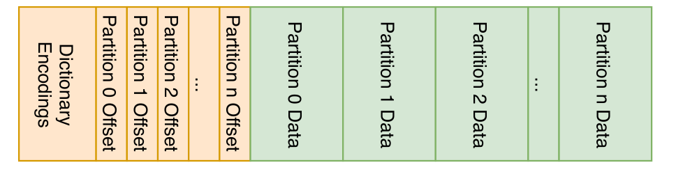

consumer 读取中间文件时，先读取对象头部元数据，再读取所需分区。因此任意分区都可通过两次读取获得。该格式还允许 consumer 用与读取单个分区相同数量的 GET 请求读取相邻分区数据，这一点用于支持多阶段 shuffle。

### 3.3 缓解高存储延迟

S3 聚合吞吐很高，但延迟远高于其他 shuffle 方案。一次 256KB 读取的中位延迟为 14ms。如果 worker 对 S3 执行单线程阻塞读取，它们会在等待响应时空闲，从而增加查询延迟和函数调用运行成本。为缓解这种延迟，每个任务并行执行多次 S3 读取。幸运的是，Starling 中大多数任务本来就需要执行许多读取，因此易于并行化。ORC 等列式格式被拆分为列段；在 join 中，任务也需要执行大量读取，从输入任务写出的对象中获取分区数据。并行读取让任务保持忙碌，减少空闲时间，把更多时间用于查询处理。图 3 显示，当函数调用执行多个 256KB 并行读取时，其总吞吐随并行度增加而提升，直到 16 个并行读取；继续增加并行读取不再改善延迟。

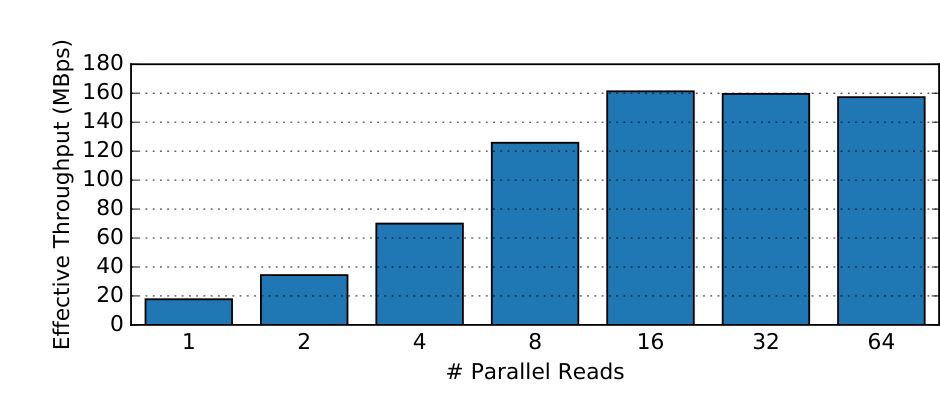

#### 3.3.1 缓解对象可见性延迟

如前所述，S3 在某些情况下不保证 read-after-write consistency。因此，刚写入 S3 的对象可能在几秒甚至更长时间后才对下一阶段任务可见。虽然这种情况不常见，但由于 shuffle 是全对全通信，任何对象可见性延迟都会拖慢所有读取 worker，并对查询延迟产生不利影响。读取该对象的任务也会持续产生等待开销。Starling 通过将同一个对象写入 S3 的两个不同 key 来缓解风险。我们称这一优化为 doublewrite。consumer 先尝试读取第一个 key；如果不可用，则尝试第二个 key。该策略降低单个可见性问题拖慢所有 consumer 的风险，使查询性能更可预测。

## 4. 查询执行

Starling 查询执行引擎的目标是在低成本下实现交互式性能。为在 AWS Lambda 上运行查询，coordinator 使用一个描述物理查询计划的 JSON 文件作为输入。计划包含阶段之间的依赖关系，以及每个阶段内的任务数量。coordinator 监控任务完成情况，并在依赖完成后启动新阶段。coordinator 为查询生成 C++ 源代码，将其编译成单个可执行文件，再与必要依赖打包、压缩并上传到 AWS Lambda。每个任务的输入和输出对象名在对应阶段开始前确定。每个任务会在无需与其他 worker 通信的范围内尽可能多地执行查询。例如，如果表按同一键分区，Starling worker 可以执行多个 join。随后 coordinator 调用查询任务直到查询完成。

### 4.1 关系算子实现

从 S3 读取数据后，Starling worker 使用以数据为中心的操作（data-centric operations）执行查询。算子被实现为一系列嵌套循环，而不是 pull-based 方式。查询编译支持类型特化，并能在分析场景中取得较好性能 [22]。本质上，每个任务包含一组嵌套循环，执行所需关系操作。worker 内部的算子流水线是 Starling 低查询延迟的来源之一。任务将其操作的物化输出作为单个对象写入 S3。

**基础表扫描。** Starling 不直接管理基础表数据，但必须能够快速扫描基础表。它通过并行读取输入文件的不同部分实现。如果查询包含投影，Starling 会在文件格式允许时只读取基础表中的必要列，例如 ORC 或 Parquet。

**Join。** Starling 支持 broadcast join 和 partitioned hash join。对于 broadcast join，内表的每个输入任务向 S3 写一个对象；外表任务读取内表全部数据和自身负责的外表子集来执行 join。Partitioned hash join 需要 shuffle。任务扫描两个关系，按 join key 对数据分区，并按 3.2 节格式写入分区文件。如果可能，这个分区过程会与其他操作在单个任务中流水线执行。随后启动一组 join 任务执行 join。join 任务为一个关系的对应分区建立哈希表，然后扫描另一个关系并探测哈希表。

**Aggregation。** Starling 分两步执行聚合。执行聚合前最后一个操作的任务生成一组部分聚合结果，并向 S3 输出一个对象。为完成查询，最终任务将这些部分聚合结果规约为最终聚合。必要时，Starling 会先按 group by key 执行 shuffle，再生成部分聚合。

### 4.2 Shuffling

Starling 使用分区中间格式，使执行 shuffle 的任务只读取输入文件中的相关分区。在标准 shuffle 中，每个 consumer 都必须从每个输出读取，是一种全对全通信。由于 Starling 的 worker 很小，这会导致每个任务从存储服务读取大量小对象。除了影响查询延迟，大量读取还可能产生不可接受的成本，因为对象存储按请求计费。例如，512 个 producer 任务和 128 个 consumer 任务的 shuffle，在当前 S3 价格下成本只有 5.7 美分；但更大的 5120 个 producer 和 1280 个 consumer 的 shuffle，成本会超过 5 美元。

为解决这个问题，Starling 为 partitioned hash join 实现两种策略。第一，对于小 join，使用标准 shuffle：每个 consumer 读取每个 producer 任务的输出。其 S3 读取次数为 `2sr`，其中 `s` 为 producer 任务数，`r` 为 consumer 任务数。

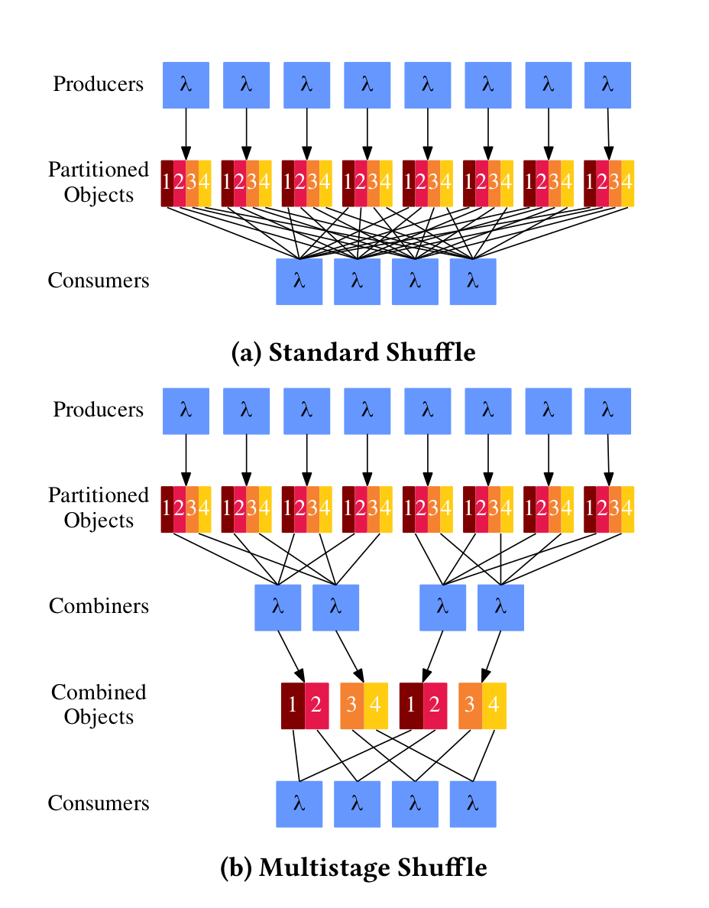

第二，当请求成本因大量输入任务而不可接受时，Starling 用计算时间换取对象存储请求成本，采用多阶段 shuffle。它在 producer 和 consumer 之间引入 combining task 阶段。combining stage 中的每个任务从一部分输入对象中读取连续分区子集，并生成一个采用相同分区文件格式的合并输出。由于这些 combining task 读取连续分区，它们对每个输入仍只需要两次读取。最后，consumer 读取相关 combiner 写出的输出。因为每个 combining task 只读取分区子集，consumer 也只需读取这些 combining task 输出的一个子集。

多阶段 shuffle 的 S3 读取次数为 `2(s/p + r/f)`，其中 `p` 是每个 combiner 读取的分区比例，`f` 是每个 combiner 读取的文件比例。combining task 的数量为 `1/(pf)`。对于 5120 个 producer、1280 个 consumer，若 `p = 1/20` 且 `f = 1/64`，S3 读取成本只有 0.073 美元，而标准 shuffle 超过 5 美元。combiner 的额外写成本可以忽略；1280 个 combiner 各执行两次额外写入，只增加 0.00128 美元。Starling 可创建任意数量的 combining task，但通常选择与接收任务数量相同的 combiner 数量。

### 4.3 将任务分配给 worker

Starling 管理成本和性能的主要方式是控制每个阶段的任务数量。通常，每阶段任务更多会带来更低延迟，但也会因 worker 间交换中间状态的开销而提高成本。这是一种精细平衡：worker 太多时，这些开销会吞噬潜在性能收益；worker 太少时，受资源限制的 worker 可能耗尽内存。两者之间的空间允许 Starling 用户通过调节每阶段 worker 数量在成本和性能之间取舍。

对于大型查询，有时需要执行的任务数会超过可用并行函数调用上限。2019 年 7 月，AWS Lambda 并行函数调用上限为 1000；可联系 Amazon 提升。实验中我们将最大并行调用数设为 5000。coordinator 为每个阶段设置最大并行任务限制。达到限制后，Starling 会等待某个任务完成再调度新任务，直到所有阶段完成。

由于 Starling 当前没有查询优化器，它向用户暴露调节成本和性能所需的配置参数，包括 shuffle 策略和每阶段任务数量。

### 4.4 流水线

降低查询延迟的一种策略，不是在一个阶段所有任务完成后才启动消费阶段，而是在 producer 输入中有很大一部分可用时就启动消费阶段。这样 worker 可以开始读取可用输入，减轻某些 straggler 的影响，从而降低整体查询延迟。

但这会带来额外风险和成本。如果 producer 阶段某个任务在标准 shuffle 中拖尾，会导致所有读取任务空闲等待，大幅增加该阶段执行成本。因此，开启流水线通常会降低查询延迟，但代价是额外成本。希望查询执行成本最低的用户应禁用流水线。降低这种成本的一种方式是尽可能通过缓解技术消除 straggler。

## 5. Stragglers

Starling 依赖 S3 读取基础表数据，并在函数调用之间交换中间状态。由于各阶段必须等待输入可用后才能执行查询处理，任何此类请求中的 straggler 都会显著影响查询延迟。S3 请求经常有较差尾延迟，少量读写请求会花费远长于其他请求的时间。因此，straggler mitigation 是 Starling 在性能上与预置系统竞争的关键。

缓解 straggler 的主要难点是，这些服务在 Starling 控制之外、闭源且运行不透明。因此，Starling 的优化基于“power of two choices” [23]：这是利用随机化和重复任务改善不可预测分布式系统性能的理论框架，MapReduce 和 Spark 等系统也有效使用了类似思想。

### 5.1 读取 straggler 缓解

Starling 的单个查询可能执行数十万次 S3 GET 请求，其中一些请求会经历明显延迟。Starling 通过比较请求已经花费的时间与预期完成时间来缓解这些 straggler。当 worker 检测到某个请求耗时超过预期时，会打开一个新的 S3 连接并重试该请求。worker 使用一个简单模型，根据观测到的 S3 请求延迟与吞吐，以及 AWS Lambda 调用吞吐，判断请求何时应当返回。

Starling 的预期查询响应时间模型为：

```text
r = l + (b / tc)
```

其中 `r` 是预期响应时间，`b` 是请求字节数，`c` 是并发 reader 数量。模型中的可调参数 `l` 和 `t` 分别对应 AWS Lambda 调用从 S3 读取时的延迟和吞吐。我们测得二者分别为 15ms 和 150MBps。

如果 S3 未能在预期时间的固定倍数内响应，Starling 会发送重复请求，接受先返回的响应，并关闭另一个连接。虽然我们无法了解 S3 内部设计，因此无法确定这些 straggler 的来源，但实验发现该策略缓解了大多数读取 straggler，并显著改善查询延迟。

在微基准中，我们从 Lambda 对 S3 执行数千次 256KB 读取，比较启用和禁用 read straggler mitigation（RSM）的请求时间 CDF。RSM 并不完美，有时请求仍需 2.5 秒，但未启用时的长尾被截短，有助于查询更快运行。在第 99.99 百分位，未启用 RSM 时延迟超过 1 秒，启用后约为 0.25 秒。

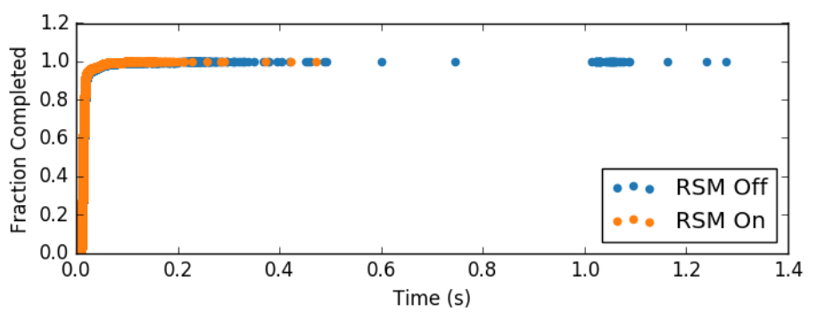

重复请求会带来额外开销，但节省的函数调用时间可以抵消它。一次额外读取请求只需节省 8 毫秒调用时间即可回本。在该实验中，RSM 只在 0.3% 情况触发（52000 次读取中 160 次），但节省了近 95 秒计算时间，额外读取成本只相当于 1.3 秒。因此 RSM 不仅降低延迟，也节省成本。

### 5.2 写入 straggler 缓解

大多数查询对 S3 的写入次数比读取少几个数量级，通常每个函数调用两次，但写请求往往大得多，最多可达数百 MB。这些大写请求的中位延迟可能为数秒。写 straggler 需要不同处理。读取请求较小而响应较大；写请求则相反。此外，我们观察到，大多数写入 straggler 并不是因为向 S3 传输数据速率慢，而是 S3 服务处理请求并发送响应较慢。也就是说，请求数据很快发送到 S3，但 S3 的回复可能因未知原因延迟。如果使用类似 RSM 的单一策略，Starling 在“数据已经快速写入 S3、但 S3 响应迟缓”的情况下反应会很慢。

因此，Starling 使用一个额外模型，在请求发送完成后预测写响应时间。预期响应时间形式与 RSM 模型相同，但参数不同，因为 S3 服务内部吞吐高于单个函数调用的吞吐。当任一响应时间模型表明出现 straggler 时，Starling 会在新连接上启动第二个写请求。

我们用另一个微基准评估 write straggler mitigation（WSM）：执行大量 100MB S3 写入并测量响应时间。未启用 WSM 时，最慢写入超过 20 秒。仅使用单个 timeout 时，最慢写入降到约 18 秒；完整 WSM（包括客户端发送完请求后设置第二个 timeout）将尾延迟降到约 10 秒。在第 99 百分位，未启用 WSM 的写入接近 9 秒，单 timeout 为 5 秒，完整 WSM 为 3.8 秒。

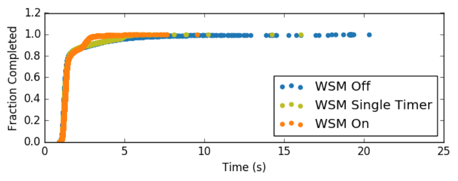

每次额外写入需要节省 102 毫秒计算时间才能回本。在该实验中，完整 WSM 在 31% 写入中触发（10240 次写入中 3138 次），成本相当于 314 秒计算时间，但节省了相当于 2100 秒的计算时间。由于后续阶段必须等待所有写入完成才能读取，WSM 是 Starling 同时实现低延迟和节省计算时间的关键部分。

## 6. 评估

评估回答以下问题：Starling 的运行成本如何随查询负载变化与替代方案比较；性能如何；能否扩展到更大数据集；能否支持并发查询；与现有按查询付费的云交互式查询服务相比如何；是否允许用户调节成本与性能；性能优化对低查询延迟有多重要。

### 6.1 实验设置

大多数实验使用 scale factor 1000 的 TPC-H [16] 数据集（1TB），扩展性实验使用 scale factor 10000（压缩前 10TB）。每个未压缩表被拆成最大 1GB 的文件，然后编码为 Apache ORC [12]，并使用 Snappy [27] 压缩列。ORC 文件上传到单个 Amazon S3 bucket。压缩前约 1TB，转换为 ORC 后约 317GB。该数据集无数据倾斜。比较使用 TPC-H 查询子集：除 11、21 和 22 外的所有查询；这些查询被排除是因为 Starling 功能尚不完整，或某个被比较系统无法执行。我们认为加入这些查询不会实质改变结果。每个配置顺序执行每个查询，报告三次执行的中位延迟。

**Amazon Redshift。** Redshift 是 AWS 的数据仓库产品。用户预置固定节点数的集群，之后可增加节点；查询前必须预加载数据。Redshift 提供 dense compute 节点 dc2.8xlarge（32 线程、244GB DRAM、2.56TB SSD）和 dense storage 节点 ds2.8xlarge（相同 CPU 和内存、16TB HDD）。Redshift 还通过 Spectrum 从 S3 外部表读取数据。Spectrum 会启动短生命周期 worker（类似 AWS Lambda 调用）从 S3 过滤基础表数据并发送到集群完成查询。

Redshift 允许用户在 schema 中定义 distribution key 和 sort key，把表按 key 分布到节点并排序。当表按 join key 分布和排序时，节点可执行本地 merge join 而无需 shuffle，显著降低查询延迟。论文比较四种读取本地数据的 Redshift 配置，以及一种使用 Spectrum 从 S3 读取的配置。dense compute 和 dense storage 分别缩写为 dc 与 ds；带 distribution key 的配置记为 dk，默认分布记为 dd。因此有 redshift-dc-dk、redshift-dc-dd、redshift-ds-dk、redshift-ds-dd，以及 spectrum。

**Presto。** 与 Starling 一样，Presto 是面向“就地”原始存储数据执行 SQL 的执行引擎，而不是要求加载到专门格式。实验使用 r4.8xlarge 节点集群，每节点 32 线程、244GB DRAM。我们用 Amazon EMR 5.24.1 部署 Presto 0.219；但由于也可以自行部署，成本只报告 EC2 虚拟机成本，不计 EMR 附加成本。实验启用磁盘 spill 和查询优化，并在运行查询前收集所有表统计信息。报告 5 节点集群（4 worker + 1 master）和 17 节点集群（16 worker）的性能与成本，分别称为 presto-4 和 presto-16。

**Amazon Athena。** Athena 是基于 Presto 0.172 的托管查询服务。用户为 S3 bucket 中的数据定义 schema，然后无需预置硬件即可查询。查询完成后，结果写入 S3 对象。实验报告 Athena 服务测得的查询运行时间。用户按查询扫描的 S3 字节数付费。与 Starling 一样，Athena 空闲时近乎零成本（除 S3 存储成本外）。不同的是，Athena 不允许用户控制查询并行度，并且有时无法分配足够资源执行大数据文件上的查询。

**Starling。** 除非另有说明，Starling 启用所有性能优化，包括 doublewrite 和 pipelining。Starling 没有查询优化器，因此我们手工设置每阶段任务数：每个输入对象分配一个任务，然后通过扫描多个选项选择 join 阶段任务数，选择既非最快也非最便宜、但在成本和性能之间折中较好的配置。1TB 数据集禁用多阶段 shuffle，10TB 实验中对大型 join 启用。Starling 查询计划使用 Redshift 优化器在 redshift-dc-dd 配置（无分区数据）下生成的 join order。除特别说明外，各实验配置固定。

### 6.2 运行成本

实验显示，在中等查询速率下，Starling 比替代方案更便宜。我们比较本地存储数据的预置集群与 Starling 在每小时查询数量变化时的日成本。使用工作负载中查询的几何平均执行时间估计典型查询执行时间。

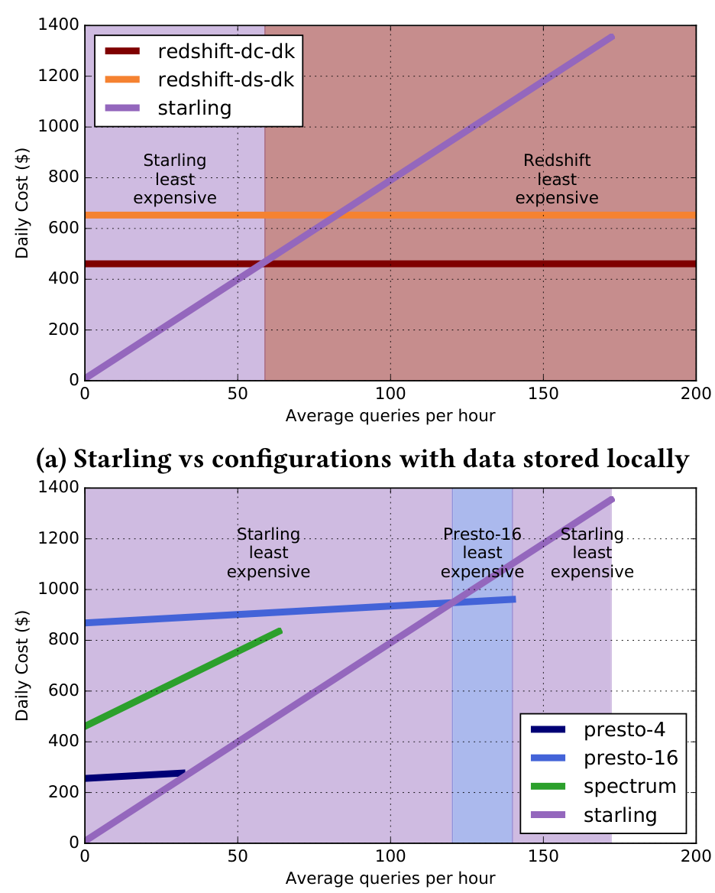

与本地预加载数据的 Redshift 配置相比，Starling 在没有查询执行时几乎没有成本，随着查询数量增加成本上升。Redshift 的本地数据配置成本固定，与执行查询数无关。因此在 1TB 数据集上大约每小时 60 个查询时，运行 Redshift 会变得比 Starling 更便宜。由于 Redshift 已加载并索引数据，其最高效配置能比 Starling 更快运行查询。不过，这种性能需要预加载数据并仔细调优数据库。

与直接从云对象存储读取数据的系统相比，Starling 的成本来自读取基础表和中间数据的 S3 成本，以及 AWS Lambda 成本。大约每小时 120 个查询时，Starling 成本超过 presto-16。但由于 presto-16 性能低于 Starling，当每小时超过 153 个查询时，Starling 是唯一能跟上的系统。没有任何从 S3 读取基础表的配置能在背靠背执行时超过每小时 189 个查询。

按单查询成本看，Starling 的成本固定，因为其运行成本只有小型 coordinator（每天 8 美元）和 S3 存储成本。预置系统的单查询成本会随着查询间隔增加快速上升。总体而言，在中等查询量下，Starling 是所有配置中最便宜的系统。

### 6.3 查询延迟

低成本之外，临时查询负载用户还需要交互式性能。Athena 在 1TB 实验中无法完成若干查询，报告资源耗尽错误或缺少某些 SQL 功能。对于能够完成的查询，Athena 延迟比 Starling 高出 50% 以上。

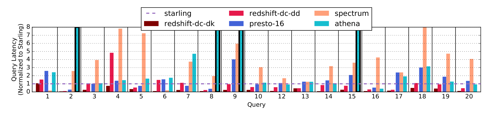

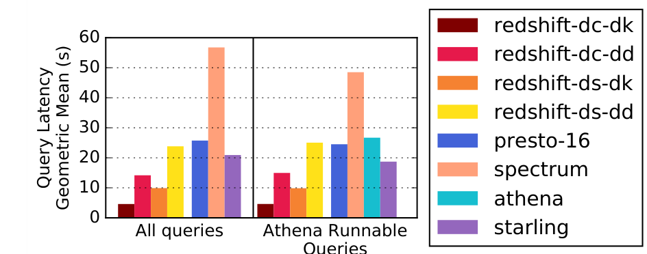

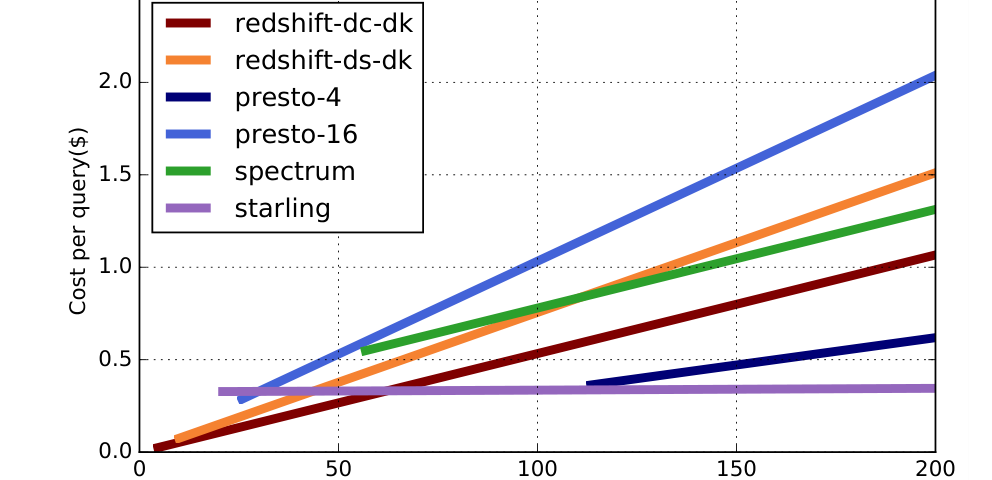

对于最强 Redshift 配置，预加载、本地存储且已按 schema 调优的数据仍然能提供最低延迟。不过，当系统必须从 S3 读取基础表时，Starling 的延迟最低。与默认分布的 Redshift 配置相比，Starling 延迟相近或更优；我们推测这是因为基础表未按 join key 分区时，额外 shuffle 成本较高。

对于需要极低查询延迟且不敏感于成本的用户，带预加载本地数据和调优 schema 的预置系统仍是最佳选择。但对于云对象存储上的临时分析，Starling 查询延迟最低。与预加载、排序并本地存储表的系统相比，查询到达间隔超过 60 秒时 Starling 成本最低；与数据存储在 S3 的系统相比，查询到达间隔超过 30 秒时 Starling 成本更低。

### 6.4 可扩展性

Starling 比预置系统扩展性更好，并且不需要其他系统为获得良好性能所需的昂贵重新预置步骤。我们生成 scale factor 10000 的 TPC-H 数据集（压缩前 10TB），执行 12 个查询，覆盖不同输入数据规模和 join 数。为扩展到 10TB，Starling 增加执行大型 join 的 worker 数量，并使用多阶段 shuffle 来缓解大型 S3 读取成本。其他系统保持原配置。

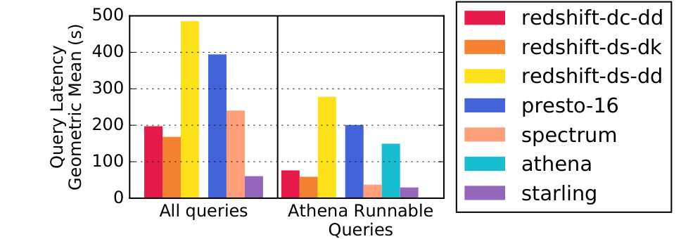

在 10TB 数据集上，每个预置系统的查询延迟都至少是 Starling 的 2.7 倍。Starling 在 12 个查询中的 8 个上延迟最低。1TB 数据集上表现最佳的 redshift-dc-dk 在加载 10TB 数据时因额外索引占用磁盘空间而耗尽磁盘，因此无法比较。

当然，为预置系统增加更多资源可以降低其延迟。该实验展示了为任意数据量的临时查询负载预置系统的困难。当输入数据大小变化很大或事先未知时，Starling 的快速弹性相比预置系统有优势。预置系统必须预置额外资源应对更高负载，而 Starling 可按查询扩展，从而更灵活地适应输入数据规模变化。

10TB 上，Starling 在所有可达到查询速率下，都是所有直接从 S3 读取数据系统中单查询成本最低者。即使与预加载数据的 Redshift 相比，当查询间隔达到 721 秒或更长时，Starling 也更便宜，并获得更高性能。我们还估算如果 Redshift 线性扩展到 16 节点，其每查询延迟可能接近 Starling，但美元成本会高 4 倍；在这种假设下，当查询间隔为 80 秒或更长时，Starling 仍比 Redshift ds-dk 更便宜。

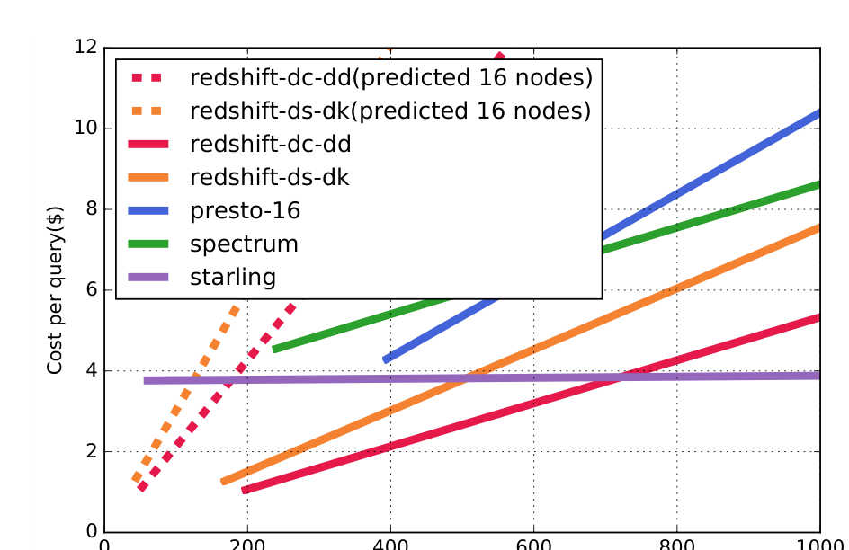

### 6.5 并发

Starling 最适合低到中等查询量负载。不过，当用户需要一次运行一批查询时，它也能扩展到多个并发查询。我们通过让多个用户执行同一个查询 Q12 来展示 Starling 随并发用户增加的扩展能力。最大吞吐受两个因素限制。第一，云函数服务对并发函数调用数有限制；接近该限制时吞吐会趋于平稳。第二，为支持许多并发查询，coordinator 必须通过 HTTP 请求并行调用越来越多函数，会给低成本 coordinator 带来资源压力。高并发不是本文重点，因此 coordinator 优化留作未来工作。

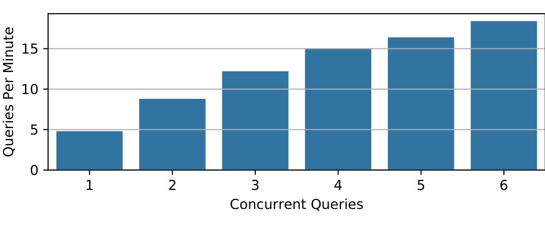

### 6.6 按查询付费服务

Amazon Athena 等全托管查询服务最接近 Starling 目标：用户提交查询并按查询付费。但 Athena 不是临时查询负载的万能解。在 1TB 数据集的 12 个查询中，Athena 有 2 个无法完成；对于能完成的查询，查询延迟比 Starling 高 50% 以上。

尽管如此，Athena 的单查询成本与 Starling 有竞争力。排除 Athena 无法执行的查询后，在最高查询速率下 Athena 的单查询成本略高于 Starling：0.287 美元对 0.0256 美元。由于 Starling 有一个小型 coordinator 成本而 Athena 没有，当查询速率低于每 350 秒一个查询时，Athena 更便宜。

Athena 不适合扩展到更大数据集。在 10TB 数据集上，Athena 只完成 12 个查询中的 5 个；在已完成查询上，延迟是 Starling 的 5 倍。最后，Athena 的每查询成本超过 Starling 两倍。对于需要交互式性能的用户，Athena 不能调节性能是一个根本限制。

### 6.7 性能可调

Starling 允许用户调节查询以降低成本或提高性能。我们使用 TPC-H Query 12 展示该能力。Q12 是在数据集中两个最大表上的 select-project-join-aggregate 查询。实验改变 join 阶段使用的任务数：任务数越多，性能越高，成本也越高。当任务数减少时，Starling 成本主要由 AWS Lambda 执行时间支配；任务数增加后，S3 读取成本开始占主导。

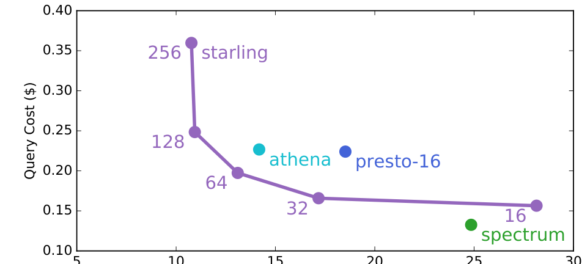

presto-16 和 spectrum 的成本表示查询之间没有空闲时间时的单查询成本；若查询间有更多空闲时间，单查询成本会更高。即使采用最严格的查询到达时间假设，Starling 在该查询上也处于 Pareto frontier：在相同性能下比 spectrum 和 Athena 更便宜，并能达到比其他从 S3 读取数据系统更高的性能。与预置系统相比，Starling 更容易按成本和性能目标调节。

### 6.8 性能优化

没有各种性能优化，Starling 无法达到与预置系统竞争的延迟。我们在 Q12 上逐步启用优化来观察延迟和成本。实验固定 join worker 数量为 128，并从左到右逐项启用优化。整个实验中查询成本近似不变，但查询延迟按预期下降。

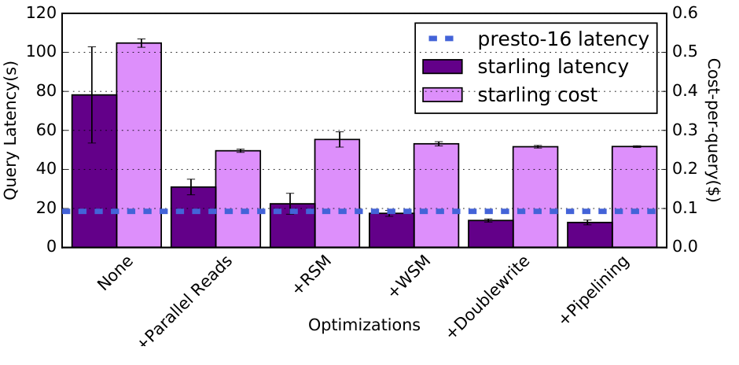

没有优化时，查询执行时间方差很高，平均约 80 秒。并行读取对性能影响很大，尤其在 join 阶段，因为每个 worker 执行数百次小读取。加入 RSM 和 WSM 后，个体读写方差下降，查询运行时间方差下降，延迟接近 presto-16。最后，doublewrite 将均值降低到 12.8 秒。与无优化平均运行时间相比提升 6 倍以上；与仅并行读取相比提升 2.4 倍以上。

## 7. 讨论：Starling 对云提供商的成本

评估表明，对于许多负载，Starling 以显著更低运行成本达到大型系统性能。不过，每个系统的成本受云提供商定价策略影响。例如，Athena 按 S3 读取字节收费，某些计算密集查询可能比只扫描更多数据的简单查询收费更低。我们从云提供商视角出发，对资源相对成本作出有根据的假设，并发现按照这些假设，Starling 式架构可能比传统 OLAP 系统架构资源消耗更低。

Amazon Athena [1] 基于 Presto [24] 0.172 [2]。虽然实验的 presto-16 使用 Presto 0.219，但 presto 集群上大多数查询延迟接近 Athena。为比较 Athena 和 presto-16 查询延迟，我们禁用统计信息收集，使 Presto 与 Athena 有限统计信息更接近。在 1TB 数据集上，Athena 能执行查询的几何平均延迟与 presto-16 相差不超过 3.5 秒，除 3 个查询外，其余 Athena 查询延迟与 presto-16 相差不超过 4.25 秒。剩余差异可能来自硬件、配置和 Presto 版本差异，但我们无法获知 Athena 内部配置。

我们假设一个 16 个 r4.8xlarge 节点的 Presto 集群性能与 Athena 相似。因此，执行 Athena 查询时，用户相当于在查询期间完整使用一个 16 节点集群。每个 r4.8xlarge 实例有 32 个 vCPU，16 个节点每秒消耗 512 core-seconds。为保守起见，我们假设每个 AWS Lambda 调用有 2 个 vCPU。基于此比较 Starling 与 presto-16 每个查询消耗的 core-seconds。

Starling 的 join order 来自 Redshift，因此具有查询优化器的收益；我们将其与优化后的 presto-16 运行时间比较。多数查询中，Starling 相比 presto-16 消耗更少计算资源来执行同一查询。虽然查询某些阶段可以充分利用机器集群，但有些阶段只使用部分核心或低效利用集群。在这些情况下，对云提供商而言，在 AWS Lambda 这类通用计算服务上执行查询的服务，可能比为查询处理工作负载专门预置机器更高效。

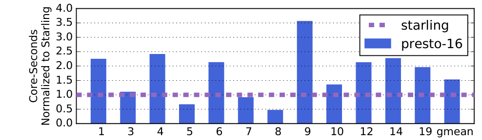

没有云提供商内部的详细集群架构、负载和利用率信息，很难确定 Starling 是否一定比 Athena 类服务有更低资源消耗。但基于保守 CPU 利用率估计，我们认为这很可能成立。因此，未来云提供商提供类似 Starling 架构的查询执行服务可能更高效。

## 8. 相关工作

**在 serverless 平台上构建有状态服务。** 云函数服务已经用于实现高度并行负载 [17,18,21]。PyWren [21] 是在云中执行 Python 脚本的通用工具，但没有展示查询处理负载下有竞争力的性能或成本。GG [17] 通过在云函数上管理任务和 straggler 来简化作业执行，但不专门面向查询处理，因此不能利用 Starling 基于负载细节进行的优化。ExCamera [18] 通过利用云函数服务的高并行度和低启动延迟实现低延迟视频编码。Sprocket [11] 也利用并行性处理视频，但通信模式较简单。与这些负载不同，查询处理具有更复杂通信模式，并可通过查询处理专用优化改善性能，特别是并行查询处理经常需要 shuffle 来完成 join。已有工作研究过用函数服务 shuffle 数据 [25]，但它依赖一组预置虚拟机辅助，并不执行完整 SQL 查询。Spark on Lambda [26] 曾尝试在 AWS Lambda 上运行 Spark 作业，但实现限于 Spark，没有实现 straggler mitigation，也没有展示有竞争力的性能。

**云分析数据库。** 随着客户将分析负载迁移到云中，出现了大量服务于这些负载的系统。第 2.1 节已经看到，现有系统没有满足三项关键要求：不预加载数据、按查询收费、性能可调。Starling 是第一个构建在 serverless 平台之上的分析数据库引擎。

## 9. 结论

本文提出 Starling，一个构建在云函数服务上的数据分析查询执行引擎。Starling 填补了用户对分析系统需求中的空白：在临时负载下以低单查询成本提供交互式查询延迟，并可按性能和成本目标调节。Starling 通过利用云函数服务提供的快速扩展和细粒度能力达成这些目标。它克服了管理数百个无状态 worker 的挑战，这些 worker 必须通过不透明云存储交换数据。Starling 的优化使其在成本和性能上即使与预置系统相比也具有竞争力，并允许它在小数据集和大数据集之间轻松伸缩，而不需要显式预置决策。

## 参考文献

- [1] Amazon Athena. <https://aws.amazon.com/athena/>.
- [2] Amazon Athena January 19, 2018 Release Notes. <https://docs.aws.amazon.com/athena/latest/ug/release-note-2018-01-19.html>.
- [3] Amazon DynamoDB. <https://aws.amazon.com/dynamodb/>.
- [4] Amazon EC2. <https://aws.amazon.com/ec2/>.
- [5] Amazon EMR. <https://aws.amazon.com/emr/>.
- [6] Amazon Kinesis. <https://aws.amazon.com/kinesis/>.
- [7] Amazon Redshift. <https://aws.amazon.com/redshift/>.
- [8] Amazon Redshift Pricing. <https://aws.amazon.com/redshift/pricing/>.
- [9] Amazon S3. <https://aws.amazon.com/s3/>.
- [10] Amazon Simple Queue Service. <https://aws.amazon.com/sqs/>.
- [11] L. Ao, L. Izhikevich, G. M. Voelker, and G. Porter. Sprocket: A serverless video processing framework. In Proceedings of the ACM Symposium on Cloud Computing, pages 263-274. ACM, 2018.
- [12] Apache ORC. <https://orc.apache.org/>.
- [13] AWS Lambda. <https://aws.amazon.com/lambda/>.
- [14] Azure Functions. <https://cloud.google.com/functions/>.
- [15] Amazon S3 Developer Guide. <http://docs.aws.amazon.com/AmazonS3/latest/dev/optimizing-performance.html>.
- [16] T. P. P. Council. TPC-H benchmark specification. Published at <http://www.tcp.org/hspec.html>, 21:592-603, 2008.
- [17] S. Fouladi, F. Romero, D. Iter, Q. Li, S. Chatterjee, C. Kozyrakis, M. Zaharia, and K. Winstein. From laptop to lambda: Outsourcing everyday jobs to thousands of transient functional containers. In 2019 USENIX Annual Technical Conference (USENIX ATC 19), Renton, WA, 2019. USENIX Association.
- [18] S. Fouladi, R. S. Wahby, B. Shacklett, K. V. Balasubramaniam, W. Zeng, R. Bhalerao, A. Sivaraman, G. Porter, and K. Winstein. Encoding, fast and slow: Low-latency video processing using thousands of tiny threads. In 14th USENIX Symposium on Networked Systems Design and Implementation (NSDI 17), pages 363-376, 2017.
- [19] Google Cloud Functions. <https://cloud.google.com/functions/>.
- [20] J. M. Hellerstein, J. M. Faleiro, J. Gonzalez, J. Schleier-Smith, V. Sreekanti, A. Tumanov, and C. Wu. Serverless computing: One step forward, two steps back. In CIDR 2019, 9th Biennial Conference on Innovative Data Systems Research, Asilomar, CA, USA, January 13-16, 2019, Online Proceedings, 2019.
- [21] E. Jonas, Q. Pu, S. Venkataraman, I. Stoica, and B. Recht. Occupy the cloud: Distributed computing for the 99%. In Proceedings of the 2017 Symposium on Cloud Computing, pages 445-451. ACM, 2017.
- [22] T. Kersten, V. Leis, A. Kemper, T. Neumann, A. Pavlo, and P. Boncz. Everything you always wanted to know about compiled and vectorized queries but were afraid to ask. Proceedings of the VLDB Endowment, 11(13):2209-2222, 2018.
- [23] M. Mitzenmacher. The power of two choices in randomized load balancing. IEEE Transactions on Parallel and Distributed Systems, 12(10):1094-1104, 2001.
- [24] Presto. <https://prestosql.io/>.
- [25] Q. Pu, S. Venkataraman, and I. Stoica. Shuffling, fast and slow: Scalable analytics on serverless infrastructure. In 16th USENIX Symposium on Networked Systems Design and Implementation (NSDI 19), pages 193-206, 2019.
- [26] Qubole Announces Apache Spark on AWS Lambda. <https://www.qubole.com/blog/spark-on-aws-lambda/>.
- [27] Snappy. <https://github.com/google/snappy>.
- [28] T. Westmann, D. Kossmann, S. Helmer, and G. Moerkotte. The implementation and performance of compressed databases. SIGMOD Rec., 29(3):55-67, Sept. 2000.
