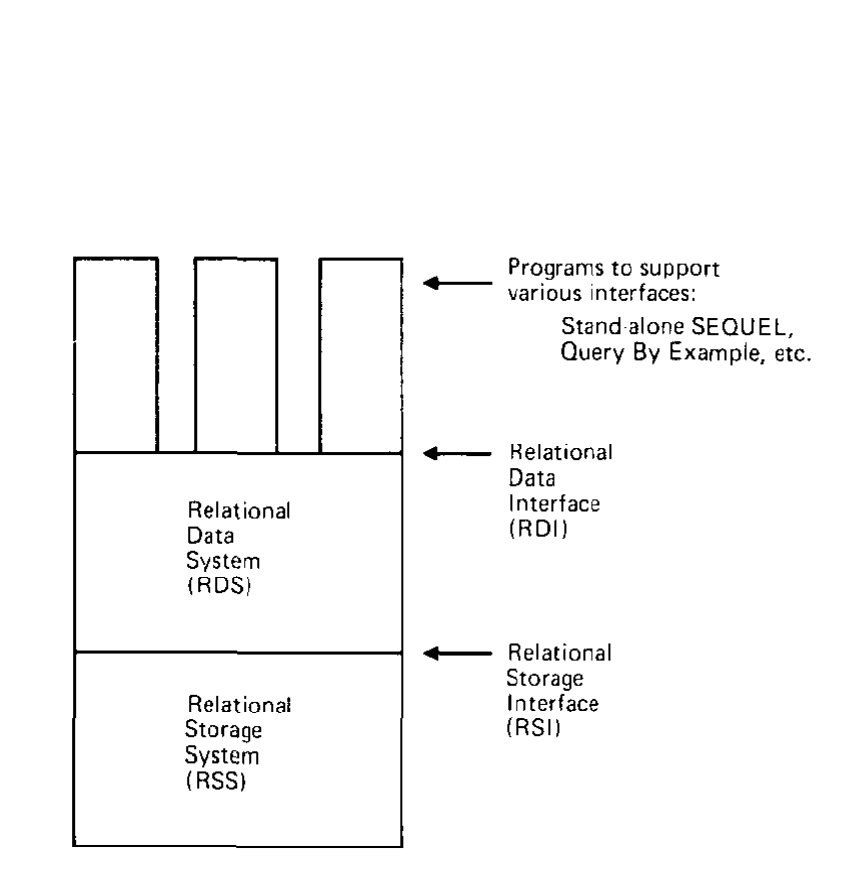
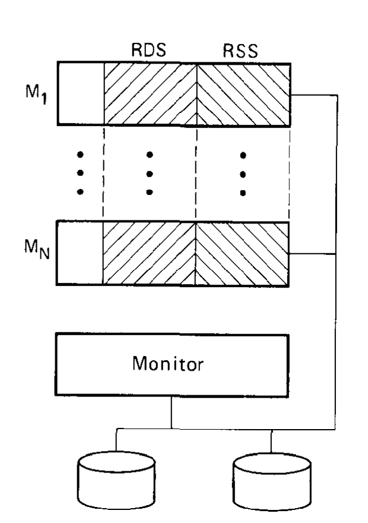
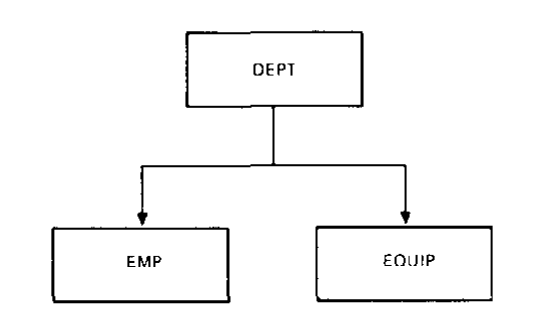

# System R: Relational Approach to Database Management（中文译文）

## 译者说明

本文依据同目录的 `source.pdf` 翻译。章节、图表、公式、算法、代码与参考文献按原文结构保留。

## 作者

M. M. Astrahan、M. W. Blasgen、D. D. Chamberlin、K. P. Eswaran、J. N. Gray、P. P. Griffiths、W. F. King、R. A. Lorie、P. R. McJones、J. W. Mehl、G. R. Putzolu、I. L. Traiger、B. W. Wade、V. Watson

IBM 研究实验室，美国加利福尼亚州圣何塞 95193。

版权 © 1976 Association for Computing Machinery, Inc. 在保留 ACM 版权声明、注明出版物及其发行日期，并说明转载经 ACM 许可的前提下，允许以非营利目的重新发表本文全部或部分内容。

原载 *ACM Transactions on Database Systems*，第 1 卷第 2 期，1976 年 6 月，第 97-137 页。

## 摘要

System R 是一个提供高级关系数据接口的数据库管理系统。系统尽可能把最终用户与底层存储结构隔离，从而提供高度的数据独立性。系统允许在共同的底层数据之上定义多种关系视图。它还提供数据控制功能，包括授权、完整性断言、触发事务、日志与恢复子系统，以及在共享更新环境中维持数据一致性的设施。

本文描述系统的总体架构与设计。目前系统正在实现，设计也正在接受评估。我们强调，System R 是研究数据库架构的载体，并不计划成为产品。

**关键词与短语：** 数据库，关系模型，非过程式语言，授权，锁，恢复，数据结构，索引结构

**CR 分类：** 3.74，4.22，4.33，4.35

## 目录

- 1. 引言
  - 架构与系统结构
- 2. 关系数据系统
  - 主语言接口
  - 查询功能
  - 数据操纵功能
  - 数据定义功能
  - 数据控制功能
  - 优化器
  - 修改游标
  - 非关系数据模型的模拟
- 3. 关系存储系统
  - 段
  - 关系
  - 映像
  - 链接
  - 事务管理
  - 并发控制
  - 系统检查点与重启
- 4. 总结与结论
- 附录 I. RDI 操作符
- 附录 II. SEQUEL 语法
- 附录 III. RSI 操作符
- 致谢
- 参考文献

## 1. 引言

Codd 于 1970 年提出关系数据模型 [7]，以此寻求解决数据库管理中的若干问题。具体来说，Codd 关注两个问题：提供一种脱离各种实现细节的数据模型或数据视图，即数据独立性问题；以及为数据库用户提供一种访问数据的高级、非过程式数据子语言。

关系方法能否被接受、是否有价值，很大程度上取决于能否证明：可以构造一个在真实环境中解决真实问题的系统，而且其性能至少能与当时已有系统相当。本文旨在描述一个名为 System R 的实验性原型数据库管理系统的总体架构和设计。IBM 圣何塞研究实验室目前正在实现和评估该系统。写作本文时，设计已经完成，系统的主要部分已经实现并投入运行，但整个系统尚未完成。我们计划对系统做完整的性能评估，结果将在后续论文中发表。

System R 并不是关系方法的首个实现 [12, 30]。不过，据我们所知，其他关系系统尚未提供完整的数据库管理能力，包括应用程序编程、查询能力、并发访问支持和系统恢复等。其他关系系统主要关注并证明了解决某些特定问题的技术可行性。例如，IS/1 系统 [22] 证明了支持关系代数 [8] 的可行性，并开发了求值代数表达式的优化技术 [29]；犹他大学的 Smith 和 Chang 也开发了关系代数优化技术 [27]。IBM 剑桥科学中心开发的扩展关系存储器（XRM）系统 [19] 已作为单用户访问方法供其他关系系统使用 [2]。SEQUEL 原型 [1] 最初是一个单用户系统，用来证明支持 SEQUEL [5] 语言的可行性；后来 IBM 剑桥科学中心和 MIT Sloan School 能源实验室扩展了它，使其支持一种简单的并发形式，并将它用作 MIT 面向能源应用开发的广义管理信息系统（GMIS）[9] 的组成部分。加州大学伯克利分校开发的 INGRES 项目 [16] 已经展示了把 QUEL 语言中的关系表达式分解成“单变量查询”的技术；该系统还研究了用查询修改 [28] 对用户强制执行完整性约束和授权约束。在多伦多大学，人们也研究了把高级用户语言翻译为低级访问原语的问题 [21, 26]。

### 架构与系统结构

我们从两个视角描述 System R 的总体架构。首先，从单个事务所见的系统出发，给出单体式描述；其次，考察系统的多用户维度。图 1 给出了系统的功能视图，包括主要接口和组件。

关系存储接口（Relational Storage Interface，RSI）是处理基关系单个元组访问的内部接口。支持这一接口的关系存储系统（Relational Storage System，RSS）本身就是一个完整的存储子系统：它管理设备、空间分配、存储缓冲区、事务一致性与加锁、死锁检测、回退、事务恢复和系统恢复；此外，还维护基关系选定字段上的索引，以及跨关系的指针链。

关系数据接口（Relational Data Interface，RDI）是外部接口，既可以直接由程序设计语言调用，也可以用来支持各种仿真器和其他接口。支持 RDI 的关系数据系统（Relational Data System，RDS）提供授权、完整性强制与替代数据视图。高级 SEQUEL 语言嵌入 RDI，是全部数据定义和操纵的基础。RSS 只使用系统生成的内部名称，因此 RDS 还维护外部名称目录。RDS 内含优化器，它从 RSS 支持的路径中为每个请求选择合适的访问路径。



*图 1. System R 的架构。*



*图 2. System R 中虚拟机的使用。*

这个实验系统当前运行在 VM/370 [18] 环境中。为了支持 System R 的多用户环境，我们对虚拟机设施做了若干扩展 [14]，尤其实现了在任意数量虚拟机之间选择性共享可读写虚拟内存的技术，并通过处理器中断在虚拟机之间高效通信。图 2 展示了如何用多个虚拟机支持对共享数据执行并发事务。每个登录用户都有一台专用数据库机器；每台数据库机器都包含执行全部数据管理功能所需的所有代码和表，服务并不集中保留在某一台机器中。

多台数据库机器执行共享的可重入代码并共享控制信息，这意味着数据库系统不必自行通过多任务机制处理并发事务，而可以利用宿主操作系统在虚拟机层面执行多线程。操作系统还可以利用分配给多台虚拟机的多处理器，因为每台机器都能提供全部数据管理服务。若采用单服务器方法，这一优势便会消失，因为大部分处理活动都会集中到一台机器上。

除数据库机器外，图 2 还给出了监控机器（Monitor Machine），其中包含许多系统管理员设施。例如，监控机器控制登录授权，并为每个用户初始化数据库机器；它还调度周期性检查点，并为重组和记账维护使用情况与性能统计。第 2、3 节分别描述 System R 的两个主要组件：关系数据系统和关系存储系统。

## 2. 关系数据系统

关系数据接口（RDI）是 System R 的主要外部接口，为数据检索、操纵、定义和控制提供高级、数据独立的设施。RDI 的数据定义功能允许在共同的底层数据上定义多种替代关系视图。关系数据系统（RDS）是实现 RDI 的子系统；其优化器规划每条 RDI 命令的执行，从关系存储系统（RSS）提供的访问路径中选择成本较低者。

RDI 由一组可以从 PL/I 或其他主程序设计语言调用的操作符组成，附录 I 列出了这些操作符。SEQUEL 数据子语言 [5] 的全部功能，都可通过名为 `SEQUEL` 的 RDI 操作符使用；附录 II 给出 SEQUEL 的巴科斯-诺尔范式（BNF）语法。只要在 RDI 之上编写一个处理终端通信的简单程序，就能把 SEQUEL 支持为独立接口。System R 提供的这种接口称为用户友好接口（User-Friendly Interface，UFI）。此外，也可以在 RDI 之上编写程序，以支持 Query by Example [31] 等其他关系接口，或模拟非关系接口。

### 主语言接口

RDI 的功能基本就是 [5] 和附录 II 所描述的 SEQUEL 数据子语言功能。自该语言先前发表以来，SEQUEL 已有若干修改，本节将予以说明。

本节示例使用如下雇员及部门数据库：

```text
EMP(EMPNO, NAME, DNO, JOB, SAL, MGR)
DEPT(DNO, DNAME, LOC, NEMPS)
```

RDI 通过游标（cursor）概念把 SEQUEL 接到主程序设计语言。游标是 RDI 中的名称，用于标识一个称为活动集（active set）的元组集合（例如查询结果），并维持集合中某一个元组的位置。`SEQUEL` 操作符把游标与一组元组关联起来，随后 `FETCH` 操作符可逐个取出这些元组。

某些主程序预先知道要检索的元组度数与数据类型。这样的程序可以在 `SEQUEL` 调用中指定接收结果元组的程序变量。程序必须先用 `BIND` 操作符把这些变量的地址告知系统。下例把变量 `X` 和 `Y` 告知系统，然后发出一个查询，把结果放入这两个变量：

```pli
CALL BIND('X', ADDR(X));
CALL BIND('Y', ADDR(Y));
CALL SEQUEL(C1,
  'SELECT NAME:X, SAL:Y
   FROM EMP
   WHERE JOB = ''PROGRAMMER''');
```

`SEQUEL` 调用把游标 `C1` 与满足查询的元组集合关联，并将其定位到第一个元组之前。优化器会被调用，以选择物化这些元组的访问路径，但 `SEQUEL` 调用本身并不实际物化元组。元组是在调用者需要时由 `FETCH` 逐个物化的。每次 `FETCH` 都把活动集中的下一个元组送入变量 `X` 和 `Y`，即把 `NAME` 送入 `X`、`SAL` 送入 `Y`：

```pli
CALL FETCH(C1);
```

程序可能希望根据程序变量内容编写 SEQUEL 谓词，例如查找部门号与变量 `Z` 内容相同的程序员。RDI 的 `BIND` 也支持这一功能：

```pli
CALL BIND('X', ADDR(X));
CALL BIND('Y', ADDR(Y));
CALL BIND('Z', ADDR(Z));
CALL SEQUEL(C1,
  'SELECT NAME:X, SAL:Y
   FROM EMP
   WHERE JOB = ''PROGRAMMER''
     AND DNO = Z');
CALL FETCH(C1);
```

某些程序并不预先知道查询返回元组的度数和数据类型，例如允许交互用户输入查询并显示结果的程序。这样的程序无须在 `SEQUEL` 调用中指定结果目的变量。它可以先发出 `SEQUEL` 查询，再用 `DESCRIBE` 返回度数和数据类型，最后在 `FETCH` 命令中指定元组目的地：

```pli
CALL SEQUEL(C1,
  'SELECT *
   FROM EMP
   WHERE DNO = 50');
```

这条语句调用优化器为查询选择访问路径，并把游标 `C1` 与活动集关联。

```pli
CALL DESCRIBE(C1, DEGREE, P);
```

`P` 指向一个用于返回 `C1` 活动集描述的数组。RDI 在 `DEGREE` 中返回活动集的度数，并在数组元素中返回元组各组成部分的数据类型和长度。如果数组太短，无法容纳元组描述（数组中有一项描述它自身的长度），调用程序必须分配更大的数组并再次调用 `DESCRIBE`。

获得返回元组描述之后，调用程序可以分配保存元组的结构，并在 `FETCH` 中指定该结构的位置：

```pli
CALL FETCH(C1, Q);
```

`Q` 指向一个指针数组，其中指定元组各组成部分的送达位置。若 `FETCH` 命令带有这一“目的地”参数，它将覆盖定义 `C1` 活动集的 `SEQUEL` 命令中可能指定的目的地。

RDI 提供专门的 `OPEN` 操作符，作为把游标与整个关系关联的简写。例如：

```pli
CALL OPEN(C1, 'EMP');
```

完全等价于：

```pli
CALL SEQUEL(C1, 'SELECT * FROM EMP');
```

用 `OPEN` 在关系上打开游标略优于用 `SEQUEL`，因为 `OPEN` 避免调用 SEQUEL 解析器。

程序可以同时有许多活动游标。每个游标一直保持活动，直到对其发出 RDI 操作符 `CLOSE` 或 `KEEP`。`CLOSE` 只是停用游标；`KEEP` 则把游标标识的元组复制为数据库中的新永久关系，并为其指定关系名和字段名。

`FETCH_HOLD` 操作符用于支持提供显式加锁的接口。它与 `FETCH` 完全相同，但还会对返回元组取得一个“持有”（hold），阻止其他用户更新或删除该元组，直到显式释放或持有者事务结束。`RELEASE` 操作符可释放元组，其参数是定位在待释放元组上的游标；若不提供游标，`RELEASE` 会释放用户当前持有的全部元组。

### 查询功能

这里只描述 SEQUEL 查询功能自最初发表 [5] 以来最重要的变化。这些变化修正了原语法的若干缺陷，也便于 SEQUEL 与主程序设计语言衔接。其中一项重要变化涉及块标签。下例取自 [5]，展示最初版本的 SEQUEL。为简便起见，下面若干示例都省略 `CALL SEQUEL(...)`。

**示例 1(a)。** 列出工资高于其经理的雇员姓名。

```sql
B1: SELECT NAME
    FROM EMP
    WHERE SAL >
        SELECT SAL
        FROM EMP
        WHERE EMPNO = B1.MGR
```

实践表明，这种块标签表示法有三个缺点：

1. 无法从内层块选择值，例如“对于所有工资高于经理的雇员，列出雇员姓名和经理姓名”。
2. 查询表达是不对称的，优化器会偏向把第一个块作为外循环、第二个块作为内循环；这未必是最优解释方法，因此增加了优化难度。
3. 人因研究表明，非程序员很难学会块标签表示法 [24, 25]。

因此，块标签表示法已被以下更对称的形式取代：`FROM` 子句可列出多个表，并可选择性地用变量名引用它们。

**示例 1(b)。** 对所有工资高于其经理的雇员，列出雇员姓名和经理姓名。

```sql
SELECT X.NAME, Y.NAME
FROM EMP X, EMP Y
WHERE X.MGR = Y.EMPNO
  AND X.SAL > Y.SAL
```

示例 1(b) 展示了 SEQUEL 对关系代数连接（JOIN）操作符的表示法。要连接的表列在 `FROM` 子句中，每个表后可选择性地关联变量名，例如上面的 `X` 和 `Y`。连接行的条件写在 `WHERE` 子句中，此处为 `X.MGR = Y.EMPNO`。查询中的字段名可以单独出现（只要没有歧义），也可以由表名限定（如 `EMP.SAL`）或由变量限定（如 `X.SAL`）。

在早期报告 [5] 中，`WHERE` 子句兼有两种用途：既限定单个元组（如“列出职务为办事员的雇员”），又限定元组组（如“列出雇员超过十人的部门”）。现在把组限定谓词移入独立的 `HAVING` 子句，消除了这种歧义。查询按如下顺序处理：

1. 用 `WHERE` 子句选择元组；
2. 用 `GROUP BY` 子句形成分组；
3. 选择满足 `HAVING` 子句的分组。

**示例 2。** 列出拥有十名以上办事员的部门号。

```sql
SELECT DNO
FROM EMP
WHERE JOB = 'CLERK'
GROUP BY DNO
HAVING COUNT(*) > 10
```

在 [5] 所述功能之外，查询还增加了两个功能。第一个允许用户为查询结果指定值顺序。

**示例 3（排序）。** 列出部门 50 的所有雇员，并按工资排序。

```sql
SELECT *
FROM EMP
WHERE DNO = 50
ORDER BY SAL
```

另一个功能主要供 RDI 的主语言用户使用，它允许查询通过与某个活动游标的当前元组比较来限定元组。

**示例 4（游标引用）。** 查找游标 `C5` 所指部门中的全部雇员。

```sql
SELECT *
FROM EMP
WHERE DNO = DNO OF CURSOR C5 ON DEPT
```

在查询执行时（即 `SEQUEL` 调用时），系统对游标 `C5` 内容的这一引用求值。此后移动 `C5` 不会影响查询所定义的元组集合。可选短语 `ON DEPT` 告知优化器：可以预期 `C5` 定位在 `DEPT` 表的某个元组上，这一信息可能有助于选择访问路径。

消除查询结果中的重复项代价较高，而且并非总有必要，因此除非显式请求，RDS 不会消除重复项。例如，`SELECT DNO, JOB FROM EMP` 可能返回重复的 `(DNO, JOB)` 对，而 `SELECT UNIQUE DNO, JOB FROM EMP` 只返回唯一的对。类似地，`SELECT AVG(SAL) FROM EMP` 会让重复工资值参与平均值计算，而 `SELECT COUNT(UNIQUE JOB) FROM EMP` 只返回 `EMP` 关系中不同职务类型的数量。

### 数据操纵功能

RDI 的元组插入、删除和更新功能也通过 SEQUEL 数据子语言提供。SEQUEL 既可一次操纵一个元组，也可用一条命令操纵一个元组集合。可以用特殊谓词 `CURRENT TUPLE OF CURSOR` 选择某个游标的当前元组执行操作。元组值可以设为常量、由旧值算出的新值，或经 `BIND` 命令标识的程序变量内容。下面用一系列示例说明这些功能。由于这些示例不向调用程序返回结果，`SEQUEL` 调用中不含游标名。

**示例 5（面向集合的更新）。** 将部门 50 所有雇员的工资提高 10%。

```pli
CALL SEQUEL(
  'UPDATE EMP
   SET SAL = SAL X 1.1
   WHERE DNO = 50');
```

**示例 6（单个更新）。**

```pli
CALL BIND('PVSAL', ADDR(PVSAL));
CALL SEQUEL(
  'UPDATE EMP
   SET SAL = PVSAL
   WHERE CURRENT TUPLE OF CURSOR C3');
```

**示例 7（单个插入）。** 下例向 `EMP` 插入一个新雇员元组。新元组一部分来自常量，一部分来自程序变量。

```pli
CALL BIND('PVEMPNO', ADDR(PVEMPNO));
CALL BIND('PVNAME', ADDR(PVNAME));
CALL BIND('PVMGR', ADDR(PVMGR));
CALL SEQUEL(
  'INSERT INTO EMP:
   <PVEMPNO, PVNAME, 50, ''TRAINEE'', 8500, PVMGR>');
```

SEQUEL 插入语句可以只提供新元组的部分值，并指定所提供字段的名称；未提供的字段设为空值。新元组在存储中的物理位置受关联 RSS 访问路径的“聚簇”说明影响，详见后文。

**示例 8（面向集合的删除）。** 删除所有为 Evanston 所在部门工作的雇员。

```pli
CALL SEQUEL(
  'DELETE EMP
   WHERE DNO =
     SELECT DNO
     FROM DEPT
     WHERE LOC = ''EVANSTON''');
```

SEQUEL 赋值语句允许把查询结果复制为数据库中的新永久或临时关系，其效果与查询之后使用 RDI 操作符 `KEEP` 相同。

**示例 9（赋值）。** 创建新表 `UNDERPAID`，由工资低于 10,000 美元的程序员姓名和工资组成。

```pli
CALL SEQUEL(
  'UNDERPAID(NAME, SAL) <-
   SELECT NAME, SAL
   FROM EMP
   WHERE JOB = ''PROGRAMMER''
     AND SAL < 10,000');
```

新表 `UNDERPAID` 是执行赋值那一刻从 `EMP` 拍摄的快照，随后成为独立关系，不反映 `EMP` 的后续变化。

### 数据定义功能

System R 对数据操纵、定义和控制采用统一方法。与查询和面向集合的更新一样，数据定义功能也通过 RDI 操作符 `SEQUEL` 调用，其中许多功能已在 [4] 和 [15] 中介绍。

SEQUEL 语句 `CREATE TABLE` 用来创建新的基关系，即物理存储的关系。对新关系的每个字段，都要指定字段名和数据类型。¹ 创建时还可选择指定某些字段不允许空值。除非查询带有 `ORDER BY` 子句，否则查询结果按系统确定的顺序送达，这一顺序取决于优化器所选访问路径。不再需要某个基关系时，可以用 `DROP TABLE` 删除。

System R 当前要求用户不仅指定要存储的基表，也指定要在其上维护的 RSS 访问路径；系统同时还在研究自动化并自适应处理部分决策的数据库设计设施。访问路径包括第 3 节所述的映像（image）和二元链接（binary link）。² 可以用 SEQUEL 动词 `CREATE` 和 `DROP` 指定它们。

映像是 RSS 通过多级索引结构在基关系上维护的值顺序。索引结构把值与一个或多个元组标识符（Tuple Identifier，TID）关联。TID 是一种内部地址，可快速访问元组，详见第 3 节。映像在一个或多个称为映像排序字段的字段上提供关联访问和顺序访问。映像可声明为 `UNIQUE`，从而强制关系中的每一种排序字段值组合唯一。每个关系至多有一个映像具有 `CLUSTERING` 属性，它使排序字段值相近的元组在物理上也存放在彼此附近。

二元链接是 RSS 中用指针链把一个关系的元组连接到另一个关系相关元组的访问路径。System R 总是以值依赖方式使用二元链接：用户指定关系 1 的每个元组应链接到关系 2 中哪些字段值相匹配的元组，并指定链接上元组的值依赖顺序。例如，用户可以用匹配的 `DNO` 指定从 `DEPT` 到 `EMP` 的链接，并要求链接上的 `EMP` 元组按 `JOB` 和 `SAL` 排序。系统会自动维护该链接。声明从 `DEPT` 到 `EMP` 按 `DNO` 匹配的链接，也就隐式声明了这是一对多关系，即 `DNO` 是 `DEPT` 的键；任何违反该规则的链接定义、元组插入或更新都会被拒绝。与映像一样，链接也可声明为具有聚簇属性，使元组在物理上存于链接邻居附近。

需要明确指出，访问路径（映像和二元链接）不含任何不能从数据值本身导出的逻辑信息。这符合把所有信息表示为数据值的关系数据模型。RDI 用户不能像 DBTG 提案 [6] 的“手工集合”那样显式控制元组在映像和链接中的位置，也不能显式选择映像或链接访问数据；访问路径全部由优化器自动选择。

SEQUEL 的查询能力可把视图定义成从一个或多个其他关系派生的关系。此后，视图可以像基表一样使用：可以在其上查询、基于它定义其他视图，并在下述某些情况下更新它。任何 SEQUEL 查询都能通过 `DEFINE VIEW` 语句用作视图定义。视图是数据库上的动态窗口：对基表的更新会立即通过定义在这些基表上的视图显现。系统支持更新的视图，会把更新实现为对底层基表的更新。定义视图的 SEQUEL 语句记录在系统维护的目录中，授权用户可以查看。授权用户发出 `DROP VIEW` 后，指定视图以及依赖它定义的所有视图都会对该用户和其他所有用户从系统中消失。

只有视图元组与某个底层基关系元组一一对应时，系统才能支持对视图发出的修改。一般而言，这要求视图只涉及一个基关系，并包含该关系的键，否则修改语句会被拒绝。若视图满足一一对应规则，系统会把 SEQUEL 修改语句的 `WHERE` 子句合并到视图定义中，对结果进行优化，并更新基关系的相应元组。

最后两条 SEQUEL 命令补全数据定义功能。`KEEP TABLE` 把临时表（例如由赋值创建）变为永久表；临时表在创建它的用户注销时销毁。`EXPAND TABLE` 向现有表增加新字段，同时保留原表上定义的全部视图、映像和链接。在显式更新之前，所有现有元组都被解释为在新增字段上具有空值。

¹ 支持 `INTEGER`、`SMALL INTEGER`、`DECIMAL`、`FLOAT` 和 `CHARACTER` 数据类型，其中字符类型可以定长或变长。

² 第 3 节所述一元链接只供系统内部使用，不暴露在 RDI 上。

### 数据控制功能

RDI 的数据控制功能包括四方面：事务、授权、完整性断言和触发器。

事务是用户希望作为一个原子动作处理的一系列 RDI 调用。“原子”的含义取决于用户指定的一致性级别，详见第 3 节。最高的一致性级别 Level 3 要求用户事务看起来与其他并发用户的事务串行执行。用户以 RDI 操作符 `BEGIN_TRANS` 和 `END_TRANS` 控制事务，并可用 `SAVE` 在事务内指定保存点。只要事务还活动，用户就可用 `RESTORE` 回退到事务开头或任一内部保存点。该操作符既恢复当前事务对数据库所做的全部更改，也恢复该事务使用的所有游标状态。事务结束后不能留下任何活动（打开）的游标。RDI 事务直接由 RSI 事务实现，因此 `BEGIN_TRANS`、`END_TRANS`、`SAVE` 和 `RESTORE` 会传递给 RSI，RDS 只做恢复自身内部状态所需的少量记账。

System R 的授权方法见 [15]。它不要求某个特定人员充当数据库管理员，而允许每个用户用 `CREATE TABLE` 和 `DEFINE VIEW` 创建自己的数据对象。新对象的创建者取得对该对象执行一切操作的完整授权；若对象是视图，这当然仍受创建者对底层表的权限约束。此后，用户可以用 `GRANT` 向其他用户授予该对象的选定能力。对每个表或视图可分别授予：`READ`、`INSERT`、`DELETE`、按字段的 `UPDATE`、`DROP`、`EXPAND`、映像说明、链接说明，以及 `CONTROL`（对表或视图指定断言和触发器的能力）。用户对某个表拥有的每项能力，还可选择同时拥有 `GRANT` 权限，即把能力进一步授予其他用户或从其他用户撤销的权限。

System R 的读授权主要依赖视图机制。如果只允许某用户读取部门 50 的雇员元组、但不能看工资，就可以把 `EMP` 表的这一部分定义为视图并授予该用户。系统不另设特殊的统计访问，因为定义视图也能实现相同效果，例如只读取各部门的平均工资。为使视图机制更适合授权，保留字 `USER` 始终解释为当前用户的用户标识。因此，以下 SEQUEL 语句定义了与当前用户同部门的所有雇员视图：

```sql
DEFINE VIEW VEMP AS:
SELECT *
FROM EMP
WHERE DNO =
  SELECT DNO
  FROM EMP
  WHERE NAME = USER
```

数据控制的第三个重要方面是完整性断言。System R 的数据完整性方法见 [10]。任何 SEQUEL 谓词都能用来断言基表或视图中数据的完整性。通过 SEQUEL 的 `ASSERT` 语句提出断言时，系统立即检查其真值；若为真，便自动强制该断言，直至用 `DROP ASSERTION` 显式删除。任何用户所做的、违反活动完整性断言的数据修改都会被拒绝。断言既可针对单个元组，例如“任何雇员的工资都不超过 50,000 美元”，也可针对元组集合，例如“每个部门的平均工资低于 20,000 美元”。断言可以描述数据库的允许状态，也可以描述允许的状态转换。对于后一用途，SEQUEL 用关键字 `OLD` 和 `NEW` 表示修改前后的数据值。

**示例 10（转换断言）。** 每个雇员的工资不得下降。

```sql
ASSERT ON UPDATE TO EMP:
NEW SAL >= OLD SAL
```

除非另有指定，系统在每个事务结束时检查并强制完整性断言。转换断言比较事务开始前和结束后的状态。若某个断言不满足，事务回退到起点。这样，复杂更新可以分成若干步骤完成，即在 `BEGIN TRANS` 和 `END TRANS` 之间多次调用 `SEQUEL`；数据库可以经过暂时违反某些断言的中间状态。但若某断言声明为 `IMMEDIATE`，则不能在事务内暂停，而必须在每次数据修改（每个 RDI 调用）之后强制执行。还可用 SEQUEL 命令 `ENFORCE INTEGRITY` 在事务内部建立“完整性点”，防止长事务整体回退；发生完整性失败时，事务只回退到最近的完整性点。

数据控制的第四方面是触发器，它是断言概念的推广。某个触发事件发生时，触发器会执行预先指定的一串 SEQUEL 语句。触发事件可以是对特定基表或视图的检索、插入、删除或更新。例如，在示例数据库中，`DEPT.NEMPS` 表示各部门雇员数。下面三个触发器可以自动维护它；和断言一样，`OLD` 与 `NEW` 表示触发器被调用前后的数据值：

```sql
DEFINE TRIGGER EMPINS
ON INSERTION OF EMP:
(UPDATE DEPT
 SET NEMPS = NEMPS + 1
 WHERE DNO = NEW EMP.DNO)

DEFINE TRIGGER EMPDEL
ON DELETION OF EMP:
(UPDATE DEPT
 SET NEMPS = NEMPS - 1
 WHERE DNO = OLD EMP.DNO)

DEFINE TRIGGER EMPUPD
ON UPDATE OF EMP:
(UPDATE DEPT
 SET NEMPS = NEMPS - 1
 WHERE DNO = OLD EMP.DNO;
 UPDATE DEPT
 SET NEMPS = NEMPS + 1
 WHERE DNO = NEW EMP.DNO)
```

RDS 自动维护一组目录关系，描述系统所知的其他关系、视图、映像、链接、断言和触发器。每个用户都可以访问一组系统目录视图，其中只含与该用户有关的信息。访问目录关系的方式与访问其他关系完全相同，即使用 SEQUEL 查询。当然，任何用户都无权直接修改目录内容，但授权用户都能通过创建表等动作间接修改目录。用户还可通过 `COMMENT` 语句为自己的各种目录项添加注释，语法见附录 II。

### 优化器

给定可用的数据结构和访问路径，优化器的目标是寻找执行 SEQUEL 语句的低成本方法。它试图最小化语句执行期间从二级存储取入 RSS 缓冲区的预期页面数，只计算 RSS 显式控制下的页面读取。必要时，RSS 缓冲区会固定在实存中，避免 VM/370 操作系统引起额外分页。CPU 指令成本通过可调系数 $H$ 计入：用 $H$ 乘以元组比较操作数，把它换算为等价页面访问数。可以根据系统受计算限制还是受磁盘访问限制来调整 $H$。

由于优化器的成本度量建立在磁盘页面访问之上，数据库中元组的物理聚簇非常重要。前面提到，每个关系至多有一个聚簇映像，映像顺序相近的元组在数据库中也存储得彼此接近。设想我们要按某个映像顺序扫描关系元组，而 RSS 缓冲页数远少于关系所占页数。若该映像不是聚簇映像，元组位置彼此独立，通常每个元组都要从磁盘取一页；若它是聚簇映像，每个磁盘页会包含若干相邻元组（通常至少 20 个），页面读取数会按相应倍数下降。

优化器首先依据是否存在连接、`GROUP BY` 等语言特征，把 SEQUEL 语句归入若干语句类型之一。然后检查系统目录，找出与语句有关的映像和链接集合；再执行粗略决策过程，求出执行语句的“合理”方法集合。如果有多个合理方法，就对每个方法计算预期成本公式并选择成本最低者。关系基数、每页元组数等公式参数来自系统目录。

下面用两个查询说明优化过程。第一个从单个关系选择元组，第二个按匹配字段连接两个关系。为简化说明，只考虑基于映像和关系扫描的方法。RSS 中的关系扫描依次访问数据段的每一页（见第 3 节），并选择属于给定关系的元组。对链接的处理只是下述技术的直接扩展。

**示例 11。** 列出工资超过 10,000 美元的程序员姓名和工资。

```sql
SELECT NAME, SAL
FROM EMP
WHERE JOB = 'PROGRAMMER'
  AND SAL > 10,000
```

规划该查询时，优化器必须决定通过某个映像（在 `JOB`、`SAL` 或其他字段上）还是关系扫描访问 `EMP`。它考虑系统目录中的以下参数：

- $R$：关系基数，即关系中的元组数；
- $D$：关系所占数据页数；
- $T$：每个数据页的平均元组数，等于 $R/D$；
- $I$：映像基数，即给定映像中不同排序字段值的数量；
- $H$：CPU 成本系数； $1/H$ 次元组比较被视为与一次磁盘页面访问成本相当。

如果映像的排序字段正是谓词所测试的字段，就称该映像“匹配”谓词。例如，按 `JOB` 排序的 `EMP` 映像匹配示例 11 中的谓词 `JOB = 'PROGRAMMER'`。要匹配映像，谓词必须是字段与值的简单比较；`EMP.DNO = DEPT.DNO` 这样的复杂谓词不能由映像匹配。

对于示例 11 这样的单关系简单查询，优化器比较可用映像和查询谓词，确定以下八种方法中哪些可用：

1. **方法 1：** 使用匹配等值谓词的聚簇映像。取出全部结果元组的预期成本为 $R/(T \times I)$ 次页面访问，即 $R/I$ 个元组除以每页 $T$ 个元组。
2. **方法 2：** 使用匹配非等值谓词的聚簇映像。假定关系中一半元组满足谓词，预期成本为 $R/(2 \times T)$。
3. **方法 3：** 使用匹配等值谓词的非聚簇映像。由于每个元组需要一次页面访问，预期成本为 $R/I$。
4. **方法 4：** 使用匹配非等值谓词的非聚簇映像。取出全部结果元组的预期成本为 $R/2$。
5. **方法 5：** 使用不匹配任何谓词的聚簇映像。扫描映像，并让每个元组接受全部谓词测试。预期成本为 $R/T + H \times R \times N$，其中 $N$ 为查询谓词数。
6. **方法 6：** 使用不匹配任何谓词的非聚簇映像。预期成本为 $R + H \times R \times N$。
7. **方法 7：** 在该关系独占其段时执行关系扫描，并让每个元组接受全部谓词测试。预期成本为 $R/T + H \times R \times N$。
8. **方法 8：** 在段内还有其他关系时执行关系扫描。成本未知，但大于 $R/T + H \times R \times N$，因为有些被读取页面可能不含相关关系的元组。

优化器按以下规则从中选择：

1. 若方法 1 可用，选择方法 1。
2. 若方法 2、3、5、7 中恰有一个可用，选择它；若这一类有多个方法可用，则计算预期成本并选择成本最低者。
3. 若以上方法均不可用，有方法 4 就选方法 4，否则有方法 6 就选方法 6，再否则选择方法 8。注意，对任何关系，方法 7 或方法 8 总有一个可用。

第二个优化示例是连接两个关系的查询。

**示例 12。** 列出位于 Evanston 的程序员姓名、工资和部门名。

```sql
SELECT NAME, SAL, DNAME
FROM EMP, DEPT
WHERE EMP.JOB = 'PROGRAMMER'
  AND DEPT.LOC = 'EVANSTON'
  AND EMP.DNO = DEPT.DNO
```

示例 12 是连接查询的一例。其最一般形式包括限制、投影和连接：对关系 $R$ 应用某个限制得到 $R _ 1$，对关系 $S$ 应用可能不同的限制得到 $S _ 1$；连接 $R _ 1$ 和 $S _ 1$ 形成关系 $T$，再从 $T$ 投影若干字段。我们考虑四种求值方法：

1. **方法 1（使用连接字段上的映像）：** 同时扫描 `DEPT.DNO` 和 `EMP.DNO` 上的映像。推进 `DEPT` 扫描，取得下一个 `LOC` 为 `EVANSTON` 的 `DEPT`；推进 `EMP` 扫描，取出 `DNO` 与当前 `DEPT` 相同且 `JOB` 为 `PROGRAMMER` 的全部 `EMP` 元组。对每个匹配的 `(DEPT, EMP)` 元组对，把 `NAME`、`SAL` 和 `DNAME` 放入输出。重复直到映像扫描结束。
2. **方法 2（对两个关系排序）：** 用各自的聚簇映像扫描 `EMP` 和 `DEPT`，建立两个文件 `W1` 和 `W2`。`W1` 含 `JOB = 'PROGRAMMER'` 的 `EMP` 元组中的 `NAME`、`SAL`、`DNO` 字段；`W2` 含位置为 `EVANSTON` 的 `DEPT` 元组中的 `DNO`、`DNAME` 字段。按 `DNO` 对 `W1`、`W2` 排序；若它们大到无法装入主存缓冲区，排序可能要反复多趟。然后同时扫描两个有序文件并执行连接。
3. **方法 3（多趟）：** 通过聚簇映像扫描 `DEPT`，把 `LOC = 'EVANSTON'` 的 `DEPT` 元组的 `DNO`、`DNAME` 子元组插入主存数据结构 `W`。若主存有空间，直接插入子元组 `S`；若无空间且 `S.DNO` 小于 `W` 当前最大 `DNO`，则删除 `W` 中最大 `DNO` 的子元组并插入 `S`；若无空间且 `S.DNO` 更大，则丢弃 `S`。扫完 `DEPT` 后，通过聚簇映像扫描 `EMP`。对每个 `EMP` 元组 `E`，若 `E.JOB = 'PROGRAMMER'`，则检查 `W` 是否含 `E.DNO`；若有，把 `E` 与 `W` 中相应子元组连接。检查完全部 `EMP` 后，若曾丢弃 `DEPT` 子元组，则再次扫描 `DEPT`，形成只含 `DNO` 大于当前最大值的新 `W`，再扫描 `EMP` 并重复。
4. **方法 4（TID 算法）：** 用 `EMP.JOB` 映像取得满足 `JOB = 'PROGRAMMER'` 的 `EMP` 元组 TID，排序后存入文件 `W1`；用 `DEPT.LOC` 映像取得满足 `LOC = 'EVANSTON'` 的 `DEPT` 元组 TID，形成文件 `W2`。随后同时扫描 `DEPT.DNO` 与 `EMP.DNO` 上的映像，找出 `DNO` 值相同的 TID 对。对每一对 `(TID1, TID2)`，检查 `TID1` 是否在 `W1`、`TID2` 是否在 `W2`；若都在，则取出并连接元组，把 `NAME`、`SAL`、`DNAME` 放入输出。

这些方法只是优化器所考虑技术的示例。优化器实际会从更大的方法集合中选择，其中也包括利用链接执行连接的方法。

方法只有在相应访问路径存在时才能采用。例如，方法 4 要求 `EMP.DNO`、`EMP.JOB`、`DEPT.DNO`、`DEPT.LOC` 上都有映像。方法性能还强烈依赖关系相对于访问路径的聚簇情况。下面考察优化器在四种假设情形中的选择；这些选择以成本公式为基础，公式细节将在后续论文中给出。

1. **情形 1：** `EMP.DNO` 和 `DEPT.DNO` 上都有聚簇映像，但 `EMP.JOB`、`DEPT.LOC` 上没有映像。总是选择方法 1。
2. **情形 2：** `EMP.DNO` 和 `DEPT.DNO` 上都有非聚簇映像，但 `EMP.JOB`、`DEPT.LOC` 上没有映像。若工作文件 `W` 能一次完全装入主存缓冲区，选择方法 3，否则选择方法 2。值得注意的是，此时从不使用 `DNO` 上的非聚簇映像。
3. **情形 3：** `EMP.DNO` 和 `DEPT.DNO` 上都有聚簇映像，`EMP.JOB` 和 `DEPT.LOC` 上都有非聚簇映像。总是选择方法 4。
4. **情形 4：** `EMP.DNO`、`EMP.JOB`、`DEPT.DNO` 和 `DEPT.LOC` 上都有非聚簇映像。若整个工作文件 `W` 能装入主存缓冲区，选择方法 3；否则，若预期每个磁盘页有一个以上元组满足限制谓词，则选择方法 2；在其余限制谓词选择性很高的情况下，选择方法 4。

分析完任意 SEQUEL 语句后，优化器生成一个优化包（Optimized Package，OP），其中包含解析树和语句执行计划。若语句是查询，`FETCH` 需要元组时便用 OP 物化；只要可能，查询结果都增量物化。若语句是视图定义，则把 OP 以预优化包（Pre-Optimized Package，POP）的形式保存，之后每次通过该视图访问时取出并使用。如果基表结构或其上维护的访问路径（映像和链接）发生变化，定义在该基表上的所有视图 POP 都会失效；必须根据每个视图的定义 SEQUEL 代码重新优化，形成新 POP。

通过 RDI 操作符 `OPEN` 和 `FETCH` 访问视图时，可直接用该视图的 POP 物化元组。不过，查询或另一视图定义常常会写在现有视图之上。如果新的查询或视图定义很简单，例如投影或限制，有时可以与现有视图组合，即合并解析树并共同优化，形成新查询或视图的 OP。更复杂时，新语句无法与现有视图定义组合，于是把现有视图的 POP 当作物化元组的公式，为新语句建立 OP，并把现有视图视为只能用一种方式取元组的表——解释并执行其 POP。如果视图在多层中级联于其他视图之上，就可能同时存在多个层次的 POP，每层都引用下一层。

### 修改游标

使用 System R 的插入、删除和更新功能会引出若干问题。当游标活动集中的某个元组被修改时，修改可能改变该元组的顺序位置，甚至使它完全不再属于活动集。采用 Level 3 一致性的用户会自动受到保护，不让其他用户的修改影响自己的游标；但即使在 Level 3 下，用户自身也可能做出影响自己某个活动游标的修改。

若该游标打开在基关系上，情况很简单：系统执行修改，修改立即通过游标可见。若游标不是打开在基关系上，而是打开在 SEQUEL 查询结果上，情况则不同。假设执行了以下查询：

```sql
SELECT *
FROM EMP
WHERE DNO = 50
ORDER BY SAL
```

如果系统没有按 `SAL` 排序的映像，它可能先找出 `DNO = 50` 的雇员，再按 `SAL` 排序，建立有序答案元组表。除这张表外，系统还保存一份生成该表的基关系列表，此处只有 `EMP`。其效果类似于对底层基关系执行 DBTG 的 `KEEP` 动词 [6]：若某底层关系的任一元组被修改，答案表就标记为“可能无效”。此后，从该表执行的任何 `FETCH` 都返回警告码，因为返回元组可能已经过时。调用程序若要保证结果准确，就必须在收到警告码时关闭游标并重新求值查询。

### 非关系数据模型的模拟

RDI 的设计允许在其上编写程序，模拟“面向导航”的数据库接口。这类接口通常由按层次 [17] 或网状 [6] 结构连接的记录集合构成，并具有在结构中建立一个或多个“当前位置”的概念，例如 DBTG 的当前位置指示器。一般策略是：把每种记录类型表示为一个关系，把记录间顺序和连接的信息表示为相应关系中的显式字段。这样，通过“导航”接口插入数据库的全部信息（包括顺序与连接信息）也可供直接使用底层关系的其他用户访问。随后可用一个或多个 RDI 游标模拟数据库中的一个或多个“当前位置”。

以下用一个例子说明模拟过程。假设要模拟图 3 所示数据库结构，并在结构中维持一个“当前位置”。从 `DEPT` 到 `EMP`、从 `DEPT` 到 `EQUIP` 的层次连接，在 IMS [17] 这样的层次系统中可能没有名称，在 DBTG [6] 这样的网状系统中则可能代表命名的集合类型。



*图 3. 层次数据结构示例。*

在数据库定义时，为每种记录类型建立一个关系。`DEPT` 关系必须有序号字段表示 `DEPT` 记录顺序。`EMP` 和 `EQUIP` 除序号字段外，还必须有一个或多个字段唯一标识它们的“父”或“所有者”记录；假设 `DEPT` 的键是 `DNO`。若某记录在不同集合类型中有多个“所有者”，相应关系中就必须出现多个“所有者键”字段。

同样在数据库定义时，要向系统输入视图定义，表示任一时刻各关系中“当前可见”的元组。本例的视图定义如下：

```sql
DEFINE VIEW VDEPT AS
SELECT *
FROM DEPT
ORDER BY (sequence field)

DEFINE VIEW VEMP AS
SELECT *
FROM EMP
WHERE DNO = DNO OF CURSOR C1 ON DEPT
ORDER BY (sequence field)

DEFINE VIEW VEQUIP AS
SELECT *
FROM EQUIP
WHERE DNO = DNO OF CURSOR C1 ON DEPT
ORDER BY (sequence field)
```

`VEMP` 和 `VEQUIP` 要求 `EMP`、`EQUIP` 元组与游标 `C1` 所指元组具有相同 `DNO`，并承诺使用这些视图时 `C1` 会活动在 `DEPT` 关系上。系统解析并优化这些视图定义，以 POP 形式保存。在优化过程中，系统会发现对层次结构的任何直接物理支持，例如按匹配 `DNO` 从 `DEPT` 到 `EMP` 的链接。

运行时，要在 `DEPT` 记录上建立位置，就在视图 `VDEPT` 上打开游标 `C1`。若“当前位置”向下移动到 `EMP` 记录，就打开视图 `VEMP`；这次打开实际提供哪一组 `EMP` 元组，取决于 `C1` 在“父”关系中的位置。若“当前位置”再次向上移动到 `DEPT`，则关闭 `VEMP`，之后需要时再打开。对层次结构发出的插入、删除或更新，分别用相应关系上的 SEQUEL `INSERT`、`DELETE` 和 `UPDATE` 模拟；必要时，由模拟程序生成合适的序号和父键值。事务结束时关闭所有游标。

按这一通用方案，预计可以在 RDI 之上模拟面向层次或网状的接口。尤其需要指出，移动“当前位置”的命令不会触发解析或优化；系统只使用数据库定义时为相应视图优化出的 POP。对于以二元链接形式获得直接物理支持的连接，优化器会利用链接取得良好性能；对于没有直接物理支持的连接，系统也能自动找到合适的访问路径并加以模拟。

## 3. 关系存储系统

本节讨论关系存储系统（RSS），即为 System R 提供底层支持的数据库管理子系统。RSS 支持关系存储接口（RSI），后者对基关系提供一次一个元组的简单操作符，也提供数据恢复、事务管理和数据定义操作符；附录 III 列出全部 RSI 操作符。调用 RSI 时，必须显式使用称为段（segment）的数据区域以及称为映像和链接的访问路径，并使用 RSS 为数据段、关系、访问路径和元组生成的数值标识符。RDS 负责选择高效访问路径来优化操作，并把符号关系名映射为 RSS 内部标识符。

为便于逐步整合数据库和重新调优访问路径，RSI 的设计允许随时建立新的存储关系或索引、销毁现有关系或索引，而无须暂停系统，也无须转储并重装数据。还可以向现有关系增加新字段，或增加、删除跨现有关系的指针链路径。这一能力与检索元组中任意字段子集的能力相结合，在系统低层提供了一定的数据独立性：向关系增加新字段不会影响执行 RSI 元组操作的现有程序。

作为比较，RSS 具有索引、指针链结构等许多关系和非关系系统共有的功能。RSS 特别强调并扩展的方面包括：动态定义新数据类型和访问路径；动态绑定、解绑磁盘空间与数据段；对进行中的事务执行多点恢复；新颖高效的系统检查点和重启技术；与其他并发用户动作隔离的多个级别；以及在段、关系和单元组层面自动加锁。下面各小节描述这些功能并概述其实现。

### 段

RSS 把全部数据存储在一组称为段的逻辑地址空间中，以此控制物理聚簇。段可存放用户数据、访问路径结构、内部目录信息和 RDS 生成的中间结果。任何关系的全部元组都必须位于 RDS 选定的同一个段中，但一个段可以包含多个关系。有一个专用段存放事务日志，用来回退各个事务所做的更改。

系统支持若干段类型，每种具有不同的功能和开销组合。例如，一种类型用于存放共享数据，支持并发访问、事务回退，以及把段内容恢复到先前状态；另一种用于以低开销存放临时关系，不支持并发访问或段恢复。每个段都有关联的最大长度，由用户在系统初始化时选定。

RSS 负责把逻辑段空间映射到磁盘存储的物理区间，并支持段恢复。在 RSS 内，每个段由一串等长页面构成，RSS 各组件引用并格式化这些页面。第一次引用时，系统通过检查并修改与磁盘区间关联的位图，把区间中的物理页槽动态分配给段；销毁访问路径结构或段内容时释放页槽。动态分配允许定义许多大容量段，以容纳大型中间结果和持续增长的数据库。系统还提供在物理介质上聚簇页面的设施，以高效处理对段的顺序或局部访问。

RSS 为每个段维护页映射，用于把段页映射到磁盘位置。页映射由若干等长、静态分配的块组成。页面请求会在所有并发用户共享的主存缓冲区内分配空间。系统实际管理两个独立缓冲区，一个存页映射块，一个存段页本身。RSS 组件显式释放之前，页面和映射块都固定在缓冲槽中。释放页面意味着它可以被替换；需要空间时，缓冲管理器替换已释放页面中最近最少请求的页面。

RSS 为每个可恢复段关联当前页映射（current）和备份页映射（backup），以一种新颖技术处理段恢复。发出 `OPEN_SEGMENT` 使段可处理时，两份页映射的条目相同。之后，某 RSS 组件在获得适当锁后请求更新某页，RSS 会检查这是否为自 `OPEN` 或最近一次 `SAVE_SEGMENT` 以来对该页的第一次更新。若是，系统就在磁盘附近分配新页槽，从原磁盘位置读入页面，再修改当前页映射，使其指向新页槽。该页之后被逐出缓冲区时会写到新位置，而备份页面与备份页映射保持不变。

发出 `SAVE_SEGMENT` 时，系统把所有已更新缓冲页写回，使绑定于段的磁盘页保持最新；再扫描两份页映射，释放自上个保存点以来被修改页面的旧页槽；最后把备份页映射条目设成与当前页映射相同，完成一轮循环。

采用这一技术，`RESTORE_SEGMENT` 相当简单，因为备份页映射指向段的一份完整、一致副本。只需把当前页映射设为备份页映射，并释放新分配的页槽。`SAVE_SEGMENT` 和 `RESTORE_SEGMENT` 可用于恢复私有数据的旧版本，也可支持后文所述系统检查点和重启。不过，恢复公共数据段可能撤销多个事务所做的修改，因为自段的上次保存以来，它们都可能修改过数据。因此，要只回退单个事务所做的更改，系统使用下文介绍的另一套完全不同的机制。

需要注意，本恢复方案依赖对每个段两份页映射的高度程式化管理，也依赖系统控制主存页面何时写入磁盘的能力。正是这些要求促使设计者自行管理 RSS 段的存储和 I/O，而不依赖操作系统对虚拟内存的自动分页。

### 关系

RSS 的主要数据对象是 n 元关系，它包含数量随时间变化的元组，每个元组有 n 个字段。任何时候都可在 RDS 选定的任意段中定义新关系；也可随时删除现有关系及其关联访问路径结构，并让全部存储空间重新可用。关系即使已经定义并装入数据，仍可在右侧增加新字段，无须重装数据库，也无须立即修改现有元组。

系统支持定长和变长两种字段类型。对两类字段，RSI 都使用特殊协议生成未定义值。这个功能有多种用途，其中尤其重要的一项是：用户向现有关系增加新字段时，在显式更新之前，各现有元组的这些字段都视为未定义。

系统提供对单个元组执行 `INSERT` 和 `DELETE` 的操作符，以及对元组任意字段组合执行 `FETCH` 和 `UPDATE` 的操作符。还可以借助 RSS 游标或扫描（scan）沿访问路径读取一串元组。执行 `OPEN_SCAN` 时，RSS 为某条访问路径建立扫描；随后用一串 `NEXT` 操作访问路径上的元组。支持的访问路径包括：由映像提供的值确定元组顺序；由链接提供的 RDS 确定元组顺序；以及由 RSS 确定的关系元组顺序。对所有这些路径，RDS 都能在每次 `NEXT` 上附加搜索参数。搜索参数可以是任意析取范式表达式，其每个原子表达式具有 `(字段号, 操作符, 值)` 的形式；值是 RDS 提供的显式字节串，操作符为 `=`、`!=`、`<`、`>`、`<=` 或 `>=`。

每个关系元组都关联一个由 RSS 生成的元组标识符（TID），RDS 可借此简洁高效地寻址元组。RSS 内部也使用 TID 从索引结构引用元组并维护指针链。但 TID 不供 RDS 之上的最终用户使用，因为元组删除后 RSS 可能重用 TID，数据库重组时也会重新分配 TID。

RSS 在关系内存储和访问元组，并维护实现下述链接的指针链。每个元组以连续字段值序列的形式存放在一个页面内，变长字段还保存字段长度。元组前有供 RSS 内部使用的前缀，其中包含关系标识符、链接结构的指针字段（TID）、已存数据字段数和指针字段数等信息。这些计数支持向现有关系动态建立新字段和链接，而无须立即访问或修改现有元组。元组只出现在保留为数据页的页面中；段内其他页面留给索引或内部目录项。一个数据页可以含有多个关系的元组，从而在共同访问不同关系元组时避免额外页面访问。扫描关系而非映像或链接时，系统对包含该关系的段中所有非空数据页生成内部扫描。每个数据页只接触一次，并检查页内每个元组的前缀是否属于目标关系。

TID 访问的实现是一种类似 IDS [11] 和 RM [20] 所用方法的混合方案，结合了字节地址指针的速度和间接寻址的灵活性。每个 TID 由段内页号和从页面底部开始的字节偏移拼接而成。该偏移指向一个特殊条目或“槽”，槽中保存元组在页面内的字节位置。这样可高效利用数据页空间：压缩空间、移动元组时，只需局部修改槽中的指针。槽本身绝不移动，因此现有 TID 仍可访问元组。极少数情况下，元组更新后总长度变大而本页空间不足，系统用溢出方案把元组移到另一页；此时 TID 指向带标签的溢出记录，再由它引用另一页。若元组再次溢出，只修改原溢出记录，使其指向最新位置。因此，按 TID 访问元组几乎总是只需一次页面访问，从不超过两次，另加可能的页映射块访问。

为针对特定环境调优数据库，RSS 在 `INSERT` 时接受试探性 TID，作为物理分配提示。若该 TID 所在页有足够空间，新元组就插入该页，否则由 RSS 选择附近页面。RDS 可利用该功能按一个或多个字段上的值顺序聚簇某个关系的元组；也可依据若干字段的匹配值，把一个关系的元组聚簇到另一个关系的特定元组附近。这种聚簇规则既能提高关系连接性能，也能支持层次与网状应用。

### 映像

RSS 中的映像，是按一个或多个排序字段值对 n 元关系进行的逻辑重排。映像结合扫描后，允许系统沿值顺序扫描关系，为简单视图提供低层支持。更重要的是，映像提供关联访问能力：RDS 可以用排序字段值作为键，快速取出映像中的元组；也可在映像的某一点打开扫描，取出排序值落在给定范围内的一串元组或子元组。因为映像含有关系的全部元组和全部字段，RDS 扫描时可以用析取范式搜索参数进一步限制返回元组集合。当 SEQUEL 搜索谓词涉及关系多个字段，而其中至少一个有映像支持时，这一能力尤其有用。

任何时候都能在关系的任意字段组合上定义新映像，而且每个字段都可以指定升序或降序。定义后，RSS 会在所有 `INSERT`、`DELETE`、`UPDATE` 操作中自动维护映像；也可以随时删除映像。

RSS 用多页索引结构维护每个映像。内部接口用于沿映像关联或顺序访问，也用于元组删除、插入或更新时删除或插入索引项。跨该接口传递的参数包括排序字段值和给定元组的 TID。为了高效处理变长、多字段索引，系统对字段值采用特殊编码，使拼接后的结果可直接比较、排序和搜索，避免对每个字段做高成本填充，也避免逐字段慢速比较。

每个索引由关系所在段中的一个或多个页面组成。只要段内还有页面标记为可用，索引就可按需增加新页。给定索引的页面组织成平衡层次结构，其风格类似 B 树 [3] 和 IBM VSAM 访问方法 [23] 的键顺序数据集。每个页面是层次结构中的一个节点，包含有序索引项序列。非叶节点的索引项是 `(排序值, 指针)` 对，指针寻址同一结构中的另一个页面，目标可以是叶页，也可以是非叶页；无论哪种，目标页都包含排序值小于或等于给定值的条目。叶节点的条目由排序值及恰好具有这些值的元组 TID 升序表组成。叶页组织为双向链表，从而支持跨叶页顺序访问。

### 链接

RSS 中的链接，是连接一个或两个关系中元组的访问路径。RDS 通过显式 `CONNECT` 和 `DISCONNECT` 操作决定哪些元组位于链接上及其相对位置。RSS 维护内部指针，使新连接元组链接到前后相邻元组，并在断开某个元组时把它原来的前后邻居彼此链接。可用 `OPEN_SCAN` 和 `NEXT` 序列扫描链接，并可附带前述搜索参数。

一元链接只涉及一个关系，提供部分定义的元组顺序。它可维护 RSS 不直接支持的元组顺序说明，即非值顺序；也可为关系的全部元组提供高效访问路径，避免内部页面扫描的时间开销。

更重要的访问路径是二元链接，它从一个关系中的单个元组（父）通向另一个关系中的元组序列（子）。RDS 用 `CONNECT` 和 `DISCONNECT` 决定哪些元组是某个父的子元组及其相对顺序。系统提供操作符扫描某个父的子元组，或沿给定链接从子元组直接到父元组。一般而言，父关系元组可以没有子元组，子关系元组也可以没有父元组；某关系中的元组还可以在任意多个不同链接中充当父和/或子。唯一限制是，同一元组在同一链接中只能出现一次。二元链接类似 DBTG 网状数据模型规范 [6] 中具有手工成员资格的所有者耦合集合。

System R 使用二元链接的主要方式，是依据一个或多个字段中的值匹配，把子元组连接到父元组。借助这种结构，RDS 可以根据 `Department` 元组中 `Department Number` 字段的匹配值，访问另一个关系（例如 `Employee`）的元组。这一功能对关系连接以及支持层次、网状数据模型的导航处理都尤其重要。链接可以从 `Department` 元组直接访问正确的 `Employee` 元组，反向亦然；映像则可能需要访问若干索引页。若子元组与父元组聚簇在同一页，链接无需接触额外页面，而大型索引可能接触三页以上，优势尤其显著。

链接的另一重要作用，是在不增加额外索引的情况下，为关系提供相当快速的关联访问。在上述例子中，如果 `Department` 关系在 `Department Number` 上有映像，RDS 就能通过 `Department` 的映像加二元链接，按给定部门号关联访问 `Employee` 元组，即使最终用户并未引用 `Department` 元组。

RSS 通过在元组前缀中存储 TID 来维护链接。任何时候都可定义新链接；为关系定义新链接时，要在前缀中分配一部分空间保存所需条目。该操作不必访问任何现有元组，因为只有把现有元组连接到链接时，才会为它格式化新的前缀空间。必要时，系统通过更新和新增数据字段所用的常规机制扩大前缀长度。也可随时删除现有链接；此时 RSS 会访问相应关系中的每个元组，使现有前缀条目失效，并让该空间可供后续链接定义使用。

### 事务管理

RSS 事务是代表一个用户发出的一串 RSI 调用，也是下文所述一致性与恢复的单位。一般而言，一个 RSS 事务包含 RDS 为执行单个 System R 事务中的所有 RDI 操作符而生成的调用，也包括完成授权、目录访问和完整性检查等 RDS 内部功能所需的调用。RSS 事务以 `START_TRANS` 和 `END_TRANS` 操作符划界。RSS 用下文所述加锁技术为事务分配各种资源。系统还提供事务恢复方案，使事务可增量回退到任何中间保存点。对于较长事务，这种多点恢复很重要；事务可能因为用户或 RDS 检测到错误、RSS 检测到死锁，或监控机器检测到长时间不活动或系统拥塞而需要回退。

事务保存点用 `SAVE_TRANS` 标记，该操作返回保存点编号供后续引用。一般而言，RSS 之上的任一层都可生成保存点。RDI 用户可以在事务中合适的位置标记保存点，以处理回退和重试。RDS 可以为每个新的面向集合 SEQUEL 表达式标记保存点，这样，为支持该表达式执行的一串 RSI 调用中若有任一个无法完成，便可回退并自动重试。

RDS 或监控机器发出带保存点编号的 `RESTORE_TRANS`，或 RSS 为处理死锁自行启动该过程时，就会发生事务恢复。其效果是撤销该事务自给定保存点以来对可恢复数据所做的一切更改，包括：`INSERT`、`DELETE`、`UPDATE` 引起的所有元组和映像修改；`CONNECT`、`DISCONNECT` 引起的所有链接修改；甚至定义新关系、映像和链接的全部声明。为帮助 RDS 继续事务，可恢复数据上的所有扫描位置都会自动重置为保存时所指元组。最后，释放保存点后取得的全部可恢复数据锁。

事务恢复通过维护按时间排序的日志项列表来支持，日志记录对可恢复数据每项更改的信息。每个事务的日志项链接在一起，包含全部已修改可恢复对象的旧值和新值、操作码与对象标识。索引结构修改不写日志，因为可以从数据值和索引目录信息重新确定这些值。

每个事务保存点都写入特殊日志项，记录事务所用全部扫描的状态，以及最近取得的锁的身份。事务恢复时，系统以后进先出顺序读取该事务日志项，用专用例程撤销列出的全部修改直至记录的保存点，并恢复扫描、释放保存点之后取得的锁。

日志项本身存放在一个作为环形缓冲区的专用段中。该段被视为简单的线性字节空间，日志项可以跨越页边界。日志项还会归档到磁带，以支持审计和系统故障后的数据库重建。

### 并发控制

System R 是并发用户系统，因此必须采用加锁技术解决同步问题，既包括关系、元组等对象的逻辑层问题，也包括页面的物理层问题。

在逻辑层，必须处理“丢失更新”等经典问题，确保两个并发事务不会先读到同一个值，再各自写回递增后的值。如果事务不同步，第二次更新会覆盖第一次更新，一次递增的效果就丢失了。类似地，如果用户只想读取“干净”的已提交数据，而不想读取仍在进行、可能回退的事务所更新的“脏”数据，就必须有机制检查数据是否为脏。再例如，如果事务恢复只能影响单个用户的修改，就必须确保正在进行的事务 `T1` 更新过的数据不会再被 `T2` 更新，否则回退 `T1` 会撤销 `T2` 的更新，破坏隔离回退原则。

在页面物理层，加锁是确保 RSS 内部组件产生正确结果所必需的。例如，一个数据页可以包含若干元组，每个元组通过 TID 访问，而这要求跟随数据页内指针。即使两个事务分别访问不同关系或同一关系的不同元组，逻辑上没有冲突，物理层仍可能出问题：一个事务正沿指针访问某页元组，另一个事务更新同页另一个元组，并触发数据压缩例程重新分配元组位置。

建立 System R 时的一项基本决定，是在 RSS 内统一处理逻辑和物理加锁，而不把功能拆分到 RDS 与 RSS。物理加锁在执行单次 RSI 操作期间设置并持有一个或多个页面锁；逻辑加锁对段、关系、TID 和键值区间等对象设置锁，一直持有到显式释放或事务结束。主要动机是便于探索替代加锁技术。RSS 已包含一种调优选项：把段中最细锁粒度从单个元组扩大为整个数据页；通过改变锁持有时长，同一个页锁就能兼顾逻辑和物理用途。其他动机包括简化 RDS 的工作，以及开发一个完整、可供并发用户使用并能针对未来研究应用定制的 RSS。

另一项基本决定是自动完成全部逻辑和物理加锁功能，让用户访问共享数据时可以把部分或全部锁协议交给系统。对于最终用户或 RDS 发现适合锁住大型聚合的情况，RSS 也支持显式对整个段或关系施加共享锁或排他锁的操作符。

为在广泛用户需求下提供合理性能，RSS 支持多个一致性级别，用于控制用户与其他并发用户动作的隔离程度，另见 [13]。在 RSI 启动事务时，必须指定三个一致性级别之一；RDI 也体现同样的级别。不同并发事务可以选择不同级别。无论哪个级别，RSS 都保证事务修改过的数据在该事务结束前不会被其他事务修改。这是事务恢复方案的必要条件，保证回退一个事务的修改不影响其他事务的修改。

三个级别的差异体现在读操作上：

- **Level 1** 与其他用户隔离最少，但开销和锁争用也最低。它允许访问脏数据，同一事务中也可能对同一数据项读出不同值。显然，这可能读到违反完整性约束的值；若设置这些值的事务之后回退，从某种意义上说这些值甚至从未存在过。不过，当从大型数据库收集不要求精确的统计信息时，这一级别可能完全足够。读操作可使用 `HOLD` 选项防止丢失更新或读取脏值。
- **Level 2** 保证读到的每个数据项都是干净的，但不保证随后访问同一数据项仍得到相同值，也不保证关联访问仍得到同一项。另一个事务可在 Level 2 事务读过某项后的任意时刻修改它；该事务结束后数据重新变干净，Level 2 事务再次读取便会得到新值。更新前的读操作仍需 `HOLD`，以防丢失更新。
- **Level 3** 是最高级别，用户看到的是单用户系统的逻辑等价物。每次读取都得到干净数据，随后读取也得到相同值，当然给定用户自身的更新除外。可重复性不仅适用于按 TID 直接访问的单个数据项，也适用于数据项序列和关联访问。例如，若 RDS 用按雇员姓名排序的 `Employee` 映像查找姓名以 `B` 开头的所有雇员，同一事务每次都得到相同答案。因此，RDS 能把由 SEQUEL 谓词定义并由任意搜索策略取得的数据项集合锁住，防止向集合插入或从集合删除。同样，若用映像访问 `Name = 'Smith'` 的唯一元组而没有找到，那么后续访问仍保证得到“不存在”。

Level 3 消除了丢失更新问题，也保证能读到任意元组集合的逻辑一致版本，因为其他事务在逻辑上与给定事务串行执行。假设有两个或多个相关数据项周期性更新，例如一系列温度测量的均值和方差；Level 3 保证读者取得一致的一对值，而不会得到新方差和旧均值。虽然这个特定问题也可用 `HOLD` 处理，但在复杂数据库环境中，即使较有经验的程序员也未必了解所有这类关联。

RSS 组件自动设置锁，以保证各一致性级别的逻辑功能。例如，某些情况下必须锁住元组，如元组被插入或更新时；另一些情况下必须锁住索引值或索引值区间，即使这些值当前不存在，前述 `'Smith'` 不存在的例子就是如此。两种情况通常都还要对一个或多个页面取得物理锁，至少持有到每次 RSI 操作执行结束，以确保正确访问和维护数据页、索引页。

RSS 用统一的锁机制同步所有对象的访问。每次 RSS 激活中都有一组过程，在共享可读写内存中维护称为门（gate）的队列结构集合。某些门有编号，并按约定关联到缓冲区内容表、数据库处理可用性等资源。为处理元组等潜在海量对象上的锁，RSS 还提供命名门。内部组件可以用八字符对象名请求锁，例如 TID、索引值或页号。若命名资源已经锁住，就已有一个门；否则，从专用编号门池中分配一个命名门。门的队列变空时释放该门。

内部锁请求有若干参数：对象名、锁模式（共享、排他或下述其他模式），以及锁时长指示。由此 RSS 可以快速释放单次 RSI 调用持有的全部锁，或整个事务持有的全部锁。锁时长也用于调度，例如检测到死锁时选择要回退的事务。

锁时长由用户请求的动作类型、事务一致性级别等因素决定。任何一致性级别的事务若插入或更新元组，都必须对该元组或某个超集持有排他锁直到事务结束；若删除元组，则必须在事务期间对该元组的 TID 持有排他锁，以保证事务回退时正确撤销删除。这些情况以及下述情况通常还要额外设置页锁，防止事务在物理层冲突，但页锁在 RSI 调用结束时释放。

Level 3 事务必须在整个事务期间对所有读过的元组和索引值持有共享锁，以保证可重复性。Level 2 事务的读取要请求立即时长的共享锁；这种请求排在先前的排他锁请求之后，以保证读到干净数据，一旦获准便立即释放，因为读取不要求可重复。Level 1 事务无需为读取加逻辑锁，只需短时页锁以保证读操作本身正确。

为让不同应用高效运行，数据项可以按多种粒度加锁。访问少量数据的事务适合锁单个元组，访问大量数据的事务则更适合锁整个关系乃至整个段。为兼顾差异，系统开发了动态锁层次协议 [13]，用少量锁既能锁少数对象，也能锁大量对象。基本思想是让段、关系、元组等每种对象粒度分别关联锁。若 RDS 请求以共享或排他模式锁整个段，那么段中每个关系的每个元组都隐式以相同模式锁住。若 RDS 请求以排他模式锁某个关系、却不想排他访问整个段，RSS 会先自动请求该段上的意向排他（intent-exclusive）锁，再请求关系上的排他锁。意向排他锁与其他意向锁兼容，但与共享锁和排他锁不兼容。该协议进一步扩展到单元组：在对元组取得共享锁或排他锁前，先自动对段和关系取得意向锁。

由于锁是动态请求的，两个或更多 RSS 并发激活可能死锁。RSS 在请求阻塞时检查死锁，并在检测到死锁时选择一个或多个牺牲者回退。监控机器周期性检查用户-用户矩阵中的环来完成检测。牺牲者选择依据死锁环中各事务的相对年龄，也考虑锁的时长。一般选择持有短时锁的最年轻事务，即锁只持有到单次 RSI 调用结束的事务，因为可以轻易撤销尚未完成的调用；如果环中没有短时锁，就选择最年轻事务。随后用前述事务恢复方案，把该事务回退到导致问题的锁请求之前的保存点。为简化代码，对已经处于回退中、又需要锁的事务另有特殊处理。

### 系统检查点与重启

RSS 提供在系统崩溃后把数据库恢复到一致状态的功能。一致状态是指这样一组数据值：仿佛某个事务集合已经完成，而没有其他事务仍在进行。在这种状态下，RSS 层的所有映像和链接指针都正确；更重要的是，RDS 层所有用户定义的数据值完整性断言都成立，因为 RDS 保证事务边界上的全部完整性约束。

RSS 特别注意减少为建立系统检查点而把完整数据库从磁盘转储到磁带的需要。数据库转储技术有若干困难：大型数据库复制到磁带可能耗时很长，因而检查点只能隔夜或每周等低频执行；系统重启也会很慢，因为必须根据系统日志重建大量数据库更改，才能恢复到近期状态。此外，建立检查点前必须先完成所有进行中的事务；若其中有长事务，就不能允许新事务启动，直到长事务完成并取得数据库转储。

RSS 开发了两种系统恢复机制来缓解这些困难。第一种用磁盘存储从导致主存内容丢失的“软”故障中恢复，面向频繁检查点和快速恢复；第二种用磁带存储，从较少发生的磁盘存储损坏中恢复，检查点频率较低。两种机制都允许在事务仍进行时建立检查点。

面向磁盘的恢复机制高度依赖前述段恢复功能和事务日志。监控机器根据系统启动时设置的参数调度检查点。需要检查点时，监控机器先在物理一致点让 RSS 内全部活动静止：事务可以仍在进行，但不能正执行 RSI 操作。做法是由监控机器以排他模式取得一个特殊 RSS 锁；每次激活 RSS 代码，在执行 RSI 操作前都会以共享模式取得该锁，并在操作结束时释放。随后，监控机器发出 `SAVE_SEGMENT`，使所有相关段的磁盘副本保持最新；最后释放 RSS 锁，让事务继续。

发生软故障时，用 `RESTORE_SEGMENT` 恢复所有已保存段的内容。段恢复只需让当前页映射值等于备份页映射值，并释放保存点后分配的页面。日志段比普通数据段保存得更频繁，实际上每个事务结束时都会保存；日志既含修改数据的“后”值，也含“前”值。因此，在上次数据库保存之后、上次日志保存之前完成的事务可以自动重做。事务日志还用于回退检查点时未完成且无法重做的事务，最终达到一致数据库状态。

面向磁带的恢复方案是前一方案的扩展。为在磁盘数据丢失时恢复，必须把足够的数据和日志信息复制到磁带。为此，监控机器把某些检查点调度为“长”检查点，而非标准的短检查点。长检查点执行前述常规段保存操作，还启动一个把已保存页面从磁盘复制到磁带的进程。因此，磁带检查点是增量的。

## 4. 总结与结论

本文描述了 System R 的总体架构及其两个主要组件：关系数据系统（RDS）和关系存储系统（RSS）。RSS 是供并发用户使用的数据管理子系统，为 System R 提供底层支持。关系存储接口（RSI）提供单元组层面的操作，并自动维护任意数量、依据一个或多个字段值建立的值顺序，称为映像。映像通过多级索引结构实现。RSS 还维护称为链接的指针链结构，从而支持从一个关系的元组高效导航到另一关系的元组。映像、链接和对 RSS 页面的物理扫描共同构成访问路径原语，RDS 借此高效支持关系、层次和网状数据模型的操作。为便于逐步整合数据并适应性能需求变化，RSS 支持动态增加和删除关系、索引与链接并完整回收空间，也支持向现有关系增加新字段，全部无须专用实用程序或数据库重组。

RSS 的另一重要方面，是用共享可读写内存中的门结构完整支持多处理器环境中的并发访问。多个一致性级别用于控制每个用户与其他用户的交互。RSS 自动设置锁，因此即使不熟练的用户也能编写事务，无须显式锁协议或文件打开协议。锁可以设在多种数据对象粒度上，以适应不同应用环境。

在恢复方面，事务可以回退到用户指定的任意保存点，以帮助恢复长应用程序；RSS 自动检测到死锁时也会启动回退。系统层还提供新的恢复方案，使检查点与重启操作都能高效执行。

RDS 支持 System R 的外部接口 RDI，为数据检索、操纵、定义和控制提供一致的功能集合。RDI 设计成可由主程序直接调用的一组操作符。预计可在 RDI 之上编写程序，实现各种独立关系接口以及其他可能非关系的接口。

RDS 最重要的组件是优化器，它使用 RSS 访问路径原语，为高级操作规划高效执行方法。元组在物理存储中的排列方式对查询优化极其重要。插入时，RDS 向 RSS 提供聚簇提示，使关系元组按某种值顺序物理聚簇，或放到二元链接上相关元组附近。给定存储关系的聚簇属性，优化器采用以减少主存与联机直接访问存储之间 I/O 操作数为重点的访问路径策略。

除优化器外，RDS 还包含执行其他功能的组件。授权组件允许关系或视图的创建者授予或撤销各种能力。完整性系统自动强制通过 SEQUEL 命令输入的数据库值断言。类似机制在检测到给定动作时触发一个或多个数据库动作。SEQUEL 还可把任意查询定义为命名视图；优化器选择物化该视图的访问计划，并把它保存为预优化包（POP）供后续执行。POP 对反复运行的事务尤其重要，因为它避免了通常与高度数据独立性相伴的大部分开销。

## 附录 I. RDI 操作符

下列方括号 `[]` 表示可选参数。

**数据定义与操纵操作符：**

```text
SEQUEL([<cursor name>,] <any SEQUEL statement>)

FETCH(<cursor name> [, <pointers to I/O locations>])

FETCH_HOLD(<cursor name> [, <pointers to I/O locations>])

OPEN(<cursor name>, <name of relation or view>)

CLOSE(<cursor name>)

KEEP(<cursor name>, <new relation name>,
     <list of new field names>)

DESCRIBE(<cursor name>, <degree>, <pointers to I/O locations>)

BIND(<program variable name>, <program variable address>)
```

**事务与锁操作符：**

```text
BEGIN_TRANS(<transaction id>, <consistency level>)

END_TRANS

SAVE(<save point name>)

RESTORE(<save point name>)

RELEASE(<cursor name>)
```

## 附录 II. SEQUEL 语法

下面是 SEQUEL BNF 语法的缩略版本。它包含若干轻微歧义，也会生成一些没有语义支持的构造；希望这些问题在完整的生产语法中都不存在。方括号 `[]` 表示可选构造。

```bnf
statement ::= query
            | dml-statement
            | ddl-statement
            | control-statement

dml-statement ::= assignment
                | insertion
                | deletion
                | update

query ::= query-expr [ ORDER BY ord-spec-list ]

assignment ::= receiver <- query-expr

receiver ::= table-name [ ( field-name-list ) ]

insertion ::= INSERT INTO receiver : insert-spec

insert-spec ::= query-expr
              | literal
              | constant

field-name-list ::= field-name
                  | field-name-list , field-name

deletion ::= DELETE table-name [ var-name ] [ where-clause ]

update ::= UPDATE table-name [ var-name ] set-clause-list
           [ where-clause ]

where-clause ::= WHERE boolean
               | WHERE CURRENT [ TUPLE ] OF
                   [ CURSOR ] cursor-name

set-clause-list ::= set-clause
                  | set-clause-list , set-clause

set-clause ::= SET field-name = expr
             | SET field-name = ( query-expr )

query-expr ::= query-block
             | query-expr set-op query-block
             | ( query-expr )

set-op ::= INTERSECT | UNION | MINUS

query-block ::= select-clause FROM from-list
                [ WHERE boolean ]
                [ GROUP BY field-spec-list
                  [ HAVING boolean ] ]

select-clause ::= SELECT [ UNIQUE ] sel-expr-list
                | SELECT [ UNIQUE ] *

sel-expr-list ::= sel-expr
                | sel-expr-list , sel-expr

sel-expr ::= expr [ : host-location ]
           | var-name . *
           | table-name . *

from-list ::= table-name [ var-name ]
            | from-list , table-name [ var-name ]

field-spec-list ::= field-spec
                  | field-spec-list , field-spec

ord-spec-list ::= field-spec [ direction ]
                | ord-spec-list , field-spec [ direction ]

direction ::= ASC | DESC

boolean ::= boolean-term
          | boolean OR boolean-term

boolean-term ::= boolean-factor
               | boolean-term AND boolean-factor

boolean-factor ::= [ NOT ] boolean-primary

boolean-primary ::= predicate
                  | ( boolean )

predicate ::= expr comparison expr
            | expr BETWEEN expr AND expr
            | expr comparison table-spec
            | < field-spec-list > = full-table-spec
            | < field-spec-list > [ IS ] IN full-table-spec
            | IF predicate THEN predicate
            | SET ( field-spec-list ) comparison full-table-spec
            | SET ( field-spec-list ) comparison SET ( field-spec-list )
            | table-spec comparison full-table-spec

full-table-spec ::= table-spec
                  | ( entry )
                  | constant

table-spec ::= query-block
             | ( query-expr )
             | literal

expr ::= arith-term
       | expr add-op arith-term

arith-term ::= arith-factor
             | arith-term mult-op arith-factor

arith-factor ::= [ add-op ] primary

primary ::= [ OLD | NEW ] field-spec
          | set-fn ( [ UNIQUE ] expr )
          | COUNT ( * )
          | constant
          | ( expr )

field-spec ::= field-name
             | table-name . field-name
             | var-name . field-name

comparison ::= comp-op
             | CONTAINS
             | DOES NOT CONTAIN
             | [ IS ] IN
             | [ IS ] NOT IN

comp-op ::= = | ¬= | > | >= | < | <=

add-op ::= + | -

mult-op ::= * | /

set-fn ::= AVG | MAX | MIN | SUM | COUNT | identifier

literal ::= ( lit-tuple-list )
          | ( entry-list )
          | lit-tuple

lit-tuple-list ::= lit-tuple
                 | lit-tuple-list , lit-tuple

lit-tuple ::= < entry >
            | < entry-list >

entry-list ::= entry , entry
             | entry-list , entry

entry ::= [ constant ]

constant ::= quoted-string
           | number
           | host-location
           | NULL
           | USER
           | DATE
           | field-name OF CURSOR cursor-name
               [ ON table-name ]

table-name ::= name

image-name ::= name

link-name ::= name

asrt-name ::= name

trig-name ::= name

name ::= [ creator . ] identifier

creator ::= identifier

user-name ::= identifier

field-name ::= identifier

var-name ::= identifier

cursor-name ::= identifier

host-location ::= identifier

integer ::= number

ddl-statement ::= create-table
                | expand-table
                | keep-table
                | create-image
                | create-link
                | define-view
                | drop
                | comment

create-table ::= CREATE [ perm-spec ] [ share-spec ] TABLE
                 table-name : field-defn-list

perm-spec ::= PERMANENT | TEMPORARY

share-spec ::= SHARED | PRIVATE

field-defn-list ::= field-defn
                  | field-defn-list , field-defn

field-defn ::= field-name ( type [ , NONULL ] )

type ::= CHAR ( integer )
       | CHAR ( * )
       | INTEGER
       | SMALLINT
       | DECIMAL ( integer , integer )
       | FLOAT

expand-table ::= EXPAND TABLE table-name ADD
                 FIELD field-defn

keep-table ::= KEEP TABLE table-name

create-image ::= CREATE [ image-mod-list ] IMAGE image-name
                 ON table-name ( ord-spec-list )

image-mod-list ::= image-mod
                 | image-mod-list image-mod

image-mod ::= UNIQUE
            | CLUSTERING

create-link ::= CREATE [ CLUSTERING ] LINK link-name
                FROM table-name ( field-name-list )
                TO table-name ( field-name-list )
                [ ORDER BY ord-spec-list ]

define-view ::= DEFINE [ perm-spec ] VIEW table-name
                [ ( field-name-list ) ] AS query

drop ::= DROP system-entity name

comment ::= COMMENT ON system-entity name : quoted-string
          | COMMENT ON FIELD table-name . field-name
              : quoted-string

system-entity ::= TABLE | VIEW | ASSERTION
                | TRIGGER | IMAGE | LINK

control-statement ::= asrt-statement
                    | enforcement
                    | define-trigger
                    | grant
                    | revoke

asrt-statement ::= ASSERT asrt-name [ IMMEDIATE ]
                   [ ON asrt-condition ] : boolean

asrt-condition ::= action-list
                 | table-name [ var-name ]

action-list ::= action
              | action-list , action

action ::= INSERTION OF table-name [ var-name ]
         | DELETION OF table-name [ var-name ]
         | UPDATE OF table-name [ var-name ]
             [ ( field-name-list ) ]

enforcement ::= ENFORCE INTEGRITY
              | ENFORCE ASSERTION asrt-name

define-trigger ::= DEFINE TRIGGER trig-name
                   ON trig-condition : ( statement-list )

trig-condition ::= action
                 | READ OF table-name [ var-name ]

statement-list ::= statement
                 | statement-list ; statement

grant ::= GRANT [ auth ] table-name TO user-list
          [ WITH GRANT OPTION ]

auth ::= ALL RIGHTS ON
       | operation-list ON
       | ALL BUT operation-list ON

user-list ::= user-name
            | user-list , user-name
            | PUBLIC

operation-list ::= operation
                 | operation-list , operation

operation ::= READ
            | INSERT
            | DELETE
            | UPDATE [ ( field-name-list ) ]
            | DROP
            | EXPAND
            | IMAGE
            | LINK
            | CONTROL

revoke ::= REVOKE [ operation-list ON ] table-name
           FROM user-list
```

## 附录 III. RSI 操作符

RSI 操作符以格式化控制块为中心。这里不解释控制块的详细约定，而列出操作符的大致但较易读的形式。方括号 `[]` 表示可选参数。

**段操作符：**

```text
OPEN_SEGMENT(<segid>)

CLOSE_SEGMENT(<segid>)

SAVE_SEGMENT(<segid>)

RESTORE_SEGMENT(<segid>)
```

**事务与锁操作符：**

```text
START_TRANS(<consistency level>)

END_TRANS

SAVE_TRANS, RETURNS(<saveid>)

RESTORE_TRANS(<saveid>)

LOCK_SEGMENT(<segid>, <mode: SHARE or EXCLUSIVE or SIX>)

LOCK_RELATION(<segid>, <relid>, <mode, as above>)

RELEASE_TUPLE(<segid>, <tid>)
```

**元组与扫描操作符：**

```text
FETCH(<segid>, <relid>,
      <identifier: tid or scanid or imageid, key values>,
      <field list>, <pointers to I/O locations>
      [, HOLD])

INSERT(<segid>, <relid>, <pointers to I/O locations>
       [, <nearby tid>]), RETURNS(<tid>)

DELETE(<segid>, <relid>, <identifier, as above>)

UPDATE(<segid>, <relid>, <identifier, as above>,
       <field list>, <pointers to I/O locations>)

OPEN_SCAN(<segid>, <path: relid or imageid or linkid>,
          <start-point: key values for image, or tid for link,
          or scanid for link>),
          RETURNS(<scanid>)

NEXT(<segid>, <scanid>, <field list>, <pointers to I/O locations>
     [, <search argument>] [, HOLD])

CLOSE(<segid>, <scanid>)

PARENT(<child segid>, <linkid>, <identifier for new tuple, as above>,
       <field list>, <pointers to I/O locations>
       [, HOLD])

CONNECT(<child segid>, <linkid>, <identifier for new tuple, as above>,
        <neighbor relid>, <neighbor tid>,
        <location: BEFORE or AFTER>)

DISCONNECT(<child segid>, <linkid>, <identifier for child, as above>)
```

**数据定义操作符：**

```text
CREATE(<segid>, <object type: REL or IMAGE or LINK>, <specs>),
       RETURNS(<object identifier: relid or imageid or linkid>)

DESTROY(<segid>, <object identifier, as above>)

CHANGE(<segid>, <object identifier, as above>, <new specs>)

READSPEC(<segid>, <object identifier, as above>,
         <pointer to I/O location>)
```

## 致谢

本文作者感谢关系数据模型创始人 E. F. Codd 和 IBM 圣何塞研究实验室计算机科学部经理 L. Y. Liu 所参与的许多有益讨论。我们还感谢 Phyllis Reisner 对 System R 的广泛贡献；她的人因实验 [24, 25] 使 SEQUEL 语言获得了显著改进。

## 参考文献

1. ASTRAHAN, M. M., AND CHAMBERLIN, D. D. Implementation of a structured English query language. *Comm. ACM* 18, 10 (Oct. 1975), 580-588.
2. ASTRAHAN, M. M., AND LORIE, R. A. SEQUEL-XRM: A relational system. *Proc. ACM Pacific Conf.*, San Francisco, Calif., April 1975, pp. 34-38.
3. BAYER, R., AND MCCREIGHT, E. M. Organization and maintenance of large ordered indexes. *Acta Informatica* 1 (1972), 173-189.
4. BOYCE, R. F., AND CHAMBERLIN, D. D. Using a structured English query language as a data definition facility. Res. Rep. RJ 1318, IBM Res. Lab., San Jose, Calif., Dec. 1973.
5. CHAMBERLIN, D. D., AND BOYCE, R. F. SEQUEL: A structured English query language. *Proc. ACM SIGFIDET Workshop*, Ann Arbor, Mich., May 1974, pp. 249-264.
6. CODASYL DATA BASE TASK GROUP. April 1971 Rep. (Available from ACM, New York.)
7. CODD, E. F. A relational model of data for large shared data banks. *Comm. ACM* 13, 6 (June 1970), 377-387.
8. CODD, E. F. Relational completeness of data base sublanguages. In *Courant Computer Science Symposia*, Vol. 6: *Data Base Systems*, G. Forsythe, Ed., Prentice-Hall, Englewood Cliffs, N.J., 1971, pp. 65-98.
9. DONOVAN, J. J., FESSEL, R., GREENBERG, S. S., AND GUTENTAG, L. M. An experimental VM/370 based information system. *Proc. Internat. Conf. on Very Large Data Bases*, Framingham, Mass., Sept. 1975, pp. 549-553. (Available from ACM, New York.)
10. ESWARAN, K. P., AND CHAMBERLIN, D. D. Functional specifications of a subsystem for data base integrity. *Proc. Internat. Conf. on Very Large Data Bases*, Framingham, Mass., Sept. 1975, pp. 48-68. (Available from ACM, New York.)
11. Feature analysis of generalized data base management systems. CODASYL Systems Committee Tech. Rep., May 1971. (Available from ACM, New York.)
12. GOLDSTEIN, R. C., AND STRNAD, A. L. The MACAIMS data management system. *Proc. ACM SIGFIDET Workshop on Data Description and Access*, Houston, Tex., Nov. 1970, pp. 201-229.
13. GRAY, J. N., LORIE, R. A., PUTZOLU, G. R., AND TRAIGER, I. L. Granularity of locks and degrees of consistency in a shared data base. *Proc. IFIP Working Conf. on Modelling of Data Base Management Systems*, Freudenstadt, Germany, Jan. 1976, pp. 695-723.
14. GRAY, J. N., AND WATSON, V. A shared segment and inter-process communication facility for VM/370. Res. Rep. RJ 1579, IBM Res. Lab., San Jose, Calif., Feb. 1975.
15. GRIFFITHS, P. P., AND WADE, B. W. An authorization mechanism for a relational data base system. *Proc. ACM SIGMOD Conf.*, Washington, D.C., June 1976 (to appear).
16. HELD, G. D., STONEBRAKER, M. R., AND WONG, E. INGRES: A relational data base system. *Proc. AFIPS 1975 NCC*, Vol. 44, AFIPS Press, Montvale, N.J., pp. 409-416.
17. *Information Management System, General Information Manual*. IBM Pub. No. GH20-1260, IBM Corp., White Plains, N.Y., 1975.
18. *Introduction to VM/370*. Pub. No. GC20-1800, IBM Corp., White Plains, N.Y., Jan. 1975.
19. LORIE, R. A. XRM-An extended (n-ary) relational memory. IBM Scientific Center Rep. G320-2096, Cambridge, Mass., Jan. 1974.
20. LORIE, R. A., AND SYMONDS, A. J. A relational access method for interactive applications. In *Courant Computer Science Symposia*, Vol. 6: *Data Base Systems*, G. Forsythe, Ed., Prentice-Hall, Englewood Cliffs, N.J., 1971, pp. 99-124.
21. MYLOPOULOS, J., SCHUSTER, S. A., AND TSICHRITZIS, D. A multi-level relational system. *Proc. AFIPS 1975 NCC*, Vol. 44, AFIPS Press, Montvale, N.J., pp. 403-408.
22. NOTLEY, M. G. The Peterlee IS/1 System. IBM UK Scientific Center Rep. UKSC-0018, March 1972.
23. *Planning for Enhanced VSAM under OS/VS*. Pub. No. GC26-3842, IBM Corp., White Plains, N.Y., 1975.
24. REISNER, P. Use of psychological experimentation as an aid to development of a query language. Res. Rep. RJ 1707, IBM Res. Lab., San Jose, Calif., Jan. 1976.
25. REISNER, P., BOYCE, R. F., AND CHAMBERLIN, D. D. Human factors evaluation of two data base query languages: SQUARE and SEQUEL. *Proc. AFIPS 1975 NCC*, Vol. 44, AFIPS Press, Montvale, N.J., pp. 447-452.
26. SCHMID, H. A., AND BERNSTEIN, P. A. A multi-level architecture for relational data base systems. *Proc. Internat. Conf. on Very Large Data Bases*, Framingham, Mass., Sept. 1975, pp. 202-226. (Available from ACM, New York.)
27. SMITH, J. M., AND CHANG, P. Y. Optimizing the performance of a relational algebra database interface. *Comm. ACM* 18, 10 (Oct. 1975), 568-579.
28. STONEBRAKER, M. Implementation of integrity constraints and views by query modification. *Proc. ACM SIGMOD Conf.*, San Jose, Calif., May 1975, pp. 65-78.
29. TODD, S. PRTV: An efficient implementation for large relational data bases. *Proc. Internat. Conf. on Very Large Data Bases*, Framingham, Mass., Sept. 1975, pp. 554-556. (Available from ACM, New York.)
30. WHITNEY, V. K. M. RDMS: A relational data management system. *Proc. Fourth Internat. Symp. on Computer and Information Sciences*, Miami Beach, Fla., Dec. 1972, pp. 55-66.
31. ZLOOF, M. M. Query by Example. *Proc. AFIPS 1975 NCC*, Vol. 44, AFIPS Press, Montvale, N.J., pp. 431-437.

1975 年 11 月收到；1976 年 2 月修订。
