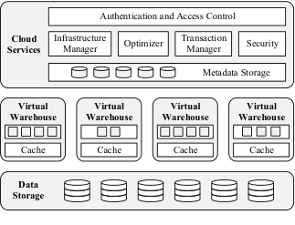
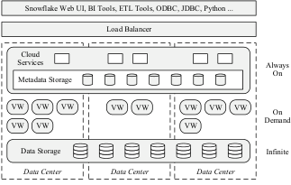
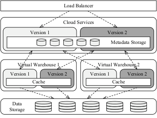
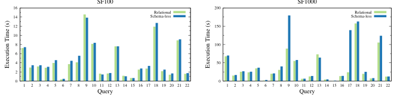
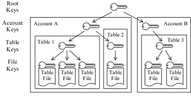
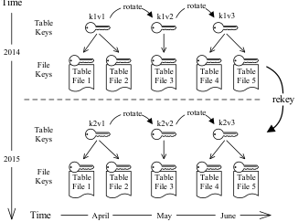

# The Snowflake Elastic Data Warehouse（中文译文）

## 译者说明

本文依据同目录的 `source.pdf` 翻译。章节、图表、公式、算法、代码与参考文献按原文结构保留。

## 摘要

我们生活在分布式计算的黄金时代。公有云平台如今可以按需提供几乎无限的计算和存储资源。同时，Software-as-a-Service (SaaS) 模型把企业级系统带给了过去因为成本和复杂度而无法负担这类系统的用户。遗憾的是，传统数据仓库系统很难适应这个新环境。一方面，它们是为固定资源设计的，因此无法利用云的弹性。另一方面，它们依赖复杂的 ETL 流水线和物理调优，这与云环境中新型半结构化数据以及快速演化工作负载对灵活性和新鲜度的要求相冲突。

我们认为需要一次根本性的重新设计。我们的使命是为云构建一个企业级数据仓库解决方案，其结果就是 Snowflake Elastic Data Warehouse，简称 Snowflake。Snowflake 是一个多租户、事务型、安全、高度可扩展且具备弹性的系统，完整支持 SQL，并内建对半结构化和无模式数据的扩展。系统以按量付费服务的形式运行在 Amazon 云上。用户把数据上传到云端后，可以立即使用熟悉的工具和接口管理、查询这些数据。实现工作始于 2012 年底，Snowflake 自 2015 年 6 月起全面可用。今天，Snowflake 已被越来越多大小组织用于生产环境。系统每天在多 PB 数据上运行数百万条查询。

本文描述 Snowflake 的设计，以及其新的 multi-cluster shared-data architecture。本文重点介绍 Snowflake 的若干关键特性：极强的弹性和可用性、半结构化和无模式数据、Time Travel，以及端到端安全。最后，本文总结经验教训并展望正在进行的工作。

**关键词：** 数据仓库，database as a service，multi-cluster shared-data architecture。

## 1. 引言

云的到来标志着软件交付和执行从本地服务器转向由 Amazon、Google 或 Microsoft 等平台提供商托管的共享数据中心和 SaaS 方案。云的共享基础设施承诺带来更高的规模经济、极端可扩展性和可用性，以及能够适应不可预测使用需求的按量付费成本模型。但这些优势只有在软件本身能够在云这一商品资源池上弹性扩展时才能真正获得。传统数据仓库方案早于云而出现，它们被设计为运行在小型、静态、行为良好的机器集群上，因此架构上并不适合云。

变化的不只是平台，数据本身也变了。过去，数据仓库中的大多数数据来自组织内部来源：事务系统、企业资源规划 (ERP) 应用、客户关系管理 (CRM) 应用等。数据的结构、规模和到达速率都相对可预测且已知。随着云的发展，相当大且快速增长的一部分数据来自更难控制的外部来源：应用日志、Web 应用、移动设备、社交媒体、传感器数据 (Internet of Things)。除了规模增长以外，这些数据经常以无模式、半结构化格式到达 [3]。传统数据仓库方案很难处理这类新数据，因为它们依赖深层 ETL 流水线和物理调优，而这些机制从根本上假定数据来自大体内部、可预测、变化缓慢且易于分类的来源。

面对这些不足，数据仓库社区的一部分转向了 Hadoop 或 Spark [8, 11] 等 “Big Data” 平台。虽然这些平台对于数据中心规模处理任务不可或缺，开源社区也在通过 Stinger Initiative [48] 等工作持续取得重要改进，但它们仍缺少成熟数据仓库技术的效率和特性集合。更重要的是，它们需要大量工程投入才能部署和使用 [16]。

我们认为，有一大类用例和工作负载可以受益于云的经济性、弹性和服务特性，但无论传统数据仓库技术还是 Big Data 平台都不能很好地服务这些需求。因此，我们决定专门为云构建一个全新的数据仓库系统。这个系统名为 Snowflake Elastic Data Warehouse，简称 Snowflake。与云数据管理领域许多其他系统不同，Snowflake 并不基于 Hadoop、PostgreSQL 或类似系统。处理引擎和大多数其他组件都是从头开发的。

Snowflake 的关键特性如下。

**纯 Software-as-a-Service (SaaS) 体验。** 用户不需要购买机器、雇用数据库管理员或安装软件。用户要么已经把数据放在云中，要么上传数据，也可以通过物理设备导入 [14]。随后，用户可以立即使用 Snowflake 的图形界面或 ODBC 等标准化接口操作和查询数据。与其他 Database-as-a-Service (DBaaS) 产品不同，Snowflake 的服务化覆盖整个用户体验。用户不需要处理调优开关、物理设计或存储整理任务。

**关系模型。** Snowflake 全面支持 ANSI SQL 和 ACID 事务。大多数用户能够以很少修改甚至不修改的方式迁移现有工作负载。

**半结构化数据。** Snowflake 为半结构化数据的遍历、展开和嵌套提供内建函数和 SQL 扩展，并支持 JSON、Avro 等常见格式。自动模式发现和列式存储使得对无模式半结构化数据的操作几乎与普通关系数据一样快，且不需要用户额外努力。

**弹性。** 存储和计算资源可以彼此独立、无缝地扩缩容，不影响数据可用性，也不影响并发查询的性能。

**高可用。** Snowflake 可以容忍节点、集群，甚至整个数据中心故障。软件或硬件升级期间没有停机。

**持久性。** Snowflake 以极高持久性为目标设计，并提供防止意外数据丢失的额外保护：克隆、撤销删除和跨区域备份。

**成本效率。** Snowflake 具备很高的计算效率，所有表数据都会被压缩。用户只为实际使用的存储和计算资源付费。

**安全。** 包括临时文件和网络流量在内的所有数据都端到端加密。用户数据绝不会以明文暴露给云平台。此外，基于角色的访问控制使用户能够在 SQL 层进行细粒度访问控制。

Snowflake 当前运行在 Amazon 云 (Amazon Web Services, AWS) 上，但未来可能移植到其他云平台。撰写本文时，Snowflake 每天在多 PB 数据上执行数百万条查询，服务来自多个领域、数量快速增长的大小组织。

**论文结构。** 第 2 节解释 Snowflake 背后的关键设计选择：存储与计算分离。第 3 节介绍由此形成的 multi-cluster shared-data architecture。第 4 节重点介绍若干差异化特性：持续可用性、半结构化和无模式数据、Time Travel 与克隆，以及端到端安全。第 5 节讨论相关工作。第 6 节以经验教训和正在进行的工作展望结束全文。

## 2. 存储与计算

Shared-nothing 架构已经成为高性能数据仓库的主导系统架构，主要有两个原因：可扩展性和商品硬件。在 shared-nothing 架构中，每个查询处理节点都有自己的本地磁盘。表被水平划分到各节点，每个节点只负责本地磁盘上的行。这种设计对星型模式查询扩展良好，因为把小型维表广播并与大型分区事实表连接所需带宽很低。并且由于共享数据结构或硬件资源的争用很少，也不需要昂贵的定制硬件 [25]。

在纯 shared-nothing 架构中，每个节点职责相同，并运行在相同硬件上。这种方法带来优雅且易于推理的软件，并有许多良好的次级效果。不过，纯 shared-nothing 架构有一个重要缺陷：它把计算资源和存储资源紧密耦合，在某些场景下会带来问题。

**异构工作负载。** 虽然硬件是同质的，但工作负载通常不是。适合批量加载的系统配置通常需要高 I/O 带宽和较轻计算，而适合复杂查询的系统配置则需要较少 I/O 和较重计算，二者彼此冲突。因此硬件配置必须折中，平均利用率较低。

**成员变更。** 如果节点集合发生变化，无论是节点故障还是用户选择调整系统规模，都需要重新分布大量数据。由于负责数据迁移和查询处理的是同一组节点，系统会出现显著性能影响，从而限制弹性和可用性。

**在线升级。** 虽然可以通过复制在某种程度上缓解小规模成员变更的影响，但软件和硬件升级最终会影响系统中的每个节点。原则上可以实现逐个节点升级、系统不停机的在线升级，但由于所有组件紧密耦合且预期同质，实现起来非常困难。

在本地部署环境中，这些问题通常可以容忍。工作负载可能异构，但如果只有一个小型固定节点池可用，用户能做的很少。节点升级很少发生，节点故障和系统扩缩容也不常见。

云中的情况完全不同。Amazon EC2 等平台提供许多不同节点类型 [4]。利用这些节点只需要把数据带到合适类型的节点。同时，节点故障更频繁，即便同类型节点之间性能也可能差异很大 [45]。因此，成员变化不是异常，而是常态。最后，支持在线升级和弹性扩展有很强动机。在线升级显著缩短软件开发周期并提高可用性。弹性扩展进一步提高可用性，并允许用户根据当下需求匹配资源消耗。

基于这些原因和其他考虑，Snowflake 将存储和计算分离。二者由两个松耦合、可独立扩展的服务处理。计算由 Snowflake 专有的 shared-nothing 引擎提供。存储由 Amazon S3 [5] 提供，原则上任何 blob store 都足够，例如 Azure Blob Storage [18, 36] 或 Google Cloud Storage [20]。为了减少计算节点和存储节点之间的网络流量，每个计算节点会在本地磁盘缓存一部分表数据。

这种方案的额外好处是，本地磁盘空间不会用于复制可能非常大且大多为冷数据的全部基础数据。相反，本地磁盘专门用于临时数据和缓存，这两类数据都是热数据，适合使用 SSD 等高性能存储设备。因此，一旦缓存预热，性能可以接近甚至超过纯 shared-nothing 系统。我们把这种新架构称为 multi-cluster shared-data architecture。

## 3. 架构

Snowflake 被设计为企业级服务。除提供高度易用性和互操作性外，企业级就意味着高可用。为此，Snowflake 采用 service-oriented architecture，由多个高度容错、可独立扩展的服务组成。这些服务通过 RESTful 接口通信，并分为三个架构层。

**Data Storage。** 该层使用 Amazon S3 存储表数据和查询结果。

**Virtual Warehouses。** 系统的“肌肉”。这一层在弹性的虚拟机集群内处理查询执行，这些集群称为 virtual warehouse。

**Cloud Services。** 系统的“大脑”。这一层是一组服务，用于管理 virtual warehouse、查询、事务，以及围绕这些对象的所有元数据：数据库模式、访问控制信息、加密密钥、使用统计等。

图 1 展示了 Snowflake 的三个架构层及其主要组件。



### 3.1 Data Storage

Snowflake 最初选择 Amazon Web Services (AWS) 作为平台有两个主要原因。第一，AWS 是当时最成熟的云平台产品。第二，与第一点相关，AWS 拥有最大的潜在用户池。

随后需要在使用 S3 和开发基于 HDFS 或类似系统 [46] 的自有存储服务之间选择。我们花了一些时间试验 S3，发现虽然其性能可能波动，但其易用性、高可用性和强持久性保证很难超越。因此，我们没有开发自己的存储服务，而是把精力投入 Virtual Warehouses 层的本地缓存和倾斜恢复技术。

与本地存储相比，S3 的访问延迟天然更高，每个 I/O 请求也带来更高 CPU 开销，尤其是在使用 HTTPS 连接时。但更重要的是，S3 是一个 blob store，只提供相对简单的基于 HTTP(S) 的 PUT、GET、DELETE 接口。对象，即文件，只能整体写入或覆写，甚至不能在文件末尾追加数据。事实上，PUT 请求中还必须预先声明文件的确切大小。不过，S3 支持对文件部分范围的 GET 请求。

这些属性强烈影响了 Snowflake 的表文件格式和并发控制方案。表被水平划分为大型不可变文件，这些文件类似传统数据库系统中的块或页。在每个文件内部，每个属性或列的值被分组存放并重度压缩，这就是文献中称为 PAX 或 hybrid columnar 的方案 [2]。每个表文件都有一个 header，其中包含各列在文件中的偏移等元数据。由于 S3 支持范围 GET 请求，查询只需要下载文件 header 和感兴趣的列。

Snowflake 不只用 S3 存储表数据。它还用 S3 存储查询算子生成的临时数据，例如本地磁盘空间耗尽后的大规模 join 溢写数据，以及大型查询结果。把临时数据溢写到 S3，使系统能够计算任意大的查询，而不会出现内存或磁盘耗尽错误。把查询结果存储到 S3 则支持新的客户端交互形式，并简化查询处理，因为它消除了传统数据库系统中的服务端游标需求。

目录对象、哪些 S3 文件组成某张表、统计信息、锁、事务日志等元数据存储在一个可扩展的事务型 key-value store 中，该存储属于 Cloud Services 层。

### 3.2 Virtual Warehouses

Virtual Warehouses 层由 EC2 实例集群组成。每个此类集群通过 virtual warehouse (VW) 抽象呈现给它的单个用户。组成 VW 的各个 EC2 实例称为 worker node。用户从不直接与 worker node 交互。事实上，用户不知道也不关心一个 VW 由哪些 worker node、多少 worker node 组成。VW 以抽象的 “T-Shirt size” 提供，从 X-Small 到 XX-Large 不等。这种抽象允许我们独立于底层云平台演化服务和定价。

#### 3.2.1 弹性与隔离

VW 是纯计算资源。它们可以按需在任意时刻创建、销毁或调整大小。创建或销毁 VW 不会影响数据库状态。用户在没有查询时关闭所有 VW 是完全合法的，甚至是被鼓励的。这种弹性允许用户根据使用需求动态匹配计算资源，并且不依赖数据规模。

每个单独查询恰好运行在一个 VW 上。worker node 不在 VW 之间共享，因此查询具有强性能隔离。也就是说，我们承认 worker node 共享是未来工作的重要方向，因为对于性能隔离不太关键的用例，它可以带来更高利用率和更低成本。

当新查询提交时，相应 VW 中的每个 worker node，或者优化器认为查询很小时的一部分节点，会启动一个新的 worker process。每个 worker process 只在查询持续期间存在。即便某个 worker process 属于 update 语句，它本身也不会造成外部可见效果，因为表文件不可变。worker 故障因此容易被限制，并通常通过重试解决。不过 Snowflake 当前还不执行局部重试，因此非常大且长时间运行的查询仍是关注点和未来工作方向。

每个用户在任意时刻可以运行多个 VW，而每个 VW 又可以运行多个并发查询。每个 VW 都能访问相同的共享表，不需要物理复制数据。

共享且近似无限的存储意味着用户可以共享和集成所有数据，这是数据仓库的核心原则之一。同时，用户可以从私有计算资源中获益，避免不同工作负载和组织单元之间互相干扰，这也是数据集市出现的原因之一。这种弹性与隔离催生了一些新的使用策略。Snowflake 用户常见做法是为来自不同组织单元的查询保留多个长期运行的 VW，并周期性启动按需 VW，例如用于批量加载。

与弹性相关的另一个重要观察是，通常可以用大致相同的价格获得好得多的性能。例如，在 4 个节点系统上需要 15 小时的数据加载，在 32 个节点上可能只需要 2 小时。由于用户按计算小时付费，总成本非常接近，但用户体验截然不同。因此，我们认为 VW 弹性是 Snowflake 架构最大的收益和差异点之一，也说明要利用云的独特能力，需要新的设计。

#### 3.2.2 本地缓存与文件窃取

每个 worker node 在本地磁盘维护表数据缓存。缓存是该节点过去访问过的表文件，即 S3 对象的集合。更准确地说，缓存保存文件 header 和单独的列，因为查询只下载它需要的列。缓存生命周期与 worker node 相同，并被并发和后续 worker process 共享。缓存不知道 worker process，也就是查询。它只看到文件和列请求流，并遵循简单的 least-recently-used (LRU) 替换策略，不感知各个查询。这个简单方案效果出人意料地好，但未来我们可能进一步细化，以更好匹配不同工作负载。

为了提高命中率并避免同一个 VW 的多个 worker node 冗余缓存单独的表文件，查询优化器使用基于表文件名的一致性哈希 [31] 把输入文件集合分配给 worker node。后续或并发查询如果访问相同表文件，就会在同一个 worker node 上执行访问。

Snowflake 中的一致性哈希是惰性的。当 worker node 集合因为节点故障或 VW 调整大小而变化时，系统不会立即迁移数据。相反，Snowflake 依赖 LRU 替换策略最终替换缓存内容。这种方案把缓存内容替换成本摊销到多个查询上，因此比 eager cache 或纯 shared-nothing 系统有更好的可用性，后者需要立即在节点之间迁移大量表数据。它还简化了系统，因为不存在“降级”模式。

除了缓存外，倾斜处理对于云数据仓库尤其重要。某些节点可能因为虚拟化问题或网络争用而执行得比其他节点慢很多。Snowflake 在多个位置处理这个问题，其中之一是在扫描层。当某个 worker process 完成自己输入文件集合的扫描后，它会向同伴请求额外文件，这种技术称为 file stealing。如果同伴在收到请求时发现自己的输入文件集合中还有很多文件，就会在当前查询的持续时间和作用域内把某个剩余文件的所有权转移给请求方。请求方随后直接从 S3 下载该文件，而不是从同伴节点下载。这种设计确保 file stealing 不会通过给落后节点增加负载而让事情更糟。

#### 3.2.3 执行引擎

如果另一个系统可以用 10 个节点在相同时间内执行某个查询，那么能够在 1000 个节点上执行该查询并没有多少价值。因此，可扩展性固然首要，单节点效率同样重要。我们希望给用户提供市场上所有 DBaaS 产品中最好的性价比，因此决定实现自己的现代 SQL 执行引擎。我们构建的引擎是列式、向量化和 push-based 的。

**列式存储与执行。** 对分析工作负载来说，列式存储和执行通常被认为优于行式存储和执行，因为它能更有效利用 CPU cache 和 SIMD 指令，并有更多机会使用轻量压缩 [1, 33]。

**向量化执行。** 与 MapReduce [42] 等系统不同，Snowflake 避免中间结果物化。数据以流水线方式处理，以几千行为一批的列式格式流经算子。这种由 VectorWise，即最初的 MonetDB/X100 [15]，开创的方法节省 I/O，并显著提高 cache 效率。

**Push-based 执行。** 关系算子会把结果推送给下游算子，而不是等待下游算子拉取数据，即传统 Volcano-style 模型 [27]。Push-based 执行把控制流逻辑从紧密循环中移出，从而提高 cache 效率 [41]。它还使 Snowflake 能够高效处理 DAG 形状的执行计划，而不仅是树形计划，为共享和流水线化中间结果创造更多机会。

同时，传统查询处理中的许多开销在 Snowflake 中不存在。尤其是，执行期间不需要事务管理。对引擎而言，查询是在一组固定的不可变文件上执行的。此外，也没有 buffer pool。多数查询会扫描大量数据。把内存用于表缓冲而不是用于操作本身，在这里是不好的取舍。不过，Snowflake 允许所有主要算子，如 join、group by、sort，在主内存耗尽时溢写到磁盘并递归执行。我们发现，纯内存引擎虽然更轻量，也可能更快，但过于受限，无法处理所有有意义的工作负载。分析工作负载可能包含极大的 join 或聚合。

### 3.3 Cloud Services

Virtual warehouse 是短暂的、用户特定的资源。相反，Cloud Services 层是高度多租户的。这一层的每个服务，包括访问控制、查询优化器、事务管理器等，都是长寿命的，并在许多用户之间共享。多租户提高利用率并降低管理开销，因此相比每个用户都有完全私有系统实例的传统架构，可以获得更好的规模经济。

每个服务都会复制以实现高可用和可扩展。因此，单个服务节点故障不会造成数据丢失或可用性丢失，尽管某些正在运行的查询可能失败并被透明地重新执行。

#### 3.3.1 查询管理与优化

用户发出的所有查询都会经过 Cloud Services 层。这里处理查询生命周期的早期阶段：解析、对象解析、访问控制和计划优化。

Snowflake 的查询优化器遵循典型的 Cascades-style 方法 [28]，采用自顶向下的基于代价优化。优化使用的所有统计信息都会在数据加载和更新时自动维护。由于 Snowflake 不使用索引，计划搜索空间比某些其他系统小。系统还通过把许多决策推迟到执行时进一步缩小计划空间，例如 join 的数据分布类型。这种设计减少优化器做出的错误决策，提高鲁棒性，代价是峰值性能略有损失。它也让系统更易用，因为性能更可预测，这与 Snowflake 对服务体验的整体关注一致。

优化器完成后，生成的执行计划会分发给参与查询的所有 worker node。查询执行时，Cloud Services 持续跟踪查询状态，以收集性能计数器并检测节点故障。所有查询信息和统计数据都会被保存，用于审计和性能分析。用户可以通过 Snowflake 图形界面监控和分析过去及正在运行的查询。

#### 3.3.2 并发控制

如前所述，并发控制完全由 Cloud Services 层处理。Snowflake 面向分析工作负载设计，这类负载往往以大读、批量或涓流插入以及批量更新为主。与这一工作负载空间中的大多数系统一样，我们决定使用 Snapshot Isolation (SI) [17] 实现 ACID 事务。

在 SI 下，某个事务的所有读取都会看到该事务开始时数据库的一致快照。按惯例，SI 构建在 multi-version concurrency control (MVCC) 之上，这意味着每个被修改的数据库对象副本都会保留一段时间。由于表文件不可变，MVCC 是自然选择，而表文件不可变又是使用 S3 存储的直接结果。对文件的修改只能通过用包含修改的新文件替换原文件完成。因此，表上的写操作，即 insert、update、delete、merge，会通过相对于先前表版本添加和删除整个文件来产生表的新版本。文件添加和删除会在元数据中记录，也就是在全局 key-value store 中记录，其形式允许非常高效地计算属于某个特定表版本的文件集合。

除了用于 SI 外，Snowflake 还使用这些快照实现 Time Travel 和数据库对象的高效克隆，详见第 4.4 节。

#### 3.3.3 裁剪

只访问与给定查询相关的数据，是查询处理最重要的方面之一。历史上，数据库通过 B+-tree 或类似数据结构形式的索引限制数据访问。虽然这种方法对事务处理非常有效，但对 Snowflake 这类系统会带来多个问题。第一，它严重依赖随机访问，而存储介质 S3 和压缩文件格式都不适合这种访问。第二，维护索引会显著增加数据量和数据加载时间。最后，用户需要显式创建索引，这与 Snowflake 的纯服务方法强烈冲突。即使借助调优顾问，维护索引也可能是复杂、昂贵且有风险的过程。

一种替代技术近来在大规模数据处理中流行起来：基于 min-max 的 pruning，也称为 small materialized aggregates [38]、zone maps [29] 或 data skipping [49]。在这种方法中，系统维护给定数据块，即记录集合、文件、块等的数据分布信息，特别是该块内的最小值和最大值。根据查询谓词，这些值可用于判断给定数据块对某个查询可能不需要。例如，假设文件 f1 和 f2 在列 x 中分别包含值 3..5 和 4..6。那么，如果查询包含谓词 `WHERE x >= 6`，我们知道只需要访问 f2。与传统索引不同，这类元数据通常比实际数据小数个数量级，因此存储开销小，访问速度快。

Pruning 很好地匹配了 Snowflake 的设计原则：它不依赖用户输入，扩展性好，并且易于维护。此外，它非常适合大块数据的顺序访问，并且对加载、查询优化和查询执行时间增加很少开销。

Snowflake 为每个单独的表文件保存与 pruning 相关的元数据。这些元数据不仅覆盖普通关系列，也覆盖半结构化数据中一组自动检测出的列。优化期间，系统会根据查询谓词检查元数据，以减少要为查询执行扫描的输入文件集合。优化器不仅对简单基础值谓词执行 pruning，也会对更复杂的表达式执行 pruning，例如 `WEEKDAY(orderdate) IN (6, 7)`。

除了静态 pruning 外，Snowflake 还在执行期间执行动态 pruning。例如，在 hash join 处理中，Snowflake 会收集 build 侧记录中 join key 的分布统计。该信息随后被推送到 probe 侧，用于过滤并可能跳过 probe 侧的整个文件。这是在 bloom join [40] 等其他已知技术之外的补充。

## 4. 特性亮点

Snowflake 提供关系数据仓库所期待的许多特性：全面 SQL 支持、ACID 事务、标准接口、稳定性和安全性、客户支持，当然还有强性能和可扩展性。此外，它还引入了一些在相关系统中很少见甚至从未见过的有价值特性。本节介绍其中几个我们认为具有技术差异化的特性。

### 4.1 纯 Software-as-a-Service 体验

Snowflake 支持标准数据库接口，包括 JDBC、ODBC、Python PEP-0249，并能与 Tableau、Informatica、Looker 等多种第三方工具和服务配合使用。不过，它也允许用户仅通过 Web 浏览器与系统交互。Web UI 看似微不足道，但很快证明自己是关键差异点。Web UI 使用户能够从任意位置和环境轻松访问 Snowflake，显著降低系统启动和使用复杂度。当许多数据已经在云上时，它允许许多用户直接把 Snowflake 指向自己的数据并开始查询，而无需下载任何软件。

可以预期，UI 不仅允许 SQL 操作，还提供对数据库目录、用户和系统管理、监控、使用信息等的访问。我们持续扩展 UI 功能，涉及在线协作、用户反馈和支持等方面。

不过，我们对易用性和服务体验的关注并不限于用户界面，而是延伸到系统架构的每个方面。没有故障模式、没有调优旋钮、没有物理设计、没有存储整理任务。一切都围绕数据和查询。

### 4.2 持续可用性

过去，数据仓库方案通常是隐藏很深的后端系统，与外界大部分隔离。在这种环境中，无论计划内停机，如软件升级或管理任务，还是计划外停机，如故障，通常都不会对运营产生很大影响。但随着数据分析对越来越多业务任务变得关键，持续可用性成为任何数据仓库的重要需求。这一趋势与现代 SaaS 系统的预期一致，后者大多是 always-on、面向客户且无计划停机的应用。Snowflake 提供符合这些期望的持续可用性。在这方面，两个主要技术特性是 fault resilience 和 online upgrade。

图 2 展示一个 Snowflake 多数据中心实例：Cloud Services 始终在线，多个按需 VW 共享无限 Data Storage。



#### 4.2.1 故障弹性

Snowflake 可以在架构所有层级容忍单节点故障和相关节点故障。Snowflake 当前的 Data Storage 层是 S3，S3 在多个数据中心之间复制，这些数据中心在 Amazon 术语中称为 availability zone (AZ)。跨 AZ 复制使 S3 能够处理完整 AZ 故障，并保证 99.99% 的数据可用性和 99.999999999% 的持久性。与 S3 的架构匹配，Snowflake 的元数据存储也分布并复制到多个 AZ 中。如果某个节点故障，其他节点可以接手其活动，而对最终用户影响很小。Cloud Services 层的其余服务由分布在多个 AZ 中的无状态节点组成，由负载均衡器在它们之间分发用户请求。因此，单节点故障甚至完整 AZ 故障不会造成系统级影响，可能只会让当前连接到故障节点的用户的某些查询失败。这些用户的下一个查询会被重定向到另一个节点。

相比之下，Virtual Warehouse 不跨 AZ 分布。这是出于性能原因。高网络吞吐对分布式查询执行至关重要，而同一 AZ 内的网络吞吐显著更高。如果某个 worker node 在查询执行期间故障，查询会失败但被透明地重新执行，或者立即替换故障节点，或者以临时减少的节点数执行。为了加速节点替换，Snowflake 维护一个小型 standby node 池，这些节点也用于快速 VW provisioning。

如果整个 AZ 不可用，运行在该 AZ 中某个 VW 上的所有查询都会失败，用户需要主动在另一个 AZ 中重新 provision 该 VW。由于完整 AZ 故障是真正灾难性的且极其罕见的事件，我们当前接受这一种局部系统不可用场景，但希望未来解决。

#### 4.2.2 在线升级

Snowflake 不仅在故障发生时提供持续可用性，也在软件升级期间提供持续可用性。系统被设计为允许各类服务的多个版本并行部署，包括 Cloud Services 组件和 virtual warehouse。这之所以可行，是因为所有服务实际上都是无状态的。所有硬状态都保存在事务型 key-value store 中，并通过一个负责元数据版本化和 schema evolution 的映射层访问。每当我们改变元数据 schema 时，都会确保与前一版本向后兼容。

执行软件升级时，Snowflake 首先把新版本服务部署在旧版本旁边。随后，用户账户逐步切换到新版本；在每个切换点，相应用户发出的所有新查询都会被导向新版本。正在旧版本上执行的所有查询都会被允许运行到完成。一旦所有查询和用户都停止使用旧版本，该版本的所有服务都会终止并下线。

图 3 展示一个正在进行的升级过程快照。Snowflake 的两个版本并行运行，版本 1 为浅色，版本 2 为深色。一个 Cloud Services 实例有两个版本，控制两个 virtual warehouse，每个 virtual warehouse 也有两个版本。负载均衡器把进入调用导向合适版本的 Cloud Services。某个版本的 Cloud Services 只与匹配版本的 VW 通信。



如前所述，两个版本的 Cloud Services 共享同一个元数据存储。此外，不同版本的 VW 能够共享相同 worker node 及其缓存。因此，升级后不需要重新填充缓存。整个过程对用户透明，没有停机或性能下降。

在线升级也极大影响了 Snowflake 的开发速度，以及处理关键 bug 的方式。撰写本文时，我们每周升级所有服务一次。这意味着我们按周发布功能和改进。为了确保升级过程顺利，升级和降级都会在一个特殊的预生产 Snowflake 实例中持续测试。极少数情况下，如果在生产实例中发现关键 bug，不一定是在升级期间，我们可以非常快速地降级到上一版本，或者实现修复并执行一次计划外升级。这个过程并不像听起来那样可怕，因为我们持续测试和演练升级、降级机制。它已经高度自动化并且足够成熟。

### 4.3 半结构化和无模式数据

Snowflake 使用三种半结构化数据类型扩展标准 SQL 类型系统：VARIANT、ARRAY 和 OBJECT。VARIANT 类型的值可以保存任意原生 SQL 类型值，如 DATE、VARCHAR 等，也可以保存可变长度的值数组，以及类似 JavaScript 的 OBJECT，即从字符串到 VARIANT 值的映射。后者在文献中也称为 document，由此产生 document store 的概念，例如 MongoDB [39] 和 Couchbase [23]。

ARRAY 和 OBJECT 只是 VARIANT 类型的受限形式。它们的内部表示相同：一种自描述、紧凑的二进制序列化格式，支持快速 key-value 查找，以及高效的类型测试、比较和哈希。因此，VARIANT 列可以像任何其他列一样用作 join key、grouping key 和 ordering key。

VARIANT 类型允许 Snowflake 采用 ELT (Extract-Load-Transform) 方式使用，而不是传统 ETL (Extract-Transform-Load)。用户不需要指定 document schema，也不需要在加载时执行转换。用户可以直接把 JSON、Avro 或 XML 格式输入数据加载到 VARIANT 列中；Snowflake 负责解析和类型推断。这种方法在文献中被贴切地称为 “schema later”，它通过解耦信息生产者、信息消费者和中间环节来支持 schema evolution。相比之下，传统 ETL 流水线中的任何数据 schema 变更都需要组织内多个部门协调，可能需要数月才能完成。

ELT 和 Snowflake 的另一个优势是，如果后续需要转换，可以使用并行 SQL 数据库的全部能力执行，包括 join、sort、aggregation、复杂谓词等操作，而这些操作在传统 ETL 工具链中通常缺失或低效。在这一点上，Snowflake 还提供过程式 user-defined function (UDF)，具备完整 JavaScript 语法并与 VARIANT 数据类型集成。对过程式 UDF 的支持进一步增加了可推入 Snowflake 的 ETL 任务数量。

#### 4.3.1 后关系操作

document 上最重要的操作是数据元素抽取，可以按字段名抽取 OBJECT，也可以按偏移抽取 ARRAY。Snowflake 同时提供函数式 SQL 记法和类似 JavaScript 的路径语法。内部编码使抽取非常高效。子元素只是父元素内部的一个指针，不需要复制。抽取之后通常会把得到的 VARIANT 值转换成标准 SQL 类型。编码同样让这些转换非常高效。

第二个常见操作是 flattening，即把嵌套 document 透视为多行。Snowflake 使用 SQL lateral view 表示 flattening 操作。这种 flattening 可以递归执行，使 document 的层次结构可以完整转换为适合 SQL 处理的关系表。flattening 的相反操作是聚合。为此，Snowflake 引入了一些新的聚合和分析函数，例如 ARRAY_AGG 和 OBJECT_AGG。

#### 4.3.2 列式存储与处理

使用序列化二进制表示来把半结构化数据集成到关系数据库中，是一种常规设计选择。不幸的是，与列式关系数据相比，行式表示使这类数据的存储和处理效率更低，这也是通常要把半结构化数据转换为普通关系数据的原因。

Cloudera Impala [21] 结合 Parquet [10]，以及 Google Dremel [34] 已经证明半结构化数据的列式存储可行且有益。不过，Impala 和 Dremel，以及其外部化形态 BigQuery [44]，要求用户为列式存储提供完整表 schema。为了同时获得无模式序列化表示的灵活性和列式关系数据库的性能，Snowflake 引入了一种新的自动类型推断和列式存储方法。

如第 3.1 节所述，Snowflake 以 hybrid columnar 格式存储数据。存储半结构化数据时，系统会自动对单个表文件中的 document 集合执行统计分析，以进行自动类型推断，并确定哪些 typed path 经常共同出现。对应列随后从 document 中移出，并使用与原生关系数据相同的压缩列式格式单独存储。对这些列，Snowflake 甚至会计算 materialized aggregate，用于 pruning，与普通关系数据相同。

扫描期间，各列可以重新组装成单个 VARIANT 类型列。不过，多数查询只对原始 document 的部分列感兴趣。在这些情况下，Snowflake 会把 projection 和 cast 表达式下推到 scan operator，使其只访问必要列并直接转换为目标 SQL 类型。

上述优化会针对每个表文件独立执行，因此即便发生 schema evolution，仍能高效存储和抽取。不过，这也给查询优化带来挑战，特别是 pruning。假设某个查询对路径表达式有谓词，而我们希望使用 pruning 限制要扫描的文件集合。该路径及对应列可能出现在多数文件中，但只有某些文件中频繁到值得维护元数据。保守方案是扫描所有没有合适元数据的文件。Snowflake 在这一方案上改进：对 document 中出现的所有路径，而非值，计算 Bloom filter。这些 Bloom filter 与其他文件元数据一起保存，并在 pruning 期间由查询优化器探测。不包含某个查询所需路径的表文件可以安全跳过。

#### 4.3.3 乐观转换

由于一些原生 SQL 类型，特别是 date/time 值，在 JSON 或 XML 等常见外部格式中表示为字符串，这些值需要在写入时，即 insert 或 update 期间，或读取时，即查询期间，从字符串转换为实际类型。没有 typed schema 或等价提示时，这些字符串转换需要在读取时执行；而在读密集工作负载中，这比写入时只转换一次低效。无类型数据的另一个问题是缺少适合 pruning 的元数据，这对日期尤其重要，因为分析工作负载常常在日期列上有范围谓词。

但如果在写入时自动转换，可能丢失信息。例如，包含数字产品标识符的字段实际上可能不是数字，而是带有重要前导零的字符串。同样，看起来像日期的内容可能实际上是短信正文。Snowflake 通过乐观数据转换解决这个问题：同时保留转换结果和原始字符串，除非转换完全可逆，并把二者放在不同列中。如果后续查询需要原始字符串，可以轻松检索或重建。由于未使用列不会被加载和访问，双重存储对查询性能的影响很小。

#### 4.3.4 性能

为了评估半结构化数据上的列式存储、乐观转换和 pruning 对查询性能的综合影响，我们使用类似 TPC-H 的数据和查询进行了一组实验。实验结果使用忠实实现的 TPC-H 数据生成和查询获得，但数据、查询和数字没有经 TPC 验证，不构成官方基准结果。

我们创建了两类数据库 schema。第一类是常规的关系 TPC-H schema。第二类是 “schema-less” 数据库 schema，其中每张表只包含一个 VARIANT 类型列。随后，我们生成聚簇，即排序的 SF100 和 SF1000 数据集，大小分别为 100 GB 和 1 TB，把这些数据集以普通 JSON 格式存储，也就是日期变成字符串，并用关系和 schema-less 两种数据库 schema 将数据加载到 Snowflake。系统没有获得任何关于 schema-less 数据字段、类型和聚簇的提示，也没有进行其他调优。然后，我们在 schema-less 数据库之上定义了若干视图，以便能够对四个数据库运行完全相同的一组 TPC-H 查询。撰写本文时，Snowflake 不使用视图进行类型推断或其他优化，因此这只是语法便利。

最后，我们使用一个 medium standard warehouse 对四个数据库运行全部 22 个 TPC-H 查询。图 4 展示结果。数字来自三次 warm cache 运行。标准误差不显著，因此省略。



可以看到，除两个查询外，schema-less 存储和查询处理的开销大约为 10%。这两个查询是 SF1000 上的 Q9 和 Q17。我们确认导致降速的原因是 sub-optimal join order，而该 join order 来自 distinct value estimation 中的一个已知 bug。我们持续改进半结构化数据上的元数据收集和查询优化。

总结来说，对具有相对稳定且简单 schema 的半结构化数据，即实践中发现的大多数机器生成数据，查询性能几乎与常规关系数据相当，享有列式存储、列式执行和 pruning 的所有收益，而且无需用户努力。

### 4.4 Time Travel 与 Cloning

在第 3.3.2 节中，我们讨论了 Snowflake 如何在 MVCC 之上实现 Snapshot Isolation (SI)。表上的写操作，即 insert、update、delete、merge，会通过添加和删除整个文件产生表的新版本。

当新版本移除文件时，系统会保留这些文件一段可配置时间，当前最长可达 90 天。文件保留使 Snowflake 能够非常高效地读取早期表版本，也就是对数据库执行 Time Travel。用户可以通过方便的 `AT` 或 `BEFORE` 语法从 SQL 访问这一功能。时间戳可以是绝对时间，也可以相对于当前时间，或相对于先前语句，即通过 ID 引用。

```sql
SELECT * FROM my_table AT(TIMESTAMP =>
  'Mon, 01 May 2015 16:20:00 -0700'::timestamp);

SELECT * FROM my_table AT(OFFSET => -60*5); -- 5 min ago

SELECT * FROM my_table BEFORE(STATEMENT =>
  '8e5d0ca9-005e-44e6-b858-a8f5b37c5726');
```

甚至可以在单个查询中访问同一张表的不同版本。

```sql
SELECT new.key, new.value, old.value
FROM my_table new
JOIN my_table AT(OFFSET => -86400) old -- 1 day ago
  ON new.key = old.key
WHERE new.value <> old.value;
```

基于同样的底层元数据，Snowflake 引入 `UNDROP` 关键字，用于快速恢复意外删除的表、schema 或整个数据库。

```sql
DROP DATABASE important_db; -- whoops!
UNDROP DATABASE important_db;
```

Snowflake 还实现了一项称为 cloning 的功能，通过新关键字 `CLONE` 表达。克隆一张表会快速创建一张具有相同定义和内容的新表，而不需要物理复制表文件。clone 操作只是复制源表元数据。刚克隆后，两张表引用相同文件集合，但之后两张表可以独立修改。clone 特性还支持整个 schema 或数据库，因此可以非常高效地制作快照。在大批量更新前，或执行长时间探索性数据分析时，快照是良好实践。`CLONE` 关键字甚至可以与 `AT` 和 `BEFORE` 组合，从而在事后制作这类快照。

```sql
CREATE DATABASE recovered_db
CLONE important_db BEFORE(
  STATEMENT => '8e5d0ca9-005e-44e6-b858-a8f5b37c5726');
```

### 4.5 安全

Snowflake 被设计为在架构所有层级保护用户数据免受攻击，包括云平台层面。为此，Snowflake 实现了双因素认证、客户端加密数据导入导出、安全数据传输和存储，以及对数据库对象的 role-based access control (RBAC [26])。任何时候，数据在通过网络发送前、写入本地磁盘或共享存储 S3 前都会被加密。因此，Snowflake 提供完整端到端数据加密和安全。

#### 4.5.1 密钥层次结构

Snowflake 使用强 AES 256-bit 加密，并采用根植于 AWS CloudHSM [12] 的层次化密钥模型。加密密钥会自动轮换和重新加密，即 rekeyed，以确保密钥完成完整的 NIST 800-57 加密密钥管理生命周期 [13]。加密和密钥管理对用户完全透明，不需要配置或管理。

图 5 所示的 Snowflake 密钥层次结构有四层：root key、account key、table key 和 file key。每一层父密钥都会加密，即 wrap，下方一层子密钥。每个 account key 对应一个用户账户，每个 table key 对应一张数据库表，每个 file key 对应一个表文件。



层次化密钥模型是良好的安全实践，因为它限制每个密钥保护的数据量。每一层都会缩小下方密钥的作用域，如图 5 中方框所示。Snowflake 的层次化密钥模型保证了其多租户架构中的用户数据隔离，因为每个用户账户都有单独的 account key。

#### 4.5.2 密钥生命周期

与限制每个密钥保护的数据量正交，Snowflake 还限制密钥可用的时间长度。加密密钥经历四个阶段：(1) pre-operational creation 阶段，(2) operational 阶段，此时密钥用于加密，即 originator-usage period，以及解密，即 recipient-usage period，(3) post-operational 阶段，此时密钥不再使用，(4) destroyed 阶段。阶段 1、3 和 4 实现起来很直接。阶段 2 需要限制 originator-usage period 和 recipient-usage period。只有当某个密钥不再加密任何必需数据时，它才能进入阶段 3 和 4。Snowflake 使用 key rotation 限制 originator-usage period，使用 rekeying 限制 recipient-usage period。

Key rotation 会按固定间隔，例如一个月，创建密钥的新版本。每个间隔结束后，创建密钥新版本，并将先前版本标记为 retired。retired 版本仍可使用，但只能用于解密数据。在密钥层次结构中 wrap 新子密钥，或者写入表时，只使用最新的 active 版本加密数据。

Rekeying 是用新密钥重新加密旧数据的过程。在某个特定时间间隔后，例如一年，使用 retired key 加密的数据会用 active key 重新加密。这一 rekeying 与 key rotation 正交。Key rotation 确保密钥从 active 状态，即 originator usage，转移到 retired 状态，即 recipient usage；rekeying 则确保密钥可以从 retired 状态转移到 destroyed 状态。

图 6 展示单个 table key 的生命周期。假设密钥每月轮换一次，数据每年 rekey 一次。Table file 1 和 2 于 2014 年 4 月创建，使用 key 1 version 1 (k1v1)。2014 年 5 月，key 1 轮换到 version 2 (k1v2)，table file 3 使用 k1v2 创建。2014 年 6 月，key 1 轮换到 version 3 (k1v3)，又创建两个表文件。2014 年 6 月之后，该表不再有插入或更新。2015 年 4 月，k1v1 满一年，需要销毁。系统创建新密钥 key 2 version 1 (k2v1)，并用 k2v1 对所有关联 k1v1 的文件 rekey。2015 年 5 月，k1v2 及 table file 3 发生同样过程，用 k2v2 rekey。2015 年 6 月，table file 4 和 5 使用 k2v3 rekey。



Account key 与 table key 之间、root key 与 account key 之间实现了类似方案。密钥层次结构中的每一层都会经历 key rotation 和 rekeying，包括 root key。Account key 和 root key 的 key rotation 与 rekeying 不需要重新加密文件，只需要重新加密直接下层的密钥。

不过，table key 与 file key 的关系不同。File key 不是由 table key wrap。相反，file key 由 table key 和唯一文件名组合以密码学方式派生。因此，只要 table key 改变，其所有相关 file key 都会改变，于是受影响表文件需要重新加密。密钥派生的主要好处是消除了创建、管理和传递单独 file key 的需求。像 Snowflake 这样处理数十亿文件的系统，否则需要处理数 GB 的 file key。

我们也因为 Snowflake 的存储和计算分离选择这一设计，因为它允许在不影响用户工作负载的情况下执行重新加密。Rekeying 在后台工作，使用与查询不同的 worker node。文件 rekey 后，Snowflake 原子地更新数据库表元数据，使其指向新加密文件。旧文件会在所有正在运行的查询结束后删除。

#### 4.5.3 端到端安全

Snowflake 使用 AWS CloudHSM 作为防篡改、高安全性的方式来生成、存储和使用密钥层次结构中的 root key。AWS CloudHSM 是一组硬件安全模块 (HSM)，连接到 AWS 内的一个 virtual private cluster。Root key 永远不会离开 HSM 设备。所有使用 root key 的密码学操作都在 HSM 内部执行。因此，如果没有对 HSM 设备的授权访问，低层密钥无法被 unwrap。HSM 也用于在 account 层和 table 层生成密钥，包括 key rotation 和 rekeying 期间。我们以高可用配置部署 AWS CloudHSM，以最大限度降低服务中断可能性。

除了数据加密外，Snowflake 还通过以下方式保护用户数据：

1. 通过 S3 上的访问策略隔离存储。
2. 在用户账户内通过 role-based access control 对数据库对象进行细粒度访问控制。
3. 加密数据导入和导出，使云提供商 Amazon 永远看不到明文数据。
4. 通过双因素认证和联合认证实现安全访问控制。

总之，Snowflake 提供根植于 AWS CloudHSM 的层次化密钥模型，并使用 key rotation 和 rekeying 确保加密密钥遵循标准化生命周期。密钥管理对用户完全透明，不需要配置、管理或停机。它是综合安全策略的一部分，支持完整端到端加密和安全。

## 5. 相关工作

**基于云的并行数据库系统。** Amazon 拥有多个 DBaaS 产品，其中 Amazon Redshift 是数据仓库产品。Redshift 演化自并行数据库系统 ParAccel，可以说是第一个真正以服务形式提供的数据仓库系统 [30]。Redshift 使用经典 shared-nothing 架构。因此，虽然它可扩展，但增加或移除计算资源需要数据重新分布。相比之下，Snowflake 的 multi-cluster shared-data architecture 允许用户在不移动数据的情况下，即时扩大、缩小甚至暂停与存储独立的计算资源，并允许跨隔离计算资源集成数据。此外，遵循纯服务原则，Snowflake 不要求用户进行物理调优、数据整理、手动收集表统计信息或表 vacuum。虽然 Redshift 可以把 JSON 等半结构化数据作为 VARCHAR 摄入，Snowflake 则原生支持半结构化数据，包括列式存储等重要优化。

Google Cloud Platform 提供名为 BigQuery 的全托管查询服务 [44]，这是 Dremel [34] 的公开实现。BigQuery 服务允许用户在数千节点并行下以惊人速度对 TB 级数据运行查询。BigQuery 对 JSON 和嵌套数据的支持是 Snowflake 的灵感之一，我们认为这对现代分析平台是必要的。不过，BigQuery 虽然提供类 SQL 语言，但与 ANSI SQL 语法和语义有一些根本偏差，使它很难与基于 SQL 的产品配合使用。此外，BigQuery 表是 append-only 且要求 schema。相比之下，Snowflake 提供完整 DML，即 insert、update、delete、merge，ACID 事务，并且不要求为半结构化数据定义 schema。

Microsoft SQL Data Warehouse (Azure SQL DW) 是 Azure 云平台和服务中的较新成员，基于 SQL Server 及其 Analytics Platform System (APS) appliance [35, 37]。与 Snowflake 类似，它分离存储和计算。计算资源可通过 data warehouse unit (DWU) 扩展。不过，其并发度受到限制。对任何数据仓库，并发执行查询的最大数量为 32 [47]。相比之下，Snowflake 允许通过 virtual warehouse 完全独立地扩展并发工作负载。Snowflake 用户也不需要承担选择合适 distribution key 和其他管理任务的负担。虽然 Azure SQL DW 确实通过 PolyBase [24] 支持对非关系数据的查询，但它没有类似 Snowflake VARIANT 类型及相关优化的内建半结构化数据支持。

**Document store 与 Big Data。** MongoDB [39]、Couchbase Server [23] 和 Apache Cassandra [6] 等 document store 近年来在应用开发者中越来越受欢迎，因为它们提供可扩展性、简单性和 schema 灵活性。不过，这些系统简单的 key-value 与 CRUD，即 create、read、update、delete，API 带来的一个挑战是难以表达更复杂查询。作为回应，出现了若干类 SQL 查询语言，例如 Couchbase 的 N1QL [22] 和 Apache Cassandra 的 CQL [19]。此外，许多 Big Data 引擎现在支持对嵌套数据的查询，例如 Apache Hive [9]、Apache Spark [11]、Apache Drill [7]、Cloudera Impala [21] 和 Facebook Presto [43]。我们认为，这显示了对无模式和半结构化数据执行复杂分析的真实需求，而我们的半结构化数据支持从这些系统中获得了许多启发。通过 schema inference、optimistic conversion 和 columnar storage，Snowflake 将这些系统的灵活性与关系数据库的存储效率、执行效率和复杂查询支持结合起来。

## 6. 经验教训与展望

Snowflake 于 2012 年创立时，数据库世界完全集中在 SQL on Hadoop 上，短时间内出现了十几个系统。当时，选择一个完全不同方向，即为云构建“经典”数据仓库系统，看起来是逆势且有风险的举动。经过 3 年开发后，我们确信这是正确选择。Hadoop 没有取代 RDBMS，而是补充了它们。人们仍然想要关系数据库，但希望它更高效、更灵活、更适合云。

Snowflake 实现了我们对云原生系统能够提供给用户和本文作者的期望。Multi-cluster shared-data architecture 的弹性改变了用户处理数据任务的方式。SaaS 模型不仅让用户容易试用和采用系统，也极大帮助了我们的开发和测试。凭借单一生产版本和在线升级，我们能够比传统开发模型更快地发布新功能、提供改进并修复问题。

虽然我们原本希望半结构化扩展会有用，但其采用速度仍令我们惊讶。我们发现一种非常流行的模式：组织使用 Hadoop 做两件事，存储 JSON，以及把 JSON 转换成可以加载到 RDBMS 的格式。通过提供一个可以原样高效存储和处理半结构化数据、并在其上提供强大 SQL 接口的系统，我们发现 Snowflake 不仅替代了传统数据库系统，也替代了 Hadoop 集群。

当然，这一路并不轻松。虽然我们的团队合计拥有超过 100 年的数据库开发经验，但我们仍犯了一些本可避免的错误，包括某些关系算子的早期实现过于简单、没有足够早地把所有数据类型纳入引擎、没有足够早关注资源管理、推迟全面日期和时间功能等。此外，我们持续专注于避免调优旋钮，也带来了一系列工程挑战，最终促成了许多令人兴奋的技术方案。结果是，今天 Snowflake 只有一个调优参数：用户想要多少性能，以及愿意为此付多少钱。

Snowflake 的性能已经很有竞争力，尤其考虑到无需调优这一点，但我们知道还有许多尚未投入时间完成的优化。某种程度上出人意料的是，核心性能几乎从未成为用户的问题。原因是 virtual warehouse 提供的弹性计算可以在偶尔需要时提供性能提升。这使我们把开发精力集中到系统的其他方面。

我们面临的最大技术挑战与系统的 SaaS 和多租户方面有关。构建一个能够支持数百用户并发的元数据层，是非常困难且复杂的任务。处理各种节点故障、网络故障和支撑服务故障是一场永无止境的战斗。安全一直是并将继续是重要主题：保护系统和用户数据免受外部攻击、用户自身以及我们内部用户的影响。维护一个由数百节点组成、每天运行数百万查询的在线系统，同时 Snowflake 用户持续向系统提交越来越大、越来越复杂的问题，也在影响系统演化。

我们当前正在通过提供额外元数据结构和数据重组织任务来改进数据访问性能，并重点追求最少甚至无需用户交互。我们继续改进和扩展核心查询处理功能，包括标准 SQL 和半关系扩展。我们计划进一步改进倾斜处理和负载均衡策略，随着用户工作负载规模增长，这些策略的重要性也在提高。我们正在开发简化用户工作负载管理的方案，使系统更加弹性。我们也在推进与外部系统的集成，包括高频数据加载等问题。

Snowflake 未来最大的挑战是转向完整 self-service 模型，使用户能够在没有我们介入的任何阶段自行注册并与系统交互。这会带来许多安全、性能和支持挑战。我们期待迎接这些挑战。

## 7. 致谢

Snowflake 是太多人的工作成果，无法在这里一一列出。我们感谢整个 Snowflake 工程团队对产品的贡献，以及他们投入其中的所有努力、心血和自豪感。我们也感谢所有其他 “Snowflakes”，感谢他们为把这个产品带给用户、共同建设一家优秀公司所做的出色工作。能够与这样优秀的团队一起工作，我们始终深受触动并心怀谦逊。

## 8. 参考文献

- [1] D. J. Abadi, S. R. Madden, and N. Hachem. Column-stores vs. row-stores: How different are they really? In Proc. SIGMOD, 2008.
- [2] A. Ailamaki, D. J. DeWitt, M. D. Hill, and M. Skounakis. Weaving relations for cache performance. In Proc. VLDB, 2001.
- [3] S. Alsubaiee et al. AsterixDB: A scalable, open source DBMS. PVLDB, 7(14):1905-1916, 2014.
- [4] Amazon Elastic Compute Cloud (EC2). aws.amazon.com/ec2/instance-types.
- [5] Amazon Simple Storage Service (S3). aws.amazon.com/s3.
- [6] Apache Cassandra. cassandra.apache.org.
- [7] Apache Drill. drill.apache.org.
- [8] Apache Hadoop. hadoop.apache.org.
- [9] Apache Hive. hive.apache.org.
- [10] Apache Parquet. parquet.apache.org.
- [11] Apache Spark. spark.apache.org.
- [12] AWS CloudHSM. aws.amazon.com/cloudhsm.
- [13] E. Barker. NIST SP 800-57 - Recommendation for Key Management - Part 1: General (Revision 4), chapter 7. 2016.
- [14] J. Barr. AWS Import/Export Snowball - Transfer 1 petabyte per week using Amazon-owned storage appliances. aws.amazon.com/blogs/aws/aws-importexport-snowball-transfer-1-petabyte-per-week-using-amazon-owned-storage-appliances/, 2015.
- [15] P. Boncz, M. Zukowski, and N. Nes. MonetDB/X100: Hyper-pipelining query execution. In Proc. CIDR, 2005.
- [16] V. R. Borkar, M. J. Carey, and C. Li. Big data platforms: What's next? ACM Crossroads, 19(1):44-49, 2012.
- [17] M. J. Cahill, U. Rohm, and A. D. Fekete. Serializable isolation for snapshot databases. In Proc. SIGMOD, 2008.
- [18] B. Calder et al. Windows Azure Storage: A highly available storage service with strong consistency. In Proc. SOSP, 2011.
- [19] Cassandra Query Language (CQL). cassandra.apache.org/doc/cql3/CQL.html.
- [20] Cloud Storage - Google Cloud Platform. cloud.google.com/storage.
- [21] Cloudera Impala. impala.io.
- [22] Couchbase N1QL. couchbase.com/n1ql.
- [23] Couchbase Server. couchbase.com.
- [24] D. J. DeWitt, A. Halverson, R. Nehme, S. Shankar, J. Aguilar-Saborit, A. Avanes, M. Flasza, and J. Gramling. Split query processing in Polybase. In Proc. SIGMOD, 2013.
- [25] D. J. DeWitt, S. Madden, and M. Stonebraker. How to build a high-performance data warehouse. db.csail.mit.edu/madden/high_perf.pdf, 2006.
- [26] D. Ferraiolo, D. R. Kuhn, and R. Chandramouli. Role-based access control. Artech House Publishers, 2003.
- [27] G. Graefe. Volcano: An extensible and parallel query evaluation system. IEEE TKDE, 6(1), 1994.
- [28] G. Graefe. The cascades framework for query optimization. Data Engineering Bulletin, 18, 1995.
- [29] G. Graefe. Fast loads and fast queries. In Data Warehousing and Knowledge Discovery, volume 5691 of LNCS. Springer, 2009.
- [30] A. Gupta et al. Amazon Redshift and the case for simpler data warehouses. In Proc. SIGMOD, 2015.
- [31] D. Karger, E. Lehman, T. Leighton, R. Panigrahy, M. Levine, and D. Lewin. Consistent hashing and random trees: Distributed caching protocols for relieving hot spots on the world wide web. In Proc. STOC, 1997.
- [32] J. Krueger, M. Grund, C. Tinnefeld, H. Plattner, A. Zeier, and F. Faerber. Optimizing write performance for read optimized databases. In Proc. DASFAA, 2010.
- [33] S. Manegold, M. L. Kersten, and P. Boncz. Database architecture evolution: Mammals flourished long before dinosaurs became extinct. PVLDB, 2(2):1648-1653, 2009.
- [34] S. Melnik, A. Gubarev, J. J. Long, G. Romer, S. Shivakumar, M. Tolton, and T. Vassilakis. Dremel: Interactive analysis of web-scale datasets. PVLDB, 3(1-2):330-339, 2010.
- [35] Microsoft Analytics Platform System. www.microsoft.com/en-us/server-cloud/products/analytics-platform-system.
- [36] Microsoft Azure Blob Storage. azure.microsoft.com/en-us/services/storage/blobs.
- [37] Microsoft Azure SQL DW. azure.microsoft.com/en-us/services/sql-data-warehouse.
- [38] G. Moerkotte. Small materialized aggregates: A light weight index structure for data warehousing. In Proc. VLDB, 1998.
- [39] MongoDB. mongodb.com.
- [40] J. K. Mullin. Optimal semijoins for distributed database systems. IEEE TSE, 16(5):558-560, 1990.
- [41] T. Neumann. Efficiently compiling efficient query plans for modern hardware. PVLDB, 4(9):539-550, 2011.
- [42] A. Pavlo, E. Paulson, A. Rasin, D. J. Abadi, D. J. DeWitt, S. Madden, and M. Stonebraker. A comparison of approaches to large-scale data analysis. In Proc. SIGMOD, 2009.
- [43] Presto. prestodb.io.
- [44] K. Sato. An inside look at Google BigQuery. cloud.google.com/files/BigQueryTechnicalWP.pdf, 2012.
- [45] J. Schad, J. Dittrich, and J.-A. Quiane-Ruiz. Runtime measurements in the cloud: Observing, analyzing, and reducing variance. PVLDB, 3(1):460-471, 2010.
- [46] K. Shvachko, H. Kuang, S. Radia, and R. Chansler. The Hadoop distributed file system. In Proc. MSST, 2010.
- [47] SQL DW Concurrency. azure.microsoft.com/en-us/documentation/articles/sql-data-warehouse-develop-concurrency.
- [48] Stinger.next: Enterprise SQL at Hadoop scale. hortonworks.com/innovation/stinger.
- [49] L. Sun, M. J. Franklin, S. Krishnan, and R. S. Xin. Fine-grained partitioning for aggressive data skipping. In Proc. SIGMOD, 2014.
