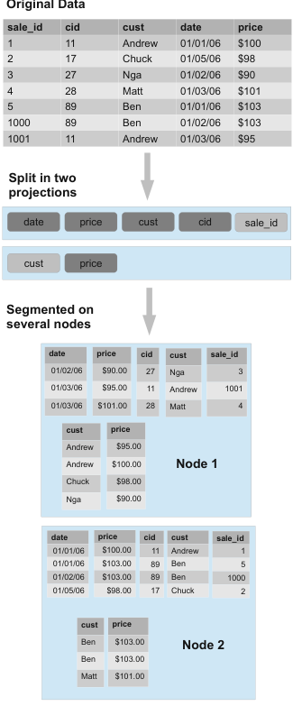
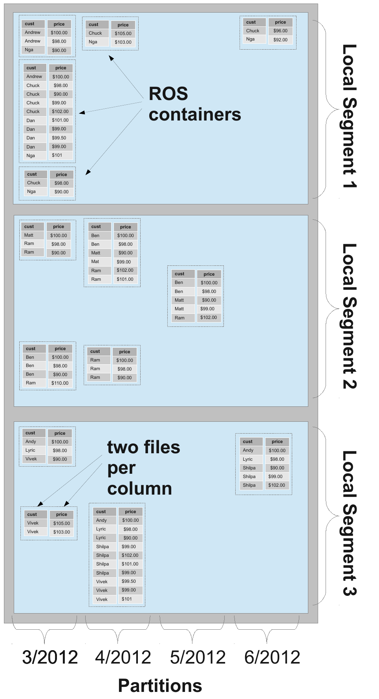
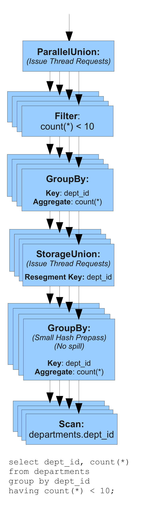

# The Vertica Analytic Database: C-Store 7 Years Later（中文译文）

## 译者说明

本文依据同目录的 `source.pdf` 翻译。章节、图表、公式、算法、代码与参考文献按原文结构保留。

## 作者与出版信息

- 作者：Andrew Lamb、Matt Fuller、Ramakrishna Varadarajan、Nga Tran、Ben Vandiver、Lyric Doshi、Chuck Bear
- 机构与地点：Vertica Systems, An HP Company；Cambridge, MA
- 电子邮箱：`{alamb, mfuller, rvaradarajan, ntran, bvandiver, ldoshi, cbear}@vertica.com`

原文允许为个人或课堂用途免费制作全部或部分作品的数字或纸质副本，条件是副本不得用于营利或商业利益，并须在首页保留该声明及完整引文。复制到其他用途、再版、发布到服务器或向邮件列表再分发，需要事先获得明确许可并且/或者支付费用。本文所在卷的论文获邀在 2012 年 8 月 27 日至 31 日于土耳其伊斯坦布尔举行的第 38 届 Very Large Data Bases 国际会议上报告成果。

出版信息：*Proceedings of the VLDB Endowment*，Vol. 5, No. 12；Copyright 2012 VLDB Endowment 2150-8097/12/08；原文标示价格为 `$10.00`。

## 摘要

本文描述 Vertica Analytic Database (Vertica) 的系统架构。Vertica 是 C-Store 研究原型设计的商业化实现。Vertica 展示了一个现代商业 RDBMS：它提供经典关系接口，同时通过合适的架构选择，达到现代 “web scale” 分析系统所期望的高性能。Vertica 也给出了一个有启发性的案例，说明学术系统研究如何直接商业化为成功产品。

## 1. 引言

Vertica Analytic Database (Vertica) 是一个分布式[^1]、大规模并行 RDBMS 系统，它商业化了 C-Store [21] 项目的思想。Vertica 是少数被广泛用于业务关键系统的新商业关系数据库之一。撰写本文时，Vertica 已有超过 500 个生产部署，其中至少 3 个显著超过 1 PB。

尽管学术界和工业界近期对所谓 “NoSQL” 系统 [13, 19, 12] 兴趣浓厚，C-Store 项目早已预见到 web scale 分布式处理的需求，而这些新的 NoSQL 系统也使用了许多 C-Store 和其他关系系统中已有的技术。和任何语言或系统一样，SQL 并不完美，但它对应用开发者是一个变革性的抽象，使开发者摆脱许多关于数据存储和查找的实现细节，转而把精力集中到有效使用信息上。

Vertica 在市场中的经验，以及 Hive [7]、Tenzing [9] 等其他技术的出现，都验证了问题并不在 SQL。相反，传统 RDBMS 系统不适合大规模分析工作负载，是因为它们是在 40 年前为事务型工作负载和当时的计算机硬件设计的。Vertica 为现代硬件上的分析工作负载而设计。它的成功证明：大规模分布式数据库在商业和技术上都是可行的，它们既能提供完整 ACID 事务，又能高效处理 PB 级结构化数据。

本文的主要贡献是：

1. 概述 Vertica Analytic Database 的架构，重点关注它偏离 C-Store 的地方。
2. 说明导致这些差异的实现和部署经验。
3. 总结真实世界经验中的观察，以帮助指导未来大规模分析系统研究方向。

我们希望本文为研究项目商业化提供一个视角，并强调数据库研究社区对大规模分布式计算的贡献。

## 2. 背景

Vertica 是 C-Store 研究系统商业化的直接结果。Vertica Systems 由 C-Store 论文的多位作者于 2005 年创立，经过多年商业开发后，于 2011 年被 Hewlett-Packard (HP) 收购 [2]。Vertica Analytic Database 上仍在进行大量研究和开发工作。

### 2.1 设计概览

#### 2.1.1 设计目标

Vertica 使用了 C-Store 的许多思想，但不是全部思想，并且没有使用研究原型的代码。Vertica 明确为分析工作负载而非事务工作负载设计。

事务工作负载的特点是每秒事务数量很大，例如数千个事务，而每个事务只涉及少量 tuple。多数事务形式是单行插入或对已有行的修改，例如插入一条新销售记录、更新银行账户余额。

分析工作负载的事务量较小，例如每秒数十个事务，但每个事务会检查表中相当大比例的 tuple。例如，按时间和地理维度聚合销售数据，或分析网站上不同用户的行为。

随着即使小公司中的典型表规模也增长到百万甚至十亿行，事务和分析工作负载之间的差异不断扩大。如其他研究所指出 [26]，通过专门关注分析工作负载，可以在性能上比现有 one-size-fits-all 系统高出数个数量级。

Vertica 是为现代商品硬件设计的分布式系统。在 2012 年，这意味着 x86-64 服务器、Linux 和商品千兆以太网互连。与 C-Store 一样，Vertica 从一开始就按分布式数据库设计。当节点加入数据库时，系统性能应线性扩展。为了实现这种扩展，使用共享磁盘，通常称为 network-attached storage，并不可行，因为它几乎会立即成为瓶颈。此外，存储系统的数据放置、优化器和执行引擎应避免消耗大量网络带宽，防止互连成为瓶颈。

在分析工作负载中，虽然按 OLTP 标准看每秒事务数相对较低，但每秒处理行数极高。这不仅适用于查询，也适用于把数据加载到数据库中。必须特别关注高摄入速率。如果加载数据需要数天，即便分析查询引擎极快，用处也很有限。批量加载必须快速，并且不能阻止或过度拖慢并行运行的查询。

对真实生产系统来说，所有操作都必须是 online 的。Vertica 不能要求为了存储管理或维护任务而停止或暂停查询。Vertica 还明确把易管理性作为目标，以减轻管理负担。只要可能，我们用廉价的 CPU 周期换取昂贵的人类专家周期。这体现在多个方面，例如尽量减少复杂网络和磁盘配置、限制所需性能调优、自动化物理设计和管理。所有厂商都会声称管理容易，但真实世界中的成功程度参差不齐。

Vertica 完全从头编写，只有以下例外基于 PostgreSQL [5] 实现：

1. SQL parser、semantic analyzer 和标准 SQL rewrite。
2. 早期版本的标准客户端库，例如 JDBC、ODBC 和命令行接口。

所有其他组件都从头定制编写。虽然这一选择需要大量工程投入，并推迟了 Vertica 的首次上市时间，但它也意味着 Vertica 能够充分利用自身架构。

## 3. 数据模型

与所有基于 SQL 的系统一样，Vertica 将用户数据建模为由列，即属性，组成的表，尽管数据在物理上并不按这种方式排列。Vertica 支持标准 `INSERT`、`UPDATE`、`DELETE` 构造，用于逻辑插入和修改数据，也提供 bulk loader 和完整 SQL 支持用于查询。

### 3.1 Projections

与 C-Store 一样，Vertica 将表数据物理组织为 projection。Projection 是表属性的有序子集。系统允许任意数量、不同排序顺序和不同表列子集的 projection。由于 Vertica 是列存，并且针对性能做了大量优化，并不要求为用户可能限制的每个谓词都创建一个 projection。实践中，大多数客户有一个 super projection，即下文描述的包含全部列的 projection，以及 0 到 3 个窄的非 super projection。

每个 projection 都有特定排序顺序，数据按该顺序全局排序，如图 1 所示。Projection 可以被看作 materialized view 的一种受限形式 [11, 25]。它们与标准 materialized view 不同，因为它们是 Vertica 中唯一的物理数据结构，而不是辅助索引。经典 materialized view 还可能包含聚合、join 和其他查询构造，而 Vertica projection 不包含这些内容。经验表明，在真实分布式系统中，维护带聚合和过滤的 materialized view 的成本和实现复杂度并不现实。Vertica 确实支持一个特殊情况，即通过下文描述的 prejoin projection 物理反规范化某些 join。



**图 1：表与 projection 的关系。** `sales` 表有两个 projection：一个按 `date` 排序、按 `HASH(sale_id)` 分段的 super projection，以及一个只包含 `cust` 和 `price`、按 `cust` 排序并按 `HASH(cust)` 分段的非 super projection。

### 3.2 Join Indexes

C-Store 使用一种称为 join index 的数据结构，通过不同的 partial projection 重构原始表中的 tuple。虽然 C-Store 的作者预期实践中只会有少量 join index，但 Vertica 完全没有实现 join index，而是要求至少有一个包含 anchor table 所有列的 super projection。在早期原型的实践和实验中，我们发现使用 join index 的成本远大于其收益。Join index 实现复杂，在分布式查询执行期间重构完整 tuple 的运行时代价很高。此外，显式存储 row id 会在大表中消耗大量磁盘空间。列式设计带来的优秀压缩使 super projection 的成本保持在最低水平，我们没有计划取消 super projection 要求。

### 3.3 Prejoin Projections

与 C-Store 一样，Vertica 支持 prejoin projection，允许 projection 的 anchor table 通过 N:1 join 与任意数量的 dimension table 连接。这允许逻辑 schema 规范化，同时允许物理存储反规范化。由于可以使用编码和压缩，物理反规范化数据的存储成本远低于传统系统。Prejoin projection 在实践中的使用频率低于我们的预期。这是因为 Vertica 的执行引擎可以很好地处理与小 dimension table 的 join，使用高度优化的 hash join 和 merge join，因此 prejoin 对查询执行的收益不像最初预测的那样显著。对于涉及 fact table 与大型 dimension table，或两个大型 fact table 的高成本 join，大多数客户不愿为了优化这些 join 而拖慢批量加载。此外，加载期间的 join 比查询期间的 join 优化机会更少，因为数据库事先对加载流中的数据一无所知。

### 3.4 编码与压缩

每个 projection 中的每一列都有特定编码方案。Vertica 实现了一组不同于 C-Store 的编码方案，其中一些在第 3.4.1 节列出。一个 projection 中的不同列可以有不同编码，同一列在不同 projection 中也可以使用不同编码。由于 Vertica 的物理存储是有序的，相同编码方案在 Vertica 中通常比在其他系统中更有效。第 8.2 节给出了比较示例。

#### 3.4.1 编码类型

1. **Auto。** 系统根据数据本身的属性自动选择最有利的编码类型。该类型是默认值，用在已知使用示例不足时。
2. **RLE。** 将相同值序列替换为包含值和出现次数的一对数据。该类型最适合已排序的低基数列。
3. **Delta Value。** 数据被记录为相对于数据块中最小值的差值。该类型最适合多值、未排序的整数或基于整数的列。
4. **Block Dictionary。** 在一个数据块内，不同列值存储在字典中，实际值替换为字典引用。该类型最适合值较少、未排序的列，例如股票价格。
5. **Compressed Delta Range。** 将每个值存储为相对于前一个值的 delta。该类型非常适合已排序或限制在某个范围内的多值 float 列。
6. **Compressed Common Delta。** 为块中的所有 delta 建立字典，然后使用熵编码存储字典索引。该类型最适合具有可预测序列和偶发断点的有序数据，例如周期性记录的时间戳或主键。

### 3.5 Partitioning

C-Store 提到节点内 “Horizontal Partitioning”，作为通过增加单节点内并行度来提升性能的方式。相反，如第 6.1 节所述，Vertica 的执行引擎不需要分离磁盘上的物理结构即可获得节点内并行度。它在运行时把每个磁盘结构划分为逻辑区域，并并行处理这些区域。

尽管有自动并行化，Vertica 仍提供一种通过简单语法按值把数据隔离在物理结构中的方式：

```sql
CREATE TABLE ... PARTITION BY <expr>
```

这会指示 Vertica 维护物理存储，使一个 ROS container[^2] 中的所有 tuple 对 partition expression 求值后得到相同 distinct value。Partition expression 最常与日期相关，例如从 timestamp 中抽取月份和年份。

Partitioning 的第一个原因与其他 RDBMS 一样，是快速批量删除。常见做法是按月份和年份组合把数据分离到文件中，因此从系统中移除某个月的数据就像从文件系统删除文件一样简单。这种安排非常快，并立即回收存储。如果数据没有预先分离，替代方案需要搜索所有物理文件以查找匹配删除谓词的行，并为被删除记录添加 delete vector，这比删除文件慢得多，而且在 tuple mover 下次 merge-out 操作前，会增加存储需求并降低查询性能。由于只有所有 projection 都按同样方式 partition，批量删除才快，因此 partitioning 在表级别而非 projection 级别指定。

Vertica 利用物理存储分离的第二种方式是提升查询性能。如 [22] 所述，Vertica 在每个 ROS 中存储列数据的最小值和最大值，以便在计划阶段快速 pruning 掉不可能通过查询谓词的 container。Partitioning 通过防止同一 ROS 中混杂列值，使这一技术更有效。

### 3.6 Segmentation：集群分布

C-Store 根据 projection 排序顺序的第一列把物理存储划分为 segment，并简要提到计划设计一个 storage allocator 把 segment 分配给节点。Vertica 则实现了完整的分布式存储系统，将 tuple 分配给特定计算节点。我们把这种节点间的，即在节点之间拆分 tuple 的 horizontal partitioning 称为 segmentation，以区别于第 3.5 节所述节点内隔离 tuple 的 partitioning。Segmentation 为每个 projection 指定，可以与排序顺序不同，而且通常确实不同。Projection segmentation 提供从 tuple value 到 node 的确定性映射，因此支持许多重要优化。例如，Vertica 使用 segmentation 执行完全本地的分布式 join 和高效分布式聚合，这对高基数 distinct aggregate 的计算尤其有效。

Projection 可以在部分或所有集群节点上 replicated，也可以 segmented。顾名思义，replicated projection 在每个 projection node 上存储每个 tuple 的副本。Segmented projection 将每个 tuple 恰好存储在一个特定 projection node 上。存储 tuple 的节点由 projection 定义中的 segmentation clause 决定：

```sql
CREATE PROJECTION ... SEGMENTED BY <expr>
```

其中 `<expr>` 是任意整数表达式[^3]。

节点被分配用于存储 segmentation expression 值范围。令 $C _ {\mathrm{MAX}}$ 为最大整数值，在 Vertica 中为 $2^{64}$，则初始映射如下：

$$
0 \le \mathrm{expr} \lt{} \frac{C _ {\mathrm{MAX}}}{N} \Rightarrow \mathrm{Node} _ 1
$$

$$
\frac{1 \cdot C _ {\mathrm{MAX}}}{N} \le \mathrm{expr} \lt{} \frac{2 \cdot C _ {\mathrm{MAX}}}{N} \Rightarrow \mathrm{Node} _ 2
$$

$$
\ldots
$$

$$
\frac{(N-2) \cdot C _ {\mathrm{MAX}}}{N} \le \mathrm{expr} \lt{} \frac{(N-1) \cdot C _ {\mathrm{MAX}}}{N} \Rightarrow \mathrm{Node} _ {N-1}
$$

$$
\frac{(N-1) \cdot C _ {\mathrm{MAX}}}{N} \le \mathrm{expr} \lt{} C _ {\mathrm{MAX}} \Rightarrow \mathrm{Node} _ N
$$

这是一种经典 ring-style segmentation scheme。最常见选择是 $\mathrm{HASH}(\mathrm{col} _ 1, \ldots, \mathrm{col} _ n)$，其中 $\mathrm{col} _ i$ 是某个高基数且值分布相对均匀的列，常见为主键列。在每个节点内部，除指定 partitioning 外，Vertica 还把 tuple 物理隔离成 local segment，以便支持集群的在线扩张和收缩。当节点添加或移除时，系统通过把一个或多个已有 local segment 分配给新节点，并以原生格式整体传输 segment 数据，快速移动数据，不需要重新排列或拆分。

### 3.7 Read and Write Optimized Stores

与 C-Store 一样，Vertica 有 Read Optimized Store (ROS) 和 Write Optimized Store (WOS)。ROS 中的数据以多个 ROS container 的形式物理存储在标准文件系统上。每个 ROS container 逻辑上包含若干按 projection 排序顺序排序的完整 tuple，并按每列一对文件存储。Vertica 是真正的列存，列文件可以独立获取，因为存储物理分离。Vertica 在一个 ROS container 内为每列存储两个文件：一个保存实际列数据，一个保存 position index。数据在每个 ROS container 内由 position 标识，position 只是文件内的 ordinal position。Position 是隐式的，从不显式存储。Position index 约为原始列数据大小的千分之一，并按磁盘块存储元数据，例如起始 position、最小值和最大值，以提高执行引擎速度并允许快速 tuple 重构。与 C-Store 不同，该索引结构不使用 B-Tree，因为 ROS container 永远不会被修改。完整 tuple 通过从一个 ROS container 内每个列文件中取出相同 position 的值来重构。Vertica 还支持在写入 ROS container 时把多列组合到同一文件中。这种 hybrid row-column 存储模式在实践中极少使用，因为它会带来性能和压缩惩罚。

WOS 中的数据完全在内存中，此时列式或行式并不重要。WOS 的主要目的是缓冲小型数据插入、删除和更新，使写入物理结构时有足够多行来摊销写入成本。WOS 随时间在行式、列式之间来回变化。我们没有发现这些方法之间有显著性能差异，变化主要由软件工程考虑驱动。数据位于 WOS 时不会编码或压缩。不过，它会按 projection 的 segmentation expression 分段。

#### 3.7.1 数据修改与 Delete Vectors

Vertica 中的数据永远不会原地修改。当某个 tuple 从 WOS 或 ROS 删除或更新时，Vertica 会创建 delete vector。Delete vector 是已删除行 position 的列表。Delete vector 以与用户数据相同的格式存储：它们首先写入内存中的 DVWOS，随后由 tuple mover（第 4 节进一步说明）移动到磁盘上的 DVROS container，并使用高效压缩机制存储。WOS 可以有多个 delete vector，任意特定 ROS container 也可以有多个 delete vector。SQL `UPDATE` 通过删除被更新的行，再插入包含更新后列值的行来支持。



**图 2：节点内物理存储布局。** 本图展示 projection 中的列如何使用磁盘文件存储。表按 `EXTRACT MONTH, YEAR FROM TIMESTAMP` 分区，并按 `HASH(cid)` 分段。图中有 14 个 ROS container，每个 container 有两列；每个 ROS container 内每列的数据存为一个文件，因此共有 28 个用户数据文件。数据有四个分区键：`3/2012`、`4/2012`、`5/2012` 和 `6/2012`。由于 projection 按 `HASH(cid)` 分段，该节点负责存储满足 $C _ {n\mathrm{min}} \lt \mathrm{hash}(cid) \le C _ {n\mathrm{max}}$ 的全部数据，其中 $C _ {n\mathrm{min}}$ 和 $C _ {n\mathrm{max}}$ 取某些值。该节点又把数据分成三个 local segment：Local Segment 1 满足 $C _ {n\mathrm{min}} \lt \mathrm{hash}(cid) \le C _ {n\mathrm{max}}/3$；Local Segment 2 满足 $C _ {n\mathrm{min}}/3 \lt \mathrm{hash}(cid) \le 2C _ {n\mathrm{max}}/3$；Local Segment 3 满足 $2C _ {n\mathrm{min}}/3 \lt \mathrm{hash}(cid) \le C _ {n\mathrm{max}}$。

> **原文一致性说明：** 上述三个 local segment 的边界按原 PDF 图注逐项转写；本文未自行改写原文给出的 $C _ {n\mathrm{min}}/3$ 与 $2C _ {n\mathrm{min}}/3$ 下界。

## 4. Tuple Mover

Tuple mover 是一个自动系统，负责监督和重排物理数据文件，以提高查询处理期间的数据存储效率与摄入效率。它的工作可分为两个主要功能：

1. **Moveout。** 异步地把数据从 WOS 移动到 ROS。
2. **Mergeout。** 把多个 ROS 文件合并成更大的文件。

当 WOS 填满时，tuple mover 自动执行 moveout 操作，把数据从 WOS 移到 ROS。如果 WOS 在 moveout 完成前饱和，随后加载的数据会直接写入新的 ROS container，直到 WOS 恢复足够容量。Tuple mover 必须平衡 moveout 工作，既不能过于积极而创建太多小 ROS container，也不能过于懒惰而导致 WOS overflow，这同样会创建太多小文件。

Mergeout 会减少磁盘上的 ROS container 数量。大量小 ROS container 会降低压缩机会并拖慢查询处理。许多文件意味着更多 file handle、更多 seek，以及更多 sorted file merge。Tuple mover 会把较小文件合并成较大文件，并通过过滤掉 Ancient History Mark（第 5.1 节进一步说明）之前删除的 tuple 来回收存储，因为用户无法再查询这些 tuple。与 C-Store 不同，tuple mover 不会交错合并 WOS 和 ROS 中的数据，以强约束 tuple 被重新合并的次数。当某个 tuple 参与 mergeout 操作时，它从磁盘读取一次并写回磁盘一次。

Tuple mover 会周期性地根据文件大小把 ROS container 量化到若干指数大小的 strata 中。Mergeout 操作的输出 ROS container 被规划为至少比所有输入 ROS container 大一个 strata。Vertica 不对 ROS container 施加任何尺寸限制，但 tuple mover 不会创建超过某个最大值的 ROS container，当前为 2 TB，以强约束 strata 数量以及 merge 次数。最大 ROS container 大小被选择为足够大，使每文件开销摊薄到无关紧要，同时又不至于大到难以管理。通过让 strata 大小呈指数增长，任何 tuple 被重写的次数被 strata 数量限制。

Tuple mover 在选择 merge 候选时会小心保留 partition 和 local segment 边界。它也被调优为在防止 ROS container 数量爆炸的同时最大化系统 tuple ingest rate。Tuple mover 的一个重要设计点是操作并不在集群内集中协调。具体 ROS container 布局是每个节点私有的；即便两个节点包含相同 tuple，由于 merge 模式、可用资源、节点故障与恢复等因素不同，它们也常常具有不同 ROS container 布局。

## 5. Updates and Transactions

Vertica 中的每个 tuple 都带有提交时的逻辑时间戳。每个 delete marker 也与该行被删除时的逻辑时间配对。这些逻辑时间戳称为 epoch，并作为 projection 或 delete vector 上的隐式 64-bit 整数列实现。所有节点都同意每个事务提交所在的 epoch，因此 epoch 边界表示一个全局一致快照。结合 Vertica 永不修改存储的策略，在最近过去某个时间执行的查询不需要锁，并保证看到一致快照。Vertica 的默认事务隔离级别是 READ COMMITTED，每个查询目标是最新 epoch，即当前 epoch 减 1。

由于多数查询如上所述不需要任何锁，Vertica 拥有适合分析工作负载的表锁模型。表 1 和表 2 分别展示锁兼容矩阵和转换矩阵，二者都改编自 [15]。

| Requested Mode / Granted Mode | S | I | SI | X | T | U | O |
|---|---|---|---|---|---|---|---|
| S | Yes | No | No | No | Yes | Yes | No |
| I | No | Yes | No | No | Yes | Yes | No |
| SI | No | No | No | No | Yes | Yes | No |
| X | No | No | No | No | No | Yes | No |
| T | Yes | Yes | Yes | No | Yes | Yes | No |
| U | Yes | Yes | Yes | Yes | Yes | Yes | No |
| O | No | No | No | No | No | No | No |

**表 1：锁兼容矩阵。**

| Requested Mode / Granted Mode | S | I | SI | X | T | U | O |
|---|---|---|---|---|---|---|---|
| S | S | SI | SI | X | S | S | O |
| I | SI | I | SI | X | I | I | O |
| SI | SI | SI | SI | X | SI | SI | O |
| X | X | X | X | X | X | X | O |
| T | S | I | SI | X | T | T | O |
| U | S | I | SI | X | T | U | O |
| O | O | O | O | O | O | O | O |

**表 2：锁转换矩阵。**

各类锁含义如下：

- **Shared lock。** 持有期间阻止表的并发修改，用于实现 SERIALIZABLE 隔离。
- **Insert lock。** 向表插入数据时需要。Insert lock 与自身兼容，允许多个插入和 bulk load 同时发生，这对保持高摄入速率和并行加载、同时提供事务语义至关重要。
- **SharedInsert lock。** 读和插入需要，但 update 或 delete 不需要。
- **EXclusive lock。** Delete 和 update 需要。
- **Tuple mover lock。** 某些 tuple mover 操作需要。该锁与除 X 外所有锁兼容，tuple mover 在 delete vector 上执行某些短操作时使用。
- **Usage lock。** Moveout 和 mergeout 操作的部分阶段需要。
- **Owner lock。** 重大 DDL 需要，例如 drop partition 和 add column。

Vertica 使用分布式协议和 group membership protocol 协调集群节点之间的动作。消息协议使用 broadcast 和 point-to-point delivery，确保任何控制消息都能被每个节点成功接收。如果没有收到消息，某个节点会被踢出集群，剩余节点会收到该丢失通知。

Vertica 不使用传统 two-phase commit [15]。相反，一旦集群事务 commit 消息发送出去，节点要么成功完成 commit，要么被踢出集群。如果 commit 在 quorum 节点上成功，则集群上的 commit 成功。提交事务创建的任何 ROS 或 WOS 会在 commit 完成时对其他事务可见。在 commit 过程中失败的节点会离开集群，并通过第 5.2 节所述 recovery 机制以一致状态重新加入集群。事务 rollback 只需要丢弃该事务创建的任何 ROS container 或 WOS 数据。

### 5.1 Epoch Management

最初，Vertica 遵循 C-Store 的 epoch 模型：epoch 包含给定时间窗口内提交的所有事务。不过，运行在 READ COMMITTED 下的用户常常困惑，因为他们的 commit 直到 epoch 前进才“可见”。现在，当提交事务包含 DML 或某些会修改数据的 DDL 时，Vertica 会在 commit 过程中自动推进 epoch。除了减少用户困惑外，自动 epoch advancement 简化了许多内部管理流程，例如 tuple mover。

Vertica 跟踪两个值得一提的 epoch 值：Last Good Epoch (LGE) 和 Ancient History Mark (AHM)。某节点的 LGE 是这样一个 epoch：该 epoch 对应的所有数据都已成功从 WOS move out 到磁盘上的 ROS container。LGE 按 projection 跟踪，因为只存在于 WOS 中的数据在节点故障时会丢失。AHM 类似 C-Store 的 low water mark，当数据重组织发生时，Vertica 会丢弃 AHM 之前的历史信息。每当 tuple mover 观察到某行在 AHM 之前已删除，它就会在操作输出中省略该行。AHM 会按用户指定策略自动推进。节点宕机时，AHM 通常不会推进，以保留 recovery 期间增量重放 DML 操作所需的历史。

### 5.2 Tolerating Failures

Vertica 使用第 3.6 节解释的 projection segmentation 机制复制数据以提供容错。每个 projection 必须至少有一个 buddy projection，包含相同列，并使用一种 segmentation 方法，确保任何行不会在两个 projection 中存储到同一节点上。当某个节点宕机时，系统使用 buddy projection 为宕机节点提供缺失行。与任何分布式数据库一样，Vertica 必须优雅处理失败节点重新加入集群的过程。在 Vertica 中，这一过程称为 recovery。Vertica 不需要传统事务日志，因为 data + epoch 本身就是过去系统活动的日志。Vertica 使用该历史记录重放宕机节点错过的 DML，从而实现高效增量恢复。

当某节点在故障后重新加入集群时，它从对应 buddy projection segment 恢复每个 projection segment。首先，该节点截断所有在其 LGE 之后插入的 tuple，确保自己从一致状态开始。随后 recovery 分两阶段进行，以最小化对操作的干扰。

- **Historical Phase。** 从 LGE 恢复已提交数据到某个过去 epoch $E _ h$。当从 buddy projection 复制恢复节点 LGE 与 $E _ h$ 之间的数据时，不持有锁。完成后，该 projection 的 LGE 推进到 $E _ h$，然后根据新 LGE 与当前 epoch 之间的数据量，继续 historical phase 或进入 current phase。
- **Current Phase。** 从 LGE 恢复已提交数据直到当前 epoch。Current phase 对 projection 的表获取 Shared lock，并复制任何剩余数据。Current phase 之后，recovery 完成，该 projection 参与所有未来 DML 事务。

如果 projection 及其 buddy 具有匹配排序顺序，recovery 只需从一个节点向另一个节点复制整个 ROS container 及其 delete vector。否则，会使用类似 `INSERT ... SELECT ...` 的执行计划把行，包括已删除行，移动到恢复节点。另一个单独计划用于移动 delete vector。Refresh 和 rebalance 操作与 recovery 机制类似。Refresh 用于填充表加载数据后新创建的 projection。Rebalance 在节点添加或移除时在节点之间重新分布 segment 以重新平衡存储。二者都有 historical phase 和 current phase，前者复制旧数据，后者持有 Shared lock 并传输任何剩余数据。

Backup 使用完全不同的方法，它利用 Vertica 的只读存储系统。Backup 操作会获取数据库 catalog 的快照，并为文件系统上的每个 Vertica 数据文件创建 hard link。Hard link 确保在 backup image 被复制到集群外备份位置期间，数据文件不会被删除。之后，hard link 会被移除，确保被 backup 人为保留的任何文件所占用的存储可以回收。Backup 机制支持 full backup 和 incremental backup。

Recovery、refresh、rebalance 和 backup 都是 online 操作；执行期间 Vertica 继续加载和查询数据。它们对正在进行操作的影响，仅限于完成这些操作所需的计算和带宽资源。

### 5.3 Cluster Integrity

节点之间管理的主要状态是 metadata catalog，其中记录表、用户、节点、epoch 等信息。与其他数据库不同，catalog 不存储在数据库表中，因为 Vertica 的表设计不适合 catalog 访问和更新。相反，catalog 使用自定义内存驻留数据结构实现，并通过自身机制事务性地持久化到磁盘；这些机制超出本文范围。

与 C-Store 一样，Vertica 提供 K-safety 概念：当 K 个或更少节点宕机时，集群保证保持可用。为实现 K-safety，数据库 projection 设计必须确保每个 segment 至少有 K+1 个副本位于不同节点上，使任何 K 个节点故障后仍至少有一个副本可用。K+1 个节点故障并不保证数据库关闭。只有当节点故障实际导致数据不可用时，数据库才会关闭，直到故障修复并通过 recovery 恢复一致性。如果丢失 N/2 个节点，其中 N 是集群节点数，Vertica 集群也会执行 safety shutdown。Agreement protocol 需要 N/2 + 1 quorum，以防止网络分区并避免 split brain，即集群两半独立继续运行。

## 6. Query Execution

Vertica 支持标准 SQL 声明式查询语言，并提供自己的专有扩展。Vertica 扩展面向这样的场景：在 SQL 中轻松查询时间序列和日志风格数据过于笨重或不可能。用户可以通过交互式 `vsql` 命令提示符，或标准 JDBC、ODBC、ADO .NET driver 提交 SQL 查询。Vertica 没有继续添加更多专有扩展，而是选择提供一个 SDK，包含让用户扩展执行引擎多个部分的 hook。

### 6.1 Query Operators and Plan Format

计划的数据处理由 Vertica Execution Engine (EE) 执行。Vertica 查询计划是标准算子树，每个算子负责执行某个算法。一个算子的输出作为下一个算子的输入。图 3 展示一个简单单节点计划。Vertica 执行引擎是多线程和流水线化的：任意时刻可以有多个算子运行，且可以有多个线程执行某个单独算子的代码。与 C-Store 一样，EE 完全向量化，一次请求一批行块，而不是一次请求一行。Vertica 算子使用 pull processing model：最下游算子向处理流水线上游的下一个算子请求行。该上游算子继续如此，直到请求到达从磁盘或网络读取数据的算子。EE 中可用算子类型如下。每个算子可以使用若干可能算法之一，算法由查询优化器自动选择。

1. **Scan。** 从某个 projection 的 ROS container 读取数据，并以尽可能有利的方式应用谓词。
2. **GroupBy。** 分组并聚合数据。Vertica 根据最大性能需求、分配内存以及算子是否必须产生唯一 group，实现了若干不同 hash-based 算法。Vertica 也实现经典流水线 one-pass aggregate，并可选择保持输入数据编码或解码。
3. **Join。** 执行经典关系 join。Vertica 支持 hash join 和 merge join，两者必要时都可 externalize。支持 INNER、LEFT OUTER、RIGHT OUTER、FULL OUTER、SEMI 和 ANTI join 的所有变体。
4. **ExprEval。** 计算表达式。
5. **Sort。** 排序输入数据，必要时 externalize。
6. **Analytic。** 计算 SQL-99 analytic 风格窗口聚合。
7. **Send/Recv。** 在节点之间发送 tuple。支持 broadcast，也支持基于 segmentation expression 求值发送到节点。每个 Send 和 Recv 对都能保留输入流排序性。

Vertica 算子针对存储系统维护的有序数据进行了优化。与 C-Store 一样，系统投入了大量工作和实现复杂度，确保算子能直接在 encoded data 上操作，这对 scan、join 和某些低层 aggregate 尤其重要。

图 3 中的示例 SQL 查询如下：

```sql
select dept_id, count(*)
from departments
group by dept_id
having count(*) < 10;
```



**图 3：表示 SQL 查询的执行计划。** 计划包含读取数据的 scan operator，随后是 group/aggregate 算子，最终跟随 filter 操作。`StorageUnion` 在一组 ROS container 上分派线程并在本地为上层 `GroupBy` 重新分段数据；`ParallelUnion` 分派线程并行处理 `GroupBy` 和 `Filter`。

EE 使用多种技术实现高性能。Sideways Information Passing (SIP) 通过尽可能早地在计划中过滤数据，有效提升 join 性能。它可以被看作 predicate push down 的高级变体，因为 join 被用于过滤 [27]。例如，考虑使用简单 equality predicate 连接两张表的 HashJoin。HashJoin 在开始读取 outer input 做 join 之前，会先从 inner input 构建 hash table。优化器规划期间会构建特殊 SIP filter 并放到 Scan operator 中。运行时，Scan 可以访问 Join 的 hash table，SIP filter 用于判断 outer key value 是否存在于 hash table 中。未通过这些 filter 的行不会被 Scan 输出，因此提高性能，因为系统不会无谓地把数据带过计划，最后才被 join 过滤掉。根据 join 类型，系统并不总能把 SIP filter 推到 Scan，但会尽可能向下推。Vertica 也可以对 merge join 执行 SIP，使用另一类 SIP filter，超出本文范围。

EE 还会随着观察到系统中流动的数据而在运行时切换算法。例如，如果 Vertica 运行时判断某个 hash join 的 hash table 放不进内存，就会改用 sort-merge join。Vertica 还引入若干 prepass 算子，用于并行计算部分结果，但这些算子不是保证正确性所必需的。Prepass 算子的结果会输入最终算子以计算完整结果。例如，查询优化器把 grouping 操作规划为多个阶段以获得最大性能。第一阶段会尝试在从磁盘取出列后立即使用 L1 cache 大小的 hash table 聚合。Hash table 填满时，算子输出当前内容，清空 hash table，然后用后续输入重新开始聚合。其想法是先用低成本减少数据量，再把数据发送到流水线中的其他算子。由于运行 prepass 算子仍有小但非零成本，如果 EE 在运行时判断它实际上没有减少通过行数，就会停止。

查询编译时，每个算子会根据用户定义 workload policy 下的可用资源，以及算子要执行的工作，获得内存预算。所有算子都能通过把 buffer externalize 到磁盘来处理任意大小输入，不受分配内存限制。这对生产数据库至关重要，以确保用户查询总能得到回答。Vertica 这种完全流水线化执行引擎的一个挑战是，所有算子必须共享公共资源，可能导致不必要的磁盘 spill。在 Vertica 中，计划被划分为多个不能同时执行的 zone[^4]。下游算子能够回收上游算子先前使用的资源，使每个算子获得比悲观假设所有算子同时需要资源时更多的内存。

许多计算依赖数据类型，需要代码在查询运行时分支到特定类型实现。为了提高性能并减少控制流开销，Vertica 对某些表达式计算使用 just-in-time compilation，动态编译必要的汇编代码以避免分支。

虽然 pull execution engine 最简单实现是单线程，Vertica 使用多个线程处理同一计划。例如，多个 worker thread 被分派去从磁盘获取数据，并在 ROS container 的非重叠区间上执行初始聚合。优化器和 EE 协同，在需要的位置合并每条 pipeline 的数据，以获得正确答案。必须合并部分结果，因为相同值不一定 co-located 于同一 pipeline 中。Send 和 Recv 算子把数据发送到集群中的节点。Send 算子能够以这样的方式 segment 数据，使所有相同值发送到集群中的同一节点。这允许每个节点的算子独立计算完整结果。正如系统通过有利划分数据来充分利用节点集群，Vertica 也可以在每个节点本地划分数据，并行处理数据，使所有 core 充分利用。如图 3 所示，多个 GroupBy 算子并行运行，向 StorageUnion 请求数据；StorageUnion 重新分段数据，使 GroupBy 能够计算完整结果。

### 6.2 Query Optimization

C-Store 只有最小优化器，它为查询中的表选择最先到达的 projection，projection 的 join 顺序完全随机。Vertica Optimizer 经历了三代演化：StarOpt、StarifiedOpt 和 V2Opt。

StarOpt 是 Vertica 初始优化器，是 Kimball-style optimizer [18]，假设任何有意义的数据仓库 schema 都可以建模为经典 star 或 snowflake。Star schema 把事件属性分类到 fact table，把描述属性分类到 dimension table。通常，fact table 远大于 dimension table，并与其关联描述性 dimension table 有 many-to-one 关系。Snowflake schema 是 star schema 的扩展，其中一个或多个 dimension table 与进一步描述性 dimension table 有 many-to-one 关系。本文用 star 一词同时表示 star 和 snowflake 设计。Star schema 的信息常常通过 star query 请求，即 fact table 与其 dimension 连接的查询。高效 star query 计划会先把 fact table 与最具选择性的 dimension 连接。因此，规划 Vertica StarOpt 查询中最重要的过程，是选择并连接具有高度压缩、有序谓词和 join 列的 projection，确保压缩列上的快速 scan 和 merge join 首先应用，也确保后续 join 的数据基数降低。

除上述 StarOpt 和列式特定技术外，StarOpt 以及后续两个 Vertica 优化器还采用其他技术利用有序列式存储和压缩特性，例如 late materialization [8]、compression-aware costing and planning、stream aggregation、sort elimination 和 merge join。

虽然 Vertica 从一开始就是分布式系统，StarOpt 只被设计为处理查询中各表数据具有 co-located projection 的情况。换句话说，查询中不同表的 projection 必须要么在所有节点上 replicated，要么在 join key 上按相同数据范围 segmented，使计划可以在每个节点本地执行，并把结果发送到客户端连接的节点。即便有这一限制，StarOpt 对 star schema 仍然很好，因为只有大型 fact table 的数据需要在集群中 segmented。小型 dimension table 的数据可以复制到所有地方而不会造成性能下降。随着许多 Vertica 客户展示出越来越多的 non-star query 需求，Vertica 开发了第二代优化器 StarifiedOpt[^5]，作为 StarOpt 的修改。通过强制 non-star query 看起来像 star，Vertica 可以在该查询上运行 StarOpt 算法来优化它。StarifiedOpt 对 non-star query 的效果远超合理预期；更重要的是，在我们设计并实现第三代优化器，即定制构建的 V2Opt 期间，它弥合了同时优化 star 和 non-star query 的差距。

Distribution-aware V2Opt[^6] 允许查询执行期间在集群节点之间动态传输数据，并从一开始就被设计为一组可扩展模块。这样，可以改变优化器“大脑”而不必重写大量代码。事实上，由于其内在可扩展设计，从最终用户经验中获得的知识已经被纳入 V2Opt，而不需要大量额外工程工作。V2Opt 通过对查询物理属性进行分类来规划查询，例如列选择性、projection 列排序顺序、projection 数据 segmentation、prejoin projection 可用性以及 integrity constraint 可用性。这些物理属性启发式，与基于 compression-aware I/O、CPU 和网络传输成本的 cost model 的 pruning 策略结合，帮助优化器：(1) 控制搜索空间爆炸，同时继续探索最优计划；(2) 在 join order enumeration 阶段考虑数据分布和 bushy plan。在创新 V2Opt 核心算法的同时，我们也纳入了过去 30 年优化器研究的许多最佳实践，例如使用 equi-height histogram 计算选择性、应用基于抽样的 distinct value 数估计 [16]、基于 join key 引入传递谓词、把 outer join 转为 inner join、subquery de-correlation、subquery flattening [17]、view flattening、尽可能偏向 co-located join 优化查询，以及自动剪除查询中不必要的部分。

第 6.3 节描述的 Vertica Database Designer 与优化器紧密配合，生成能利用优化器众多优化技术的物理设计。此外，当数据库集群中一个或多个节点宕机时，优化器会通过把不可用节点上的 projection 替换为正常节点上的对应 buddy projection，并重新计价，来重新规划查询。这可能产生与原始计划不同的 join order。

### 6.3 Automatic Physical Design

Vertica 提供一个自动物理设计工具，称为 Database Designer (DBD)。Vertica 中的物理设计问题是：对给定 schema 和样本数据，在一定空间预算内确定一组 projection，以优化代表性查询工作负载。Projection 设计中需要解决的主要张力是：优化查询性能，同时降低数据加载开销并最小化存储 footprint。

DBD 设计有两个顺序阶段：

1. **Query Optimization。** 选择 projection sort order 和 segmentation，以优化查询工作负载性能。在该阶段，DBD 根据谓词、group by 列、order by 列、聚合列和 join 谓词等启发式枚举 candidate projection。对每个输入查询，系统调用优化器，并给它候选 projection 的选择。生成的计划用于在候选中选择最佳 projection。当不同查询由不同 projection 优化时，DBD 解决冲突的系统很重要，但超出本文范围。DBD 直接使用优化器和 cost model，保证它随优化器演化保持同步。
2. **Storage Optimization。** 在 query optimization 阶段选定排序顺序后，通过在样本数据上执行一系列经验性编码实验，为设计出的 projection 找到最佳编码方案。

DBD 提供不同设计策略，使用户在查询优化和存储 footprint 之间取舍：(a) load-optimized，(b) query-optimized，(c) balanced。这些策略间接控制系统提出的 projection 数量，以达到查询性能与存储、加载约束之间的期望平衡。其他设计挑战包括监控查询工作负载、schema 和集群布局变化，并确定这些变化对设计的增量影响。

随着用户基础扩大，DBD 现在被普遍用于生成基线物理设计。用户随后可以在部署前手动修改推荐设计。特别是在最大、也最重要的表上，专家用户有时会基于 DBD 无法获得的数据或用例特定知识，对 projection segmentation、select-list 或 sort-list 做小修改。用户极少覆盖 DBD 对列编码的选择，我们认为这是 storage-optimization 阶段经验测量的功劳。

## 7. 用户体验

本节重点介绍一些促成系统广泛采用和商业成功的特性，以及引导我们形成这些特性的观察。

- **SQL。** 首先，标准 SQL 支持对商业成功至关重要，因为多数客户组织已经在该语言上投入了大量技能和工具。尽管很容易受到诱惑去发明新语言或方言以避开个人不满[^7]，标准 SQL 仍能让数据管理系统比用户必须学习的新语言触达更广。
- **Resource Management。** 在有许多并发用户的情况下，指定集群资源如何共享，并报告当前资源分配，对真实部署至关重要。Vertica 早期低估了这一点，我们认为它在学术数据管理研究中仍研究不足。
- **Automated Tuning。** 数据库用户大体希望不了解数据库内部工作，而专注于应用逻辑。传统 RDBMS 系统常常需要艰难调优，而 Vertica 通过大量工程投入和关注基本避免了这一点。例如，早期 beta 版本的性能是物理存储布局的函数，要求用户学习如何调优和控制存储系统。自动化存储布局管理要求 Vertica 对存储系统、执行引擎和 tuple mover 做出显著且相互关联的改变。
- **Predictability vs. Special Case Optimizations。** 选择唾手可得、可以快速交付的性能优化很有诱惑力，例如只为 INNER join 而非 OUTER join 创建传递谓词，或只为 Hash join 而非 Merge join 特化过滤谓词。令我们惊讶的是，这类特殊情况优化造成的问题几乎和解决的问题一样多，因为某些用户查询会变得非常快，而另一些不会，且原因难以预测，常常来自极低层实现细节。令我们意外的是，用户并不接受“有些查询变快即使不是全部变快也更好”这一理由。
- **Direct Loading to the ROS。** 理论上，把所有新插入数据导向 WOS 很吸引人，但会浪费内存。尤其在系统初始加载期间，单次 bulk load 操作的数据量可能达到数十 GB，因此不可能常驻内存。为了改进资源使用，用户非常愿意显式标记这类加载以直接写入 ROS。
- **Bulk Loading and Rejected Records。** 在大型分布式系统中，处理 bulk loader 输入数据中不符合定义 schema 的记录，最终证明非常重要且实现复杂。

## 8. 性能测量

### 8.1 C-Store

Vertica 投资者早期担忧之一是，产品级特性集合的需求会降低性能，或者 C-Store 原型的性能宣称无法推广到完整商业数据库实现。事实上，确实需要添加许多可能降低性能的特性，例如支持：(1) 多种数据类型，如 FLOAT 和 VARCHAR，而 C-Store 只支持 INTEGER；(2) 处理 SQL NULL，后者常常需要特殊处理；(3) 更新和删除数据；(4) 多个 ROS 和 WOS store；(5) ACID 事务、查询优化、资源管理和其他开销；(6) 整数数据类型从 32-bit 改为 64-bit。

Vertica 通过向量化执行和更复杂压缩算法等软件工程方法弥补任何性能损失。剩余开销会摊销到整个查询或数据块中所有行上，最终可以忽略。因此，如表 3 所示，Vertica 在单核机器上大约比 C-Store 快两倍[^8]。

**表 3：使用 C-Store 论文中的查询和测试工具，在单节点 Pentium 4 硬件上比较 Vertica 与 C-Store 的性能。**

| Metric | C-Store | Vertica |
|---|---:|---:|
| Q1 | 30 ms | 14 ms |
| Q2 | 360 ms | 71 ms |
| Q3 | 4900 ms | 4833 ms |
| Q4 | 2090 ms | 280 ms |
| Q5 | 310 ms | 93 ms |
| Q6 | 8500 ms | 4143 ms |
| Q7 | 2540 ms | 161 ms |
| Total Query Time | 18.7 s | 9.6 s |
| Disk Space Required | 1,987 MB | 949 MB |

### 8.2 Compression

本节描述实验，展示 Vertica 存储引擎在构造数据和真实客户数据上都能实现显著压缩。表 4 汇总了结果，这些结果首次发表于 [6]。

**表 4：Vertica 对 100 万随机整数和客户数据取得的压缩效果。**

| 数据集 | 方法 | Size (MB) | Comp. Ratio | Bytes Per Row |
|---|---|---:|---:|---:|
| Rand. Integers | Raw | 7.5 | 1 | 7.9 |
| Rand. Integers | gzip | 3.6 | 2.1 | 3.7 |
| Rand. Integers | gzip+sort | 2.3 | 3.3 | 2.4 |
| Rand. Integers | Vertica | 0.6 | 12.5 | 0.6 |
| Customer Data | Raw CSV | 6200 | 1 | 32.5 |
| Customer Data | gzip | 1050 | 5.9 | 5.5 |
| Customer Data | Vertica | 418 | 14.8 | 2.2 |

#### 8.2.1 100 万随机整数

在该实验中，我们取一个文本文件，其中包含 100 万个介于 1 和 1000 万之间的随机整数。原始数据为 7.5 MB，因为每行平均有 7 个数字加换行符。应用 gzip 后，数据压缩到约 3.6 MB，因为这些数只由数字字符组成，而数字字符只是全部字节取值的一小部分。压缩前对数据排序会使它更可压缩，压缩后大小为 2.2 MB。不过，通过避免字符串并使用合适编码，Vertica 把同样数据存为 0.6 MB。

> **原文一致性说明：** 表 4 将 `gzip+sort` 大小列为 2.3 MB，而紧随其后的正文写作 2.2 MB；此处分别按原文保留。

#### 8.2.2 2 亿客户记录

Vertica 有一个客户从某些仪表采集指标。schema 中有 4 列：**Metric**，采集的几百种指标；**Meter**，几千个仪表；**Collection Time Stamp**，每个仪表根据指标每 5 分钟、10 分钟、每小时等吐出指标；**Metric Value**，64-bit 浮点值。

2 亿行 meter/metric/time/value 的逗号分隔值 (CSV) 基线文件大小为 6200 MB，即每行 32 字节。用 gzip 压缩后降到 1050 MB。通过按 metric、meter 和 collection time 排序，Vertica 不仅优化常见查询谓词，即指定 metric 或时间范围的查询，还为每列暴露出极好的压缩机会。Vertica 中所有列总大小为 418 MB，略高于每行 2 字节。

**Metric。** 指标种类不多。使用 RLE 时，就好像只有几百行。Vertica 将该列压缩到 5 KB。**Meter。** 仪表数量不少，每个 metric 的每个 meter 都有一条记录。使用 RLE 后，Vertica 将其降到仅 35 MB。**Collection Time Stamp。** 规则采集间隔提供了极佳压缩机会。Vertica 将该列压缩到 20 MB。**Metric Value。** 一些指标有趋势，例如无事发生时有大量 0 值；另一些随时间逐渐变化；还有一些更随机、更难压缩。即便如此，Vertica 仍将该数据压缩到 363 MB。

## 9. 相关工作

Vertica 和 C-Store 的贡献在于，把已有文献中的设计特性以独特组合应用到特定工作负载上。[21] 的相关工作部分很好概述了 2005 年之前 C-Store 和 Vertica 的研究根源。自 2005 年以来，已有若干其他研究项目已经或正在商业化，例如 InfoBright [3]、Brighthouse [24]、Vectorwise [1] 和 MonetDB/X100 [10]。这些系统采用与 Vertica 类似的技术，例如面向列的存储、多核执行，以及面向分析工作负载的自动存储 pruning。SAP HANA [14] 系统对分析工作负载采用不同方法，关注列式内存存储以及与其他商业应用紧密集成。Blink [23] 也关注内存执行，并且是分布式 shared-nothing 系统。此外，Vertica 和其他原生列存的成功，促使传统 RDBMS 厂商向其已有引擎添加列式存储选项 [20, 4]。

## 10. 结论

本文描述了 Vertica Analytic Database 的系统架构，并指出其设计与 C-Store 不同或扩展 C-Store 的地方。本文也展示了该架构带来的一些定量和定性优势。

Vertica 是一个正面证明：现代 RDBMS 系统可以继续提供熟悉的关系接口，同时仍实现现代分析系统所期望的高性能。这种性能来自合适的架构选择，并建立在过去 30 年丰富数据库研究成果之上。

如果没有自上一代主要商业 RDBMS 设计以来研究社区的新创新，Vertica 不可能实现。我们强烈认为，数据库研究不是也不应是对现有范式的增量改变。相反，社区应专注于变革性和创新性的引擎设计，以支持这类系统所承载的不断扩大的需求。对数据库实现者和研究者来说，这是一个令人兴奋的时代。

## 11. 致谢

Vertica Analytic Database 是许多优秀工程师努力工作的产物。特别感谢 Goetz Graefe、Kanti Mann、Pratibha Rana、Jaimin Dave、Stephen Walkauskas 和 Sreenath Bodagala，他们帮助审阅本文并贡献了许多有趣想法。

## 原文脚注

[^1]: 本文所说的 distributed database，是指 shared-nothing 的横向扩展系统，而不是一组各自自治（各有 catalog、security settings 等）的本地 RDBMS 系统。
[^2]: ROS 与 ROS container 在第 3.7 节说明。
[^3]: 虽然可以手动指定 segmentation，但多数用户让 Database Designer 为 projection 确定合适的 segmentation expression。
[^4]: 例如由 Sort 等算子分隔。
[^5]: 美国专利 8,086,598，*Query Optimizer with Schema Conversion*。
[^6]: 专利申请中，*Modular Query Optimizer*。
[^7]: 至少有一位原文署名者承认自己过去这样做过。
[^8]: 在现代多核机器集群上比较被认为不公平，因为 C-Store 原型是单线程程序，无法利用 MPP 硬件。

## 12. 参考文献

- [1] Actian Vectorwise. http://www.actian.com/products/vectorwise.
- [2] HP Completes Acquisition of Vertica Systems, Inc. http://www.hp.com/hpinfo/newsroom/press/2011/110322c.html.
- [3] Infobright. http://www.infobright.com/.
- [4] Oracle Hybrid Columnar Compression on Exadata. http://www.oracle.com/technetwork/middleware/bi-foundation/ehcc-twp-131254.pdf.
- [5] PostgreSQL. http://www.postgresql.org/.
- [6] Why Verticas Compression is Better. http://www.vertica.com/2010/05/26/why-verticas-compression-is-better.
- [7] A. Thusoo, J. S. Sarma, N. Jain, Z. Shao, P. Chakka, S. Anthony, H. Liu, P. Wyckoff and R. Murthy. Hive - A Warehousing Solution Over a MapReduce Framework. PVLDB, 2(2):1626-1629, 2009.
- [8] D. J. Abadi, D. S. Myers, D. J. Dewitt, and S. R. Madden. Materialization Strategies in a Column-Oriented DBMS. In ICDE, pages 466-475, 2007.
- [9] B. Chattopadhyay, L. Lin, W. Liu, S. Mittal, P. Aragonda, V. Lychagina, Y. Kwon and M. Wong. Tenzing: A SQL Implementation On The MapReduce framework. PVLDB, 4(12):1318-1327, 2011.
- [10] P. A. Boncz, M. Zukowski, and N. Nes. MonetDB/X100: Hyper-Pipelining Query Execution. In CIDR, pages 225-237, 2005.
- [11] S. Ceri and J. Widom. Deriving Production Rules for Incremental View Maintenance. In VLDB, pages 577-589, 1991.
- [12] J. Dean and S. Ghemawat. MapReduce: Simplified Data Processing on Large Clusters. In OSDI, pages 137-150, 2004.
- [13] G. DeCandia, D. Hastorun, M. Jampani, G. Kakulapati, A. Lakshman, A. Pilchin, S. Sivasubramanian, P. Vosshall, and W. Vogels. Dynamo: Amazon's Highly Available Key-value Store. In SOSP, pages 205-220, 2007.
- [14] F. Färber, S. K. Cha, J. Primsch, C. Bornhövd, S. Sigg, and W. Lehner. SAP HANA Database: Data Management for Modern Business Applications. ACM SIGMOD Record, 40(4):45-51, 2012.
- [15] J. Gray and A. Reuter. Transaction Processing: Concepts and Techniques. Morgan Kaufmann Publishers Inc., 1992.
- [16] P. J. Haas, J. F. Naughton, S. Seshadri, and L. Stokes. Sampling-Based Estimation of the Number of Distinct Values of an Attribute. In VLDB, pages 311-322, 1995.
- [17] W. Kim. On Optimizing a SQL-like Nested Query. ACM TODS, 7(3):443-469, 1982.
- [18] R. Kimball and M. Ross. The Data Warehouse Toolkit: The Complete Guide to Dimensional Modeling. Wiley, John & Sons, Inc., 2002.
- [19] A. Lakshman and P. Malik. Cassandra: A Decentralized Structured Storage System. SIGOPS Operating Systems Review, 44(2):35-40, 2010.
- [20] P.-Å. Larson, E. N. Hanson, and S. L. Price. Columnar Storage in SQL Server 2012. IEEE Data Engineering Bulletin, 35(1):15-20, 2012.
- [21] M. Stonebraker, D. J. Abadi, A. Batkin, X. Chen, M. Cherniack, M. Ferreira, E. Lau, A. Lin, S. Madden and E. J. O'Neil et al. C-Store: A Column-oriented DBMS. In VLDB, pages 553-564, 2005.
- [22] G. Moerkotte. Small Materialized Aggregates: A Light Weight Index Structure for data warehousing. In VLDB, pages 476-487, 1998.
- [23] R. Barber, P. Bendel, M. Czech, O. Draese, F. Ho, N. Hrle, S. Idreos, M. S. Kim, O. Koeth and J. G. Lee et al. Business Analytics in (a) Blink. IEEE Data Engineering Bulletin, 35(1):9-14, 2012.
- [24] D. Slezak, J. Wroblewski, V. Eastwood, and P. Synak. Brighthouse: An Analytic Data Warehouse for Ad-hoc Queries. PVLDB, 1(2):1337-1345, 2008.
- [25] M. Staudt and M. Jarke. Incremental Maintenance of Externally Materialized Views. In VLDB, pages 75-86, 1996.
- [26] M. Stonebraker. One Size Fits All: An Idea Whose Time has Come and Gone. In ICDE, pages 2-11, 2005.
- [27] J. D. Ullman. Principles of Database and Knowledge-Base Systems, Volume II. Computer Science Press, 1989.
