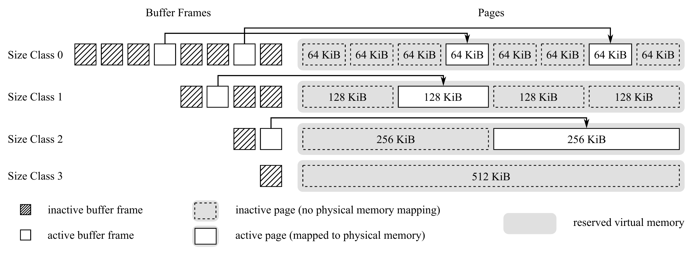
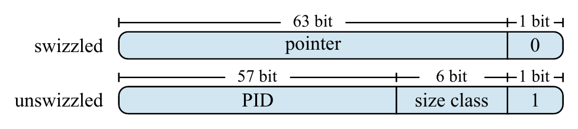
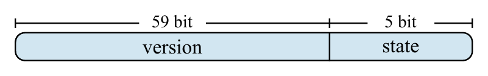
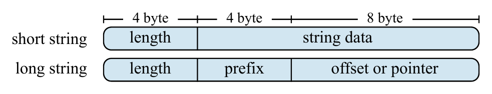
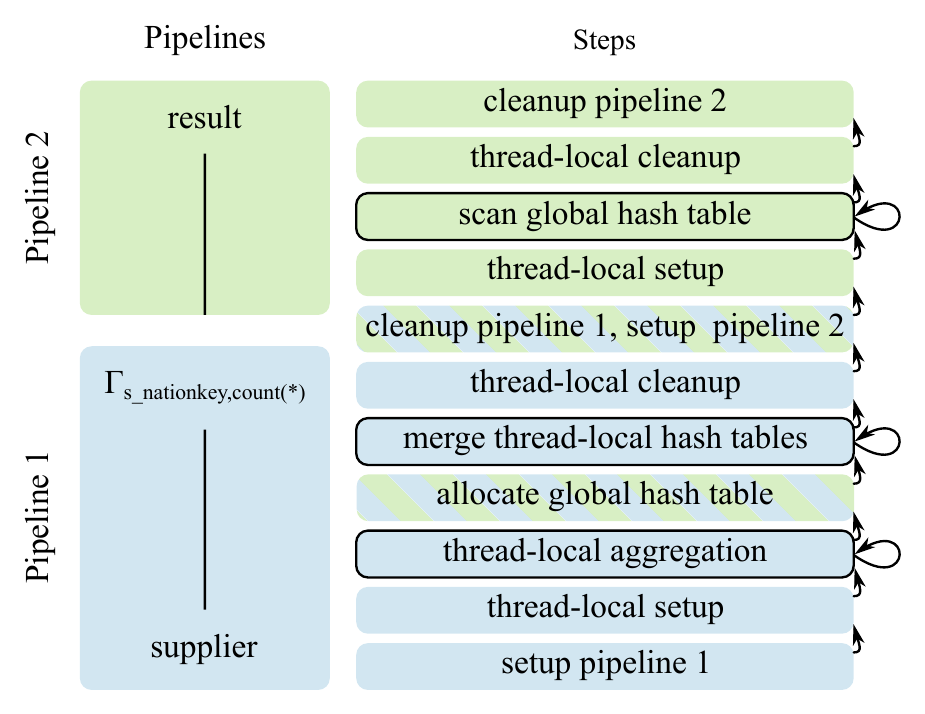
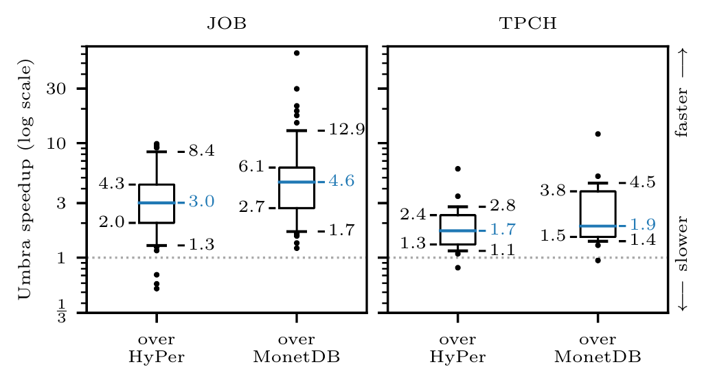

# Umbra: A Disk-Based System with In-Memory Performance（中文译文）

## 译者说明

本文依据同目录的 `source.pdf` 翻译。章节、图表、公式、算法、代码与参考文献按原文结构保留。

Thomas Neumann，Michael Freitag

慕尼黑工业大学（Technische Universität München）

联系邮箱：{neumann,freitagm}@in.tum.de

本文以[知识共享署名许可协议（CC BY 3.0）](http://creativecommons.org/licenses/by/3.0/)发表。在注明原作者及 CIDR 2020 的前提下，允许以任何媒介传播、复制并创作衍生作品。第 10 届创新数据系统研究会议（CIDR 2020），2020 年 1 月 12–15 日，荷兰阿姆斯特丹。

## 摘要

过去十年主存容量的增长使纯内存数据库系统成为可能，而内存系统能够提供前所未有的性能。然而，DRAM 仍然相对昂贵，主存容量的增长也已放缓。与之相反，近年来 SSD 的价格大幅下降，读取带宽则提高到了每秒数 GB。因此，把大容量内存缓冲区与快速 SSD 存储设备结合起来很有吸引力：既能让驻留内存的工作集获得优异性能，又具备磁盘系统的可扩展性。

我们介绍 Umbra 系统，它由纯内存 HyPer 系统演进而来，走向了基于磁盘——更准确地说，基于 SSD——的系统。我们表明，通过引入一种采用可变大小页面的新型低开销缓冲区管理器，可以在工作集已缓存时达到与内存数据库系统相当的性能，同时从容处理对未缓存数据的访问。我们讨论了以低开销妥善处理超出内存情形所需的改动与技术，为内存优化型磁盘系统的设计提供经验。

## 1. 引言

长期以来，硬件趋势一直深刻影响数据库管理系统的开发和演进。过去，大部分数据存放在旋转磁盘上，只有一小部分能够保留在 RAM 的缓冲池中。随着主存容量显著增长到数 TB，情况发生了改变：如今可以把很大一部分数据乃至全部数据留在内存中。与磁盘系统相比，这带来了巨大的性能优势，并推动了纯内存数据库系统的发展 [4, 5]，其中也包括我们自己的 HyPer 系统 [9]。这些系统只使用 RAM 存储，性能出色；但数据一旦无法装入内存，就容易失败或严重降速。

此外，我们目前观察到两项硬件趋势，它们令人强烈怀疑纯内存系统能否继续适用。第一，RAM 容量已不再显著增长。十年前，人们还可以用合理价格购买配备 1 TB 内存的通用服务器。如今，买得起的主存容量或许增加到了 2 TB，但继续扩容会使成本不成比例地上升。由于成本通常必须受控，近年来服务器主存容量的增长已经趋缓。

另一方面，过去几年 SSD 取得了惊人的进步。一块现代 2 TB M.2 SSD 的读取速度约为 3.5 GB/s，价格却只有 500 美元。相比之下，2 TB 服务器 DRAM 约需 20,000 美元，贵了 40 倍。我们只要在一台机器中安装多块 SSD，就能以纯 DRAM 方案的一小部分成本获得出色的读取带宽。因此，Lomet 指出纯内存 DBMS 并不经济 [15]。它们当然能提供最佳性能，却无法扩展到某一规模以上，而且对大多数用例来说过于昂贵。相比之下，将大容量主存缓冲区与快速 SSD 结合起来更具吸引力，因为成本低得多，性能却可以几乎一样好。

我们完全赞同这一观点，并提出兼具两者优势的新系统 Umbra：缓存工作集具有真正的内存级性能，同时能够在需要时透明地扩展到主存之外。Umbra 是我们的纯内存系统 HyPer 的精神继承者，彻底消除了 HyPer 对数据规模的限制。如我们将在本文中表明的，我们实现这一目标时没有牺牲性能。Umbra 是一个功能完备、通用的 DBMS，我们的研究组仍在持续开发它。本文介绍的所有技术都已在这一可运行系统中实现并接受评估。Umbra 和 HyPer 共享若干设计选择，例如采用编译式查询执行引擎；但为了使用外存，Umbra 在许多重要方面不同于 HyPer。下面我们将介绍系统的关键组件，并说明为了支持任意数据规模，同时在整个工作集都能装入主存这一常见情况下不损失性能，必须做出哪些改变。

实现这一目标的关键是一种将低开销缓冲与可变大小页面结合起来的新型缓冲区管理器。与传统磁盘系统相比，内存系统的一大优势是可以完全取消缓冲，这既消除了开销，也极大简化了代码。对于磁盘系统，通常的做法则是采用固定大小页面。这样虽然简化了缓冲区管理器本身，却让它的使用变得极其困难。例如，大字符串或用于字典压缩的查找表往往很难装进单个固定大小页面，因此数据库系统各处都需要复杂且昂贵的机制来处理大对象。

我们认为，采用可变大小页面的缓冲区管理器好得多，因为它能在需要时原生、连续地存储大对象。这种设计会让缓冲区管理器更加复杂，却能大幅简化系统其余部分。如果我们可以确信字典在内存中连续存放，解压就会像在内存系统中一样简单、快速。相反，使用固定大小页面的系统要么必须在内存中重新组装字典并为此复制数据，要么必须采用复杂且昂贵的查找逻辑。

当然，过往系统偏爱固定大小页面有充分的技术原因，例如碎片问题。但我们在本文中说明，利用操作系统提供的虚拟地址到物理内存的动态映射，可以消除这些问题。概括而言，我们有以下贡献。第一，我们提出一种支持可变大小页面且只引入极少开销的新型缓冲区管理器（第 2 节）。第二，我们说明向磁盘系统转变时必须进行的其他关键调整（第 3 节），尤其介绍 Umbra 中的字符串处理、统计信息维护和执行模型。最后，我们在第 4 节给出实验，在第 5 节回顾相关工作，并在第 6 节总结全文。

## 2. 缓冲区管理器

以往研究表明，在现代硬件平台上部署数据库管理系统时，传统缓冲区管理器是主要瓶颈之一 [7]。为此，我们最近发表了克服这些低效问题的 LeanStore 存储管理器 [14]。LeanStore 是一种高度可扩展的缓冲区管理器；工作集能够装入主存时，它的性能几乎与纯内存系统相同。不过，它仍然依赖固定大小页面，因而如上所述，需要昂贵机制来处理大对象。在 Umbra 中，我们更进一步：在 LeanStore 基本思想之上增加对可变大小页面的支持。

从概念上说，Umbra 把数据库页面组织为若干大小类别（size class），每一类包含给定大小的所有页面。大小类别 0 包含最小页面，其大小应为系统页面大小的整数倍。我们在 Umbra 中选择 64 KiB 作为最小页面大小。后续类别中的页面大小按指数增长，即大小类别 $i+1$ 中的页面是类别 $i$ 中页面的两倍（见图 1）。理论上，页面最大可以达到整个缓冲池的大小；不过在实践中，即便最大的页面也远小于这一理论上限。



**图 1：** 缓冲区管理器示意图，假设缓冲池大小为 512 KiB，最小页面大小为 64 KiB。缓冲区管理器支持按指数增长并组织为不同大小类别的页面。对于每个大小类别，系统都预留一段与整个缓冲池等大的虚拟内存区域；缓冲帧对应于这段内存区域内的固定地址。

我们的缓冲区管理器维护一个大小可配置的缓冲池，任何大小类别的页面都可以装入其中。默认情况下，我们允许缓冲池占用可用物理内存的一半，另一半留作查询执行的临时工作内存。关键在于，Umbra 不要求像以往支持可变大小页面的系统那样，分别为每个页面大小类别配置缓冲池内存量 [18]。因此，所提出缓冲区管理器的外部接口与传统缓冲区管理器没有显著差别：它提供将指定页面固定在内存中的函数，需要时从磁盘载入页面；也提供取消固定的函数，让页面之后可以从内存中驱逐。

### 2.1 缓冲池内存管理

在单一缓冲池内支持多种页面大小时，主要挑战是缓冲池中的外部碎片。幸运的是，我们可以利用操作系统提供的虚拟地址与物理内存之间的灵活映射规避这一问题。操作系统内核维护页表，透明地把用户空间进程使用的虚拟地址转换成实际 RAM 中的物理地址。这不仅允许连续的虚拟内存块在物理上是分散的，也允许虚拟内存独立于物理内存进行分配。换言之，应用程序可以预留一块虚拟内存，而内核不必立即在页表中为它建立物理内存映射。

我们的缓冲区管理器利用虚拟内存管理的这些特性，彻底避免缓冲池中的外部碎片。具体来说，缓冲区管理器使用 `mmap` 系统调用，为每个页面大小类别分配一块独立的虚拟内存；每块内存区域都足以在理论上容纳整个缓冲池。我们把 `mmap` 配置为创建私有匿名映射，因此它只会预留一段连续的虚拟地址范围，尚不消耗物理内存（见图 1）。随后，每段虚拟内存区域按页面大小划分为块，并为每个块创建一个缓冲帧，其中保存指向相应虚拟地址的指针。这些指针标识页面数据可以存入内存的虚拟地址，并在缓冲区管理器的整个生命周期中保持不变。由于同一大小类别中的页面大小固定，而且每个大小类别都有独立的虚拟地址范围，与某一大小类别关联的虚拟地址空间不会出现碎片。当然，与活跃缓冲帧所存页面数据对应的物理内存仍可能是分散的。

当缓冲帧变为活跃状态时，缓冲区管理器使用 `pread` 系统调用把数据从磁盘读入内存。数据存放在与该缓冲帧关联的虚拟内存地址上，此时操作系统会真正建立从这些虚拟地址到物理内存的映射（见图 1）。如果先前活跃的缓冲帧因被逐出缓冲池而变为非活跃状态，我们首先使用 `pwrite` 系统调用把页面数据的所有改动写回磁盘，随后允许内核立即复用相应的物理内存。在 Linux 上，可以向 `madvise` 系统调用传递 `MADV_DONTNEED` 标志来做到这一点。该步骤至关重要，因为内部预留的虚拟内存是缓冲池大小的数倍（见图 1），必须借此保证缓冲池消耗的物理内存不超过其配置上限。缓冲区管理器使用的内存映射没有任何实际文件作为后备，因此 `madvise` 调用几乎没有开销。

我们目前假设底层采用块设备存储抽象，这样就能依靠 `pread` 和 `pwrite` 系统调用在后台存储与主存之间移动数据。这既简化了实现，也提高了缓冲区管理器的灵活性，因为它不对实际使用的后台存储硬件施加约束。不过，绕过中间的块设备抽象，直接与开放通道 SSD 等硬件通信，会带来许多值得探索的优化机会；我们计划在未来研究这些方向 [3]。

运行期间，缓冲区管理器会跟踪当前驻留内存的所有页面的总大小。它按需把页面逐出到磁盘，以保证总大小不超过缓冲池上限。Umbra 使用的替换策略与 LeanStore 基本相同 [14]：我们以推测方式取消固定页面，却不立即将其逐出主存。这些正在冷却的页面随后进入 FIFO 队列；如果最终到达队尾，就会被逐出。

总体而言，这种方法让 Umbra 能够以极低的运行时开销和实现复杂度，充分利用可变大小页面的优势。不过，可变大小页面本身并不能解决现代数据库系统中传统缓冲区管理器的全部缺陷 [14]。下面我们简要介绍 LeanStore 中存在、而我们针对可变大小页面加以适配的其他优化。

### 2.2 指针旋接

页面会被序列化到磁盘，因此一般必须通过逻辑页面标识符（PID）引用它们。然而，集中式方法依靠全局哈希表把 PID 映射到缓冲区管理器中的内存地址，在现代众核系统上很快就会成为主要性能瓶颈 [7]。在 Umbra 中，我们转而采用指针旋接（pointer swizzling），将其作为一种低开销、去中心化的地址转换技术 [14]。

在这种方法中，对驻留内存页面和驻留磁盘页面的引用都通过 swip 实现；swip 编码了定位并访问页面所需的全部信息。一个 swip 是 64 位整数：所引用页面位于内存时，它保存虚拟内存地址；页面当前位于磁盘时，它保存 64 位 PID。引用驻留内存页面的 swip 称为已旋接（swizzled），否则称为未旋接（unswizzled）。我们用指针标记区分这两种情况，因此访问驻留内存页面只需额外执行一次条件判断。除了标记位，未旋接的 swip 还保存相应页面的大小类别（6 位）和实际页号（57 位）。这样，除一个 swip 外，缓冲区管理器不需要任何额外信息就能把相应页面载入内存（见图 2）。



**图 2：** 已旋接（上）和未旋接（下）swip 的示意图。已旋接 swip 保存指向驻留内存页面的指针；由于指针必须按 8 字节对齐，其最低位为 0。在未旋接 swip 中，该位固定为 1，其余位保存驻留磁盘页面的页面标识符和大小类别。

由于指针旋接是去中心化的，页面驱逐等操作会变得更复杂。例如，同一页面可能被多个 swip 引用；页面被逐出到磁盘时，所有这些 swip 都必须更新。然而，我们很难定位引用某一页面的全部 swip，因此难以维持一致性 [14]。为解决这一问题，Umbra 要求所有由缓冲区管理器管理的数据结构都把组成页面组织成一棵树，这棵树可以退化。设计上由此保证每个页面恰好被一个所有者 swip 引用；载入或逐出页面时，除了这个所有者 swip，不需要更新其他 swip。例如，对于 B+ 树，这意味着叶页面不能包含指向兄弟页面的引用，否则叶页面会被多个 swip 引用。下文我们将说明，在这些限制下仍然可以高效实现扫描。

### 2.3 带版本闩锁

缓冲区管理器为同步线程而频繁获取闩锁，在现代硬件平台上很快会形成另一处争用点 [14]。因此，LeanStore 使用乐观闩锁来同步对同一页面的并发访问，使缓冲管理的数据结构能大幅减少实际获取闩锁的次数。需要注意，线程同步独立于事务并发控制，后者必须在这些数据结构之上实现。

我们在 Umbra 中采用 LeanStore 提出的乐观闩锁方案，其实现如下。每个活跃缓冲帧都含有一个带版本闩锁（versioned latch），可以按独占、共享或乐观模式获取。带版本闩锁的主要组成部分是一个 64 位整数，其中 5 位保存状态信息，其余 59 位保存版本计数器。状态位表示闩锁当前是否已锁定以及采用哪种模式，版本计数器则用于验证对缓冲帧的乐观访问（见图 3）。带版本闩锁通过原子操作访问和修改，以保证正确同步。



**图 3：** 缓冲帧中用于同步页面访问的带版本闩锁结构。每次修改页面后，版本计数器都会递增，以便验证乐观访问。状态位表示闩锁是否锁定以及采用哪种模式。

状态位为整数 0 时，闩锁未锁定。可以原子地把状态位设为整数 1，以独占模式获取未锁定的闩锁。同一时刻最多只允许一个线程以独占模式持有闩锁，此时它的作用类似全局互斥量。例如，为避免数据竞争，插入数据等任何页面修改都要求先以独占模式获取相应闩锁。线程释放独占闩锁时把状态位重置为 0；如果页面数据发生过任何修改，还要递增版本计数器。

另一种方式是，只要闩锁当前没有被其他线程以独占模式锁定，就可以由多个线程同时以共享模式获取。共享闩锁的状态位取大于 1 的整数值，其中 $n+1$ 表示当前有 $n$ 个线程以共享模式持有该闩锁。在状态位不足以统计线程数这一罕见情况下，系统会另用一个 64 位整数作为溢出计数器。持有共享闩锁时不允许修改页面，但读操作保证能够成功。共享闩锁实际上会把关联页面固定在缓冲区管理器中，阻止其卸载。如果仍有其他线程持有共享闩锁，释放操作只需递减状态位中编码的线程数；最后一个释放共享闩锁的线程则把状态位重置为 0，彻底解除锁定。

最后，未锁定或按共享模式锁定的闩锁，可以由任意数量的线程按乐观模式获取。实现方法只是记住获取闩锁时的版本计数器值；无需修改闩锁本身，因此不会引发争用。与共享模式一样，持有乐观闩锁时只允许读取页面。不过，这些读取可能失败，因为另一线程可以并发获取独占闩锁并修改页面。因此，释放乐观闩锁时必须验证全部乐观访问。如果获取闩锁之后版本计数器发生了变化，就说明页面出现并发修改，读操作必须重新开始。

值得注意的是，在乐观读取页面内容时，页面甚至可以被卸载。这是因为为缓冲帧预留的虚拟内存区域始终有效（见前文），而读取已标记 `MADV_DONTNEED` 的内存区域只会得到全零字节。此时不会分配额外的物理内存，因为所有这类访问都映射到同一个零页。存在大量并发读访问时，乐观闩锁可以消除闩锁本身的争用 [14]。

LeanStore 只支持读者使用乐观闩锁，我们则额外支持共享闩锁 [14]。之所以需要它，是因为 Umbra 中的算子通常不知道关系采用分页存储。如果我们只允许读者使用乐观闩锁，那么流水线中的每个算子都必须加入额外验证逻辑，以应对页面在处理期间被逐出的情况。此外，当其他查询写入同一关系时，共享闩锁也能避免读密集型 OLAP 查询频繁验证失败。

### 2.4 缓冲管理的关系

在缓冲区管理器提供的基本设施之上，Umbra 中的关系组织为 B+ 树，并以合成的 8 字节元组标识符作为键。给定元组的标识符在元组插入 B+ 树时生成。我们保证元组标识符严格单调递增，从而无需在插入元组时分裂节点。我们会先完全填满现有内部节点和叶节点，再分配新节点。

主 B+ 树采用合成键还有一项重要优势：Umbra 能够同样良好地处理任意插入模式。内部节点始终使用最小可用页面大小 64 KiB，因此扇出为 8,192。由于我们从不分裂叶节点，只有插入时元组无法装入现有页面，系统才会分配叶节点。此时会选择能容纳整个元组的最小页面大小。通常，一个元组很容易装入 64 KiB 页面，所以 Umbra 中绝大多数叶页面也会是 64 KiB。在实践中，我们发现这在高效点访问与高效范围访问（例如扫描）之间取得了良好平衡。

叶页面内的元组目前使用 PAX 布局 [1]：固定大小属性按列式布局存放在页面起始处，可变大小属性密集存放在页面末尾。插入时如果需要，会对页面进行紧凑化。不过，对于驻留磁盘的数据，这种页面布局并不理想，因为即使只访问关系中的少数属性，也必须载入全部属性。因此，我们还计划在未来为冷数据集成 DataBlocks 等替代存储布局 [11]。

对 B+ 树的并发访问通过乐观闩锁耦合进行同步，它大量使用与各缓冲帧关联的带版本闩锁 [14]。写者只有在分裂内部页面或向叶页面插入元组时才以独占模式获取闩锁；读者只有在从叶页面读取元组或从磁盘载入子页面时才以共享模式获取闩锁。进行非修改遍历时，系统以乐观模式获取闩锁，并在需要时验证。

由于每个页面必须恰有一个所有者 swip，传统 B+ 树那样的相邻叶节点链接不复存在。为了避免频繁地从根开始完整遍历，表扫描期间我们会在当前叶节点的父节点上维持一个乐观闩锁。只要这个乐观闩锁仍然有效，即父节点没有发生并发修改，我们就能以很低的代价导航到下一个叶节点。

### 2.5 恢复

Umbra 使用 ARIES 进行恢复 [16]。总体而言，ARIES 可以自然支持 Umbra 使用的不同页面大小。不过，为确保复用磁盘空间时仍可恢复，必须谨慎处理。尤其是，我们不能在先前由单个大页面占据的磁盘空间中存放多个较小页面。

例如，考虑一个 128 KiB 数据库文件，当前正好由一个 128 KiB 页面完全占据。我们现在把该页面载入内存、删除它，再创建两个新的 64 KiB 页面，复用数据库文件中的磁盘空间。如果系统崩溃，我们可能只来得及把相应日志记录写入磁盘，却没有写入实际的新页面数据。恢复期间，ARIES 随后会尝试从数据库文件中读取第二个 64 KiB 页面的日志序列号，尽管该页面从未写入磁盘。它实际上会读到已删除的 128 KiB 页面的一部分数据，并错误地把这些数据解释成日志序列号。为避免这种问题，Umbra 只允许同样大小的页面复用彼此的磁盘空间。

## 3. 其他考量

缓冲区管理器无疑是 Umbra 获得内存级性能的关键因素，但与 HyPer 相比，其他组件也必须调整或重新设计。Umbra 最显著的调整涉及字符串处理、统计信息收集以及编译和执行。

### 3.1 字符串处理

Umbra 把字符串属性存储为两个独立部分：一个包含元数据的 16 字节头部，以及一个包含实际字符串数据的可变大小主体。头部像其他固定大小属性一样，存放在页面起始处的列式布局中；实际的可变大小字符串数据则存放在页面末尾。由于我们的缓冲区管理器支持多种页面大小，我们无需把长字符串拆分到多个页面中。



**图 4：** Umbra 中 16 字节字符串头部的结构。

字符串长度不同时，Umbra 中字符串头部的表示也略有不同（见图 4）。头部前 4 个字节始终保存字符串长度，因此 Umbra 把字符串长度限制为 $2^{32}-1$。包含 12 个或更少字符的短字符串直接存放在头部剩余的 12 字节中，从而避免昂贵的指针间接访问。较长字符串采用行外存储，头部包含指向其存储位置的指针，或相对于已知位置的偏移量。通常，存放在数据库页面中的字符串用相对于页首的偏移量寻址，其他字符串则用指针寻址。对于长字符串，头部剩余 4 字节保存字符串的前 4 个字符，让 Umbra 能够提前终止部分比较。

与纯内存系统不同，Umbra 这样的磁盘系统无法保证页面在整个查询执行期间始终驻留内存。因此，采用行外存储的字符串需要特别处理：如果相应页面被逐出，其头部保存的偏移量或指针可能失效。为此，Umbra 为行外字符串引入了三种存储类别，即持久（persistent）、暂留（transient）和临时（temporary）存储。存储类别编码在字符串头部所存偏移量或指针值的两个比特中。

持久存储字符串的引用（例如查询常量）在数据库的整个运行期间都保持有效。暂留存储字符串的引用在当前工作单元处理期间有效，但最终会失效。与持久字符串不同，暂留字符串在查询执行期间被物化时必须复制。例如，任何来自关系的字符串在 Umbra 中都采用暂留存储，因为相应页面可能被逐出内存。最后，在查询执行期间实际创建的字符串（例如由 `UPPER` 函数产生的字符串）采用临时存储。临时字符串可以按需保持存活，但生命周期结束后必须接受垃圾回收。

### 3.2 统计信息

Umbra 为查询优化维护多种统计信息。首先，每个关系都有一个持续维护的随机样本。由于 Umbra 被设计为磁盘系统，直接从基表随机采样并不可行。与纯内存系统相比，在磁盘系统中按需计算样本的代价高得令人无法接受。即使在内存系统中，计算随机样本仍然昂贵。HyPer 通过只定期更新样本来缓解这一问题，但样本很快就会过时，尤其是在写密集型 OLTP 工作负载中。

在 Umbra 中，我们转而实现了我们最近提出的可扩展在线水库采样算法 [2]。通过这种方式，我们可以以极低开销保证查询优化器始终能取得最新样本。除了随机样本，我们还为每一列维护可更新的 HyperLogLog 草图。正如我们先前所表明的 [6]，我们实现的可更新 HyperLogLog 草图只需中等开销，就能为单列提供近乎完美的基数估计。进一步地，查询优化器还可以把基于草图和基于采样的估计结合起来，得到非常准确的多列估计 [6]。

### 3.3 编译与执行

总体上，Umbra 使用与 HyPer 相同的查询执行策略：把逻辑查询计划转换成高效的并行机器码，再执行这些代码以获得查询结果 [17]。两者自然有许多相似之处，但 Umbra 在若干关键方面进一步发展了 HyPer 的方法。

首先，Umbra 对物理执行计划的表示比 HyPer 细粒度得多。在 HyPer 中，物理执行计划本质上是一段整体编译的单体代码片段，由它计算查询结果 [17]。相比之下，Umbra 把物理执行计划表示为模块化状态机。例如，考虑 TPCH 模式上的以下查询：

```sql
select count(*)
from supplier
group by s_nationkey
```

从高层看，这一查询的执行计划包含两条流水线：第一条流水线扫描 `supplier` 表并执行分组操作，第二条流水线扫描各分组并输出查询结果（见图 5）。在 Umbra 中，这些流水线进一步拆分为步骤；每个步骤既可以是单线程的，也可以是多线程的。对上述查询，Umbra 会生成图 5 所示步骤。



**图 5：** 简单分组查询在 Umbra 中的流水线和对应步骤。黑色边框表示并行步骤，箭头表示步骤之间的状态转换。

在生成的代码中，每个步骤对应一个独立函数，可由 Umbra 的运行时系统调用。执行查询时，这些单独步骤被视为具有明确定义转换关系的状态，由 Umbra 查询执行器编排（见图 5）。对于多线程步骤，系统采用 morsel 驱动的方法把可用工作分配给工作线程；步骤函数每次调用处理一个 morsel [12]。

Umbra 的模块化执行计划模型带来多项关键优势。首先，每次调用步骤函数之后，我们都可以暂停查询执行，例如系统 I/O 负载超过某个阈值时。其次，我们的查询执行器可以在运行时检测某个并行步骤是否只有一个 morsel。如果是，就不必把工作派发给另一个线程，从而避免一次代价可能很高的上下文切换。最后，我们可以让一条流水线轻松支持多个并行步骤，如图 5 所示。

另一个重要区别是，查询代码并非直接用 LLVM 中间表示（IR）语言生成。我们在 Umbra 中实现了自定义的轻量 IR，从而无需依赖 LLVM 就能高效生成代码。LLVM 被设计成通用的代码生成框架，其中 Umbra 并不需要的功能也可能引入显著开销。自定义 IR 使我们能够避免代码生成期间一次可能很昂贵的 LLVM 往返过程。

与 HyPer 不同，我们在 Umbra 中不会立即把该 IR 编译成优化机器码，而是采用自适应编译策略，力图为每个步骤分别权衡编译时间和执行时间 [10]。起初，与步骤关联的 IR 总会转换成高效字节码，由虚拟机后端解释执行。对于并行步骤，自适应执行引擎随后跟踪进度信息，以判断编译是否可能有利 [10]。如果合适，就把 Umbra IR 转换成 LLVM IR，并把编译交给 LLVM 即时编译器。从概念上看，我们的 IR 语言被设计成非常接近 LLVM IR 的一个子集，因此可以用线性时间、低成本地把我们的格式转换成 LLVM 格式。

## 4. 实验

我们的实验评估分为两部分。首先，我们把 Umbra 与其精神前身 HyPer（v0.6-165）以及知名列存 MonetDB（v11.33.3）进行比较，以展示 Umbra 具有竞争力的性能 [8, 9]。其次，我们用更多微基准突出 Umbra 的关键特性。全部基准都运行在 Intel Core i7-7820X CPU 上，该处理器有 8 个物理核心、16 个逻辑核心，运行频率为 3.6 GHz。系统配备 64 GiB 主存，所有数据库文件都放在容量为 500 GiB 的 Samsung 960 EVO SSD 上。

### 4.1 系统比较

我们为对比实验选择连接次序基准 JOB [13]，以及缩放因子为 10 的 TPCH 基准。每个查询重复运行 5 次，我们报告其中最快的一次，也就是说，我们在本实验中测量的是热缓存条件下的性能。图 6 展示了 Umbra 相对于 HyPer 和 MonetDB 的性能。



**图 6：** Umbra 相对于 HyPer 和 MonetDB 在 JOB 与 TPCH 上的加速比。箱线图展示第 25 和第 75 百分位（左侧），以及第 5、第 50 和第 95 百分位（右侧）。

我们观察到，Umbra 相比 HyPer 表现出色。具体而言，Umbra 在 JOB 上取得 3.0 倍几何平均加速，在 TPCH 上取得 1.8 倍几何平均加速。如此显著的差距在一定程度上可归因于 Umbra 采用了高效得多的自适应编译策略。HyPer 总是把查询计划编译成优化机器码，而自适应策略会避免为低成本查询付出昂贵的编译代价。对于这类查询，HyPer 花在查询编译上的时间甚至远多于查询执行时间，最多可达到后者的 29 倍。

更重要的是，如果我们只看原始查询执行时间，Umbra 的性能与纯内存系统 HyPer 相当。在 JOB 和 TPCH 上，执行时间的平均波动分别为 30% 和 10%。JOB 上确实会出现 0.2 倍至 2.3 倍、TPCH 上会出现 0.5 倍至 1.6 倍这样更大的相对差异；但我们确定，这些异常值——尤其是 JOB 上的异常值——主要源自 HyPer 与 Umbra 选择了不同的逻辑计划。事实上，我们发现，某些查询上 Umbra 尽管有好得多的基数估计，却碰巧选择了比 HyPer 更差的逻辑计划，因为 HyPer 的查询优化器运气很好，犯下的两个错误恰好相互抵消。

Umbra 相对于 MonetDB 的几何平均加速比在 JOB 上为 4.6 倍，在 TPCH 上为 2.3 倍。对许多查询，特别是较复杂的 JOB 查询，MonetDB 把总查询运行时间的很大一部分花在查询优化和代码生成上。此外，与 HyPer 不同，MonetDB 偶尔还会选择极差的查询计划，导致查询执行缓慢。即使计划良好，MonetDB 的查询执行通常也不如 HyPer 和 Umbra 高效。

### 4.2 微基准

下面我们进一步研究 Umbra 的若干关键组件对性能的影响。首先，我们证明缓冲区管理器只给 Umbra 带来极小开销。为此，我们以两种方式修改存储层。第一，我们禁用缓冲区管理器中的页面驱逐，从而不再需要把来自数据库页面的字符串物化到内存中。第二，我们实现另一种存储层，直接把关系存放在平坦的内存映射文件中，完全不使用缓冲区管理器。这样还会消除缓冲区管理器本身的开销，以及用 B+ 树表示关系所引入的间接访问。

随后，我们在这些修改后的存储层上运行 JOB 和 TPCH，考察查询执行时间的变化。这里忽略优化和编译时间，因为 Umbra 在三种存储层上采用完全相同的逻辑计划和物理计划。我们观察到性能在两个方向上的波动都很小：仅避免字符串物化时平均不到 2%，完全绕过缓冲区管理器时平均不到 6%。两种情况下，最极端的性能变化也都只有 30%。据此，我们得出结论：缓冲区管理器在 Umbra 中引入的成本可以忽略不计。

我们还使用修改后的存储层做另一项微基准，展示缓冲区管理器的 I/O 性能。为此，我们生成一个包含 2.5 亿个随机 8 字节浮点值的关系，随后在数据库缓存和操作系统缓存均为冷态时计算这些值的总和。绕过缓冲区管理器时，Umbra 依靠操作系统把包含关系数据的平坦内存映射文件载入内存。此时 Umbra 的读取吞吐量为 1.15 GiB/s；我们确定，这接近我们所用 SSD 的最大随机访问带宽。

由于 Umbra 的查询执行高度并行，而且不对线程之间处理页面的先后顺序施加约束，所以对 SSD 的读取访问基本是随机的。实际启用缓冲区管理器时，Umbra 取得了几乎相同的 1.13 GiB/s 读取吞吐量。这些结果说明，Umbra 的缓冲区管理器可以充分利用可用 I/O 带宽。我们还通过人为缩小缓冲池后运行 JOB 和 TPCH 验证了这一发现，此时 Umbra 同样会受 I/O 限制。

总之，我们观察到 Umbra 的主要瓶颈来自有限的存储吞吐量；缓冲区管理器本身则完全能够轻松应对高度并行、I/O 密集的工作负载。如第 1 节所述，我们只需在一个系统中安装多块 SSD，就能提高可用 I/O 带宽；即使工作负载无法仅装入主存，Umbra 也可以借此媲美纯内存系统的性能。

## 5. 相关工作

Umbra 是对我们的 HyPer 系统的重新设计，大量借鉴了开发 HyPer 期间获得的经验 [9]。我们赞同 Lomet 提出的观点，即纯内存系统并不经济 [15]；Umbra 则是 HyPer 向高性能磁盘系统演进的结果。这样的系统需要高效、可扩展的缓冲区管理器，因此必须谨慎调整传统缓冲区管理器的体系结构。Umbra 的缓冲区管理器与 LeanStore 有许多共同点 [14]；我们请读者参见文献 [14] 对相关文献的详细回顾。

此外，我们主张缓冲区管理器应支持可变大小页面，以降低处理大型数据对象的复杂度。据我们所知，另一种采用可变大小页面的缓冲区管理器是为 ADABAS 系统开发的 [18]。不过，与 Umbra 相比，该缓冲区管理器的灵活性低得多：它只支持两种不同页面大小，而且分别放在两个独立缓冲池中。这种方法的一大缺点是，我们必须预先指定分配给每个缓冲池的内存量。

## 6. 结论

我们介绍了新开发的 Umbra 系统，它代表纯内存系统 HyPer 向 SSD 系统的演进。我们证明，整个工作集能装入 RAM 时，Umbra 可以达到内存级性能；而数据必须溢写到磁盘时，它又能充分利用可用 I/O 带宽。我们提出了一种采用可变大小页面的新型低开销缓冲区管理器，正是它让这种性能成为可能。此外，我们还研究了内存数据库系统向 SSD 系统转变时，其他组件必须进行的关键调整。我们的发现可以为设计一类新型高性能数据缓存系统提供指导。

## 7. 参考文献

[1] A. Ailamaki, D. J. DeWitt, M. D. Hill, and M. Skounakis. Weaving relations for cache performance. In *VLDB*, pages 169–180, 2001.

[2] A. Birler. Scalable reservoir sampling on many-core CPUs. In *SIGMOD*, pages 1817–1819, 2019.

[3] M. Bjørling, J. Gonzalez, and P. Bonnet. Lightnvm: The linux open-channel SSD subsystem. In *FAST*, pages 359–374. USENIX Association, 2017.

[4] C. Diaconu, C. Freedman, E. Ismert, P. Larson, P. Mittal, R. Stonecipher, N. Verma, and M. Zwilling. Hekaton: SQL server’s memory-optimized OLTP engine. In *SIGMOD*, pages 1243–1254, 2013.

[5] F. Färber, N. May, W. Lehner, P. Große, I. Müller, H. Rauhe, and J. Dees. The SAP HANA database – an architecture overview. *IEEE Data Eng. Bull.*, 35(1):28–33, 2012.

[6] M. Freitag and T. Neumann. Every row counts: Combining sketches and sampling for accurate group-by result estimates. In *CIDR*, 2019.

[7] S. Harizopoulos, D. J. Abadi, S. Madden, and M. Stonebraker. OLTP through the looking glass, and what we found there. In *SIGMOD*, pages 981–992, 2008.

[8] S. Idreos, F. Groffen, N. Nes, S. Manegold, K. S. Mullender, and M. L. Kersten. MonetDB: Two decades of research in column-oriented database architectures. *IEEE Data Eng. Bull.*, 35(1):40–45, 2012.

[9] A. Kemper and T. Neumann. HyPer: A hybrid OLTP&OLAP main memory database system based on virtual memory snapshots. In *ICDE*, pages 195–206, 2011.

[10] A. Kohn, V. Leis, and T. Neumann. Adaptive execution of compiled queries. In *ICDE*, pages 197–208, 2018.

[11] H. Lang, T. Mühlbauer, F. Funke, P. A. Boncz, T. Neumann, and A. Kemper. Data blocks: Hybrid OLTP and OLAP on compressed storage using both vectorization and compilation. In *SIGMOD*, pages 311–326, 2016.

[12] V. Leis, P. A. Boncz, A. Kemper, and T. Neumann. Morsel-driven parallelism: A NUMA-aware query evaluation framework for the many-core age. In *SIGMOD*, pages 743–754, 2014.

[13] V. Leis, A. Gubichev, A. Mirchev, P. A. Boncz, A. Kemper, and T. Neumann. How good are query optimizers, really? *PVLDB*, 9(3):204–215, 2015.

[14] V. Leis, M. Haubenschild, A. Kemper, and T. Neumann. LeanStore: In-memory data management beyond main memory. In *ICDE*, pages 185–196, 2018.

[15] D. B. Lomet. Cost/performance in modern data stores: How data caching systems succeed. In *DaMoN*, pages 9:1–9:10, 2018.

[16] C. Mohan, D. Haderle, B. G. Lindsay, H. Pirahesh, and P. M. Schwarz. ARIES: A transaction recovery method supporting fine-granularity locking and partial rollbacks using write-ahead logging. *ACM TODS*, 17(1):94–162, 1992.

[17] T. Neumann. Efficiently compiling efficient query plans for modern hardware. *PVLDB*, 4(9):539–550, 2011.

[18] H. Schöning. The ADABAS buffer pool manager. In *VLDB*, pages 675–679, 1998.
