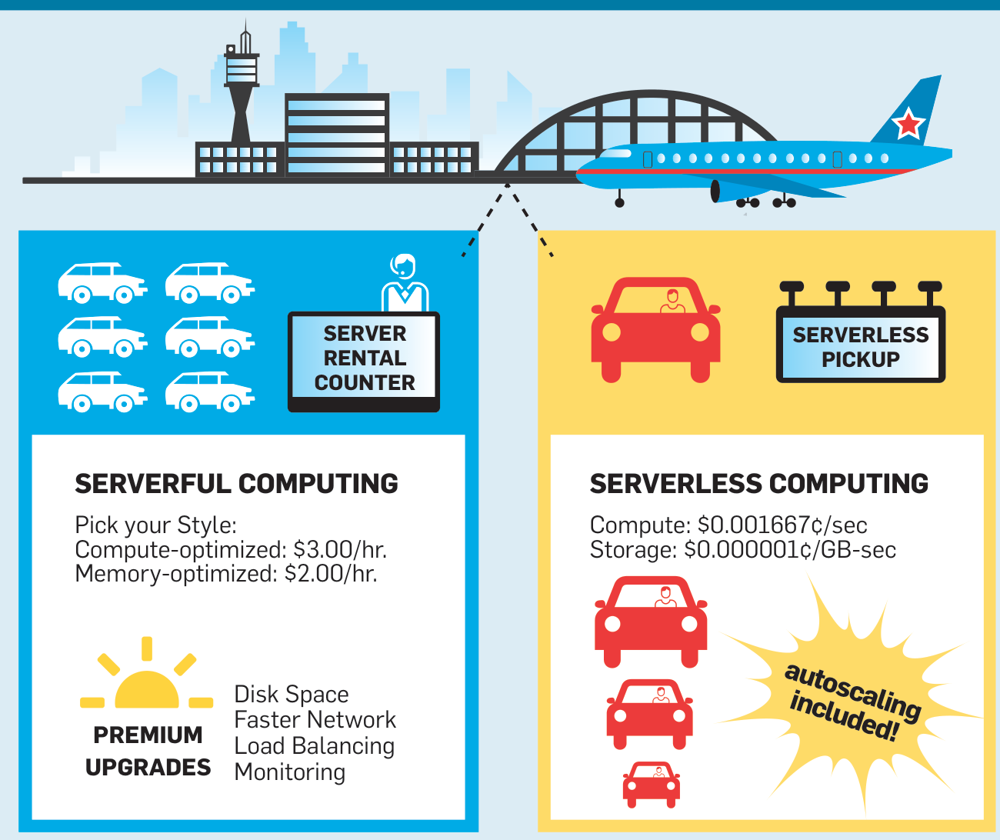
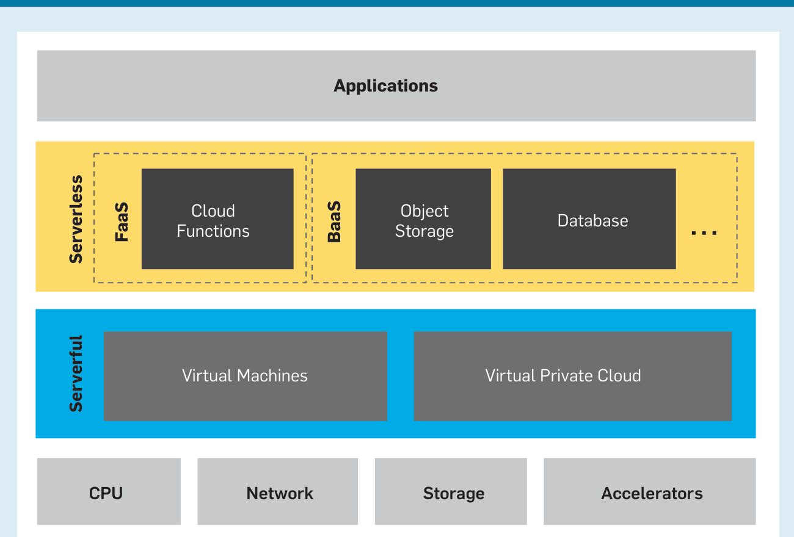
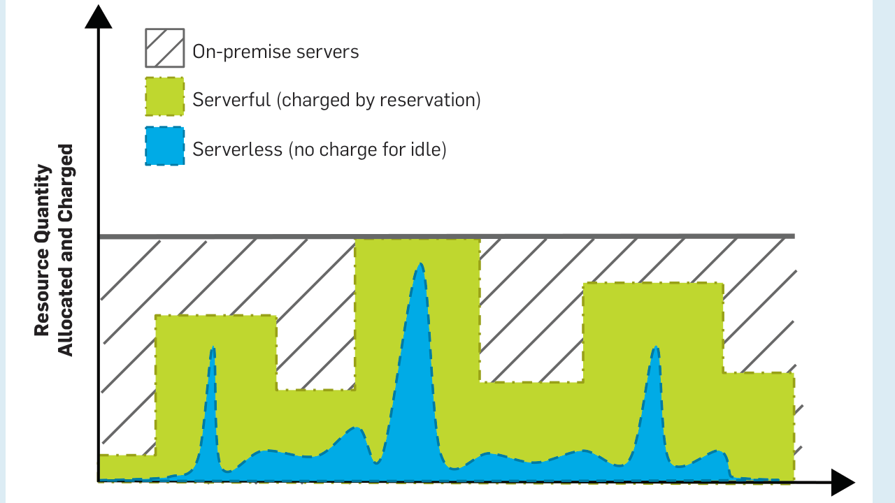
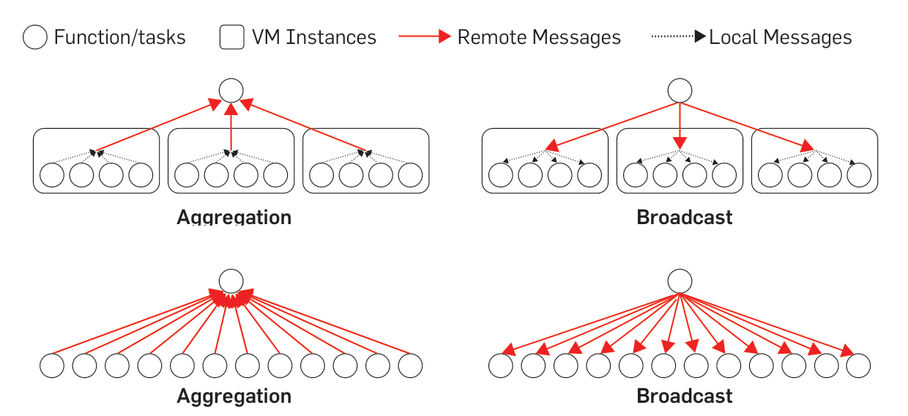
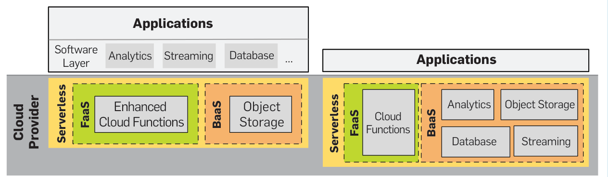

# What Serverless Computing Is and Should Become: The Next Phase of Cloud Computing（中文译文）

## 译者说明

本文依据同目录的 `source.pdf` 翻译。章节、图表、公式、算法、代码与参考文献按原文结构保留。

## 作者与出版信息

Johann Schleier-Smith、Vikram Sreekanti、Anurag Khandelwal、Joao Carreira、Neeraja J. Yadwadkar、Raluca Ada Popa、Joseph E. Gonzalez、Ion Stoica、David A. Patterson

本文作者均来自加州大学伯克利分校 RISELab（Real-Time Intelligence Secure Explainable Systems Lab）。

本文发表于 *Communications of the ACM*，2021 年 5 月，第 64 卷第 5 期。DOI：<https://doi.org/10.1145/3406011>。版权 © 2021 归本文作者所有。

## 内容提要

本文讨论 serverless computing 所代表的演进、塑造它的经济力量、它为何可能失败，以及它如何实现自身潜力。

## 关键洞见

- 云计算最初革新的是系统管理；云计算的第二阶段则简化云编程。
- Serverless computing 远不止云函数或 Function-as-a-Service（FaaS）。对象存储等其他云编程抽象同样隐藏了服务器复杂性，未来还会出现更多类似抽象。
- 今天的 serverless 在有限应用中运行良好，因此云提供商会创造新的应用专用和通用 serverless 产品，以支持更多用例。
- 云计算的下一阶段将像第一阶段改变运维人员工作方式那样，显著改变程序员工作方式。

## 引言

2010 年，我们中的一些人共同撰写过一篇 Communications 文章，解释当时相对新兴的云计算现象 [4]。那篇文章认为，云计算提供了“可无限扩展的远程服务器”的幻象，而且不会因规模收取溢价：租用 1000 台服务器 1 小时的成本，与租用 1 台服务器 1000 小时相同。云提供商的规模经济也让云计算出人意料地便宜。那篇文章列出云计算面临的挑战，并预测多数挑战会被克服，行业将越来越多地从本地数据中心转向“云”。这一预测确实发生了。今天，企业基础设施和软件 IT 支出中已有三分之二基于云 [8]。

十年后，我们重新审视云计算，以解释其正在出现的第二阶段。我们认为，这一阶段会进一步加速向云迁移。第一阶段主要通过从大型多租户数据中心中切分虚拟服务器和虚拟网络，简化计算基础设施的配置与管理，从而简化系统管理。第二阶段则通过为应用构建者提供编程抽象来隐藏服务器，简化云开发，让云软件更容易编写。简而言之，第一阶段的目标对象是系统管理员，第二阶段的目标对象是程序员。这一变化要求云提供商接管大量运行良好应用所需的运维责任。

为强调关注点从服务器转向应用，这个新阶段被称为 serverless computing，尽管远程服务器仍然是支撑它的不可见基础。本文将传统第一阶段称为 serverful computing。

原文用出差交通作类比。去远程会议时，你可以从机场租车，也可以叫出租车去酒店。租车类似 serverful computing：你必须排队、签合同、在整个停留期间保留车辆，不管实际使用多久都要付费，还要自己驾驶、导航、停车并在还车前加油。出租车类似 serverless computing：你只需告诉司机酒店名称并为行程付费；出租车服务提供受训司机、负责导航、按行程收费并自己加油。出租车简化了交通，因为乘客不必知道如何操作汽车就能到酒店。并且，出租车比租车利用率更高，从而降低出租车公司的成本。取决于会议时长、租车成本、停车费、油费等，出租车不仅更简单，也可能更便宜。

在 serverless computing 中，程序员使用云提供商提供的高层抽象创建应用。例如，他们可以用函数式风格的“无状态”编程，在自己选择的语言中定义 cloud functions[^a]，通常是 JavaScript 或 Python，然后指定函数如何运行，是响应 Web 请求还是触发事件。程序员还可以使用 serverless object storage、message queues、key-value store databases、移动客户端数据同步等服务，这组服务统称 Backend-as-a-Service（BaaS）。托管云函数服务也称 Function-as-a-Service（FaaS）。因此，今天的 Serverless Cloud Computing 可以概括为 FaaS + BaaS。

[^a]: 不同云平台对其产品使用不同名称：Microsoft Azure 的 Azure Functions、Alibaba Cloud 的 Cloud Functions、Amazon Web Services（AWS）的 AWS Lambda、Google Cloud Platform（GCP）的 Google Cloud Functions 和 Google Cloud Run、IBM Cloud 的 IBM Cloud Functions，以及 Oracle Cloud 的 Oracle Functions。

Serverless 的主要创新是隐藏服务器，而服务器具有天然复杂的编程和运维模型。服务器用户必须为可靠性构建冗余，响应负载变化调整容量，出于安全原因升级系统，等等 [17]。这些工作经常要求用户对分布式系统故障模式和性能进行困难推理。工具可以有所帮助，例如通过启发式调整容量进行 autoscaling，但这类工具本身也需要详细配置和持续监控。相比之下，serverless 将这些责任和其他责任交给云提供商。

Serverless computing 有三个基本特性：

1. 提供隐藏服务器以及服务器编程和运维复杂性的抽象。
2. 提供 pay-as-you-go 成本模型，而不是基于预留的模型，因此空闲资源不收费。
3. 自动、快速、近乎无限地按需求上下扩缩资源，从零扩展到实际意义上的无限。

这些性质在云中的综合体，较此前接近这些性质的环境有实质性提升 [8,17]。回到类比，出租车服务必须提供带持证司机的车辆（隐藏运维）、只在载客时收费（按用量付费）、并调度足够车辆以最小化等待时间（autoscaling）。如果出租车不能可靠提供三者，顾客可能仍会选择租车并自己操作（serverful computing）。

一篇近期 Communications 文章已经很好地介绍了当前 serverless computing 的状态、它与 Infrastructure-as-a-Service（IaaS）和 Platform-as-a-Service（PaaS）的区别、市场份额、示例用例和局限 [8]。本文则分享我们对 serverless 代表的演进、塑造它的经济力量、它为何可能失败，以及它如何实现潜力的看法。

我们预测，大多数数据中心计算将由 serverless computing 主导；同时也认为，未来 serverless computing 会明显不同于今天的 serverless 产品。尤其是，我们认为新的通用 serverless 抽象会出现，加入复杂状态管理和自动优化，从而支持更多用例。今天 serverless 依赖同质 CPU，但未来 serverless 会简化 GPU、TPU [19] 等硬件加速器的使用。这些加速器支持特定负载，并且在摩尔定律放缓时最可能提供更高性能 [14]。虽然今天存在 serverless 安全顾虑，我们认为精心设计反而可能让应用开发者更容易抵御外部攻击。

与 2010 年一样，我们再次预测这些挑战会被克服，第二阶段会成为云计算主导形式，把云的能力交到所有应用开发者手中，从而加速云的普及。

## 理解今天的 Serverless

Cloud functions 在 serverless computing 中最吸引注意力，但它只是 serverless cloud 中众多服务之一。围绕 FaaS 的兴奋是有道理的，因为它让人看到通用 serverless computing 可能是什么样子；不过 BaaS 服务构成了更大、也更早的一组 serverless 服务。

例如，AWS 最初提供 S3 对象存储作为远程备份和归档服务，比宣布 EC2 虚拟机租赁早多年。可以把 S3 看成 serverless computing 的先驱，它提供“diskless storage”：提供存储，但隐藏磁盘。随着时间推移，云提供商又提供更多 BaaS 服务来辅助 serverful computing。消息队列（例如 AWS SQS、Google Cloud Pub/Sub）是另一类早期服务。之后出现了 key-value 数据库（例如 Google Cloud Datastore、AWS DynamoDB、Azure CosmosDB）以及基于 SQL 的大数据查询引擎（例如 AWS Athena、Google BigQuery）。

AWS Lambda 于 2015 年发布，是第一个云函数产品，并提供了一种独特且有吸引力的能力：执行几乎任何可在服务器上运行的代码。它支持多种编程语言和任意库，采用 pay-as-you-go 方式，安全运行且可按任意规模扩展。不过，它对编程模型施加了一些限制，即使今天也把它限制在某些应用中。这些限制包括最大执行时间、缺乏持久状态以及网络受限 [13]。

今天，已有多个 serverless 环境可以运行任意代码，并分别面向特定用例。例如，Google Cloud Dataflow 和 AWS Glue 允许程序员在数据处理流水线的某个阶段执行任意代码；Google App Engine 可以看作构建 Web 应用的 serverless 环境。

这些 serverless 产品共同具备三个基本特性：隐藏服务器的抽象、pay-as-you-go 成本模型、优秀的 autoscaling。合在一起，它们提供了一组可组合替代方案，以满足越来越广泛的应用。

## Serverless Cloud Economics

今天的云既由技术进步塑造，也由商业考虑塑造；未来同样如此。云客户选择 serverless computing，是因为它让他们专注解决自身领域或业务中独特的问题，而不是服务器管理或分布式系统问题 [6]。这种客户价值主张的强度，是我们看好 serverless adoption 的主要原因。

Serverless computing 可能看起来更贵，因为资源单价更高；但客户只为实际使用的资源付费，空闲资源成本由云提供商承担。实践中，客户将应用迁移到 serverless 后可获得显著成本节省 [30]。虽然这种成本下降可能威胁云提供商收入，但 Jevons Paradox [2] 表明，低价格会激发消费增长，增长幅度可能超过单位成本下降，从而带来收入增长。

云提供商还可通过帮助客户满足可变且不可预测的资源需求来获利。相比客户使用自己的专用资源，云提供商可从共享资源池中更高效地满足这些需求 [16]。这一机会在 serverful computing 中也存在，但当资源以更细粒度共享时会变得更大。Serverless computing 还为云提供商改善利润率提供机会，因为 BaaS 产品经常代表传统上由数据库等高利润软件产品服务的品类。

Serverless 的 pay-as-you-go 模型对云提供商创新激励有重要正面含义。Serverless 之前，autoscaling 云服务会自动预置 VM，即预留资源，但即使容量空闲，客户也要付费。Serverless 中，云提供商为闲置资源付费，这让云提供商在 autoscaling 上真正承担后果，并激励其确保高效资源分配。类似地，当云提供商直接控制更多应用栈，包括操作系统和语言运行时时，serverless 模型会鼓励其在每一层投资效率。

更高生产率的程序员、更低客户成本、更高提供商利润和改进创新，共同创造了 serverless 采用的有利条件。不过，一些云客户担心 vendor lock-in，担心与云提供商议价时权力下降 [16]。Serverful VM 抽象基本标准化，这主要归功于 Linux 操作系统和 x86 指令集；但各提供商的 serverless cloud functions 和 BaaS API 在显而易见和微妙之处都不同。由此产生的切换成本有利于最大且最成熟的云提供商，也使它们有动机推广复杂专有 API，阻碍事实标准化。简单且标准化的抽象，也许由较小云提供商、开源社区或学术界提出，将消除 serverless 采用中最突出的剩余经济障碍。

### 侧栏：Serverless 的成本

如果比较运行 AWS Lambda 云函数的每分钟成本与运行等效 0.5GB 内存 AWS t3.nano VM 的成本，serverless computing 可能看起来贵 7.5 倍。但这种比较会误导。

Serverless computing 的美妙之处在于，它提供的不只是服务器，但经常带来更低云账单。价格中包含可用性冗余、监控、日志记录和自动扩缩容；在 serverful 场景中，这些都需要单独提供。成本比较还必须考虑预期利用率，因为 serverless 用户只在代码执行时付费。t3.nano VM 用户必须为预留资源付费，无论代码是否运行。云提供商声称，在实践中客户将应用迁移到 serverless 后可节省 4 到 10 倍成本 [30]。

虽然 serverless 经常省钱，但对某些组织而言，pay-as-you-go 模型与其预算管理方式不一致。预算可能提前固定，通常按年固定。计划使用固定数量服务器容量似乎更容易，但实践中管理预算很有挑战，尤其是当许多团队部署云 VM，或业务需求难以预期时。我们认为，随着组织更多使用 serverless，它们会像对电力等其他按用量付费服务一样，基于历史预测成本。

## 云计算的下一阶段

理解 serverless computing 所代表变化的最佳方式，也许是聚焦前述第一项基本特性：提供隐藏服务器并简化编程和运维模型的抽象。云计算从一开始就提供了简化的运维模型，但简化编程来自隐藏服务器。Serverless computing 的未来演进，以及我们认为的云计算未来，将由提供简化云编程的抽象来引导。

令人惊讶的是，迄今为止云计算对程序员工作方式的改变很小，尤其是与其对运维人员工作的影响相比。许多运行在云上的软件，与传统数据中心中的软件完全相同。比较今天最受需求的编程技能与 10 年前所需技能，会发现核心技能集变化很小，尽管具体技术来来去去。相比之下，运维人员的工作变化巨大。安装和维护服务器、存储、网络基本成为过去，取而代之的是通过云提供商 API 管理虚拟化基础设施，以及 DevOps 运动对变更管理技术和组织方面的强调。

是什么让云编程变难？虽然只使用一台服务器也可以使用云，但这既不提供容错，也不提供可扩展性或 pay-as-you-go，因此大多数云编程很快变成分布式系统编程。编写分布式系统时，程序员必须推理数据中心的空间分布、各种部分故障模式以及所有安全威胁。用 Fred P. Brooks 的术语，这些关注点代表“accidental complexity”，它源自实现环境；与之相对的是应用功能本身固有的“essential complexity” [7]。Brooks 写作时，高级语言正在取代汇编语言，使程序员不必推理寄存器分配、内存数据布局等复杂机器细节。正如高级语言隐藏 CPU 如何运行的许多细节，serverless computing 隐藏构建可靠、可扩展且安全的分布式系统所需的许多细节。

接下来，我们讨论 serverless 抽象的替代路径，包括今天已存在的和想象中的路径。它们都在回答“如果不是服务器，那是什么？”这个问题。我们将这些抽象路径分为 application-specific 和 general-purpose 两类。Application-specific abstractions 解决特定用例，其中若干已存在于今天产品中。General-purpose abstractions 必须在广泛用途中良好运行，目前仍是研究挑战。

考虑一个大数据处理示例：在电商场景中，对 100 亿条记录计算一个平均值，权重来自 100 万个类别。该负载有大量并行潜力，因此受益于 serverless 的无限资源幻象。

有两类应用专用 serverless 产品可服务该示例，并说明该类别中的多种路径。第一，可以使用 AWS Athena 大数据查询引擎，这是一种用 SQL（Structured Query Language）编程的工具，用于对对象存储中的数据执行查询。SQL 特别适合分析，可用单条语句表达该计算。第二，可以使用 Google Cloud Dataflow 提供的框架。这样需要写一个简单的 MapReduce 风格 [11] 程序，例如用 Java 或 Python 编写两个函数：一个为某个数据块计算加权平均，另一个将不同数据块的加权平均合并为并集的加权平均。框架负责将数据送入送出这些函数，并负责 autoscaling、可靠性和其他分布式系统问题。与 SQL 工具相比，这种抽象可以运行任意代码，因此适合更广泛的分析问题。

能够高性能解决该大数据示例的通用 serverless 抽象尚不存在。Cloud functions 似乎能提供解决方案，因为它们允许用户编写任意代码；对某些负载确实如此 [28]。但由于限制，它们有时比替代方案慢得多 [13,17]。原文图 4 说明，如果用 cloud functions 而不是 Cloud Dataflow 等应用专用框架实现该示例，网络流量可能大得多。应用专用 serverless 方案像 serverful 方案一样，可以在每个 VM 实例上打包 $K$ 个任务，因此对于 $N$ 个任务的作业，通信复杂度为 $O(N/K)$；而基于 cloud function 的替代方案不能影响任务放置，复杂度为 $O(N)$。典型 $K$ 值为 10 到 100，因此总体差异可达一到两个数量级。使用 cloud functions 时，提供商在不同 VM 实例间分配工作，并不考虑应用通信模式；这简化了 autoscaling，但增加了网络流量。

我们提出两条增强 cloud functions 的路径，使其能在更广泛应用中运行良好，并可能转化为 general-purpose serverless abstractions。第一，程序员可提供 hints 来指示如何获得更好性能。Hints 可描述应用通信模式，例如 broadcast 或 all-reduce，也可建议任务放置 affinity [25]。这在编译器中已有先例，例如分支预测、对齐和预取 hints。

第二，也是更有吸引力的一条路径，是通过 automatic optimization 消除低效。在示例中，云提供商可承诺从观察到的通信模式中推断局部性优化。在某些情况下，也可基于程序分析进行静态推断。单机环境中，现代编译器和语言运行时已经大量使用这种方式；可以把这种 serverless computing 看作将语言支持扩展到分布式系统。

图 5 展示 application-specific 和 general-purpose serverless abstractions 的差异。General-purpose 情况下，云提供商暴露少量基本构件，例如增强版 cloud functions 和某种 serverless storage。各种应用专用用例可以构建在这些基础之上。Application-specific serverless 情况下，云提供商则提供越来越多 BaaS 点解决方案，以满足更多应用需求。

今天，serverless computing 仍完全属于应用专用品类。即使能执行任意代码的 cloud functions，也主要流行于无状态 API 服务和事件驱动数据处理 [27]。我们预计 application-specific serverless 会增长，但最令人兴奋的是 general-purpose serverless abstractions 的潜在出现，它们可托管服务于各种需求的软件生态。在我们看来，只有通用路径最终能取代服务器，成为云编程默认形式。不过，通用 serverless 技术今天还不存在，发展它带来了研究挑战。

### 表 1：替代抽象路径

| Serverless 抽象路径 | 大数据示例 |
| --- | --- |
| 应用专用：工具或组件 | AWS Athena |
| 应用专用：应用框架 | Cloud Dataflow |
| 通用：给实现的 hints | Affinity hints |
| 通用：自动优化 | 通信最小化的放置 |

Cloud functions 可能看起来提供了通用抽象，因为它们能运行任意代码；但由于限制，它们只适用于部分应用。更复杂的衍生形式可能实现通用 serverless computation 的目标。

## 研究挑战

Serverless computing 正在快速演进，并提出许多研究挑战，其中很多同时适用于应用专用和通用 serverless。

### 状态管理

分布式云应用经常需要在组成任务之间交换短生命周期或临时状态。例如应用级缓存、索引和其他查找表，或大数据分析的中间结果。今天，cloud functions 允许应用在每个函数本地存储临时状态，这对缓存和程序工作内存有用。Serverless 共享状态可保存在对象存储或 key-value store 中，但这些系统无法同时提供服务器可实现的低延迟、低成本、高吞吐和细粒度访问 [17]。解决路径包括面向分析的临时数据存储 [21]，以及集成缓存并提供一致性保证的有状态 cloud functions [29]。

### 网络

Cloud functions 将调度工作的责任从用户转移给云提供商，这带来若干有趣后果。用户放弃控制函数何时运行，因此在 cloud functions 之间传递状态需要经过共享存储；直接网络通信没有太多意义，云提供商也会阻止它。访问共享存储会增加显著延迟，有时达到数百毫秒。用户也放弃控制函数在哪里运行，因此排除了服务器上常见的优化，例如在任务间共享公共输入，或在通过网络发送输出之前合并输出。克服这些挑战的尝试会凸显一个张力：给程序员更多控制，还是允许云提供商自动优化。

### 可预测性能

FaaS 和 BaaS 都可能表现出可变性能，因而不能用于必须满足严格保证的应用。部分原因是根本性的：serverless 提供商依赖统计复用来创造无限资源幻象，同时拒绝用户控制资源过度订阅。总有一定概率，不幸的时机造成排队延迟。把资源从一个客户重新分配给另一个客户也有延迟成本，在 cloud function 语境中称为 cold start。

Cold start latency 有多个组成部分 [17]，其中重要部分是初始化函数软件环境的时间。该领域已经有进展。Google gVisor 和 AWS Firecracker [1] 等 cloud function 环境现在可在约 100ms 内启动，而传统 VM 启动需要数十秒。应用级初始化也可以加速，例如加载库 [26]。这些方向可能仍有很大改进空间，不过也有证据表明，性能优化和安全隔离存在根本冲突 [24]。AWS Lambda 客户还可购买“provisioned concurrency”来避免 cold start latency，但这有争议地将资源预留的一种形式重新引入 serverless 模型。我们希望看到基于统计保证或 Service Level Objectives（SLOs）的定价；今天 serverless 中还缺少这种机制。

### 安全

Serverless computing 导致更细粒度的资源共享，因此增加了遭受 side-channel attacks 的暴露面。攻击者可利用真实硬件与规格或程序员假设之间细微差异的行为。威胁范围从 DRAM 上的 Rowhammer 攻击 [20] 到利用微架构漏洞的攻击 [22]。除了采用 serverful computing 中发展出的缓解手段外，serverless 还可使用随机调度，让攻击者更难锁定特定受害者。

Serverless computing 也可能因应用细粒度分解和各部分物理分布而通过网络通信产生更多信息泄漏。攻击者即使只能观察加密网络流量的大小和时间，也可能推断私有数据。通过 oblivious computing [12] 可能可以处理这些风险。

### 侧栏：Serverless 与安全

今天，serverless computing 只是像转移其他系统管理责任一样，将一些安全责任从云客户转移给云提供商。使用 cloud functions 时，操作系统、语言运行时和标准软件包的安全更新无需客户参与即可应用，通常快速且可靠。对于 BaaS 服务，云提供商负责保护 API 背后的所有东西。

这条路径可能成为重要优势，因为它允许开发者在更高抽象层次上推理安全。他们不需要实现低层安全机制，这可能减少安全错误。虽然这一收益必须与共享硬件带来的攻击暴露权衡，我们仍认为改进的抽象最终可能让 serverless computing 更容易实现应用安全。

### 编程语言

简化分布式系统编程是 serverless computing 的核心收益 [18]。虽然该领域许多既有工作相关，但 serverless 场景要求新视角，也增加了紧迫性。传统挑战包括容错、一致性、并发，以及来自局部性的性能和效率。新挑战包括对 autoscaling、pay-as-you-go 和细粒度复用的一等支持。

尝试将 serverless computing 扩展到无状态 cloud functions 之外，会提升容错问题的重要性。Azure Durable Functions 使用 C# 语言特性提供透明 checkpointing，使编写有状态、可恢复 serverless 任务更容易。Microsoft Orleans [5] 实现 actor model [15]，同样向程序员隐藏容错问题。Actors 也提供局部性概念，可能成为有状态 serverless computing 中与 cloud functions 对应的抽象。Ray [25] 同时体现了这些元素。

一致性路径包括 Argus [23] 开创的语言集成事务。然而，事务充满性能和可扩展性挑战，autoscaling serverless 环境可能进一步加剧这些挑战。另一条路径来自 Bloom [3] 等语言，它允许自动分析确定程序哪些部分可独立运行、无需协调，因此可扩展。Pay-as-you-go 应鼓励语言开发者重新思考资源管理；例如，自动垃圾回收可适配按内存计费。直接面对分布式系统编程复杂性的云编程语言路径 [9]，可能是简化云编程最直接、最雄心勃勃的方式。

### 机器学习

我们认为，使用机器学习进行 automatic optimization 会在上述所有领域中扮演重要角色。它可帮助决定代码在哪里运行、状态保存在哪里、何时启动新执行环境，以及如何在满足性能目标的同时保持高利用率和低成本。它也可帮助识别威胁安全的恶意活动，或自动将大型程序切分成可在不同 cloud functions 中执行的部分。机器学习也能优化 serverful computing [10]，但 serverless 抽象让云提供商控制更多相关旋钮，并拥有跨许多客户的可见性，从而训练健壮有效的模型。

### 硬件

当前硬件趋势可能与 serverless computing 互补。主导云的 x86 微处理器性能提升已经很慢；2017 年程序延迟只改善 3% [14]，若趋势持续，性能翻倍需要 20 年。类似地，摩尔定律结束正在放缓单芯片 DRAM 容量增长。行业响应是引入 Domain Specific Architectures（DSAs）：它们为特定问题类型定制，可显著提升性能和效率，但在其他应用上表现差 [14]。GPU 长期用于加速图形，TPU 等用于机器学习的 DSA 也开始出现。GPU 和 TPU 在窄任务上可比 CPU 快 30 倍 [19]。随着通用处理器增强 DSA 很可能成为常态，这些只是众多示例的开端。

我们认为，serverless computing 可为集成多样化架构提供有用编程模型，例如让不同 cloud functions 运行在不同加速器上。它还通过提升抽象层次为创新创造空间，例如云提供商在识别某个负载可受益时，用 DSA 替代 CPU。

## 为什么 Serverless Computing 仍可能失败

虽然我们相信 serverless computing 可成长为默认云编程方式，但也能想象若干场景中 serverful computing 保持主导。

第一，serverful computing 是一个移动目标，会持续改进，尽管速度较慢。曾经按小时计费的云 VM，现在最低计费增量为一分钟，之后按秒计费。容器和 VM 编排工具（例如 Kubernetes、Terraform）帮助简化复杂部署，并越来越多地自动化备份等管理任务。程序员构建应用时可依赖成熟软件生态和强 legacy compatibility，公司也已有熟悉 serverful 云部署的团队。服务器硬件也不断变得更大更强，把 CPU、内存和加速器能力集中到紧耦合环境中，这对某些应用有益。

第二，今天成功的 serverless 产品属于应用专用品类，目标狭窄；而 general-purpose serverless abstractions 更可能取代同样通用的 serverful computing。然而，通用 serverless 面临障碍：我们设想的技术尚不存在，而且对云提供商而言，它可能不是利润更高的业务。

最后，即使我们的愿景实现，“serverless computing”这个品牌也未必幸存。把旧产品贴上新事物标签的诱惑很强，可能造成市场混乱。我们乐于看到 Google App Engine 等产品采用 serverless 名称，并随之加入 scaling to zero 等特性。但如果这个术语被半心半意的努力稀释，那么通用 serverless computing 也许会以另一个名称出现。

## 结论与预测

云计算正在繁荣并演进。它已经克服 2010 年面临的挑战，正如我们当时预测的那样 [4]。云计算提供更低成本和简化的系统管理，业务每年增长最高达 50%，并证明对云提供商高度盈利。云计算现在进入第二阶段，其持续增长将由新的价值主张驱动：简化云编程。

类似叫出租车比租车更简化交通，serverless computing 让程序员不必思考服务器以及与服务器相关的各种复杂问题。按同样命名方式，可以把出租车服务称为 carless transportation，因为乘客不需要知道如何操作汽车就能获得出行。Serverless 提升了云抽象层次，采用 pay-as-you-go 定价，并能快速自动从零扩展到实际无限资源。

Serverless computing 仍在演进，关于其抽象定义和实现仍有许多开放问题。我们以对未来十年的五项预测作为结尾：

1. 今天的 FaaS 和 BaaS 类别会让位于更广泛的抽象范围，我们将其分为 general-purpose serverless computing 和 application-specific serverless computing。Serverful 云计算不会消失，但随着 serverless computing 克服当前局限，它在云中的相对使用会下降。
2. 新的 general-purpose serverless abstractions 将支持几乎任何用例。它们会支持状态管理，并支持用户建议或自动推断的优化，以达到与 serverful computing 相当甚至更好的效率。
3. 没有根本理由要求 serverless computing 成本高于 serverful computing。我们预测，随着 serverless 演进并更流行，几乎任何应用，无论很小还是超大规模，用 serverless computing 的成本都不会更高，甚至可能低很多。
4. 机器学习将在 serverless 实现中扮演关键角色，使云提供商在提供简单编程接口的同时优化大规模分布式系统执行。
5. Serverless computing 的计算硬件将比今天支撑它的传统 x86 服务器异构得多。

如果这些预测成立，serverless computing 将成为 Cloud Era 的默认计算范式，在很大程度上取代 serverful computing，并像智能手机终结 PC Era 那样，结束 Client-Server Era。

## 致谢

我们感谢审稿人的深入评论，也感谢许多朋友对早期草稿的反馈。该工作在 UC Berkeley RISELab 开展，并得到 National Science Foundation Expedition Project、Alibaba Group、Amazon Web Services、Ant Financial、Ericsson、Facebook、Futurewei、Google、Intel、Microsoft、Scotiabank、Splunk 和 VMware 支持。

## 参考文献

- [1] Agache, A., et al. Firecracker: Lightweight virtualization for serverless applications. In Proceedings of the 17th USENIX Sym. Networked Systems Design and Implementation (2020), 419-434.
- [2] Alcott, B. Jevons' paradox. Ecological Economics 54, 1 (2005), 9-21.
- [3] Alvaro, P., et al. Consistency analysis in Bloom: A CALM and collected approach. CIDR, 249-260.
- [4] Armbrust, M., et al. A view of cloud computing. Commun. ACM 53, 4 (Apr. 2010) 50-58.
- [5] Bernstein, P., et al. Orleans: Distributed virtual actors for programmability and scalability. MSR-TR-2014-41, 2014.
- [6] Brazeal, F. The business case for serverless, 2018; <https://www.trek10.com/blog/business-case-for-serverless>.
- [7] Brooks, F. No silver bullet: essence and accidents of software engineering. In Information Processing. IEEE, 1986.
- [8] Castro, P., et al. The rise of serverless computing. Commun. ACM 62, 12 (Dec. 2019), 44-54.
- [9] Cheung, A., Crooks, N., Milano, M., and Hellerstein, J. New directions in cloud programming. CIDR, 2021.
- [10] Dean, J. Machine learning for systems and systems for machine learning. In Proceedings of the 2017 Conf. Neural Info. Processing System.
- [11] Dean, J. and Ghemawat, S. MapReduce: simplified data processing on large clusters. Commun. ACM 51, 1 (Jan. 2008), 107-113.
- [12] Goldreich, O. Towards a theory of software protection and simulation by oblivious RAMs. In Proceedings of the 19th Annual ACM Symposium on Theory of Computing, (1987) 182-194.
- [13] Hellerstein, J., et al. Serverless computing: One step forward, two steps back. CIDR, 2019.
- [14] Hennessy, J. and Patterson, D. A new golden age for computer architecture. Commun. ACM 62, 2 (Feb. 2019), 48-60.
- [15] Hewitt, C., Bishop, P., and Steiger, R. A universal modular actor formalism for artificial intelligence. In Proceedings of the 3rd Intern. JoinConf. Artificial Intelligence. (1973), 235-245. Morgan Kaufmann Publishers Inc.
- [16] Irwin, D. and Urgaonkar, B. Research Challenges at the Intersection of Cloud Computing and Economics. National Science Foundation, 2018.
- [17] Jonas, E. et al. Cloud programming simplified: A Berkeley view on serverless computing. Tech. Rep. No. UCB/EECS-2019-3, 2019.
- [18] Jonas, E., Pu, Q., Venkataraman, S., Stoica, I., and Recht, B. Occupy the cloud: Distributed computing for the 99%. In Proceedings of the ACM SoCC, 2017.
- [19] Jouppi, N. et al. In-datacenter performance analysis of a tensor processing unit. In Proceedings of the 44th Annual Intern. Symp. Computer Architecture. (2017), 1-12.
- [20] Kim, Y., et al. Flipping bits in memory without accessing them: An experimental study of DRAM disturbance errors. In Proceeding of the 42nd ISCA. IEEE Press, 2014, 361-372.
- [21] Klimovic, A., et al. Pocket: Elastic ephemeral storage for serverless analytics. In Proceedings of the 13th USENIX Symp. Operating Systems Design and Implementation (2018), 427-444.
- [22] Kocher, P., et al. Spectre attacks: Exploiting speculative execution. Commun. ACM 63, 7 (July 2020), 93-101.
- [23] Liskov, B. Distributed programming in Argus. Commun. ACM 31, 3 (Mar. 1988), 300-312.
- [24] McIlroy, R., Sevcik, J., Tebbi, T., Titzer, B., and Verwaest, T. Spectre is here to stay: An analysis of side-channels and speculative execution. 2019; arXiv:1902.05178.
- [25] Moritz, P., et al. Ray: A distributed framework for emerging AI applications. In Proceedings of the 13th USENIX Symp. Operating Systems Design and Implementation (2018), 561-577.
- [26] Oakes, E., et al. SOCK: Rapid task provisioning with serverless-optimized containers. In 2018 USENIX Annual Technical Conf. (2018), 57-70.
- [27] Passwater, A. 2018 serverless community survey: Huge growth in serverless usage; <https://serverless.com/blog/2018-serverless-community-survey-huge-growth-usage/>.
- [28] Perron, M., Fernandez, R., DeWitt, D., and Madden, S. Starling: A scalable query engine on cloud functions. In Proceedings of the 2020 ACM SIGMOD Intern. Conf. Management of Data (2020), 131-141.
- [29] Sreekanti, V., et al. Cloudburst: Stateful functions-as-a-service. Proc. VLDB 13, 11 (2020), 2438-2452.
- [30] Wagner, T. Debunking serverless myths, 2018; <https://www.slideshare.net/TimWagner/serverlessconf-2018-keynote-debunking-serverless-myths>.
