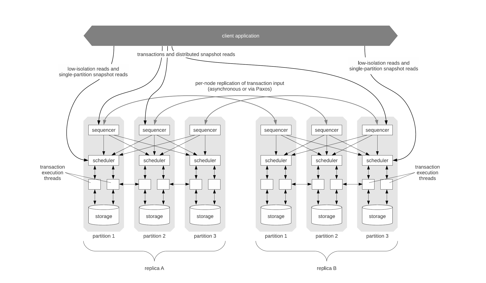
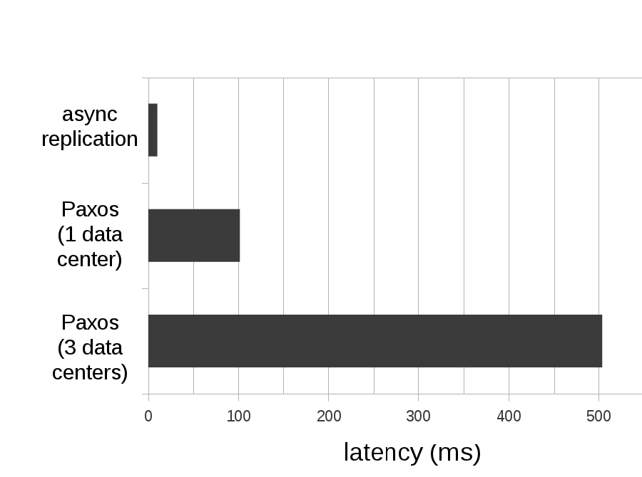
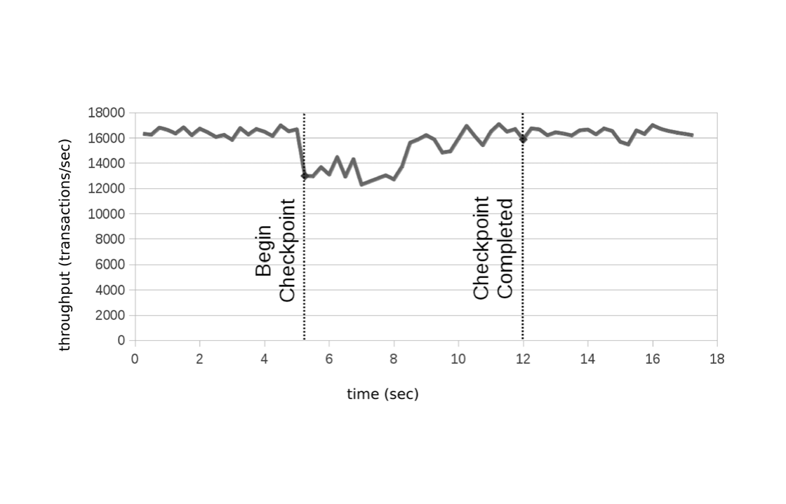
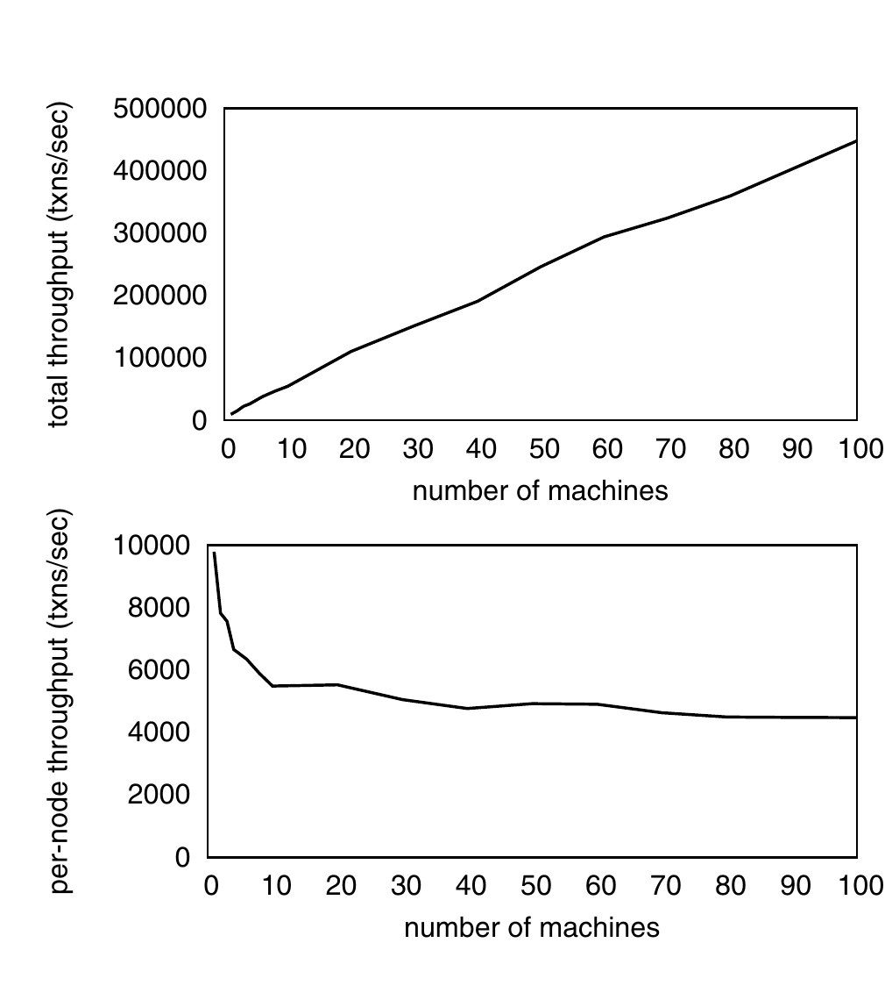
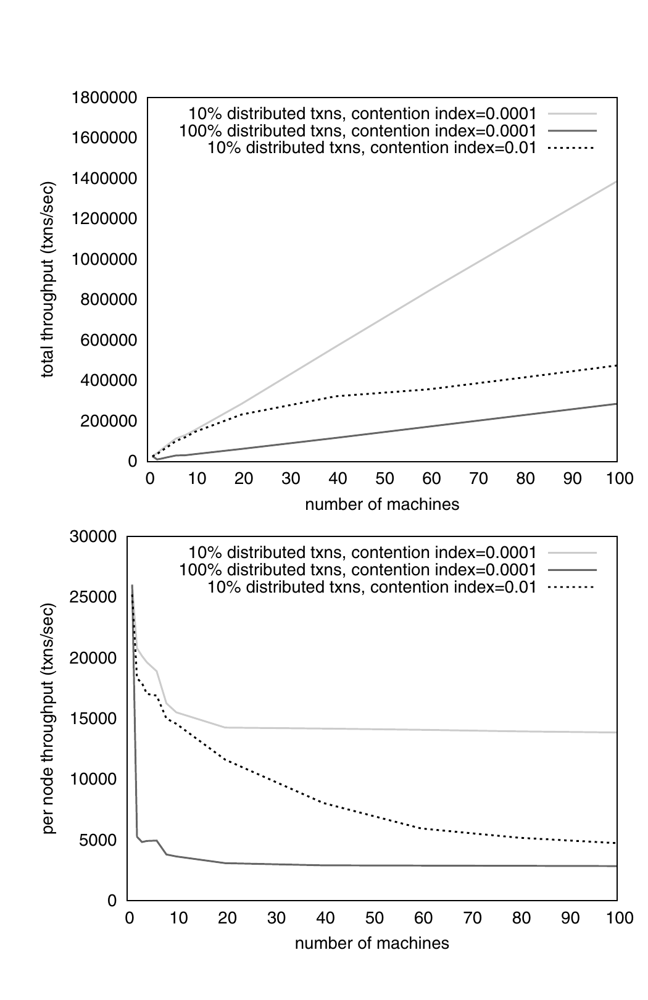
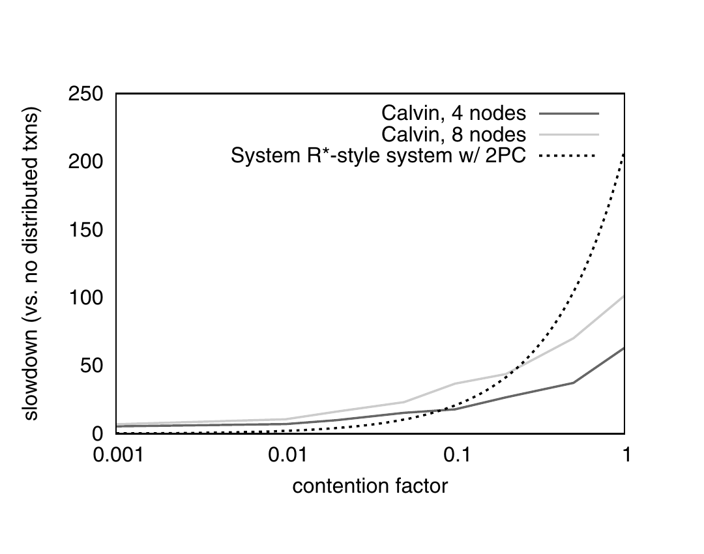

# Calvin: Fast Distributed Transactions for Partitioned Database Systems（中文译文）

## 译者说明

本文依据同目录的 `source.pdf` 翻译。章节、图表、公式、算法、代码与参考文献按原文结构保留。

## 出版信息

Alexander Thomson、Thaddeus Diamond、Shu-Chun Weng、Kun Ren、Philip Shao、Daniel J. Abadi

耶鲁大学

SIGMOD '12，2012 年 5 月 20 至 24 日，美国亚利桑那州斯科茨代尔。版权 © 2012 ACM，ISBN 978-1-4503-1247-9/12/05。

允许免费制作本文全部或部分内容的数字或纸质副本，供个人或课堂使用，前提是副本不用于营利或商业目的，并在首页保留本声明和完整引文。复制用于其他目的、再版、发布到服务器或分发到邮件列表，须事先获得明确许可并可能支付费用。

## 摘要

许多分布式存储系统通过分区和复制获得较高的数据访问吞吐量，各有优势与取舍。然而，为了获得高可扩展性，现有系统通常削弱事务支持，不允许单个事务跨越多个分区。Calvin 是一个实用的事务调度与数据复制层，它利用确定性的顺序保证，显著降低分布式事务通常难以承受的争用成本。不同于此前的确定性数据库系统原型，Calvin 支持基于磁盘的存储，能够在通用机器集群上近线性扩展，并且不存在单点故障。Calvin 复制的是事务输入而非事务效果，因此还能支持多种一致性级别，包括跨地理远端副本、基于 Paxos 的强一致性，而不会牺牲事务吞吐量。

**类别与主题描述符：** C.2.4 [分布式系统]：分布式数据库；H.2.4 [数据库管理]：系统，包括并发、分布式数据库和事务处理。

**一般术语：** 算法、设计、性能、可靠性。

**关键词：** 确定性、分布式数据库系统、复制、事务处理。

## 1. 背景与引言

当前分布式数据库系统设计的若干趋势之一，是不再支持传统的 ACID 数据库事务。有些系统完全不提供事务支持，例如 Amazon Dynamo [13]、MongoDB [24]、CouchDB [6] 和 Cassandra [17]。另一些系统只提供有限的事务能力，例如单行事务更新（Bigtable [11]），或把一次事务的访问限制在数据库的一小部分中（Azure [9]、Megastore [7] 和 Oracle NoSQL Database [26]）。这些系统不支持完整 ACID 事务的主要原因，是希望获得线性的横向扩展能力。还有一些系统，例如 VoltDB [27, 16]，支持完整 ACID，但在处理跨多个分区的数据访问事务时，会停止或限制事务的并发执行。

削弱事务支持，会大幅简化为“天然易分区”应用构建线性可扩展分布式存储方案的工作。然而，对不易分区的应用，保证原子性和隔离性的责任通常落到应用程序员身上，导致代码复杂度上升、应用开发变慢，并产生性能较低的客户端事务调度。

Calvin 被设计为与非事务存储系统并列运行，把后者转化成一个无共享、近线性可扩展的数据库系统，并提供高可用性[^1]和完整 ACID 事务。一次事务可以跨越无共享集群中分布在多个节点上的多个分区。Calvin 在存储系统之上提供一层，负责分布式事务调度、复制和系统内网络通信。它面对分布式事务仍能扩展的关键技术，是一种确定性锁机制；该机制使系统能够彻底消除分布式提交协议。

### 1.1 分布式事务的成本

数据库领域历来沿用 20 世纪 80 年代 System R* 设计者开创的方式实现分布式事务 [22]。System R* 风格的分布式事务之所以降低吞吐量并延长延迟，主要是因为事务提交时必须在所有参与机器之间执行一致协议，以保证原子性和持久性。为了保证隔离性，事务必须在这一协议的整个执行期间持有全部锁；该协议通常是两阶段提交（two-phase commit，2PC）。

持锁执行一致协议的问题在于，两阶段提交需要所有参与机器之间进行多次网络往返，协议耗时往往显著长于本地事务逻辑的总执行时间。若少数被频繁访问的记录经常参与分布式事务，锁在这些记录上多持有的时间会严重损害总体事务吞吐量。我们把事务持有锁的总时长称为该事务的争用足迹（contention footprint），其中包括任何必要提交协议的执行时间。本文多数讨论假设采用悲观并发控制，但延长争用足迹的代价同样适用于乐观方案，而且由于可能产生级联中止，代价往往更糟。

两阶段提交的一些优化可以把多个并发事务的提交决定合并到同一轮协议中，从而降低 CPU 和网络开销，却不能缓解它造成的争用成本。

在采用悲观并发控制的系统里，允许分布式事务还可能引入分布式死锁。死锁检测与纠正通常不会带来难以承受的系统开销，但可能迫使事务中止并重新开始，在一定程度上增加延迟并降低吞吐量。

### 1.2 一致复制

分布式数据库系统设计的另一个趋势，是削弱复制的一致性保证。Dynamo、SimpleDB、Cassandra、Voldemort、Riak 和 PNUTS 都降低了复制数据的一致性保证 [13, 1, 17, 2, 3, 12]。通常给出的理由是 CAP 定理 [5, 14]：系统若要实现全天候全球可用性，并在发生网络分区时仍保持可用，就必须提供较弱的一致性保证。

不过，在论文写作前一年，这一趋势开始反转，原因或许部分在于全球信息基础设施不断改善，使严重网络分区越来越罕见。多个新系统开始支持强一致复制。例如，Google Megastore [7] 和 IBM Spinnaker [25] 都通过 Paxos [18, 19] 实现同步复制。

同步更新具有一致协议所固有的延迟代价，该代价取决于副本之间的网络延迟。为了降低相关故障，副本常分布在相距很远的地理位置，因此代价可能很高。不过，这从本质上只是延迟成本，并不一定影响争用或吞吐量。

### 1.3 在不增加争用的情况下达成一致

Calvin 实现低成本分布式事务和同步复制的方法如下：当多台机器需要就某个事务的处理方式达成一致时，它们在事务边界之外完成这一工作，即在获取锁并开始执行事务之前完成。

一旦就事务处理计划达成一致，事务就必须按计划执行到底；节点故障及相关问题不能导致事务中止。如果某个节点故障，它可以从并行执行同一计划的副本恢复；也可以重放为该节点规划的活动历史。无论是并行执行计划还是重放计划历史，都要求活动计划具有确定性，否则副本可能分叉，历史也可能被错误重演。

为了在保证确定性的同时最大化事务执行并发度，Calvin 采用一种确定性锁协议，其基础是我们此前提出的协议 [28]。

所有 Calvin 节点都会就要尝试哪些事务以及尝试顺序达成一致，因此 Calvin 可以彻底放弃分布式提交协议。这样既缩小分布式事务的争用足迹，也使吞吐量即使存在多分区事务仍可近线性横向扩展。实验表明，在高争用工作负载下，Calvin 显著优于传统分布式数据库设计。我们在 Amazon 云的通用机器集群上实现了每秒 50 万个 TPC-C 事务，这已经能与当时 TPC-C 网站公布、使用高端得多的硬件得到的世界纪录直接竞争。

本文的主要贡献如下：

- 设计一个事务调度与数据复制层，把非事务存储系统转化为近线性可扩展的无共享数据库系统，并提供高可用性、强一致性和完整 ACID 事务。
- 实现一种实用的确定性并发控制协议；它比先前方法更可扩展，也不引入潜在单点故障。
- 设计一种数据预取机制，利用事务执行前的规划阶段，让事务能够操作驻留磁盘的数据，而不会让事务的争用足迹覆盖整个磁盘查找时长。
- 设计一种快速检查点方案。该方案结合 Calvin 的确定性保证，完全消除物理 REDO 日志及其开销。

第 2 节进一步介绍确定性数据库系统的背景。第 3 节给出 Calvin 架构。第 4 节讨论 Calvin 如何处理访问磁盘驻留数据的事务。第 5 节说明定期获取完整数据库快照的机制。第 6 节通过一系列实验考察 Calvin 在不同工作负载下的吞吐量与延迟。第 7 节讨论相关工作，第 8 节讨论未来工作，第 9 节总结全文。

## 2. 确定性数据库系统

在传统的 System R* 风格分布式数据库中，提交分布式事务时需要一致协议，主要是为了保证事务的全部效果以原子方式成功进入持久存储：事务涉及的节点要么都同意提交本地修改，要么都不提交。阻止节点提交本地修改并使整个事务中止的事件分为两类：非确定性事件，例如节点故障；确定性事件，例如事务逻辑规定，若库存将降到零以下就必须中止。

从根本上说，事务并不一定要因为非确定性事件而中止。系统选择因外部事件中止事务，是出于实际考虑。毕竟，若强迫系统中所有其他节点等待遭遇硬件故障等非确定性事件的节点恢复，系统可能陷入极其漫长的停顿。

但如果有副本节点正与故障节点并行执行完全相同的操作，那么依赖故障节点通信才能执行事务的其他节点无须等待它恢复到原状态，而可以向副本节点请求当前或未来事务所需的数据。由于副本节点能够完成事务，该事务也可以提交；故障节点最终会在恢复后完成该事务。[^2]

因此，只要存在一个副本与遭遇非确定性故障的节点并行处理相同事务，就不再需要因这类故障中止事务。唯一的问题是，副本必须经历相同的数据库状态序列，才能在事务中途立即替换故障节点。同步复制每一次数据库状态变化开销过高，并不可行。确定性数据库系统改为同步复制事务请求批次。

传统数据库实现只复制事务输入通常不足以保证副本不分叉。数据库只能保证事务处理在逻辑上等价于某个串行顺序，但两个副本可能因线程调度、网络延迟或其他硬件约束不同，而采用等价于不同串行顺序的方式处理同一输入。若修改数据库的并发控制层，使它按已经商定的事务输入顺序获取锁，并对数据库做少量其他修改 [28]，所有副本就能模拟同一串行执行顺序，从而保证数据库状态不分叉。[^3]

这类确定性数据库只需复制数据库输入就能保持两个副本一致。如上所述，主动复制节点的存在使分布式事务即使在执行中途发生非确定性故障也能提交。这消除了分布式事务结束时使用一致协议的主要理由，即检查是否存在会导致事务中止的节点故障。

另一种可能导致中止的原因，是事务中的确定性逻辑，例如库存为零时必须中止。对此，也不一定要在事务末尾执行一致协议。事务涉及的每个节点只需等待所有可能确定性中止该事务的节点发来单向消息，收到这些消息后即可提交。

## 3. 系统架构

Calvin 被设计成位于任意存储系统之上的可扩展事务层，只要求底层实现基本 CRUD 接口，即创建或插入、读取、更新和删除。Calvin 可以运行在 SimpleDB 或 Cassandra 等分布式非事务存储系统之上；不过，为便于说明，这里假设底层存储系统本身不是分布式的。例如，可以在多台独立机器（下文称为“节点”）上分别安装单节点键值存储。在这种配置下，Calvin 负责组织各节点存储系统之间的数据分区，并编排事务执行期间节点间的全部必要网络通信。

Calvin 的高层架构见图 1。其核心是把系统分成三个独立的处理层：

- **定序层（sequencing layer，也称 sequencer）：** 截获事务输入，并把它们放进全局事务输入序列。所有副本在执行时都要保证与这个顺序串行等价。定序器还负责复制并记录该输入序列。
- **调度层（scheduling layer，也称 scheduler）：** 使用确定性锁方案编排事务执行，在保证与定序层指定的串行顺序等价的同时，允许事务由事务执行线程池并发执行。图 1 中执行线程画在调度器组件下方，但从概念上属于调度层。
- **存储层（storage layer）：** 负责全部物理数据布局。Calvin 事务通过简单 CRUD 接口访问数据；任何支持类似接口的存储引擎都可以较容易地接入 Calvin。

**图 1：Calvin 的系统架构。** 每个物理节点都包含定序器、调度器、事务执行线程与存储组件；示例中两个副本各有三个分区。客户端可以提交事务、分布式快照读取、低隔离读取和单分区快照读取，事务输入按节点异步复制或经 Paxos 复制。

三个层次都可水平扩展，其功能分布在无共享节点集群上。Calvin 部署中的每个节点通常运行每层的一个分区，图 1 中竖直的浅灰色框代表集群中的物理机器。下文分别讨论三层的实现。

把复制机制、事务功能与并发控制（定序层和调度层）同存储系统分离，使 Calvin 明显有别于传统的高度整体化数据库设计。在传统设计中，物理访问方法、缓冲区管理器、锁管理器和日志管理器高度集成并相互依赖。解耦意味着无法实现一些常用恢复与并发控制技术，例如 ARIES 的生理日志，以及用 next-key locking 处理幻读，因为后者使用物理替代物代表并发控制中的逻辑属性。Calvin 并非唯一把事务组件与数据组件分离的尝试。随着云计算及其高度模块化的服务兴起，数据库领域重新关注把这些功能分解为不同的模块化系统组件 [21]。

### 3.1 定序器与复制

在此前的确定性数据库研究中，我们用一个简单的回声服务器实现定序层：单个节点接收事务请求、把请求记录到磁盘，再按时间戳顺序把它们转发给每个副本中的相应数据库节点 [28]。单节点定序器有两个问题：(a) 它是潜在单点故障；(b) 随系统增长，单节点定序器的固定吞吐量上限很快阻止整个系统继续扩展。Calvin 的定序层既分布在所有系统副本上，也在每个副本内部跨所有机器分区。

Calvin 把时间划分成 10 毫秒的 epoch。在每个 epoch 内，各机器上的定序器组件收集客户端事务请求。epoch 结束时，送达某个定序器节点的全部请求被编成一个批次。事务输入正是在此时复制，具体机制见下文。

定序器的批次成功复制后，它向本副本每个分区上的调度器发送消息，其中包含：(1) 定序器的唯一节点 ID；(2) epoch 编号，整个系统每 10 毫秒同步递增一次；(3) 接收方参与执行时需要的全部事务输入。每个调度器据此把该 epoch 中所有定序器的批次按确定性轮询方式交错，拼出自己所见的全局事务顺序。

#### 3.1.1 同步复制与异步复制

Calvin 当前支持两种事务输入复制模式：异步复制和基于 Paxos 的同步复制。在两种模式中，节点都被组织为复制组，每组包含某一分区的全部副本。例如在图 1 的部署中，副本 A 的分区 1 和副本 B 的分区 1 共同构成一个复制组。

在异步复制模式下，一个副本被指定为主副本，所有事务请求立即转发到该副本各节点的定序器。每个主节点上的定序器编好批次后，把批次转发给其复制组中的所有其他从定序器。这种方式让事务可以以极低延迟开始在主副本执行，代价是故障转移明显更复杂。主定序器故障时，同一副本中的全部节点以及故障节点复制组的全部成员必须就两件事达成一致：(a) 故障定序器最后发出的有效批次是哪一个；(b) 该批次究竟包含哪些事务。之所以需要第二点，是因为每个调度器只会收到自己执行时需要的批次局部视图。

Calvin 也支持用 Paxos 同步复制事务输入。在这种模式下，同一复制组内的全部定序器使用 Paxos，就每个 epoch 的合并事务请求批次达成一致。当前实现使用 ZooKeeper。ZooKeeper 是一种高可靠分布式协调服务，分布式数据库系统经常用它实现心跳、配置同步和命名 [15]。ZooKeeper 没有针对大量数据存储优化，其总延迟可能高于最高效的 Paxos 实现。不过，在本文全部实验中，ZooKeeper 都能提供复制 Calvin 事务输入所需的吞吐量。由于同步步骤不会延长争用足迹，这个预处理步骤完全不影响事务吞吐量。若在 Calvin 定序器之间实现比 ZooKeeper 开箱方案更精简的 Paxos 一致协议，对延迟敏感型应用会有帮助，但不会提高 Calvin 的事务吞吐量。

**图 2：Calvin 不同复制模式下的平均事务延迟。** 异步复制延迟最低；同一数据中心内的 Paxos 约为 100 毫秒；跨三个数据中心的 Paxos 约为 500 毫秒。

图 2 给出当前 Calvin 代码库在不同复制模式下的平均事务延迟。数据由每个副本 4 台 EC2 High-CPU 机器取得，系统每秒运行 40,000 个微基准事务（每节点 10,000 个），其中 10% 为多分区事务。第 6 节给出实验设置的更多细节。两组 Paxos 延迟都使用三个副本，共 12 个节点。所有副本位于同一数据中心时，副本间 ping 时延约为 1 毫秒。跨数据中心复制时，三个副本分别运行在 Amazon 美国东部（弗吉尼亚）、美国西部（北加利福尼亚）和欧盟（爱尔兰）数据中心，副本间 ping 时延为 100 至 170 毫秒。改变 Calvin 的复制模式不影响总事务吞吐量。

### 3.2 调度器与并发控制

数据库的事务组件与存储组件解耦后，事务组件不能再对数据层的物理实现作任何假设，不能引用页或索引等物理数据结构，也无法获知事务对数据库物理布局造成的副作用。日志协议与并发协议都必须完全采用逻辑形式，只能引用记录键，不能引用物理数据结构。

对确定性数据库而言，无法使用生理日志并不是问题。数据库状态完全由输入决定，所以逻辑日志很直接：定序层记录输入，存储层偶尔生成检查点。第 5 节进一步讨论 Calvin 的检查点机制。

不过，只能访问逻辑记录会给并发控制带来一些麻烦，因为锁定键范围并可靠防止幻读通常需要物理访问数据。Calvin 可以采用近期为另一个解耦数据库系统提出的方法，在事务层创建可用逻辑锁锁定的虚拟资源 [20]；但这项功能仍属未来工作。

Calvin 的确定性锁管理器分布在整个调度层。每个节点的调度器只负责锁定该节点存储组件中的记录，即使事务还会访问其他节点上的记录也是如此。锁协议类似严格两阶段锁，但增加了两个不变量：

- 对同时请求某个本地记录 `R` 排他锁的任意事务对 `A` 和 `B`，如果定序层给出的串行顺序中 `A` 在 `B` 前面，那么 `A` 必须先于 `B` 请求 `R` 上的锁。Calvin 实际上用一个线程串行处理全部锁请求。该线程扫描定序层发来的串行事务顺序；对每个条目，一次性请求该事务整个生命周期需要的全部锁。因此，所有事务都必须提前声明完整读写集，3.2.1 节讨论这一限制。
- 锁管理器必须严格按事务发出请求的顺序授予锁。在上例中，只有 `A` 已获取 `R` 上的锁、执行完毕并释放锁后，`B` 才能获得该锁。

客户端把事务逻辑指定为 C++ 函数，可以通过基本 CRUD 接口访问任何数据。事务代码完全不必知道分区方式，尽管用户可以在其他位置指定键如何跨机器分区。Calvin 截获事务代码中的全部数据访问，并自动转发远程读取结果。

事务按上述协议获得全部锁、因而可以安全完整执行后，就交给工作线程。工作线程实际执行事务分五个阶段：

1. **分析读写集。** 工作线程拿到事务请求后，首先分析事务的读写集，记录：(a) 本地存储的读写集元素，即该线程所在节点上的元素；(b) 写集中各元素所在的参与节点集合。这些节点称为事务的主动参与者。只存储读集元素的参与节点称为被动参与者。
2. **执行本地读取。** 工作线程查找读集中全部本地记录的值。根据存储接口，这可能意味着把记录复制到本地缓冲区，也可能只保存指向记录内存位置的指针。
3. **提供远程读取。** 本地读取阶段的全部结果被转发给每个主动参与节点上的对应工作线程。被动参与者不修改数据，不必执行实际事务代码，也就不必收集远程读取结果。被动参与节点上的工作线程在这一阶段后结束。
4. **收集远程读取结果。** 主动参与节点上的工作线程必须执行事务代码，因此先要取得全部读取结果，既包括第二阶段得到的本地读取结果，也包括每个参与节点在第三阶段转发的远程结果。本阶段负责收集后一类结果。
5. **执行事务逻辑并应用写入。** 工作线程收齐全部读取结果后，执行所有事务逻辑，并应用本地写入。非本地写入可以忽略，因为相应节点的对应事务执行线程会把它们视为本地写入并在那里应用。

假设分布式事务在所有参与节点上大致同时开始执行（实际并非总是如此，第 6 节会详细讨论），全部读取就会并行发生，全部远程读取结果也会并行传递。不同节点的工作线程在事务执行时无须互相请求数据。

#### 3.2.1 依赖型事务

有些事务必须先读取数据，才能确定完整读写集。我们称之为依赖型事务（dependent transactions）。Calvin 的确定性锁协议要求在事务开始执行前知道完整读写集，因此不会原生支持这类事务。Calvin 改为支持乐观锁位置预测（Optimistic Lock Location Prediction，OLLP）。该方案只需修改客户端事务代码，就能以很低的开销实现 [28]。

OLLP 的思路是：在依赖型事务之前执行一个低成本、低隔离、无复制、只读的侦察查询，完成发现事务完整读写集所需的全部读取。随后把真正事务送入全局序列，并用侦察查询结果作为读写集来执行。侦察查询和实际事务之间，已读记录以及实际事务的读写集可能发生变化，因此必须重新检查读取结果；若侦察得到的读写集已失效，就必须以确定性方式重新开始该过程。

这一类事务中尤其常见的是：必须执行辅助索引查找才能确定完整读写集。辅助索引修改成本通常较高，因此很少建在更新极为频繁的字段上。例如，库存品名称或纽约证券交易所股票代码上常有辅助索引，而库存数量或股票价格等更易波动的字段上很少建立辅助索引。因此在大多数常见真实工作负载中，OLLP 很少会导致事务反复重启。

TPC-C 的 Payment 事务就是这一子类的例子。TPC-C 工作负载从不修改 Payment 事务读写集所依赖的索引，所以使用 OLLP 时 Payment 事务从不需要重启。

## 4. Calvin 与基于磁盘的存储

我们此前关于确定性数据库系统的研究有一个限制：确定性执行只能用于完全驻留主存的数据库 [28]。原因在于，确定性数据库相对传统非确定性系统有一个主要缺点。非确定性系统可以保证与任意串行顺序等价，因而能够任意重排事务；Calvin 这样的系统则必须服从定序器选择的顺序。

例如，假设事务 `A` 因等待磁盘访问而停顿，传统系统可以运行不与 `A` 已持有的锁冲突的事务 `B` 和 `C`。如果 `B` 和 `C` 的写集与 `A` 重叠，但只重叠在 `A` 尚未锁定的键上，执行就可以等价于串行顺序 `B-C-A`，而不必是 `A-B-C`。在确定性系统中，`B` 和 `C` 必须阻塞到 `A` 完成。更糟的是，其他与 `B`、`C` 冲突但不与 `A` 冲突的事务，也会被堵在 `A` 后面。磁盘停顿在事务执行期间经常长达 10 毫秒以上，所以动态重排能非常有效地提高资源利用率。

Calvin 遵循其指导性设计原则，避免确定性在磁盘数据库上的这一缺点：尽量把繁重工作移到事务处理流水线的更早阶段，在获得锁之前完成。

每当定序器组件收到一个可能发生磁盘停顿的事务请求时，它不会立即把请求转发给调度层，而是人为延迟一段时间；同时，它请求所有相关存储组件“预热”该事务将访问的磁盘驻留记录。只要人为延迟大于或等于把全部磁盘驻留记录调入内存所需的时间，事务实际执行时就只会访问内存驻留数据。该方案下事务总延迟不会高于传统系统在执行期间进行磁盘 I/O 时的延迟，因为两者执行的磁盘操作集合完全相同；但磁盘延迟不会进入事务的争用足迹。

为了清楚展示该技术的适用性及陷阱，我们为 Calvin 实现了一个简单的磁盘存储系统。“冷”记录被写到本地文件系统，只有事务需要时才读入 Calvin 的主存键值表。每台机器每秒运行 10,000 个微基准事务时，只要访问磁盘的事务不超过 0.9%，即 10,000 个事务中的 90 个，Calvin 总事务吞吐量就不受影响。不过，这一数字高度依赖服务器硬件配置。实验使用低端通用硬件，支持磁盘事务的数量受限于本地磁盘的最大吞吐量，而不是争用足迹。微基准随机访问大量不同文件，所以每台机器每秒 90 个磁盘访问事务就足以让磁盘随机访问吞吐量成为瓶颈。若采用高端磁盘阵列，或用闪存替代磁盘，就能支持多得多的磁盘事务而不影响总吞吐量。

为了进一步了解 Calvin 与其他磁盘配置、闪存、网络块存储等接口的潜力，我们还实现了另一种存储引擎，把“冷”数据存放在单独机器的内存中，并可配置为等待预设时长后才响应数据请求，以模拟网络或存储访问延迟。在这一设置下，无论有多少事务访问冷数据，即使争用极高（争用指数为 0.01），每台机器都能维持每秒 10,000 个事务的负载。

我们发现，将确定性执行与磁盘存储结合有两个主要挑战。第一，必须准确预测磁盘延迟，才能让事务延迟适当时长。第二，Calvin 的定序层必须准确跟踪全部存储节点上哪些键位于内存中，才能判断何时需要预取。

### 4.1 磁盘 I/O 延迟预测

准确预测把记录从磁盘取入内存所需的时间并不容易。读取磁盘驻留记录的耗时可能因多种原因大幅变化：

- 磁头和主轴需要移动的物理距离不同；
- 此前已经排队的磁盘 I/O 操作；
- 远程读取的网络延迟；
- 介质故障后的故障转移；
- 遍历基于磁盘的数据结构（例如 B+ 树）需要多次 I/O。

因此，不可能完美预测延迟，任何启发式方法有时都会低估，有时也会高估。我们在调优 Calvin 以便在高争用下良好处理磁盘数据时发现，磁盘 I/O 延迟估计是一个格外有趣且至关重要的参数。

如果定序器采用保守的偏高估计，让事务等待时间长于通常所需，磁盘访问造成的争用成本会最小，因为事务需要读取记录之前，预取几乎总能完成；代价则是总事务延迟上升。估计过高还可能让存储系统内存充满等待相应事务进入调度的冷记录。

相反，如果定序器低估磁盘 I/O 延迟，没有让事务等待足够久，事务就会过早进入调度，并在执行期间停顿，直到全部预取完成。由于这段时间事务一直持锁，争用足迹以及系统总吞吐量都可能付出很高代价。

因此，估计磁盘 I/O 延迟时，总事务延迟与争用之间存在根本取舍。在上述两个实验中，我们调节延迟预测，使至少 99% 的磁盘访问事务都在相应预取请求完成后才进入调度。对基于简单文件系统的存储引擎，这意味着人为加入 40 毫秒延迟，但即使争用极高（争用指数为 0.01），也足以维持吞吐量。在较低争用下（争用指数不超过 0.001），除了收集事务请求成批所带来的默认延迟外，不需要额外等待；该默认延迟平均为 5 毫秒。随着 Calvin 继续接入不同的商用存储引擎，更全面研究这种延迟与争用之间的取舍，是一个有意义的未来方向。

### 4.2 全局跟踪热记录

为了准确判断哪些事务应在预热读集期间延迟调度，每个节点的定序器组件都必须跟踪整个系统当前位于内存中的数据，不能只跟踪与本节点定序器同机部署的存储组件所管理的数据。我们的实验可以这样做，但这种方案不可扩展。

如果每个定序器都不保存全局热键列表，一种方案是延迟所有事务的调度，直到留出足够的预取时间。这样能防止磁盘查找延长争用足迹，却会给每个事务增加延迟。另一种只适用于单分区事务的方案，是让各副本中的调度器同步跟踪本地热数据，再由调度器确定性地决定：如果单分区事务试图读取冷数据，就延迟其锁请求。如何把这一策略扩展到多分区事务，仍需在未来做更全面的研究。

## 5. 检查点

确定性数据库系统有两个能简化容错的性质。第一，主动复制让客户端在系统崩溃时立即故障转移到另一个副本。第二，系统只记录事务输入，无须承担物理 REDO 日志的开销。只要重放事务输入历史，就足以把数据库恢复到当前状态。

然而，每次故障都从数据库诞生之初重放全部历史既低效又荒谬。Calvin 因此定期为完整数据库状态生成检查点，恢复时从检查点开始重放。

Calvin 支持三种检查点模式：朴素同步检查点、Cao 等人 Zig-Zag 算法 [10] 的异步变体，以及只有存储层支持完整多版本时才能使用的异步快照模式。

第一种模式利用主动复制系统固有的冗余生成系统检查点。系统可以定期冻结整个副本，并生成系统的完整版本快照。由于每次只冻结一个副本，客户端看不到该副本不可用的时期。

这种方案有一个问题：生成检查点的副本可能显著落后于其他副本。如果另一个副本发生硬件故障、需要它接替工作，就可能出现麻烦。在高负载系统中，该副本追上其他副本也可能耗费很长时间。

Calvin 的第二种检查点模式紧密基于 Cao 等人的 Zig-Zag 算法 [10]。对于给定数据存储中的每条记录，Zig-Zag 保存两个副本 $AS[K] _ 0$ 和 $AS[K] _ 1$，另为每条记录保存两个位 $M_R[K]$ 与 $M_W[K]$，其中 $K$ 是记录键。 $M_R[K]$ 指定读取记录 $K$ 时使用哪个版本， $M_W[K]$ 指定更新记录 $K$ 时覆盖哪个版本。因此，记录 $K$ 的新值始终写入 $AS[K] _ {M_W[K]}$；每次更新 $K$ 时，再令 $M_R[K] = M_W[K]$。

Zig-Zag 的每个检查点周期都从一个物理一致点开始，此时整个数据库进入静止状态，并对数据库中的每个键 $K$ 设置：

$$
M_W[K] = \neg M_R[K]
$$

因此， $AS[K] _ {M_W[K]}$ 始终保存记录最新版本，而 $AS[K] _ {\neg M_W[K]}$ 始终保存最近检查点周期开始之前写入的最后一个值。异步检查点线程可以遍历每个键 $K$，把 $AS[K] _ {\neg M_W[K]}$ 写入磁盘，无须担心记录在此期间被覆盖。

Calvin 利用其全局串行顺序实现了一个 Zig-Zag 变体，无须让数据库静止以建立物理一致点。它改为相对于一个虚拟一致点捕获快照，该点只是全局串行顺序中预先指定的位置。

当虚拟一致点接近时，Calvin 存储层开始为每条记录保存两个版本：“之前”版本只能由排在虚拟一致点之前的事务更新，“之后”版本则由排在虚拟一致点之后的事务写入。一旦虚拟一致点之前的全部事务执行完毕，每条记录的“之前”版本就实际不可再变，异步检查点线程可以开始把它们写入磁盘。检查点完成后，系统垃圾回收重复版本：同时具有“之前”和“之后”版本的记录丢弃“之前”版本，在下一个检查点周期开始前，每个记录只保留一个版本。

**图 3：使用 Calvin 改进 Zig-Zag 方案时，一次典型检查点周期内吞吐量随时间的变化。** 检查点约在第 5 秒开始、第 12 秒完成；吞吐量在此期间短暂下降，随后恢复。

第一种检查点模式会在检查点持续期间完全停止事务执行，而异步方案只在异步检查点线程活动时产生适度开销。图 3 给出典型检查点捕获周期中 Calvin 的最大吞吐量变化。测量来自单机 Calvin 部署，在低争用下运行我们的微基准；第 6 节进一步说明实验设置。

总吞吐量确有一定下降，原因是：(a) 获取检查点需要 CPU；(b) 访问记录时会产生少量 latch 争用。但把稳定值异步写入存储不会增加锁争用，也不会增加事务延迟。

Calvin 还可以利用显式跟踪每条记录全部近期版本以及当前版本的存储引擎。多版本存储引擎允许只读查询在不获取任何锁的情况下执行，以增加内存使用为代价，降低总体争用和并发控制总开销。使用这种模式时，Calvin 的检查点方案就是对全部记录执行一次普通的 `SELECT *` 查询，只是查询结果写入磁盘文件，而不返回客户端。

## 6. 性能与可扩展性

为了研究 Calvin 在不同条件下的性能与可扩展性，我们使用两个基准运行了多组实验：TPC-C，以及一个便于更精细控制参数变化的自制微基准。除非另有说明，所有实验都在 Amazon EC2 上使用 High-CPU/Extra-Large 实例运行。该实例承诺提供 7 GB 内存和 20 个 EC2 Compute Unit，即 8 个虚拟核，每核 2.5 个 EC2 Compute Unit。[^4]

### 6.1 TPC-C 基准

TPC-C 基准包含多类事务，但工作负载的主体是 New Order 事务，其中也包括几乎所有需要高隔离的分布式事务。New Order 模拟客户在电子商务应用中下单。由于实验关注分布式事务，我们的 TPC-C 实现只保留 New Order 事务。不过，我们预计运行完整 TPC-C 基准时会得到相近的性能与扩展结果。

**图 4：改变部署规模时，TPC-C（100% New Order）总吞吐量与单节点吞吐量。** 总吞吐量随机器数近线性增长；单节点吞吐量在小规模时下降，超过约 10 个节点后趋于稳定。

图 4 把总吞吐量和每机器吞吐量（每秒执行的 TPC-C New Order 事务数）画成 Calvin 节点数的函数。每个节点存储一个数据库分区，其中包含 10 个 TPC-C warehouse。为了充分考察 Calvin 对分布式事务的处理，跨 warehouse 的 New Order 事务约占全部 New Order 的 10%，并且总是访问另一台机器上的第二个 warehouse。

每个分区包含 10 个 warehouse，而 New Order 会更新某个 warehouse 的 10 个 district 之一。因此，每台机器上最多只能同时执行 100 个 New Order 事务，因为每个分区最多只有 100 个不同 district，且每个 New Order 事务都要获得一个 district 的排他锁。必须尽量缩短持锁时间，因为系统吞吐量取决于这 100 个并发事务完成并释放锁的速度；只有这样，新事务才能获取 district 排他锁并开始执行。

如果 Calvin 在分布式 New Order 事务的两阶段提交等一致协议期间继续持锁，吞吐量会受到严重限制。6.3 节将给出与采用两阶段提交的传统系统的详细比较。Calvin 不需要一致协议，因此在超过 10 个节点的集群中，每节点每秒约可执行 5,000 个事务，并能线性扩展。小集群中的单节点吞吐量较高，原因见下一节。

我们的 Calvin 实现由此在 100 节点集群上达到接近每秒 50 万个 TPC-C 事务。值得注意的是，当时 TPC-C 世界纪录保持者 Oracle 每秒运行 504,161 个 New Order 事务，但其硬件远高端于我们的实验机器 [4]。

### 6.2 微基准实验

为更精确考察高争用与分布式事务结合时的成本，我们实现了一个微基准。它与 TPC-C New Order 有部分共同特征，但总体开销更低，也允许更细致地调整工作负载。

基准中的每个事务读取 10 条记录，对结果执行约束检查，并且仅当检查通过时才更新每条记录中的计数器。这 10 条记录中，一条选自较小的“热”记录集合[^5]，其余选自大得多的记录集合。多机事务是例外：它会在参与事务的每台机器上各访问一条热记录。

改变热记录数量，就能精细调节争用。下文用争用指数（contention index）表示事务在某台参与机器上执行时，会更新全部热记录中的多大比例。争用指数为 0.001，意味着事务在每台参与机器上从 1,000 条热记录中选择一条更新，因此至多 1,000 个事务可以并发执行。争用指数为 1，则意味着每个事务都会接触全部热记录，事务只能完全串行执行。

**图 5：改变部署规模时的微基准总吞吐量与单节点吞吐量。** 三条曲线分别代表 10% 分布式事务且争用指数为 0.0001、100% 分布式事务且争用指数为 0.0001，以及 10% 分布式事务且争用指数为 0.01。

图 5 展示把微基准扩展到 100 个 Calvin 节点时，不同争用设置和不同比例分布式事务下的实验结果。争用很低（争用指数为 0.0001）时，随着机器增加，单节点吞吐量在约 10 台机器处降到一个稳定值，之后保持不变，因而系统可线性扩展到更多节点。争用较高（争用指数为 0.01，与 TPC-C 争用水平相近）时，随着机器增加，单节点吞吐量下降得更久、更缓慢，也更慢接近稳定值。

Calvin 的扩展曲线形状受多个因素影响。在所有设置中，从一台机器增加到两台时的陡降，源自每个多分区事务必须额外完成工作的 CPU 成本：

- 序列化和反序列化远程读取结果；
- 在等待接收远程读取结果的事务之间执行额外的上下文切换；
- 在全部参与机器上建立、执行和清理事务，尽管总吞吐量只把该事务计数一次。

初次陡降之后，即使争用程度以及每个分布式事务的参与机器数都不变，增加节点仍会继续降低单节点吞吐量。原因很微妙。假设在高争用工作负载下，机器 `A` 开始执行一个需要机器 `B` 远程读取的分布式事务，但 `B` 尚未执行到该事务。`B` 可能仍在处理序列中更早的事务，并且在之前所有事务都得到锁前，不能开始该事务。机器 `A` 或许还能执行其他不冲突事务，但很快就只能等待 `B` 赶上，才能提交待处理的分布式事务并执行随后发生冲突的事务。

这一机制限制了任一机器能领先或落后于整体进度的程度。争用越高，限制越紧。增加机器会带来两件事：

- **慢机器。** 并非所有 EC2 实例都提供相同性能，EC2 用户有时会碰到较慢的实例。图 5 的三条线使用相同 EC2 实例，三条线都在机器数从 6 增至 8 时突然下降，可见此时加入了一台稍慢的机器。
- **执行进度偏斜。** 每台机器都可能偶尔领先或落后，原因包括操作系统线程调度、网络延迟变化，以及事务序列之间争用的随机变化。机器越多，任一时刻至少有一台机器因某种原因略微落后的可能性就越大。

系统总吞吐量对执行进度偏斜的敏感度强烈依赖两个因素：

- **机器数量。** 集群中机器越少，每新增一台机器给偏斜带来的增量越大。假设 $n$ 台机器中每台有比例为 $k$ 的时间在造成执行进度偏斜，即落后于整体，那么任一时刻至少有一台机器拖慢系统的概率为：

$$
1 - (1 - k)^n
$$

  当 $n$ 增长时，该概率趋近于 1，每新增一台机器产生的偏斜影响越来越小。
- **争用水平。** 争用率越高，每台机器的随机减速越可能迫使其他机器也减慢执行。争用较低（争用指数为 0.0001）时，只有加入最初几台机器会让单节点吞吐量陡降，约 10 个节点后曲线就趋平，因为执行进度偏斜继续增加，对总吞吐量的影响相对很小。争用较高（争用指数为 0.01）时，初始下降更陡；之后还要增加许多机器，曲线才开始趋平，因为执行进度偏斜即使只有很小的增量，也会显著影响吞吐量。

### 6.3 处理高争用

大多数真实工作负载绝大多数时候争用较低，但偶尔出现少数极热数据项并不少见。我们因此让 Calvin 运行这样一种工作负载：许多多分区事务与极高争用结合。我们认为，正是这种工作负载使实际系统很少尝试支持分布式事务。

本实验不考察完整的现实工作负载，只考虑其中高争用多分区事务组成的子集。其他事务仍可能与这些高冲突事务在极热记录之外的记录上发生冲突，因此，该子集的吞吐量可能与整个工作负载的吞吐量紧密耦合，尽管后者其余部分容易扩展。

**图 6：100% 多分区工作负载在不同争用指数下的减速倍数。** 比较 4 节点 Calvin、8 节点 Calvin，以及带 2PC 的 System R* 风格系统模型。

图 6 给出 4 节点和 8 节点 Calvin 系统运行 100% 多分区事务时，相对完全可分区、低争用版本的减速倍数，并以争用指数为自变量。争用指数是每个事务锁定的热记录占热记录全集的比例。因此，争用指数为 0.01 时最多 100 个事务并发执行，争用指数为 1 时事务被迫完全串行执行。

现代分布式系统实现不会采用 System R* 风格的两阶段提交分布式事务，与更早一代系统比较也不公平，因此我们另外给出这种系统由争用引起的减速简单模型。模型假设在非多分区、低争用情况下，系统吞吐量与 Calvin 相近，即每台机器每秒约 27,000 个微基准事务。为了计算多分区事务造成的减速，模型考察两阶段提交延长的争用足迹。

给定争用指数 $C$，最多有 $1/C$ 个事务并发执行，因此在提交时运行 2PC 的系统总吞吐量上限为：

$$
\frac{1}{C \cdot D _ {2PC}}
$$

其中 $D _ {2PC}$ 是两阶段提交协议的持续时间。

同一 EC2 数据中心内节点间的典型往返 ping 延迟约为 1 毫秒，但考虑消息复用、序列化与反序列化以及线程调度，在我们的系统的事务执行线程之间，单向延迟几乎从不低于 2 毫秒，通常更长。因此，对一个开销与 Calvin 类似的系统，模型预计每个分布式事务上的锁大约要持有 8 毫秒。

该模型比较朴素，因为它假设事务争用足迹只包含两阶段提交延迟，完全忽略了 Calvin 实际减速中的其他因素，包括：

- 多分区事务的 CPU 成本；
- 启动 2PC 前作出本地提交或中止决定的延迟，真实系统中可能还需要额外远程读取；
- 执行进度偏斜，模型假设所有节点以完全一致的步调开始执行每个事务及随后的 2PC。

因此，该模型不能给 Calvin 建立一个具体比较点，只能给出这类系统减速的有力下界。真实 System R* 风格系统在高争用分布式事务环境中的减速可能远高于模型预测。

图 6 的结果有两个非常值得注意的特征。第一，在低争用下，Calvin 仍出现约 5 至 7 倍的减速，从每秒 27,000 个事务降至约 5,000 个（4 节点）或 4,000 个（8 节点）。这与上一实验从一台机器扩展到 4 台或 8 台时的结果相同。在我们考察的所有争用水平下，4 节点与 8 节点吞吐量之差都来自不同节点间工作负载执行进度偏斜增加。正如预期，争用越高，偏斜对吞吐量的损害越严重。

第二，在争用极高时，即使模型忽略了多项预期开销，运行两阶段提交的系统模型仍比 Calvin 减速显著更多。这证明：(a) 分布式提交协议是多数现代分布式系统决定不支持 ACID 事务的一个主要因素；(b) Calvin 缓解了这一问题。

## 7. 相关工作

Calvin 架构的一个关键贡献是采用主动复制：同一事务输入被发送到多个副本，每个副本都以确定性方式处理事务输入，从而避免分叉。已有多项工作尝试以这种方式主动复制数据库系统。

Pacitti 等人 [23]、Whitney 等人 [29]、Stonebraker 等人 [27] 以及 Jones 等人 [16] 都提出在分布式数据库中不使用并发控制，而是在每个节点的单个线程中串行执行事务，因此执行等价于一个已知串行顺序。在某些系统中，一个节点可以是多核服务器中的单个 CPU 核 [27]。串行执行消除了并发事务线程调度导致的非确定性，使主动复制更容易实现；但也可能限制事务吞吐量，因为如果某事务因网络读取而停顿，其他事务无法接替执行。

Calvin 允许事务并发执行，同时仍保证与给定串行顺序在逻辑上等价。此外，虽然上述系统也在执行前选择串行顺序，但不像 Calvin 那样严格强制遵循该顺序，例如事务仍可能因硬件故障中止，所以分布式事务仍需要两阶段提交。

上述工作都实现了与 Calvin 定序层相似的系统组件，用于选择串行顺序。Calvin 的定序器设计最接近 H-Store [27]，后者允许客户端把事务提交到集群中任意节点。不过，副本之间同步输入的方式不同。Calvin 可以使用异步日志传送复制，也可以使用基于 Paxos 的强一致同步复制；H-Store 则让事务停顿一段等于向副本发送事务的预期网络延迟，再使用确定性事务排序方案，并假设所有副本发出的全部事务都在该时间窗口内到达。

Bernstein 等人的 Hyder [8] 在概念上与 Calvin 有相似之处，尽管架构设计和实现高可扩展性的方式截然不同。在 Hyder 中，事务基于数据库近期快照提供的视图执行，再提交其“意图”，即缓冲写入。这些意图被组合进全局顺序，并由确定性的 meld 函数处理。meld 函数决定哪些事务提交，哪些必须中止；例如，事务执行后、meld 函数验证前若有数据更新使事务所见数据库视图失效，该事务就必须中止。

Hyder 的全局有序“确定性待尝试事项”日志记录事务执行后的效果，而 Calvin 中对应的日志记录尚未执行的事务请求。不过，Hyder 的乐观方案在概念上与 3.2.1 节的 OLLP 很相似。OLLP 的侦察查询确定事务输入，实际执行事务时再以确定性方式验证；这与 Hyder 的 meld 函数确定性验证事务结果的乐观方式相同。

Lomet 等人提出在云环境中“解耦”事务处理系统组件，其方法类似 Calvin 把流水线各阶段分成不同子系统 [21]。虽然两者的并发控制与复制机制不同，但都把事务组件（调度层）同数据组件（存储层）分离，使事务处理系统可以根据应用需要使用任意存储后端。Calvin 又向前解耦一步，单独分出负责数据复制的定序层。

Google Megastore [7] 和 IBM Spinnaker [25] 率先在现代高容量事务数据库中使用 Paxos 算法 [18, 19] 实现强一致数据复制，尽管 Paxos 及其变体早已广泛用于许多其他应用中的同步一致。与 Calvin 一样，Spinnaker 使用 ZooKeeper [15] 实现 Paxos。Megastore 和 Spinnaker 不是确定性系统，因此必须使用 Paxos 复制事务效果；Calvin 则只需用 Paxos 复制事务输入。

## 8. 未来工作

当前 Calvin 实现通过以下方式处理硬件故障：从最近一次完整快照恢复崩溃机器，再重放此后全部事务。但同一副本中的其他节点可能依赖故障机器提供远程读取，因此该副本其余部分的吞吐量很可能降低或停止，直到恢复完成。

我们计划开发更无缝的故障转移系统。例如，可以用下面的简单技术让故障完全不可见。把全部副本划分成复制子组，每组包含位置相近的一对或三个副本，通常位于同一局域网。在某个副本的数据库节点 `A` 上，与多分区事务执行有关的出站消息不仅发给同一副本中的目标节点 `B`，还发给该复制子组中的每个 `B` 副本，以防子组中的某个 `A` 副本已故障。

这种冗余技术有多种取舍。如果分区间网络通信可能成为瓶颈，就不应采用，尤其是确定性系统的主动复制本来就能提供高可用性。不过，这说明了如何让系统面对故障时高度平滑地继续运行。

两种做法之间较好的折中，也许是集成一个组件监控各节点状态、检测故障，并谨慎编排副本的快速故障转移：当副本中的某台机器故障时，指示该机器的其他副本恰当地转发远程读取消息。这样的组件也很适合统一监督只读查询的负载均衡、动态数据迁移与重新分区，以及负载监控。

## 9. 结论

我们提出 Calvin，一个事务处理与复制层，旨在把通用、非事务、无复制的数据存储转化为完整 ACID、具有一致复制的分布式数据库系统。Calvin 支持数据库水平扩展和不受限制、符合 ACID 的分布式事务，同时支持异步复制和基于 Paxos 的同步复制，既可用于单一数据中心，也可跨地理分离的数据中心。

借助确定性框架，Calvin 能够消除分布式提交协议，而这正是现代分布式系统可扩展性的最大障碍。因此，Calvin 能近线性扩展，并在简化 TPC-C 基准上取得接近世界纪录的事务吞吐量。

## 10. 致谢

本工作由美国国家科学基金会资助，项目编号 IIS-0845643 和 IIS-0844480。任坤获得中国国家自然科学基金项目 61033007 和国家 973 项目 2012CB316203 支持。本文表达的任何观点、发现、结论或建议均属于本文作者，不一定代表美国国家科学基金会或中国国家自然科学基金会的立场。

## 11. 参考文献

[1] Amazon SimpleDB. http://aws.amazon.com/simpledb/.

[2] Project Voldemort. http://project-voldemort.com/.

[3] Riak. http://wiki.basho.com/riak.html.

[4] Transaction Processing Performance Council. http://www.tpc.org/tpcc/.

[5] D. Abadi. “Replication and the Latency-Consistency Tradeoff.” http://dbmsmusings.blogspot.com/2011/12/replication-and-latency-consistency.html.

[6] J. C. Anderson, J. Lehnardt, and N. Slater. *CouchDB: The Definitive Guide*. 2010.

[7] J. Baker, C. Bond, J. Corbett, J. J. Furman, A. Khorlin, J. Larson, J.-M. Leon, Y. Li, A. Lloyd, and V. Yushprakh. “Megastore: Providing Scalable, Highly Available Storage for Interactive Services.” In *CIDR*, 2011.

[8] P. A. Bernstein, C. W. Reid, and S. Das. “Hyder - A Transactional Record Manager for Shared Flash.” In *CIDR*, 2011.

[9] D. Campbell, G. Kakivaya, and N. Ellis. “Extreme Scale with Full SQL Language Support in Microsoft SQL Azure.” In *SIGMOD*, 2010.

[10] T. Cao, M. Vaz Salles, B. Sowell, Y. Yue, A. Demers, J. Gehrke, and W. White. “Fast Checkpoint Recovery Algorithms for Frequently Consistent Applications.” In *SIGMOD*, 2011.

[11] F. Chang, J. Dean, S. Ghemawat, W. C. Hsieh, D. A. Wallach, M. Burrows, T. Chandra, A. Fikes, and R. E. Gruber. “Bigtable: A Distributed Storage System for Structured Data.” In *OSDI*, 2006.

[12] B. F. Cooper, R. Ramakrishnan, U. Srivastava, A. Silberstein, P. Bohannon, H.-A. Jacobsen, N. Puz, D. Weaver, and R. Yerneni. “PNUTS: Yahoo!'s Hosted Data Serving Platform.” *VLDB*, 2008.

[13] G. DeCandia, D. Hastorun, M. Jampani, G. Kakulapati, A. Lakshman, A. Pilchin, S. Sivasubramanian, P. Vosshall, and W. Vogels. “Dynamo: Amazon's Highly Available Key-Value Store.” *SIGOPS*, 2007.

[14] S. Gilbert and N. Lynch. “Brewer's Conjecture and the Feasibility of Consistent, Available, Partition-Tolerant Web Services.” *SIGACT News*, 2002.

[15] P. Hunt, M. Konar, F. P. Junqueira, and B. Reed. “ZooKeeper: Wait-Free Coordination for Internet-Scale Systems.” In *USENIX Annual Technical Conference*.

[16] E. P. C. Jones, D. J. Abadi, and S. R. Madden. “Concurrency Control for Partitioned Databases.” In *SIGMOD*, 2010.

[17] A. Lakshman and P. Malik. “Cassandra: Structured Storage System on a P2P Network.” In *PODC*, 2009.

[18] L. Lamport. “The Part-Time Parliament.” *ACM Transactions on Computer Systems*, 1998.

[19] L. Lamport. “Paxos Made Simple.” *ACM SIGACT News*, 2001.

[20] D. Lomet and M. F. Mokbel. “Locking Key Ranges with Unbundled Transaction Services.” *VLDB*, 2009.

[21] D. B. Lomet, A. Fekete, G. Weikum, and M. J. Zwilling. “Unbundling Transaction Services in the Cloud.” In *CIDR*, 2009.

[22] C. Mohan, B. G. Lindsay, and R. Obermarck. “Transaction Management in the R* Distributed Database Management System.” *ACM Transactions on Database Systems*, 1986.

[23] E. Pacitti, M. T. Ozsu, and C. Coulon. “Preventive Multi-Master Replication in a Cluster of Autonomous Databases.” In *Euro-Par*, 2003.

[24] E. Plugge, T. Hawkins, and P. Membrey. *The Definitive Guide to MongoDB: The NoSQL Database for Cloud and Desktop Computing*. 2010.

[25] J. Rao, E. J. Shekita, and S. Tata. “Using Paxos to Build a Scalable, Consistent, and Highly Available Datastore.” *VLDB*, 2011.

[26] M. Seltzer. “Oracle NoSQL Database.” In *Oracle White Paper*, 2011.

[27] M. Stonebraker, S. R. Madden, D. J. Abadi, S. Harizopoulos, N. Hachem, and P. Helland. “The End of an Architectural Era (It's Time for a Complete Rewrite).” In *VLDB*, 2007.

[28] A. Thomson and D. J. Abadi. “The Case for Determinism in Database Systems.” *VLDB*, 2010.

[29] A. Whitney, D. Shasha, and S. Apter. “High Volume Transaction Processing without Concurrency Control, Two Phase Commit, SQL or C++.” In *HPTS*, 1997.

[^1]: 我们所称“高可用性”采用数据库领域常见的口语含义，即数据库可以即时故障转移到活动副本且没有停机时间；它不是 CAP 定理中的高可用定义，后者要求网络分区期间少数派副本仍保持可用。

[^2]: 即使发生极不可能的情况，即全部副本遭遇同一非确定性故障，只要分配给故障节点的那部分事务中不存在可能使事务中止的确定性代码，事务仍然可以提交。

[^3]: 更准确地说，尽管副本在任何特定时刻的物理状态通常不完全相同，但从外部数据请求看来，副本状态保证不会分叉。

[^4]: 每个 EC2 Compute Unit 提供的 CPU 能力，大致相当于一颗 1.0 至 1.2 GHz 的 2007 年 Opteron 或 2007 年 Xeon 处理器。

[^5]: 此处“热”的用法不同于前文讨论基于内存和基于磁盘的存储引擎缓存时的用法。
