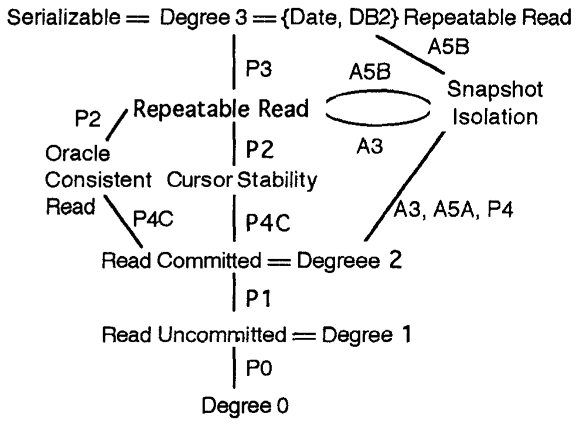

# A Critique of ANSI SQL Isolation Levels（中文译文）

## 译者说明

本文依据同目录的 `source.pdf` 翻译。章节、图表、公式、算法、代码与参考文献按原文结构保留。

## 作者与单位

| 撰写者 | 单位 | 电子邮件 |
| --- | --- | --- |
| Hal Berenson | Microsoft Corp. | haroldb@microsoft.com |
| Phil Bernstein | Microsoft Corp. | philbe@microsoft.com |
| Jim Gray | U.C. Berkeley | gray@crl.com |
| Jim Melton | Sybase Corp. | jim.melton@sybase.com |
| Elizabeth O’Neil | UMass/Boston | eoneil@cs.umb.edu |
| Patrick O’Neil | UMass/Boston | poneil@cs.umb.edu |

## 出版与复制许可

本文发表于 SIGMOD '95（美国加利福尼亚州圣何塞），版权 © 1995 ACM，编号 0-89791-731-6/95/0005，定价 3.50 美元。

允许免费复制本文全部或部分内容，前提是副本不为直接商业利益而制作或分发，并且保留 ACM 版权声明、出版物标题及日期，同时注明复制已获美国计算机协会许可。用于其他目的的复制或再版，需要支付费用和/或取得明确许可。

## 摘要

ANSI SQL-92 [MS, ANSI] 通过三种现象定义隔离级别：脏读、不可重复读和幻读。本文指出，这些现象和 ANSI SQL 定义不能正确刻画若干流行的隔离级别，包括标准的锁实现。本文考察现象表述中的含混之处，得到一种更形式化的表述，并提出能够更好刻画隔离类型的新现象。最后，本文定义一种重要的多版本隔离类型，称为快照隔离。

## 1. 引言

让并发事务采用不同隔离级别，使应用设计者可以在正确性与并发性、吞吐量之间取舍。较低隔离级别以允许事务观察模糊或错误的数据库状态为代价，提高事务并发度。令人惊讶的是，一些事务可以按最高隔离级别，即完全可串行化，执行；与此同时，以较低隔离级别运行的事务仍可能访问尚未提交的状态，或访问晚于该高隔离事务先前所读状态的状态 [GLPT]。低隔离级别事务当然可能产生无效数据，应用设计者必须防止后来以较高隔离级别运行的事务访问这些无效数据并传播错误。

ANSI/ISO SQL-92 规范 [MS, ANSI] 定义了四个隔离级别：READ UNCOMMITTED（读未提交）、READ COMMITTED（读已提交）、REPEATABLE READ（可重复读）和 SERIALIZABLE（可串行化）。它用经典可串行化定义，再加三种禁止出现的操作子序列来定义这些级别，并把这些子序列称为“现象”：Dirty Read（脏读）、Non-repeatable Read（不可重复读）和 Phantom（幻读）。ANSI 规范没有明确定义“现象”，但暗示它是可能导致异常行为，也许是不可串行化行为的操作子序列。我们为补充 ANSI 现象而提出的情形称为“异常”。后文会说明两者在技术上有区别，但理解全文的一般论点并不依赖这一区别。

ANSI 隔离级别与锁调度器的行为有关。有些锁调度器允许事务改变锁请求的范围和持续时间，从而偏离纯粹的两阶段锁。Gray、Lorie、Putzolu 和 Traiger（GLPT）最早提出这一思想，并分别用锁、数据流图和异常三种方式定义一致性度。用现象或异常定义隔离级别，本意是让 SQL 标准也能容纳非锁实现。

我们指出，用异常定义隔离级别存在多项弱点。三个 ANSI 现象含义模糊，即使按最宽松的方式解释，仍不能排除执行历史中的某些异常行为，因而会产生违反直觉的结果。尤其是，基于锁的隔离级别与同名 ANSI 级别具有不同性质，而商业数据库系统通常恰好使用锁实现。此外，ANSI 现象也不能区分商业系统中流行的多种隔离行为。本文将提出额外现象来刻画这些隔离级别。

第 2 节介绍隔离级别的基本术语，并定义 ANSI SQL 隔离级别和锁隔离级别。第 3 节考察 ANSI 级别的缺陷并提出新现象，还把 ANSI SQL 级别映射到 GLPT 于 1977 年定义的一致性度，并涵盖 Date 对 Cursor Stability 和 Repeatable Read 的定义 [DAT]。把各级别放进统一框架，可以减少独立术语造成的误解。第 4 节介绍快照隔离这种多版本并发控制机制：它避开 ANSI SQL 现象，却不可串行化；作为一种介于 READ COMMITTED 与 REPEATABLE READ 之间的较低隔离级别方案，它本身也值得研究。长版论文 [OOBBGM] 给出的新形式体系，把多版本数据的较低隔离级别连接到经典的单版本锁可串行化理论。

原文引言随后称“第 5 节”将用新异常区分第 3、4 节的隔离级别，并指出本文扩展的 ANSI SQL 现象仍不足以刻画 Snapshot Isolation 和 Cursor Stability；它又称“第 6 节”给出总结与结论。但本 PDF 可见正文实际只有第 1 至第 5 节，新异常位于第 4 节，总结与结论为第 5 节。本文按可见章节结构保留正文，不补造第 6 节。

## 2. 隔离定义

### 2.1 可串行化概念

事务和锁的概念在文献 [BHG, PAP, PON, GR] 中已有完整说明，下面只回顾我们使用的术语。事务把一组操作组织起来，使数据库从一个一致状态变换到另一个一致状态。历史（history）把一组事务交错执行的读写操作（写包括插入、更新和删除）建模为一个线性次序。两个不同事务的操作若访问同一数据项，并且至少有一个操作是写，就发生冲突。这里的“数据项”应作宽泛理解：它可能是行、页中的空间、整张表或队列中的消息等通信对象。冲突操作既可能发生在单个数据项上，也可能发生在谓词锁覆盖的数据项集合上。

一个历史的依赖图以已经提交的事务为节点。如果事务 $T_1$ 的某个操作与事务 $T_2$ 的某个较晚操作冲突，就在图中加入从 $T_1$ 到 $T_2$ 的边。两个历史若包含相同的已提交事务，并且拥有相同的依赖图，就称为等价。若一个历史等价于某个串行历史，则它是可串行化历史。

### 2.2 ANSI SQL 隔离级别

ANSI SQL 的设计者希望得到一种能够容纳多种实现、而不只限于锁实现的定义。为此，他们用下面三种现象定义隔离：

ANSI SQL 以英文描述了下列三种现象：

- **P1：脏读（Dirty Read）。** 事务 $T_1$ 修改一个数据项；事务 $T_2$ 在 $T_1$ 提交或回滚之前读到该数据项；随后 $T_1$ 回滚，于是 $T_2$ 读到的是一个从未提交、因而从未真正存在过的值。
- **P2：不可重复读或模糊读（Non-repeatable/Fuzzy Read）。** 事务 $T_1$ 读取一个数据项；事务 $T_2$ 修改或删除该数据项并提交；如果 $T_1$ 随后再次读取该项，它会得到改变后的值，或发现该项已经被删除。
- **P3：幻读（Phantom）。** 事务 $T_1$ 读取满足某个搜索条件的数据项集合；事务 $T_2$ 创建满足该条件的数据项并提交；如果 $T_1$ 随后以相同搜索条件再次读取，就会得到不同的数据项集合。

这些现象都不可能出现在串行历史中，因此根据可串行化定理，也不可能出现在可串行化历史中 [EGLT, BHG 定理 3.6, GR 第 7.5.8.2 节, PON 定理 9.4.2]。

由读、写、提交和中止组成的历史可以用简写表示。我们用 $w_1[x]$ 表示事务 1 写数据项 $x$，用 $r_2[x]$ 表示事务 2 读 $x$。 $r_1[P]$ 表示读取所有满足谓词 $P$ 的数据项， $w_1[P]$ 表示某次写影响谓词 $P$ 所选集合。 $c_1$ 和 $a_1$ 分别表示事务 1 提交和中止。省略号表示两项操作在历史中的先后位置，中间可以有其他操作。

ANSI 对 P1 的文字可以有两种解释。严格解释要求实际发生一次脏读异常：

$$
w_1[x]\thickspace{}\ldots\thickspace{}r_2[x]\thickspace{}\ldots\thickspace{}(a_1\text{ 与 }c_2\text{ 以任一顺序出现}) \qquad \text{(2.1)}
$$

较宽松的解释则禁止一旦发生脏读就继续形成的所有历史，不论两个事务最终提交还是中止：

$$
w_1[x]\thickspace{}\ldots\thickspace{}r_2[x]\thickspace{}\ldots\thickspace{}((c_1\text{ 或 }a_1)\text{ 与 }(c_2\text{ 或 }a_2)\text{ 以任一顺序出现}) \qquad \text{(2.2)}
$$

式 (2.2) 禁止四种提交-中止组合，而式 (2.1) 只禁止其中两种。宽松定义指出一种可能导致异常的交错，严格定义则要求异常实际发生。为避免混淆，我们把宽松形式继续记作 P1，把严格异常记作 A1：

$$
\begin{aligned}
P1:&\quad w_1[x]\thickspace{}\ldots\thickspace{}r_2[x]\thickspace{}\ldots\thickspace{}((c_1\text{ 或 }a_1)\text{ 与 }(c_2\text{ 或 }a_2)\text{ 以任一顺序出现})\\
A1:&\quad w_1[x]\thickspace{}\ldots\thickspace{}r_2[x]\thickspace{}\ldots\thickspace{}(a_1\text{ 与 }c_2\text{ 以任一顺序出现})
\end{aligned}
$$

类似地，P2、A2、P3 和 A3 可写成：

$$
\begin{aligned}
P2:&\quad r_1[x]\thickspace{}\ldots\thickspace{}w_2[x]\thickspace{}\ldots\thickspace{}((c_1\text{ 或 }a_1)\text{ 与 }(c_2\text{ 或 }a_2)\text{ 以任一顺序出现})\\
A2:&\quad r_1[x]\thickspace{}\ldots\thickspace{}w_2[x]\thickspace{}\ldots\thickspace{}c_2\thickspace{}\ldots\thickspace{}r_1[x]\thickspace{}\ldots\thickspace{}c_1\\
P3:&\quad r_1[P]\thickspace{}\ldots\thickspace{}w_2[y\in P]\thickspace{}\ldots\thickspace{}((c_1\text{ 或 }a_1)\text{ 与 }(c_2\text{ 或 }a_2)\text{ 以任一顺序出现})\\
A3:&\quad r_1[P]\thickspace{}\ldots\thickspace{}w_2[y\in P]\thickspace{}\ldots\thickspace{}c_2\thickspace{}\ldots\thickspace{}r_1[P]\thickspace{}\ldots\thickspace{}c_1
\end{aligned}
$$

ANSI 对 P3 的文字只提到插入；我们有意把所有能够影响谓词结果的写都纳入 P3，包括插入、删除和更新。

本文稍后会讨论多值历史（multi-valued history，简称 MV-history；见 [BHG] 第 5 章）。在多版本系统中，同一数据项可以同时存在多个版本，每次读都必须明确选择所读版本；在更常见的单值历史（SV-history）中，每次读只能得到最近一次写出的版本。尽管已有工作尝试把 ANSI 隔离定义同时联系到多版本系统和标准锁调度器下的单版本系统，ANSI 对 P1、P2、P3 的英文表述仍隐含采用单版本历史。我们先按这种含义讨论，稍后再显式分析多版本系统。

**表 1：用三个原始现象定义的 ANSI SQL 隔离级别**

| 隔离级别 | P1（或 A1）脏读 | P2（或 A2）模糊读 | P3（或 A3）幻读 |
| --- | --- | --- | --- |
| ANSI READ UNCOMMITTED | 可能 | 可能 | 可能 |
| ANSI READ COMMITTED | 不可能 | 可能 | 可能 |
| ANSI REPEATABLE READ | 不可能 | 不可能 | 可能 |
| ANOMALY SERIALIZABLE | 不可能 | 不可能 | 不可能 |

表 1 常被当作 ANSI 四个隔离级别的完整定义，但标准并非只用三种现象定义 SERIALIZABLE。ANSI SQL 子条款 4.28 还明确要求 SERIALIZABLE 提供通常所称的“完全可串行化执行”。表格远比这项附加条件醒目，因而人们常误以为排除三个现象就能推出可串行化。我们把只排除三个现象的级别称为 ANOMALY SERIALIZABLE。

宽松现象出现在更多历史中，所以禁止宽松形式，会比禁止严格形式排除更多历史，即定义出更强的隔离级别。我们在第 3 节主张采用 P1、P2、P3 的宽松形式，也就是主张限制更严的隔离级别；但我们还会说明，即使全部禁止这些现象，仍不能保证真正可串行化。ANSI 本可以直接删除 P3，仅用子条款 4.28 定义 SERIALIZABLE。表 1 不是最终结果，第 3 节的表 3 将取代它。

### 2.3 锁

多数 SQL 产品采用基于锁的隔离。因此，尽管这样刻画会产生一些问题，仍有必要从锁的角度描述 ANSI SQL 隔离级别。

读锁也称共享锁，写锁也称排他锁。锁既可以施加在单个数据项上，也可以施加在谓词上。如果两个锁覆盖同一数据项，并且至少有一个是写锁，它们就冲突。谓词锁不仅覆盖目前满足谓词的数据项，还覆盖将来若被插入或更新便会满足该谓词的“幻影”数据项，因而可能覆盖一个无限集合；单个数据项锁可视为一个只选择该记录的谓词锁。

如果每次写操作之前都先申请相应的写锁，该事务具有**良构写**；如果每次读操作之前都先申请相应的读锁，该事务具有**良构读**。同时满足两者的事务称为良构事务。

如果事务一旦释放某种类型的锁，就不再取得该类型的新锁，则其读或写满足相应的**两阶段**要求。如果事务一旦释放任何锁，就不再取得任何新锁，它采用**两阶段锁**。锁若一直持有到事务提交或中止，称为长时锁；否则称为短时锁，通常在对应操作后立即释放。冲突锁请求必须等待已有锁释放。

并发控制的基本定理是：由良构、采用两阶段锁的事务组成的历史是可串行化的。反过来，除退化情形外，不良构或不遵循两阶段规则的事务可能产生不可串行化历史 [EGLT]。

GLPT 试图分别用锁、依赖关系和异常定义四种一致性度。其异常定义过于含糊，后来一直受到批评 [GR]；经受住时间检验的是用历史、依赖图或锁给出的数学定义。表 2 按锁的范围（数据项或谓词）、模式（读或写）和持续时间（短或长）汇总这些协议。

**表 2：一致性度和基于锁的隔离级别**

| 一致性级别／锁隔离级别 | 数据项与谓词上的读锁（除特别说明外，两者相同） | 数据项与谓词上的写锁（两者始终相同） |
| --- | --- | --- |
| Degree 0 | 不要求 | 良构写 |
| Degree 1 = Locking READ UNCOMMITTED | 不要求 | 良构写；长时写锁 |
| Degree 2 = Locking READ COMMITTED | 良构读；短时读锁（数据项与谓词） | 良构写；长时写锁 |
| Cursor Stability（见 4.1 节） | 良构读；当前游标项的读锁持续到游标移动；谓词读锁为短时锁 | 良构写；长时写锁 |
| Locking REPEATABLE READ | 良构读；数据项读锁为长时锁；谓词读锁为短时锁 | 良构写；长时写锁 |
| Degree 3 = Locking SERIALIZABLE | 良构读；长时读锁（数据项与谓词） | 良构写；长时写锁 |

我们认为，Locking READ UNCOMMITTED、Locking READ COMMITTED、Locking REPEATABLE READ 和 Locking SERIALIZABLE 正是 ANSI 各级别原本意图对应的锁定义；但下文会说明，它们与表 1 的同名级别相当不同，因此必须用 “Locking” 前缀把锁定义和基于 ANSI 现象的定义区分开。GLPT 的 Degree 0 允许脏读和脏写，但要求单个写操作具有原子性。Degree 1、2、3 分别对应 Locking READ UNCOMMITTED、Locking READ COMMITTED 和 Locking SERIALIZABLE；GLPT 没有与 Locking REPEATABLE READ 完全相符的度。

Date 和 IBM 文档中的“Repeatable Reads”实际表示可串行化或 Locking SERIALIZABLE [DAT, DB2]，它被用作比 GLPT 的“Degree 3 isolation”更易理解的同义名称。ANSI 对 REPEATABLE READ 的定义不同，我们认为这一术语选择很不幸：ANSI 明确不排除 P3，而按 P3 的定义，读取结果恰恰不可重复。我们为了与 ANSI 平行，仍在表 2 中沿用 Locking REPEATABLE READ 这个误称。Date 还把加入防止游标丢失更新保护的 Degree 2 命名为 Cursor Stability（游标稳定性），第 4.1 节会讨论它。

为了比较隔离类型，定义如下。如果所有服从 $L_2$ 的不可串行化历史也服从 $L_1$，并且至少存在一个 $L_1$ 允许而 $L_2$ 不允许的不可串行化历史，则称 $L_1$ **弱于** $L_2$，记作 $L_1\ll L_2$。若两者允许同一组不可串行化历史，则它们**等价**，记作 $L_1\mathrel{==}L_2$。若 $L_1\ll L_2$ 或 $L_1\mathrel{==}L_2$，则称 $L_1$ 不强于 $L_2$，记作 $L_1\mathrel{\text{≪̲}}L_2$（原文为带下划线的双小于号）。如果两种隔离各自允许至少一个被另一方禁止的不可串行化历史，则它们**不可比**，记作 $L_1\mathrel{\gg\ll}L_2$。比较时，我们只按两者各自允许的不可串行化历史加以区分；两个级别也可能允许不同的可串行化历史，但我们不借此区分它们。例如，尽管锁调度器并不接纳所有可能的可串行化历史，我们仍记作 $\text{Locking SERIALIZABLE}\mathrel{==}\text{Serializable}$。禁止过多可串行化历史可能让一种隔离实现不实用，但我们不在此讨论这一问题。

**评注 1。** 表 2 的锁协议满足：

$$
\text{Locking READ UNCOMMITTED}
\ll \text{Locking READ COMMITTED}
\ll \text{Locking REPEATABLE READ}
\ll \text{Locking SERIALIZABLE}.
$$

下一节，我们将集中比较 ANSI 定义与锁定义。

## 3. 分析 ANSI SQL 隔离级别

**评注 2。** 表 2 中每一种锁协议，至少都和表 1 中相应的 ANSI 隔离级别一样强。证明见 [OOBBGM]。

但是，这些锁协议会禁止一些表 1 没有排除的历史。即便在最低级别也是如此：Locking READ UNCOMMITTED 用长时写锁避免了一种我们称为“脏写”的现象，而 ANSI SQL 的异常式定义在 ANSI SERIALIZABLE 以下都没有排除它。

**P0：脏写（Dirty Write）。** 事务 $T_1$ 修改一个数据项；在 $T_1$ 提交或回滚之前，事务 $T_2$ 又修改同一数据项。如果 $T_1$ 或 $T_2$ 随后回滚，就无法明确判断正确的数据值应当是什么。其宽松形式是：

$$
P0:\quad w_1[x]\thickspace{}\ldots\thickspace{}w_2[x]\thickspace{}\ldots\thickspace{}((c_1\text{ 或 }a_1)\text{ 与 }(c_2\text{ 或 }a_2)\text{ 以任一顺序出现}).
$$

脏写会破坏数据库约束。例如，设约束为 $x=y$，考虑历史：

$$
w_1[x]\thickspace{}w_2[x]\thickspace{}w_2[y]\thickspace{}c_2\thickspace{}w_1[y]\thickspace{}c_1.
$$

若 $T_1$ 把两个值都改为 1，而 $T_2$ 把两个值都改为 2，最后可能得到 $x=2,y=1$，从而违反约束。脏写还会破坏自动事务回滚。在 $w_1[x]\thickspace{}w_2[x]\thickspace{}a_1$ 中，若 $T_1$ 中止时恢复自己写入前的旧值，它会错误地抹掉 $T_2$ 的更新；但若不恢复，而 $T_2$ 随后也中止，系统又无法用 $T_2$ 的旧映像正确撤销它。因此，即便最弱的锁系统也持有长时写锁，否则恢复系统会失效 [GLPT, BHG]。

**评注 3。** ANSI SQL 的全部隔离级别都应禁止 P0。

下面我们论证，若严格按 ANSI 文字要求异常实际发生，A1、A2 和 A3 仍不足以表达常见锁隔离。先回顾三种严格解释：

$$
\begin{aligned}
A1:&\quad w_1[x]\thickspace{}\ldots\thickspace{}r_2[x]\thickspace{}\ldots\thickspace{}(a_1\text{ 与 }c_2\text{ 以任一顺序出现})\\
A2:&\quad r_1[x]\thickspace{}\ldots\thickspace{}w_2[x]\thickspace{}\ldots\thickspace{}c_2\thickspace{}\ldots\thickspace{}r_1[x]\thickspace{}\ldots\thickspace{}c_1\\
A3:&\quad r_1[P]\thickspace{}\ldots\thickspace{}w_2[y\in P]\thickspace{}\ldots\thickspace{}c_2\thickspace{}\ldots\thickspace{}r_1[P]\thickspace{}\ldots\thickspace{}c_1.
\end{aligned}
$$

按表 1，READ COMMITTED 禁止 A1，REPEATABLE READ 禁止 A1 和 A2，SERIALIZABLE 禁止 A1、A2、A3。考虑历史 H1：

$$
\begin{aligned}
H1:\quad &r_1[x=50]\thickspace{}w_1[x=10]\thickspace{}r_2[x=10]\thickspace{}r_2[y=50]\thickspace{}c_2\\
&r_1[y=50]\thickspace{}w_1[y=90]\thickspace{}c_1.
\end{aligned}
$$

这里 $T_1$ 把 40 从 $x$ 转到 $y$，维持总额 100； $T_2$ 却读到转账中间状态 $x=10,y=50$，总额只有 60。这个历史不可串行化，但它不违反 A1，因为 $T_1$ 最终提交；也不违反 A2 或 A3。宽松的 P1 会禁止它，因为 $T_2$ 读到了 $T_1$ 尚未提交的写：

$$
P1:\quad w_1[x]\thickspace{}\ldots\thickspace{}r_2[x]\thickspace{}\ldots\thickspace{}((c_1\text{ 或 }a_1)\text{ 与 }(c_2\text{ 或 }a_2)\text{ 以任一顺序出现}).
$$

H1 的确违反 P1。因此，我们应当把 P1 而不是 A1 视为 ANSI 的本意；宽松解释才是正确解释。

再考虑 H2：

$$
\begin{aligned}
H2:\quad &r_1[x=50]\thickspace{}r_2[x=50]\thickspace{}w_2[x=10]\thickspace{}r_2[y=50]\thickspace{}w_2[y=90]\thickspace{}c_2\\
&r_1[y=90]\thickspace{}c_1.
\end{aligned}
$$

原文紧随公式的说明称“ $T_2$ 看到总额 140”，后面又称“若 $T_2$ 再读 $x$”；但 H2 的可见操作序列是 $T_1$ 先读 $x=50$、后读 $y=90$，按 A2 公式也应由 $T_1$ 再读 $x$，因此原文两处事务编号都与公式内部矛盾。按公式， $T_1$ 读到 $x=50,y=90$，同样是一个不一致状态。该历史满足 P1，因为没有读取未提交数据，却违反宽松 P2： $T_1$ 读过的 $x$ 在其结束前被 $T_2$ 写过。严格 A2 要求 $T_1$ 再次读取同一项，因此抓不到 H2。采用宽松解释后：

$$
P2:\quad r_1[x]\thickspace{}\ldots\thickspace{}w_2[x]\thickspace{}\ldots\thickspace{}((c_1\text{ 或 }a_1)\text{ 与 }(c_2\text{ 或 }a_2)\text{ 以任一顺序出现}).
$$

原文接着说，采用 P2 后， $w_2[x=20]$ 覆盖 $r_1[x=50]$ 时 H2 会被排除；其中 20 又与 H2 公式里的 $w_2[x=10]$ 不一致，但不影响 P2 对该操作次序的判定。

H3 展示严格幻读定义的类似缺陷：

$$
A3:\quad r_1[P]\thickspace{}\ldots\thickspace{}w_2[y\in P]\thickspace{}\ldots\thickspace{}c_2\thickspace{}\ldots\thickspace{}r_1[P]\thickspace{}\ldots\thickspace{}c_1.
$$

$$
H3:\quad r_1[P]\thickspace{}w_2[\text{向 }P\text{ 插入 }y]\thickspace{}r_2[z]\thickspace{}w_2[z]\thickspace{}c_2\thickspace{}r_1[z]\thickspace{}c_1.
$$

设 $P$ 选择全部在职员工，而 $z$ 是员工总数。 $T_1$ 先取得员工集合， $T_2$ 插入一名员工并更新 $z$ 后提交，随后 $T_1$ 读到新的 $z$。员工集合与计数不再一致。由于 $T_1$ 没有第二次求值谓词，严格 A3 允许这个历史；宽松 P3 会禁止它：

$$
P3:\quad r_1[P]\thickspace{}\ldots\thickspace{}w_2[y\in P]\thickspace{}\ldots\thickspace{}((c_1\text{ 或 }a_1)\text{ 与 }(c_2\text{ 或 }a_2)\text{ 以任一顺序出现}).
$$

**评注 4。** 三种 ANSI 现象都应采用宽松解释 P1、P2 和 P3，而不是严格异常 A1、A2 和 A3。下文我们假定这就是 ANSI 的本意。

**评注 5。** ANSI SQL 的隔离现象并不完整，仍有多种异常可能发生。要完整定义锁行为，必须定义新的现象；P3 也必须重新表述。在下面的定义中，事务 2 的最终提交或中止不会进一步限制历史，因而我们删去对 $(c_2\text{ 或 }a_2)$ 的引用：

$$
\begin{aligned}
P0:&\quad w_1[x]\thickspace{}\ldots\thickspace{}w_2[x]\thickspace{}\ldots\thickspace{}(c_1\text{ 或 }a_1)\\
P1:&\quad w_1[x]\thickspace{}\ldots\thickspace{}r_2[x]\thickspace{}\ldots\thickspace{}(c_1\text{ 或 }a_1)\\
P2:&\quad r_1[x]\thickspace{}\ldots\thickspace{}w_2[x]\thickspace{}\ldots\thickspace{}(c_1\text{ 或 }a_1)\\
P3:&\quad r_1[P]\thickspace{}\ldots\thickspace{}w_2[y\in P]\thickspace{}\ldots\thickspace{}(c_1\text{ 或 }a_1).
\end{aligned}
$$

我们的 P3 把所有影响谓词结果的写都包括在内，而 ANSI 的原始文字只明确提到插入；有些解释也会把更新算进去。

表 3 给出用这些现象定义的修正版 ANSI SQL 隔离级别。

**表 3：用四种现象定义的 ANSI SQL 隔离级别**

| 隔离级别 | P0 脏写 | P1 脏读 | P2 模糊读 | P3 幻读 |
| --- | --- | --- | --- | --- |
| READ UNCOMMITTED | 不可能 | 可能 | 可能 | 可能 |
| READ COMMITTED | 不可能 | 不可能 | 可能 | 可能 |
| REPEATABLE READ | 不可能 | 不可能 | 不可能 | 可能 |
| SERIALIZABLE | 不可能 | 不可能 | 不可能 | 不可能 |

P0 至 P3 实质上是锁行为的另一种表达。禁止 P0 对应长时写锁；禁止 P1 对应读操作不能越过未提交写；禁止 P2 对应对已读数据项持有长时读锁；禁止 P3 对应对谓词范围持有长时读锁。因此表 3 的各级别和表 2 相应的锁级别允许相同的不可串行化历史。

**评注 6。** 表 2 的锁隔离级别与表 3 的现象式定义等价。换言之，P0、P1、P2、P3 是对锁行为的变相重述。下文我们将使用表 3 中修正后的名称，它们等价于表 2 的锁版本；当我们特指原始且不充分、没有纳入 P0 的表 1 定义时，使用 ANSI READ UNCOMMITTED、ANSI READ COMMITTED、ANSI REPEATABLE READ 和 ANOMALY SERIALIZABLE 等名称。

下一节说明，多种商业化隔离实现提供了位于 READ COMMITTED 与 REPEATABLE READ 之间的隔离级别。为了有意义地区分这些实现，我们将以 P0、P1 为基础，再加入新的区分性现象。原文这里和第 1 节都把相关级别概括为“位于两者之间”，但第 4.2 节的评注 9 又明确判定 Snapshot Isolation 与 REPEATABLE READ 不可比；本文保留这一内部张力。

## 4. 其他隔离类型

### 4.1 游标稳定性

READ COMMITTED 允许一种常见的丢失更新异常。

**P4：丢失更新（Lost Update）。** 事务 $T_1$ 读取数据项 $x$；另一个事务 $T_2$ 写 $x$（该写可能基于它先前的一次读取）；随后 $T_1$ 根据它先前读到的值写 $x$ 并提交：

$$
P4:\quad r_1[x]\thickspace{}\ldots\thickspace{}w_2[x]\thickspace{}\ldots\thickspace{}w_1[x]\thickspace{}\ldots\thickspace{}c_1.
$$

例如：

$$
H4:\quad r_1[x=100]\thickspace{}r_2[x=100]\thickspace{}w_2[x=120]\thickspace{}c_2\thickspace{}w_1[x=130]\thickspace{}c_1.
$$

两个事务都在原值 100 上增加金额； $T_2$ 的更新 120 被 $T_1$ 最后的 130 覆盖，最终值只保留了 $T_1$ 增加的 30。READ COMMITTED 允许 P4：禁止 P0 只要求先写事务在后续写之前提交，而 P1 只会排除先写后读的次序，这两者都不排除 H4；P2 则会阻止它。

Cursor Stability（游标稳定性）是许多系统为减少这种问题而提供的隔离级别。游标取数读记作 $r_c$，游标定位更新记作 $w_c$。游标读在当前记录上取得读锁，并一直持有到游标移动、游标关闭或事务结束；通过游标更新该记录时，写锁为长时锁，一直持有到事务提交，即使后续 Fetch 已把游标移开也不会提前释放。谓词读仍只持有短时锁。

游标稳定性因此禁止“游标丢失更新”：

$$
P4C:\quad r _ {c1}[x]\thickspace{}\ldots\thickspace{}w_2[x]\thickspace{}\ldots\thickspace{}w_1[x]\thickspace{}\ldots\thickspace{}c_1.
$$

原文正文把游标定位更新记作 $w _ {c1}[x]$，并说明 $r _ {c1}[x]$ 后的 $w _ {c1}[x]$ 会排除中间的 $w_2[x]$；但紧随其后的 P4C 公式实际写作普通 $w_1[x]$。这里分别按原文保留两种记号。

**评注 7。** 隔离强度满足：

$$
\text{READ COMMITTED}\ll\text{Cursor Stability}\ll\text{REPEATABLE READ}.
$$

游标稳定性被 SQL 系统广泛实现，用来防止通过游标读取的行发生丢失更新。在一些系统中，名为 READ COMMITTED 的级别实际是更强的 Cursor Stability；ANSI 标准允许这种实现。

要同时稳定多个数据项，可以在每项上各放一个游标，代价是使用多个游标。这样，对于只访问少量固定数据项的事务，程序员可以把 Cursor Stability 提升为实际等效的 Locking REPEATABLE READ；但这种方法既不方便，也完全不具一般性，普通读产生的 P4 以及更一般的 P2 历史仍可能发生。

### 4.2 快照隔离

Snapshot Isolation（快照隔离）是一种多版本并发控制。事务总是从它开始时刻的已提交数据快照读取，该时刻称为 Start-Timestamp（开始时间戳）；这个时间可以是事务第一次读取之前的任意时刻。只要系统能保留该时间戳对应的快照数据，事务读取就不会阻塞。事务自己的更新、插入和删除也会反映在这个快照中，因而再次读取或更新同一数据时能看到自己的写；Start-Timestamp 之后活动的其他事务所做更新则不可见。

快照隔离扩展了 [BHG] 描述的 Multiversion Mixed Method，后者只允许只读事务执行快照读取。

事务尝试提交时取得 Commit-Timestamp（提交时间戳），它大于此前任何 Start-Timestamp 或 Commit-Timestamp。系统采用“先提交者获胜”（First-Committer-Wins）规则：如果存在另一个事务 $T_2$，它的提交时间戳落在 $T_1$ 的开始与提交之间，并且它写过 $T_1$ 也写过的数据项，则 $T_1$ 必须中止；否则 $T_1$ 可以提交。已提交写只对开始时间戳晚于其提交时间戳的事务可见。该规则阻止 P4 丢失更新。

快照隔离是多版本方法，单值历史不能充分反映它的时间操作序列：任意时刻，同一数据项都可能有由活跃事务和已提交事务创建的多个版本，事务的读必须选择适当版本。前面的 H1 在快照隔离下会成为：

$$
\begin{aligned}
H1.SI:\quad &r_1[x_0=50]\thickspace{}w_1[x_1=10]\thickspace{}r_2[x_0=50]\thickspace{}r_2[y_0=50]\thickspace{}c_2\\
&r_1[y_0=50]\thickspace{}w_1[y_1=90]\thickspace{}c_1.
\end{aligned}
$$

这里 $T_2$ 读到一致的旧快照，而不是 $T_1$ 的未提交数据。H1.SI 的多版本数据流是可串行化的；它在视图上等价于单版本历史：

$$
H1.SI.SV:\quad r_1[x=50]\thickspace{}r_1[y=50]\thickspace{}r_2[x=50]\thickspace{}r_2[y=50]\thickspace{}c_2\thickspace{}w_1[x=10]\thickspace{}w_1[y=90]\thickspace{}c_1.
$$

我们在 [OOBBGM] 中证明，所有快照隔离历史都能在保持数据流依赖的前提下映射为单版本历史；多版本历史与相应单版本历史称为视图等价。这种映射是把快照隔离放入隔离强度层次所需的严格判据。

然而，快照隔离总体上仍不保证可串行化：事务读取的是某一时刻的数据库，却在另一个时刻写入。考虑 H5：

$$
\begin{aligned}
H5:\quad &r_1[x=50]\thickspace{}r_1[y=50]\thickspace{}r_2[x=50]\thickspace{}r_2[y=50]\\
&w_1[y=-40]\thickspace{}w_2[x=-40]\thickspace{}c_1\thickspace{}c_2.
\end{aligned}
$$

这里我们假定，每个写入 $x$ 和 $y$ 新值的事务都应保持约束 $x+y$ 为正。两个事务都从满足约束的快照开始，各自修改不同的数据项，因此 First-Committer-Wins 不会令任何一个中止；最终却得到 $x+y=-80$，违反约束。

把这种情形一般化，单个数据库通常要同时满足跨多个数据项的约束，例如键唯一性、引用完整性或两个表中行副本的一致性。这些约束共同构成数据库不变式谓词 $C(DB)$：数据库状态一致时它为真，否则为假。事务必须保持该谓词；如果数据库在事务开始时一致，那么事务提交时也必须保持一致。如果事务读到一个违反该谓词的数据库状态，就遭遇了约束违反并发异常。Date [DAT] 把这类问题称为“不一致分析”。以下现象描述数据项约束被并发事务破坏。

**A5：数据项约束违反（Data Item Constraint Violation）。** 两个事务各自读取一组相关数据，并据此更新其中互不冲突的部分；它们单独执行时都保持 $C(DB)$，并发提交后的合并结果却违反 $C(DB)$。A5 有两个有用的具体形式。

**A5A：读偏斜（Read Skew）。** $T_1$ 读 $x$； $T_2$ 更新相互关联的 $x$ 和 $y$ 并提交；随后 $T_1$ 读 $y$，于是看到一新一旧的两个值。用历史表示，我们得到如下异常：

$$
A5A:\quad r_1[x]\thickspace{}\ldots\thickspace{}w_2[x]\thickspace{}\ldots\thickspace{}w_2[y]\thickspace{}\ldots\thickspace{}c_2\thickspace{}\ldots\thickspace{}r_1[y]\thickspace{}\ldots\thickspace{}(c_1\text{ 或 }a_1).
$$

**A5B：写偏斜（Write Skew）。** 原文文字先描述 $T_1$ 读取满足 $C()$ 的 $x$ 和 $y$，随后 $T_2$ 读取 $x$ 和 $y$、写 $x$ 并提交，最后 $T_1$ 写 $y$；若 $x$ 和 $y$ 之间存在约束，结果可能违反它。紧随其后的公式却把 $w_1[y]$ 排在 $w_2[x]$ 之前，并只要求 $c_1$、 $c_2$ 最终都出现，与文字叙述的写入次序不一致。两种交错都体现事务基于共同旧状态、分别写不同数据项的写偏斜；下式按原文保留：

$$
A5B:\quad r_1[x]\thickspace{}\ldots\thickspace{}r_2[y]\thickspace{}\ldots\thickspace{}w_1[y]\thickspace{}\ldots\thickspace{}w_2[x]\thickspace{}\ldots\thickspace{}(c_1\text{ 与 }c_2\text{ 都出现}).
$$

P2 是 $x=y$ 时 A5A 的退化形式；更典型的 A5A 是事务读取两个不同但相关的数据项，例如受引用完整性约束的两个值。A5B 的一个典型银行场景允许单个账户余额为负，但要求共同持有的账户余额总和保持非负；H5 正是这种约束被并发写偏斜破坏的例子。A5 主要用于区分低于 REPEATABLE READ 的隔离类型，因为 P2 本身就会阻止 A5A 和 A5B。基于锁的 REPEATABLE READ 能保护涉及固定数据项的约束，而表 1 中仅由严格 A1、A2 定义的原始 ANSI REPEATABLE READ 未必能做到。

**评注 8。** $\text{READ COMMITTED}\ll\text{Snapshot Isolation}$。快照隔离禁止 P0 和 P1；READ COMMITTED 允许 A5A，而快照隔离不会在同一事务内读到不同时刻的快照，因此禁止 A5A。

按照我们一直采用的单值历史解释，很难直观看出快照隔离历史会怎样违反 P2。严格 A2 不会发生，因为一个事务重复读取同一项时总能得到同一快照版本；但快照隔离允许 A5B，而在该单值历史解释中，禁止 P2 也会阻止 A5B，所以 REPEATABLE READ 不允许这种异常。反过来，快照隔离不会发生严格 A3，因为同一谓词重复读取时快照不变，而 REPEATABLE READ 的短时谓词锁允许 A3。

**评注 9。** $\text{REPEATABLE READ}\mathrel{\gg\ll}\text{Snapshot Isolation}$：两者不可比。

快照隔离虽然没有严格幻读 A3，却并不排除宽松 P3。例如，约束规定某个谓词选出的工作任务总工时不得超过 8 小时。 $T_1$ 查询该谓词，看到总工时只有 7 小时，便插入一个 1 小时的新任务；并发的 $T_2$ 也执行相同操作。两者插入的是不同数据项，可能连索引项也不同，因而 First-Committer-Wins 不会阻止它们，两者都可以提交；但任一等价串行历史都会让后一个事务看到前一个插入，从而出现 P3 并拒绝后一个任务。

**评注 10。** 快照隔离历史排除异常 A1、A2 和 A3。因此，对表 1 中按异常解释的 ANOMALY SERIALIZABLE，有 $\text{ANOMALY SERIALIZABLE}\ll\text{Snapshot Isolation}$。这里的 ANOMALY SERIALIZABLE 不是完全可串行化，后者还受 ANSI 子条款 4.28 的额外要求约束。

多版本系统还可保存很老的时间戳，支持“时间旅行”式查询，并且这种历史读取既不阻塞写，也不被写阻塞。若一个更新事务试图基于过旧快照写入，而较新的事务已经更新过相同数据项，系统会令它中止。商业系统中的快照隔离实例包括 Borland InterBase 4 [THA] 和 Microsoft Exchange 的底层引擎。其实现可追溯到 Reed [REE] 的工作。First-Committer-Wins 必须为每个活跃事务记住所有在其开始时间戳之后提交的更新（或写锁）；若当前事务的更新与这些记录冲突，就中止当前事务。

快照隔离的乐观并发控制对只读事务有明显的并发优势，对更新事务是否有益则仍有争议。长时间运行的更新事务若与高争用的短事务竞争，往往不可能在自己写过的每一项上都成为“最先写入者”（原文此处用 *first writer*，尽管前文机制名为 First-Committer-Wins），因而很可能中止。不过，同一场景也会给锁实现带来真正的问题：长更新事务会长期持锁、拖住短事务；如果解决办法本来就是禁止这类长更新事务，那么快照隔离同样可以接受。当短更新事务彼此冲突很少、长事务多为只读时，快照隔离应当表现良好；当长度相近的事务之间存在高争用时，它体现的是经典乐观方案，其价值仍见仁见智。

### 4.3 其他多版本系统

多版本系统还有其他模型。一些商业产品保留对象版本，但把快照隔离限于只读事务，例如 SQL-92、Rdb 以及其他数据库的 `SET TRANSACTION READ ONLY` [MS, HOB, ORA]；Postgres 和 Illustra [STO, ILL] 长期保留这些版本并提供“时间旅行”查询。另一些系统允许更新事务，却没有 First-Committer-Wins 保护，例如 Oracle Read Consistency [ORA]。

Oracle 的 Read Consistency（读一致性）让每条 SQL 语句看到该语句开始时最近已经提交的数据库值，仿佛事务的 Start-Timestamp 在每条 SQL 语句开始时向前推进。游标集合的成员以打开游标的时刻为准；底层机制按语句时间戳重新构造适当的行版本。行插入、更新和删除由写锁保护，因此采用“先写者获胜”（First-Writer-Wins），而不是 First-Committer-Wins。

Read Consistency 强于 READ COMMITTED，因为它禁止游标丢失更新 P4C；但仍允许不可重复读、普通丢失更新 P4 和读偏斜 A5A。原文在这里把“不可重复读”标为 P3，而本文前面的定义和图 2 均把它标为 P2，二者存在内部编号冲突。Snapshot Isolation 不允许 P4 或 A5A。

仔细考察 SQL 标准可见，它把每条语句定义为原子操作；每条语句开始时都有一个可串行化子事务或时间戳。由此可以设想通过不同方式给语句分配时间戳，形成一组隔离级别层次。例如在 Oracle 中，游标取数沿用打开游标时的时间戳。

## 5. 总结与结论

ANSI SQL 隔离级别的原始定义存在严重问题。三种现象的文字含混且不完整；即使采用宽松解释，标准仍遗漏脏写 P0。评注 5 是我们清理 ANSI 隔离级别的建议，使之与 [GLPT] 的锁隔离级别相等：用 P0 至 P3 的宽松历史模式刻画四个级别。

ANSI 显然希望 REPEATABLE READ 排除除幻读以外的所有异常，但表 1 的异常式定义不能达到这一目的；表 2 的锁定义则能做到。ANSI 选择“Repeatable Read”这个术语有双重不幸：(1) 这种级别的读取不会给出可重复结果；(2) 业界早已用同一术语表示真正的可重复读取，即多个产品中的可串行化。我们建议为这个级别另选一个术语。

第 4 节已经用新现象和异常刻画多种商业系统常见、强度位于 REPEATABLE READ 与 SERIALIZABLE 之间的隔离级别。图 2 展示它们的强弱关系：图中越高的级别越强，连线旁的标签表示区分相连级别的现象或异常。图中假定 ANSI SQL 已按评注 5 和表 3 加强。它没有画出两类内容：其一是以更细粒度、按语句时间戳读取而可能从快照隔离向下延伸出的多版本层次；其二是由原始严格 P1、P2、P3 定义的 ANSI 级别。

**图 2　隔离级别及其关系。** 图中采用评注 5 和表 3 对 ANSI 定义的加强形式。边的标注表示较弱一级允许出现的现象。

表 4 从另一个角度汇总这些隔离类型。“有时可能”表示隔离机制只会阻止该现象的某些形式，例如游标稳定性阻止通过当前游标项形成的丢失更新，但不能阻止普通读形成的全部丢失更新。

**表 4：按可能允许的异常刻画隔离类型**

| 隔离类型 | P0 脏写 | P1 脏读 | P4C 游标丢失更新 | P4 丢失更新 | P2 模糊读 | P3 幻读 | A5A 读偏斜 | A5B 写偏斜 |
| --- | --- | --- | --- | --- | --- | --- | --- | --- |
| READ UNCOMMITTED = Degree 1 | 不可能 | 可能 | 可能 | 可能 | 可能 | 可能 | 可能 | 可能 |
| READ COMMITTED = Degree 2 | 不可能 | 不可能 | 可能 | 可能 | 可能 | 可能 | 可能 | 可能 |
| Cursor Stability | 不可能 | 不可能 | 不可能 | 有时可能 | 有时可能 | 可能 | 可能 | 有时可能 |
| REPEATABLE READ | 不可能 | 不可能 | 不可能 | 不可能 | 不可能 | 可能 | 不可能 | 不可能 |
| Snapshot | 不可能 | 不可能 | 不可能 | 不可能 | 不可能 | 有时可能 | 不可能 | 可能 |
| ANSI SQL SERIALIZABLE = Degree 3 = Date、IBM、Tandem 等所称的 Repeatable Read | 不可能 | 不可能 | 不可能 | 不可能 | 不可能 | 不可能 | 不可能 | 不可能 |

从积极的一面看，过去从未有人系统刻画多版本系统的较低隔离级别，尽管若干产品早已实现它们。许多应用为避免锁争用而使用 Cursor Stability 或 Oracle Read Consistency；对这些应用而言，Snapshot Isolation 比两者表现更好：它避免丢失更新异常，也避免一部分幻读异常（例如 ANSI SQL 所定义的那种），从不阻塞只读事务，而且读者不会阻塞更新者。

## 致谢

我们感谢 Microsoft 的 Chris Larson；感谢 Alan Reiter 指出若干较新的快照隔离异常；感谢 Oracle 的 Franco Putzolu 和 Anil Nori；感谢 Illustra 的 Mike Ubell；并感谢匿名 SIGMOD 审稿人提出改进本文的宝贵建议。Sushil Jajodia、V. Atluri 和 E. Bertino 慷慨地向我们提供了其相关工作 [ABJ] 的早期草稿，该工作讨论多版本历史的较低隔离级别。

## 参考文献

[ANSI] ANSI X3.135-1992. *American National Standard for Information Systems - Database Language - SQL*. 1992 年 11 月。

[ABJ] V. Atluri, E. Bertino, S. Jajodia. “A Theoretical Formulation for Degrees of Isolation in Databases.” Technical Report, George Mason University, Fairfax, VA, 1995.

[BHG] P. A. Bernstein, V. Hadzilacos, N. Goodman. *Concurrency Control and Recovery in Database Systems*. Addison-Wesley, 1987.

[DAT] C. J. Date. *An Introduction to Database Systems*. 第 5 版，Addison-Wesley, 1990.

[DB2] C. J. Date, C. J. White. *A Guide to DB2*. 第 3 版，Addison-Wesley, 1989.

[EGLT] K. P. Eswaran, J. Gray, R. Lorie, I. Traiger. “The Notions of Consistency and Predicate Locks in a Database System.” *CACM*, 19(11):624-633, 1978 年 11 月。

[GLPT] J. Gray, R. Lorie, G. Putzolu, I. Traiger. “Granularity of Locks and Degrees of Consistency in a Shared Data Base.” 收录于 Michael Stonebraker 编 *Readings in Database Systems*, 第 2 版，第 3 章，Morgan Kaufmann, 1994；原文发表于 1977 年。

[GR] J. Gray, A. Reuter. *Transaction Processing: Concepts and Techniques*. 修订后第 2 次印刷，Morgan Kaufmann, 1993，第 7.6 节及后续各节。

[HOB] L. Hobbs, K. England. *Rdb/VMS, A Comprehensive Guide*. Digital Press, 1991.

[ILL] Illustra Information Technologies. *Illustra User’s Guide*. Illustra Information Technologies, Oakland, CA, 1994.

[MS] J. Melton, A. R. Simon. *Understanding The New SQL: A Complete Guide*. Morgan Kaufmann, 1993.

[OOBBGM] P. O’Neil, E. O’Neil, H. Berenson, P. Bernstein, J. Gray, J. Melton. “An Investigation of Transactional Isolation Levels.” UMass/Boston Department of Mathematics and Computer Science Preprint.

[ORA] *PL/SQL User’s Guide and Reference, Version 1.0*. Part 800-V1.0, Oracle Corp., 1989.

[PAP] C. Papadimitriou. *The Theory of Database Concurrency Control*. Computer Science Press, 1986.

[PON] P. O’Neil. *Database: Principles, Programming, Performance*. Morgan Kaufmann, 1994，第 9.5 节。

[REE] D. Reed. “Implementing Atomic Actions On Decentralized Data.” *ACM Transactions on Computer Systems*, 1(1):3-23, 1981.

[STO] M. J. Stonebraker. “The Design of the POSTGRES Storage System.” *Proceedings of the 13th VLDB*, 1987；重印于 M. J. Stonebraker 编 *Readings in Database Systems*, 第 2 版，Morgan Kaufmann, 1994.

[THA] M. Thakur. “Transaction Models in InterBase 4.” *Proceedings of the Borland International Conference*, 1994 年 6 月。
