# Fast Serializable Multi-Version Concurrency Control for Main-Memory Database Systems（中文译文）

## 译者说明

本文依据同目录的 `source.pdf` 翻译。章节、图表、公式、算法、代码与参考文献按原文结构保留。

Thomas Neumann、Tobias Mühlbauer、Alfons Kemper<br>
慕尼黑工业大学（Technische Universität München）<br>
{neumann, muehlbau, kemper}@in.tum.de

SIGMOD’15，2015 年 5 月 31 日至 6 月 4 日，澳大利亚维多利亚州墨尔本。<br>
DOI：[10.1145/2723372.2749436](https://doi.org/10.1145/2723372.2749436)

## 摘要

多版本并发控制（Multi-Version Concurrency Control，MVCC）是一种广泛使用的并发控制机制，因为它支持读者从不阻塞写者的执行方式。然而，大多数系统只实现快照隔离（Snapshot Isolation，SI），而非完整的可串行化。在已有 SI 实现上增加可串行化保证，往往代价高昂，难以承受。

我们提出一种面向内存数据库系统的新型 MVCC 实现。即使保持可串行化保证，与采用单版本并发控制的串行执行相比，它的额外开销也很小。原地更新数据，并把版本以更新前映像增量的形式保存在 undo 缓冲区中，不仅让我们保留了单版本系统的高扫描性能，也构成了我们低成本、细粒度可串行化验证机制的基础。这一新思路改造了精确锁（precision locking）技术，验证最近提交事务的外延式写入是否与正在提交事务的内涵式读取谓词空间相交。实验表明，我们的 MVCC 模型既能非常快速地处理点访问事务，也能处理读密集事务，并且几乎已没有必要再优先选择 SI 而非完整可串行化。

## 分类与主题描述

H.2 [数据库管理]：系统

## 关键词

多版本并发控制；MVCC；可串行化

## 1. 引言

事务隔离是数据库管理系统（DBMS）提供的最基本功能之一。即使存在多个并发用户，它也让用户感觉自己独占整个数据库系统，从而极大简化应用开发。在后台，DBMS 确保产生的并发访问模式是安全的，理想情况下就是可串行化的。

可串行化是很好的概念，但要高效实现却很困难。确保可串行化的一种经典方式是依赖两阶段锁（Two-Phase Locking，2PL）的某个变体 [42]。使用 2PL 时，DBMS 维护读锁和写锁，使有冲突的事务按明确的顺序执行，从而得到可串行化的执行调度。然而，加锁有几个主要缺点。第一，读者和写者会相互阻塞。第二，大多数事务是只读的 [33]，因此从事务排序的角度看是无害的。在基于锁的隔离机制下，更新事务不能修改一个已经被可能长时间运行的读事务读过的数据对象，因而必须等待该读事务结束。这严重限制了系统的并发程度。

多版本并发控制（MVCC）[42, 3, 28] 为这一问题提供了优雅的解决方案。每次更新不再原地更新数据对象，而是为该对象创建一个新版本，使并发读者仍然能看到旧版本，同时更新事务可以并发推进。因此，只读事务永远不必等待，事实上也完全不必使用锁。这一性质极具吸引力，也是许多 DBMS 实现 MVCC 的原因，例如 Oracle、Microsoft SQL Server [8, 23]、SAP HANA [10, 37] 和 PostgreSQL [34]。但是，大多数采用 MVCC 的系统不保证可串行化，只提供更弱的快照隔离（SI）级别。在 SI 下，每个事务看到处于某一状态的数据库，通常是事务开始时最后提交的状态；DBMS 则确保两个并发事务不更新同一个数据对象。尽管 SI 提供了相当好的隔离，仍允许某些不可串行化的调度 [1, 2]。人们往往勉强接受这一点，因为让 SI 具备可串行化保证通常代价高昂 [7]。特别是，已知方案需要跟踪每个事务的完整读集，这会给读密集型负载（例如分析负载）带来巨大开销。尽管如此，我们仍希望检测可串行化冲突，因为它们可能造成静默的数据损坏，进而引发难以发现的程序错误。

本文介绍一种全新的 MVCC 实现方式，无论用于 SI 还是完整可串行化，都非常快速而高效。诚然，我们的 SI 实现更多是精心工程化的结果，而非全新的设计，因为 MVCC 已是人们充分理解的方法，近来又在内存 DBMS 背景下重新受到关注 [23]。然而，精心的工程设计至关重要，因为版本维护的性能会显著影响事务与查询处理。它也是我们低成本可串行化检查的基础：这种检查利用了版本信息的结构。我们还使用带版本记录的位置摘要来保留单版本系统极高的扫描性能，以高效支持分析事务。

具体而言，本文的主要贡献如下：

1. 一种集成到我们高性能混合 OLTP 与 OLAP 内存数据库系统 HyPer [21] 中的新型 MVCC 实现。我们的 MVCC 模型对事务与分析负载都只产生很小的开销，从而为同时支持这两类负载的混合系统提供极快且高效的逻辑事务隔离。
2. 在此基础上，一种为快照隔离（SI）保证可串行化的新方法，在额外空间消耗和验证时间方面既精确又低廉。我们的方法改造了精确锁技术 [42]，不需要显式读锁，却仍比 2PL 允许更高的并发度。
3. 一种基于摘要的方法（VersionedPositions），为当今负载中常见的读密集事务和分析事务 [33] 保留单版本系统的高扫描性能。
4. 大量实验，展示我们 MVCC 实现的高性能及其权衡。

我们的新型 MVCC 实现集成在 HyPer 内存 DBMS [21] 中。HyPer 支持 SQL-92 查询，以及符合 ACID 的事务处理；事务使用一种类似 PL/SQL 的脚本语言定义 [20]。对于查询与事务，HyPer 生成 LLVM 代码，再通过即时编译生成优化后的机器码 [31]。过去，HyPer 依赖单版本并发控制，因此无法高效支持交互式事务和分段事务（sliced transactions），即被分解为多个任务的事务，例如存储过程调用或单条 SQL 语句。由于应用往返延迟等因素，人们希望交错执行这些任务。我们的新型 MVCC 模型能够以出色的性能实现这种逻辑并发，即使保持可串行化保证也是如此。

## 2. MVCC 实现

我们先用一个例子说明 MVCC 模型及其实现，第 3 节再给出可串行化理论的形式化表述与证明。图 1 使用传统银行业务示例来展示版本维护。为简化讨论，数据库只有一张 Accounts 表，包含 Owner 和 Balance 两个属性。为了保留最大的扫描性能，我们没有像 Hekaton [8, 23] 那样在新分配的区域中创建新版本，而是原地更新，并在更新事务的 undo 缓冲区中维护从更新后（但尚未提交）的版本回到被替换版本的反向增量。原地更新数据保留了数据向量的连续性，而这一点对高扫描性能至关重要。位置增量树（positional delta trees，PDT）[15] 旨在使列存储的更新更高效；与其不同，我们不为增量使用复杂的数据结构，以支持较高的并发事务吞吐量。

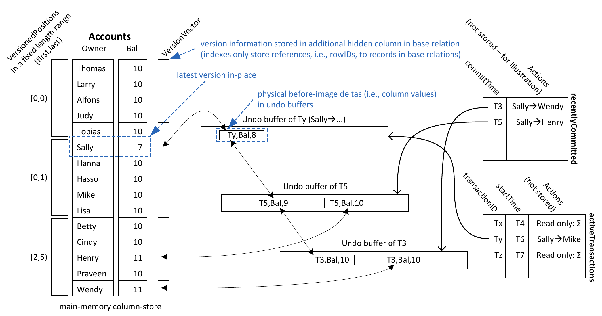

图 1：多版本并发控制示例：在 Accounts 账户之间转移 1 美元（from → to），并对全部 Balance 余额求和（Σ）。图中主表原地存放最新版本；隐藏的 VersionVector 列指向 undo 缓冲区中的物理更新前映像增量（即列值）。索引只保存对基表记录的引用，即 rowID；右侧 Actions 仅用于说明，并不存储。

提交事务时，必须为新生成的版本增量重新加时间戳，以确定其有效区间。把同一事务的全部版本增量聚集在其 undo 缓冲区内，可以极大加速这一提交过程。此外，利用 undo 缓冲区维护版本，几乎不会给我们的 MVCC 模型增加存储开销，因为在事务处理过程中，本来就必须维护版本增量（即修改的更新前映像），以支持事务回滚。唯一的区别是，undo 缓冲区可能会保留稍长一点的时间：只要仍有活跃事务可能需要访问其中的版本，就必须保留。因此，图 1 中的 VersionVector 锚定了一条从新到旧的版本重建增量链（即列值链），它可能跨越不同事务的 undo 缓冲区。即使在列存储后端，每条记录也只有一个用于版本链的 VersionVector 条目，所以版本链一般连接的是同一记录不同列的更新前映像。实际上，为了支持垃圾回收，我们将这条链维护为双向链，如 Sally 的 Bal 版本所示。

### 2.1 版本维护

数据库中只有很小一部分数据会带有版本，因为我们不断回收不再需要的版本。如果所有活跃事务都在某个版本重建增量被加上时间戳之后才开始，该增量就已过时。当对应记录没有版本时，VersionVector 存放 null；否则，它存放一个指针，指向 undo 缓冲区中最近被替换的版本。

示例只考虑两类事务。转账事务标记为“from → to”，从一个账户向另一个账户转移 1 美元：先将一个账户的 Bal 减 1，再将另一个账户的 Bal 加 1。为简洁起见，示例不讨论对象的删除与创建。所有 Balance 的初始值均为 10。用 Σ 表示的只读事务对全部 Balance 求和；在这个“封闭世界”示例中，无论它们使用什么 startTime 时间戳，都应始终算出 150 美元。

每个新进入系统的事务关联两个时间戳：transactionID 和 startTime。提交时，更新事务获得第三个时间戳 commitTime，用来确定其串行化顺序。起初，所有事务获得的标识符都高于任何事务的 startTime 时间戳。我们从 0 向上生成 startTime，从 $2^{63}$ 向上生成 transactionID，以保证所有 transactionID 都高于 startTime。更新事务原地修改数据，但会在自己的 undo 缓冲区中保留旧版本。旧版本有两个用途：（1）事务回滚（撤销）时作为更新前映像；（2）作为此前一直有效的已提交版本。这个最近被替换的版本插入到从 VersionVector 开始的版本链前端，该链可能为空。更新事务仍在运行时，新建版本标记为该事务的 transactionID，由此使未提交版本仅能由更新事务自身访问（版本访问谓词的第二个条件负责检查，见第 2.2 节）。提交时，更新事务获得 commitTime 时间戳，用它标记版本增量（undo 日志），表示这些增量对从“现在”开始的事务已无关。commitTime 来自生成 startTime 的同一个序列计数器。在示例中，第一个在 $T_3$ 提交的更新事务（Sally → Wendy），在其 undo 缓冲区中分别为 Sally 和 Wendy 的余额创建了时间戳为 $T_3$ 的版本增量。该时间戳表示：startTime 小于 $T_3$ 的事务必须应用这些版本增量；而后继版本从该时间点起对在 $T_3$ 之后开始的事务有效。示例中，一个 transactionID 为 $T_x$ 的读事务在 startTime 为 $T_4$ 时进入系统，目前仍活跃。它将读到重建后的 Sally 余额 9、重建后的 Henry 余额 10，以及 Wendy 的余额 11。另一个更新事务（Sally → Henry）在时间戳 $T_5$ 提交，并相应地将其创建的版本增量标记为有效性时间戳 $T_5$。同样，在 $T_5$ 的更新之前有效的 Sally 和 Wendy 余额版本，以更新前映像的形式保存在 $T_5$ 的 undo 缓冲区中。注意，重建出的版本从其前驱的时间戳起有效，到它自身的时间戳为止。因此，通过 $T_5$ 的 undo 缓冲区重建的 Sally 余额版本，在 $T_3$ 到 $T_5$ 之间有效。如果一个版本增量没有前驱（由空指针表示），例如 $T_5$ 的 undo 缓冲区中的 Henry 余额版本，那么它的有效期就是从虚拟时间戳“0”到 $T_5$。startTime 小于 $T_5$ 的任何读访问都会应用这一版本增量；startTime 大于或等于 $T_5$ 的读访问则忽略它，因而读取 Accounts 表中的原地版本。

> 译注：本段原文在说明 $T_5$ 缓冲区时写作“Sally’s and Wendy’s balances”；图 1 中 $T_5$ 的转账是 Sally → Henry，且其两个增量分别关联 Sally 与 Henry。这里保留原文账户名，并指出这一不一致。

如前所述，尚未提交版本的增量会获得一个临时时间戳，它大于任何已提交事务的“真实”时间戳。例如，更新事务（Sally → Henry）被赋予更新者的 transactionID 时间戳 $T_y$。这个很大的临时时间戳最初赋给 $T_y$ 的 undo 缓冲区中的 Sally 余额版本增量。除事务 $T_y$ 自身外，任何 startTime 大于 $T_5$（显然又小于 $T_y$）的读访问，都会应用这一版本增量，得到数值 8。Sally 余额值为 7 的未提交原地版本仅对 $T_y$ 可见。

> 译注：这里原文将 $T_y$ 的转账写作 Sally → Henry，而图 1 的 activeTransactions 表将该事务标作 Sally → Mike；两处按原文保留。

### 2.2 版本访问

为了访问一条记录中对自己可见的版本，事务 $T$ 先读取原地记录（例如从列存储或行存储读取），再沿着由 undo 缓冲区条目组成的版本链（可能为空）撤销所有版本修改：用 undo 缓冲区中的更新前映像覆盖已复制记录中被更新的属性，直到遇到满足下列条件的第一个版本 $v$（pred 指向前驱，TS 表示关联时间戳）：

$$
v.pred = null \lor v.pred.TS = T \lor v.pred.TS \lt T.startTime
$$

如果没有更老版本可用，第一个条件成立：它可能从未存在，也可能已在此期间被安全地垃圾回收。第二个条件使事务可以访问自身的更新。请记住，赋予活跃事务的初始 transactionID 时间戳是非常大的数，超过任何事务的开始时间。第三个条件允许读取在事务开始时有效的版本。一旦满足终止条件，我们就已经通过“撤销”在此期间发生的全部修改，重新物化了可见版本。注意，如第 4 节所示，版本“重建”实际上很便宜，因为我们保存的是物理更新前映像增量，不需要对原地的更新后映像逆向应用函数。

遍历版本链保证所有读操作都在事务开始时存在的状态上进行。这足以保证只读事务的可串行化。但是，对于更新事务，我们需要一个验证阶段，概念上要验证其整个读集在事务执行期间未发生变化。以往方法完成这一任务本来就很复杂，因为读集可能非常大，尤其是在内存数据库系统中，它们往往比传统磁盘应用更频繁地依赖全表扫描 [33]。幸运的是，我们找到了一种方法，将这种验证限制在那些实际发生变化、且仍存在于 undo 缓冲区中的对象上。

### 2.3 可串行化验证

在我们的 MVCC 模型中，有意避免写写冲突，因为它们可能导致级联回滚。如果另一个事务试图更新尚未提交的数据对象（其前驱版本中很大的 transactionID 时间戳会表明这一点），该事务就会中止并重启。因此，第一个 VersionVector 指针总是指向一个包含已提交版本的 undo 缓冲区；没有版本的记录除外，它们的指针为 null。如果同一事务多次修改同一数据对象，同一个 undo 缓冲区内就会存在一条内部指针链，最终指向已提交版本。

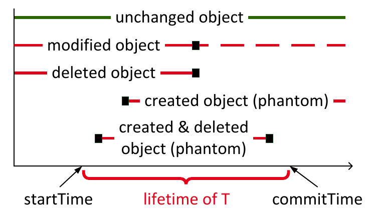

图 2：相对于事务 $T$ 的生存期，数据对象的修改、删除和创建。五行依次表示未变化对象、修改对象、删除对象、创建对象（幻象），以及创建后又删除的对象（幻象）；时间范围由 startTime 和 commitTime 界定。

为了保持系统可扩展且无锁，我们的 MVCC 模型依赖乐观执行 [22]。因此，要保证可串行化，需要在事务结束时进行验证。我们必须确保：事务处理过程中的全部读操作，在逻辑上都可以放在事务的最末尾执行，而不会产生任何可观察到的变化，如图 2 最上方的对象所示。对应到该图，我们会检测下方四种转变，即对事务 $T$“真正”相关的对象进行修改、删除、创建，以及创建后又删除。为此，事务从同一个也负责“发放”startTime 时间戳的计数器中取得 commitTime 时间戳。新取得的数字决定事务的串行化顺序。只有在 $T$ 生存期内提交的更新，也就是 startTime 与 commitTime 之间提交的更新，才可能与验证相关。对应图 2，除最上方外的所有事件都可能导致中止，但前提是这些被修改、删除或创建的对象确实与 $T$ 的读取谓词空间相交。

在以往用于可串行化验证的方法中，例如 Microsoft 的 Hekaton [8, 23] 和 PostgreSQL [34]，需要跟踪事务的完整读集（例如 PostgreSQL 使用 SIREAD 锁），并在事务结束时通过重新执行全部读访问来再次检查。对于扫描密集的内存数据库应用（包括分析事务）[33] 中常见的大读集，这种方法昂贵得难以承受。我们利用 undo 缓冲区进行验证的新思路正是在这里发挥作用。无论事务读集有多大，我们都将验证限制在最近修改并提交的数据对象上。为此，我们改造了一种古老且基本被“遗忘”的技术——精确锁 [17]；它消除了谓词锁固有的可满足性测试问题。我们的精确锁变体，用最近已提交事务的离散写入（记录的更新、删除和插入），来测试正在验证事务的面向谓词的读取。因此，如果这种外延式写入与待验证事务的内涵式读取相交，验证就失败 [42]。图 3 展示了这一验证过程。假设事务 $T$ 通过四个不同谓词 $P_1$、 $P_2$、 $P_3$ 和 $P_4$ 读取对象，它们构成 $T$ 的谓词空间。我们需要验证底部的三个 undo 缓冲区，确认它们的对象（即数据点）不与 $T$ 的谓词相交。具体做法是对这些对象求值谓词。谓词不匹配，就没有交集，验证通过；否则存在冲突。这种逐对象对谓词的验证，消除了其他需要逐谓词对谓词验证的方法所固有的不可判定性问题。

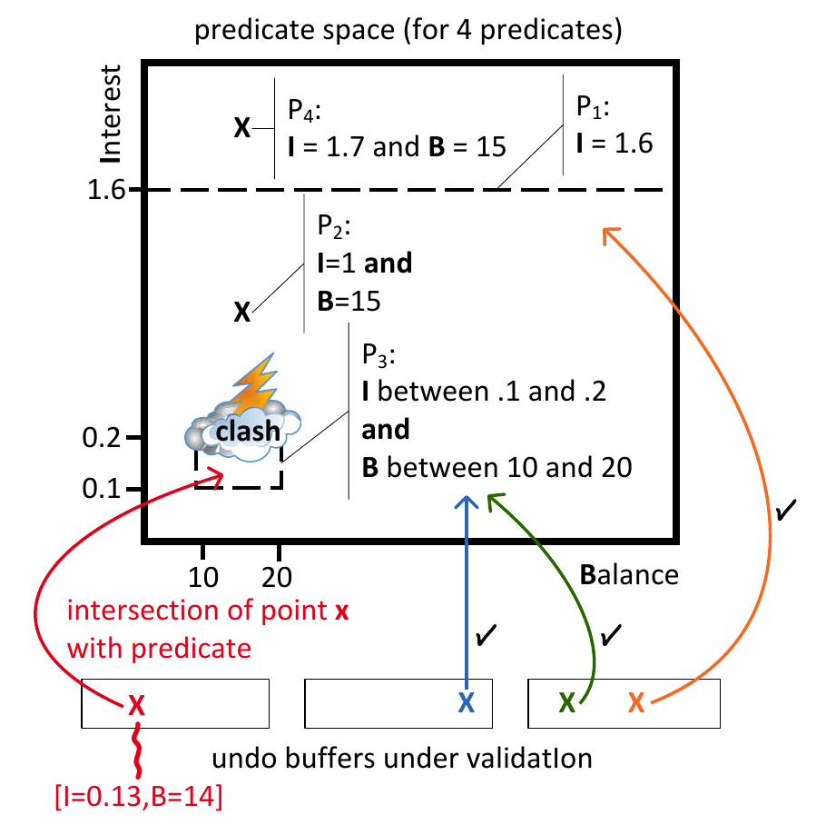

图 3：将 undo 缓冲区中的数据点与一个事务的谓词空间进行检查。横轴为余额 Balance，纵轴为利率 Interest；底部数据点 $[I=0.13,B=14]$ 与谓词 $P_3$ 相交，形成冲突。

为了找出在事务 $T$ 生存期内提交的其他事务的外延式写入，我们维护一个 recentlyCommitted 事务列表，其中含有指向对应 undo 缓冲区的指针（见图 1）。我们从在 $T$ 的 startTime 之后提交的最早事务的 undo 缓冲区开始验证，一直遍历到最新的事务（位于列表底部）。对每个 undo 缓冲区，检查如下：对于每个新创建的版本，检查它是否满足 $T$ 的任一选择谓词；如果满足，就检测到了幻象， $T$ 的读集因此不一致，必须中止 $T$。对于删除，检查被删除对象是否属于 $T$ 的读集；如果属于，则必须中止 $T$。对于修改（更新），必须同时检查更新前映像和更新后映像；只要任意一方与 $T$ 的谓词空间相交，就中止 $T$。图 3 展示了这种情况：最左侧 undo 缓冲区的数据点 $x$ 满足谓词 $P_3$，也就是说，它与 $T$ 的谓词空间相交。

验证成功后，提交事务 $T$ 的第一步是将其提交记录写入 redo 日志，这是持久性所必需的。然后，将 $T$ 的全部 transactionID 时间戳替换为新赋予的 commitTime 时间戳。由于我们在 undo 缓冲区中维护版本，所有这些修改都是局部的，因而非常便宜。如果验证失败导致中止，就执行通常的 undo 回滚，同时将版本增量从版本链移除。注意，在我们的 MVCC 模型中，几个已通过取得 commitTime 时间戳确定串行化顺序的事务，可以并行执行可串行化验证。

#### 2.3.1 谓词日志记录

为了进行可串行化验证，我们在事务执行期间记录谓词，而非读集。注意，与 Hekaton [23] 不同，HyPer 不仅允许通过索引访问记录，也允许通过基表扫描访问。在我们的实现中，这两种访问方式的谓词都要记录。基表访问的谓词表示为对表中一个或多个属性的限制。我们按关系将这些限制记录在谓词日志中。索引访问的处理类似：记录索引上的点查询与范围查询。

索引嵌套循环连接的处理有所不同。这种情况下，我们把从索引中读到的全部值作为谓词记录下来。由于可能从索引读取许多值，随后会将这些值粗化为范围，改为将这些范围作为谓词保存在谓词日志中。其他连接类型不这样处理；在执行这些连接之前，会先进行可能带有限制条件的基表访问。

#### 2.3.2 实现细节

从实现角度看，事务将数据访问按关系记为读取谓词，保存在专用谓词日志中。我们始终为每个属性使用 64 位整数比较摘要，以便通过便宜的整数操作高效检查谓词，同时保持较小的谓词日志。字符串等变长数据对象被哈希为 64 位摘要。

传统可串行化 MVCC 模型在记录粒度上检测冲突，例如通过“锁定”记录。我们的实现为受限属性（谓词）记录比较摘要，这足以在记录级（SR-RL）检测可串行化冲突。但有时记录粒度过粗。如果事务读取与写入的属性集合不重叠，也可能检测到假阳性冲突。为了消除这些会导致错误中止的假阳性，我们还实现了在属性粒度（SR-AL）上检查可串行化冲突的方法：除受限属性外，进一步记录哪些属性在没有限制条件的情况下被访问，也就是被读取。这样，验证时就能知道访问过哪些属性，并跳过那些只修改了未被访问属性的版本。第 4.4 节的评估表明，与记录级（SR-RL）可串行化检查相比，属性级（SR-AL）检查减少了假阳性数量，而几乎没有增加谓词记录与验证的开销。

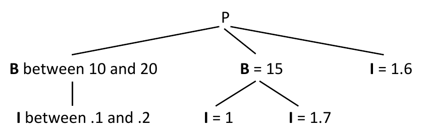

图 4：对应图 3 谓词空间的谓词树（Predicate Tree，PT）。

可串行化验证按如下方式工作。在开始验证一个正在提交的事务时，根据谓词日志为每个关系构建一棵谓词树（PT）。PT 是根节点为 $P$ 的有向树。图 4 给出了图 3 谓词空间对应的 PT。PT 的节点是单属性谓词，例如 $B=15$。边用逻辑 AND 连接节点，例如 $B=15 \land I=1$。树中所有路径的逻辑 OR 就定义了谓词空间。共享同一根的相同谓词节点会合并，例如图 4 中的 $B=15$。验证时，检查数据对象是否满足 PT，也就是 PT 中是否存在一条被该数据对象满足的路径。

### 2.4 垃圾回收

每当有事务提交时，我们都会持续地对 undo 缓冲区进行垃圾回收。每次提交后，MVCC 实现确定当前最老的可见 transactionID，即某个事务的更新仍对至少一个活跃事务可见时，这样的事务中最老的时间戳。然后，将 transactionID 比该时间戳更老的所有已提交事务从最近提交事务列表中移除，以原子方式从版本列表中移除对其 undo 缓冲区的引用，并给 undo 缓冲区本身加上墓碑标记。注意，不能立即复用被标记 undo 缓冲区的内存，因为其他事务仍可能持有对此缓冲区的引用；虽然该缓冲区肯定与这些事务无关，但它仍可能是终止版本链遍历所必需的。一旦最老的活跃事务也是在 undo 缓冲区被标记之后才开始，复用该缓冲区就是安全的。像我们的系统一样，可以用很小的开销实现这一点，例如维护高水位标记。

### 2.5 索引结构的处理

与 Hekaton [8, 23] 和 PostgreSQL [34] 中的其他 MVCC 实现不同，我们的 MVCC 实现不使用（谓词）锁和时间戳来标记索引中被读取和修改的键。为了保证 SI 和可串行化，我们的实现按如下方式处理：如果更新只涉及非索引属性，就照常执行更新。如果更新涉及索引属性，则从关系中删除该记录并重新插入，删除的记录和重新插入的记录都会保存在索引中。因此，索引保留对任何活跃事务可见的全部记录的引用。与 undo 缓冲区一样，索引也在垃圾回收过程中清理。

我们通过中止插入重复主键的事务来确保主键唯一性，须检查的已有主键包括：（i）在该事务可见的快照中存在；（ii）在该键所对应记录的最后提交版本中存在；或者（iii）作为一次尚未提交的插入存在于 undo 缓冲区中。注意，只需要检查这三种情况，因为索引属性的更新是通过删除和插入完成的。

对于外键约束，需要检测一个活跃事务删除主键、另一个并发事务插入对该键的外键引用的情况。此时，插入事务会检测到这一删除（可能尚未提交），我们便将插入事务中止。即使删除尚未提交，也会主动中止插入事务，因为事务通常会提交，只有很少情况会中止。

### 2.6 高效扫描

面向实时商业智能的内存数据库系统，也就是在同一数据库中高效处理事务与分析负载的系统，严重依赖“时钟速率级”的扫描性能 [43, 26]。因此，若使用分支语句逐个测试每个数据对象是否带有版本，会严重危害性能。我们在 HyPer 中的 MVCC 实现使用 LLVM 代码生成和即时编译 [31]，在运行时生成高效扫描代码。为减轻反复执行版本判断分支对性能的负面影响，生成的代码会利用带版本记录的位置摘要，确定可以按最高速度扫描的范围。

生成的扫描代码结合这些称为 VersionedPositions 的摘要运行，如图 1 左侧所示。对于一个固定的记录范围（例如 1024 条），摘要用一个 32 位整数保存第一条和最后一条带版本记录的位置：高 16 位保存第一条带版本记录的位置，低 16 位保存最后一条的位置。维护 VersionedPositions 非常便宜，因为位置的插入与删除只需少量逻辑操作（见第 4 节评估）。此外，删除以模糊方式处理，VersionedPositions 在下一次扫描时修正，必要的操作可以隐藏在内存访问之后。

注意，版本会不断被垃圾回收，因此多数范围内根本没有版本，这用空区间 $[x,x)$ 表示，即半开区间的上下界相等。例如，图 1 前 5 条记录的摘要就是这种情况。利用 VersionedPositions 摘要，可以把相邻的无版本记录累积为一个无需版本检查的范围。在这个范围中，扫描代码以最高速度运行，不包含版本检查分支。对于已修改记录，则查阅 VersionVector，重建对事务可见的记录版本（见第 2.2 节）。同样，我们预先扫描 VersionVector 中已设置的版本指针来确定已修改记录的范围，以免重复测试一条记录是否带版本。

观察图 1 可知，对于连续区段 $0\ldots4$ 和 $6\ldots10$，无版本记录循环以最高速度扫描 Balance 向量，不必检查记录是否带版本。实际场景中，两个带版本对象之间的连续区段可达数百万条记录，因此 MVCC 引入的扫描性能损失很小（第 4.1 节进行了评估）。预先确定带版本对象的范围还保证：在所有记录都已修改的热点区域中，不会再查阅 VersionedPositions 摘要。

### 2.7 数据结构的同步

本文重点是提供一种高效、优雅的机制来支持事务的逻辑并发，这是支持交互式事务和分段事务所必需的；这类事务被分解为存储过程调用或单条 SQL 语句等多个任务。由于应用往返等因素，人们希望交错执行这些分解后的任务，而我们的可串行化 MVCC 模型实现了这种逻辑并发。线程级并发在很大程度上是一个正交问题。因此，我们只简要介绍如何同步 MVCC 数据结构，以及如何用多个线程处理事务负载。

为了在实现中保证线程安全的同步，我们在单个任务执行期间对 MVCC 数据结构获取短期闩锁（latch）；一个事务通常包含多次这样的调用。写事务的提交处理在一个短暂的独占临界区中完成：先取得 commitTime 时间戳，验证事务，并将提交记录插入 redo 日志。此后，可以通过原子操作无须同步地更新 undo 缓冲区中的有效性时间戳。第 2.4 节详细说明了持续回收 undo 日志缓冲区的无锁垃圾回收方法。目前，我们对索引结构使用传统的基于闩锁的同步，未来可以改用 Bw-Tree [25] 等无锁结构。

今后的工作中，我们希望进一步优化实现的线程并行化。目前仍依赖经典的短期闩锁来避免并发线程之间的竞态条件。在版本获取期间使用硬件事务内存（HTM）[24] 可以在很大程度上避免这些闩锁，因为它能够保护读者，使其免受并发（即发生竞态的）更新者这一小概率事件的影响。注意，这样的冲突非常不可能发生，因为它必须出现在几个 CPU 周期的时间窗口内。将我们的 MVCC 模型与 HTM 结合很有前景，并且在初步实验中确实优于当前实现。

## 3. 理论

本节在可串行化理论的框架下，更形式化地分析我们的可串行化 MVCC 模型。

### 3.1 对 MVCC 模型的讨论

为了形式化描述 MVCC 方案，需要引入图 5 所示的一些记号。图的上半部分是一个由四个事务组成的调度。这些事务分别在 $S_1$、 $S_2$、 $S_3$ 和 $S_4$ 开始。由于它们访问数据对象的不同版本，需要一个版本排序或编号方案来区分读取和版本创建。同一个四事务调度的这一表示见图的下半部分。

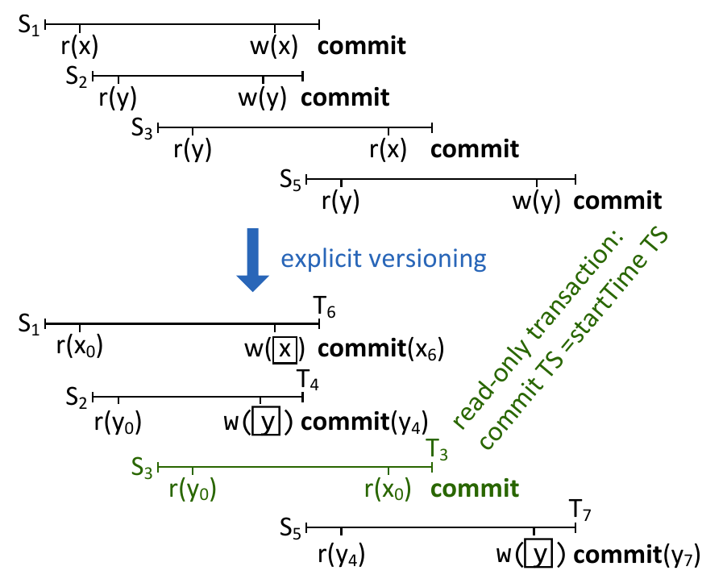

图 5：我们的 MVCC 模型中显式版本记号的示例。只读事务的提交时间戳等于开始时间戳。

> 译注：上述列举开始时刻的原文写作 $S_1,S_2,S_3,S_4$，而图 5 中第四个事务的开始时刻标为 $S_5$；这里分别保留。

事务可以并发推进，但会串行提交。更新事务从生成 startTime 的同一个计数器中取得 commitTime 时间戳。commitTime 决定提交顺序；后面将看到，它也决定事务的串行化顺序。只读事务不必另取提交顺序时间戳，而是复用 startTime。因此，在示例中，从 $S_1$ 开始的事务取得 commitTime 时间戳 $T_6$，因为从 $S_2$ 开始的事务更早在 $T_4$ 提交。从 $S_3$ 开始的只读事务，在逻辑上也在 $T_3$ 提交。

事务读取全部数据时，使用的是在其 startTime 之前最近提交（即创建）的版本。版本只在事务结束时提交，因此获得与创建它的事务的 commitTime 相对应的标识符。图 5 的事务调度创建了版本链 $y_0\rightarrow y_4\rightarrow y_7$ 和 $x_0\rightarrow x_6$。注意，由于我们使用创建事务的 commitTime 标识版本，版本本身不是以连续方式编号的。如第 3.2 节所证明，我们的 MVCC 模型保证其等价于按 commitTime 顺序执行的串行单版本调度。因此，图 5 中所得调度等价于如下串行单版本执行：

$$
r_3(y),r_3(x),c_3,r_4(y),w_4(y),c_4,r_6(x),w_6(x),c_6,r_7(y),w_7(y),c_7
$$

这里，每个操作都以其事务的 commitTime 作为下标。

局部写入记作 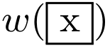。这种“脏”数据对象仅对写入它的事务可见。在实现中（见第 2.1 节），我们利用很大的事务标识符，使脏对象对其他事务不可见。形式模型中不需要这些标识符。由于我们执行原地更新，其他试图写入或覆盖  的事务会被中止并重启。注意，读取 $x$ 始终是可能的，因为事务对 $x$ 的读取会被导向在该事务 startTime 之前最近提交的 $x$ 版本。只有一个例外：如果事务更新了对象 $x$，即执行 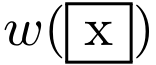，它随后会读到自己的更新，即 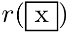。图 6(a) 左上角的事务 $(S_1,T_2)$ 展示了这一点。在实现中，这种“读到自己的写入”机制，同样通过给脏数据版本赋予很大的事务标识符来实现。

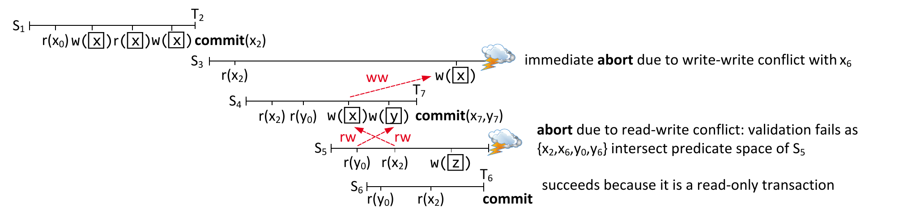

图 6：我们的 MVCC 模型中的示例调度。（a）一次写写冲突和一次读写冲突。图中分别示出因写写冲突而立即中止、因读取谓词空间相交而在验证时中止，以及因是只读事务而成功提交的情况。

图 6(a) 还展示了 rw 依赖的环路，这种依赖通常也称为 rw 反依赖（rw-antidependency）[11]。rw 反依赖在符合 SI、却不可串行化的调度中起着关键作用。图中第一个 rw 反依赖涉及 $r(y_0)$ 和 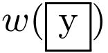，无法立即检测，因为 $(S_4,T_7)$ 中对 $y$ 的写入发生在读取 $y$ 之后；第二个涉及 $r(x_2)$ 和 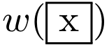 的 rw 反依赖则可以立即检测，但在我们的 MVCC 模型中，选择在提交时验证全部读取。毕竟，如果 $(S_4,T_7)$ 中止，或者读取事务在 $T_7$ 之前提交，这些 rw 反依赖就可能被化解。

> 译注：图 6(a) 的英文说明把写写冲突对象标为 $x_6$，把与 $S_5$ 谓词空间相交的集合写为 $\lbrace x_2,x_6,y_0,y_6\rbrace$；但图中相应更新事务提交的版本标为 $x_7,y_7$。图像保留原标记，不将这些下标静默统一。

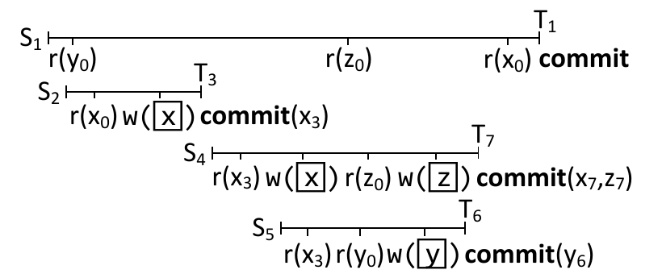

图 6(b)：我们的 MVCC 模型的优势。

图 6(b) 展示了 MVCC 的好处：虽然事务 $(S_5,T_6)$ 在事务 $(S_4,T_7)$ 写入 $x$ 之后才读取 $x$，它仍成功“插到”后者之前。显然，单版本调度器无法达到这样的逻辑并发程度。该图还展示了我们的 MVCC 方案保留任意多个版本，而非像文献 [36] 那样仅保留两个版本的好处。“长”读事务 $(S_1,T_1)$ 必须访问 $x_0$，尽管在此期间两个更新版本 $x_3$ 和 $x_7$ 已经创建。只有当版本确定不再被其他活跃事务需要时，才会被垃圾回收。

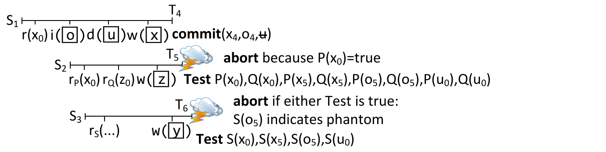

图 6(c)：一次读写冲突、一次读删除冲突和一次幻象冲突。图中的测试只要任一结果为真，就会中止相应事务；其中 $S(o_5)$ 表示检测到幻象。

图 6(c) 展示了我们对精确锁的新用法：收集读取谓词，并用这些谓词验证最近提交的版本。这里，事务 $(S_2,T_5)$ 用谓词 $P$ 读取 $x_0$，记为 $r_P(x_0)$。在 $S_2$ 开始的事务尝试提交时，会验证在此期间提交的版本的更新前映像和更新后映像。具体而言， $P(x_0)$ 为真，因此该事务中止并重启。类似地，也能检测幻象和删除，如事务 $(S_1,T_4)$ 中的插入 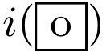 和删除 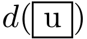 所示。不允许插入对象或删除对象与那些在 $T_4$ 之后提交的并发事务的谓词相交。

> 译注：图 6(c) 在上方提交处将新版本标为 $x_4,o_4$，而下方谓词测试中写成 $x_5,o_5$（例如 $P(x_5)$、 $S(o_5)$）；图像保留原文的不同下标。

### 3.2 可串行化保证的证明

下面证明：我们结合谓词空间验证的 MVCC 方案，保证任何执行都可以按提交顺序串行化。

**定理。** 对于遵循本协议的任意多版本调度 $H$，其已提交投影与一个串行单版本调度 $H'$ 冲突等价；在 $H'$ 中，已提交事务按 commitTime 时间戳排序，未提交事务被移除。

**证明。** 根据 MVCC 协议的性质，任何未提交事务的效果都不可能被其他成功事务看到：读操作会忽略未提交写入，写操作则要么看不到未提交写入，要么导致中止。因此，证明中只考虑已提交事务就足够了。

基本上，下面将证明所有依赖的方向都与 commitTime 时间戳顺序一致，因此任何执行都可以按提交顺序串行化。只读事务看到的是数据库在 $S_b$ 时的稳定快照，并获赋相同的 commitTime 时间戳 $T_b=S_b$。换言之，其行为等同于在 commitTime 对应的时间点执行，而这一时间点也就是 startTime。

更新事务在 $S_b$ 开始，获赋 commitTime 时间戳 $T_c$，且 $T_c\gt S_b$。下面用反证法证明其行为等同于在 $T_c$ 时间点执行。设 $T$ 是 $H$ 已提交投影中的一个更新事务，即 $T$ 已成功提交，但 $T$ 无法被推迟到 $T_c$。也就是说， $T$ 执行了一个操作 $o_1$，它与另一个事务 $T'$ 的操作 $o_2$ 冲突，且 $o_1\lt o_2$； $T'$ 在 $T$ 的生存期内提交，即处于时间区间 $S_b\le T' _ c\lt T_c$。如果 $T'$ 在 $T$ 之后提交，即 $T' _ c\gt T_c$，可以把 $T'$（因而也把 $o_2$）推迟到 $T_c$ 之后，所以只需考虑 $T' _ c\lt T_c$ 的情况。

操作 $o_1$ 和 $o_2$ 有四种可能组合。如果二者都是读，可以交换其顺序，这与假设 $o_1$ 和 $o_2$ 冲突矛盾。如果二者都是写，按照一旦检测到 ww 冲突就立即中止的协议， $T'$ 本应中止，因此与 $T$ 和 $T'$ 都是已提交事务的假设矛盾。如果 $o_1$ 是读、 $o_2$ 是写，因为 $T' _ c\lt T_c$， $T$ 提交时更新 $o_2$ 已在 undo 缓冲区中，而且 $o_1$ 的读取谓词 $P$ 已被记录。在 $T_c$ 进行的谓词验证，会测试 $o_2$ 的更新前映像或更新后映像是否满足 $P$，从而检查 $o_1$ 是否受到 $o_2$ 影响，即该读取本应看到该写入，如图 6(c) 所示。如果不受影响，就与假设 $o_1$ 和 $o_2$ 冲突矛盾；如果受影响，则与假设 $T$ 已成功提交矛盾，因为只要 $P$ 被满足， $T$ 就应中止。如果 $o_1$ 是写、 $o_2$ 是读，那么在 MVCC 机制中，由于 $T' _ c\gt S_b$，该读取忽略了 $o_1$ 的效果，这与假设 $o_1$ 和 $o_2$ 冲突矛盾。定理得证。□

## 4. 评估

本节评估 HyPer 内存数据库系统 [21] 中的 MVCC 实现。该系统支持 SQL-92 查询，以及使用类似 PL/SQL 的脚本语言定义的事务 [20]，并提供 ACID 保证。

HyPer 同时支持关系的列式和行式存储。除非另有说明，我们使用列存储后端，启用持续垃圾回收，并将 redo 日志保存在本地内存。Redo 日志条目在内存中生成，以小批量提交（组提交），从而减少系统调用开销，且几乎不增加事务延迟。我们评估了 HyPer 的单版本并发控制、新型 MVCC 模型，以及一种类似文献 [23] 的 MVCC 模型；后者通过在我们的 MVCC 模型中更新整条记录且不使用 VersionedPositions 摘要来模拟。我们还实验了 DBMS-X，它是一款使用与文献 [23] 类似的 MVCC 实现的商用内存 DBMS。DBMS-X 在评估机器的 Windows 7 环境中运行。由于许可协议限制，无法披露 DBMS-X 的名称。

实验在一台运行 Linux 3.13 的双插槽 Intel Xeon E5-2660v2 NUMA 系统上执行，CPU 频率为 2.20 GHz，最高睿频 3 GHz，内存为 256 GB DDR3 1866 MHz，每颗 CPU 配置 128 GB。每颗 CPU 有 10 个核心和 25 MB 共享 L3 缓存。每个核心拥有各 32 KB 的 L1 指令缓存与 L1 数据缓存，以及 256 KB L2 缓存。

### 4.1 扫描性能

首先展示 MVCC 实现的高扫描性能。我们实现了一个类似 SIBENCH [7] 和前文银行账户示例（见图 1）的基准。基准操作一张由整数 (key, value) 对组成的关系。负载包括更新事务和扫描事务：更新事务通过递增 value 修改一个 (key, value) 对，扫描事务扫描关系并对 value 求和。

图 7 展示了在含有 1 亿（100M）条 (key, value) 记录的关系上，扫描事务的每核性能。为展示扫描带版本记录的影响，我们禁用持续垃圾回收，并在扫描关系前进行更新。我们同时改变脏记录数量以及每条脏记录的版本数。此外，区分两种情况：（i）扫描事务在更新之前开始（scan oldest），因而需要撤销更新事务的效果；（ii）扫描事务在更新之后开始（scan newest），因此只需验证脏记录对该扫描事务可见。所有情况下的结果都表明，对于现实中可能出现的脏记录数量，我们的 MVCC 实现保持了单版本并发控制实现的高扫描吞吐量；即使在每条记录包含多个版本的高争用情况下也是如此。

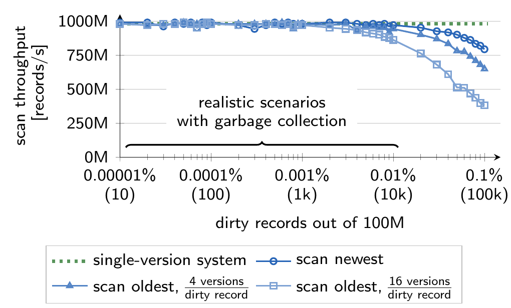

图 7：禁用垃圾回收时的扫描性能。scan newest 事务只需验证记录的可见性，而 scan oldest 事务需要撤销更新。纵轴是扫描吞吐量（记录/秒），横轴是在 100M 条记录中脏记录的比例与数量。图例包括单版本系统、scan newest，以及每条脏记录分别有 4 个和 16 个版本的 scan oldest。

为了验证关于脏记录与版本数量的假设，我们以 Amazon.com 为例。《哈利·波特与混血王子》是史上最畅销的书籍之一，在美国上市的最初 24 小时内售出 690 万册。即使做出极其悲观的假设：所有书都在当天的 20 小时内通过 Amazon 售出，而且 Amazon 只运营六个仓库，每个仓库每秒也只售出该书 16 册。我们的实验表明，要测出扫描性能的显著下降，需要有几十万种这样的畅销商品，并且有一个长时间保持打开的事务。请记住，在这种情况下，可以将长事务中止，并在一个快照上重新启动 [29]。

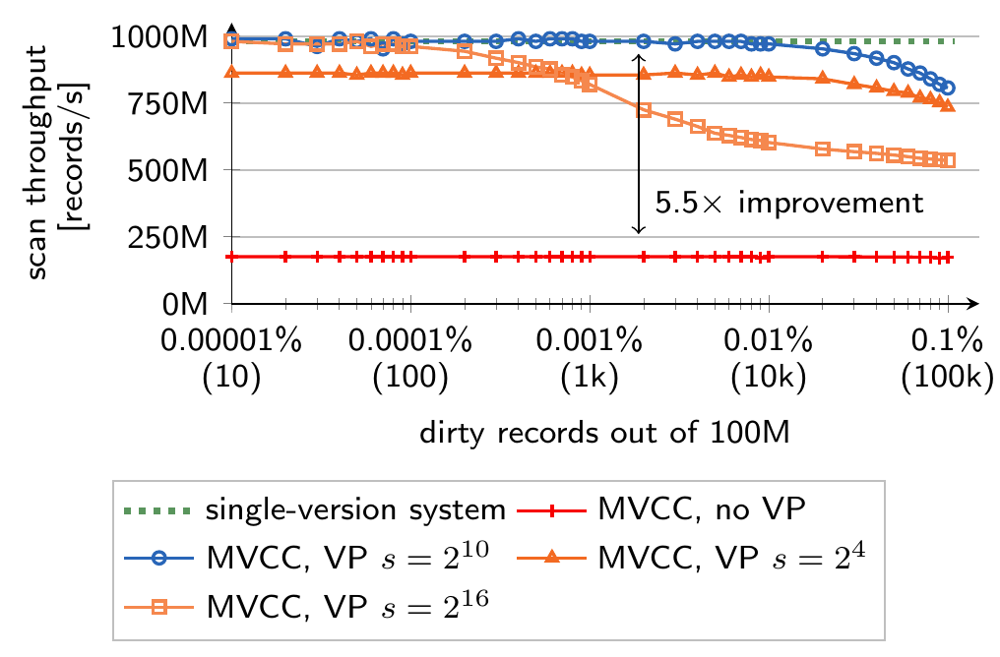

图 8：每 $s$ 条记录维护一个 VersionedPositions（VP）摘要对扫描性能的影响。图例比较单版本系统、完全不使用 VP 的 MVCC，以及 $s=2^{10}$、 $s=2^{16}$ 和 $s=2^4$ 的 MVCC。

图 8 展示 VersionedPositions 摘要（见第 2.6 节）对扫描性能的影响。我们的实现每 1024 条记录维护一个 VersionedPositions。实验表明，增大或减小每个 VersionedPositions 对应的记录数都会降低扫描性能。与完全不用 VersionedPositions 相比，扫描性能提高了 5.5 倍以上。1024 条记录似乎是一个合适的平衡点：此时 VersionedPositions 向量的大小仍然合理，而摘要已能编码有意义的范围，即主要包含已修改记录的范围。图 9 对 CPU 周期的分解表明，对于现实中可能出现的带版本记录数量，MVCC 各函数的代价很小。扫描过程中测得每周期指令数（IPC）为 2.8。

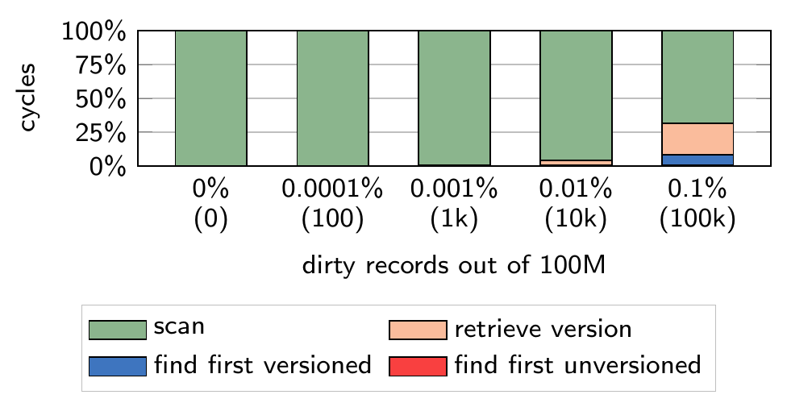

图 9：scan oldest 事务的周期分解，每条脏记录需撤销 4 次更新。图例分别为扫描、寻找第一条带版本记录、获取版本和寻找第一条无版本记录；横轴给出 100M 条记录中脏记录的比例与数量。

我们还将 MVCC 实现的扫描性能与 DBMS-X 比较。DBMS-X 在没有脏记录时的扫描速度为每秒 7.4M 条记录，存在 10k 条脏记录时为每秒 2.5M 条记录，比我们的 MVCC 实现慢超过 100 倍。当然，我们是把只针对点查询优化的 DBMS-X“误用”于大型全表扫描，而分析事务需要这类扫描。Hekaton 模型只针对点查询优化，全部访问都通过索引完成，这会严重降低基于扫描的分析性能。

### 4.2 插入、更新与删除基准

我们还在一张包含 10 个整数属性和 100M 条记录的关系上，评估了插入、更新以及“删除后插入”（delin）操作的每核性能。与单版本并发控制实现相比，其速度为每秒 5.9M 次插入、3.4M 次更新和 1.1M 次 delin，MVCC 实现由于可见性检查以及 VersionVector 和 VersionedPositions 的维护，性能略有下降，分别为每秒 4M 次插入、2M 次更新和 1M 次 delin，符合预期。但逻辑并发的活跃事务数量不影响性能。由于最新版本原地存储，前一版本的版本记录插在版本链开头，更新性能也与版本总数无关。

### 4.3 TPC-C 和 TATP 结果

TPC-C 是一个写密集基准，模拟订单录入环境的主要活动。其负载组合包含 8% 只读事务和 92% 写事务。TPC-C 中部分事务会进行聚合，以及带范围谓词的读取。图 10(a) 展示了在 5 个仓库、没有思考时间的 TPC-C 基准中，我们 MVCC 实现的每核性能。与单版本并发控制实现相比，MVCC 实现损失约 20% 的性能，但仍可每秒处理超过 100k 个事务。对于列式和行式存储后端均是如此。我们还将这些结果与 HyPer 中的 2PL 实现和类似文献 [23] 的 MVCC 模型比较。2PL 的代价高昂，吞吐量约低 5 倍。文献 [23] 的 MVCC 模型吞吐量约为每秒 50k 个事务。

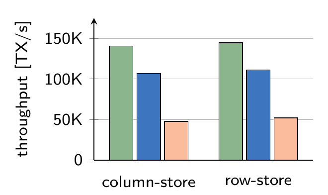

图 10：默认使用 5 个仓库的单线程 TPC-C 实验。（a）HyPer 的单版本并发控制（绿色）、我们的 MVCC 模型（蓝色），以及通过更新整条记录且不使用 VersionedPositions 来模拟文献 [23] 行为的 MVCC 模型（浅橙色）。纵轴为事务吞吐量（TX/s）。

我们还用多个线程运行 TPC-C。与 H-Store [19]/VoltDB 类似，我们按仓库对数据库进行分区。分区分配给线程，线程绑定到核心，方式类似 DORA 系统 [32]。这些线程处理的事务，主要访问属于各自分区的数据。与 DORA 不同，跨分区访问由该事务被分配到的主线程执行；例如，TPC-C 中有 11% 的事务发生这种访问。可扩展性实验（见图 11(a)）表明，系统在最多 20 个核心上近似线性扩展。超过 20 核后，可能需要像 SILO 系统 [41] 那样减少全局同步。我们还通过改变跨分区事务的比例来改变分区争用程度，如图 11(b) 所示。最后，如图 11(c) 所示，我们也测量了只读事务的影响，按比例改变负载组合中两种只读事务的占比。

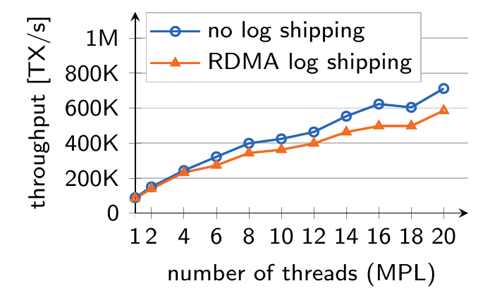

图 11：使用我们 MVCC 模型的 HyPer 上、包含 20 个仓库的多线程 TPC-C 实验。（a）可扩展性。横轴为线程数（MPL），纵轴为吞吐量（TX/s）；两条曲线分别是不传送日志和通过 RDMA 传送日志。

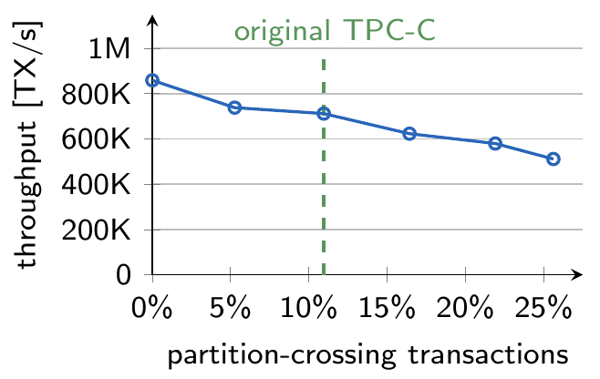

图 11(b)：20 个线程下改变争用程度。横轴为跨分区事务比例，纵轴为吞吐量（TX/s）；虚线标示原始 TPC-C。

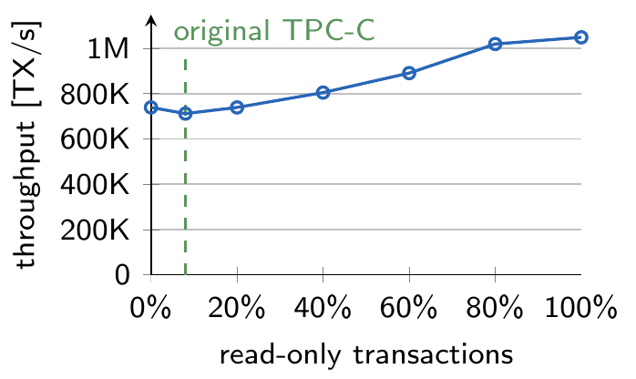

图 11(c)：20 个线程下只读事务的影响。横轴为只读事务比例，纵轴为吞吐量（TX/s）；虚线标示原始 TPC-C。

图 11(a) 还展示了 HyPer 通过 Infiniband 上的远程直接内存访问（RDMA）传送 redo 日志时的可扩展性。使用 20 个线程时，基于 RDMA 的日志传送产生 17% 的开销。我们的评估系统配置 Mellanox ConnectX-3 Infiniband 网卡，以 4×QDR 运行。这套配置的最大写带宽为 3.5 GB/s，延迟为 1.3 微秒。该带宽足以传送 redo 日志条目：每 100k 个 TPC-C 事务生成 85 MB redo 日志条目。在我们的配置中，接收节点可以承担高可用故障接管，也可以将日志写入磁盘。

电信应用事务处理（Telecommunication Application Transaction Processing，TATP）基准模拟典型电信应用。负载组合由 80% 只读事务和 20% 写事务组成。其中，所有读事务都执行点访问，记录大多整条更新。因此，TATP 对文献 [23] 的 MVCC 模型而言是最佳情况。我们使用 1M 用户的规模因子运行该基准。与采用单版本并发控制运行基准时的每秒 421,940 个事务相比，我们的 MVCC 实现只产生很小开销，达到每秒 407,564 个事务。正如预期，模拟的文献 [23] MVCC 模型在该基准中也表现相当好，但仍比我们的 MVCC 实现落后约 20%，达到每秒 340,715 个事务。

### 4.4 可串行化

为确定可串行化验证方法（见第 2.3 节）的代价，我们首先让 TPC-C 与 TATP 各自在一个串行流中运行，将谓词记录的开销与谓词验证的开销分离测量。不记录谓词，即处于 SI 下，TPC-C 吞吐量为每秒 112,610 个事务；记录级谓词记录（SR-RL）为每秒 107,365 个事务；属性级谓词记录（SR-AL）为每秒 105,030 个事务。这意味着 SR-RL 仅有 5% 开销，SR-AL 仅有 7%。对于 TATP，测得 SR-RL 开销仅为 1%，SR-AL 仅为 2%。我们还测量了以只读为主的 TPC-H 决策支持基准中的谓词记录开销，结果甚至更小。从大小上看，我们的实现生成的谓词日志相当小。不同于其他可串行化 MVCC 实现，我们不需要跟踪事务的整个读集。为了说明大小差异，设想在 TPC-C 模式上执行一个 top-customer 事务：对于指定的仓库和地区，找出信用评级良好（GC）、账户余额最高的客户，并执行一次小更新：

```sql
select
  c_w_id, c_d_id, max(c_balance)
from
  customer
where
  c_credit = 'GC'
  and c_w_id = :w_id
  and c_d_id = :d_id
group by
  c_w_id, c_d_id
update ...
```

对于这样的查询，需要跟踪读集的可串行化 MVCC 模型必须复制全部已读记录，或者设置标志，例如 PostgreSQL 的 SIREAD 锁 [34]。假设记账至少需要为每条已读记录保留 1 字节，那么这些方法至少需要跟踪 3 KB 数据，因为 TPC-C 中一个仓库的每个地区服务 3k 个客户。相比之下，我们的 SR-AL 只存储读取的属性和读到的聚合结果，不到 100 字节，只有传统读集记账消耗的三十分之一；对于真正读取大量数据的 OLAP 类查询，谓词记录节省得更多。例如，分析型 TPC-H 查询的读集通常包含数百万条记录，跟踪读集很容易消耗数 MB 空间。

为确定谓词验证的代价，我们再次运行 TPC-C，但这次通过把事务分解为更小的任务来交错执行，使事务在逻辑上并发运行，从而需要谓词验证。我们还将上述 top-customer 事务加入负载组合，并把其占比从 0% 调整到 100%。结果见图 10(b)。由于 TPC-C 事务很短，可以选择跳过构建谓词树，直接应用全部原始谓词，从而显著加快谓词验证。然而，谓词树具有好得多的渐近行为，因此随着事务复杂度增长，它会快得多，也更稳健。所以我们始终使用谓词树，而不专门针对代价很低的事务优化。图中还显示，当负载组合中只读事务更多时，可串行化验证的开销几乎消失，真实负载通常正是这种情况 [33]。在我们的系统中，为 TPC-C 事务构建谓词树需要 2 至 15 微秒，为分析型 TPC-H 查询构建谓词树需要 4 至 24 微秒，几何平均为 9.5 微秒。如前所述，与重复全部读取的传统验证方式相比，我们系统的记账开销低得多。单独比较验证时间则更复杂。传统方式的验证时间取决于正在提交事务的读集大小 $|R|$，以及重复读取的速度，通常就是扫描速度和索引查找速度；我们的方法主要取决于在该提交事务运行期间已提交的写集大小 $|W|$。在我们的系统中，用 TPC-C 事务或 TPC-H 查询的谓词检查一条从 undo 缓冲区重建的带版本记录，比一次索引查找略快。因此，总体而言，我们的方法更适合 $|R|\ge|W|$ 的负载。我们认为多数情况下如此，因为现代负载往往是读密集的 [33]，而事务活跃的时间通常很短；长时间运行的事务会转交给一个“安全快照”。

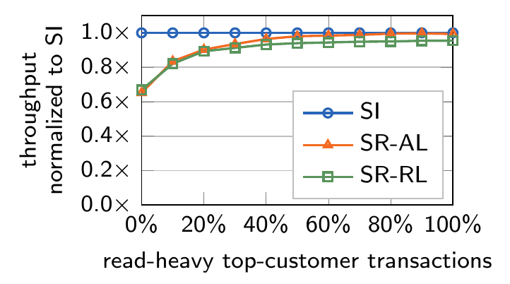

图 10(b)：在工作负载组合中改变读密集 top-customer 事务占比时，使用属性级（SR-AL）和记录级（SR-RL）谓词日志、保证可串行化的交错事务吞吐量，相对于 SI 吞吐量的比例。

最后，我们评估 HyPer 中 MVCC 实现的并发控制中止率，即由并发控制冲突导致的中止。我们再次运行逻辑交错的 TPC-C 事务，并改变 TPC-C 仓库数量。由于 TPC-C 很大程度上可以按仓库分区，直观上仓库越多，并发控制冲突越少。结果见图 10(c)。我们承认 TPC-C 在 SI 下不会表现出异常 [11]，但数据库系统当然不知道这一点，因此该基准实际上测试的是假阳性中止。SI 下的中止是“真实”冲突，即两个事务尝试并发修改同一数据项。使用 SR-AL 的可串行化验证几乎不产生假阳性中止。仅有的假阳性中止来自 delivery 中的最小值（min）聚合，因为它有时会与并发插入冲突。我们的系统目前尚未实现最小值和最大值聚合的谓词记录，但今后很容易加入。SR-RL 比 SR-AL 产生更多假阳性，因为它并非只将读取与被更新属性进行检查，而是将记录的任何变化都视为冲突，即使原事务可能根本没有读取过被更新的属性。

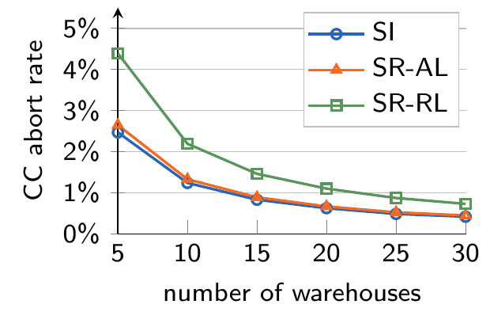

图 10(c)：改变仓库数量并运行交错事务时，快照隔离（SI）和使用属性级（SR-AL）、记录级（SR-RL）谓词日志的可串行化模式下的并发控制中止率。

## 5. 相关工作

事务隔离与并发控制是数据库管理系统最基本的功能之一。因此，过去已有多部优秀书籍与综述论文讨论这一主题 [42, 3, 2, 38]。下面进一步介绍与本文特别相关的三类工作，尤其关注多版本并发控制和可串行化。

### 5.1 多版本并发控制

多版本并发控制（MVCC）[42, 3, 28] 是一种流行的并发控制机制。由于具有读者从不阻塞写者这一理想性质，它已在多种数据库系统中实现，包括 Microsoft SQL Server 的 Hekaton [8, 23]、SAP HANA [10, 37] 等商用系统，以及 PostgreSQL [34] 等开源系统。

Hekaton [23] 与我们的实现类似，基于一种采用时间戳的乐观并发控制 [22] MVCC 变体，并使用代码生成 [12] 在运行时为事务编译高效代码。在 Hekaton 的背景下，Larson 等人 [23] 比较了基于锁的悲观方案与基于验证的乐观 MVCC 方案，并为内存 DBMS 提出了一种新的 MVCC 模型。与我们的实验观察相似，乐观方案在他们的评估中表现更好。与 Hekaton 相比，我们的可串行化 MVCC 模型不以整条记录为单位更新，而是在属性级原地更新。此外，我们没有将数据访问限制为索引查找，并针对 OLAP 类事务所需的高扫描速度优化模型。最后，我们采用一种改造精确锁技术 [17] 的新型可串行化验证机制。Lomet 等人 [27] 提出另一种面向内存数据库系统的 MVCC 方案，主要思路是为事务使用时间戳范围。不同于经典 MVCC 模型，我们此前提出为长事务使用虚拟内存快照 [29]，并在提交时将更新合并回数据库。然而，快照创建与合并可能非常昂贵，具体取决于数据库大小。

Hyder [5, 4] 是一个数据共享系统，将带索引记录作为多版本日志结构数据库存储在共享闪存上。事务冲突由一个 meld 算法检测，该算法将日志中的已提交更新合并到内存 DBMS 缓存中。这种体系结构有望无需分区就实现横向扩展。我们的 MVCC 模型只利用 undo 日志来验证可串行化违例，而在 Hyder 中，持久日志就是数据库。相比之下，我们的实现将数据存放在内存行存储或列存储中，并写 redo 日志来提供持久性。OctopusDB [9] 是另一个将日志作为数据库的 DBMS，提出在一个系统中统一 OLTP、OLAP 和流式数据库。

### 5.2 可串行化

与 PostgreSQL 和我们的 MVCC 实现不同，大多数其他基于 MVCC 的 DBMS 只提供较弱的快照隔离（SI），而非可串行化。然而，Berenson 等人 [2] 已经证明，存在符合 SI 却不可串行化的调度。在这一背景下，Cahill、Fekete 等人 [7, 11] 建立了 SI 异常理论，并进一步提出可串行化快照隔离（Serializable Snapshot Isolation，SSI）方法 [7]，已在 PostgreSQL [34] 中实现。为了保证可串行化，SSI 跟踪提交依赖，并检测由并发事务之间的 rw 反依赖构成的“危险结构”。遗憾的是，这要求跟踪每一次读取，类似于读锁，对于大型读事务可能相当昂贵。与 SSI 不同，我们的 MVCC 模型提出了基于精确锁改造 [17] 的新型可串行化验证机制。该方法不跟踪依赖，而是跟踪读取谓词，并将谓词与 undo 日志条目进行验证；这些条目只要仍然可见就会被保留。

Jorwekar 等人 [18] 研究了自动检测 SI 异常的问题。文献 [14] 提出一种面向多核 CPU、可扩展的 SSI 实现。将更新与谓词空间进行检查的思路，与 SharedDB [13] 有关；后者优化多个查询的并行处理。

### 5.3 OLTP 系统的可扩展性

与逻辑事务隔离正交，还有大量研究讨论如何把事务处理扩展到现代 CPU 的多个核心。已商业化为 VoltDB 的 H-Store [19] 依赖静态数据库分区。只访问单个分区的事务会串行处理，完全不加锁。Jones 等人 [16] 描述了对跨分区事务的优化。我们的 HyPer 内存 DBMS [21] 同时针对 OLTP 与 OLAP 负载优化，并遵循 H-Store 的分区事务执行模型。在集成 MVCC 之前，HyPer 与 H-Store 一样，只能处理预先定义的完整事务。通过本文介绍的可串行化 MVCC 模型，我们提供了一种支持交互式和分段事务的逻辑事务隔离机制。

Silo [41] 提出一种保证可串行化的可扩展提交协议。为了在现代多核 CPU 上实现良好的可扩展性，Silo 的设计核心是避免大多数全局同步点。其提出的技术可以集成到我们的 MVCC 实现中，减少全局同步，从而可能实现更好的可扩展性。Pandis 等人 [32] 指出，传统 DBMS 的集中式锁管理器往往是可扩展性瓶颈。为解决这一瓶颈，他们提出 DORA 系统，将数据库划分给物理 CPU 核心，并把事务分解为更小的动作。随后，这些动作被分配给拥有该动作所需数据的线程，从而在事务处理中尽量减少与锁管理器的交互。非常轻量级的加锁方法 [35] 将锁信息与记录放在一起，减少锁管理器开销。

近期主流 CPU 提供了硬件事务内存（HTM），使一种很有前景的新事务处理模型成为可能，它能减少事务锁和闩锁带来的大量开销 [24]。HTM 还允许在不静态划分数据库的情况下实现多核扩展 [24]。因此，在未来工作中，我们打算采用 HTM 来高效扩展 MVCC 实现，即使存在跨分区事务也是如此。

确定性数据库系统 [39, 40] 提出按预先定义的串行顺序执行事务。与我们的 MVCC 模型不同，事务需要预先已知，例如依赖预先定义的完整事务，因而不容易支持交互式和分段事务。在分布式 DBMS 背景下，文献 [6] 为复制式 DBMS 提出一种中间件，为运行在 SI 下的副本增加全局单副本可串行化。

## 6. 结论

本文提出的多版本并发控制（MVCC）实现经过精心设计，能够高性能地处理点访问事务、读密集事务，乃至 OLAP 场景。对于后者，我们通过原地更新的版本机制，以及称为 VersionedPositions 的带版本记录位置摘要，保留了单版本内存数据库系统的高扫描性能。此外，我们的新型可串行化验证技术，将 undo 缓冲区中的更新前映像增量与正在提交事务的谓词空间进行检查，无论读集多大，都只带来很小的空间与时间开销。这为内存数据库系统提供了一种很有吸引力且高效的事务隔离机制。特别地，我们的可串行化 MVCC 模型面向在同一数据库中同时支持 OLTP 与 OLAP 处理的系统，例如 SAP HANA [10, 37] 和我们的 HyPer [21] 系统，但也可以实现在目前仅支持预先定义完整事务的高性能事务系统中，例如 H-Store [19]/VoltDB。从性能角度看，我们已展示：把 MVCC 模型集成到 HyPer 后，即使保持可串行化保证，也能获得出色性能。因此，至少从性能角度看，几乎已没有必要再优先选择快照隔离而非完整可串行化。今后的工作将侧重于利用硬件事务内存 [24] 获得更好的单节点可扩展性，以及 MVCC 模型的横向扩展 [30]。

## 7. 参考文献

[1] A. Adya, B. Liskov, and P. O’Neil. Generalized isolation level definitions. In ICDE, 2000.

[2] H. Berenson, P. A. Bernstein, J. Gray, J. Melton, E. J. O’Neil, et al. A Critique of ANSI SQL Isolation Levels. In SIGMOD, 1995.

[3] P. A. Bernstein, V. Hadzilacos, and N. Goodman. Concurrency Control and Recovery in Database Systems. Addison-Wesley Longman, 1986.

[4] P. A. Bernstein, C. W. Reid, and S. Das. Hyder - A Transactional Record Manager for Shared Flash. In CIDR, 2011.

[5] P. A. Bernstein, C. W. Reid, M. Wu, and X. Yuan. Optimistic Concurrency Control by Melding Trees. PVLDB, 4(11), 2011.

[6] M. A. Bornea, O. Hodson, S. Elnikety, and A. Fekete. One-Copy Serializability with Snapshot Isolation under the Hood. In ICDE, 2011.

[7] M. J. Cahill, U. Röhm, and A. D. Fekete. Serializable Isolation for Snapshot Databases. TODS, 34(4), 2009.

[8] C. Diaconu, C. Freedman, E. Ismert, P.-Å. Larson, P. Mittal, et al. Hekaton: SQL Server’s Memory-optimized OLTP Engine. In SIGMOD, 2013.

[9] J. Dittrich and A. Jindal. Towards a one size fits all database architecture. In CIDR, 2011.

[10] F. Färber, S. K. Cha, J. Primsch, C. Bornhövd, S. Sigg, and W. Lehner. SAP HANA Database: Data Management for Modern Business Applications. SIGMOD Record, 40(4), 2012.

[11] A. Fekete, D. Liarokapis, E. O’Neil, P. O’Neil, and D. Shasha. Making Snapshot Isolation Serializable. TODS, 30(2), 2005.

[12] C. Freedman, E. Ismert, and P.-Å. Larson. Compilation in the Microsoft SQL Server Hekaton Engine. DEBU, 37(1), 2014.

[13] G. Giannikis, G. Alonso, and D. Kossmann. SharedDB: Killing One Thousand Queries with One Stone. PVLDB, 5(6), 2012.

[14] H. Han, S. Park, H. Jung, A. Fekete, U. Röhm, et al. Scalable Serializable Snapshot Isolation for Multicore Systems. In ICDE, 2014.

[15] S. Héman, M. Zukowski, N. J. Nes, L. Sidirourgos, and P. Boncz. Positional Update Handling in Column Stores. In SIGMOD, 2010.

[16] E. P. Jones, D. J. Abadi, and S. Madden. Low Overhead Concurrency Control for Partitioned Main Memory Databases. In SIGMOD, 2010.

[17] J. R. Jordan, J. Banerjee, and R. B. Batman. Precision Locks. In SIGMOD, 1981.

[18] S. Jorwekar, A. Fekete, K. Ramamritham, and S. Sudarshan. Automating the Detection of Snapshot Isolation Anomalies. In VLDB, 2007.

[19] R. Kallman, H. Kimura, J. Natkins, A. Pavlo, A. Rasin, et al. H-store: A High-performance, Distributed Main Memory Transaction Processing System. PVLDB, 1(2), 2008.

[20] A. Kemper et al. Transaction Processing in the Hybrid OLTP & OLAP Main-Memory Database System HyPer. DEBU, 36(2), 2013.

[21] A. Kemper and T. Neumann. HyPer: A Hybrid OLTP&OLAP Main Memory Database System Based on Virtual Memory Snapshots. In ICDE, 2011.

[22] H. T. Kung and J. T. Robinson. On Optimistic Methods for Concurrency Control. TODS, 6(2), 1981.

[23] P.-Å. Larson, S. Blanas, C. Diaconu, C. Freedman, J. M. Patel, et al. High-Performance Concurrency Control Mechanisms for Main-Memory Databases. PVLDB, 5(4), 2011.

[24] V. Leis, A. Kemper, and T. Neumann. Exploiting hardware transactional memory in main-memory databases. In ICDE, 2014.

[25] J. Levandoski, D. Lomet, and S. Sengupta. The Bw-Tree: A B-tree for New Hardware. In ICDE, 2013.

[26] Y. Li and J. M. Patel. BitWeaving: Fast Scans for Main Memory Data Processing. In SIGMOD, 2013.

[27] D. Lomet, A. Fekete, R. Wang, and P. Ward. Multi-Version Concurrency via Timestamp Range Conflict Management. In ICDE, 2012.

[28] C. Mohan, H. Pirahesh, and R. Lorie. Efficient and Flexible Methods for Transient Versioning of Records to Avoid Locking by Read-only Transactions. SIGMOD Record, 21(2), 1992.

[29] H. Mühe, A. Kemper, and T. Neumann. Executing Long-Running Transactions in Synchronization-Free Main Memory Database Systems. In CIDR, 2013.

[30] T. Mühlbauer, W. Rödiger, A. Reiser, A. Kemper, and T. Neumann. ScyPer: Elastic OLAP Throughput on Transactional Data. In DanaC, 2013.

[31] T. Neumann. Efficiently Compiling Efficient Query Plans for Modern Hardware. PVLDB, 4(9), 2011.

[32] I. Pandis, R. Johnson, N. Hardavellas, and A. Ailamaki. Data-oriented Transaction Execution. PVLDB, 3, 2010.

[33] H. Plattner. The Impact of Columnar In-Memory Databases on Enterprise Systems: Implications of Eliminating Transaction-Maintained Aggregates. PVLDB, 7(13), 2014.

[34] D. R. K. Ports and K. Grittner. Serializable Snapshot Isolation in PostgreSQL. PVLDB, 5(12), 2012.

[35] K. Ren, A. Thomson, and D. J. Abadi. Lightweight Locking for Main Memory Database Systems. PVLDB, 6(2), 2012.

[36] M. Sadoghi, M. Canim, B. Bhattacharjee, F. Nagel, and K. A. Ross. Reducing Database Locking Contention Through Multi-version Concurrency. PVLDB, 7(13), 2014.

[37] V. Sikka, F. Färber, W. Lehner, S. K. Cha, T. Peh, et al. Efficient Transaction Processing in SAP HANA Database: The End of a Column Store Myth. In SIGMOD, 2012.

[38] A. Thomasian. Concurrency Control: Methods, Performance, and Analysis. CSUR, 30(1), 1998.

[39] A. Thomson and D. J. Abadi. The Case for Determinism in Database Systems. PVLDB, 3, 2010.

[40] A. Thomson, T. Diamond, S.-C. Weng, K. Ren, P. Shao, and D. J. Abadi. Calvin: Fast Distributed Transactions for Partitioned Database Systems. In SIGMOD, 2012.

[41] S. Tu, W. Zheng, E. Kohler, B. Liskov, and S. Madden. Speedy Transactions in Multicore In-memory Databases. In SOSP, 2013.

[42] G. Weikum and G. Vossen. Transactional Information Systems: Theory, Algorithms, and the Practice of Concurrency Control and Recovery. Morgan Kaufmann, 2002.

[43] T. Willhalm, N. Popovici, Y. Boshmaf, H. Plattner, A. Zeier, et al. SIMD-Scan: Ultra Fast in-Memory Table Scan using on-Chip Vector Processing Units. PVLDB, 2(1), 2009.
