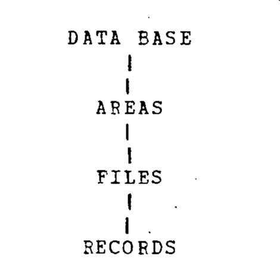
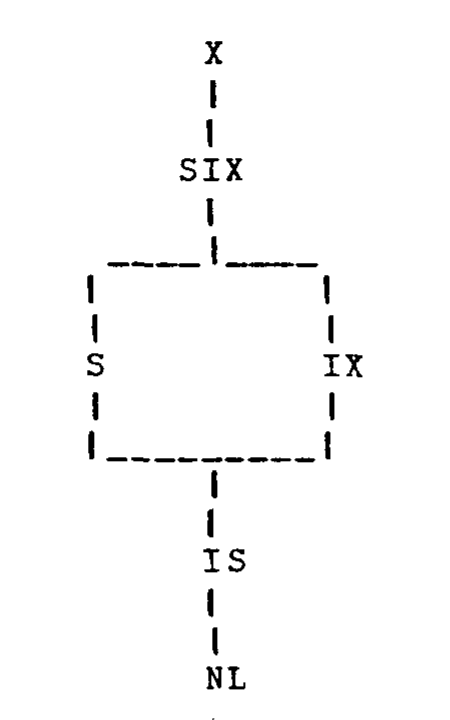
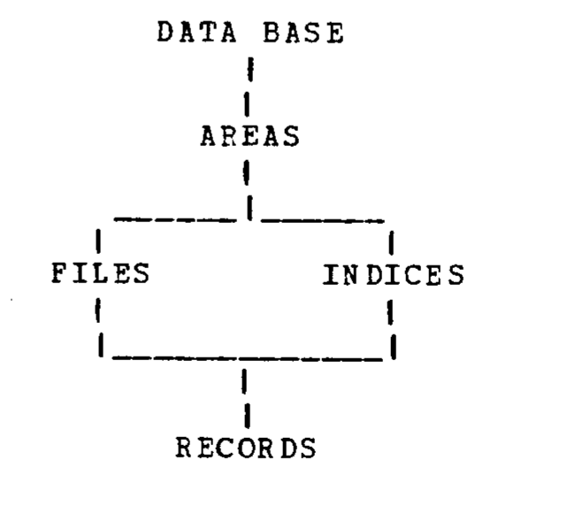
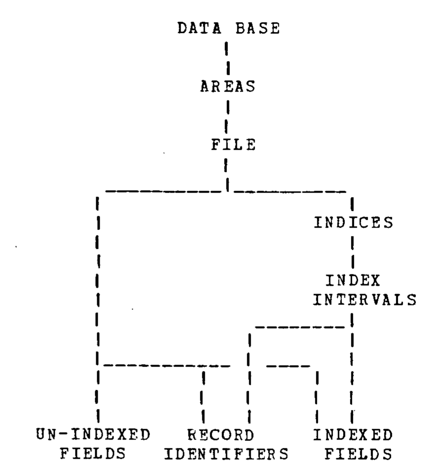
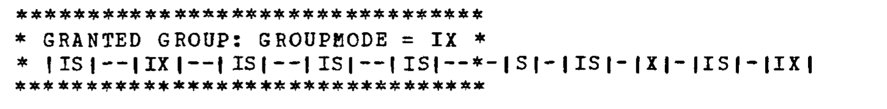
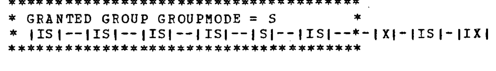
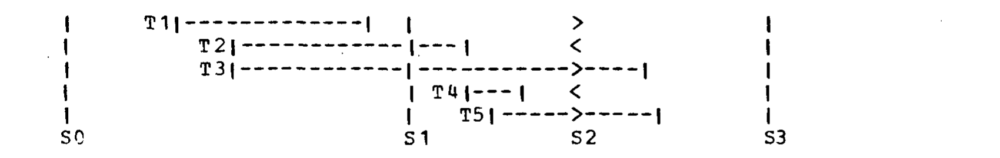
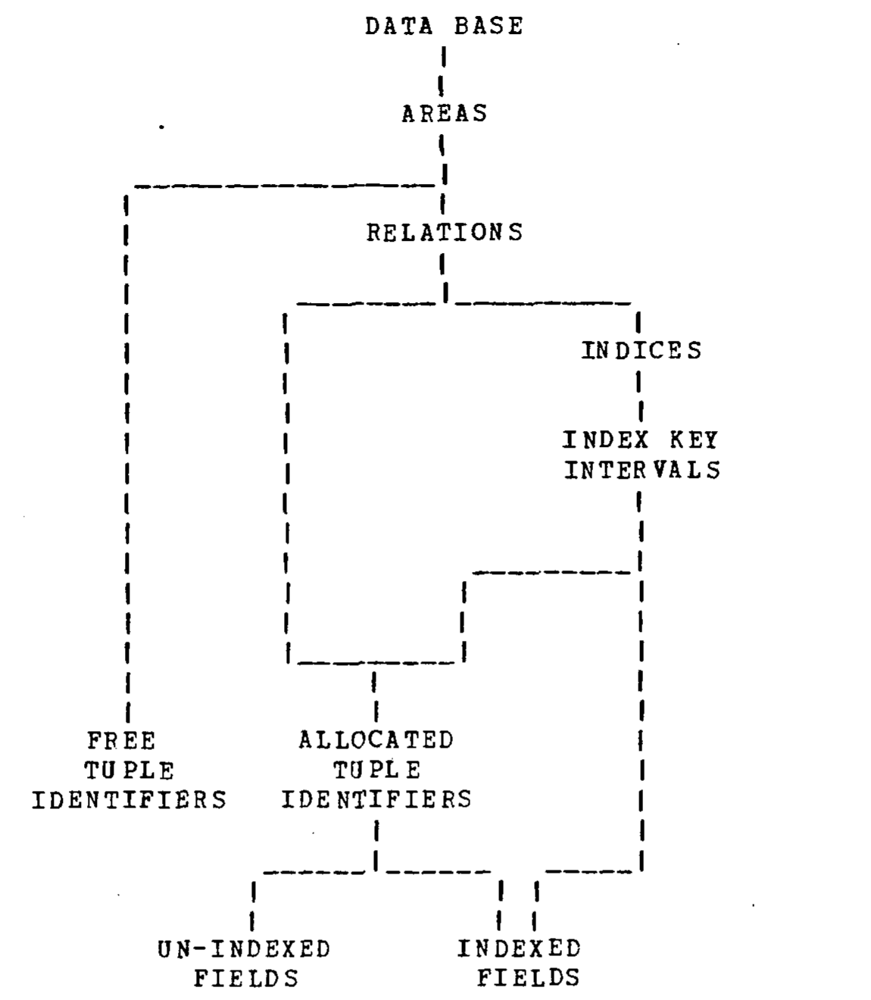

# Granularity of Locks and Degrees of Consistency in a Shared Data Base（中文译文）

## 译者说明

本文依据同目录的 `source.pdf` 翻译。章节、图表、公式、算法、代码与参考文献按原文结构保留。

## 出版信息

- 作者：Jim Gray、Raymond A. Lorie、Gianfranco R. Putzolu、Irving L. Traiger
- 单位：IBM Research Laboratory，San Jose，California
- 收录于：*Modelling in Data Base Management Systems*，G. M. Nijssen 编，North-Holland Publishing Company，1976 年

## 摘要

本文引入如何选择合适的可加锁对象粒度（大小）这一问题，并讨论并发性与开销之间的权衡。文中给出一种锁协议，使不同事务可以同时在不同粒度上加锁。该协议除传统的共享模式和排他模式外，还引入了额外的锁模式，并证明它与传统协议等价。

随后，本文分析共享环境中的一致性问题。讨论的出发点是：一些现有数据库系统采用自动锁协议，只防止某些类型的不一致，例如事务回退造成的不一致，因而自动提供的只是一种有限的一致性程度。本文引入四种一致性度，大致可描述为：度 0 防止你的更新破坏别人；度 1 进一步防止更新丢失；度 2 进一步防止读到错误的数据项；度 3 进一步防止读到数据项之间错误的关系，也就是提供完全保护。接下来讨论这四个度与锁协议、并发性、开销、恢复和事务结构之间的关系。最后，本文将这些思想与当时已有的数据库管理系统相比较。

## 1. 锁粒度

数据库管理系统设计中的一个重要问题，是选择可加锁单元，也就是为保证一致性而以原子方式加锁的数据聚合。可加锁单元的例子包括区域、文件、单条记录、字段值以及字段值区间。

可加锁单元的选择体现了并发性与开销之间的权衡，而这种权衡与单元本身的大小或粒度有关。一方面，选择细粒度单元（如记录或字段）能够提高并发性，适合只访问少量记录的“简单”事务。另一方面，对访问大量记录的“复杂”事务而言，细粒度锁代价很高：事务必须设置和释放大量锁，既产生多次调用锁子系统的计算开销，也产生表示大量锁的存储开销。粗粒度单元（如文件）可能更适合访问许多记录的事务，但它会妨碍只想锁住文件中一个成员的事务。因此，同一系统中最好能让不同粒度的可加锁单元并存。

我们给出一种满足这些要求的锁协议，并讨论锁请求的调度、授予和转换等实现问题。

### 层次锁

先假设待加锁资源集合组织成一个层次结构。这里的层次只用于组织资源集合，与数据库系统采用的数据模型无关。图 1 给出一个示例。我们把层次的每一级称为一种节点类型，它是该级所有节点实例的通称。例如，数据库节点的直接后代是区域节点；每个区域的直接后代是文件节点；每个文件的直接后代是记录节点。由于它是层次结构，每个节点都有唯一的父节点。



层次中的每个节点都可以加锁。如果请求对某个节点取得排他访问（X），请求获准后，请求者对该节点及其每个后代都隐式拥有排他访问。如果请求对某个节点取得共享访问（S），请求获准后，请求者对该节点及其每个后代都隐式拥有共享访问。这两种访问模式锁定以所请求节点为根的整棵子树。

我们的目标是找到一种隐式锁定整棵子树的技术。要以共享或排他模式锁定以节点 R 为根的子树，就必须阻止在 R 的祖先上设置会隐式锁住 R 及其后代的共享锁或排他锁。为此引入一种新的访问模式：意向模式（I）。意向模式用于“标记”（锁住）所有祖先，表明将要在更细一级以共享或排他模式加锁，从而阻止在这些祖先上设置隐式或显式的排他锁和共享锁。

锁定以 R 为根的子树时，协议先以意向模式锁住 R 的全部祖先，再以排他或共享模式锁住 R。例如，按照图 1，要锁住某个文件，应先取得数据库和包含该文件的区域上的意向访问，再请求文件自身的排他（或共享）访问。这会隐式地以排他（或共享）模式锁住文件中的全部记录。

### 访问模式及兼容性

如果两个不同事务对同一节点的锁请求可以同时获准，我们称二者兼容。请求模式决定它与其他事务请求的兼容性。X、S 和 I 三种模式彼此不兼容，但不同的 S 请求可以共同获准，不同的 I 请求也可以共同获准。

各模式的兼容关系来自其语义。共享模式允许请求者和其他事务读取对应资源，但不允许修改。排他模式允许获得者读写资源，但在排他锁存在期间，其他事务都不得读写该资源。区分共享访问和排他访问，是因为多个共享请求可以并发获准，而排他请求与任何其他请求都不兼容。意向模式被设计成与共享模式和排他模式不兼容，以阻止共享锁和排他锁，但意向模式彼此兼容。两个事务同时对某节点拥有意向访问时，会继续在其后代上显式设置 X、S 或 I 锁；冲突要么不会发生，要么会在更细一级的请求上得到调度。例如，两个事务可以同时在数据库、某一区域和某一文件上取得意向锁，二者对文件内具体记录设置的显式锁再负责解决冲突。

出于两个原因，意向模式进一步细分为意向共享（IS）和意向排他（IX）。第一，持有 IS 的事务在树的下层只请求 S 或 IS，而不会在其下请求排他锁，所以 IS 可以与 S 兼容。只读是常见访问方式，单独区分可以提高并发性。第二，事务持有节点上的 IS 后可以把它转换为 S，但不能把 IX 转换为 S；若要同时取得 S 和 IX 的权限，必须取得 X 或 SIX 锁。后文“转换”一节将继续讨论这一点。

还需要一种共享并意向排他模式（SIX）。设某事务想读完整棵子树，同时更新其中若干节点。只使用已有模式时，它可以：（a）对根请求 X，不再设置其他锁；或（b）对根请求 IX，再在下层节点显式设置意向锁、共享锁或排他锁。方案（a）并发性低；如果读取的节点中只有少数会更新，方案（b）的加锁开销很高。理想的模式应同时提供整棵子树上的共享访问，使读取无须继续加锁；又提供子树上的意向排他访问，使事务能对要更新的节点设置 X，并对中间节点设置 IX 或 SIX。由于这种情形很常见，我们为此引入 SIX。它与 IS 兼容，因为请求 IS 的其他事务只会在更低节点显式设置 IS 或 S，从而避开 SIX 事务产生的更新（IX 或 X）；但 SIX 与 IX、S、SIX、X 均不兼容。

表 1 给出各请求模式的兼容性。为完整起见，还引入空模式 NL，表示事务没有对资源提出请求。

**表 1：访问模式之间的兼容性。**

| 已持有模式 / 请求模式 | NL | IS | IX | S | SIX | X |
| --- | --- | --- | --- | --- | --- | --- |
| NL | 是 | 是 | 是 | 是 | 是 | 是 |
| IS | 是 | 是 | 是 | 是 | 是 | 否 |
| IX | 是 | 是 | 是 | 否 | 否 | 否 |
| S | 是 | 是 | 否 | 是 | 否 | 否 |
| SIX | 是 | 是 | 否 | 否 | 否 | 否 |
| X | 是 | 否 | 否 | 否 | 否 | 否 |

六种资源访问模式可概括如下：

- **NL**：不提供节点访问，表示没有请求该资源。
- **IS**：提供所请求节点上的意向共享访问，允许请求者以 S 或 IS 锁定后代节点；它本身不产生隐式锁。
- **IX**：提供所请求节点上的意向排他访问，允许请求者显式地以 X、S、SIX、IX 或 IS 锁定后代；它本身不产生隐式锁。
- **S**：提供所请求节点及其所有后代上的共享访问，无须继续加锁；等价于在所有后代上隐式设置 S 锁。
- **SIX**：提供所请求节点上的共享访问和意向排他访问；具体而言，它在所有后代上隐式设置 S，同时允许请求者对后代显式设置 X、SIX 或 IX。
- **X**：提供所请求节点及其所有后代上的排他访问，无须继续加锁；等价于在所有后代上隐式设置 X。再在下层设置 S 或 IS 不会增加权限。

IS 是最弱的非空访问形式，权限少于 IX 或 S。IX 允许在后代上设置 IS、IX、S、SIX、X；S 则无须继续加锁即可只读访问所有后代。SIX 同时具备 S 和 IX 的权限，名称也由此而来。X 权限最强，无须继续加锁即可读写所有后代。因此这些模式按权限构成图 2 所示的偏序（格）。它不是全序，因为 IX 与 S 不可比较。



### 请求节点的规则

如果允许事务直接跳进树的中间并随意加锁，隐式锁就无法工作。S 和 X 所代表的隐式锁要求所有事务遵守以下协议：

1. 请求节点上的 S 或 IS 前，请求者必须以 IX 或 IS 持有该节点的全部祖先。
2. 请求节点上的 X、SIX 或 IX 前，请求者必须以 SIX 或 IX 持有该节点的全部祖先。
3. 锁应当在事务结束时以任意顺序释放，或按叶到根的顺序释放。尤其是，若锁不一直持有到事务结束，就不能在释放祖先后继续持有其后代上的锁。

换言之，锁按根到叶的顺序请求，按叶到根的顺序释放。叶节点没有后代，因此从不以意向模式请求叶节点。

### 若干例子

读记录 R：

```text
以 IS 模式锁数据库
以 IS 模式锁包含 R 的区域
以 IS 模式锁包含 R 的文件
以 S  模式锁记录 R
```

不必被锁的数量吓到；事务很可能已经持有数据库、区域和文件上的锁。

以写排他方式锁记录 R：

```text
以 IX 模式锁数据库
以 IX 模式锁包含 R 的区域
以 IX 模式锁包含 R 的文件
以 X  模式锁记录 R
```

如果这个例子与上例访问的是不同记录，即使二者位于同一文件，不同事务的两组请求仍可同时获准。

以读写方式锁文件 F：

```text
以 IX 模式锁数据库
以 IX 模式锁包含 F 的区域
以 X  模式锁文件 F
```

这会保留对文件的排他访问。如果它与前两个例子使用同一文件，那么本事务或其他事务必须等待。

完整扫描文件 F，并偶尔更新：

```text
以 IX  模式锁数据库
以 IX  模式锁包含 F 的区域
以 SIX 模式锁文件 F
```

之后，可对 F 中需要更新的具体记录设置 X。与前一个例子不同，本事务可以同第一个读记录的例子兼容，这正是引入 SIX 的原因。

让数据库进入静止状态：

```text
以 X 模式锁数据库
```

这会把所有其他事务排除在外。

### 锁的有向无环图

以上概念可以从资源层次推广到资源的有向无环图（DAG）；树只是简单的 DAG。关键观察是：要隐式或显式锁住某个节点，应当锁住该节点在 DAG 中的所有父节点，归纳而言也就是锁住所有祖先。特别地，要锁住一个子图，必须以适当模式隐式或显式锁住该子图的所有祖先；树中只有一个父节点。图 3 是一个非层次结构的例子。



这里假设区域是“物理”概念，而文件、索引和记录是逻辑概念。数据库由区域组成；每个区域包含文件和索引；每个文件在同一区域内有一个对应索引。每条记录既属于某个文件，也属于该文件对应的索引。记录由字段值组成，某个字段由与其所在文件关联的索引进行索引。文件提供到记录的顺序访问路径，索引提供基于字段值到记录的关联访问路径。因为从不单独锁字段，所以锁图中没有字段节点。

写文件 F 中、索引 I 所覆盖的记录 R：

```text
以 IX 模式锁数据库
以 IX 模式锁包含 F 的区域
以 IX 模式锁文件 F
以 IX 模式锁索引 I
以 X  模式锁记录 R
```

注意，通向 R 的所有路径都被锁住。另一种办法是以 X 锁住 F 和 I，从而隐式地以 X 锁住 R。

更完整地说，节点可以通过请求自身被**显式**锁住，也可以由祖先上的适当显式锁被**隐式**锁住，模式为 IS、IX、S、SIX 或 X。对 DAG，需要如下扩展隐式锁的定义和显式锁协议。

如果一个节点至少有一个父节点被某事务以 S、SIX 或 X 隐式或显式持有，则该节点被该事务隐式授予 S。归纳而言，节点至少有一个祖先必须被事务显式授予 S、SIX 或 X。

如果一个节点的**所有**父节点都被某事务以 X 隐式或显式持有，则该节点被隐式授予 X。等价地，从该节点到图中各根的全部路径存在一个节点割集：割集内每个节点都由事务显式持有 X，而割集节点的全部祖先都由事务显式持有 IX 或 SIX。

根据图 2，隐式获得 S 的节点也隐式获得 IS；隐式获得 X 的节点也隐式获得 IS、IX、S 和 SIX。

DAG 上显式请求锁的协议为：

1. 请求节点上的 S 或 IS 前，应当先以 IS（或更强）请求至少一个父节点，归纳而言即锁住一条通向根的路径。于是沿该路径的祖先都不能被其他事务以不兼容于 IS 的模式持有。
2. 请求节点上的 IX、SIX 或 X 前，应当先以 IX（或更强）请求该节点的全部父节点。于是全部祖先都以 IX（或更强）持有，不能被其他事务以不兼容于 IX 的 S、SIX 或 X 持有。
3. 锁应在事务结束时以任意顺序释放，或按叶到根的顺序释放。如果锁没有一直持有到事务结束，就不能在释放祖先后继续持有更低层的锁。

以图 3 为例，顺序扫描文件 F 的全部记录不需要使用索引，可通过下列请求隐式取得文件中每条记录的 S：

```text
以 IS 模式锁数据库
以 IS 模式锁包含 F 的区域
以 S  模式锁文件 F
```

反过来，通过文件 F 的索引 I 读取记录时，不需要对 F 取得显式或隐式锁：

```text
以 IS 模式锁数据库
以 IS 模式锁包含 R 的区域
以 S  模式锁索引 I
```

这同样对索引 I 中（也就是文件 F 中）的所有记录隐式提供 S。这两个读例子都只锁住了一条路径。

但要在文件 F 及索引 I 中插入、删除或更新记录 R，就必须显式或隐式锁住 R 的全部祖先。前面的例子展示了如何对一条记录取得显式 X。要隐式取得文件内全部记录的 X，可以直接以 X 锁住索引和文件，或以 X 锁住区域。后一类做法允许批量装载或更新文件而不再加锁，因为文件内所有记录都已隐式获得 X。

### 锁协议等价性的证明

下面证明上述锁协议等价于一种传统协议：传统协议只有 S 和 X 两种模式，并且只显式锁定原子资源，也就是树的叶或 DAG 的汇。

令 $G=(N,A)$ 为有限有向无环图，其中 $N$ 是节点集， $A$ 是边集。假定 $G$ 无环，即不存在从节点 $n$ 出发又返回 $n$ 的非空路径。若存在从 $p$ 到 $n$ 的边，则 $p$ 是 $n$ 的父节点， $n$ 是 $p$ 的子节点。没有父节点的节点称为源，没有子节点的节点称为汇。令 $SI$ 为 $G$ 的汇集合。节点 $n$ 的祖先，是从某个源到 $n$ 的任一路径上的节点，包括 $n$ 本身。汇 $n$ 的一个节点切片，是一组节点，使得从任一源到 $n$ 的每条路径至少包含切片中的一个节点。

再引入锁模式集合

$$
M=\lbrace{}NL,IS,IX,S,SIX,X\rbrace{},
$$

以及表 1 定义的兼容矩阵 $C:M\times M\to\lbrace{}YES,NO\rbrace{}$。令 $m=\lbrace{}NL,S,X\rbrace{}$， $c:m\times m\to\lbrace{}YES,NO\rbrace{}$ 是 $C$ 在 $m$ 上的限制。

一个**锁图**是映射 $L:N\to M$，并满足：

1. 若 $L(n)\in\lbrace{}IS,S\rbrace{}$，则 $n$ 要么是源，要么存在父节点 $p$ 使 $L(p)\in\lbrace{}IS,IX,S,SIX,X\rbrace{}$。归纳而言，从某个源到 $n$ 存在一条路径， $L$ 在其上只取 $\lbrace{}IS,IX,S,SIX,X\rbrace{}$ 中的值；等价地， $L$ 在这条路径上不取 NL。
2. 若 $L(n)\in\lbrace{}IX,SIX,X\rbrace{}$，则 $n$ 要么是根，要么对它的全部父节点 $p_1,\ldots,p_k$ 都有 $L(p_i)\in\lbrace{}IX,SIX,X\rbrace{}$（ $i=1,\ldots,k$）。归纳而言， $L$ 在 $n$ 的全部祖先上只取 $\lbrace{}IX,SIX,X\rbrace{}$ 中的值。

锁图描述某个遵守六模式锁协议的事务所持有的显式锁。为刻画该事务在原子资源上取得的隐式锁集合，引入锁图的投影。

锁图 $L$ 的**投影**是映射 $l:SI\to m$，定义如下：

1. 若存在汇 $n$ 的节点切片 $\lbrace{}n_1,\ldots,n_s\rbrace{}$，且切片内每个节点均有 $L(n_i)=X$，则 $l(n)=X$。
2. 若不满足条件 1，但存在 $n$ 的某个祖先 $a$ 使 $L(a)\in\lbrace{}S,SIX,X\rbrace{}$，则 $l(n)=S$。
3. 若条件 1 和 2 均不满足，则 $l(n)=NL$。

若对所有 $n\in N$ 都有 $C(L_1(n),L_2(n))=YES$，则称两个锁图 $L_1,L_2$ 兼容。类似地，若对所有 $n\in SI$ 都有 $c(l_1(n),l_2(n))=YES$，则称两个投影 $l_1,l_2$ 兼容。

**定理。** 如果两个锁图 $L_1,L_2$ 兼容，则它们的投影 $l_1,l_2$ 也兼容。换言之，如果两个事务设置的显式锁不冲突，那么它们隐式取得的三状态锁也不冲突。

**证明。** 假设 $l_1,l_2$ 不兼容，我们证明 $L_1,L_2$ 不兼容。根据兼容性的定义，必存在汇 $n$，使 $l_1(n)=X$ 且 $l_2(n)\in\lbrace{}S,X\rbrace{}$，或反之。根据投影的定义，必存在 $n$ 的节点切片 $\lbrace{}n_1,\ldots,n_s\rbrace{}$，使 $L_1(n_1)=\cdots=L_1(n_s)=X$；还存在 $n$ 的某个祖先 $n_0$，使 $L_2(n_0)\in\lbrace{}S,SIX,X\rbrace{}$。根据锁图定义，存在从某个源到 $n_0$ 的路径 $P_1$， $L_2$ 在这条路径上不取 NL。

如果 $P_1$ 在 $n_i$ 与节点切片相交，则 $L_1,L_2$ 不兼容，因为 $L_1(n_i)=X$，而 X 与 $L_2(n_i)$ 的非空值不兼容，定理得证。

否则，存在从 $n_0$ 到汇 $n$ 的路径 $P_2$，并在 $n_i$ 与节点切片相交。根据锁图定义， $L_1$ 在 $n_i$ 的所有祖先上都取 $\lbrace{}IX,SIX,X\rbrace{}$ 中的值，特别是 $L_1(n_0)\in\lbrace{}IX,SIX,X\rbrace{}$。又因为 $L_2(n_0)\in\lbrace{}S,SIX,X\rbrace{}$，所以

$$
C(L_1(n_0),L_2(n_0))=NO.
$$

证毕。

### 动态锁图

到目前为止，我们一直假定锁图是静态的。但观察图 3 就会发现并非如此：区域、文件和索引会动态创建和销毁，记录当然也不断插入、更新和删除。如果数据库只读，根本就不需要加锁。

下面用索引区间锁的实现为例，引入动态 DAG 的锁协议。我们不希望只能锁住整个索引或单条记录，而希望能锁住索引值落在某一连续范围内的所有记录。例如，可以锁住银行账户文件中 location 字段等于 Napa 的全部记录。因此，索引被划分为可加锁的键值区间。每条被索引的记录“属于”某个索引区间；文件中某一被索引字段值相同的全部记录都属于同一键值区间，例如所有 Napa 账户都属于同一区间。图 4 展示这一结构。在文献 [1] 中，这类锁称为谓词锁，那里还提出过一种更通用但效率较低的实现。



图 4 唯一微妙之处，是区分被索引字段与未被索引字段。被索引字段值和记录标识符（逻辑地址）都出现在索引中，所以可以直接从索引读取该字段，而不必“触碰”记录。因此，索引区间是对应字段值的父节点。索引还通过记录标识符“指向”具有该值的所有记录，所以也是所有这类记录标识符的父节点。另一方面，读写记录中的未索引字段不会影响索引，因此文件是这些字段唯一的父节点。

更新被索引字段时，该字段及其记录标识符会从一个索引区间移到另一个区间。例如，把一个 Napa 账户迁移到 St. Helena 分行时，账户记录及其 location 字段会“离开”location 索引的 Napa 区间并“加入”St. Helena 区间。插入新记录时，它会加入包含新字段值的区间，也会加入文件；删除则把记录从索引区间和文件中移除。索引不是未索引字段的锁祖先。

图 4 描述的虽是动态 DAG，但仍可采用前一节的协议。为处理锁图的动态变化，还应增加一条规则：

4. 在锁图中移动节点前，节点在其旧位置和新位置都必须被隐式或显式授予 X；而且移动方式不能在图中形成环。

继续本节的例子，把一个 Napa 银行账户迁移到 St. Helena 分行：

```text
以 IX 模式锁数据库
以 IX 模式锁包含账户的区域
以 IX 模式锁账户文件
以 IX 模式锁 location 索引
以 IX 模式锁 Napa 区间
以 IX 模式锁 St. Helena 区间
以 IX 模式锁记录
以 X  模式锁字段
```

另一种做法是对记录和两个索引区间显式请求 X，从而隐式锁住字段。

### 锁请求的调度与授予

前文说明了各请求模式的语义，也说明了请求者必须遵循的协议。下面讨论请求如何调度和授予。

针对某一资源的全部请求都放在一个队列中，由某种公平调度器排序。“公平”意味着没有事务会被无限期延迟。先进先出是最简单的公平调度方式；除死锁抢占决策外，本节采用这种调度器。

队首彼此兼容的一组请求称为**已授予组**，这些请求可以并发获准。假定每个事务在队列中至多有一个请求，则不同事务的两个请求是否兼容只由请求模式决定，可查表 1 得到。已授予组还有一个**组模式**，它是组内各成员模式的上确界，可由图 2 或表 3 计算。表 2 列出可共存于一组的请求类型及其组模式；花括号表示同类请求可以出现多个。

**表 2：可能的请求组及其组模式。**

| 请求模式集合 | 组模式 |
| --- | --- |
| X | X |
| SIX，若干 IS | SIX |
| S，若干 S，若干 IS | S |
| IX，若干 IX，若干 IS | IX |
| IS，若干 IS | IS |

图 5 展示某一资源的请求队列及其模式。已授予组包含五个请求，组模式为 IX。队列中的下一个请求是 S，它与 IX 组模式不兼容，所以必须等待。



新请求到达时，调度器把它追加到队尾。此时分两种情况：要么已经有人等待，要么该资源所有未结束请求都已授予。如果无人等待且新请求与已授予组模式兼容，则可立即授予；否则新请求必须在队列中等待轮到自己，发生死锁时还可能抢占队列中的某些不兼容请求。另一种选择是取消新请求；图 5 中的请求都选择等待。

某个请求离开已授予组时，组模式可能变化。如果队列中第一个等待请求的模式与新的组模式兼容，就授予该请求。在图 5 中，IX 请求离组后，组模式变为 IS；IS 与 S 兼容，因此 S 可以获准。新的组模式将变成 S，S 又与紧随其后的 IS 兼容，所以该 IS 请求也可加入已授予组，得到图 6 的情形。



图 6 中的 X 请求与任何模式都不兼容，只有等已授予组内所有请求都离开后才能获准。

### 转换

事务可能因多种原因再次请求同一资源。它也许忘了自己已访问过该记录；如果事务要设置许多锁，与其每次先问“我以前见过这条记录吗”，不如总是直接请求访问。锁子系统已经拥有回答这一问题的全部信息，在事务中重复保存似乎浪费。另一种情况是，事务知道自己已经能够访问记录，但想提高访问模式，例如扫描文件时先读、再测试，并在某些情况下更新，于是需要从 S 提升到 X。因此锁子系统必须处理事务对同一锁的再次请求。我们称这种再次请求为**转换**。

发现某请求是转换后，用表 3 比较请求者对该资源的旧（已授予）模式和新请求模式，得到二者在图 2 中的上确界，也就是转换后的模式。

**表 3：由新请求模式和旧模式决定的转换后模式。**

| 旧模式 / 新请求模式 | IS | IX | S | SIX | X |
| --- | --- | --- | --- | --- | --- |
| IS | IS | IX | S | SIX | X |
| IX | IX | IX | SIX | SIX | X |
| S | S | SIX | S | SIX | X |
| SIX | SIX | SIX | SIX | SIX | X |
| X | X | X | X | X | X |

例如，原来持有 IX 而又请求 S，转换后的模式就是 SIX。

如果新模式等于旧模式（它绝不会低于旧模式），请求可立即授予，已授予模式不变。如果新模式与已授予组中其他成员的组模式兼容（请求者总与自身兼容），也可以立即授予：已授予模式改成新模式，再按表 2 重算组模式。其他情况下，转换必须等待，直到其他已授予请求的组模式与新模式兼容。转换可以越过等待中的普通请求而立即获准，这对公平调度有轻微违背。

如果两个转换都在等待，而且每个转换都与另一事务已经获准的请求不兼容，就存在死锁，必须抢占其中一个事务已获准的访问。否则总能调度这些等待中的转换：在转换与所有其他已授予模式兼容时授予它。不存在死锁环就保证了这种选择总能找到。

下面的例子说明这些情况。设某一资源的队列如图 7。


现在，第一个事务想转换为 X。它必须等待第二个已经获准的请求离开队列。如果选择等待，队列变成图 8。


因为已有转换在等待，不能再让新请求进入已授予组。通常，转换的调度优先于新请求。如果第二个事务现在转换为 IX、SIX 或 S，可以立即获准，因为这不与第一个事务已授予的 IS 冲突。第二个事务最终离开队列时，第一个转换就可完成，如图 9。


但是，如果第二个事务也想转换为 X，就得到图 10 的队列。


因为 X 与 IS 不兼容（见表 1），每个事务都在等对方离开队列，也就是发生了死锁，因此必须抢占一个事务。在其他所有不存在环的情况下，都能找到一种转换调度，使已授予的访问不受破坏。

### 死锁与锁颠簸

事务只要等待请求获准，就有可能永远困在死锁环中。检测死锁时必须知道谁在等待谁，请求队列提供了这些信息。考虑事务 T 的任一等待请求 R，有两种情况：如果 R 是转换，T 等待队列中所有已获准且与之不兼容的事务；如果 R 不是转换，T 等待它之前所有已授予或正在等待不兼容请求的事务。对全部等待事务算出这个 `WAITING_FOR` 关系后，当且仅当该关系无环时不存在死锁。

每当请求或释放发生、或转换获准时，`WAITING_FOR` 都可能改变。如果一个事务同一时刻至多等待一个请求，死锁状态只会在某个进程决定等待时改变。在这种同步调用锁系统的特殊情况下，只有等待发生时才需要重算 `WAITING_FOR`。如果死锁很少出现，还可周期性检测而不是每次等待都检测，进一步降低计算开销。

一个新请求可能形成多个环，每个环都必须打破。检测到环后，需要抢占某个已授予或等待中的请求。锁调度器应选择总代价最小的一组牺牲者，使全部环都被打破；撤销牺牲者自取得被抢占资源以来对数据库所做的全部修改；再抢占该资源，并通知这些事务已经被回退。

到此讨论的锁调度、死锁检测与解除都属于低层调度决策。它们必须连接到高层事务调度器，由后者控制系统负载以及事务的进入和推进，以避免长时间等待、很高的等待概率（锁颠簸）和死锁。类比而言，一个只有低层页框调度器、以相当天真的方式分配和抢占页框的页面管理系统很容易出现页颠簸；必须配合工作集调度器，控制竞争页框的进程数量和类型。

## 2. 一致性度

现在讨论如何用锁把原子动作组成事务。数据库由以某些方式相互关联的实体组成。这些关系最好理解为关于数据的断言，例如：“Names 是 Telephone-numbers 的索引”；“部门 x 的 Count 值等于 x 中的雇员数”。

如果数据库满足全部断言，就称它是一致的 [1]。有时，为了把数据库转换到新的相一致状态，必须暂时让它不一致。例如，增加一名新雇员涉及多个原子动作以及对多个字段的更新；全部更新完成前，数据库可能不一致。

为处理这种暂时不一致，把原子动作序列组合成事务。事务是一致性单位，是数据库上更大的原子动作，把数据库从一个相一致状态变成另一个相一致状态。事务保持一致性。如果事务中的某个动作失败，就“撤销”整个事务，使数据库回到相一致状态。因此，事务也是恢复单位。硬件故障、系统错误、死锁、保护违规和程序错误都可能导致这种失败。

如果每次只运行一个事务，每个事务都能看到前一事务留下的相一致状态。但若并发调度多个事务，就必须加锁，保证每个事务的输入一致。

请求和释放锁的责任可以由用户承担，也可以交给系统。用户控制的锁利用用户对数据语义的了解，可能设置更少的锁；但它要求困难且可能不可靠的应用编程。因此，一些数据库系统采用自动锁协议，保证不出现某些一般类型的不一致，同时仍要求用户自己防范其他来源的不一致。例如，系统可以自动锁住被更新记录，而不锁读取的记录。这样可以防止事务回退造成的更新丢失，但用户仍应在“读后更新”的序列中显式锁住记录，保证读出的值在实际更新前不会变化。换言之，系统自动保证的只是一种有限的一致性度。它可以是系统范围的，也可以由系统提供选项进行选择，例如把某种锁协议同某个事务或实体关联。

下面给出四种一致性度的若干等价定义。第一个定义是操作性的、直观的，适合向用户描述系统行为；第二个用锁协议作过程化定义，适合解释系统实现；第三个根据系统动作轨迹定义，适合形式化陈述和证明各一致性度的性质。

### 一致性的非形式定义

当事务放弃“撤销”某次写入的权利，从而让新值可供所有其他事务使用时，这次输出（写入）就已经提交。尚未由写入者提交的输出称为未提交数据或脏数据。并发执行带来的问题是：读写其他事务的脏数据可能产生不一致数据。

据此可以定义一致性度。

**定义 1。**

事务 T 看到**度 3 一致性**，当且仅当：

1. T 不覆盖其他事务的脏数据。
2. T 在完成全部写入之前，也就是事务结束（EOT）之前，不提交任何写入。
3. T 不读取其他事务的脏数据。
4. T 完成之前，其他事务不能把 T 已读过的任何数据变脏。

事务 T 看到**度 2 一致性**，当且仅当：

1. T 不覆盖其他事务的脏数据。
2. T 在 EOT 之前不提交任何写入。
3. T 不读取其他事务的脏数据。

事务 T 看到**度 1 一致性**，当且仅当：

1. T 不覆盖其他事务的脏数据。
2. T 在 EOT 之前不提交任何写入。

事务 T 看到**度 0 一致性**，当且仅当：

1. T 不覆盖其他事务的脏数据。

事务若看到较高的一致性度，也同时看到全部较低的一致性度。

度 0 事务在事务结束前就提交写入。因此，要回退一个度 0 事务，可能必须撤销对某个实体的更新，而该实体已被另一个事务锁住。从这个意义上说，度 0 事务不可恢复。

度 1 事务直到结束才提交写入。因此，可以撤销正在进行的度 1 事务而不设置其他锁，事务回退不会擦除其他事务的更新。这是某个数据管理系统自动向所有事务提供度 1 一致性的主要原因。

度 2 一致性把事务同其他事务的未提交数据隔离。度 1 事务可能读到后来又被更新或撤销的未提交值；度 2 事务不会读到脏数据值。

度 3 一致性还把事务同数据值之间的脏关系隔离，使读取可重复。例如，度 2 事务两次读取同一实体时，可能读到两个不同但均已提交的值，因为另一个更新该实体的事务可能在两次读取之间开始、更新并结束。在先读后更新或涉及多个实体时，还可能出现更复杂的并发异常，后文有例子。度 3 一致性把事务与并发产生的不一致完全隔离 [1]。

每个事务都可以选择适合其功能的一致性度。给出第三种定义后，可以更正式地说明这种系统的一致性与恢复性质。简言之：

- 若选择度 $i$，则看到度 $i$ 的相一致状态，前提是其他所有事务至少按度 0 运行。
- 若所有事务至少按度 1 运行，系统回退（撤销全部正在进行的事务）不会丢失已完成事务的更新。
- 若所有事务至少按度 2 运行，事务回退（撤销任一正在进行的事务）会得到相一致状态。

举例说明这些一致性度。设有一个过程控制系统，某事务专门读取仪表，并周期性地把成批读数写入列表；每个仪表读数都是一个实体。出于性能原因，该事务使用度 0，一进入数据库就提交各读数，因此不能恢复。第二个事务周期性读取近期全部读数，计算均值和方差，并把它们写成数据库实体。因为均值与方差必须彼此一致，所以二者必须一起提交；如果事务只写了其中一个就中止，仍能撤销。因此这个统计摘要事务应使用度 1。第三个事务只读取均值并显示，应使用度 2，避免读到随后因回退而被撤销的均值。另一个同时读取均值和方差的事务必须使用度 3，保证均值和方差来自同一次计算，也就是写均值的同一轮也写了方差。

### 用锁协议定义一致性

某次事务实例实际看到度 0、1、2 还是 3，取决于其他并发事务的动作。只要所有事务至少遵守度 0 协议，事务就可以用锁协议保证自己取得某个一致性度，而不依赖其他事务的具体行为。

可以用产生这些一致性度的锁协议作过程化定义。事务锁住输入以保证其一致性，锁住输出以把它们标记为脏数据（未提交数据）。

本节把锁分为共享模式锁和排他模式锁。共享锁允许多个事务读取同一实体，排他锁保留对实体的独占访问。这是“两模式”锁协议，推广到上一节的“六模式”协议很直接。锁还可按持续时间分类：只在单个动作期间持有的叫短期锁，一直持有到事务结束的叫长期锁。短期锁只在一个动作期间标记或检测脏数据，不会持续整个事务。

**定义 2。**

- **度 3 锁协议**：T 对任何被它变脏的数据设置长期排他锁；对任何被它读取的数据设置长期共享锁。
- **度 2 锁协议**：T 对任何被它变脏的数据设置长期排他锁；对任何被它读取的数据设置共享锁，该锁可以是短期的。
- **度 1 锁协议**：T 对任何被它变脏的数据设置长期排他锁。
- **度 0 锁协议**：T 对任何被它变脏的数据设置排他锁，该锁可以是短期的。

可用以下术语更简洁地重述。若事务总是在写实体前对它设置排他锁，就称它对于**写**是良构的；若总是在读实体前对它设置共享锁或排他锁，就称它对于**读**是良构的。事务若对读和写都良构，就称它是良构事务。

若事务在释放某个实体的锁后，不再锁定任何实体，就称它是**两阶段**事务；相应地也可以限定为对于读或更新两阶段。两阶段事务有一个取得锁的增长阶段和一个释放锁的收缩阶段。

定义 2 过于严格，因为一致性并不要求事务把所有锁都持有到 EOT，也就是不必把 EOT 当作收缩阶段；只要求事务是两阶段的就足以保证一致性。另一方面，一旦事务解锁已更新的实体，就提交了该实体；此后若不级联回退任何可能已经读到该实体的事务，就不能再撤销它。为此，收缩阶段通常推迟到事务结束，使事务始终可恢复，并让全部更新一起提交。于是锁协议可以重写为：

**定义 2'。**

- **度 3**：T 是良构的，并且 T 是两阶段的。
- **度 2**：T 是良构的，并且 T 对写是两阶段的。
- **度 1**：T 对写是良构的，并且 T 对写是两阶段的。
- **度 0**：T 对写是良构的。

要求所有事务至少遵守度 0 锁协议，使它们不会更新其他事务尚未提交的更新。度 1、2、3 提供逐步增强的系统保证一致性。

### 调度的一致性

此前根据脏数据定义事务看到某种一致性度。要明确脏数据的含义，必须在一组并发事务中考察某个事务的执行。为此引入事务集合的调度。调度可以看作这组事务所执行动作的历史或审计轨迹。有了调度，就能明确某实体何时被某事务变脏，进而形式化“看到某种一致性度”的含义。这些概念可用来联系前述不同定义并说明它们等价。

系统直接支持实体和动作。动作分为开始动作、结束动作、共享加锁动作、排他加锁动作、解锁动作、读动作和写动作。假定结束动作会释放事务仍持有但未显式释放的所有锁。在下列定义中，共享加锁动作及对应解锁动作还被视为读动作；排他加锁动作及对应解锁动作还被视为写动作。

事务是一个动作序列：从开始动作起，以结束动作止，中间不含其他开始或结束动作。

把一组事务的动作在保持各自序列的前提下合并为一个序列，就得到这组事务的一个**调度**。

调度记录动作的执行顺序，不记录因回退而撤销的动作。最简单的调度先运行一个事务的全部动作，再运行另一个事务的全部动作，依此类推。这种一次只运行一个事务、事务之间没有并发的调度称为串行调度。显然，串行调度不存在并发引起的不一致，也没有事务看到脏数据。

锁限制允许出现的调度集合。特别地，如果某实体已被另一事务以冲突模式锁住，就不能再为当前事务调度对该实体的加锁动作；只有满足此条件的调度才是**合法调度**。

初始状态加上调度完全决定系统行为。沿调度的每一步都可以推导哪些实体值已提交、哪些仍脏；使用锁时，更新后的数据一直到解锁前都属于脏数据。

因为调度明确了脏数据，便可用定义 1 定义相一致调度。

**定义 3。** 若事务 T 在调度 S 中看到度 0（1、2 或 3）一致性，则称 T 在 S 中按度 0（1、2 或 3）一致性运行。反过来，如果所有合法调度都让 T 按度 $i$ 一致性运行，就称 T 看到度 $i$ 一致性。

如果调度 S 中所有事务都按度 0（1、2 或 3）一致性运行，就称 S 是度 0（1、2 或 3）相一致调度。

由此可得：

**断言 1。**

1. 如果每个事务都遵守度 0（1、2 或 3）锁协议（定义 2），则任一合法调度都是度 0（1、2 或 3）相一致的（定义 3）；也就是每个事务都按定义 1 看到度 0（1、2 或 3）一致性。
2. 如果事务 T 不遵守度 1（2 或 3）锁协议，则可以构造另一个确实遵守度 1（2 或 3）锁协议的事务 T'，使 T 与 T' 存在某个合法调度 S，而 T 在 S 中没有按度 1（2 或 3）一致性运行。

文献 [1] 已证明度 3 情形下的断言 1，同一论证可以直接推广到这里。

断言 1 表明：若事务遵守锁协议对一致性的定义（定义 2），就能保证取得根据已提交数据和脏数据给出的非形式定义（定义 1）。如果事务没有实际设置度 1（2 或 3）规定的锁，就可以构造某种事务组合和调度，使它看到更低的一致性度。不过在特定系统中，由于系统结构或使用方式，这种组合可能永不出现；表面上较弱的加锁也可能实际提供度 3。例如，数据库重组通常无须加锁，因为它一般作为离线实用程序运行，从不与其他事务并发。

**断言 2。** 如果事务集合中的每个事务都至少遵守度 0 锁协议，而事务 T 遵守度 1（2 或 3）锁协议，则在该集合的任一合法调度中，T 都按度 1（2 或 3）一致性运行（定义 1、3）。

断言 2 说明，只要所有事务至少遵守度 0，每个事务就可以自行选择一致性度。当然，按度 0、1 或 2 运行的事务，其输出可能也只有度 0、1 或 2，即可能不一致，因为它们可能由不一致输入计算而来。可以想象给每个实体标记写入者的一致性度：度 0 是紫色，度 1 是红色，度 2 是黄色，度 3 是绿色。事务输出的颜色，是事务自身颜色与它所读实体颜色的最小值，因为这些实体可能不一致。除非所有事务都以较高一致性度运行，系统会逐渐变成紫色或红色。如果事务撰写者知道系统结构能让表面上的度 1 协议产生度 3 结果，这种着色会过于悲观；但一般而言，事务必须谨慎读取比自身一致性度更低的实体。

### 事务之间的依赖

如果一个事务从另一个事务取得部分输入，就称前者依赖后者。不同一致性度对依赖的定义不同。调度完全决定这些依赖关系，它们有助于讨论一致性和恢复。

每个调度都在事务集合上定义三个关系 $\lt{}$、 $\lt{}\lt{}$ 和 $\lt{}\lt{}\lt{}$。设事务 T 在调度中的某一步对实体 e 执行动作 a，另一事务 T' 在较后一步对同一实体 e 执行动作 a'，且 $T\ne T'$，则：

$$
\begin{aligned}
T \lt{}\lt{}\lt{} T' \quad &\text{若 }(a,a')\in\lbrace{}(W,W),(W,R),(R,W)\rbrace{},\\
T \lt{}\lt{} T' \quad &\text{若 }(a,a')\in\lbrace{}(W,W),(W,R)\rbrace{},\\
T \lt{} T' \quad &\text{若 }(a,a')=(W,W).
\end{aligned}
$$

因此，度 1 完全不考虑读依赖；度 2 只考虑一种读依赖；度 3 只忽略读-读依赖，因为读之间可交换。用紧凑记法表示为：

```text
<<< : W->W | W->R | R->W
 << : W->W | W->R
  < : W->W
```

例如，若 T 写出的某值后来被 T' 读取或写入，或 T 读取的某值后来被 T' 写入，就有 $T\lt{}\lt{}\lt{}T'$。

令 $\lt^{\ast}$ 为 $\lt{}$ 的传递闭包，并定义：

$$
BEFORE_1(T)=\lbrace{}T'\mid T'\lt^{\ast}T\rbrace{},\qquad
AFTER_1(T)=\lbrace{}T'\mid T\lt^{\ast}T'\rbrace{}.
$$

 $BEFORE_2$、 $AFTER_2$、 $BEFORE_3$ 和 $AFTER_3$ 分别根据 $\lt{}\lt{}$、 $\lt{}\lt{}\lt{}$ 以同样方式定义。

显然，每个 BEFORE 集是向 T 提供输入的事务集合，每个 AFTER 集是从 T 取得输入的事务集合；这里的次序只考虑相应一致性度引入的依赖。

如果某事务在某个调度中既位于 T 之前又位于 T 之后，那么任何串行调度都不能得到同样结果，此时并发引入了不一致。反之，如果所有相关事务都要么在 T 之前、要么在 T 之后而不同时属于两者，T 就会看到相应度的相一致状态。如果所有事务都以这种方式把其他事务二分，则 $\lt^{\ast}$（ $\lt{}\lt^{\ast}$ 或 $\lt{}\lt{}\lt^{\ast}$）是偏序，整个调度具有度 1（2 或 3）一致性。更强地说：

**断言 3。** 一个调度是度 1（2 或 3）相一致的，当且仅当关系 $\lt^{\ast}$（ $\lt{}\lt^{\ast}$ 或 $\lt{}\lt{}\lt^{\ast}$）是偏序。

关系 $\lt{}$、 $\lt{}\lt{}$、 $\lt{}\lt{}\lt{}$ 是文献 [1] 中依赖集的变体。该文只引入度 3，并证明了这种情形的断言 3。特别地，这样的调度等价于按 $\lt{}\lt{}\lt{}$ 次序一次执行一个事务得到的串行调度。文献 [1] 的证明很容易推广到度 1 和度 2。

考虑下列例子：

```text
T1 LOCK   A
T1 READ   A
T1 UNLOCK A
T2 LOCK   A
T2 WRITE  A
T2 LOCK   B
T2 WRITE  B
T2 UNLOCK A
T2 UNLOCK B
T1 LOCK   B
T1 WRITE  B
T1 UNLOCK B
```

在该调度中，T2 把 B 交给 T1，而且 T2 在 T1 读取 A 后更新 A，所以

$$
T2\lt{}T1,\quad T2\lt{}\lt{}T1,\quad T2\lt{}\lt{}\lt{}T1,\quad T1\lt{}\lt{}\lt{}T2.
$$

该调度是度 2 相一致的，但不是度 3 相一致的。它让 T1 按度 2 运行，让 T2 按度 3 运行。

如果能把“事务看到度 1（2 或 3）一致性”定义为某个调度中 BEFORE 与 AFTER 集不相交，形式会很漂亮，但这个条件不够强。要用依赖陈述定义 1，必须要求在**所有**调度中这两个集合都不相交。此外，度 0 的依赖似乎没有自然定义。因此，依赖定义主要用作证明技术，并用于讨论调度和恢复。

### 与事务回退和系统恢复的关系

如果事务 T 能在 EOT 前撤销，而不撤销其他事务的更新，就称 T 是**可恢复的**。如果 T 在恢复后重新运行能够重现原来的输出，且假定回退过程没有释放任何锁，就称 T 是**可重复的**。可恢复性要求系统范围的度 1 一致性；可重复性要求所有其他事务至少达到度 1，并要求可重复事务自身达到度 3。

数据库系统正常、无故障的运行，可以描述为：从初始相一致状态 S0 出发，一个事务调度把数据库映射到最终相一致状态 S3，如图 11 所示。S1 是检查点状态；因为仍有事务正在进行，S1 可能不一致。系统崩溃把数据库留在 S2。由于 T3 和 T5 在崩溃时尚未结束，S2 可能不一致。系统恢复就是通过下列一种方式把数据库带到新的相一致状态：

1. 从 S2 开始，撤销崩溃时仍在进行的事务的全部动作。
2. 从 S1 开始，先撤销崩溃时仍在进行的事务在 S1 以前的全部动作，也就是 T3 和 T5 的动作；再重做在崩溃前已完成的事务在 S1 之后的全部动作，也就是 T2 和 T4 的动作。
3. 从 S0 开始，重做崩溃前完成的全部事务。

方式 1 和 3 是方式 2 的退化情形。

原文方案 2 的括号内把事务号印成“撤销 T3 和 T4、重做 T2 和 T3”，但同段明确指出崩溃时未完成的是 T3 和 T5，图 11 也显示未完成事务为 T3、T5，已完成事务为 T2、T4；上文据此按同段定义与图 11 转写。



除非所有事务至少按度 1 一致性运行，否则系统恢复可能丢失更新。例如，T3 写记录 r，随后 T4 又更新 r，那么撤销 T3 会使 T4 对 r 的更新丢失。只有某事务没有把写锁持有到 EOT 时，才会出现这种情况。

1. 如果全部事务至少按度 1 运行，系统恢复不会丢失已完成事务的更新。但可能不存在能得到相同结果的调度，因为有些事务可能读过后来被撤销的事务输出。
2. 如果全部事务至少按度 2 运行，恢复后的状态是一致的，来自原系统调度删除未完成事务后的调度。度 2 防止对可能被系统恢复撤销的事务产生读依赖，因此全部已完成事务会形成有意义的调度。
3. 如果某事务达到度 3，它就是可重现的。

事务崩溃引发事务回退，其性质与系统恢复类似。

### 各一致性度的代价

较低一致性度唯一的优点是性能。锁得少，就消耗较少的计算和存储；冲突较少，也能提高并发性。第一节的粒度锁方案正是为了减少显式锁数量。

下面非常粗略地估算不同一致性度的锁协议所消耗的存储与计算资源。本节余下部分假设所有事务都相同，每个事务执行 R 次读和 W 次写，因而大约设置 R 个共享锁和 W 个排他锁；还假设所有事务运行在同一一致性度。

每个未结束的锁请求占用一个队列元素。每个事务所需队列元素的最大数量如下。

**表 4：一致性度与存储消耗。**

| 一致性度 | 存储量（队列元素数） |
| --- | ---: |
| 0 | 1 |
| 1 | W |
| 2 | W + 1 |
| 3 | W + R |

度 1 和度 2 消耗的存储量大致相同，度 3 则明显更多。实际差距还会因读通常比写多十倍而进一步扩大。

计算（CPU）开销更难估算，这里只作粗略估计。先看请求和释放锁的开销，表 5 给出各一致性度调用锁系统的次数。

**表 5：一致性度与计算开销。**

| 一致性度 | CPU（调用锁系统的次数） |
| --- | ---: |
| 0 | W |
| 1 | W |
| 2 | W + R |
| 3 | W + R |

表 5 表明度 2 与度 3 的计算开销相当，都大于度 0 或度 1。每一对设置相同的锁，只是持有时间不同。

表 5 忽略了一个事实：某些锁请求很容易满足，也就是立即获准；另一些则会触发任务切换，因而非常昂贵。读锁需要等待的概率，与当前已授予且发生冲突的写锁数成正比；写锁需要等待的概率，与当前已授予且发生冲突的读锁或写锁数成正比。表 4 给出了每个事务持有各类锁的最大数量估计。若系统中有 $2N+1$ 个事务，可以用表 4 的条目乘以 N，估计所有其他事务平均持有的锁数。

设等待的锁请求成本是立即获准请求的 $C+1$ 倍，P 是两个不同请求指向同一资源的概率，则相对计算成本可以粗略分解为：

```text
度 0：W                   设置锁的成本
      P*C*N*W             等待成本

度 1：W                   写锁成本
      P*C*N*W*W           等待成本

度 2：W+R                 设置锁的成本
      P*C*N*W*(W+1)       写等待成本
      P*C*N*R*W           读等待成本

度 3：W+R                 设置锁的成本
      P*C*N*W*(W+R)       写等待成本
      P*C*N*R*W           读等待成本
```

合并各项得到表 6。

**表 6：计入等待后，一致性度与计算开销。**

| 一致性度 | CPU（调用锁系统的等价成本） |
| --- | --- |
| 0 | $W + P\cdot C\cdot N\cdot W\cdot 1$ |
| 1 | $W + P\cdot C\cdot N\cdot W\cdot W$ |
| 2 | $W+R + P\cdot C\cdot N\cdot W\cdot(W+R+1)$ |
| 3 | $W+R + P\cdot C\cdot N\cdot W\cdot(W+2R)$ |

以具体例子说明：一个简单的银行事务执行 5 次读（ $R=5$）和 6 次写（ $W=6$）。事务随机访问账户，而系统中有数百万账户，所以冲突概率 $P$ 约为 0.000001。假设每秒有 100 个事务。加锁耗费 100 条指令，等待需要 5000 条指令，因此 $C=50$。于是

$$
P\cdot C\cdot N\cdot W=0.015.
$$

这说明表 5 已经很好地估计了 CPU 开销，因为表 6 的最后一项与 $W+R$ 相比微不足道。当然，分析对 P 极其敏感，数据库必须设计成让 P 很小。

这些估算最醒目的结论是：度 2 与度 3 的计算开销看来相近，但都显著高于度 0 或度 1。我们认为，更细致的研究很可能仍会得到这一结论。

**表 7：一致性度汇总。**

| 问题 | 度 0 | 度 1 | 度 2 | 度 3 |
| --- | --- | --- | --- | --- |
| 已提交数据 | 写入立即提交 | 写入在 EOT 提交 | 与度 1 相同 | 与度 1 相同 |
| 脏数据 | 不更新脏数据 | 度 0，且别人不能更新你的脏数据 | 度 0、1，且不读脏数据 | 度 0、1、2，且别人不能把你读过的数据变脏 |
| 锁协议 | 对写入的数据设置短期排他锁 | 对写入的数据设置长期排他锁 | 度 1，另对读数据设置短期共享锁 | 度 1，另对读数据设置长期共享锁 |
| 事务结构 | 对写良构 | 对写良构并对写两阶段 | 良构并对写两阶段 | 良构且两阶段 |
| 并发性 | 最高：只等待短期写锁 | 高：只等待写锁 | 中：还要等待读锁 | 最低：接触的任何数据都锁至 EOT |
| 开销 | 最低：只设置短期写锁 | 小：只设置写锁 | 中：设置两类锁，但短期锁不必存储 | 最高：设置并存储两类锁 |
| 事务回退 | 不级联到其他事务就无法撤销 | 可以按任意顺序撤销全部未完成事务 | 可以按任意顺序撤销任一未完成事务 | 与度 2 相同 |
| 提供的保护 | 允许其他事务运行在更高一致性度 | 度 0，且不会丢失写入 | 度 0、1，且不会读到错误数据项 | 度 0、1、2，且不会读到错误的数据关系 |
| 系统恢复方法 | 按日志到达顺序应用日志 | 按 $\lt{}$ 顺序应用日志 | 与度 1 相同，但结果等价于某个调度 | 度 2，且调度是串行的 |
| 依赖 | 无 | W->W | W->W、W->R | W->W、W->R、R->W |
| 次序关系 | 无 | $\lt{}$ 是事务上的次序 | $\lt{}\lt{}$ 是事务上的次序 | $\lt{}\lt{}\lt{}$ 是事务上的次序 |

## 3. 现有系统中的锁粒度与一致性度

带程序隔离功能的 IMS/VS [2] 使用两层锁层次：段类型（记录集合）和段类型内的段实例（记录）。段类型可按 EXCLUSIVE（E）模式加锁，对应本文的排他（X）；也可按 EXPRESS READ（R）、RETRIEVE（G）或 UPDATE（U）模式加锁，这三者都对应本文的意向（I）[2，第 3.18-3.27 页]。段实例可以按共享或排他模式加锁。段类型锁在事务开始时请求，通常使用意向模式；段实例锁则随事务推进动态设置。

此外，IMS/VS 还支持由用户控制的段实例共享锁（`*Q` 选项），它允许其他读请求，但不允许其他 `*Q` 请求或排他请求。IMS/VS 没有段类型上的 S 或 SIX；这两种模式原本可让事务扫描某段类型的所有成员，与其他读者并发，又不必逐个锁住段实例。因为 IMS/VS 不支持段类型上的 S，也就无须区分 IS 与 IX。总体而言，IMS/VS 有意向模式和隐式锁，但没有本文描述的全部模式；它采用静态的两层锁树。

带程序隔离功能的 IMS/VS 基本提供度 2 一致性。不过，在 PCB（视图）中把某段指定为 EXPRESS READ，可以按段类型取得度 1；指定 EXCLUSIVE 或 UPDATE 则可取得度 3。IMS/VS 还提供上述用户控制的共享锁，程序可以在选定的段实例上请求它，在系统所提供的度 1 或度 2 之上取得额外一致性。

不带程序隔离功能的 IMS/VS，以及更早版本 IMS/2，没有锁层次，因为只在段类型一级加锁。它提供度 1；在视图中把某段类型指定为 EXCLUSIVE，可以为该段类型取得度 3。HOLD 选项还提供有限的用户控制加锁。

DMS 1100 使用两层锁层次 [3]：区域和区域内的页。区域在 OPEN 时可以使用七种模式之一，其中包括：EXCLUSIVE RETRIEVAL，对应本文的排他模式；PROTECTED UPDATE，对应共享并意向排他；PROTECTED RETRIEVAL，即本文的共享模式；UPDATE，对应意向排他；RETRIEVAL，对应意向共享。按这种名称对照，表 1 的兼容矩阵与 DMS 1100 的兼容矩阵完全相同 [3，第 3.59 页]。原文在本段首次引用 DMS 1100 时印作 [4]，但文末只有 [1]–[3]，且系统名称、文献内容与页码明确对应 [3]；此处据此统一为 [3]。

不过，DMS 1100 对区域内的页只设置排他锁；沿内部指针访问时设置的短期共享锁对外不可见。而且，即使事务已经以排他模式锁住某个区域，DMS 1100 仍继续对该区域内各页设置排他锁和内部共享锁，尽管区域排他锁已经阻止其他事务读写该区域。DMS 1100 对 S 和 SIX 的实现也有类似情况。总体而言，DMS 1100 识别本文描述的全部模式，并用意向模式检测冲突，但不利用隐式锁；它采用静态两层锁树。

DMS 1100 在被修改页上设置排他锁，并对“当前运行单元”对应的页设置临时锁，从而提供度 2 一致性。“当前运行单元”移动时释放临时锁。此外，运行单元可通过显式 `KEEP` 命令取得更多锁。

本文思想是在 IBM San Jose Research Laboratory 设计和实现一个实验性数据库系统时形成的。我们特别强调，该系统只是研究数据库体系结构的载体，不代表 IBM 未来产品计划。数据管理器已经实现一个锁子系统，提供本文描述的各模式，以及调度请求和转换、检测并解除死锁所需的逻辑。数据管理器又使用该子系统，自动锁住其锁图中的节点（见图 12）。除“开始事务”和“结束事务”两个操作外，用户可以完全不了解这些锁协议。

数据库被划分为若干存储区域。每个区域包含一组关系（文件）、它们的索引和元组（记录），以及区域目录。每个元组有唯一元组标识符（数据库键），可用于快速直接寻址该元组；每个元组标识符映射到一组字段值。所有元组一起存放在区域级堆中，以便把不同关系的元组物理聚簇。堆中未使用的槽由区域级空闲元组标识符池表示，也就是尚未分配给任何关系的标识符。

每个元组“属于”唯一关系，同一关系内所有元组有相同数量和类型的字段。可以在关系的任意字段子集上构建索引。元组标识符提供对元组的快速直接访问；索引提供对字段值及其对应元组的快速关联访问。为解决“幻象”问题 [1] 而不锁住整个索引，索引中的每个键值都成为可加锁对象。系统不显式锁定单个字段或整个索引，所以图 12 中的这些节点仅为讲解而画。图 12 只给出“逻辑”锁图；系统还为物理页锁和其他低层资源维护图。



图 12 不是树，系统大量使用前文 DAG 加锁技术。例如，经元组标识符读取时无须设置任何索引锁；但要锁住某字段以便更新，必须对该字段的元组标识符以及覆盖旧、新字段值的索引键值设置 X。

此外，这棵图也不是静态的：数据库键会动态分配给关系；插入、更新和删除记录时，字段值会动态进入索引值区间、在其中移动或离开；关系和索引会在区域中动态创建和销毁；区域也会动态分配。实现这些操作时遵守动态图一节的协议：节点改变父节点时，全部旧父节点和新父节点都必须被显式或隐式持有 IX，要移动的节点必须持有 X。

该系统支持同时存在的度 1、2、3，可按事务指定；用户还可以取得单个元组上的共享锁。

## 致谢

我们感谢 Phil Macri、Jim Mehl 和 Brad Wade 就现有系统的锁工作方式以及如何更好呈现这些结果所做的许多有益讨论，并特别感谢 Paul McJones 在这方面的帮助。

## 参考文献

[i] 非文献标记：源 PDF 文本层把参考文献 [1] 的数字 `1` 误识别为小写字母 `i`；可见页面中的正式参考文献仍为 [1]–[3]。

[1] K. P. Eswaran, J. N. Gray, R. A. Lorie, I. L. Traiger. *On the Notions of Consistency and Predicate Locks*. Technical Report RJ.1487, IBM Research Laboratory, San Jose, California, November 1974.（即将发表于 CACM。）

[2] *Information Management System Virtual Storage (IMS/VS): System Application Design Guide*. Form No. SH20-9025-2, IBM Corporation, 1975.

[3] *UNIVAC 1100 Series Data Management System (DMS 1100): ANSI COBOL Field Data Manipulation Language*. Order No. UP7908-2, Sperry Rand Corporation, May 1973.
