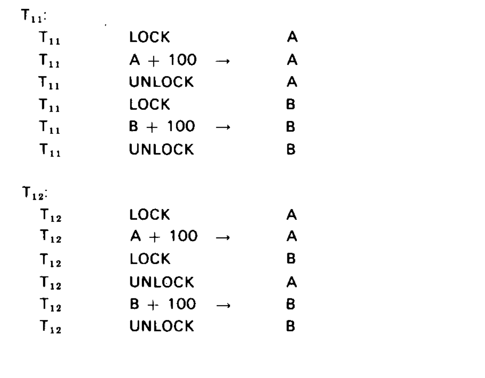
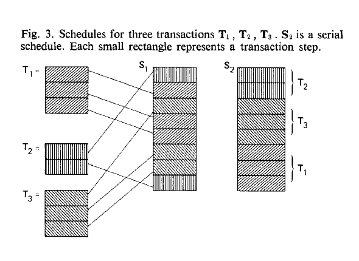
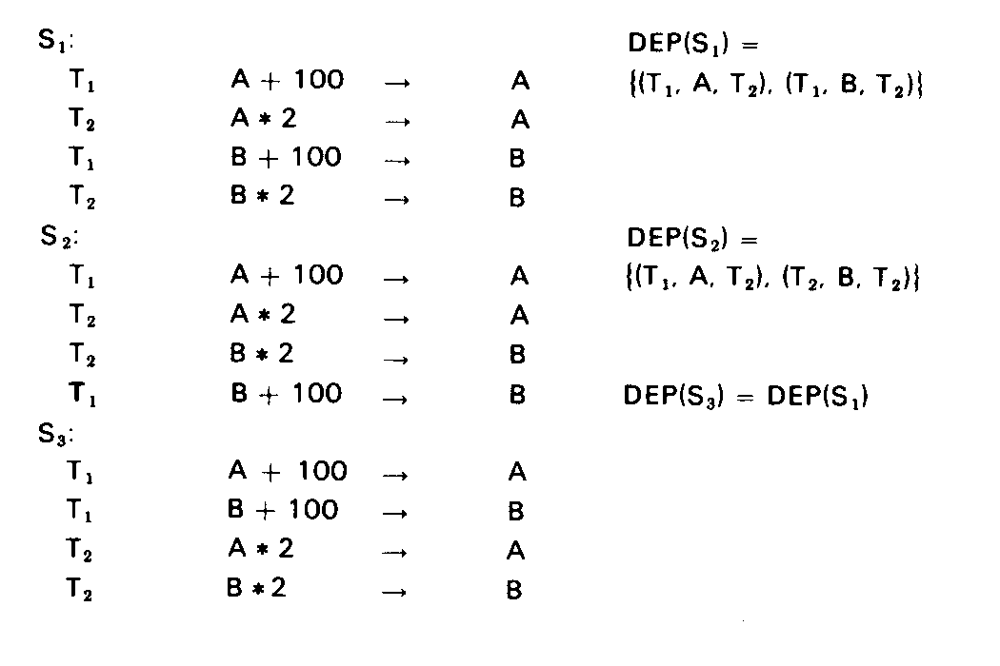
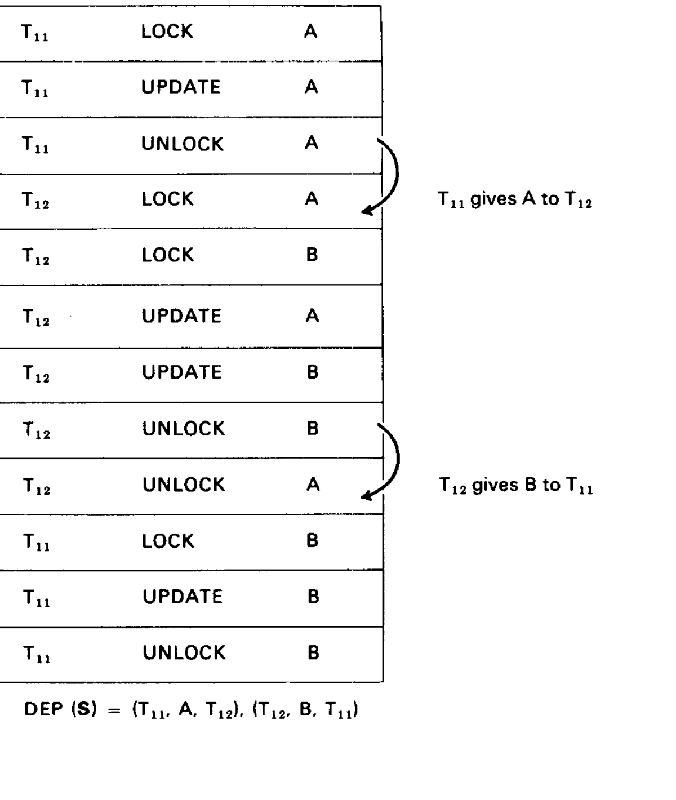
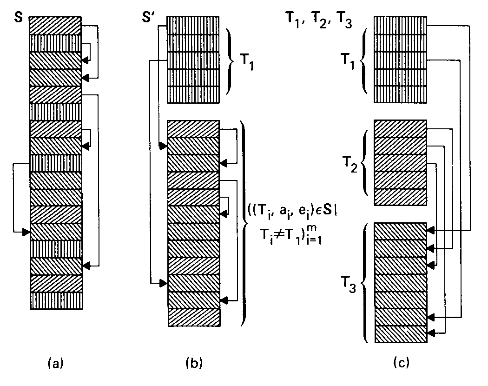
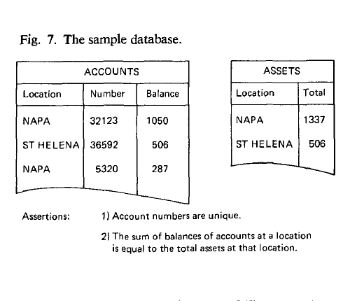
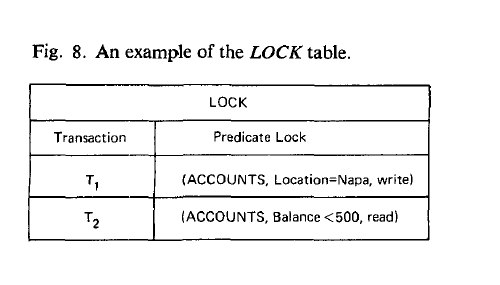

# The Notions of Consistency and Predicate Locks in a Database System（中文译文）

## 译者说明

本文依据同目录的 `source.pdf` 翻译。章节、图表、公式、算法、代码与参考文献按原文结构保留。

## 作者与出版信息

Kapali P. Eswaran、Jim Gray、Raymond A. Lorie、Irving L. Traiger

IBM 研究实验室，加利福尼亚州圣何塞

## 摘要

在数据库系统中，用户访问共享数据时，会假定数据满足某些一致性约束。本文定义了事务、一致性和调度等概念，并证明一致性要求事务在释放一个锁之后不能再申请新锁。随后，本文论证事务需要锁定数据库的逻辑子集，而不是物理子集。这些子集可以用谓词指定。本文还提出了一种满足一致性条件的谓词锁实现方式。

**关键词与短语：** 一致性、锁、数据库、并发、事务

**CR 分类：** 4.32、4.33

版权所有 © 1976 Association for Computing Machinery, Inc. 在保留 ACM 版权声明，并注明出版物、出版日期以及经 ACM 许可转载的前提下，允许出于非营利目的转载本文全部或部分内容。

通信地址：IBM Corp., Monterey and Cottle Roads, San Jose, CA 95193。

## 1. 引言

在数据库系统中，用户访问共享数据时，会假定数据满足某些一致性断言。为简化讨论，考虑一个包含固定数量具名资源的系统，这些资源称为实体。每个实体都有名称和值。这类断言的例子包括：

- “A”等于“B”；
- “C”是“D”中空闲单元的数量；
- “E”是“F”的索引。

在设计或使用系统时，大多数这类断言从未被明确写出，但只要程序和用户处理系统状态，就都依赖这些断言的正确性。

上面的断言相当简单，但实际中的断言会极其复杂。一个关于系统的完整断言集合，其规模无疑会与系统本身一样大。实践中几乎没有必要显式枚举所有这类断言，但为便于讨论，我们假定存在一个显式定义的断言集合，以下称为一致性约束；如果一个状态中各实体的内容满足全部一致性约束，就称该状态是一致的。

系统状态不是静止的。进程不断在实体上执行动作，使系统状态持续变化。读和写就是这类动作。我们假定动作是原子的，也就是说，如果两个进程并发执行动作，其效果如同其中一个动作先于另一个执行。

人们或许会认为，可以在每个动作上强制执行一致性约束，但事实并非如此。修改系统状态时，可能需要暂时破坏其一致性。例如，把钱从一个银行账户转到另一个账户时，会出现一个瞬间，其中一个账户已经扣款，而另一个账户尚未入账。这违反了系统中的美元总数保持不变这一约束。因此，进程的动作被组合成称为事务的序列，事务是一致性单位。通常，一致性断言在事务结束前无法强制成立。我们假定每个事务单独执行时，都能把一个一致状态变换成另一个一致状态，即事务保持一致性。

把动作组合成事务后，我们关心的问题是：通过交错执行多个事务中的动作，以最大并发度运行事务，同时继续让每个事务看到一致的系统状态。在这种环境中，每个事务都必须采用一种锁协议，确保它自己和其他事务不会访问暂时不一致的数据。这种锁协议会引入一组附加动作，称为加锁和解锁。一组事务的动作按照某种次序排列，称为调度。能让每个事务看到一致状态的调度，称为一致调度。

同一组事务的所有一致调度并不一定产生完全相同的状态，也就是说，一致性是比确定性更弱的性质。例如，在航空订座系统中，如果一组事务都请求某个航班上的座位，那么每个一致调度都能保证同一座位不会被卖出两次，并且只要有空位就不会拒绝请求；但是，两个不同的一致调度在具体座位分配上可能不同。

下一节将更详细地讨论锁与一致性问题。该讨论既适用于数据库系统，也适用于操作系统等更传统的环境。主要结论是，一致性要求事务必须由增长阶段和收缩阶段组成。事务在增长阶段可以申请新锁；但是，一旦释放了一个锁，就不能再申请新锁。

完成上述一般性讨论后，下一节将考察数据库系统中加锁的特殊性。一种称为幻象的现象似乎表明，必须锁定数据库的逻辑子集，而不是锁定数据库中当前存在的单条记录。随后，我们提出一种满足一致性要求的逻辑锁实现。为使讨论明确，该节采用关系数据模型。

## 2. 锁的一般性质

为观察并发运行事务会带来的问题，考虑图 1 中的两个事务 $T_1$ 和 $T_2$：

| $T_1$ | $T_2$ |
| --- | --- |
| $A + 100 \rightarrow A$ | $A \times 2 \rightarrow A$ |
| $B + 100 \rightarrow B$ | $B \times 2 \rightarrow B$ |

**图 1. 两个事务 $T_1$ 和 $T_2$。**

假定系统状态唯一的断言是 $A = B$。虽然 $T_1$ 和 $T_2$ 各自单独执行时都保持一致性，但它们具有以下性质：

**暂时不一致：** 执行 $T_1$ 或 $T_2$ 的第一步后， $A \ne B$，所以状态不一致。 (1a)

**冲突：** 如果把事务 $T_2$ 安排在 $T_1$ 的第一步和第二步之间执行，最终结果将是 $A \ne B$，即状态不一致。 (1b)

暂时不一致问题是内在的，而冲突不是内在的，并且是我们不希望出现的。

如果事务一个接一个地运行，没有并发，那么冲突绝不会发生。每个事务都从一致状态开始；由于事务保持一致性，每个事务也都在一致状态结束。一个正在执行的事务所见到的任何不一致，都来自它自己对状态所做的修改。如果事务是瞬时完成的，那么串行调度事务不会有代价。但是事务并非瞬时完成，并行运行多个事务可以带来可观的性能收益。

大多数情况下，一个特定事务只依赖系统状态的一小部分。因此，一种避免冲突的技术是把实体划分成互不相交的类别。只有使用不同实体类别的事务，才能并发调度。使用系统状态公共部分的事务仍须串行调度。采用这种策略时，每个事务都会看到状态的一致版本。遗憾的是，通常无法检查一个事务并准确判断它将使用状态的哪个子集。因此，上述“分区”方案被放弃，转而采用更灵活的方案，动态锁定单个实体。

在这种系统中，事务出于多种原因锁定实体。就前述讨论而言，事务希望防止与其他事务发生冲突，即排除其他事务所做的修改；也可能希望暂时停用被锁实体上的一致性断言。加锁的另一个动机是保证重复读取的结果可复现。除非事务锁定某个实体，否则对该实体的连续读取可能得到不同值，反映并发事务的更新。这与一致性约束关系不大，更多依赖于实体在更新前保持其值不变这一概念。

恢复和事务回退是加锁的另一个动机。数据库系统通常维护日志，记录每个事务所做的全部修改。该日志构成审计轨迹，也可以用于回退。需要回退的原因不仅包括为解除死锁而抢占，还包括保护违规、硬件错误和人为错误。事务 $T$ 的一种回退过程，是撤销日志中记录的全部更新。随后可以解锁 $T$ 锁定的所有实体，并把 $T$ 重置到初始状态。Davies 和 Bjork [1, 2] 指出，如果 $T$ 已经解锁，也就是提交了它修改过的某些实体，这一过程可能无法正确工作。这意味着更新锁应一直持有到事务结束。

为简化讨论，本节忽略共享访问和排他访问实体之间的区别，并假定除加锁和解锁外的每个动作都会修改实体。本节向共享访问情形的推广很直接，后文将随着论述在括号中说明。

如果事务 $T_1$ 试图锁定实体 $e_1$，但 $e_1$ 已被事务 $T_2$ 锁定，那么 $T_1$ 必须等待 $T_2$ 解锁 $e_1$，或者从 $T_2$ 手中抢占 $e_1$。如果 $T_1$ 等待，而 $T_2$ 随后又试图锁定被 $T_1$ 锁定的实体 $e_2$，那么 $T_2$ 也必须等待或抢占。如果 $T_1$ 和 $T_2$ 都选择等待，就会出现死锁。何时等待、何时抢占，不是本文的主题。Chamberlin、Boyce 和 Traiger [3] 的论文提出了一种决定抢占哪个事务的方案。资源被抢占时，被抢占的事务必须回退。

为了确保每个事务看到一致状态，事务释放某个锁之后不得申请新锁。为陈述和证明这个结论，需要采用更形式化的方式。不过，为简化后文，我们假定所有事务都满足以下性质：不会在第 $i$ 步重新锁定一个在第 $i$ 步已经锁定的实体；不会在第 $i$ 步解锁一个在该步之前并未持锁的实体；并且结束时不持有任何锁。

一个事务是由 $n$ 个步骤组成的序列：

$$
T = ((T,a_i,e_i)) _ {i=1}^{n},
$$

其中， $T$ 是事务名， $a_i$ 是第 $i$ 步的动作， $e_i$ 是第 $i$ 步作用的实体。（注：序列 $S=s_1,\ldots,s_n$ 记作 $(s_i) _ {i=1}^{n}$。满足条件 $C$ 的元素子序列，仿照集合记法记作 $(s_i\in S\mid C(s_i)) _ {i=1}^{n}$。 $S$ 的第 $i$ 个元素记作 $S(i)$。）

如果满足下列条件，就称事务在第 $i$ 步之前一直锁定实体 $e$：

存在某个 $j \le i$，使得 $a_j = \mathrm{lock}$ 且 $e_j = e$； (2a)

并且不存在满足 $j \lt{} k \lt{} i$ 的 $k$，使得

$$
a_k = \mathrm{unlock}\quad\text{且}\quad e_k = e.
$$

(2b)

如果事务 $T$ 满足以下条件，就称它是良构的：

对每个步骤 $i = 1,\ldots,n$， (3a)

- 如果 $a_i = \mathrm{lock}$，则直到第 $i-1$ 步， $T$ 尚未锁定 $e_i$；
- 如果 $a_i \ne \mathrm{lock}$，则直到第 $i$ 步， $T$ 一直锁定 $e_i$；

并且在第 $n$ 步， $T$ 只仍然锁定 $e_n$，且 $a_n = \mathrm{unlock}$。 (3b)

图 2 给出了图 1 中事务 $T_1$ 的两个良构版本。



**图 2. 图 1 中事务 $T_1$ 的两个良构版本。**

把事务 $T_1,\ldots,T_n$ 的动作按保持各事务内部次序的方式合并，所得任意序列称为 $T_1,\ldots,T_n$ 的一个调度。如果调度每次只从一个事务取动作，就称为串行调度。更形式化地，一组事务 $T_1,\ldots,T_n$ 的调度是任意序列

$$
S = ((T_i,a_i,e_i)) _ {i=1}^{m},
$$

使得对每个 $j=1,\ldots,n$，

$$
T_j = ((T_i,a_i,e_i) \in S \mid T_i = T_j) _ {i=1}^{m},
$$

(4a)

并且 $S$ 的长度 $m$ 等于事务 $T_1,\ldots,T_n$ 的长度之和，即 $S$ 只包含 $T_1,\ldots,T_n$ 的元素。 (4b)

注意， $m$ 是所有事务的步骤总数。

如果存在某个排列 $\pi$，使得

$$
S = T _ {\pi(1)}T _ {\pi(2)}\cdots T _ {\pi(n)},
$$

也就是说， $S$ 是这些事务的串接，就称调度 $S$ 是串行的。图 3 给出了一组三个事务的三个调度示例。



**图 3. 事务 $T_1$、 $T_2$、 $T_3$ 的调度。 $S_2$ 是串行调度。每个小矩形表示一个事务步骤。**

非串行调度可能让事务看到不一致的状态。因此，我们特别关心与串行调度“等价”的那些调度。调度之间的等价性取决于调度的依赖关系。

调度 $S$ 所诱导的依赖关系 $DEP(S)$，是定义在 $T \times E \times T$ 上的三元关系，其中 $T$ 是 $S$ 中所有事务名的集合， $E$ 是所有实体的集合。对某些 $i \lt{} j$，当且仅当满足

$$
S = (\ldots,(T_1,a_i,e),\ldots,(T_2,a_j,e),\ldots),
$$

(5a)

并且不存在 $k$ 使得 $i \lt{} k \lt{} j$ 且 $e_k=e$ 时，

$$
(T_1,e,T_2) \in DEP(S).
$$

(5b)

直观地说，如果 $(T_1,e,T_2)$ 属于 $DEP(S)$，那么实体 $e$ 是 $T_1$ 的输出、 $T_2$ 的输入， $T_1$ 把 $e$ 交给了 $T_2$。这里仍假定实体上的每个动作都会修改实体。如果区分“读共享”动作，就必须修改依赖关系，使只被事务读取的实体不被记录为该事务的输出。具体而言，在 (5a) 中增加“ $a_i$ 或 $a_j$ 是更新动作”这一子句，在 (5b) 中增加“ $a_k$ 是更新动作”这一子句。

如果 $DEP(S_1)=DEP(S_2)$，就称两个调度 $S_1$ 和 $S_2$ 等价。如果调度 $S_1$ 存在一个与其等价的串行调度，就称 $S_1$ 是一致的。图 4 展示了这些定义。其中， $S_1$ 是一致的， $S_2$ 不一致， $S_3$ 是串行的，因此也是一致的。



**图 4. 图 1 中 $T_1$、 $T_2$ 的三个调度。 $S_1$ 等价于串行调度 $S_3$，因而是一致的； $S_2$ 不一致。**

串行调度从一致状态开始，而且每个事务单独执行时都把一致状态变换成新的一致状态，所以串行调度会为每个事务提供一组一致输入。如果一组事务按一致方式调度，那么每个事务看到的状态，都与相应串行调度中所见相同，也就是一致状态。这些观察说明了为什么“一致性”一词既用于描述状态，也用于描述调度。

串行调度的效果很容易解释。用户把完整事务看成状态的“原子”变换，就像调度器把每个动作看成状态的原子变换一样。用户看到在其事务开始“之前”的事务所做的全部修改，而看不到在其事务完成“之后”的事务所做的任何修改，也就是说，他看到的是一致状态。由此可以得到串行调度的以下重要性质：

如果 $T_1$ 和 $T_2$ 是任意两个事务， $e_1$ 和 $e_2$ 是任意实体，则

$$
(T_1,e_1,T_2) \in DEP(S)
$$

蕴含

$$
(T_2,e_2,T_1) \notin DEP(S).
$$

(6a)

更一般地，在事务集合上定义二元关系 $\lt{}$：当且仅当存在某个实体 $e$ 使 $(T_1,e,T_2) \in DEP(S)$ 时， $T_1\lt{}T_2$。那么 $\lt{}$ 是无环关系，可以扩展成事务的全序。 (6b)

任何一致调度也具有这些性质，因为它与某个串行调度有相同的依赖集合。反过来，后文将证明，任何具有性质 (6b) 的调度都是一致的。

我们希望进一步刻画哪些非串行调度是一致的。为此，需要考察每个步骤中的加锁和解锁动作。如果在调度 $S$ 的第 $k$ 步之前事务 $T$ 一直锁定实体 $e$，则满足：

存在 $j \le k$，使得 $S(j)=(T,\mathrm{lock},e)$； (7a)

并且不存在 $j'$ 满足 $j\lt{}j'\lt{}k$ 且 $S(j')=(T,\mathrm{unlock},e)$。 (7b)

如果对所有 $k$，当 $S(k)=(T,a,e)$ 且在第 $k$ 步之前 $e$ 一直被 $T$ 锁定时， $e$ 没有在第 $k$ 步之前被任何其他事务锁定，就称调度 $S$ 是合法的。合法调度遵守以下锁协议：事务试图锁定一个已经被锁定的实体时必须等待。调度给出了事务处理过程的历史。可以把处理过程想象成调度器在每个时刻从所有未完成事务的下一步骤集合中选择一个事务步骤。这个调度器允许在空闲实体上执行加锁动作，但绝不会选择已锁实体上的加锁动作。这样的调度器只会产生合法调度，因为它绝不选择在已经锁定的实体上运行加锁步骤。

图 5 的示例说明，并非每个合法调度都是一致的。关键问题是，事务应当如何构造，才能使任何合法调度都保持一致。

显然，如果合法性要在所有上下文中保证一致性，那么每个事务在以其他方式操作实体前，必须先锁定该实体，并最终解锁每一个已锁定的实体。用良构事务的定义 (3a)、(3b) 更形式化地说：

**一致性要求事务是良构的。除非所有事务都是良构的，否则可以构造出合法但不一致的调度。** (8a)

为证明这一点，考虑任意非良构事务 $T_1=((T_1,a_i,e_i)) _ {i=1}^{n}$。那么对某个步骤 $k$， $T_1$ 在第 $k$ 步之前没有一直锁定 $e_k$。考虑一个良构的两阶段事务

$$
T_2=((T_2,\mathrm{lock},e_k),(T_2,\mathrm{read},e_k),(T_2,\mathrm{write},e_k),(T_2,\mathrm{unlock},e_k)).
$$

调度

$$
S=(T_1(i)) _ {i=1}^{k-1}T_2(1),T_2(2),T_1(k),T_2(3),T_2(4),(T_1(i)) _ {i=k+1}^{n}
$$

是合法的。由于 $(T_1,e_k,T_2)$ 和 $(T_2,e_k,T_1)$ 都属于 $DEP(S)$，根据性质 (6a)， $S$ 不等价于任何串行调度。因此， $S$ 不是一致调度，(8a) 得证。直观上， $T_1$ 可以在 $T_2$ 读取 $e_k$ 后、写入 $e_k$ 前改变它。这在串行调度，也就是一致调度中不可能发生。

一个不那么显然的事实是，一致性要求事务划分成增长阶段和收缩阶段。事务在增长阶段可以申请锁。第一次解锁动作标志着收缩阶段开始。第一次解锁之后，事务不能再对任何实体发出加锁动作。更形式化地，如果事务

$$
T=((T,a_i,e_i)) _ {i=1}^{n}
$$

存在某个 $j\lt{}n$，使得

$$
\begin{aligned}
i\lt{}j &\Rightarrow a_i \ne \mathrm{unlock},\\
i=j &\Rightarrow a_i = \mathrm{unlock},\\
i\gt{}j &\Rightarrow a_i \ne \mathrm{lock},
\end{aligned}
$$

就称 $T$ 是两阶段的。步骤 $1,\ldots,j-1$ 称为 $T$ 的增长阶段，步骤 $j,\ldots,n$ 称为 $T$ 的收缩阶段。

图 2 中的事务 $T _ {11}$ 不是两阶段的，因为它释放 $A$ 后又锁定了 $B$。事务 $T _ {12}$ 是良构且两阶段的。为了看到 $T _ {11}$ 可能遇到不一致状态，考虑图 5 所示的合法调度 $S$。在该调度中， $T _ {12}$ 从 $T _ {11}$ 得到 $A$，而 $T _ {11}$ 从 $T _ {12}$ 得到 $B$。因此， $S$ 不等价于任何串行调度，所以 $S$ 不一致。这个构造可以推广为：

**一致性要求事务是两阶段的。也就是说，除非所有事务都是两阶段的，否则可以构造出合法但不一致的调度。** (8b)

反过来：

**如果事务集合 $T=\lbrace{}T_1,\ldots,T_n\rbrace{}$ 中的每个事务都是良构且两阶段的，那么 $T$ 的任何合法调度都是一致的。** (8c)



**图 5. 事务 $T _ {11}$ 和 $T _ {12}$ 的一个合法调度，但由于 $T _ {11}$ 不是两阶段事务，该调度并不一致。**

这一结论的证明草图相当简单。令 $S$ 为 $T$ 的任意调度。对 $T$ 定义二元关系 $\lt{}$：当且仅当存在某个实体 $e$ 使 $(T_i,e,T_j)\in DEP(S)$ 时， $T_i\lt{}T_j$。可以证明一个引理： $\lt{}$ 可以如下扩展成 $T$ 上的全序 $\ll$。

首先，为每个事务 $T_i$ 定义整数 $SHRINK(T_i)$，它是在 $S$ 中 $T_i$ 第一次解锁某个实体的步骤编号：

$$
SHRINK(T_i)=\min\lbrace{}j\mid S(j)=(T_i,\mathrm{unlock},e)\text{，其中 }e\text{ 为某个实体}\rbrace{}.
$$

如果每个事务 $T_i$ 都非空，那么由于每个 $T_i$ 都是良构的， $SHRINK(T_i)$ 定义良好。

下面证明，对任意事务 $T_1$、 $T_2$ 和实体 $e$，如果 $(T_1,e,T_2)\in DEP(S)$，那么 $SHRINK(T_1)\lt{}SHRINK(T_2)$。根据 $DEP(S)$ 的定义，存在整数 $i$ 和 $j$，使得

$$
S=(\ldots,(T_1,a_i,e),\ldots,(T_2,a_j,e),\ldots),
$$

并且对 $i$ 与 $j$ 之间的任意整数 $k$， $e_k\ne e$。因为 $S$ 合法，直到 $S$ 的第 $i$ 步， $e$ 只能被 $T_1$ 锁定；又因为 $T_2$ 良构，直到 $S$ 的第 $j$ 步， $e$ 只能被 $T_2$ 锁定。所以 $a_i=\mathrm{unlock}$ 且 $a_j=\mathrm{lock}$。这立即意味着 $SHRINK(T_1)\le i$。由于 $T_2$ 是两阶段的，在 $S$ 的第 $j$ 步之前 $T_2$ 不会解锁，因此 $SHRINK(T_2)\gt{}j$。

于是，如果 $T_1\lt{}T_2$，就有 $SHRINK(T_1)\lt{}SHRINK(T_2)$。这蕴含性质 (6b)，从而 $\lt{}$ 可以扩展成 $T$ 上的全序 $\ll$。

不失一般性，假定

$$
T_1\ll T_2\ll\cdots\ll T_n.
$$

对 $n$ 做归纳，证明 $S$ 等价于串行调度 $T_1,\ldots,T_n$。当 $n=1$ 时结论显然成立。归纳步骤分两步。

首先证明 $S$ 等价于调度

$$
S'=T_1((T_i,a_i,e_i)\in S\mid T_i\ne T_1) _ {i=1}^{m}.
$$

然后注意，根据归纳假设，

$$
((T_i,a_i,e_i)\in S\mid T_i\ne T_1) _ {i=1}^{m}
$$

等价于 $T_2,\ldots,T_n$。因此， $S'$ 等价于 $T_1,T_2,\ldots,T_n$。而 $T_1,\ldots,T_n$ 是串行调度，所以 $S$ 等价于某个串行调度，因而是一致的。图 6 直观展示了从 $S$ 构造串行调度的过程。



**图 6. 从一致调度构造串行调度的图示。箭头表示 $S$ 的依赖关系。 $T_1\ll T_2\ll T_3$，所以 $S'$ 与 $S$ 具有相同依赖关系。把归纳假设应用于 $S'$，得到 $T_1,T_2,T_3$。**

综上：

**如果事务 $T_1,\ldots,T_n$ 都是良构且两阶段的，那么任何合法调度都是一致的。** (8d)

**除非事务 $T$ 是良构且两阶段的，否则存在一个良构且两阶段的事务 $T'$，使 $T$ 和 $T'$ 具有一个合法但不一致的调度。** (8e)

显然，事务单独运行时是一致的。此外，任何互不交互的事务集合，也就是 $DEP(S)=\varnothing$，无需加锁即可按任意次序一致地调度。即使事务发生交互，两阶段限制也可能过强。例如，如果图 2 中事务 $T _ {12}$ 更新的是实体 $C$ 而不是实体 $B$，那么 $T _ {11}$ 和 $T _ {12}$ 的任何合法调度都会是一致的，尽管两个事务都不是两阶段的。然而，如果加入一个访问实体 $A$、 $B$、 $C$ 的事务 $T _ {13}$，新的事务集合就会出现合法但不一致的调度。因此，似乎很难给出一组事务的所有合法调度都一致的非平凡必要条件，(8d) 给出的是充分条件。可以作如下断言：如果要让一个事务与未知的其他事务集合并发运行，那么为保证所有合法调度都一致，所有事务都必须良构且为两阶段事务。

## 3. 谓词锁

第 2 节引入了一致性和锁的概念，并探讨了一致性所要求的锁协议。上述讨论非常一般，适用于任何支持事务与共享实体概念的系统。下面考虑数据库环境中的加锁。除了规模问题，也就是数百万实体而不是数百或数千实体之外，数据库环境中锁的单位也有显著差异。这些差异来自事务对实体的关联寻址。在数据库环境中，事务经常希望锁定值满足某个条件的所有实体，也就是“键”寻址。更新一个看似无关的实体，可能会使其加入这样的集合，从而产生“幻象”记录问题。本节解释这一问题并提出解决方案。

为使讨论明确，我们采用 Codd [4] 的关系数据模型。数据库由关系 $R_1,R_2,\ldots,R_n$ 的集合组成。每个关系都可以看成一张表或平面文件。关系的每一列称为域，关系的每个元素，也就是每一行，称为元组或记录。每个元组由固定数量的字段组成。每个域都有名称。图 7 给出了这样一个数据库的例子。



**图 7. 示例数据库。断言为：(1) 账户号唯一；(2) 某地点所有账户的余额之和，等于该地点的总资产。**

一种做法是，只要引用关系或域的任何成员，就锁定整个关系或域。然而，元组数量远多于关系或域的数量，这种做法无法提供很高的并发度。例如，如果必须锁定整个关系，那么两个向不同账户存款的事务就不能并发运行。

这说明锁应作用于尽可能小的单位，使事务不会锁定不需要的信息。因此，自然的锁单位是关系的字段或元组。然而，元组并不是第 2 节意义上的实体，因为它没有一个与其值相分离的名称。乍看之下这似乎很奇怪，但原因在于元组通过值而不是通过其占据的存储地址来引用。

为说明这一点，考虑图 7 数据库上的事务 $T_1$。该事务通过以下步骤检查“Napa 地区账户余额之和等于 Napa 地区总资产”这一断言：

1. 对 `ACCOUNTS` 关系进行关联寻址，锁定找到的所有地点为 Napa 的账户。 (9a)
2. 对这些已锁定账户的余额求和。 (9b)
3. 锁定 `ASSETS` 中 Napa 的元组，并把它的值与计算所得总和比较。 (9c)
4. 释放所有锁。 (9d)

如果第二个事务 $T_2$ 向 `ACCOUNTS` 插入一个 `Location = Napa` 的新元组，并把存款额加到 Napa 的资产上，而且 $T_2$ 被安排在 $T_1$ 的步骤 (9b) 和 (9c) 之间执行，那么 $T_1$ 会看到不一致状态： $T_1$ 会在 `ASSETS` 中看到新账户余额的影响，却没有在 `ACCOUNTS` 关系中看到该账户。如果 $T_2$ 只是把一个账户从 St. Helena 转到 Napa，也会出现类似问题。

一个更基本的例子，是测试某个元组是否存在于关系中。如果该元组存在，就应锁定它，确保其他事务不会在第一个事务结束前删除它。如果该元组不存在，也应当锁定“它”，确保其他事务不会在第一个事务结束前创建这样的元组。这里被锁定的是元组的“不存在性”。这种不存在的元组称为幻象。检查前一个例子可以看出， $T_1$ 不仅应锁定当前存在的全部 Napa 账户，还应锁定所有幻象账户。

如上一节所述，一致性要求事务锁定它检查的所有元组，包括真实元组和幻象元组，也就是说事务必须良构。所有可能的 Napa 账户构成笛卡尔积：

$$
\lbrace{}Napa\rbrace{}\times INTEGERS\times INTEGERS.
$$

这个集合是无限的，因此几乎不可能单独锁定集合中的每个元组。更自然的做法，是锁定满足谓词 `Location = Napa` 的元组和幻象组成的集合。更一般地，如果 $P$ 是关系 $R$ 的元组 $t$ 上的谓词，那么 $P$ 定义集合 $S$：当且仅当 $P(t)$ 成立时， $t\in S$。事务可以通过指定这样的谓词，锁定关系的任意子集。我们只要求 $P$ 的真或假仅依赖于 $t$。

如果以这类谓词作为锁单位，那么锁列表就变成一个小得多的集合列表，每个集合由其谓词标识。使用恒真谓词 `TRUE` 可以锁定整个关系；使用谓词

$$
P(t)\triangleq t=(NAPA,32123,1050)
$$

可以锁定元组 `(NAPA, 32123, 1050)`。但是，上一节关于加锁和一致性的形式化结果不能直接应用，因为其中假定实体是名称唯一的对象。本节将扩展关于调度和一致性的结果，使其适用于可能相互重叠的元组集合上的锁。

首先，如果谓词可以任意复杂，就几乎不可能判断两个不同谓词是否定义了相互重叠的元组集合，因而也无法判断它们作为锁是否冲突。事实上，这个问题是递归不可解的（Kleene [5]），所以谓词锁如何“工作”并不明显。下面先通过例子，再以更抽象的方式引入一种调度谓词锁的方法。

在图 7 的示例数据库中，假定事务 $T_1$ 关注 `ACCOUNTS` 中满足 `Location = Napa` 的全部元组。事务 $T_2$ 在 $T_1$ 处理期间开始，并关注 `ACCOUNTS` 中满足 `Location = Sonoma` 的全部元组。当 $T_1$ 执行动作

```text
T1 LOCK ACCOUNTS: Location = Napa
```

声明它打算访问 Napa 的账户时，这个谓词锁与 $T_1$ 以及 `ACCOUNTS` 关系关联。之后， $T_2$ 执行动作

```text
T2 LOCK ACCOUNTS: Location = Sonoma
```

声明它打算访问 Sonoma 的账户。该谓词锁也与 `ACCOUNTS` 关系关联。在允许 $T_2$ 访问 Sonoma 账户之前，锁控制器必须检查 $T_2$ 的锁是否与其他事务在该关系上持有的锁冲突。在这个例子中，控制器必须判定 `Location = Napa` 和 `Location = Sonoma` 两个谓词互斥。一般而言，控制器必须把申请的谓词锁与其他事务在这个关系上的未释放谓词锁逐一比较。如果两个谓词可以同时满足，也就是拥有公共的真实元组或幻象元组，那么就存在冲突，请求必须等待或抢占；否则可以立即授予请求。

这大体说明了谓词锁如何工作，但没有说明共享如何工作，也绕开了谓词可满足性递归不可解这一事实。为了更完整地说明谓词锁如何“工作”，需要定义一个动作何时被锁允许或禁止，以及两个锁何时可能冲突。首先需要决定可锁定的实体。在文献 [8] 中，字段被选作基本锁单位。这样可以获得最大并发度，但会带来许多记法上的复杂性。为简化表示，我们对谓词锁的形式化推导采用元组级加锁，之后再非形式化地讨论如何推广到字段级谓词锁。

对一个元组的特定动作可以记作 $(R,t,a)$，表示以模式 $a$ 访问关系 $R$ 的元组 $t$。这里区分两种模式：

- $a=read$ 允许与其他读取者共享；
- $a=write$ 要求对元组 $t$ 持有排他锁，更新、插入、删除都是写访问的例子。

如果 $a=read$，该动作读取元组 $t$；如果 $a=write$，该动作写入元组 $t$。

读取账户 32123 的余额，可表示为动作

$$
(ACCOUNTS,(Napa,32123,1050),read).
$$

把余额增加 50 美元会涉及两个动作和两个元组，先执行

$$
(ACCOUNTS,(Napa,32123,1050),write),
$$

还要执行

$$
(ACCOUNTS,(Napa,32123,1100),write),
$$

因为原子更新操作会写入两个元组，一个被“删除”，另一个被“插入”。此外，一致性还要求 Napa 的 `ASSETS` 元组增加 50 美元。

在上述动作模型中，动作通过给出元组全部字段的值来指定元组。形式上没有问题，但前面的例子表明它不适合当前语境。第一个例子想读取账户 32123 的余额，并不关心该账户的位置；但该模型除了账户号，还要求动作指定账户余额和位置。类似地，第二个事务想读取账户 32123 的余额和位置，再把该账户余额以及账户所在地的资产都增加 50 美元。

如果考虑在事先不知道当前余额的情况下，读取 `ASSETS` 中 Napa 元组的问题，那么问题及其解法就很清楚了。动作概念必须推广为访问概念，访问作用于满足指定谓词的所有元组。这与关联寻址的思想一致，关联寻址返回给定字段具有指定值的全部元组。要访问账户 32123，可以指定访问

$$
(ACCOUNTS,Number=32123,read),
$$

由于账户号唯一，它引用一个元组或不引用任何元组。更新账户 32123 余额的访问记作

$$
(ACCOUNTS,Number=32123,write).
$$

一致性断言要求在这样的访问之后执行

$$
(ASSETS,Location='Napa',write),
$$

因为要求每个地点的资产等于该地点所有账户余额之和。

查找所有 Napa 账户的账户号，会返回一个元组集合，记作

$$
(ACCOUNTS,Location='Napa',read).
$$

为进行更形式化的讨论，需要下列定义。如果关系 $R$ 取自集合 $S_1,S_2,\ldots,S_n$ 的笛卡尔积，即

$$
R\subseteq\prod _ {i=1}^{n}S_i,
$$

那么定义在所有元组

$$
(s_1,\ldots,s_n)\in\prod _ {i=1}^{n}S_i
$$

上的任意谓词 $P$，都是 $R$ 的可接受谓词。我们要求 $P$ 是一种有效检验：给定元组 $t$，可以得到 $P(t)=TRUE$ 或 $P(t)=FALSE$。

关系 $R$ 上的一次特定访问记作 $(R,P,a)$，其中 $P$ 是可接受谓词。这次访问等价于可能无限的动作集合 $(R,t,a)$，其中 $P(t)=TRUE$，而 $t$ 遍历 $R$ 所基于的笛卡尔积。具体而言，如果 $a=read$，它读取所有这类元组；如果 $a=write$，它写入所有这类元组。关系 $R$ 上的谓词锁记作 $(R,P,a)$，其中 $P$ 是 $R$ 的可接受谓词， $a$ 是访问模式。

称动作 $(R,t,a)$ 满足谓词锁 $(R',P',a')$，当且仅当：

$$
R=R',
$$

(10a)

$$
P'(t)=TRUE,
$$

(10b)

且

$$
a=a'\quad\text{或}\quad a'=write.
$$

(10c)

在 (10c) 的第二个子句中，我们假定写访问同时蕴含读访问和写访问。

如果满足以下条件，就称该动作与谓词锁冲突：

$$
R=R',
$$

(11a)

$$
P'(t)=TRUE,
$$

(11b)

且

$$
a=write\quad\text{或}\quad a'=write.
$$

(11c)

例如，谓词锁

$$
L=(ACCOUNTS,Location=Napa,read)
$$

由动作

$$
(ACCOUNTS,(Napa,3213,1050),read)
$$

满足，并与动作

$$
(ACCOUNTS,(Napa,3213,1050),write)
$$

冲突。

访问的满足和冲突以类似方式定义。当且仅当笛卡尔积中的每个元组 $t$ 都满足以下条件：若 $P(t)$ 为真，则动作 $(R,t,a)$ 满足 $L$，访问 $A=(R,P,a)$ 才满足谓词锁 $L$。如果笛卡尔积中存在某个元组 $t$，使得 $P(t)$ 为真且动作 $(R,t,a)$ 与 $L$ 冲突，则访问 $A$ 与 $L$ 冲突。

例如，把账户 23175 从 Napa 移到 Sonoma 的访问记作

$$
(ACCOUNTS,(Location='Napa'\lor Location='Sonoma')\land Number=23175,write).
$$

该访问要求事务在 `ACCOUNTS` 关系上持有形如 $(ACCOUNTS,P,write)$ 的锁，其中谓词 $P$ 必须被元组 `(Napa, 23175, *)` 和 `(Sonoma, 23175, *)` 满足。也就是说，锁谓词 $P$ 必须同时覆盖旧值和新值。

注意，我们要求一次访问由单个谓词锁覆盖。如果持有两个锁，一个用于 Napa，另一个用于 Sonoma，那么该访问不满足其中任何一个锁，因此不被允许。可以放松这一限制：如果访问满足事务所持锁的并集，就允许访问。

如果存在某个动作，它满足两个谓词锁中的一个，却与另一个冲突，就称这两个谓词锁相互冲突。换言之，一个锁允许的访问被另一个锁禁止。

依据这些定义，上一节的概念可推广如下。事务是由“事务名、访问”对组成的序列。如果事务进行的每次访问都满足它在该步骤之前一直持有的某个谓词锁，那么事务是良构的。如果事务释放谓词锁后不再申请谓词锁，那么事务是两阶段的。

一组事务的调度，是这些事务序列的任意保序合并。依赖关系以“元组、关系”对作为实体来定义，考虑所有关系所基于的笛卡尔积中的全部元组。令 $E$ 为所有这类实体的集合。前文已经引入了访问读写这类实体的概念。如果 $S$ 是事务集合 $T$ 的一个调度，那么 $S$ 的依赖集合定义为三元组集合

$$
(T_1,e,T_2)\in T\times E\times T,
$$

其中存在整数 $i\lt{}j$，满足：

$$
S(i)=(T_1,A_1),
$$

并且 $A_1$ 读或写实体 $e$； (12a)

$$
S(j)=(T_2,A_2),
$$

并且 $A_2$ 读或写实体 $e$，而且 $A_1$ 和 $A_2$ 不都是只读 $e$； (12b)

对 $i$ 和 $j$ 之间的任意 $k$，如果 $S(k)=(T_3,A_3)$，那么 $A_3$ 不写实体 $e$。 (12c)

元组级谓词锁可以如下推广到字段级谓词锁，形式化推导见 [8]。对关系的一次特定字段级访问，会读取、写入或忽略访问谓词所指定关系中的每个字段。字段级谓词锁锁定由谓词覆盖的元组中的特定字段。字段要么被锁忽略，要么以读模式或写模式锁定。如果两个谓词锁的谓词可以同时满足，并且其中一个锁要求对某字段进行写访问，而另一个锁以读或写模式锁定该字段，则两个谓词锁冲突。如果字段级访问只访问谓词锁覆盖的元组，只读取以读模式锁定的字段，只写入以写模式锁定的字段，那么该访问满足这个谓词锁。类似地，如果访问与谓词锁的两个谓词可以同时满足，而且该访问读取了被锁以写模式锁定的字段，或者写入了被锁以读或写模式锁定的字段，那么该访问与谓词锁冲突。依据这些访问、满足和冲突定义，本节的推导可以推广到字段级谓词锁。

举一个具体例子，读取账户余额可记作访问

$$
(ACCOUNT,Number=32123,\lbrace{}(Number,read),(Balance,write)\rbrace{}),
$$

它忽略 `Location` 字段，读取 `Number` 字段并更新 `Balance` 字段。该访问满足谓词锁

$$
(ACCOUNT,Number=32123,\lbrace{}(Number,write),(Balance,write)\rbrace{}),
$$

并且该谓词锁与下列谓词锁冲突：

$$
(ACCOUNT,Number=32123,\lbrace{}(Number,read)\rbrace{}).
$$

该访问不满足最后这个谓词锁。

现在回到锁作用于整个元组的较简单模型。为了实现任意谓词锁，在数据库中关联一个名为 `LOCK` 的表。它是事务与谓词锁之间的二元关系，见图 8。



**图 8. `LOCK` 表的示例。**

合法锁调度器按如下方式工作。假定事务是两阶段且良构的，调度器会强制执行这一规则。任何处于增长阶段的事务都可以申请任意谓词锁。申请发生时，调度器尝试把事务名和谓词锁写入 `LOCK` 表。如果该谓词锁不与表中其他事务的任何谓词锁冲突，就可以立即写入并授予。如果谓词锁与其他事务持有的一个或多个锁冲突，请求者就必须等待其他锁被释放，或者抢占这些锁，也可能自身被抢占。如前所述，这是调度决策，不是本文的主题。

事务可以释放属于它的任意谓词锁。释放操作会从 `LOCK` 中删除该锁，并把事务标记为处于收缩阶段。如果其他事务正在等待该锁所释放的元组，就可以启动这些事务。每当事务 $T^{\ast}$ 执行动作或访问 $A$ 时，就检查 `LOCK` 表并找出集合

$$
YES=\lbrace{}(T,L)\in LOCK\mid A\text{ 满足 }L\text{ 且 }T=T^{\ast}\rbrace{}.
$$

`YES` 列出允许 $T^{\ast}$ 执行该访问的全部理由。如果 `YES` 为空，则 $T^{\ast}$ 不是良构的，应当报告错误。

显然，上述调度器会检查以下性质：

**所有事务都是良构且两阶段的。** (13a)

**如果事务 $T$ 在关系 $R$ 上锁定谓词 $P$，那么对 $R$ 所基于的笛卡尔积中满足 $P(t)=TRUE$ 的任意元组 $t$，在 $T$ 释放该谓词锁前，其他事务都不能插入、删除或修改 $t$。也就是说，谓词锁解决了幻象问题。** (13b)

因此，上述调度器会产生合法调度；根据上一节的结果，它能让每个事务看到系统状态的一致视图。

到目前为止，我们忽略了调度器判断两个谓词锁是否冲突的细节。一般情况下，这是递归不可解的问题。即使把谓词限制为使用算术运算符 $+$、 $\times$、 $-$、 $\div$，Gödel 的结果也说明如此，见 Kleene [5]。因此，问题是找出一个有意义的谓词类，使两个谓词是否“重叠”容易判定。我们提出如下简单谓词类。

简单谓词是原子谓词的任意布尔组合。原子谓词具有下列形式：

$$
(\text{字段名})
\begin{cases}
\lt{}\\
=\\
\ne\\
\gt{}
\end{cases}
(\text{常量}),
$$

其中，常量是字符串或数字，字段名是关系中某字段的名称。例如，

$$
((Location='Napa'\lor Location='Santa Rosa')\land((Balance\lt{}200)\land(Balance\gt{}10)))
$$

是由四个原子谓词组成的简单谓词。

Presburger 也给出了一种过程，判断比简单谓词略为一般的一类谓词是否重叠，见 Kleene [5]。他允许在整数上使用 $+$、 $-$、 $\lt{}$、 $=$、 $\ne$、 $\gt{}$、`mod` 以及这些运算符与操作数的任意布尔组合。但是，他的判定过程远比这里这个简单谓词集合的过程复杂。

判断两个简单谓词锁 $L$ 和 $L'$ 是否冲突相当直接。假定 $L=(R,P,a)$， $L'=(R',P',a')$，那么：

如果 $R\ne R'$，因为锁作用于不同关系，所以没有冲突。 (14a)

如果 $a\ne write$ 且 $a'\ne write$，则没有冲突。 (14b)

否则，当且仅当不存在元组 $t$ 使 $(P\land P')(t)=TRUE$ 时，才没有冲突。 (14c)

类似地，判断访问 $A=(R',P',a')$ 是否与锁 $L$ 冲突，需要对访问 $A$ 检验上述 (14a)、(14b)、(14c)。如果 $A$ 通过以下检验，它就满足 $L$：

$$
R=R',
$$

(15a)

$$
a'=a\quad\text{或}\quad a=write,
$$

(15b)

而且对任意元组 $t$，如果 $P'(t)=TRUE$，那么 $P(t)=TRUE$。也就是说， $P'\Rightarrow P$；等价地， $P'\land\neg P$ 不可满足。 (15c)

因此，访问和锁的冲突可满足性问题，都归约为判断某个特定简单谓词是否可满足。而简单谓词正是被定义为具有简单判定过程的谓词。

判定过程是：把 (14c) 中的 $P\land P'$ 整理成析取范式（Kleene [5]），然后逐一判断每个析取项是否可满足。每个这样的析取项都是原子谓词的合取，因此判断很直接。考虑示例：

$$
\begin{aligned}
P={}&(Location='Napa'\lor Location='Santa Rosa')\\
&\land(Balance\lt{}500\land Balance\gt{}10),\\
P'={}&Location='Napa'\land Balance=700.
\end{aligned}
$$

 $P\land P'$ 的析取范式为

$$
\begin{aligned}
&(Location='Napa'\land Balance\lt{}500\land Balance\gt{}10\land Balance=700)\\
\lor{}&(Location='Santa Rosa'\land Location='Napa'\land Balance\lt{}500\land Balance\gt{}10\land Balance=700).
\end{aligned}
$$

第一个析取项不可满足，因为 `Balance = 700` 与 `Balance < 500` 矛盾；第二个析取项还多了一个矛盾，即 `Location = Napa` 与 `Location = Santa Rosa` 同时成立。因此， $P\land P'$ 不可满足，没有冲突。

再看一个有冲突的例子，假定

$$
P=(Location='Napa'),\qquad P'=(Balance\gt{}500).
$$

元组 `(Napa, 0, 501)` 可以满足 $P\land P'$，所以两个谓词“重叠”，可能发生冲突。

综上，如果访问和谓词锁只允许使用简单谓词，那么谓词锁可以像普通锁一样调度。

如前所述，谓词锁解决了幻象记录问题。把它与一致性结果结合，就可以用谓词锁构造一致的合法调度器。谓词的退化形式给出了更传统的加锁形式：用恒真谓词 `TRUE` 锁定整个关系，或者用只对某个特定元组为真的谓词锁定该元组。如果目标集合无法由简单谓词描述，那么任何“更大”的简单谓词，也就是目标谓词蕴含的简单谓词，都可以作为合适的锁谓词。只要仅使用简单谓词，谓词锁就可以合法调度。

现有数据库系统中也存在谓词锁的简单类似物。例如，在 IMS（IBM [6]）等层次系统中，通常会锁定层次结构的一棵子树。该子树是一个记录的逻辑集合，也就是拥有给定父记录的记录。类似地，在网状模型中，也希望锁定 DBTG [7] 意义上的一个“集合”的全部成员，尽管 DBTG 不提供这种功能。

最后要指出，加锁是一种非常动态的授权形式。本文描述的全部技术，包括谓词锁、简单谓词、`YES` 集合等，都适用于以字段粒度，根据值对数据库记录进行访问授权的问题。

## 4. 总结

第 2 节引入了一个非常简单的数据模型，并讨论了事务、一致性和锁等概念。我们论证了一致性要求事务是两阶段且良构的；反过来，如果所有事务都良构且为两阶段事务，那么任何合法调度都是一致的。

第 3 节采用关系数据模型。我们描述了关联寻址带来的问题，也就是幻象记录会进入或离开事务锁定的记录集合。谓词锁被提出作为这一问题的解决方案。为调度并强制执行这些锁，谓词被限制为简单谓词类。简单谓词锁可以用与“普通”锁相同的方式调度。

### 致谢

我们的一致性概念源于与 Ray Boyce、Don Chamberlin 和 Frank King 的讨论。Rudolph Bayer、Paul McJones、Gianfranco Putzolu 以及审稿人的有益意见，帮助润色了本文的早期草稿。

收稿于 1974 年 12 月；修订于 1975 年 8 月。

## 参考文献

1. Bjork, L.A. Recovery scenario for a DB/DC system. *Proc. ACM 73 Nat. Conf.*, Atlanta, Ga., pp. 142-146.
2. Davies, C.T. Recovery semantics for a DB/DC system. *Proc. ACM 73 Nat. Conf.*, Atlanta, Ga., pp. 136-141.
3. Chamberlin, D.D., Boyce, R.F., Traiger, I.L. A deadlock-free scheme for resource locking in a data-base environment. *Information Processing 74*, North-Holland Pub. Co., Amsterdam, 1974, pp. 340-343.
4. Codd, E.F. A relational model for large shared data banks. *Comm. ACM* 14, 6 (June 1970), pp. 377-387.
5. Kleene, S.C. *Introduction to Metamathematics*. Van Nostrand, Princeton, N.J., 1952, p. 204.
6. IBM Information Management System for Virtual Storage (IMS/VS), *Conversion and Planning Guide*. Form No. SH20-9034, IBM, Armonk, N.Y., 1973, pp. 38-44.
7. CODASYL, *Data Base Task Group Report*. ACM, N.Y., 1971.
8. Eswaran, K.P., Gray, J.N., Lorie, R.A., and Traiger, I.L. On the notions of consistency and predicate locks in a data base system. Res. Rep., RJ 1487, IBM Res. Lab., San Jose, Calif., 1974.
