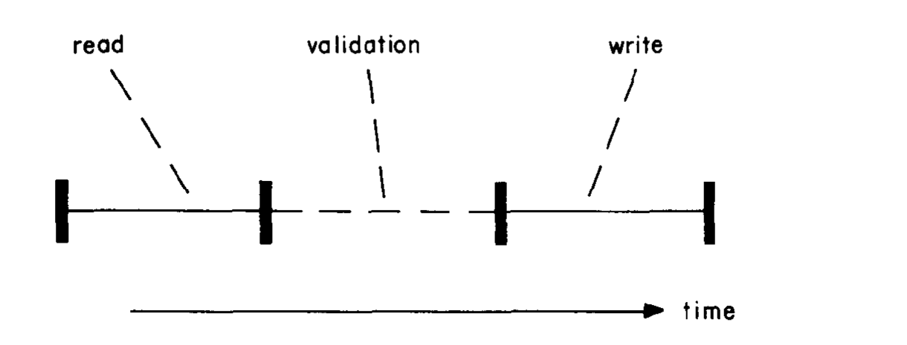
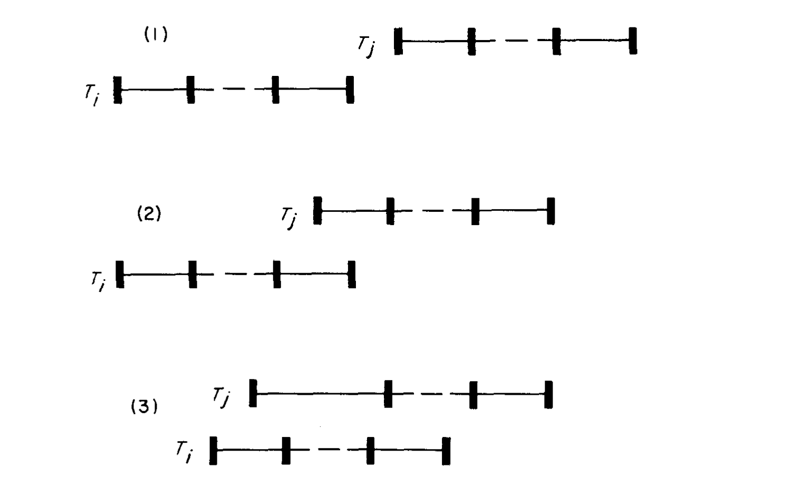
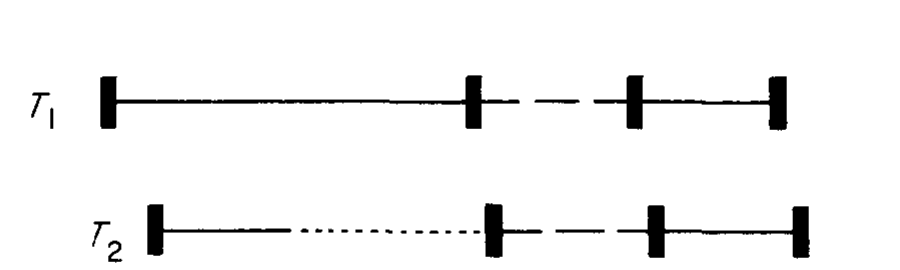

# On Optimistic Methods for Concurrency Control（中文译文）

## 译者说明

本文依据同目录的 `source.pdf` 翻译。章节、图表、公式、算法、代码与参考文献按原文结构保留。

## 作者与出版信息

H. T. Kung、John T. Robinson
卡内基-梅隆大学

## 摘要

当前数据库系统中的大多数并发控制方法，都依赖对所访问数据对象加锁。本文提出两类完全不使用锁的并发控制方法。我们称这些方法为“乐观的”，因为它们主要依靠事务备份，并希望事务之间不会发生冲突。本文还讨论了若干应用；在这些应用中，乐观方法应当比加锁方法更高效。

**关键词与短语：** 数据库、并发控制、事务处理
**CR 类别：** 4.32、4.33

> 允许在不收费的情况下复制本文的全部或部分内容，但复制品不得为直接商业利益而制作或传播，并且复制品必须包含 ACM 版权声明、出版物标题及出版日期，同时注明复制经 Association for Computing Machinery 许可。以其他方式复制、重新出版、发布到服务器或转发到列表，需要预先获得专门许可和/或支付费用。

本研究得到美国国家科学基金会项目 MCS 78-236-76 与美国海军研究办公室合同 N00014-76-C-0370 的资助。

通信地址：Department of Computer Science, Carnegie-Mellon University, Pittsburgh, PA 15213。
© 1981 ACM 0362-5915/81/0600-0213 $00.75

*ACM Transactions on Database Systems*，第 6 卷第 2 期，1981 年 6 月，第 213-226 页。

## 1. 引言

我们把数据库看作一个对象图。图中有一些特别指定的根对象；非根对象只能先从根出发，再沿对象中的指针访问。事务是一次访问数据库的序列，并且这种访问在逻辑上保持数据库的完整性。

让多个事务高度并发地访问数据库通常很重要，原因至少有二。第一，数据库可能大到无法全部装入主存，因此访问过程中必须在主存和辅存之间换入、换出对象。一个事务等待辅存访问时，其他事务应能继续执行。第二，即使数据库完全位于主存，多处理器也要求多个事务并行执行。

然而，无约束的并发会破坏数据库完整性。现有的大多数并发控制方法都把锁与数据库图中的节点关联起来，并要求进程遵循某种加锁协议，使其他进程永远看不到暂时不一致的数据库状态。这类方法有下列缺点。

1. 加锁会带来顺序执行时并不存在的开销。即使是只读查询，也必须取得锁；此外，系统还要承担检测死锁的开销。
2. 对一般数据库而言，目前没有一种既能提供高并发度又能避免死锁的通用加锁协议。特殊数据结构需要特殊协议；例如，仅 B 树就至少已有九种并发访问协议 [2, 3, 9, 10, 13]。
3. 如果一个事务因辅存访问而停顿，而它仍持有一个竞争激烈节点的锁，那么并发度会下降。
4. 事务若希望自行中止，也必须继续持有锁直到中止处理结束。
5. 锁常常只为防范极少出现的最坏情况。设数据库有 $n$ 个根对象，两个进程以相同速率执行事务，每个事务等概率地只涉及一个根。平均每执行 $n$ 个事务才真正需要一次锁，但使用锁的系统仍会在每个事务中付出加锁成本。

当数据库图相对于任一时刻活动的节点集合很大，而且修改竞争节点的概率很低时，第 5 点尤其重要。B 树正是为了让这类概率保持很低而设计的。

寻找无死锁的加锁协议，可以看成试图通过消除事务备份这一控制机制来降低并发控制开销。我们考察相反的问题：取消锁，允许事务自由执行，并以备份机制处理罕见的冲突。由于我们预期冲突很少，所以称它为**乐观并发控制**。这些方法适用于任意共享有向图和任意访问算法。它们不会死锁，但仍可能使某个事务饥饿。它们消除了上述第 3、4 项问题；在查询占主导的数据库中，控制开销几乎可以忽略，因而也部分消除了第 1 项问题。

基本思想如下。

1. 事务可以不受限制地读取数据库。查询返回结果也可视为一次写操作，因此同样必须经过验证。
2. 对数据库的所有修改先写入事务的私有副本，这一段称为**读阶段**。读阶段之后是**验证阶段**。只有验证成功时，事务才进入可选的**写阶段**，把私有修改变成全局可见的修改。查询则在验证成功后才把结果返回给调用者。

如果加锁方法只在最坏情形才真正需要锁，那么乐观方法也只会在最坏情形验证失败。验证失败时，事务备份并以一个新事务重新开始。因此，事务只有在验证成功后才会进入写阶段。图 1 展示了这三个阶段。



**图 1　事务的三个阶段。**

第 2 节详细说明读阶段和写阶段。第 3 节给出一种特别强的验证形式，其正确性准则基于串行等价 [4, 12, 14]。第 4、5 节分别给出最终验证步骤串行的算法族，以及验证完全并行但总成本更高的算法。第 6 节分析乐观方法在 B 树并发插入中的应用，第 7 节总结全文并讨论未来研究。

## 2. 读阶段与写阶段

本节简要说明并发控制如何以对用户不可见的方式支持用户编写事务的读阶段和写阶段，以及如何高效实现这两个阶段。验证阶段将在随后的三节中讨论。

假定底层系统可以操作多种类型的对象；为简化讨论，再假定所有对象属于同一类型。对象由下列基本过程访问：

```text
create          创建一个新对象，并返回其名字
delete(n)       删除对象 n
read(n, i)      读取对象 n 的第 i 项，并返回其值
write(n, i, v)  把值 v 写入对象 n 的第 i 项
copy(n)         创建对象 n 的副本，并返回副本的名字
exchange(n1,n2) 交换对象 n1 与 n2 的名字
```

这里，$n$ 是对象名，$i$ 是交给对象类型管理程序的参数，$v$ 可以是任意值，包括指针，也就是对象名，或普通数据。

为了让并发控制对事务程序透明，我们提供与这些基本过程语法相同的 `tcreate`、`tdelete`、`tread` 和 `twrite`。`tbegin` 清空本事务维护的各个集合，用户事务主体构成读阶段，`tend` 则开始验证。读阶段中的过程定义如下：

```text
tcreate = (
    n := create;
    create set := create set ∪ {n};
    return n)

twrite(n, i, v) = (
    if n ∈ create set
        then write(n, i, v)
    else if n ∈ write set
        then write(copies[n], i, v)
    else (
        m := copy(n);
        copies[n] := m;
        write set := write set ∪ {n};
        write(copies[n], i, v)))

tread(n, i) = (
    read set := read set ∪ {n};
    if n ∈ write set
        then return read(copies[n], i)
    else
        return read(n, i))

tdelete(n) = (
    delete set := delete set ∪ {n}).
```

`copies` 是一个以对象名为下标的关联向量。读阶段不会写任何全局可访问的对象。事务第一次写已有对象 $n$ 时，先复制 $n$，以后都写 `copies[n]`。按照数据库只能从指定根沿指针访问的约定，这个副本没有从根可达的路径；如果 $n$ 是根对象，副本也因名字不对而不可访问，因为所有事务只“知道”根对象的全局名字。因此，其他事务在读阶段无法访问这个副本。

这里还假定根对象本身不会创建或删除，而且事务不会留下指向已删除对象的悬空指针。事务可以创建新节点，再通过修改已有节点中的指针使其可达。每个事务都必须满足相应数据结构的完整性条件。

验证成功后，写阶段执行：

```text
for n ∈ write set do exchange(n, copies[n]).
```

写阶段结束后，所有写入的值都变成“全局”的，所有新建节点都变得可访问，所有已删除节点都变得不可访问。随后还需要清理；清理不会与其他事务交互，所以不算写阶段的一部分：

```text
(for n ∈ delete set do delete(n);
 for n ∈ write set do delete(copies[n])).
```

事务中止时也执行相应清理。对象名在这里是虚拟名字；`exchange` 只需交换对象描述符中的物理地址部分，因而可以很快完成。

把事务分为读、写两阶段也有利于恢复：在读阶段结束时，事务计划作出的全部修改已经确定。

## 3. 验证阶段

我们采用的正确性准则是串行等价 [4]；这一准则也称为串行可复现性 [11] 或线性化 [14]。设并发执行的事务为 $T_1,T_2,\ldots,T_n$，共享数据结构的一个实例为 $d$，所有可能实例的集合为 $D$。每个事务可以看成一个映射

$$
T_i : D \rightarrow D.
$$

若存在排列 $\pi$，使得

$$
d_{\mathrm{final}}
= T_{\pi(n)} \circ T_{\pi(n-1)} \circ \cdots \circ
T_{\pi(2)} \circ T_{\pi(1)}(d_{\mathrm{initial}}),
\tag{1}
$$

那么并发执行就是正确的。每个事务单独执行时都保持数据库完整性；因此，只要初始数据库有效且并发执行与某次串行执行等价，最终数据库也有效。通常，分别证明“每个事务保持完整性”和“执行具有串行等价性”，比直接证明整个并发执行保持完整性更容易。

其中，$\circ$ 是通常的函数复合记号。Kung 和 Papadimitriou [7] 已证明：即使并发控制器掌握系统的全部语法信息，串行化仍是保持并发事务系统一致性的最弱准则。若能利用语义信息，则可以采用其他更合适的准则 [6, 8]。

### 3.1 串行等价验证

用串行等价验证实现并发控制，是对公式 (1) 的直接应用。不过，要验证公式 (1)，必须找到一个排列 $\pi$。为此，在每个事务 $T_i$ 的执行过程中，显式分配一个唯一的整数事务号 $t(i)$。事务号的含义是：只要 $t(i)<t(j)$，就必须存在一个串行等价调度，其中 $T_i$ 位于 $T_j$ 之前。为保证这一点，对每个事务 $T_j$ 以及每个满足 $t(i)<t(j)$ 的事务 $T_i$，下面三种条件之一必须成立。令 $R_j$ 为 $T_j$ 的读集合，$W_i$、$W_j$ 分别为相应事务的写集合。

1. $T_i$ 的写阶段在 $T_j$ 的读阶段开始以前完成。
2. $W_i \cap R_j=\varnothing$，并且 $T_i$ 的写阶段在 $T_j$ 的写阶段开始以前完成。
3. $W_i \cap (R_j\cup W_j)=\varnothing$，并且 $T_i$ 的读阶段在 $T_j$ 的读阶段完成以前完成。

第一种情形中，$T_i$ 实际上在 $T_j$ 开始以前已经完成。第二种情形中，$T_i$ 的写入不影响 $T_j$ 的读阶段，而且 $T_i$ 在 $T_j$ 开始写之前已经写完，因此不会覆盖 $T_j$；同时，$T_j$ 也不可能影响 $T_i$ 的读阶段。第三种情形不要求 $T_i$ 在 $T_j$ 开始写之前写完，但要求 $T_i$ 不影响 $T_j$ 的读阶段或写阶段；该条件的最后一部分也保证 $T_j$ 不会影响 $T_i$ 的读阶段。这些条件与文献 [12] 中的串行化条件相似。

图 2 表示这三种可能的交错。每条事务线的实线部分是读阶段和写阶段，二者之间的虚线是验证阶段。



**图 2　事务 $T_i$ 与 $T_j$ 的三种可能交错。**

### 3.2 事务号的分配

显式分配事务号时，首先要决定如何分配。事务号必须按顺序分配：如果 $T_i$ 在 $T_j$ 开始以前已经完成，就必须有 $t(i)<t(j)$。我们使用全局整数事务号计数器 `tnc`；需要事务号时先将它加一，再返回新值。事务号还必须在验证之前取得，因为验证条件需要知道正在验证事务的事务号。

若在读阶段开始时分配号码，算法就不再真正乐观。设 $T_1$ 和 $T_2$ 几乎同时开始，号码分别为 $n$ 和 $n+1$，但 $T_2$ 远早于 $T_1$ 完成读阶段。为了验证 $T_2$，系统仍必须等待 $T_1$ 完成读阶段，因为此时验证 $T_2$ 需要知道 $T_1$ 的写集合，如图 3 所示。



**图 3　事务 2 等待事务 1。**

乐观方法希望尽可能立即验证事务，以改善响应时间。因此，我们在读阶段末尾分配事务号。这样，只要 $t(i)<t(j)$，条件 3 中“$T_i$ 的读阶段先于 $T_j$ 的读阶段完成”这一要求就会自动成立。

### 3.3 若干实践问题

考虑一个读阶段任意长的事务 $T$。验证 $T$ 时，必须检查所有满足以下条件的事务的写集合：它们在 $T$ 完成读阶段以前已经完成自己的读阶段，但在 $T$ 开始时尚未完成自己的写阶段。实际系统只能保存有限数量的写集合，因此会出现困难；如果事务号在读阶段开始时分配，则不会有这个问题。若这类超长事务很常见，上述事务号分配方式显然不合适。

我们采取乐观假设，认为这种事务很少。系统只保存有限数量的最近写集合，其数量应足以验证几乎所有事务。若写集合 $a$ 对应的事务号大于写集合 $b$ 对应的事务号，就称 $a$ 比 $b$ 更新。若验证需要的某个旧写集合已经不存在，就让验证失败并备份事务，通常退回开头。下面的算法为简洁起见，把写集合写成一个可能无限的向量，但都应按上述约定理解。

验证失败时，事务会中止并重新开始，在读阶段完成时取得一个新事务号。一个事务反复失败可能发生饥饿。可在 `tend` 中使用一个很短的临界区，并记录失败次数；当次数超过阈值时，事务重启时不释放临界区信号量，相当于暂时给整个数据库加写锁。这样，饥饿事务就能完成。

## 4. 串行验证

本节的算法只使用第 3.1 节的条件 1 和条件 2，不使用条件 3；因此，各事务的写阶段彼此串行。事务号分配、最终验证和写阶段都在同一个临界区中进行。下面用尖括号 $\langle\ \rangle$ 标出临界区。

```text
tbegin = (
    create set := empty;
    read set := empty;
    write set := empty;
    delete set := empty;
    start tn := tnc)

tend = (
    ⟨finish tn := tnc;
      valid := true;
      for t from start tn + 1 to finish tn do
          if (write set of transaction with transaction number t
              intersects read set)
              then valid := false;
      if valid
          then ((write phase);
                tnc := tnc + 1;
                tn := tnc)⟩;
    if valid
        then (cleanup)
        else (backup)).
```

变量 `tn` 是本事务最终取得的事务号，通过 `tnc := tnc + 1; tn := tnc` 分配。事务号只分配给验证成功的事务。执行 `finish tn := tnc` 时，可以把当前事务看成暂时取得了 `tnc + 1`；如果验证失败，这个号码仍可由其他事务使用。事务进入读阶段时，`start tn` 记录当时最后一个已经完成写阶段的事务号。由于真正分配事务号发生在写阶段之后，所以事务号不大于 `start tn` 的事务都已经完成写阶段，满足条件 1，不必再检查。

读阶段结束后，`finish tn` 记录当前最后一个已完成事务号。对 `start tn + 1` 到 `finish tn` 的每个事务，算法检查其写集合是否与当前事务的读集合相交。若没有相交，则条件 2 成立；当前事务可以执行写阶段，然后通过 `tnc := tnc + 1; tn := tnc` 取得下一个号码。若有相交，则验证失败，当前事务备份。

这一版本适合单处理器，或者写阶段完全在主存中执行的系统。如果写阶段经常访问辅存，把整个写阶段放在临界区内会降低并发度；第 5 节的并行验证算法解决这一问题。

在多处理器中，可以把大部分验证移到临界区外，只在临界区内重新检查验证期间刚刚完成的事务：

```text
tend = (
    mid tn := tnc;
    valid := true;
    for t from start tn + 1 to mid tn do
        if (write set of transaction with transaction number t
            intersects read set)
            then valid := false;
    ⟨finish tn := tnc;
      for t from mid tn + 1 to finish tn do
          if (write set of transaction with transaction number t
              intersects read set)
              then valid := false;
      if valid
          then ((write phase);
                tnc := tnc + 1;
                tn := tnc)⟩;
    if valid
        then (cleanup)
        else (backup)).
```

第一次循环检查 `mid tn` 以前的事务，可以与其他处理器并行执行；进入临界区后，第二次循环只需处理这段时间新完成的事务。还可以在每轮预验证结束时再次读取 `tnc`，把验证分成更多阶段。这样可以把临界区内的不同部分逐步移到临界区外，提高并行度；但最后一次验证和写阶段仍必须作为不可分割的操作执行。

查询没有写阶段，也不需要取得事务号。查询的读阶段结束时令 `finish tn := tnc`，在临界区外检查从 `start tn + 1` 到 `finish tn` 的写集合即可，因此多阶段验证的讨论不适用于查询。这种查询处理方法同样适用于下一节的并发控制。通常 `start tn = finish tn`，因此查询往往根本不必做集合相交检查。

## 5. 并行验证

要让多个写阶段并行执行，必须同时使用第 3.1 节的三个条件。事务号仍在验证成功并完成写阶段之后分配。像上一节一样，在读阶段开始和结束时分别把 `tnc` 读入 `start tn` 和 `finish tn`；事务号从 `start tn + 1` 到 `finish tn` 的事务都可以按条件 2 检查。另设集合 `active`，其中保存已经完成读阶段、但尚未完成写阶段的事务标识符。`tbegin` 与上一节相同。

```text
tend = (
    ⟨finish tn := tnc;
      finish active := (make a copy of active);
      active := active ∪ {id of this transaction}⟩;
    valid := true;
    for t from start tn + 1 to finish tn do
        if (write set of transaction with transaction number t
            intersects read set)
            then valid := false;
    for i ∈ finish active do
        if (write set of transaction T_i
            intersects read set or write set)
            then valid := false;
    if valid
        then (
            (write phase);
            ⟨tnc := tnc + 1;
              tn := tnc;
              active := active - {id of this transaction}⟩;
            (cleanup))
        else (
            ⟨active := active - {id of this transaction}⟩;
            (backup))).
```

在第一个临界区中，事务记录最后一个已分配的事务号 `finish tn`，复制当时的活动事务集合到 `finish active`，然后把自己加入 `active`。此时，`active` 是已经取得小于当前事务的“暂定”事务号的事务集合；进入第一个临界区就等价于取得一个暂定事务号。对 `active` 和 `tnc` 的修改放在同一临界区内，以保持二者的这些不变性质。退出临界区以后，验证可以与其他事务并行。

对 `start tn + 1` 至 `finish tn` 的事务，算法检查其写集合与当前事务读集合是否相交；这对应条件 2。对 `finish active` 中那些尚未完成写阶段的事务，则检查它们的写集合是否与当前事务的读集合或写集合相交；无交集时条件 3 成立。验证成功后，当前事务并行执行写阶段，随后在短临界区中取得下一个事务号并从 `active` 删除自己；验证失败则只需从 `active` 删除自己并备份。

这里存在一个微妙问题：`finish active` 中某个事务可能使当前事务验证失败，但它自己随后也可能被判为无效。一个部分解决方案是像上一节一样采用多阶段预验证：每一阶段读取新的 `tnc`，检查事务号不大于该值的事务；最后一阶段才按上述方式访问 `active`。这样可以在把新事务标识加入 `active` 前完成更多验证，减小 `active` 的规模。

另一个方案是让因 `finish active` 中某事务而验证失败的事务等待对方结束。如果对方最终也无效，就忽略它；如果对方验证成功，当前事务才备份。这一想法由 James Saxe 提出，但它要求事务间采用比实现上述临界区所需的二元信号量更复杂的通信机制。

## 6. 一个应用的分析

前文已经指出，乐观方法似乎非常适合查询占主导的系统。本节考察另一个很有希望的应用：支持超大型树结构索引上的并发索引操作，特别是用乐观方法支持 B 树并发插入 [1]。其他树结构索引和索引操作也可以采用类似分析，并预期得到类似结果。

分析乐观方法效率时，一个重要因素是读集合和写集合的预期大小，因为它直接关系到验证阶段的耗时。对 B 树而言，自然应把 B 树的页作为读、写集合中的对象。设一棵阶数为 $m$ 的 B 树包含 $N$ 个关键字。若 $m=199$ 且

$$
N \le 2\times 10^8-2,
$$

则树深至多为

$$
1+\log_{100}\frac{N+1}{2}<5.
$$

在树的每一层，一次插入至多读取或写入一个已有节点。因此，读集合与写集合都不超过 4 页，尽管这棵树可容纳近两亿个关键字。验证时间只与并发事务数及这些很小的集合有关。

B 树页面通常采用最近最少使用（LRU）页面优先替换的换页算法。根页和第一层的一部分页通常驻留主存，较低层页面通常需要从辅存换入。深度为 $d$ 的树中，一次典型插入需要 $d-1$ 或 $d-2$ 次辅存访问，而验证和写阶段通常只访问主存。因此，读阶段预计会比验证与写阶段长几个数量级。验证阶段和写阶段的“密度”很低，所以第 4 节的串行验证算法在大多数情况下应能提供可接受的性能。

下面估计一个插入使另一个并发插入验证失败的概率。考虑一棵阶数为奇数 $m$、深度为 $d$、有 $n$ 个叶页的 B 树，以及两个插入 $I_1$ 和 $I_2$。$I_1$ 的写集合与 $I_2$ 的读集合相交的概率，取决于 $I_1$ 的写集合大小，也就是分裂向上传播的程度。只有向已满页面插入时才会分裂，并导致向上一层页面插入一个关键字。

假定任一页面中的关键字数在 $(m-1)/2$ 到 $m-1$ 之间均匀分布。这对应约 75% 的平均利用率。文献 [15] 的理论分析给出约 69% 的利用率，因此实际页面会更空；我们的假定会高估分裂概率，是保守的。还假定访问路径等可能。

在这些假设下，插入 $I_1$ 的写集合恰有 $i$ 页的概率为

$$
p_s(i)=
\left(\frac{2}{m+1}\right)^{i-1}
\left(1-\frac{2}{m+1}\right).
$$

给定 $I_1$ 的写集合大小为 $i$，假定它所写子树具有最大页数，可以直接得到 $I_2$ 的读集合与该子树相交的概率上界

$$
p_I(i)<\frac{m^{i-1}}{n}.
$$

结合两式，冲突概率 $p_C$ 满足

$$
\begin{aligned}
p_C
  &= \sum_{1\le i\le d}p_s(i)p_I(i)\\
  &< \frac{1}{n}\left(1-\frac{2}{m+1}\right)
     \sum_{1\le i\le d}
     \left(\frac{2m}{m+1}\right)^{i-1}.
\end{aligned}
$$

例如，取 $d=3$、$m=199$、$n=10^4$，可得

$$
p_C<0.0007.
$$

因此，两个随机插入冲突并导致事务重启的概率极低。

## 7. 结论

传统方法主要依靠加锁，并在必要时备份；我们的方法主要依靠备份，只在解决饥饿时临时加锁。两种方法在几个方面正好相反。

1. 加锁方法在冲突时等待；乐观方法在冲突时备份并重启。
2. 加锁方法按事务首次访问每个对象的时刻逐步确定顺序；乐观方法直到读阶段结束才给整个事务确定顺序。
3. 加锁的主要困难是死锁，通常用备份解决；乐观方法的主要困难是饥饿，可以用加锁解决。

本文给出的两类算法提供了不同程度的并发性。对于冲突很少、查询占主导，或者数据库是大型树状结构的应用，乐观方法应优于加锁。它避免了锁管理开销；在多处理器上，验证本身也可以高度并行。

仍需进一步研究哪些应用适合乐观方法，以及在给定应用中应选择哪一种乐观算法。更一般地，可以设想一种并发控制系统，根据冲突发生的可能性动态选择“适量”的加锁和备份，把两类方法结合起来。

## 参考文献

1. BAYER, R., AND McCREIGHT, E. Organization and maintenance of large ordered indexes. *Acta Inf.* 1, 3 (1972), 173-189.
2. BAYER, R., AND SCHKOLNICK, M. Concurrency of operations on B-trees. *Acta Inf.* 9, 1 (1977), 1-21.
3. ELLIS, C. S. Concurrency search and insertion in 2-3 trees. *Acta Inf.* 14, 1 (1980), 63-86.
4. ESWARAN, K. P., GRAY, J. N., LORIE, R. A., AND TRAIGER, I. L. The notions of consistency and predicate locks in a database system. *Commun. ACM* 19, 11 (Nov. 1976), 624-633.
5. GRAY, J. Notes on database operating systems. In *Lecture Notes in Computer Science 60: Operating Systems*, R. Bayer, R. M. Graham, and G. Seegmuller, Eds. Springer-Verlag, Berlin, 1978, pp. 393-481.
6. KUNG, H. T., AND LEHMAN, P. L. Concurrent manipulation of binary search trees. *ACM Trans. Database Syst.* 5, 3 (Sept. 1980), 354-382.
7. KUNG, H. T., AND PAPADIMITRIOU, C. H. An optimality theory of concurrency control for databases. In *Proc. ACM SIGMOD 1979 Int. Conf. Management of Data*, May 1979, pp. 116-126.
8. LAMPORT, L. Towards a theory of correctness for multi-user data base systems. Tech. Rep. CA-7610-0712, Massachusetts Computer Associates, Inc., Wakefield, Mass., Oct. 1976.
9. LEHMAN, P. L., AND YAO, S. B. Efficient locking for concurrent operations on B-trees. Submitted for publication.
10. MILLER, R. E., AND SNYDER, L. Multiple access to B-trees. Presented at *Proc. Conf. Information Sciences and Systems*, Johns Hopkins Univ., Baltimore, Md., Mar. 1978.
11. PAPADIMITRIOU, C. H., BERNSTEIN, P. A., AND ROTHNIE, J. B. Computational problems related to database concurrency control. In *Conf. Theoretical Computer Science*, Univ. Waterloo, 1977, pp. 275-282.
12. PAPADIMITRIOU, C. H. Serializability of concurrent updates. *J. ACM* 26, 4 (Oct. 1979), 631-653.
13. SAMADI, B. B-trees in a system with multiple users. *Inf. Process. Lett.* 5, 4 (Oct. 1976), 107-112.
14. STEARNS, R. E., LEWIS, P. M., II, AND ROSENKRANTZ, D. J. Concurrency control for database systems. In *Proc. 7th Symp. Foundations of Computer Science*, 1976, pp. 19-32.
15. YAO, A. On random 2-3 trees. *Acta Inf.* 2, 9 (1978), 159-170.

1979 年 5 月收到；1980 年 7 月修订；1980 年 9 月接受。
