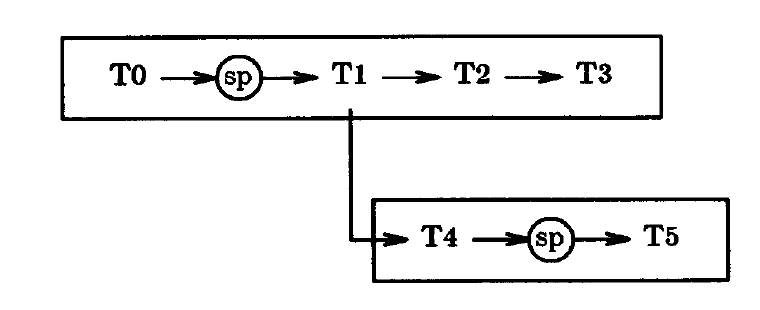

# Sagas（中文译文）

## 译者说明

本文依据同目录的 `source.pdf` 翻译。章节、图表、公式、算法、代码与参考文献按原文结构保留。

Hector Garcia-Molina 
Kenneth Salem

普林斯顿大学计算机科学系 
Princeton, NJ 08544

## 摘要

长事务（long-lived transaction，LLT）会在相对较长的时间内占用数据库资源，显著推迟较短且更常见的事务结束。为缓解这些问题，我们提出 Saga 的概念。如果一个 LLT 可以写成一系列能够与其他事务交错执行的事务，那么这个 LLT 就是一个 Saga。数据库管理系统保证：要么成功完成 Saga 中的所有事务，要么运行补偿事务来弥补部分执行。Saga 的概念和实现都相对简单，却有可能显著改善性能。我们分析与 Saga 有关的各种实现问题，包括如何在不直接支持 Saga 的现有系统上运行 Saga。我们还讨论数据库和 LLT 的设计技术，使 LLT 能够切分为 Saga。

## 1. 引言

顾名思义，长事务是这样一种事务：即使没有其他事务干扰，其执行仍需相当长的时间，可能达到数小时或数天。长事务（简称 LLT）的持续时间远长于大多数其他事务，原因可能是它访问大量数据库对象、包含耗时很长的计算、暂停以等待用户输入，或兼有这些因素。LLT 的例子包括银行生成月度账户对账单的事务、保险公司处理索赔的事务，以及在整个数据库上收集统计信息的事务 [Gray81a]。

在大多数情况下，LLT 会带来严重的性能问题。既然它们是事务，系统就必须把它们作为原子操作执行，从而保持数据库的一致性 [Date81a, Ullm82a]。为了使事务具有原子性，系统通常锁住事务访问的对象，直到事务提交；而提交一般发生在事务末尾。因此，想要访问 LLT 所用对象的其他事务会遭受长时间的锁等待。如果 LLT 之所以很长，是因为它们访问了许多数据库对象，那么其他事务还可能面临更高的阻塞率，也就是说，它们与 LLT 冲突的可能性高于与较短事务冲突的可能性。

LLT 还可能提高事务中止率。如 [Gray81b] 所述，死锁频率对事务的“大小”非常敏感，这里的大小是指事务访问多少对象（在 [Gray81b] 的分析中，死锁频率随事务大小的四次方增长）。因此，LLT 访问许多对象时可能造成大量死锁，进而造成大量中止。从系统崩溃的角度看，LLT 因持续时间较长而更有可能遇到故障，于是也更有可能遭遇更多延迟并被中止。

一般而言，不存在能够消除 LLT 问题的方案。即使我们采用锁以外的机制来保证 LLT 的原子性，长时间延迟和/或较高的中止率仍会存在。无论该机制如何工作，一个需要访问 LLT 已访问对象的事务，都必须等到 LLT 提交后才能提交。

不过，对于特定应用，可以通过放宽“LLT 必须作为原子操作执行”这一要求来缓解问题。换言之，在不牺牲数据库一致性的前提下，某些 LLT 或许可以在完成前释放资源，让其他等待中的事务继续执行。

为说明这一思路，考虑一个航空订座应用。数据库（实际上可能是来自不同航空公司的多个数据库）保存航班预订，事务 $T$ 希望完成若干项预订。在这里，我们假设 $T$ 是一个 LLT（例如，它在每次预订后暂停，等待客户输入）。在这个应用中， $T$ 未必需要一直持有全部资源直到完成。例如， $T$ 在航班 $F_1$ 上预订一个座位后，可以立即允许其他事务在同一航班上预订座位。换句话说，我们可以把 $T$ 看成一组为各个座位执行预订的“子事务” $T_1, T_2, \ldots, T_n$。

但是，我们不希望仅仅把 $T$ 作为一组相互独立的事务提交给数据库管理系统（DBMS），因为我们仍希望 $T$ 是一个要么成功完成、要么完全不做的单元。如果一个 DBMS 允许 $T$ 预订五个座位中的三个，然后由于崩溃不再继续，我们不会满意。另一方面，如果 DBMS 保证 $T$ 要么完成全部预订，要么在不得不暂停 $T$ 时取消已经完成的所有预订，我们就可以接受。

这个例子表明，一种不如常规原子事务机制严格、但仍对 LLT 各组成部分的执行提供一定保证的控制机制会很有用。我们将在本文给出这样一种机制。

我们用 Saga 一词指代能够拆成一组子事务的 LLT，这些子事务可以按任意方式与其他事务交错执行。在这种情况下，每个子事务都是真正的事务，因为它保持数据库一致性。不过，与其他事务不同，Saga 中的事务彼此相关，应当作为一个（非原子的）单元执行；Saga 的任何部分执行都是不希望发生的，一旦发生，就必须予以补偿。

为了弥补部分执行，Saga 中的每个事务 $T_i$ 都应配备一个补偿事务 $C_i$。从语义上说，补偿事务会撤销 $T_i$ 执行的所有操作，但未必把数据库恢复到 $T_i$ 开始执行时的状态。在我们的航空订座示例中，如果 $T_i$ 在某次航班上预订了一个座位，那么 $C_i$ 可以取消该预订（例如，从预订数中减一，并执行其他一些检查）。但是， $C_i$ 不能简单地把 $T_i$ 运行时的座位数写回数据库，因为在 $T_i$ 预订座位与 $C_i$ 取消预订之间，可能已经运行了其他事务，并改变了该航班的预订数。

一旦为 Saga $T _ {1}, T _ {2}, \ldots, T _ {n}$ 定义了补偿事务 $C _ {1}, C _ {2}, \ldots, C _ {n-1}$，系统就可以保证执行以下首选序列：

$$
T_1, T_2, \ldots, T_n
$$

或者，对于某个 $0 \le j \lt n$，执行以下序列：

$$
T_1, T_2, \ldots, T_j, C_j, \ldots, C_2, C_1
$$

需要注意，其他事务可能看见 Saga 部分执行的效果。运行补偿事务 $C_i$ 时，系统不会尝试通知或中止那些可能在 $T_i$ 的结果被 $C_i$ 补偿之前已经看到这些结果的事务。

Saga 看来是一类相当常见的 LLT。当一个 LLT 由一系列相对独立的步骤组成，而每一步不必观察同一个一致数据库状态时，就会出现 Saga。例如，在银行中，经常需要对所有账户执行某个固定操作（例如计算利息），而针对一个账户和下一个账户所做的计算之间几乎没有交互。在办公信息系统中，也经常出现具有独立步骤的 LLT，这些步骤可以同其他事务的步骤交错执行。例如，接收一份采购订单涉及把信息录入数据库、更新库存、通知会计部门、打印发货单等。这样的办公 LLT 模拟现实过程，因此能够应对事务交错。在现实中，人们不会在采购订单完全处理完之前一直把仓库实际锁住。因此，计算机化过程也不必在完成前一直封锁库存数据库。

再次强调，我们给出的银行和办公 LLT 不是普通事务的简单集合，而是 Saga。这里存在一个应用“约束”（无法用数据库一致性约束表达）：这些活动的各个步骤不能悬而未决。应用要求处理所有账户，或完整处理采购订单。如果采购订单未能成功完成，就必须把记录调整正确（例如，库存中不应显示该物品已经出库）。在银行示例中，也许总能向前推进并完成 LLT。在这种情况下，或许根本不需要为未完成的 LLT 执行补偿。

Saga 的概念与若干现有概念有关。例如，Saga 类似嵌套事务 [Mossa, Lync83a, Lync86a]，区别在于：

1. Saga 只允许两个嵌套层级：顶层 Saga 和简单事务；
2. 外层不提供完整原子性。也就是说，Saga 可以看见其他 Saga 的部分结果。

Saga 也可以看作在 [Garc83a] 所述机制下运行的一类特殊事务。我们对那些更一般的机制施加了限制，使 Saga 的实现（和理解）简单得多，因而也更有可能在实践中得到使用。

其他相关思想包括 [Giff85a] 描述的“独立原子操作”，它与 Saga 相似；以及 [Kort85a] 对 CAD 环境中长事务的研究。[Norm83a] 描述的分布式数据库应用 EMPACT 使用包含更新事务的“暂存文件”，在远程系统上执行这些事务，以更新复制的分布式数据。

使 Saga 可行需要两个要素：支持 Saga 的 DBMS，以及被拆成事务序列的 LLT。本文中，我们聚焦于如何在集中式数据库系统中获得这两个要素。由于 Saga 的概念非常简单，并不需要复杂或新颖的实现机制（事实上，如第 7 节所述，可以在现有 DBMS 之上完整实现 Saga）。因此，本文重点不在提出新颖的实现技术，而在于为简单、清晰且高效的 Saga 实现推荐适当的技术。

我们在第 2 至第 7 节研究 Saga 处理机制的实现。我们先讨论应用程序员如何定义 Saga，再讨论系统如何支持 Saga。起初，我们假设补偿事务只会遇到系统故障。随后，我们在第 6 节研究其他故障（例如程序错误）对补偿事务的影响。由于篇幅限制，我们只讨论集中式系统中的 Saga，尽管 Saga 显然也可以在分布式数据库系统中实现。

我们在第 8 节和第 9 节讨论 LLT 的设计。我们先说明，Saga 的顺序事务执行模型可以推广到并行事务执行，从而覆盖更广泛的 LLT。然后，我们讨论应用程序员可以采用的一些策略，以便写出真正的 Saga 型 LLT，并利用我们提出的机制。

## 2. 用户设施

从应用程序员的角度看，需要一种机制向系统说明 Saga 的开始和结束、每个事务的开始和结束，以及补偿事务。该机制可以类似于常规系统用于管理事务的机制 [Gray78a]。

具体来说，应用程序希望发起 Saga 时，向系统发出 `begin-saga` 命令。随后是一系列标明各事务边界的 `begin-transaction`、`end-transaction` 命令。在事务之间，应用程序可以执行不访问数据库的操作，例如操纵局部变量。在事务内部，应用程序可以发出常规数据库访问命令。此外，应用程序可以选择发出 `abort-transaction` 命令，主动发起中止。该命令终止当前事务，但不终止 Saga。类似地，`abort-saga` 命令先中止当前正在执行的事务，再通过运行补偿事务中止整个 Saga。最后，`end-saga` 命令提交当前正在执行的事务（如果有），并完成 Saga。

这些命令大多带有各种参数。`begin-saga` 命令可以向程序返回一个 Saga 标识符；随后该 Saga 发出的调用可以把此标识符传给系统。`abort-transaction` 命令会把事务中止后 Saga 应从何处继续执行的地址作为参数。每次 `end-transaction` 调用都包括补偿事务的标识；如果当前结束的事务必须回滚，就要执行该补偿事务。标识中包括补偿程序的名称和入口点，以及补偿事务可能需要的任何参数。（我们假设每个补偿程序都包含自己的 `begin-transaction` 和 `end-transaction` 调用。补偿事务内部不允许使用 `abort-transaction` 和 `abort-saga` 命令。）最后，`abort-saga` 命令可以把下文所述的保存点标识符作为参数。

每个事务也可以把其补偿事务未来可能需要的参数存入数据库。在这种情况下，系统不必传递这些参数；补偿事务启动时可以从数据库读取它们。还要注意，如果一条 `end-saga` 命令同时结束最后一个事务和 Saga，就不必为最后一个事务配备补偿事务。若改用单独的 `end-transaction`，其中就必须包含补偿事务的标识。

在某些情况下，让应用程序员通过 `save-point` 命令指出应在何处建立 Saga 检查点可能更为可取。该命令可以在事务之间发出。它强制系统保存正在运行的应用程序的状态，并返回保存点标识符供将来引用。发生 Saga 故障或系统崩溃后，保存点可以减少工作量：系统不必补偿所有未了事务，而可以只补偿上一个保存点之后执行的事务，再从该保存点重启 Saga。

当然，这意味着我们现在可能看到如下执行序列：

$$
T_1, T_2, C_2, T_2, T_3, T_4, T_5, C_5, C_4, T_4, T_5, T_6
$$

第一次成功执行 $T_2$ 后，系统崩溃。虽然在 $T_1$ 后建立了保存点，但要从那里重启，系统首先要通过运行 $C_2$ 撤销 $T_2$。随后 Saga 可以重启并重新执行 $T_2$。执行 $T_5$ 后又发生了第二次故障。这意味着，我们前面给出的有效执行序列定义必须修改，以包括这样的序列。如果这些部分恢复序列无效，系统就应当不建立保存点，或者在每个事务的开始（或结束）处自动建立保存点。

到目前为止，我们描述的模型相当一般，但在某些情况下，使用限制更多的模型可能更容易。我们将在第 5 节讨论这种受限模型。

## 3. 可靠保存代码

在常规事务处理系统中，崩溃后把数据库恢复到一致状态并不需要应用程序代码。如果故障毁掉正在运行的事务代码，系统日志仍包含足够的信息来撤销该事务的效果。在 Saga 处理系统中，情况有所不同。要在崩溃后完成正在运行的 Saga，就必须完成缺失的事务，或者运行补偿事务来中止 Saga。无论哪种情况，都必须具备所需的应用程序代码。

使用抽象数据类型的事务系统也面临类似问题。恢复抽象数据对象时，可能需要记录对该数据类型的操作（以及逆操作），而不是记录旧值和新值 [Spec83a]。因此，如果要在崩溃后把数据库恢复到一致状态，实现这些操作的代码必须留存下来。

这个问题有多种可能的解决方案。其一，是像常规系统处理系统代码那样处理应用程序代码。常规 DBMS 虽然不必可靠保存应用程序代码，却必须保存系统代码。也就是说，如果故障毁掉了运行系统所需的代码，常规 DBMS 就无法重启。因此，常规系统会在 DBMS 外部使用手工或自动过程，更新并保存系统备份副本。

在 Saga 处理系统中，我们可以要求以相同方式定义和更新 Saga 的应用程序代码。每个新创建的程序版本都存入当前系统区和一个或多个备份区。由于更新不受 DBMS 控制，它们不是原子操作；如果更新期间发生崩溃，很可能需要人工干预。Saga 开始运行时，会假设它的所有事务和补偿事务都已经预定义，只需进行适当调用。

如果 Saga 由可信的应用程序员编写，而且不经常更新，这种办法可能可以接受。否则，把 Saga 代码作为数据库的一部分处理可能更好。如果把 Saga 代码直接存为一个或多个数据库对象，它就能自动恢复。唯一的缺点是 DBMS 必须能够处理代码这种大型对象。有些系统做不到这一点，可能因为其数据模型不允许大型“非结构化”对象，缓冲区管理器无法管理跨越多个缓冲区的对象，或存在其他原因。

如果 DBMS 能够管理代码，那么可靠保存 Saga 代码就相当简单。Saga 的第一个事务 $T_1$ 把以后可能需要的所有事务（无论是否为补偿事务）写入数据库。 $T_1$ 提交后，Saga 的其余部分便可以开始。 $T_1$ 的补偿事务 $C_1$ 只需从数据库删除这些对象。事务也可以增量定义。例如，补偿事务 $C_i$ 不必在相应事务 $T_i$ 准备提交前写入数据库。这种做法略为复杂，但可以避免不必要的数据库操作。

## 4. 向后恢复

故障打断 Saga 时有两种选择：补偿已经执行的事务，即向后恢复；或者执行缺失的事务，即向前恢复（当然，并非所有情形都可以向前恢复）。向后恢复需要补偿事务，向前恢复需要保存点。本节中，我们将说明如何实现纯向后恢复；下一节将讨论向后/向前混合恢复和纯向前恢复。

在 DBMS 内部，由 Saga 执行组件（saga execution component，SEC）管理 Saga。它调用常规的事务执行组件（transaction execution component，TEC），后者负责执行各个事务。SEC 的工作方式与 TEC 相似：SEC 把一系列事务作为一个单元执行，TEC 则把一系列操作作为一个（原子）单元执行。两个组件都需要日志来记录 Saga 和事务的活动。实际上，把两种日志合并成一份很方便，我们也假设采用这种方式。我们还假设为了可靠性，日志有两个副本。SEC 不需要并发控制，因为它控制的事务可以与其他事务交错执行。

所有 Saga 命令和数据库操作都经由 SEC。每条 Saga 命令（例如 `begin-saga`）都先记入日志，再采取任何操作。命令中的任何参数（例如 `end-transaction` 命令中的补偿事务标识）也会记入日志。`begin-transaction` 和 `end-transaction` 命令以及所有数据库操作都会转发给 TEC，由 TEC 按常规方式处理 [Gray78a]。

SEC 收到 `abort-saga` 命令时发起向后恢复。为说明这一过程，我们考虑一个已经执行事务 $T_1$ 和 $T_2$，并在 $T_3$ 执行到一半时向 SEC 发出 `abort-saga` 命令的 Saga。SEC 把该命令记入日志（防止回滚期间发生崩溃），再指示 TEC 中止当前事务 $T_3$。该事务使用常规技术回滚，例如把日志中的“之前”值写回数据库。

接下来，SEC 查阅日志，命令执行补偿事务 $C_2$ 和 $C_1$。如果这些事务的参数在日志中，SEC 会提取参数并在调用时传入。两个事务像其他事务一样执行；当然，TEC 会在日志中记录它们开始和提交的时间信息。（如果此时发生崩溃，系统便能知道还剩哪些工作。） $C_1$ 提交后，Saga 终止。系统在日志中写入一条与 `end-saga` 命令所创建条目相似的记录。

日志也用于崩溃恢复。崩溃后，首先调用 TEC 清理待定事务。所有事务均已中止或提交后，SEC 评估每个 Saga 的状态。如果某个 Saga 在日志中同时有对应的 `begin-saga` 和 `end-saga` 条目，说明该 Saga 已完成，无需进一步操作。如果缺少 `end-saga` 条目，就中止该 Saga。SEC 扫描日志，找出最后一个成功执行且尚未补偿的事务，并为该事务及其之前的所有事务运行补偿事务。

## 5. 向前恢复

向前恢复要求 SEC 拥有所有缺失事务代码的可靠副本以及一个保存点。使用哪个保存点，可以由应用程序指定，也可以由系统指定，取决于是谁中止了 Saga。（回顾前文，保存点标识符可以作为 `abort-saga` 命令的参数。）如果发生系统崩溃，恢复组件可以为每个活动 Saga 指定最近的保存点。

为说明这种情况下 SEC 的工作方式，考虑一个依次执行事务 $T_1$、 $T_2$、一条保存点命令和事务 $T_3$ 的 Saga。系统随后在执行事务 $T_4$ 期间崩溃。恢复时，系统必须先向后恢复到保存点（中止 $T_4$ 并运行 $C_3$）。确认用于运行 $T_3, T_4, \ldots$ 的代码可用后，SEC 把重启决定记入日志并重启 Saga。我们称之为向后/向前恢复。

如第 2 节所述，如果在每个事务开始时自动建立保存点，就可以进行纯向前恢复。如果我们再禁止使用 `abort-saga` 命令，就完全不必进行向后恢复[^1]（`abort-transaction` 命令仍然可以使用）。这样做的优点是无需补偿事务，而有些应用可能难以编写补偿事务（见第 9 节）。

[^1]: 在这种情况下，我们还必须假设 Saga 中的每个子事务只要重试足够多次，最终都会成功。

此时 SEC 成为一个简单的“持久”事务执行器，类似于持久消息传输机制 [Hamm80a]。每次崩溃后，SEC 对每个活动 Saga 指示 TEC 中止最后一个正在执行的事务，再从该事务开始的位置重启 Saga。

我们还可以进一步简化：把 Saga 直接看作一个文件，其中包含对各个事务程序的一系列调用。此时不需要显式的 Saga 开始或结束命令，也不需要显式的事务开始或结束命令。Saga 从文件中的第一次调用开始，到最后一次调用结束；而且每次调用都是一个事务。运行中 Saga 的状态就是正在执行的事务编号。这意味着系统可以在每个事务后以极低成本建立保存点。

这种纯向前恢复方法适用于总能成功的简单 LLT。为银行账户计算利息支付的 LLT 可能就是一例。某个账户上的利息计算可能失败（通过 `abort-transaction` 命令），但其余计算会不受影响地继续进行。

采用操作系统术语，上述事务文件模型可以称为 EXEC（或 SCRIPT、BATCH）。不过，据我们所知，所有 EXEC 设施都不具有我们这里所说的持久性（例如，失败的 EXEC 可能只是从头重启，而不执行补偿）。

## 6. 其他错误

到目前为止，我们一直假设用户提供的补偿事务代码没有错误。但是，如果补偿事务由于错误而无法成功完成（例如，它试图读取一个不存在的文件，或者代码中有错误），会发生什么？该事务可以中止，但再次运行时很可能遇到相同错误。此时系统陷入僵局：既不能中止该事务，也不能完成该事务。在纯向前场景中，如果某个事务出错，也会出现类似情况。

一种可能的解决方案是采用与恢复块 [Ande81a, Horn74a] 类似的软件容错技术。恢复块是在主代码块中检测到故障时使用的备用或次级代码块。检测到故障后，系统重置到主代码块执行前的状态，再执行次级代码块。次级代码块用不同的算法或技术实现与主代码块相同的目标，以期避开主代码块的故障。

恢复块思想很容易转换到 Saga 框架中。事务是天然的程序块，而 TEC 为失败事务提供回滚能力。Saga 应用程序可以控制恢复块的执行。应用程序中止一个事务（或收到其事务已被中止的通知）后，可以中止 Saga、尝试替代事务或重试主事务。补偿事务也可以配备替代事务，使 Saga 的中止更可靠。

该问题的另一种可能解决方案是人工干预。先中止出错事务，再把它交给应用程序员；应用程序员根据错误描述修复事务。随后，SEC（或应用程序）重新运行该事务并继续处理 Saga。

有利的是，人工修复事务期间，Saga 不占用任何数据库资源（即锁）。因此，一个本来就很长的 Saga 即使耗时更久，也不会显著影响其他事务的性能。

依靠人工干预当然不够优雅，却是一个实用的方案。剩下的选择是把 Saga 作为长事务运行。这样的 LLT 遇到错误时会被整体中止，可能浪费更多工作。而且，代码错误仍必须人工修复，随后重新提交 LLT。唯一的优点是，修复期间系统不知道这个 LLT 的存在。对于 Saga，Saga 会一直在系统中保持待定，直到安装修复后的事务。

## 7. 在现有 DBMS 之上实现 Saga

在我们对 Saga 管理的讨论中，我们假设 SEC 是 DBMS 的一部分，并能直接访问日志。不过，在某些情况下，在不直接支持 Saga 的现有 DBMS 上运行 Saga 可能更为可取。只要数据库能够存储大型非结构化对象（即代码和保存点），就可以做到这一点。不过，这会给应用程序员更多责任，也可能损害性能。

在完全不修改 DBMS 内部实现的情况下运行 Saga，基本上要做两件事。第一，嵌在应用程序代码中的 Saga 命令改为子例程调用，而不是系统调用。（这些子例程与应用程序代码一同加载。）每个子例程都在数据库中存储 SEC 原本会写入日志的全部信息。例如，`begin-saga` 子例程会在活动 Saga 数据库表中写入该 Saga 的标识。`save-point` 子例程让应用程序把自身状态（或状态中的关键部分）保存在类似的数据库表中。类似地，`end-transaction` 子例程先把正在结束的事务及其补偿事务的标识写入一个或多个其他表，再执行由 TEC 处理的 `end-transaction` 系统调用。

把 Saga 信息（保存点除外）存入数据库的命令必须始终在事务内执行，否则信息可能在崩溃时丢失。因此，Saga 子例程必须跟踪 Saga 当前是否正在执行事务。只要 `begin-transaction` 子例程设置一个由 `end-transaction` 子例程清除的标志，就能轻松做到这一点。该标志未设置时，禁止所有数据库存储操作。需要注意，只有应用程序代码从不自行发出系统调用时，子例程方法才有效。例如，如果事务由 `end-transaction` 系统调用（而不是子例程调用）终止，补偿信息就不会被记录，事务标志也不会被清除。

第二，必须有一个专门进程实现 SEC 的其余功能。这个进程称为 Saga 守护进程（saga daemon，SD），始终处于活动状态。发生崩溃后，操作系统会重启它。崩溃后，它扫描 Saga 表以确定待定 Saga 的状态。扫描通过提交一个数据库事务完成。TEC 只会在事务恢复完成后执行这个事务，因此 SD 读取到的是一致数据。SD 获得待定 Saga 的状态后，便像 SEC 在恢复后那样发出所需的补偿事务或正常事务。还必须谨慎避免干扰那些在崩溃后、SD 提交数据库查询之前刚刚启动的 Saga。

TEC 中止事务后（例如因为死锁或用户主动中止），可能直接终止发起该事务的进程。在常规系统中，这样做或许没有问题，但对 Saga 而言会留下未完成的 Saga。如果 TEC 此时无法通知 SD，SD 就必须定期扫描 Saga 表，寻找这种情况。一旦发现，立即采取纠正措施。

运行中的 Saga 也可以直接向 SD 请求服务。例如，为执行 `abort-saga`，`abort-saga` 子例程向 SD 发送请求，然后在必要时执行 `abort-transaction`。

## 8. 并行 Saga

我们关于 Saga 内顺序事务执行的模型可以扩展为包含并行事务。对于 Saga 中的事务天然适合并发执行的应用，这一点可能很有用。例如，处理采购订单时，同时生成发货单和更新应收账款可能是最佳选择。

我们假设一个 Saga 进程（父进程）可以创建与其并行运行的新进程（子进程），其请求类似于 UNIX 中的 fork 请求。系统也可以提供 join 功能，把 Saga 内的进程合并起来。

并行 Saga 的向后崩溃恢复与顺序 Saga 类似。在并行 Saga 的每个进程中，事务都像顺序 Saga 一样按相反顺序执行补偿（或撤销）。此外，子进程中的所有补偿，都必须先于父进程中那些在创建（fork）子进程之前执行的事务的补偿。（需要注意，只有进程内部的事务执行顺序以及 fork 和 join 信息会约束补偿顺序。如果 $T_1$ 和 $T_2$ 在并行进程中执行，且 $T_2$ 读取了 $T_1$ 写入的数据，那么补偿 $T_1$ 并不要求我们先补偿 $T_2$。）

与向后崩溃恢复相比，并行 Saga 因 Saga 故障而执行向后恢复更复杂，因为 Saga 可能包含多个进程，而所有这些进程都必须终止。为此，适合让所有进程的 fork 和 join 操作都经由 SEC，使 SEC 能够跟踪 Saga 的进程结构。当某个 Saga 进程请求 `abort-saga` 时，SEC 终止参与该 Saga 的全部进程。随后，它中止所有待定事务，并补偿所有已提交事务。

由于可能存在“不一致”的保存点，向前恢复更加复杂。为说明这一点，考虑图 8.1 所示的 Saga。每个方框代表一个进程，方框内是该进程执行的事务和保存点（sp）序列。下方进程在 $T_1$ 提交后 fork 出来。假设 $T_3$ 和 $T_5$ 是当前正在执行的事务，并且在 $T_1$ 和 $T_5$ 之前建立了保存点。

*图 8.1：并行 Saga。*

此时系统发生故障。上方进程必须从 $T_1$ 之前重启。因此，第二个进程建立的保存点没有用处，因为它依赖于正在被补偿的 $T_1$ 的执行。

这个问题称为级联回滚。人们已经在进程通过消息或共享数据对象通信的场景中分析过该问题 [Hadz82a, Rand78a]。在那种场景中，可以分析保存点依赖关系，得到一个一致的保存点集合（如果存在）。随后可以用这个一致集合重启各进程。对于并行 Saga，情况还要简单，因为保存点依赖只来自 fork、join，以及进程内部的事务与保存点顺序。

为了得到一致的保存点集合，SEC 仍必须获知进程的 fork 和 join。信息必须存入日志，并在恢复时分析。SEC 在 Saga 的每个进程中选择满足以下条件的最新保存点：该保存点之前的事务均未被补偿。（如果一个事务在替代某个保存点执行的事务之后必须被补偿，那么该事务早于这个保存点。）如果某个进程中不存在这样的保存点，该进程就必须整体回滚。对于存在保存点的进程，可以执行必要的向后恢复并重启进程。

## 9. 设计 Saga

只有应用程序员把 LLT 写成 Saga，我们描述的 Saga 处理机制才有用。于是，以下问题会立即出现：程序员如何知道某个给定 LLT 能否安全拆成一个事务序列？程序员如何选择切分点？编写补偿事务有多困难？我们将在本节讨论其中一些问题。

要在 LLT 中识别潜在子事务，就必须寻找所执行工作的自然分界。在很多情况下，LLT 模拟一系列现实世界操作，而每项操作都是 Saga 事务的候选。例如，一名大学生毕业时，必须先完成若干操作，才能颁发毕业证书：图书馆必须检查其没有未归还图书；财务主管必须检查所有住宿费和学费账单都已核验；必须记录学生的新地址，等等。显然，这些现实世界操作中的每一项都可以建模为一个事务。

在其他情况下，数据库本身会自然划分为相对独立的组成部分，对每个部分的操作可以归入一个 Saga 事务。例如，考虑大型操作系统的源代码。通常可以把操作系统及其程序划分为调度器、内存管理器、中断处理程序等组成部分。一个向操作系统加入跟踪功能的 LLT 可以拆开，使每个事务向其中一个组成部分添加跟踪代码。类似地，如果员工数据可以按工厂所在地拆分，那么给所有员工发放生活成本加薪的 LLT 可以按工厂所在地拆分。

一般而言，为 LLT 设计补偿事务是一个困难问题。（例如，如果某个事务发射了一枚导弹，可能无法撤销该操作。）不过，对于许多实际应用，编写补偿事务可能与编写事务本身一样简单（或一样困难）。事实上，Gray 在 [Gray81a] 中指出，事务通常能在应用的事务集合中找到相应补偿事务。事务模拟可以撤销的现实世界操作时尤其如此，例如预订租赁汽车或签发发货单。在这类情况下，编写补偿事务和编写普通事务非常相似：程序员必须编写执行操作并保持数据库一致性约束的代码。

甚至更难撤销的操作，例如寄信或打印支票，也可能得到补偿。例如，为补偿寄信，可以再寄一封解释问题的信；为补偿支票，可以向银行发送止付消息。当然，最好不必补偿这些操作。不过，把 LLT 作为普通事务运行的代价可能高到迫使人们编写 Saga 及其补偿事务。

还要回顾，纯向前恢复不需要补偿事务（见第 5 节）。因此，如果补偿事务难以编写，可以调整应用，使 LLT 不发生用户主动中止。没有这类中止，就可以进行纯向前恢复，而且永远不需要补偿。

我们的前文讨论已经表明，数据库结构在 Saga 设计中起重要作用。因此，最好不要孤立研究每个 LLT，而应在设计整个数据库时同时考虑 LLT 和 Saga。也就是说，如果数据库可以布局为一组松耦合的组成部分（组成部分之间只有少量且简单的一致性约束），LLT 就很可能自然拆成可以交错执行的子事务。

另一种可能有助于把 LLT 转换为 Saga 的技术，是把 LLT 的临时数据存入数据库本身。为说明这一点，考虑一个包含三个子事务 $T_1$、 $T_2$、 $T_3$ 的 LLT $L$。在 $T_1$ 中， $L$ 执行一些操作，然后从数据库中的某个账户提取一定金额。这笔金额保存在一个临时局部变量中，直到 $T_3$ 执行期间再把资金存入其他一个或多个账户。 $T_1$ 完成后，数据库处于不一致状态，因为有一笔钱“失踪”了，也就是说，在数据库中找不到这笔钱。因此， $L$ 不能作为 Saga 运行。如果这样做，一个需要看见全部资金的事务（例如审计事务）可能在 $T_1$ 和 $T_3$ 之间运行，因而找不到全部资金。如果把 $L$ 作为普通事务运行，审计就会延迟到 $L$ 完成。这保证了一致性，却损害性能。

但是，如果 $L$ 不把失踪资金保存在本地存储中，而是将其存入数据库，那么数据库将保持一致，其他事务也可以交错执行。为此，我们必须把这种“临时”存储纳入数据库模式（例如，我们增加一个记录在途资金或待处理保险索赔的关系）。而且，需要看见全部资金的事务必须知道这种新存储。因此，最好在数据库初次设计时就定义这种存储，不要事后补加。

即使 $L$ 没有事务 $T_2$，把失踪资金写入数据库仍可能有益。需要注意，在这种情况下， $L$ 会在 $T_1$ 后释放临时存储上的锁，紧接着在 $T_3$ 中再次请求这些锁。这可能给 $L$ 增加一些开销，但作为回报，那些等待查看资金的事务可以在 $T_1$ 后更早继续执行。这类似于一个人执行庞大的复印任务时定期让开，让较短的任务先通过。为此，必须暂时释放争用的资源，即复印机或资金。

我们认为，我们以上针对资金和 LLT $L$ 的论述普遍成立。设计数据库和 LLT 时，应尽量减少通过本地存储从一个子事务传给下一个子事务的数据。把这项技术与结构良好的数据库结合起来，就可以把 LLT 写成 Saga。

## 10. 结论

我们提出了 Saga 的概念：Saga 是一种可以拆成多个事务、但仍作为一个单元执行的长事务。这个概念及其实现都相对简单，而它的价值恰恰在于这种简单性。我们认为，无论作为 DBMS 的一部分，还是作为附加设施，Saga 处理机制都能以相对较少的工作量实现。随后，大量属于 Saga 的 LLT 都可以使用该机制，显著改善性能。

## 致谢

Bruce Lindsay 提供了若干有用建议，其中包括“Saga”这个名称。Rafael Alonso、Ricardo Cordon 和匿名审稿人也贡献了许多想法。

本研究得到美国国防部国防高级研究计划局和海军研究办公室合同 N00014-85-C-0456、N00014-85-K-0465，国家科学基金会合作协议 DCR-8420948，以及 IBM 研究生奖学金的支持。本文所含观点和结论属于本文作者，不应解释为国防高级研究计划局或美国政府明示或暗示的官方政策。

## 参考文献

[Ande81a] Anderson, T. and P. A. Lee, *Fault Tolerance, Principles and Practice*, Prentice-Hall International, London, 1981.

[Date81a] Date, C. J., *An Introduction to Database Systems*, 3rd Edition, Addison-Wesley, Reading, MA, 1981.

[Garc83a] Garcia-Molina, Hector, “Using Semantic Knowledge for Transaction Processing in a Distributed Database,” *ACM Transactions on Database Systems*, vol. 8, no. 2, pp. 186–213, June 1983.

[Giff85a] Gifford, David K. and James E. Donahue, “Coordinating Independent Atomic Actions,” *Proceedings of IEEE COMPCON*, San Francisco, CA, February 1985.

[Gray78a] Gray, Jim, “Notes on Data Base Operating Systems,” in *Operating Systems: An Advanced Course*, ed. G. Seegmüller, pp. 393–481, Springer-Verlag, 1978.

[Gray81a] Gray, Jim, “The Transaction Concept: Virtues and Limitations,” *Proceedings of the Seventh Int’l Conference on Very Large Databases*, pp. 144–154, IEEE, Cannes, France, Sept. 1981.

[Gray81b] Gray, Jim, Pete Homan, Ron Obermarck, and Hank Korth, “A Straw Man Analysis of Probability of Waiting and Deadlock,” IBM Research Report RJ3066 (38112), IBM Research Laboratory, San Jose, California, Feb. 1981.

[Hadz82a] Hadzilacos, Vassos, “An Algorithm for Minimizing Roll Back Cost,” *Proc. ACM Symp. on PODS*, pp. 93–97, Los Angeles, CA, March 1982.

[Hamm80a] Hammer, Michael and David Shipman, “Reliability Mechanisms for SDD-1: A System for Distributed Databases,” *ACM Transactions on Database Systems*, vol. 5, pp. 431–466, December 1980.

[Horn74a] Horning, J. J., H. C. Lauer, P. M. Melliar-Smith, and B. Randell, “A Program Structure for Error Detection and Recovery,” in *Lecture Notes in Computer Science 16*, ed. C. Kaiser, Springer-Verlag, Berlin, 1974.

[Kort85a] Korth, Henry F. and Won Kim, “A Concurrency Control Scheme for CAD Transactions,” Technical Report TR-85-34, Dept. of Computer Science, Univ. of Texas at Austin, December 1985.

[Lync83a] Lynch, Nancy, “Multilevel Atomicity — A New Correctness Criterion for Database Concurrency Control,” *ACM Transactions on Database Systems*, vol. 8, no. 4, pp. 484–502, December 1983.

[Lync86a] Lynch, Nancy and Michael Merritt, “Introduction to the Theory of Nested Transactions,” unpublished, MIT, June 1986.

[Mossa] Moss, J. Elliot B., “Nested Transactions: An Introduction,” unpublished, U.S. Army War College.

[Norm83a] Norman, Alan and Mark Anderton, “EMPACT: A Distributed Database Application,” *Proc. National Computer Conference*, pp. 203–217, AFIPS Press, 1983.

[Rand78a] Randell, B., P. A. Lee, and P. C. Treleaven, “Reliability in Computing System Design,” *Computing Surveys*, vol. 10, no. 2, pp. 123–165, ACM, June 1978.

[Spec83a] Spector, Alfred Z. and Peter M. Schwarz, “Transactions: A Construct for Reliable Distributed Computing,” *Operating Systems Review*, vol. 17, no. 2, pp. 18–35, ACM SIGOPS, April 1983.

[Ullm82a] Ullman, Jeffrey D., *Principles of Database Systems*, 2nd Edition, Computer Science Press, Rockville, MD, 1982.
