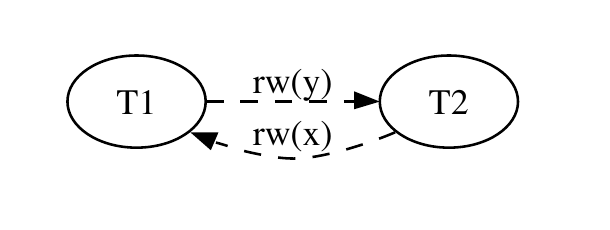
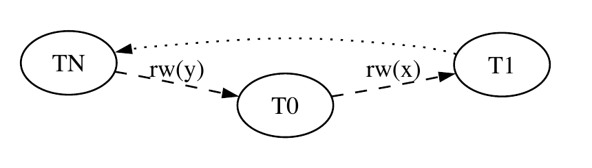
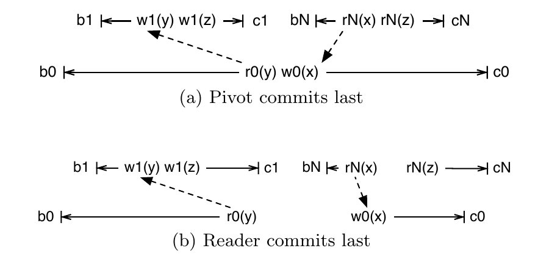
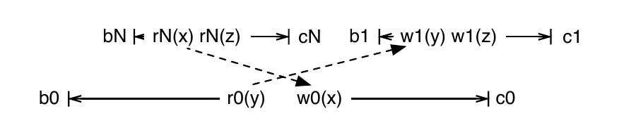
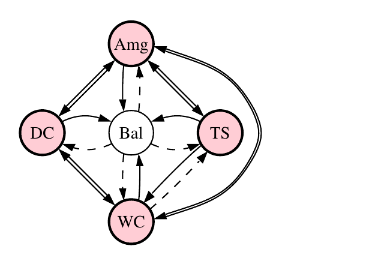
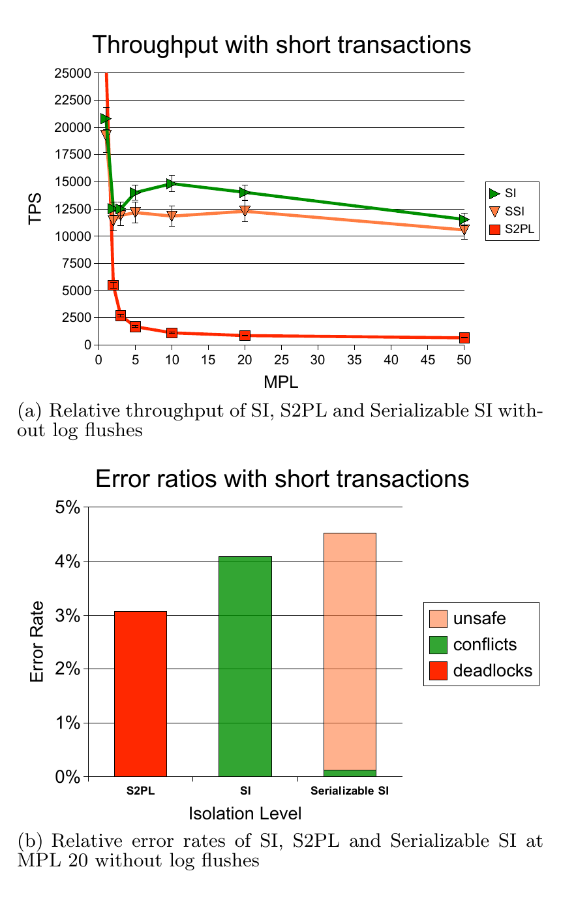
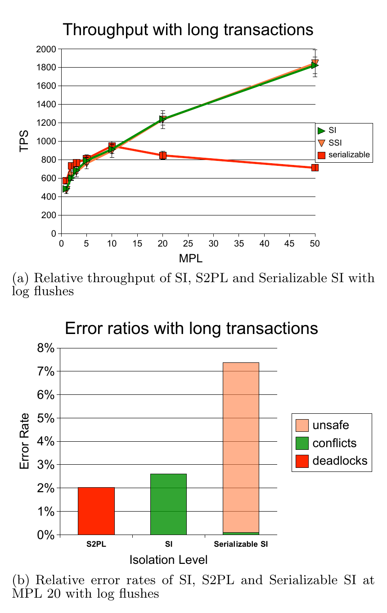
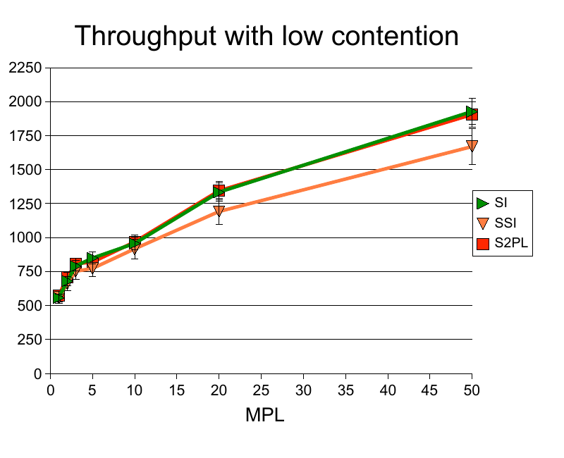

# Serializable Isolation for Snapshot Databases（中文译文）

## 译者说明

本文依据同目录的 `source.pdf` 翻译。章节、图表、公式、算法、代码与参考文献按原文结构保留。

## 作者与出版信息

Michael J. Cahill\*（`mjc@it.usyd.edu.au`）、Uwe Röhm（`roehm@it.usyd.edu.au`）、Alan D. Fekete（`fekete@it.usyd.edu.au`）

悉尼大学信息技术学院，澳大利亚新南威尔士州 2006

\* Michael J. Cahill 同时也是 Oracle Corporation 的员工。本项工作在悉尼大学期间完成。

发表于 SIGMOD ’08，2008 年 6 月 9–12 日，加拿大不列颠哥伦比亚省温哥华。© 2008 ACM，978-1-60558-102-6/08/06，费用标识 \$5.00。

原文许可声明：在复制件不用于营利或商业优势、并在首页保留本声明与完整引文的前提下，允许免费为个人或课堂用途制作本文全部或部分内容的数字或纸质复制件。其他复制、再版、在服务器上发布或向列表重新分发的用途，需要事先取得专门许可和/或付费。

## 摘要

许多流行的数据库管理系统提供快照隔离，而不是完全可串行化。快照隔离允许一些众所周知的异常：各自都能保持一致性的事务一旦交错执行，便可能违反数据一致性。此前，防止这些异常的唯一办法，是仔细分析每一对事务之间的冲突，再通过引入人为的加锁或更新冲突来修改应用程序。

本文描述了对数据库管理系统并发控制算法的一项修改。它能针对任意应用程序，在运行时自动检测并防止快照隔离异常，从而提供可串行化隔离。新算法保留了快照隔离之所以有吸引力的性质，包括读者不阻塞写者、写者也不阻塞读者。本文还描述了算法的实现与性能研究；结果表明，在多数情况下，其吞吐量接近快照隔离。

**主题分类与描述：** H.2.4 [数据库管理（Database Management）]：系统（Systems）—事务处理（Transaction processing）

**一般术语：** 算法（Algorithms）、性能（Performance）、可靠性（Reliability）

**关键词：** 多版本并发控制（Multiversion Concurrency Control）、可串行化理论（Serializability Theory）、快照隔离（Snapshot Isolation）

## 1. 引言

事务执行时，可串行化是一项重要性质，因为它能保证完整性约束得到维持，即使这些约束并未显式声明给 DBMS。若 DBMS 强制所有执行都可串行化，开发者便不必担心数据不一致会作为并发或故障的副作用出现。众所周知，可以使用严格两阶段锁（以及托管锁、层次粒度锁等各种增强技术）来控制并发，从而产生可串行化执行 [11]。也有其他已知的并发控制算法能保证可串行化执行，但它们并未在实践中得到采用，因为其性能通常不如工程实现良好的严格两阶段锁（Strict Two-Phase Locking，S2PL）。

快照隔离（Snapshot Isolation，SI）[3] 是另一种并发控制方法，它利用每个数据项的多个版本。在 SI 中，事务 T 看到的是 T 开始之前所有已提交事务产生的数据库状态，却看不到与 T 时间重叠的事务所产生的任何影响。这意味着 SI 永远不会出现不一致读（Inconsistent Read）。在使用 SI 做并发控制的 DBMS 中，读不会因为并发事务的写而延迟，读也不会使写事务延迟。

为防止丢失更新（Lost Update）异常，当某个并发事务已经提交了对事务 T 想要更新之数据项的修改时，SI 会中止 T。这称为“先提交者获胜”（First-Committer-Wins）规则。

尽管 SI 具有这些良好性质，但自文献 [3] 正式定义 SI 以来，人们便已知道 SI 允许不可串行化的执行。具体来说，基于 SI 的并发控制可能交错执行一些事务：每个事务单独运行时都保持完整性约束，但交错执行后的最终状态却不满足该约束。当并发事务修改由同一约束关联起来的不同数据项时，就会发生这种情形；这称为写偏斜（Write Skew）异常。

**示例 1：** 假设表 `Duties(DoctorId, Shift, Status)` 表示每位医生在每个班次中的状态（“on duty”或“reserve”）。一个未声明的不变量是：每个班次必须至少有一名医生值班。图 1 给出了一个带参数的应用程序，它把班次 S 上的医生 D 改为“reserve”。

```sql
BEGIN TRANSACTION

UPDATE Duties SET Status = 'reserve'
 WHERE DoctorId = :D
   AND Shift = :S
   AND Status = 'on duty'

SELECT COUNT(DISTINCT DoctorId) INTO tmp
  FROM Duties
 WHERE Shift = :S
   AND Status = 'on duty'

IF (tmp = 0) THEN ROLLBACK ELSE COMMIT
```

**图 1：表现出写偏斜的带参数应用程序示例。**

这个程序是一致的，也就是说，它把数据库从一个满足完整性约束的状态带到另一个满足该约束的状态。不过，假设班次 S 恰有两名值班医生 D1 和 D2。若我们并发运行两个事务，分别以参数 `(D1, S)` 和 `(D2, S)` 执行该程序，那么我们可以看到，以 SI 做并发控制会允许二者都提交，因为每个事务看到的另一名医生在班次 S 上的状态都仍未改变，仍是“on duty”。然而，最终数据库状态中班次 S 已没有值班医生，因而违反了完整性约束。

尽管 SI 可能破坏数据库状态，它仍已受到 DBMS 厂商欢迎。SI 往往能提供远高于严格两阶段锁的吞吐量，尤其是在读密集型工作负载中；它向用户提供的事务语义也很容易理解。许多流行且具有重要商业价值的数据库引擎都提供 SI，其中一些甚至在用户请求可串行化隔离时实际使用 SI [13]。

由于 SI 会导致数据损坏、同时又如此常见，已有一系列工作研究如何在用 SI 做并发控制时保证执行可串行化。迄今提出的主要技术 [9, 8, 14] 依赖在设计时对应用程序代码做静态分析，并在必要时修改应用，以避开 SI 异常。例如，文献 [9] 展示了如何向应用引入写—写冲突，使其所有执行即使在 SI 上也都可串行化。

使用静态分析使 SI 可串行化存在多项局限。它依赖培训宣传，让应用开发者了解 SI 异常；它也无法应对即席事务。此外，随着应用演进，这项工作必须持续进行：分析需要全局事务冲突图，因此应用中的每一处微小改动都要求重新分析，并可能要求更多修改，甚至要修改本身没有变化的程序。本文中，我们转而关注如何保证任意事务的每一次执行都可串行化，同时仍保有 SI 的吸引力，尤其是获得远好于严格两阶段锁所能允许的性能。

### 1.1 贡献

我们提出一种新的并发控制算法，称为可串行化快照隔离（Serializable Snapshot Isolation），它以创新方式结合了以下性质：

- 无论运行什么应用程序，并发控制算法都能保证每次执行可串行化。
- 算法从不延迟读操作；读者也不会延迟并发写操作。
- 在一系列条件下，总体吞吐量接近 SI 所允许的水平，并远好于严格两阶段锁。
- 只需对一个提供 SI 的系统做少量修改，便很容易实现该算法。

我们在开源数据管理产品 Oracle Berkeley DB [16] 中实现了该算法的原型，并评估了此实现相对于该产品中严格两阶段锁（S2PL）和 SI 实现的性能。

我们算法的关键思想，是在运行时检测每个 SI 不可串行化执行中必然出现的特殊冲突模式，并中止其中一个相关事务。这与串行化图检验的工作方式相似；不过，我们的算法并非纯粹在提交时做认证，而是一发现问题就中止事务。我们的检验也不需要在图中追踪环，而只需考察事务对之间的冲突，并为每个事务保存少量信息。我们的算法还类似于乐观并发控制 [15]，但不同之处在于，只有找到一对连续冲突边时才中止事务，而这种模式正是 SI 异常的特征。因此，相比检测到任何一条冲突边就中止的乐观技术，它应能显著减少中止次数。我们的检测是保守的，所以能阻止每一个不可串行化执行，但有时也可能不必要地中止事务。

本文其余部分组织如下：我们在第 2 节介绍快照隔离以及当前利用 SI 保证可串行化隔离的方法，在第 3 节描述新的可串行化 SI 算法，在第 4 节描述它在 Oracle Berkeley DB 中的实现，并在第 5 节评估其性能；第 6 节给出结论。

## 2. 背景

### 2.1 快照隔离

SI 是一种使用多个数据版本来提供非阻塞读的并发控制方法。事务 T 开始执行时，会获得一个概念上的时间戳 `start-time(T)`；此后，每当 T 读取数据项 x 时，它不一定看到 x 的最新值，而是看到这样一个 x 版本：在 T 开始之前已提交且修改过 x 的那些事务中，由最后提交者产生的版本。这里有一个例外：若 T 自己已经修改了 x，它就看到自己的版本。因此，T 看起来是在数据库的一个快照上执行，该快照包含 T 开始时每个数据项最后提交的版本。

SI 还对执行施加一项额外限制，称为“先提交者获胜”规则：两个并发事务不能既都提交、又都修改同一数据项。在实践中，SI 实现通常会阻止事务修改一个已被并发事务修改的数据项。

文献 [3] 最初把 SI 引入学术研究，此后 Oracle RDBMS、PostgreSQL、SQL Server 2005 和 Oracle Berkeley DB 都实现了 SI。与以两阶段锁（S2PL）实现的可串行化相比，SI 能显著提升性能，并避免丢失更新或不一致读等许多众所周知的隔离异常。在一些不实现 S2PL 的系统中，包括 Oracle RDBMS 和 PostgreSQL，当用户请求可串行化隔离时，系统提供的其实是 SI。

### 2.2 写偏斜

正如文献 [3] 所指出的，SI 并不保证所有执行都可串行化；它可能通过交错执行那些各自能保持数据一致性的并发事务而损坏数据。下面是一种可在 SI 下发生的执行：

```text
r1(x=50,y=50) r2(x=50,y=50) w1(x=-20) w2(y=-30) c1 c2
```

这组操作表示两个事务 T1 与 T2 的一次交错执行，它们分别从银行账户 x 和 y 中取款。两个事务开始时，两个账户各有 \$50；每个事务单独执行时都维持约束 $x+y\gt 0$。然而，交错执行的结果是 $x+y=-50$，因此一致性遭到破坏。这类异常称为写偏斜。

我们可以用多版本串行化图（Multiversion Serialization Graph，MVSG）来理解这些情形。文献中对 MVSG 有多种定义，因为一般情形会因版本顺序不确定而变得复杂；事实上，这还使检查多版本调度可串行化成为 NP-hard 问题。例如，文献 [5, 12, 17, 1] 都给出了定义。

在快照隔离下，串行化图的定义会简单得多，因为数据项 x 的各个版本，按创建它们的事务在时间上的先后顺序排列。请注意，“先提交者获胜”保证了：在两个都会产生 x 版本的事务中，一个事务会在另一个事务开始前提交。在 MVSG 中，若两个已提交事务 T1 和 T2 满足下列任一情形，我们便从 T1 向 T2 加一条边：

- T1 产生 x 的一个版本，T2 产生 x 的更晚版本；这是 ww 依赖。
- T1 产生 x 的一个版本，T2 读取 x 的该版本或更晚版本；这是 wr 依赖。
- T1 读取 x 的一个版本，T2 产生 x 的更晚版本；这是 rw 依赖。

我们在图 2 中展示了前述写偏斜历史的 MVSG。在绘制我们的 MVSG 时，我们遵循文献 [1] 引入的记法，用虚线边表示 rw 依赖。



**图 2：表现写偏斜的事务串行化图。**

和事务理论中通常一样，MVSG 中没有环，便能证明该历史可串行化。因此，理解以 SI 做并发控制的系统历史中可能出现什么样的 MVSG 很重要。Adya [1] 证明了 SI 产生的任何环都包含两条 rw 依赖边。Fekete 等人在文献 [9] 中进一步证明，任何环都必然包含两条连续出现的 rw 依赖边，而且每条边两端的事务都是并发事务。

我们采用文献 [9] 的一些术语，把并发事务之间的 rw 依赖称为易受攻击边（vulnerable edge）；把一个环中出现两条连续易受攻击边的情形称为危险结构（dangerous structure）。图 3 展示了这种结构。我们把两条连续易受攻击边的连接处事务称为枢轴事务（pivot transaction）。文献 [9] 的理论表明，SI 所允许的每个不可串行化执行中都存在一个枢轴。



**图 3：MVSG 中的广义危险结构。**

我们取文献 [10] 中的一个有趣示例，说明危险结构在运行时可能如何出现。考虑以下三个事务：

```text
T0: r(y) w(x)
T1: w(y) w(z)
TN: r(x) r(z)
```

这三个事务可以按某种方式交错，使只读事务 TN 看到一种在 T0 与 T1 串行执行时绝不可能存在于数据库中的状态。如果省略 TN，T0 与 T1 则可串行化，因为从 T0 到 T1 只有一条反依赖。

图 4 展示了这三个事务两种可能的不可串行化交错。图应从左向右阅读；箭头表示事务之间的 rw 依赖。在图 4(a) 中，两次读都发生在相应写之后；在图 4(b) 中，TN 在 T0 写 x 之前读取 x。



**图 4：运行时的 SI 异常：（a）枢轴最后提交；（b）读者最后提交。**

请注意，提交顺序没有任何约束：当 SI 下发生异常时，这些事务可以继续按任意顺序提交。这一观察揭示了运行时 SI 异常检测算法必须克服的一项挑战：事务提交时，我们并不总能知道它是否将拥有两条连续易受攻击边。

### 2.3 幻象

到目前为止，我们一直遵循典型并发控制理论，假定事务是对具名数据项的一系列读写。一般而言，关系数据库引擎还必须处理谓词操作，例如 SQL 的 `WHERE` 子句。这意味着并发控制算法还必须考虑幻象：若两个事务串行执行，一个事务中创建或删除的数据项会改变并发事务中谓词操作的结果。传统两阶段锁采用层次粒度锁 [6] 解决这一问题：谓词操作在页面、表等更大单元上取得意向锁，从而阻止插入可能匹配该谓词的记录。

### 2.4 相关工作

大量研究所考察的不是 SI 允许的某个具体执行是否可串行化，而是：在以 SI 做并发控制机制的系统上运行时，给定的一组应用程序是否保证产生可串行化执行。文献 [7] 研究了这个问题，文献 [9] 又改进了相关技术。这类工作的关键是静态分析应用程序之间可能发生的冲突。因此，人们会绘制静态依赖图（Static Dependency Graph，SDG）：若可能存在一次执行，其中程序 P1 生成事务 T1、程序 P2 生成事务 T2，而且存在从 T1 到 T2 的依赖边，就在程序 P1 到 P2 之间画一条边。

相关工作展示了如何把 MVSG 中的危险结构关联到 SDG 中的类似结构，并由此证实了专家此前的直觉判断：在使用 SI 的平台上，TPC-C 基准 [20] 的每个执行都可串行化。文献 [9] 不仅展示了如何证明某些程序只产生可串行化执行，还提出可以修改事务程序，使其落入这一类别。典型修改方式，是在那些可能产生由危险结构中易受攻击边相连之事务的程序之间，引入额外的写—写冲突。

文献 [8] 把文献 [9] 的理论推广到一些事务使用 SI、另一些事务使用 S2PL 的情形；Microsoft SQL Server 2005 或 Oracle Berkeley DB 就允许这种做法。性能研究 [2] 表明，只要采用适当技术，通过修改应用来保证 SI 下的可串行化可以做到没有显著成本。

文献 [14] 描述了一个自动分析程序冲突的系统，它使用程序文本的语法特征，例如每条语句所访问的列名。该文作者的一项重要发现是：使用软件行业中通行工具和技术开发的应用中，确实存在快照隔离异常。

文献 [4] 提出了另一条在 SI 平台上保证正确性的路线：它给出一些条件，保证所有执行都保持给定完整性约束，但不一定可串行化。

此前也有人提出在运行时改变 SI 并发控制，以避免不可串行化执行。文献 [18] 和 [21] 提出了与串行化图检验认证有关的方案。这些建议没有重点考虑在 DBMS 内实现的可行性。尤其是，表示完整冲突图所需的空间以及维护这些图所需的开销，可能高得令人无法接受。

## 3. 可串行化快照隔离

我们新的并发控制算法，本质上是让标准 SI 照常工作，但增加一些簿记信息，以便我们动态检测可能出现不可串行化执行的情形，并中止其中一个相关事务。这使检测过程需要维持微妙平衡：若我们检测得太少，便可能出现不可串行化执行，违背我们为应用提供真正可串行化保证的目标；若检测得太多，资源会浪费在不必要的中止上，性能可能因此受损。设计算法时还要考虑第三个因素：我们必须让检测开销保持较低。可以设想一种并发控制算法，只在某项操作会导致不可串行化执行时才中止事务；这就是使用适当多版本串行化图的串行化图检验算法。然而，串行化图检验要求在每项操作上进行昂贵的环检测计算，代价会非常高。因此，为保持较低的检测开销，我们接受发生少量不必要中止的可能性。

我们新算法的关键设计决策，因而是在哪些情形下检测潜在异常。我们的依据是文献 [1] 的理论及其在文献 [9] 中的扩展；这些理论证明，每个 SI 不可串行化执行中都会出现某些特殊冲突模式。该理论的基本构件是 rw 依赖，也称“反依赖”：若 T1 读取了数据项 x 的某个版本，而 T2 产生的 x 版本在版本顺序中晚于 T1 所读版本，就存在从 T1 到 T2 的 rw 依赖。文献 [1] 证明，在任何不可串行化的 SI 执行中，多版本串行化图的一个环里都存在两条 rw 依赖边。文献 [9] 又进一步证明，其中有两条 rw 依赖边在环中连续出现，而且这两条 rw 边中的每一条都涉及两个同时处于活动状态的事务。

我们提出的可串行化 SI 并发控制算法，只要在串行化图中找到两条连续 rw 依赖边，且每条边都涉及两个同时活动的事务，就检测到一次潜在的不可串行化执行。每当检测到这种情形，算法就会中止其中一个事务。为支持该算法，DBMS 为每个事务维护两个布尔标志：`T.inConflict` 表示是否存在从另一个并发事务到 T 的 rw 依赖；`T.outConflict` 表示是否存在从 T 到另一个并发事务的 rw 依赖。因此，当 `T.inConflict` 与 `T.outConflict` 同时为真时，就检测到潜在的不可串行化。

我们指出，我们的算法是保守的：若发生不可串行化执行，其中必有一个事务同时设置了 `T.inConflict` 和 `T.outConflict`。然而，我们有时会做出假阳性检测；例如，我们不检查两条 rw 依赖边是否位于同一个环中，因此可能做出一次不必要的检测。还值得指出的是，我们并不总是中止 `T.inConflict` 和 `T.outConflict` 同时为真的那个枢轴事务 T。算法经常选择它做牺牲者，但有时牺牲者会是这样一个事务：它有一条指向 T 的 rw 依赖边，或者有一条从 T 出发的边到达它。

我们怎样跟踪两个并发事务之间存在 rw 依赖的情形？我们会以两种不同方式注意到这种依赖。第一种情形是：事务 T 读取数据项 x 的一个版本，而它所读的版本——即 T 开始时有效的版本——并不是 x 的最新版本。此时，x 的任一更新版本的写者 U 都在 T 开始之后曾处于活动状态，因此存在从 T 到 U 的 rw 依赖。看到这一点时，我们设置 `T.outConflict` 和 `U.inConflict`，并检查是否存在连续边，在必要时中止事务。这使我们能发现这样一种 rw 依赖边：相对于实际时间，读发生在逻辑上更晚的写之后。但它没有涵盖另一种边：读先发生，随后某个并发事务才在实际时间上创建新版本。

为注意到后一类 rw 依赖，我们使用锁管理基础设施。创建新版本时会取得普通 `WRITE` 锁；请注意，许多 SI 实现本来就会保留这种写锁，以此强制执行“先提交者获胜”规则。我们还引入一种名为 `SIREAD` 的新锁模式，用它记住某个 SI 事务曾经读取数据项的一个版本。不过，即使已经持有 `WRITE` 锁，取得 `SIREAD` 锁也不会造成任何阻塞；同样，已有的 `SIREAD` 锁也不会延迟授予 `WRITE` 锁。相反，一个数据项上同时存在 `SIREAD` 与 `WRITE` 锁，表明存在 rw 依赖，于是我们为持有这些锁的事务设置适当的 `inConflict` 和 `outConflict` 标志。我们将在后文讨论的一项困难是：即使 T 已经完成，我们仍需保留 T 取得的 `SIREAD` 锁，直到所有与 T 并发的事务都已完成。

### 3.1 算法

下面我们用伪代码给出可串行化 SI 并发控制算法。

算法所需的主要数据结构，是每条事务记录中的两个布尔标志：`T.inConflict` 表示是否存在从某个并发事务到 T 的 rw 依赖，`T.outConflict` 表示是否存在从 T 到某个并发事务的 rw 依赖。此外，我们还需要一个同时保存标准 `WRITE` 锁和特殊 `SIREAD` 锁的锁管理器。

描述算法时，我们做出以下简化假设：

1. 对任意数据项 x，我们都能高效取得 x 上持有的锁列表。
2. 对系统中的任意锁 l，我们都能高效取得 `l.owner`，即请求该锁的事务对象。
3. 对系统中数据项的任意版本 `xt`，我们都能高效取得 `xt.creator`，即创建该版本的事务对象。
4. 在寻找数据项 x 于某个给定时间戳有效的版本时，我们能高效取得 x 中时间戳更晚的其他版本列表。

这些假设对最初的目标系统 Berkeley DB 成立。我们在第 4.1 节讨论当这些假设不成立时如何实现算法。

```text
修改后的 begin(T)：
    begin(T) 的既有 SI 代码
    置 T.inConflict = T.outConflict = false
```

**图 5：修改后的 `begin(T)`。**

```text
修改后的 read(T, x)：
    取得 lock(key=x, owner=T, mode=SIREAD)
    若 x 上存在 WRITE 锁 wl：
        置 wl.owner.inConflict = true
        置 T.outConflict = true

    read(T, x) 的既有 SI 代码

    对 x 中每个比 T 所读版本更新的版本 xNew：
        若 xNew.creator 已提交
           且 xNew.creator.outConflict：
            abort(T)
            返回 UNSAFE_ERROR
        置 xNew.creator.inConflict = true
        置 T.outConflict = true
```

**图 6：修改后的 `read(T, x)`。**

```text
修改后的 write(T, x, xNew)：
    取得 lock(key=x, locker=T, mode=WRITE)
    若 x 上存在 SIREAD 锁 rl，且满足以下任一条件：
       rl.owner 正在运行；
       commit(rl.owner) > begin(T)：
        若 rl.owner 已提交
           且 rl.owner.inConflict：
            abort(T)
            返回 UNSAFE_ERROR
        置 rl.owner.outConflict = true
        置 T.inConflict = true

    write(T, x, xNew) 的既有 SI 代码
    # 不要再次取得 WRITE 锁
```

**图 7：修改后的 `write(T, x, xNew)`。**

```text
修改后的 commit(T)：
    若 T.inConflict 且 T.outConflict：
        abort(T)
        返回 UNSAFE_ERROR

    commit(T) 的既有 SI 代码
    # 释放 T 持有的 WRITE 锁
    # 但不释放 SIREAD 锁
```

**图 8：修改后的 `commit(T)`。**

并发控制层按图 5 至图 8 所示处理每项操作。每种情况下，处理既包括 SI 协议对该操作的通常处理，也包括一些额外步骤。为简化描述，我们没有展示所有可以检查是否应中止 T 的位置——也就是 `T.inConflict` 与 `T.outConflict` 是否同时成立。我们只在 `commit(T)` 操作中写出一次检查；除此之外，只展示枢轴已经提交、因而需要中止非枢轴事务的额外情形。在实际实现中，只要活动事务 T 的任一操作发现 `T.inConflict` 和 `T.outConflict` 同时为真，我们就会立即中止 T。同样，我们不会针对已经中止的事务，或因两个标志同时设置而将要中止的事务，记录冲突。

当两个事务之间的冲突使其中任一事务的两个冲突标志都被设置时，为打破环并保证可串行化，可以中止任意一个事务，而不会损害正确性。我们的原型实现遵循上述算法，除非枢轴已经提交，否则优先中止枢轴，也就是同时具有入边和出边的事务。如果一个环包含两个枢轴，先检测到哪一个就中止哪一个。不过，对某些工作负载而言，采用类似死锁检测策略的其他牺牲者选择政策可能更好。例如，中止两个事务中较年轻的一个，可能提高复杂事务运行到完成的比例。我们打算在未来工作中探索这一思路。

对可串行化 SI 算法而言，即使事务 T 已经完成，引擎仍必须能访问 T 的信息，包括其事务记录中的 `inConflict` 与 `outConflict`，以及它取得的所有 `SIREAD` 锁。只要仍有与 T 时间重叠的事务 U 处于活动状态，这些信息就必须保留。换言之，只有当 T 完成时已经开始的每个事务都结束后，我们才能删除 T 的信息。第 4 节中，我们将描述 Berkeley DB 实现如何管理这些信息，尤其是如何回收分配给事务对象的空间。

### 3.2 正确性

可串行化 SI 算法保证每个执行都可串行化，因而保证数据完整性；这里假设每个事务单独编码时都能保持完整性。本小节给出这一结论的论证提纲。文献 [9] 的定理 2.1 证明了每个不可串行化执行中都存在危险结构。因此，只要我们能建立下面这点，证明就完成了：每当一个执行包含危险结构——其中有事务 TN、枢轴 T0 和事务 T1；存在从 TN 到 T0 的 rw 依赖且 TN 与 T0 并发，同时存在从 T0 到 T1 的 rw 依赖且 T0 与 T1 并发——其中一个事务就会中止。在这种情形下，我们还必须考虑 `TN=T1` 的可能性，这正是写偏斜的经典示例。

我们的算法维持如下不变量：每当执行中存在从 T 到 U 的 rw 依赖，而且 T 和 U 的事务记录都存在时，`T.outConflict` 与 `U.inConflict` 都被置为真。按定义，rw 依赖来自这样一对操作：T 的一次读看到了 x 的某个版本，而 U 的一次写创建了在版本顺序中晚于 T 所读版本的 x 版本。

数据库引擎在执行 `read(T, x)` 与 `write(U, x)` 时会使用某种闩锁，所以其中一项操作必先发生，另一项随后发生。第二项操作一发生，执行中就出现该 rw 依赖。若第二项操作是 `read(T, x)`，处理它时 U 创建的 x 版本已经存在；图 6 的伪代码显示，我们会按要求显式设置两个标志。另一方面，若 `write(U, x)` 发生在 `read(T, x)` 之后，此时 T 会持有 x 上的 `SIREAD` 锁；图 7 的伪代码显示，两个标志同样会被设置。

基于这个不变量，我们现在必须论证：任何危险结构中的至少一个事务都会中止。若枢轴 T0 完成时两条 rw 依赖都已经存在，图 8 中的代码就会注意到 `T.inConflict` 和 `T.outConflict` 已设置；根据上述不变量，二者必然已设置。因此，T 请求提交时会被中止。若一条或两条 rw 依赖是在枢轴提交后才出现，我们就考察两条依赖第一次同时成立的事件。在处理该事件的伪代码中，另一条依赖对应的标志已经在 T2 的事务记录中设置，因此执行该事件的事务会被中止。

总之，正确性论证如下：

1. SI 下的不可串行化执行由一个包含两条连续 rw 依赖的环构成。
2. 我们的算法检测每一条 rw 依赖。
3. 检测到两条连续 rw 依赖时，至少有一个事务中止，从而打破该环。

第 4.2 节将描述我们对实现所做的穷尽测试；它进一步支持上述算法正确性论证。

### 3.3 假阳性

我们的算法采用事务冲突图环检测的保守近似，因此可能使一些无害事务中止。

具体来说，在图 9 的事务交错中，T0 执行 `w0(x)` 并发现 TN 的 `SIREAD` 锁时，会设置 T0 的 `outConflict`。随后，T1 执行 `w1(y)` 并发现 T0 的 `SIREAD` 锁时，会设置 T0 的 `inConflict`。T0 提交期间，系统会检查这两个标志；因为两者都已设置，T0 将中止。然而，这个交错等价于串行历史 `{TN, T0, T1}`，因为 TN 先于 T1，所以不存在从 T1 到 TN 的依赖路径。



**图 9：假阳性：不存在从 T1 到 TN 的路径。**

问题在于，我们为每个事务增加的这两个标志无法表达入冲突与出冲突的相对顺序。也许可以不用单个比特，而是为每条边保存对冲突事务的引用，以减少假阳性数量。但一般来说，一个事务可能有多条入边和出边；维护更复杂数据结构的开销能否抵偿假阳性的减少，尚不清楚。

### 3.4 检测幻象

如第 2.3 节所述，关系 DBMS 的并发控制算法还必须考虑幻象：一个事务创建了某个数据项，而并发事务中的谓词操作错误地没有看到它。传统两阶段锁采用层次粒度锁 [6] 解决这一问题：谓词操作在页面、表等更大单元上取得意向锁，以防止插入可能匹配谓词的记录。

要在使用行级锁与版本化的系统中防止幻象，就需要扩展本文算法，使其像传统两阶段锁系统的层次粒度意向锁那样，在更大的粒度上取得 `SIREAD` 锁。若冲突写操作发生在谓词读之后，这样做就能正确检测事务间的谓词 rw 冲突。

若谓词读交错在冲突写操作之后执行，这类系统会找到一个创建或删除时间戳晚于谓词读之读取时间戳的数据项。换句话说，某行会被跳过，原因可能是执行谓词读的事务开始时，该行没有任何可见版本；也可能是谓词读使用的某行随后已被删除。无需进一步修改，就能像图 6 所述那样利用这些行检测此类冲突。

我们没有在本文中继续研究这些细节，因为我们的原型实现不会遇到幻象问题：Oracle Berkeley DB 的所有加锁与版本化都在页面粒度上进行。

## 4. 实现

上述算法在 Oracle Berkeley DB 4.6.21 版 [16] 中实现。Berkeley DB 是一种嵌入式数据库，既支持 SI，也支持用 S2PL 实现的可串行化隔离。加锁与多版本并发控制都在数据库页面粒度上执行。这可能在并发事务之间引入不必要的冲突，但也意味着简单的读锁和写锁足以防止幻象。

我们为 Berkeley DB 增加了以下内容：

1. 新的错误返回 `DB_SNAPSHOT_CONFLICT`，用来区分死锁与更新冲突；以及 `DB_SNAPSHOT_UNSAFE`，用来表示提交一个 SI 事务可能导致不可串行化执行。
2. 新的锁模式 `SIREAD`，它不与任何其他锁模式冲突。尤其是，它不会与冲突的 `WRITE` 锁发生阻塞。此前为快照隔离读避免加锁的代码，改为取得 `SIREAD` 锁。
3. 从锁表中清理旧 `SIREAD` 锁的代码。该代码找出所有活动事务最早的读取时间戳，并从锁表中删除那些所有者提交时间戳更早的锁。

   若锁表变满，清理代码会执行一次，对所有锁对象做完整扫描；每当 `WRITE` 锁请求发现旧 `SIREAD` 锁时，清理代码也会执行，以便把清理旧锁的工作分散开。
4. 当事务 T 的 `WRITE` 锁请求发现 T 自己已经持有一个 `SIREAD` 锁时，系统会在授予 `WRITE` 锁之前丢弃该 `SIREAD` 锁。这样做有两个原因。第一，只要可能，若失败的主要原因是更新冲突，我们更希望返回表示更新冲突的错误。第二，事务提交后无需继续持有这些 `SIREAD` 锁：T 所创建的数据项新版本会使并发写者发生更新冲突。

这些 Berkeley DB 修改涉及的源代码数量很少。在 Berkeley DB 总计超过 200,000 行代码（LOC）中，只有 692 行被修改。大约 40% 的修改，即 276 LOC，与检测锁冲突有关；另有 17%，即 119 LOC，与清理锁表中的过期锁有关。在 Berkeley DB 的锁子系统代码中，3% 的既有代码被修改，代码总规模增加了 10%。

### 4.1 推广到其他数据库引擎

在 Berkeley DB 中，让事务对象和锁在提交后一段时间内继续留在系统中是合理的。事实上，既有 SI 实现中的事务对象本来就带有引用计数；事务提交后，引用计数降为零时才删除事务对象。

如果情况并非如此，我们就需要维护一张包含下列信息的表：针对每个事务 ID，保存开始时间戳、提交时间戳、`inConflict` 标志和 `outConflict` 标志。例如：

| txnID | beginTime | commitTime | inConf | outConf |
| ---: | ---: | ---: | :---: | :---: |
| 100 | 1000 | 1100 | N | Y |
| 101 | 1000 | 1500 | N | N |
| 102 | 1200 | N/A | Y | N |

当某事务的提交时间早于所有活动事务的开始时间时，就可以从表中删除其记录。在这个例子中，只有事务 102 仍在运行，因为它的提交时间戳尚未设置。事务 100 的记录可以删除，因为它在唯一仍运行的事务 102 开始前便已提交。

同样，如果 DBMS 的锁管理器难以修改，无法在事务完成后继续保留其锁，也可以构造一张表来跟踪 `SIREAD` 锁。锁的所有者事务变得过期时，锁表中的对应记录也过期；也就是说，所有并发事务完成时，该记录便过期。

### 4.2 测试

我们还对实现做了穷尽分析：使用已知会导致写偏斜异常的若干事务集合，测试其所有可能的交错。例如，一组测试事务如下：

```text
T1: b1 r1(x) c1
T2: b2 r2(y) w2(x) c2
T3: b3 w3(y) c3
```

实现的测试方式是生成测试代码，其中每个测试用例都对应给定事务集合的一种不同交错。在事务并发执行的每一种情形下，都有一个事务以新的“unsafe”错误返回而中止。这些结果经过手工检查，确认没有放过任何不可串行化执行；相比之下，在 SI 下，所有交错都能无错误提交。

## 5. 评估

为了评估使 SI 可串行化所产生的影响，我们需要一个在 SI 下本身并不可串行化的基准。SmallBank 基准 [2] 被设计用来模拟一个涉及支票账户和储蓄账户的简单银行应用，其事务类型包括查询余额（balance，Bal）、支票账户存款（deposit-checking，DC）、支票账户取款（withdraw-from-checking，WC）、转入储蓄账户（transfer-to-savings，TS）以及账户合并（amalgamate，Amg）。每种事务类型都包含少量简单的读和更新操作。

图 10 给出了 SmallBank 的静态依赖图；双箭头表示写—写冲突，虚线箭头表示读—写冲突。观察可知，其中存在危险结构 $\mathrm{Balance} \rightarrow \mathrm{WriteCheck} \rightarrow \mathrm{TransactSavings} \rightarrow \mathrm{Balance}$，所以事务 `WriteCheck` 是一个枢轴。



**图 10：SmallBank 基准的静态依赖图。**

### 5.1 评估设置

Sullivan [19] 设计并实现了名为 `db_perf` 的工具，可以对 Berkeley DB 执行任意工作负载并测量其性能。我们使用 `db_perf` 模拟 SmallBank 基准的访问模式，把 Berkeley DB 内置的 S2PL 与 SI 隔离级别同我们实现的新可串行化 SI 算法进行比较。

我们使用 `db_perf`，以五种 SmallBank 事务类型的均匀随机混合来执行这些事务。没有休眠时间或思考时间：每个线程都尽 Berkeley DB 的处理能力，持续不断地执行事务。

所有测量都使用同一套 Berkeley DB 二进制文件，通过参数控制隔离级别、线程数（即多道程序级别，Multi-Programming Level，MPL）、数据量、每轮运行时长，以及页面大小、死锁检测策略等各种 Berkeley DB 参数。

实验运行在一颗 AMD Athlon64 3200+ CPU 上，配有 1 GB RAM，操作系统为 openSUSE Linux 10.2，内核版本 2.6.18、glibc 版本 2.5、GCC 版本 4.1.2。所有数据都存放在四块 Western Digital Caviar SE 200 GB SATA 硬盘组成的软件 RAID5 上，并使用 XFS 文件系统。所有图中都包含 95% 置信区间。

### 5.2 短事务性能

图 11 给出的测量结果，来自这样一种系统配置：提交操作不等待物理磁盘写入便可完成。这种配置常见于具有冗余电源的高端存储系统，也常见于基于闪存的固态硬盘。这里配置了较小的数据规模来模拟中等竞争：储蓄表和支票表都各有大约 100 个叶页。全部数据都能放入缓存。



**图 11：提交期间不刷写日志的结果：（a）不刷写日志时 SI、S2PL 与可串行化 SI 的相对吞吐量；（b）不刷写日志、MPL 为 20 时，SI、S2PL 与可串行化 SI 的相对错误率。**

在这种配置下，事务持续时间很短，响应时间通常低于 1 ms。没有竞争时，例如 `MPL=1`，整个测试期间 CPU 都处于 100% 忙碌状态。

可以看到，在这种配置下，可串行化 SI 的性能显著优于 S2PL，在 MPL 为 20 时达到后者的 10 倍。这是因为 S2PL 中读写操作之间会发生阻塞，而且 S2PL 通过死锁检测发现冲突，这又引入了进一步延迟。

图 11(b) 显示，在 MPL 为 20 时，可串行化 SI 的总中止率略高于 S2PL 和 SI。一个有趣现象是，很大一部分错误被报告为“unsafe”错误，而不是更新冲突。这是因为该基准中的若干事务先执行读操作，随后执行写操作；在这两个操作之间，系统可能检测到 rw 冲突，从而产生 unsafe 错误。

### 5.3 长事务性能

图 12 展示同一组实验的结果，唯一改变是提交操作会等待对磁盘的物理写入。这样会显著增加事务持续时间，使响应时间至少增大一个数量级，达到 10–20 ms。在这种配置下，MPL 为 1 时瓶颈是 I/O 而不是 CPU；对所有隔离级别，吞吐量都会随 MPL 增大而上升，因为组提交使每次 I/O 操作可以提交越来越多的事务。



**图 12：提交期间刷写日志的结果：（a）刷写日志时 SI、S2PL 与可串行化 SI 的相对吞吐量；（b）刷写日志、MPL 为 20 时，SI、S2PL 与可串行化 SI 的相对错误率。**

在 MPL 不超过 5 时，三种并发控制算法几乎没有差别；但 MPL 达到 10 时，S2PL 的死锁率开始影响其吞吐量。

事务持续时间变长时，可串行化 SI 的错误率显著提高，原因是 rw 冲突数量增加。不过，因为该测试主要受 I/O 限制，而且事务很简单，所以相对于 SI 的吞吐量影响很小。

### 5.4 开销评估

到目前为止，为突出各隔离级别之间的差异，实验都集中在高竞争场景。图 13 中，我们给出一个包含日志刷写的基准运行结果，其数据集扩大到此前的 10 倍。数据量增大后，事务间冲突远少于此前，但数据仍能全部放入 RAM，因此唯一的 I/O 操作是日志写。对 S2PL，这会减少阻塞；对 SI 和可串行化 SI，更新冲突率也低于此前实验。在这种情况下，S2PL 与 SI 的性能几乎完全相同，而我们可以看到，可串行化 SI 实现的开销在 10%–15% 之间。



**图 13：低竞争下的吞吐量。**

这项开销一部分来自管理更大锁表和事务表的 CPU 开销，但主要原因是可串行化 SI 中假阳性导致的更高中止率。其中一个问题对假阳性率的贡献尤其大。前文已经提到，Berkeley DB 在页面粒度上加锁和版本化。因此，我们的可串行化 SI 实现也在页面粒度上检测 rw 依赖。我们的所有实验都使用 Berkeley DB 的 Btree 访问方法；所以只要任一事务需要更新 Btree 根页面，例如因为页面分裂，它就会与每个并发事务登记冲突，因为所有事务类型都需要读取根页面。

在标准 SI 下，并发事务只需读取根页面的旧版本；在 S2PL 下，并发事务会暂时阻塞，但除非发生死锁，否则不会中止。若可串行化 SI 实现在记录粒度工作，这些冲突以及由此造成的较高中止率就不会发生。

## 6. 结论与未来工作

本文提出了一种实现可串行化隔离的新方法，它以修改快照隔离为基础。该算法的原型已在 Oracle Berkeley DB 中实现；实验表明，它在多种情形下都显著优于两阶段锁，而且性能常常可与快照隔离相比。

Berkeley DB 的一项性质简化了我们的实现：它在页面粒度进行加锁和版本化。在采用行级或更细粒度版本化与加锁的数据库中，为避免幻象，还需要付出额外工作，类似标准两阶段锁中的层次粒度锁等方法。

可串行化 SI 算法是保守的，在某些情况下会产生显著高于 SI 的中止率。关于 SI 异常，有一项观察是：若造成入异常的事务先于造成出异常的事务，就不可能存在环。我们打算研究能否利用这一观察得到一种更高效、假阳性更少的算法版本。

## 7. 可重复性评估结果

图 11(a) 与图 13 已由 SIGMOD 可重复性委员会验证。论文使用的代码和/或数据可从 <http://www.sigmod.org/codearchive/sigmod2008/> 获取。

## 8. 参考文献

1. A. Adya. Weak Consistency: A Generalized Theory and Optimistic Implementations for Distributed Transactions (PhD thesis). PhD thesis, Laboratory for Computer Science, Massachusetts Institute of Technology, March 1999.
2. M. Alomari, M. Cahill, A. Fekete, and U. Röhm. The cost of serializability on platforms that use snapshot isolation. In *ICDE ’08: Proceedings of the 24th International Conference on Data Engineering*, 2008.
3. H. Berenson, P. Bernstein, J. Gray, J. Melton, E. O’Neil, and P. O’Neil. A critique of ANSI SQL isolation levels. In *Proceedings of ACM SIGMOD International Conference on Management of Data*, pages 1–10. ACM Press, June 1995.
4. A. Bernstein, P. Lewis, and S. Lu. Semantic conditions for correctness at different isolation levels. In *Proceedings of IEEE International Conference on Data Engineering*, pages 57–66. IEEE, February 2000.
5. P. A. Bernstein and N. Goodman. Multiversion concurrency control - theory and algorithms. *ACM Trans. Database Syst.*, 8(4):465–483, 1983.
6. K. P. Eswaran, J. Gray, R. A. Lorie, and I. L. Traiger. The notions of consistency and predicate locks in a database system. *Commun. ACM*, 19(11):624–633, 1976.
7. A. Fekete. Serializability and snapshot isolation. In *Proceedings of Australian Database Conference*, pages 201–210. Australian Computer Society, January 1999.
8. A. Fekete. Allocating isolation levels to transactions. PODS, 2005.
9. A. Fekete, D. Liarokapis, E. O’Neil, P. O’Neil, and D. Shasha. Making snapshot isolation serializable. *ACM Transactions on Database Systems*, to appear.
10. A. Fekete, E. O’Neil, and P. O’Neil. A read-only transaction anomaly under snapshot isolation. *SIGMOD Rec.*, 33(3):12–14, 2004.
11. J. Gray and A. Reuter. *Transaction Processing: Concepts and Techniques*. Morgan Kaufmann, 1993.
12. T. Hadzilacos. Serialization graph algorithms for multiversion concurrency control. In PODS, pages 135–141, 1988.
13. K. Jacobs, R. Bamford, G. Doherty, K. Haas, M. Holt, F. Putzolu, and B. Quigley. Concurrency control, transaction isolation and serializability in SQL92 and Oracle7. Oracle White Paper, Part No A33745, 1995.
14. S. Jorwekar, A. Fekete, K. Ramamritham, and S. Sudarshan. Automating the detection of snapshot isolation anomalies. In C. Koch, J. Gehrke, M. N. Garofalakis, D. Srivastava, K. Aberer, A. Deshpande, D. Florescu, C. Y. Chan, V. Ganti, C.-C. Kanne, W. Klas, and E. J. Neuhold, editors, VLDB, pages 1263–1274. ACM, 2007.
15. H. T. Kung and J. T. Robinson. On optimistic methods for concurrency control. In A. L. Furtado and H. L. Morgan, editors, VLDB, page 351. IEEE Computer Society, 1979.
16. M. A. Olson, K. Bostic, and M. I. Seltzer. Berkeley DB. In *USENIX Annual Technical Conference, FREENIX Track*, pages 183–191, 1999.
17. Y. Raz. Commitment ordering based distributed concurrency control for bridging single and multi version resources. In *Proceedings of Third International Workshop or Research Issues in Data Engineering: Interoperability in Multidatabase Systems (RIDE-IMS)*, pages 189–198. IEEE, June 1993.
18. V. T.-S. Shi and W. Perrizo. A new method for concurrency control in centralized database systems. In R. E. Gantenbein and S. Y. Shin, editors, *Computers and Their Applications*, pages 184–187. ISCA, 2002.
19. D. G. Sullivan. *Using probabilistic reasoning to automate software tuning*. PhD thesis, Harvard University, Cambridge, MA, USA, 2003. Adviser—Margo I. Seltzer.
20. Transaction Processing Performance Council. *TPC-C Benchmark Specification*. <http://www.tpc.org/tpcc>, 2005.
21. Y. Yang. *The adaptive serializable snapshot isolation protocol for managing database transactions*. Master’s thesis, University of Wollongong, NSW Australia, 2007.
