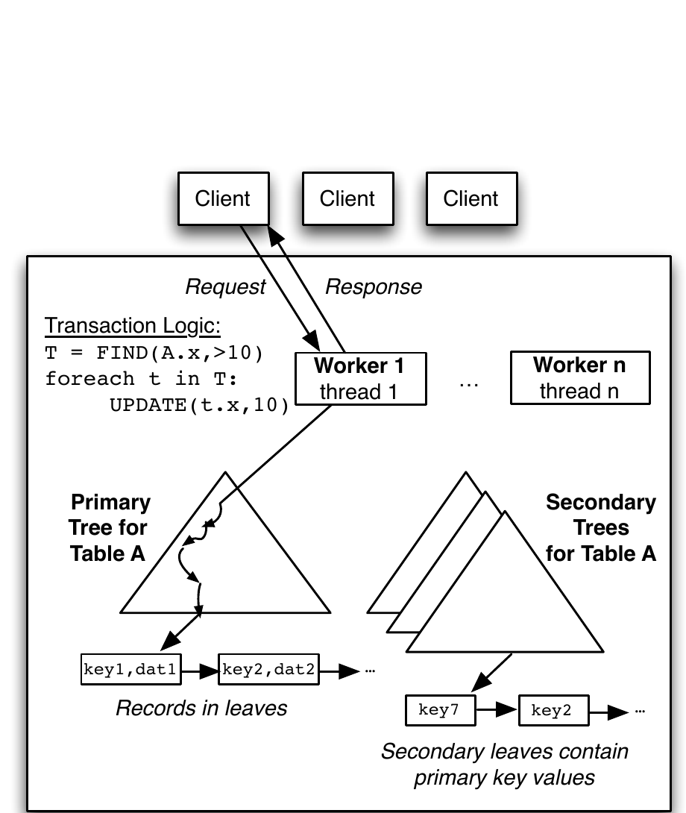
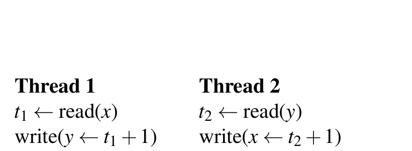
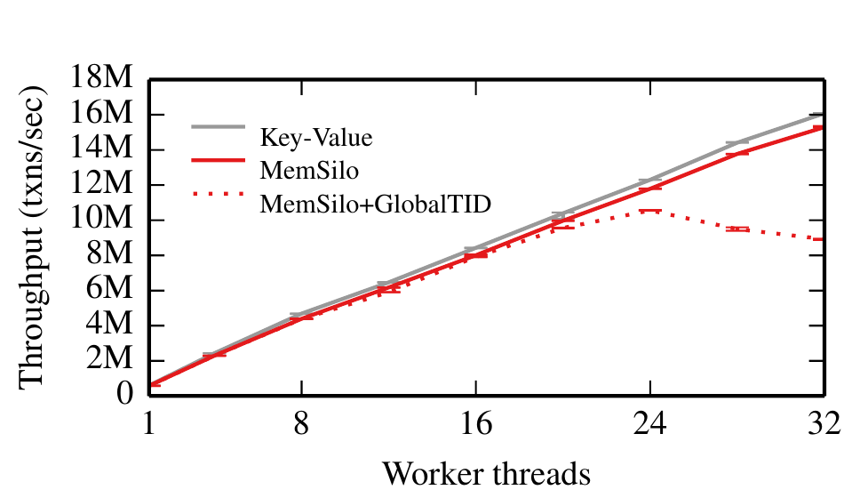
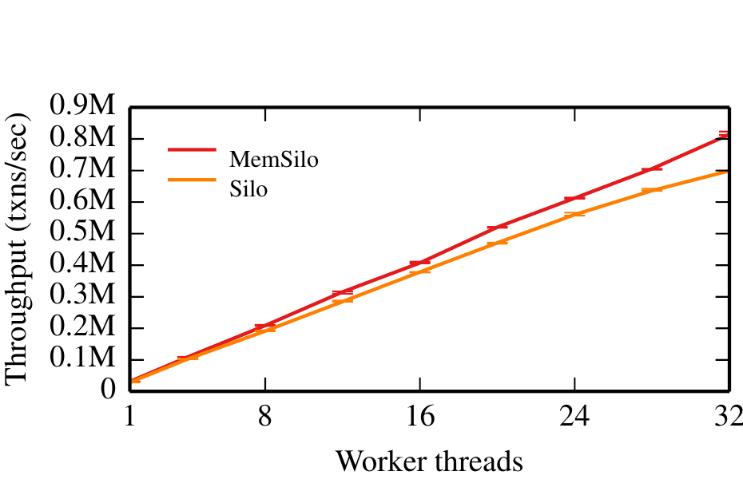
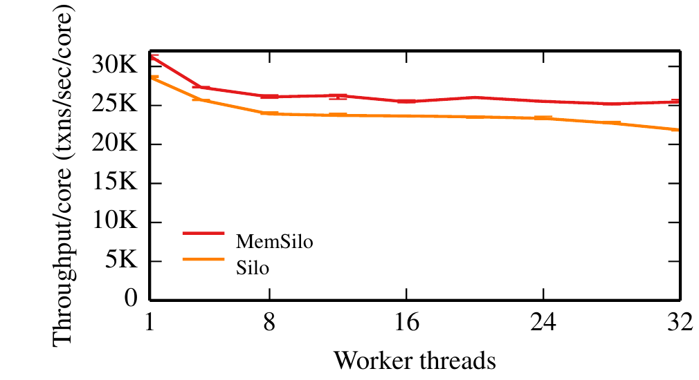
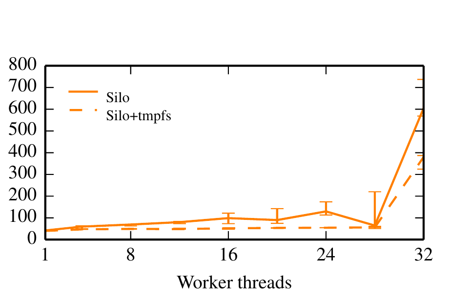
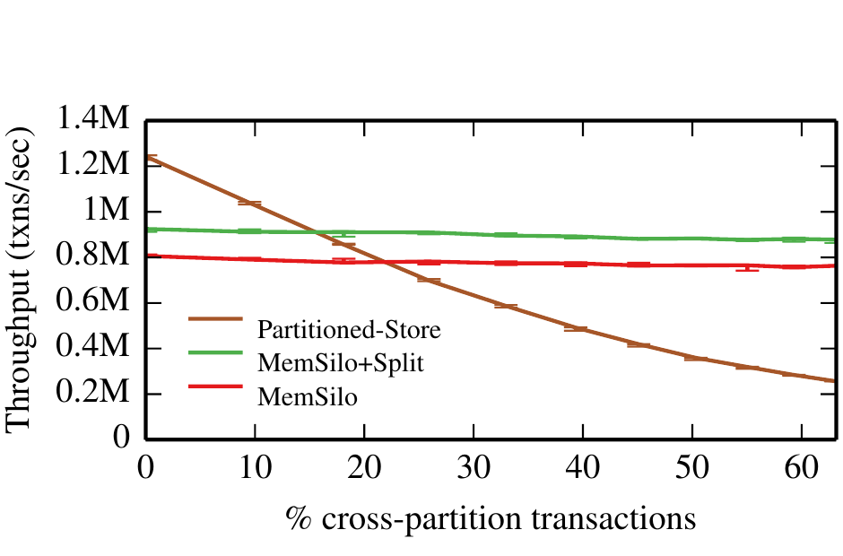
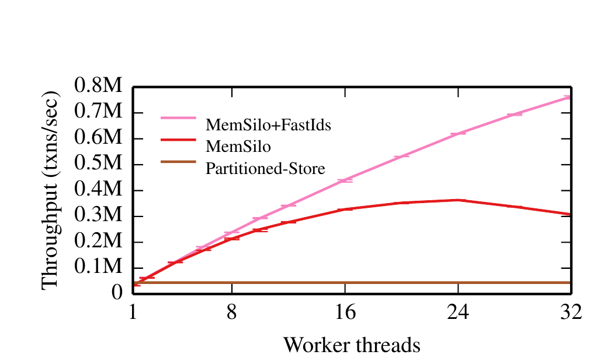
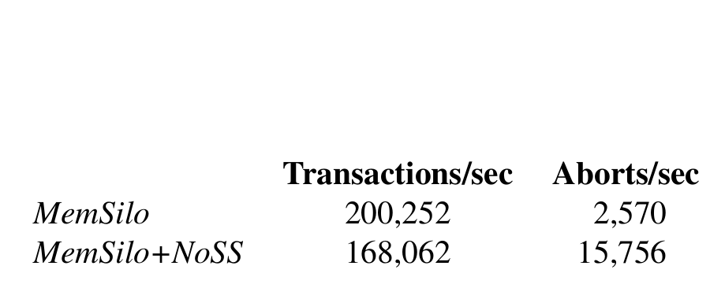
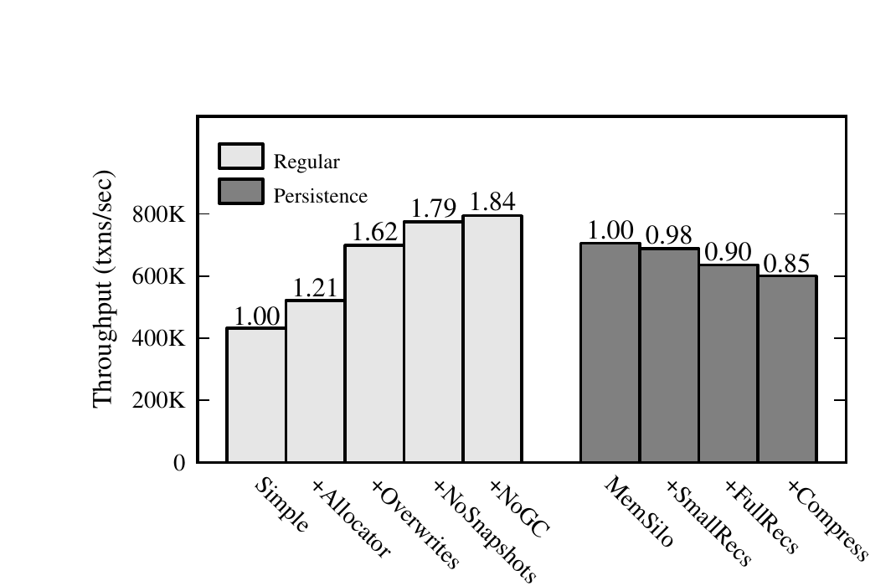

# Speedy Transactions in Multicore In-Memory Databases（中文译文）

## 译者说明

本文依据同目录的 `source.pdf` 翻译。章节、图表、公式、算法、代码与参考文献按原文结构保留。

Stephen Tu、Wenting Zheng、Eddie Kohler、Barbara Liskov、Samuel Madden

MIT CSAIL；Eddie Kohler 同时供职于哈佛大学。

**版权与许可：** 在副本不以营利或商业优势为目的制作或分发、首页保留本声明和完整引文，并尊重本工作中由 ACM 以外其他权利人持有版权的组件的前提下，允许免费制作本工作的部分或全部数字版或纸质副本用于个人或课堂用途。其他用途请联系权利人。版权由权利人持有。SOSP ’13，2013 年 11 月 3–6 日，美国宾夕法尼亚州法明顿；ACM 978-1-4503-2388-8/13/11；<http://dx.doi.org/10.1145/2517349.2522713>。

## 摘要

Silo 是一种新的内存数据库，在现代多核机器上具有出色的性能和可扩展性。Silo 从头开始围绕高效使用系统内存与缓存而设计，避免了所有集中式争用点，包括集中分配事务 ID。Silo 的核心贡献是一种基于乐观并发控制的提交协议：它既提供可串行化，又避免对只读记录进行任何共享内存写入。尽管这似乎会增加强制串行顺序的难度，Silo 仍通过把周期性更新的纪元（epoch）与提交协议关联起来，提供正确的日志与恢复。它以很少的额外延迟，提供与其他可串行化数据库相同的保证，而没有不必要的可扩展性瓶颈。在 32 核机器上运行标准 TPC-C 工作负载混合时，Silo 的吞吐量接近每秒 700,000 个事务，并且接近线性扩展；按核计算，这比此前报告的结果高数倍。

## 1. 引言

服务器级机器的主存容量和处理器核心数大幅增长，现代高端服务器可以拥有数 TB RAM 和 80 个以上核心。有效利用这些资源，便足以承载过去分散在许多磁盘和机器上的数据集与计算。然而，驾驭这种能力并不容易：即使只有一个争用点，例如对一个共享内存字执行比较交换，也会限制可扩展性。

本文介绍 Silo，一种在多核机器上取得优异性能的新型内存数据库。我们从头开始围绕系统内存和缓存效率设计 Silo，避免所有集中式争用点，并使同步随数据规模扩展，从而让更大的数据库支持更多并发。

Silo 的底层索引采用受 Masstree 启发的树结构。Masstree [23] 是一种针对多核性能优化的快速并发类 B 树结构，但它只支持不可串行化的单键事务，而实际数据库必须支持影响多个键且服从某种串行顺序的事务。我们的核心成果 Silo 提交协议，是一种争用极小、可提供这些性质的可串行化提交协议。

Silo 使用乐观并发控制（OCC）[18] 的一个变体。OCC 事务在线程本地存储中跟踪其读写记录。提交时，事务先验证没有并发事务的写集合与自己的读集合重叠，再一次性安装全部写记录；验证失败则中止。这种方法有多项可扩展性优势：OCC 只在事务计算阶段结束后的提交时写共享内存，较短的写阶段会减少争用；借助验证，读集合中的记录无需加锁，而读锁需要的内存写入可能引发争用 [11]。

不过，以往的 OCC 实现并未消除扩展瓶颈，关键原因是必须跟踪“反依赖”（读后写冲突）。设事务 $t_1$ 读取一条记录，而并发事务 $t_2$ 覆盖了 $t_1$ 看到的值。即使系统崩溃并从持久日志恢复，可串行化系统也必须把 $t_1$ 排在 $t_2$ 之前。为实现这种顺序，大多数系统要求 $t_1$ 与 $t_2$ 通信，例如把读集合发布到共享内存，或使用集中分配、单调递增的事务 ID [18, 19]。某些不可串行化系统可以避免这种通信，但会出现快照隔离“写偏斜”等异常 [2]。

Silo 在提供可串行化的同时，避免读事务执行任何共享内存写入。提交协议使用内存栅栏精心构造，可扩展地产生符合串行顺序的结果。剩余的正确恢复问题由我们通过一种基于纪元的组提交解决：时间被划分为一系列短纪元。事务结果始终符合某个串行顺序，但系统只在纪元边界上明确知道该顺序；若 $t_1$ 的纪元早于 $t_2$，则串行顺序中 $t_1$ 先于 $t_2$。系统以完整纪元为单位记录事务，并在纪元边界向客户端释放结果。因此，Silo 没有不必要的扩展瓶颈或大量额外延迟，却提供与其他可串行化数据库相同的保证。纪元还有其他用途，例如我们用它们为长时间只读事务提供数据库快照，以减少中止。

在一台 32 核机器上，Silo 运行标准 OLTP 基准 TPC-C 时达到约每秒 700,000 个事务，即每核每秒约 22,000 个事务。32 核时的每核吞吐量是 8 核时的 91%，降幅很小，说明其扩展良好。作为对照，高性能内存 OLTP 文献报告的每核 TPC-C 吞吐量至少比 Silo 低数倍 [16, 25, 27, 28]；在我们的硬件上测试某商用内存数据库时，每核每秒最多 3,000 个事务。

Silo 的一个重要设计选择是共享内存存储：任何数据库工作线程原则上都能访问整个数据库。近期一些内存数据库采用数据分区，让工作线程实际拥有数据子集 [25, 32]。分区可以缩小表并免去细粒度锁管理，但只有查询负载与分区方式匹配时效果最好。为理解取舍，我们构建并评估了 Silo 的分区变体。分区在某些工作负载上更快；但跨分区事务频繁或分区过载时，共享内存设计胜出。

Silo 假定一次性请求模型：客户端请求的全部参数在开始时已经可用，请求在完成前不再与客户端交互。该模型很适合 OLTP。如果事务包含高延迟客户端通信，并发更新导致中止的概率会增大。

由于我们的客户端当前未使用网络，我们的性能高于完整系统可能观察到的结果。Masstree 中网络通信让吞吐量下降 23% [23]；我们预计键值工作负载上的 Silo 会有相近降幅，而计算更重的事务降幅较小。尽管如此，我们的实验仍表明 Silo 性能很高，事务可以在不产生集中争用的情况下串行化，并且缓存友好的设计原则适用于共享内存可串行化数据库。

## 2. 相关工作

近期许多系统为内存与多核环境提出了存储抽象，大体可按是否提供事务支持分类。

### 2.1 非事务系统

与 Silo 最相关的非事务系统是 Masstree [23]，一种可扩展性和吞吐量极高的内存 B+ 树。Masstree 使用版本验证代替读锁，并采用高效的细粒度加锁算法。它建立在 OLFIT [4]、Bronson 等人的树 [3] 和 Blink 树 [20] 等先前工作之上，并加入类似 trie、可加速键比较的新技术。Silo 的底层并发 B+ 树实现受其启发。

PALM [31] 是另一种面向多核系统的高吞吐 B+ 树，使用批处理、大量预取和核内 SIMD 并行取得极高吞吐；这些技术可能也能加速 Silo 的树操作。

Bw-tree [21] 是面向多核闪存优化的高吞吐多版本树。新数据版本通过增量记录以及映射表上的比较交换安装，不使用锁或覆盖写（我们发现两者都有助于性能）。Silo 的数据结构面向主存，而 Bw-tree 的许多结构面向闪存。两者都使用 RCU 风格的纪元做垃圾回收；Silo 的纪元还支持可扩展的可串行化日志与快照。LLAMA [22] 增加了事务日志支持，但其日志器是集中式的。

### 2.2 事务系统

Silo 使用乐观并发控制 [10, 18]，它在多核机器上有多个优点，包括争用阶段较短。但 OCC 及其变体（如 [1, 12, 34]）常在提交阶段引入争用，例如集中分配事务 ID，或要求全部并发事务通信。

Larson 等人 [19] 最近重新比较了多核内存数据库中基于加锁和 OCC 的多版本并发控制（MVCC）系统与传统单副本加锁系统。他们的 OCC 实现用 MVCC 推迟写入直至提交，并避免经典 OCC 中许多集中式临界区；这些技术构成 SQL Server 内存组件 Hekaton [8] 的并发控制基础。但该设计缺少 Silo 的许多多核专用优化，例如分配时间戳时存在全局临界区，读操作还必须写入非本地内存以更新其他事务的依赖集合。即使争用较低，其简单键值工作负载性能也比单副本加锁系统低约 50%；Silo 的 OCC 实现则在小型键值工作负载上只比键值系统慢几个百分点。

若干近期多核事务系统把分区作为主要扩展机制。DORA [25] 是基于加锁的系统，在核心之间划分数据与锁，消除集中锁管理器上的长等待链并提高缓存亲和性。其可扩展性有所改善，但相对于加锁系统，总体性能通常仅提高约 20%；事务触及许多分区时甚至可能更慢。

PLP [26] 是 DORA 的后续工作。数据库在许多树之间物理分区，每棵树只由单一线程管理。灵活分区需要维护集中式路由表；与 DORA 一样，执行事务需分解成动作图，每个动作针对一个分区运行，因此需要额外的会合点，形成新的争用源。论文只展示了相对两阶段加锁（2PL）的有限提升。

H-Store [32] 及其商业后继 VoltDB 采用极端分区：即使分区位于同一物理节点，也把每个分区视为独立逻辑数据库。单分区事务完全无锁，多分区事务使用整分区锁。这让单分区事务极快，却给多分区事务带来额外扩展问题。我们通过与分区方案比较，确认分区在多分区事务很少时有效，而此类事务很多时扩展不佳。

Multimed [30] 在一台多核机器的不同核心上运行多个复制数据库实例。单一主实例应用全部写操作并为所有更新分配全序，再由只读副本异步应用。Multimed 只强制快照隔离，其一致性弱于可串行化；读扩展以保存多个数据副本为代价，写密集负载最终受主实例限制。

在 Silo 中，我们通过把锁与记录放在一起，消除集中锁管理器瓶颈。VLL [29] 也采用该方法，但重点不是多核性能。Shore-MT [15]、Jung 等人 [17] 和 Horikawa [14] 改进传统基于磁盘和 2PL 的关系数据库，消除集中式加锁与闩锁瓶颈；然而，2PL 的长持锁期和读锁要求在多核架构上存在固有扩展隐患。

Porobic 等人 [28] 详细分析了单台多核机器上无共享与全共享 OLTP 的性能，认为由于非一致内存访问（NUMA）的影响，无共享配置更可取；我们的结果得出相反结论。类似 Silo 的快照事务过去也用于分布式事务系统 [7]；我们的实现提供非常新的快照，并与我们的纪元系统紧密集成。

### 2.3 事务内存

Silo 的目标——在内存数据库上提供快速事务——类似软件事务内存（STM）在任意内存上提供快速事务的目标。包括 TL2 [9] 在内的近期 STM 基于 OCC，维护与 OCC 数据库相似的读写集合。一些 STM 实现技术，如读验证、锁位与版本共置，也类似 Silo；其中许多思想早于 STM。其他实现技术则差异很大，总体上 Silo 与数据库的共同点多于 STM。我们关注的持久性问题与 STM 无关；Silo 的数据库结构为高效加锁与并发而设计，而 STM 面对任意内存模型。

STM 不适合用来实现 Silo。我们的事务会访问许多与事务语义无关的共享内存字，例如树的内部节点；Silo 可以区分相关与无关修改，而 STM 做不到。忽略无关修改对避免不必要中止至关重要。最后，我们不知道有任何 STM 能胜过高效的加锁代码。

## 3. 架构

Silo 是一种关系数据库，提供由类型化具名记录组成的表。客户端发出一次性请求：请求开始时全部参数已经可用，完成前不与调用者交互。一次性请求能力很强，每个请求包含一个或多个可串行化数据库事务，并可含任意应用逻辑。我们用 C++ 编写一次性请求，把读写 Silo 数据库的语句直接嵌入其中；请求当然也可以用 SQL 编写，只是我们尚未实现。仅支持一次性请求，可以让我们避免请求与客户端交互时潜在的停顿。

Silo 的表由索引树集合实现：每张表有一棵主树和零棵或多棵辅助树，见图 1。每条记录存放在单独分配的内存块中，由表的主树指向。按主键访问记录时，Silo 用该键遍历主树。主键必须唯一；表若没有天然唯一主键，Silo 会创建一个。辅助索引把索引键映射到辅助记录，后者保存相关记录的主键。因此，按辅助索引查找记录需要两次树访问。所有键都按字符串处理。这是数据库的典型组织方式。

每棵索引树都存放在基于 Masstree [23] 的有序键值结构中。Masstree 读操作从不写共享内存，读者与写者通过版本号和基于栅栏的同步协调。与其他并发 B 树 [4, 31] 相比，Masstree 采用部分 trie 特性来优化键比较。每个叶节点包含某个键范围的信息；对该范围内的键，叶节点可以直接指向记录，也可以指向继续搜索的下层树。虽然我们的实现使用树结构，我们的提交协议也很容易适配哈希表等其他索引结构。

每个一次性请求被分派给一个数据库工作线程，该线程无阻塞地把请求执行到完成，即提交或中止。我们在服务器每个物理核心上运行一个工作线程，并把 Silo 设计为能够在现代多核机器上良好扩展。由于树位于共享主存，任何工作线程都能访问整个数据库。

尽管 Silo 的主数据副本位于主存，事务会通过写入稳定存储的日志而持久化；只有结果持久后才返回用户。客户端也可以让只读事务在数据库近期的一致快照上运行，而不是当前状态。这类快照事务返回略微陈旧的结果，但不会因并发修改而中止。



**图 1. Silo 的架构。** 客户请求由工作线程执行；表 A 的主树叶节点保存记录，辅助树叶节点保存主键值。

## 4. 设计

本节说明我们如何在 Silo 中执行事务。我们的核心原则是减少共享内存写入，以消除不必要争用。我们的 OCC 变体使用周期性更新的纪元，即使恢复后也能提供可串行化；纪元边界形成天然串行化点。纪元还帮助高效回收垃圾并支持快照事务。事务 ID 设计、记录覆盖写和范围查询支持等选择进一步简化并加速事务执行，去中心化持久性子系统也避免争用。本节余下部分，我们先介绍设计的基础，即纪元、事务 ID 和记录布局，再给出提交协议和数据库操作实现，随后讨论垃圾回收、快照事务与持久性。

### 4.1 纪元

Silo 基于称为纪元的时间段，用于保证可串行化恢复、清除删除等产生的垃圾，并提供只读快照。每个纪元都有一个编号。

所有线程都能看到全局纪元号 $E$。一个指定线程周期性推进 $E$，其他线程在提交事务时访问它。由于纪元周期影响事务延迟，$E$ 应频繁推进；但相对于事务时长，改变纪元应足够少，使 $E$ 通常留在缓存中。我们的实现每 40 ms 更新一次 $E$，更短的纪元也可工作。处理 $E$ 无需加锁。

每个工作线程 $w$ 还维护本地纪元号 $e_w$。工作线程计算时它可以落后于 $E$，并用于判断何时能够安全回收垃圾。Silo 要求二者不能相差太远：对所有 $w$ 都有

$$
E-e_w\le 1.
$$

事务通常很短，所以这一般不是问题；若某工作线程确实落后，推进纪元的线程会延迟更新。运行很长事务的工作线程应周期性刷新 $e_w$，保证系统继续前进。快照事务使用下文描述的其他纪元变量。

### 4.2 事务 ID

Silo 的并发控制围绕事务 ID（TID）展开。TID 标识事务和记录版本，同时充当锁并检测冲突。每条记录保存最近修改它的事务 TID。

TID 是 64 位整数。高位保存对应事务提交时的全局纪元号；中间位区分同一纪元内的事务；最低三位是下述状态位。回绕极少发生，我们忽略它。

Silo 与许多系统不同，采用去中心化方式分配 TID。工作线程只有验证事务可以提交后，才选择其 TID；它计算满足以下条件的最小值：(a) 大于该事务读写的任意记录 TID；(b) 大于该工作线程最近选择的 TID；(c) 位于当前全局纪元。结果写入事务修改的每条记录。

TID 顺序常反映串行顺序，但并非总是如此。设串行顺序中 $t_1$ 先于 $t_2$。若 $t_1$ 写入了 $t_2$ 观察到的元组（读取或覆盖），由条件 (a)，$t_2$ 的 TID 必须更大。但 TID 不反映反依赖：若 $t_1$ 只是观察了随后被 $t_2$ 覆盖的元组，$t_1$ 的 TID 既可能小于也可能大于 $t_2$。尽管如此，一个工作线程选择的 TID 单调递增并与串行顺序一致；分配给同一记录的 TID 也单调递增并与串行顺序一致；不同纪元的 TID 顺序与串行顺序一致。

每个 TID 字的最低三位是逻辑上独立于 TID 的状态位。把它们与 TID 放在一起可简化并发控制，例如一步原子操作就能更新记录版本并解锁。三位分别为锁定位、最新版本位和缺失位。锁定位保护记录内存免受并发更新；按数据库术语，它是保护内存结构的短期锁，即闩锁。记录保存对应键的最新数据时，最新版本位为 1；记录被新版本取代时该位清零。缺失位把记录标记为等价于不存在的键，我们对插入和删除的实现会创建这种记录。

我们用 “TID” 指纯事务 ID，用 “TID 字” 指 TID 加状态位（包括锁）。

### 4.3 数据布局

Silo 的记录包含：

- 一个上述 TID 字；
- 一个前一版本指针；若没有前一版本则为空，该指针用于支持快照事务（§4.9）；
- 记录数据。可行时，实际数据与记录头放在同一缓存行，避免读取字段值时额外取一次内存。

已提交事务通常原地修改记录数据，主要通过减少记录对象的内存分配开销来加快短写操作。但读者随后必须使用版本验证协议，保证读到的是每条记录的一致版本（§4.5）。不含数据时，我们系统中的记录占 32 字节。

### 4.4 提交协议

下面说明我们如何运行事务。我们先考虑只读和更新现有键的事务；插入、删除见 §4.5，范围查询见 §4.6。

工作线程执行事务时维护读集合，记录所有读取过的记录及访问时的 TID；对修改过的记录维护写集合，保存记录的新状态，但不保存旧 TID。既读又改的记录同时出现在两个集合中。正常情况下，写集合中的记录也都在读集合中。

事务结束时，工作线程尝试按图 2 的协议提交。

```text
数据：读集合 R，写集合 W，节点集合 N，全局纪元号 E

// 阶段 1
for (record, new-value) in sorted(W) do
    lock(record)
compiler-fence()
e <- E                         // 串行化点
compiler-fence()

// 阶段 2
for (record, read-tid) in R do
    if record.tid != read-tid or not record.latest
       or (record.locked and record not in W) then
        abort()
for (node, version) in N do
    if node.version != version then abort()
commit-tid <- generate-tid(R, W, e)

// 阶段 3
for (record, new-value) in W do
    write(record, new-value, commit-tid)
    unlock(record)
```

**图 2. 每个事务结束时运行的提交协议。**

阶段 1 检查写集合中的全部记录，并取得每条记录的锁定位。为避免死锁，工作线程按全局顺序加锁；任意确定性的全局顺序都可以，Silo 使用记录指针地址。获得全部写锁后，工作线程通过一次内存访问取得全局纪元号快照。栅栏确保该读取访问主存而非过期缓存，在逻辑上晚于先前全部内存访问且早于后续全部访问。在 x86 和其他 TSO（全存储序）机器上，这些只是不会影响生成指令的编译器栅栏，用来阻止编译器激进移动代码。全局纪元号快照是提交事务的串行化点。

阶段 2 检查读集合中的全部记录，其中可能包括既读又写的记录。若某条记录的 TID 与执行时观察到的不同、已不是该键的最新版本，或被另一个事务锁定，则事务释放锁并中止。若全部读记录 TID 未变，我们便知道所有读取是一致的，事务可以提交；工作线程按 §4.2 使用阶段 1 获取的全局纪元快照分配 TID。

阶段 3 把修改后的记录写入树，并把其 TID 更新为上一阶段计算的事务 ID。每条记录写完即可立即释放对应锁。Silo 必须保证锁一释放，新 TID 就可见；由于 TID 和锁共享一个字，可原子写入，这很容易实现。

**可串行化。** 该协议可串行化，因为：(1) 验证读记录 TID 前先锁定全部写记录；(2) 把已锁记录视为脏数据，遇到即中止；(3) 阶段 1 末尾的栅栏保证 TID 验证能看到全部并发更新。我们通过归约到严格两阶段加锁（S2PL）来论证其可串行化：若我们的 OCC 验证协议提交，S2PL 也会提交。为简化说明，假定写集合是读集合子集。S2PL 对全部读取记录（此处包括全部写记录）取得读锁，提交后才释放。我们在阶段 2 验证记录的 TID 自首次访问以来未变且未被其他事务锁定，这意味着 S2PL 本可以取得并持有其读锁直到提交。对更新记录，可把 S2PL 看作在提交时将共享读锁升级为排他写锁。我们的协议在阶段 1 取得全部写记录的排他锁，再在阶段 2 验证这等价于从首次访问起一直持有读锁后再升级。阶段 1 末尾的栅栏保证阶段 2 的版本检查访问记录最新的 TID 字。

协议还保证纪元边界与串行顺序一致。具体而言，较早纪元中已提交的事务不会传递依赖较晚纪元的事务。内存栅栏保证所有工作线程在写加锁后、读验证前加载 $E$ 的最新版本。把加载放在读验证前，保证提交事务的读集合和节点集合不含较晚纪元数据；放在写加锁后，保证较晚纪元的全部事务至少能观察到阶段 1 取得的锁位。因此，纪元同时服从依赖与反依赖。

图 3 给出读写冲突。假定记录 $x$、$y$ 初始都为 0，下列两个事务的最终状态 $x=y=1$ 不可串行化。我们用它说明为什么 Silo 不可能产生这个最终状态。



**图 3. 事务之间的读写冲突。**

若要得到 $x=y=1$，线程 1 必须读到 $x=0$，线程 2 必须读到 $y=0$，且二者都提交。假定线程 1 读取 $x=0$ 并提交，则其阶段 2 已验证 $x$ 未锁定且未改变。线程 2 在阶段 1 锁定 $x$，所以我们知道线程 2 的串行化点晚于线程 1。这样，线程 2 要么观察到线程 1 在串行化点之前取得的 $y$ 锁，要么观察到 $y$ 的新版本号；它只能令 $y\leftarrow2$ 或中止。

### 4.5 数据库操作

本节进一步说明我们如何支持各种数据库操作。

**读和写。** 事务提交时，我们只要可能就覆盖修改过的记录，因为这能提高性能。若无法覆盖，例如新记录更大，我们就创建新存储容纳新数据，把旧记录标为不再是最新版本，并修改树使其指向新版本。原地修改意味着并发读者可能看到不一致的记录数据，下面的版本验证协议用于检测这种情况。

在提交协议阶段 3 修改记录时，工作线程持锁执行：(a) 更新记录；(b) 执行内存栅栏；(c) 存储 TID 并释放锁。其一致性要求是：并发读者若看到锁已释放，就必须同时看到新数据与新 TID。步骤 (b) 保证新数据先可见（TSO 机器上是编译器栅栏）；步骤 (c) 利用锁位于 TID 字中这一点，原子地暴露新 TID 和已释放的锁。

事务执行期间、提交协议之外访问记录时，工作线程：(a) 读取 TID 字，若锁未清除则自旋；(b) 检查记录是否为最新版本；(c) 读取数据；(d) 执行内存栅栏；(e) 再次检查 TID 字。若步骤 (b) 发现记录不是最新版本，或 (a) 到 (e) 之间 TID 字发生变化，则重试或中止。

**删除。** 快照事务要求已删除记录留在树中，因为与快照相关的链接版本必须仍可访问。因此删除操作用缺失位把记录标为“缺失”，并登记待后续回收。客户端把缺失记录视为键不存在；内部则把它当作必须在读取时验证的存在记录。由于大多数缺失记录已登记供未来回收，Silo 写操作不会覆盖其记录数据。

**插入。** 阶段 2 要求事务先锁记录，以处理写写冲突；但记录不存在时没有可锁对象。为此，我们在提交协议开始前先为插入请求加入一条新记录。

对键 $k$ 的插入如下进行。若 $k$ 已映射到非缺失记录，则插入失败，事务中止。否则，构造处于缺失状态、TID 为 0 的新记录 $r$，通过“仅当不存在时插入”原语把 $k\rightarrow r$ 的映射加入树，并像普通 put 一样把 $r$ 同时加入读集合和写集合。该原语保证一个键至多有一条记录；阶段 2 的读集合验证保证没有其他事务替换这个占位记录。

含插入的事务照常提交。成功时，新记录被正确值和事务 TID 覆盖；失败时，提交协议登记该缺失记录供未来回收。

### 4.6 范围查询与幻象

Silo 支持访问表中某段键范围的范围查询。幻象问题 [10] 使范围查询变得复杂：如果我们扫描一个范围时只跟踪当时存在的记录，该范围的成员随后可能在协议无法检测的情况下改变，破坏可串行化。

数据库中的典型解决办法是下一键加锁 [24]，但它要求为读取加锁，与 Silo 的设计理念相悖。Silo 利用底层 B+ 树每个叶节点的版本号解决问题。该 B+ 树保证，树节点的结构修改会改变所有相关节点的版本号。

因此，对区间 $[a,b)$ 的扫描除把区间内全部记录加入读集合外，我们还维护节点集合。扫描时，我们把与 $[a,b)$ 键空间重叠的叶节点及其版本号加入节点集合。阶段 2 检查节点集合中所有树节点版本号未变，从而保证所查范围中没有新增或删除键。

查询或删除因树中不存在对应键而失败时也可能产生幻象；只有提交时该键仍不在树中，事务才能提交。此时，把本应容纳缺失键的节点加入节点集合。

插入操作会触发结构修改，因此我们还要区分并发事务造成的修改（应导致中止）和当前事务造成的修改（不应导致中止）。我们按如下方式解决这个问题。插入对树的修改实际发生在提交前。对插入影响的每个树节点 $n$（分裂时可能有多个），设修改前后的版本号为 $v_{old}$、$v_{new}$。插入随后更新节点集合：若 $n$ 以版本 $v_{old}$ 位于集合中，就改成 $v_{new}$；否则中止。这样，只有其他事务对 $n$ 的并发修改会导致中止。

### 4.7 辅助索引

对提交协议而言，辅助索引只是额外的表，把辅助键映射到保存主键的记录。修改影响辅助索引时，执行该修改的事务代码通过额外访问显式更改索引。这些修改照常触发中止：使用辅助索引的事务若发现它访问的记录已改变，就会中止。

### 4.8 垃圾回收

Silo 事务产生两类待回收垃圾：B+ 树节点和数据库记录。Silo 不使用引用计数，因为那会要求所有访问都写共享内存；它借助纪元实现类似读-复制-更新（RCU）[11, 13] 的纪元回收方案。

工作线程产生垃圾时，例如删除记录或移除 B+ 树节点，会把垃圾对象及其回收纪元登记到按核心、按对象类型维护的列表中。回收纪元表示在该纪元之后不可能再有线程访问该对象；到达后我们即可释放它。回收可由独立后台任务或工作线程完成。我们选择在工作线程的请求间隙执行，既减少辅助线程数量，也可避免核心间不必要的数据移动。

快照事务使不同对象采用不同但相似的回收策略。B+ 树节点最简单。每个工作线程 $w$ 在每个事务开始前把本地纪元 $e_w$ 设为 $E$；事务中释放的树节点以 $e_w$ 为回收纪元。由于纪元推进方式，不会再有线程访问在满足 $e\le\min_w e_w-1$ 的纪元 $e$ 中释放的树节点。推进纪元的线程周期性检查全部 $e_w$，把全局树回收纪元设为 $\min_w e_w-1$；回收纪元不大于该值的垃圾树节点可安全释放。

### 4.9 快照事务

我们通过保留记录的额外版本，让只读事务在近期过去的快照上运行。这些版本构成一致快照：包含串行顺序中某点之前全部事务的修改，不含之后事务的修改。快照用于运行快照事务，也可帮助生成检查点。管理快照有两个难点：保证快照一致且完整，以及最终回收其内存。

我们使用快照纪元提供一致快照。快照纪元边界与普通纪元边界对齐，因此是串行顺序中的一致点；但快照纪元推进较慢，因为我们希望避免频繁创建并非没有代价的快照。纪元 $e$ 的快照纪元为

$$
snap(e)=k\left\lfloor\frac{e}{k}\right\rfloor.
$$

当前 $k=25$，约每秒创建一个新快照。推进纪元的线程周期性计算全局快照纪元 $SE\leftarrow snap(E-k)$。每个工作线程 $w$ 还维护本地快照纪元 $se_w$，在事务开始时设置 $se_w\leftarrow SE$。快照事务用它寻找正确记录版本：记录 $r$ 的相关版本，是纪元不大于 $se_w$ 的最新版本。快照事务完成时无需检查即可提交；快照一致且不会修改，所以永不中止。

读写事务不得删除或覆盖快照所需的记录版本。考虑在纪元 $E$ 提交的事务：它在阶段 3 修改或删除记录 $r$ 时，比较 $snap(epoch(r.tid))$ 与 $snap(E)$。若相同，可以安全覆盖，任何快照中的新版本都会取代旧版本；若不同，必须为当前或未来快照保留旧版本，因此安装一条新记录，并让其前一版本指针指向旧记录。快照事务通过该链接找到旧版本。可行时，我们实际会把旧版本复制到新内存，再由现有记录链接过去，以避免弄脏树节点缓存行，但语义相同。

没有快照事务再访问某记录版本后，就应释放它。事务在纪元 $E$ 提交并为快照版本分配内存时，以 $snap(E)$ 为回收纪元登记该内存。推进纪元的线程周期性计算快照回收纪元 $\min_w se_w-1$；回收纪元不大于它的快照版本可安全释放。回收无需调整任何前一版本指针：未来快照事务会选择较新版本，不会再遍历指向旧版本的悬空指针。

删除需要特殊处理。已删除记录最终应从树中脱钩，但不能立即执行，因为快照事务必须能找到链接的旧版本。提交过程创建“缺失”记录，用状态位标记值已删除，并在原本保存数据的空间中存放相关键；以 $snap(E)$ 为回收纪元登记它。快照回收纪元到达该值时，清理过程用所存键修改树，移除对记录的引用，再按树回收纪元登记该缺失记录；不能立即释放，因为并发事务可能正在访问。若缺失记录已被后续插入取代，则不应修改树。清理过程检查它是否仍为最新版本；若不是就忽略，因为插入事务已经标记该记录供未来回收。

### 4.10 持久性

持久性具有传递性：事务只有在其全部修改已写入持久存储，且串行顺序中位于它之前的全部事务都持久时才持久。因此，系统必须恢复构成串行顺序某个前缀的事务集合。与快照一样，Silo 用纪元恢复此前缀。纪元边界与串行顺序一致，因此 Silo 把完整纪元作为持久提交单位：在纪元 $e$ 的事务结果返回客户端前，所有纪元不大于 $e$ 的事务都必须持久存储。

持久存储可以通过复制实现；我们当前的实现使用日志和本地磁盘。同一纪元的事务一起记录。故障后，系统检查日志并找出持久纪元 $D$，即全部事务都成功写入日志的最新纪元；随后只恢复纪元不大于 $D$ 的事务。不能恢复更多：完整纪元在串行上是一致的，但我们记录的信息无法恢复纪元内部的串行顺序，重放某个纪元的事务子集可能产生不一致状态。这也意味着纪元周期会直接影响事务提交的平均延迟。

Silo 用少量日志线程处理日志，每个线程负责互不相交的一组工作线程，并写入独立磁盘上的日志文件。

工作线程提交事务时，创建一条日志记录，包含事务 TID 以及全部修改记录的表、键和值信息。日志记录以磁盘格式保存在本地内存缓冲区。缓冲区满或进入新纪元时，工作线程通过每工作线程队列把缓冲区发布给对应日志线程，再写全局变量 $ctid_w$ 发布自己最后提交的 TID。

日志线程持续循环。每轮开始时，它对自己负责的工作线程计算 $t=\min_w ctid_w$，再计算本地持久纪元

$$
d=epoch(t)-1.
$$

这些工作线程已经发布纪元不大于 $d$ 的全部事务，因此从该日志线程角度看，这些纪元已经完整。日志线程把全部缓冲区以及最后一条包含 $d$ 的记录追加到日志文件，等待写入完成；无需检查实际日志缓冲区内容。随后把 $d$ 发布到每日志线程全局变量 $d_l$，并把缓冲区交还工作线程复用。

一个线程周期性计算并发布全局持久纪元 $D=\min_l d_l$。纪元不大于 $D$ 的全部事务已确定持久写入；工作线程可以响应这些纪元中的客户端事务。

Silo 只使用记录级重做日志，不使用撤销日志或操作日志。我们的系统不需要撤销日志，因为我们在事务提交后才记录；记录级日志也简化恢复。

恢复时，Silo 读取每个日志线程最近的 $d_l$，计算 $D=\min_l d_l$，再重放日志，忽略 TID 纪元晚于 $D$ 的事务条目。同一记录的日志必须按 TID 顺序应用，保证结果等于最新版本；除此之外可并发重放。

完整系统会结合日志与检查点恢复，以支持截断日志。检查点可利用快照，避免干扰读写事务。生成检查点会略降工作线程性能，但无需频繁执行。我们评估常见情形的日志记录，但尚未实现完整检查点或恢复。

## 5. 评估

本节我们评估 Silo 中各项技术的有效性，并验证以下性能假设：

- 简单键值负载下，Silo 跟踪读写集合的成本很低（§5.2）。
- 可用核心增加时，即使事务持久化，Silo 也能扩展（§5.3）。
- 随着我们提高跨分区争用和负载偏斜，Silo 比分区存储对负载变化更稳健（§5.4）。
- 大型只读事务从快照事务显著受益（§5.5），即使写密集，其空间开销也很小（§5.6）。

我们还在 §5.7 说明 Silo 多项实现技术的相对重要性。

### 5.1 实验设置

我们的全部实验都在一台机器上运行：四颗 2.1 GHz、每颗 8 核的 Intel Xeon E7-4830，共 32 个物理核心。每核有私有 32 KB L1 和 256 KB L2 缓存；同一处理器的 8 个核心共享 24 MB L3。我们关闭了全部 CPU 的超线程，因为我们发现开启后结果略差。我们的机器有 256 GB DRAM，每插槽连接 64 GB，运行 64 位 Linux 3.2.0。

各图每个点是我们连续运行三次的中位数，误差条表示最小值和最大值。我们的实验遵循 Masstree 的做法，把 B+ 树内部节点与叶节点都设为约 4 个缓存行（我们的机器上缓存行为 64 字节），读取节点时使用软件预取。

我们的实验特别关注内存分配和线程亲和性。我们为 B+ 树节点与记录使用自定义分配器；我们的分配器利用 Linux 的 2 MB“超级页”降低 TLB 压力。我们把线程固定到核心，使某线程分配的内存位于其 NUMA 节点。在运行实验前，我们确保预先触发内存池缺页，避免 Linux 虚拟内存系统的扩展瓶颈 [5] 干扰我们的基准。

对启用持久性的实验，我们使用 4 个日志线程，并把每个日志文件放在独立设备上：3 个分别位于不同 Fusion IO ioDrive2，另一个位于由 6 块 7200 RPM SATA 磁盘组成的 RAID-5。总带宽足以使写磁盘不成为瓶颈。

我们的实验不使用网络客户端；我们预计网络会降低一些吞吐量，Masstree 中降幅为 23% [23]。在我们的实验中，每个线程同时承担数据库工作线程和负载生成器，位于同一进程并在同一地址空间共享 Silo 树。我们让每项实验运行 60 秒。不关注持久性时，我们使用关闭日志的 Silo，称为 MemSilo。

### 5.2 小事务开销

本节把 Silo 与不做任何跟踪的底层键值存储比较，说明读写集合跟踪开销很低。我们评估两个系统：Key-Value 是 Silo 底层并发 B+ 树，只提供单键 get 和 put；另一个系统是 MemSilo。

我们采用 YCSB 工作负载混合 A 的变体。YCSB [6] 是 Yahoo 的常用键值基准。我们的变体：(a) 把读写比固定为 80/20，而非 50/50；(b) 把写操作改为读-改-写，在 MemSilo 中作为单个事务执行；(c) 把记录从 1000 字节缩小到 100 字节。这些修改防止同时影响两个系统的无关开销掩盖 MemSilo 独有开销：分别避免新记录分配器、缺乏实际读写冲突和 `memcpy` 成为主要瓶颈。两种操作都从键空间均匀采样。我们把树固定为 1.6 亿个键，并改变对树执行事务的工作线程数。



**图 4. 运行 YCSB 变体时 MemSilo 相对 Key-Value 的开销。**

图 4 显示结果。我们看到 MemSilo 相对 Key-Value 的开销可忽略，Key-Value 最多快 1.07 倍。

**全局生成的 TID。** 图 4 也量化了避免提交时分配唯一全局 TID 的收益。MemSilo+GlobalTID 使用与 Silo 相同的提交协议，但从单一共享计数器生成 TID，类似 Larson 等人 [19] 的临界区。我们看到 24 个工作线程后可扩展性崩溃；32 个线程时 Key-Value 比它快 1.80 倍。这表明提交阶段甚至必须避免单条全局原子指令。

### 5.3 可扩展性与持久性

下一实验中，我们用常见 OLTP 基准 TPC-C [33]，检验增加工作线程时 Silo 的扩展。TPC-C 模拟零售业务：客户属于本地仓库中的某个地区并下单。多数订单由本地仓库满足，少量订单请求远程仓库的商品。为在 Silo 上运行 TPC-C，我们把同一本地仓库的全部客户端分给同一线程，模拟客户端亲和性，使事务访问的内存通常与工作线程位于同一 NUMA 节点。我们让仓库数等于工作线程数，线程增多时数据库也增长，即固定负载争用比例。我们不模拟客户端“思考”时间，使用包含全部 5 种事务的标准混合，并同时测试 MemSilo 与 Silo。



**图 5. 运行含持久性的 TPC-C 时 Silo 的吞吐量。**



**图 6. 运行 TPC-C 时 Silo 的每核吞吐量。**

图 5、6 显示线程（及仓库）增加时的吞吐量。MemSilo 到 32 个线程仍接近线性扩展。32 线程的每核吞吐量是 1 线程时的 81%、8 线程时的 98%。下降来自数据库变大、共享 L3 等资源（1 到 8 线程尤其明显）以及实际争用。Silo 略慢；超过 28 个线程后日志削弱扩展，因为工作线程和 4 个日志线程开始争夺核心。

为区分 Silo 日志子系统与我们的持久设备的影响，我们还让日志写入内存文件系统（Silo+tmpfs）。相对 Silo，其吞吐量最多提高 1.03 倍，说明启用持久性后的多数损失来自工作线程向日志线程传递日志记录，而非物理硬件写入开销（前提是硬件带宽充足）。



**图 7. TPC-C 中，日志写入持久存储或内存文件系统时的 Silo 事务延迟。**

图 7 给出延迟；MemSilo 延迟可忽略，未画出。我们看到 Silo+tmpfs 与 Silo 都在约 28 个线程时因工作/日志线程争用出现尖峰，Silo 更明显，说明延迟比吞吐量对真实硬件更敏感。总体上，我们看到日志没有显著降低 Silo 吞吐量，只温和增加延迟；32 线程时 MemSilo 最多仅快 1.16 倍。

### 5.4 与 Partitioned-Store 比较

本节介绍我们对 Silo 与静态分区数据存储的比较；后者是在单个共享内存节点上运行 OLTP 的常见配置 [25, 30, 32]。我们发现多数情况下 Silo 更合适。

TPC-C 通常按 `warehouse-id` 分区，每个分区负责某仓库的地区、客户和库存。这很自然，因为每个事务都围绕一个本地仓库。

Partitioned-Store 的设计受 H-Store/VoltDB [32] 启发。我们按仓库物理分区数据，使每个分区为各表拥有独立 B+ 树，并把每个分区关联到一个工作线程。所有线程位于同一进程，避免 IPC。然后，我们为每个分区关联一个全局分区锁。事务先按排序顺序取得全部所需分区锁，再像单线程存储一样执行，无需额外验证。我们假定完美预知所需锁，所以取锁后事务必定提交且无需再取锁。我们用自旋锁实现分区锁，并额外把各锁分配在独立缓存行以防伪共享。单分区事务常见时，自旋锁留在本地线程缓存，取得成本很低。我们认为该方案在多核机器上的性能应至少不逊于 H-Store 所述跨分区锁方案。Partitioned-Store 不支持快照事务，因而没有维护多版本开销；它使用与 Key-Value、Silo 相同的 B+ 树，但我们移除了树和记录值上的并发控制，也没有实现持久性。

我们用两个测试比较 Partitioned-Store 与 MemSilo：其一改变跨分区事务比例，其二让不同数量的并发工作线程处理固定大小数据库。



**图 8. 改变跨分区事务比例时，Partitioned-Store 与 MemSilo 的性能。**

**跨分区事务。** 我们首先固定数据库大小和线程数，改变跨分区事务比例。和先前的 TPC-C 实验一样，我们把每个 Silo 工作线程关联到一个本地仓库，并对共享 B+ 树发出查询。我们聚焦 TPC-C 中最频繁的新订单事务；每个事务虽绑定本地仓库，却以我们所改变的概率写入远程仓库库存记录。我们的基准考察跨分区事务概率从 0 增至 60% 以上时，Partitioned-Store 与各种 Silo 版本之间的取舍。

图 8 中仓库数和工作线程数都固定为 28，所变参数是单件商品来自远程仓库的概率。我们在横轴绘制任一事务触及至少一个远程仓库的概率；每个新订单含 5 至 15 件商品，触及远程仓库时 Partitioned-Store 必须取得多个分区锁。

完全可分区时 Partitioned-Store 显然最佳：无需并发控制，较小的分区树也有更好缓存局部性。没有跨分区事务时，它比 MemSilo 快 1.54 倍。但一引入跨分区事务，性能就下降；我们看到约 20% 时吞吐量低于 MemSilo，争用越高越差，而 MemSilo 始终相对稳定。约 60% 时 MemSilo 快 2.98 倍。这体现粗粒度与细粒度加锁的取舍：低争用下 Silo 的 OCC 为记录级跟踪付出不可忽略的初始开销，争用增大后则得到回报。

为进一步理解开销，我们引入 MemSilo+Split，它像 Partitioned-Store 一样物理拆分表，比 MemSilo 提高 13%；其余差异来自 Partitioned-Store 不需要细粒度并发控制。



**图 9. 处理同样大小数据库的工作线程数变化时，Partitioned-Store 与 MemSilo 的性能。**

**偏斜工作负载。** 第二个实验测试负载偏斜或“热点”。我们使用 100% 新订单混合，把数据库固定为单个分区中的 4 个仓库，再改变工作线程数，以模拟更多线程处理固定数据库所产生的更强偏斜。

随着我们增加线程，Partitioned-Store 吞吐量保持不变，因为单一分区上多个线程无法并行，会在分区锁处串行。MemSilo 吞吐量增长但非线性，因为 100% 新订单负载存在真实争用：每个唯一 `(warehouse-id, district-id)` 对共享一条计数器记录生成新订单 ID。我们增加线程时，也增加了该计数器上的读写冲突和中止。这并非 OCC 特有；2PL 也会让冲突线程在计数器写锁处串行。我们从图 9 看到，24 个线程时 MemSilo 最多比 Partitioned-Store 快 8.20 倍。

争用主要是负载属性，因此我们又考察去掉争用后 MemSilo 的表现。我们在 MemSilo+FastIds 中大幅降低了这种争用，方法是在新订单事务之外生成 ID：客户端请求运行两个事务，第一个生成唯一 ID，第二个使用它。计数器中止时不回滚，因此牺牲了新订单 ID 空间连续这一不变量。吞吐量良好扩展到 28 个线程，随后出现负载中的下一个争用瓶颈；32 个线程时最多比 Partitioned-Store 快 17.21 倍。

### 5.5 快照事务的有效性

本节我们表明，Silo 的快照事务对某些困难工作负载有效。快照维护并非免费（见 §5.7）。标准 TPC-C 等大型只读事务很少的负载中，收益不足以抵消开销；但在频繁更新记录上执行许多大型只读事务时，我们表明快照能提高性能。

我们仍使用 TPC-C，把仓库数固定为 8、工作线程数固定为 16，每仓库分配两个线程。我们运行 50% 新订单和 50% 库存水平的事务混合；库存水平是 TPC-C 两个只读查询中较大的一个，平均触及被新订单频繁更新的表中数百条记录，并在订单行表和库存表间做嵌套循环连接。

我们比较两种场景：MemSilo 中，我们用快照事务在约一秒前执行库存水平；MemSilo+NoSS 中，我们把它作为普通事务在当前状态执行。两者的新订单事务均照常执行。



**图 10. 在修改版 TPC-C 上评估 Silo 快照事务。**

MemSilo 比 MemSilo+NoSS 快 1.19 倍，原因是大型只读事务与并发修改一起执行时更容易中止，而快照事务永不中止。

### 5.6 快照的空间开销

即使更新密集，为支持快照事务而维护多版本的空间开销也很低。我们使用 YCSB 变体，每个事务对一条记录执行读-改-写。我们选择这种操作，是因为树含 1.6 亿键，每个事务很可能生成新版本；每个快照纪元边界都要回收大量旧记录，给我们的垃圾回收器和分配器施压。与 §5.2 一样，我们使用 100 字节记录，并从键空间均匀采样；我们让 MemSilo 使用 28 个工作线程。

数据库记录最初占 19.5 GB。整个运行期间最多只增加 672.3 MB，即快照内存增长 3.4%。尽管必须保留旧版本，空间开销合理，垃圾回收能非常有效地清除旧版本。

### 5.7 因子分析

为更详细地理解 Silo 各方面的开销与收益，我们在图 11 中给出因子分析，突出影响性能的关键因素。负载是 28 个仓库、28 个工作线程运行标准 TPC-C 混合。我们分析两组累积变更：Regular 组是不影响持久性子系统的变更；Persistence 组只涉及持久层。



**图 11. Silo 的因子分析。每组从左到右累积加入变更。**

Regular 组中，Simple 表示没有 NUMA 感知分配器、每次写都分配新记录的 Silo；+Allocator 加入 §5.1 的 NUMA 感知分配器；+Overwrites 允许尽可能原地修改记录，等价于图 5 的 MemSilo；+NoSnapshots 关闭快照多版本维护且不提供快照查询；+NoGC 关闭 §4.8 的垃圾回收器。主要结论是：原地更新对 Silo 很重要，而维护快照与垃圾回收的开销很低。

持久性分析中，我们把因素分解如下：MemSilo 表示无日志；+SmallRecs 启用日志但只写 8 字节、仅含 TID 而省略记录修改的日志记录，代表任意日志方案性能的上界；+FullRecs 是启用持久性的 Silo，等价于图 5 的 Silo；+Compress 用 LZ4 压缩[^1] 后再写磁盘。图 11 表明，对该 TPC-C 负载，花额外 CPU 周期减少磁盘字节数反而不划算；把记录修改复制到日志缓冲区、再复制到持久存储的开销很低。

## 6. 结论

我们介绍了 Silo，一种基于 OCC、面向大型多核机器高性能扩展的新型可串行化数据库存储引擎。其并发控制协议针对多核优化，读操作避免全局临界区和非本地内存写入。纪元支持可串行化恢复、垃圾回收和高效只读快照事务。我们的结果显示，Silo 在 YCSB-A 与 TPC-C 上接近线性扩展，在 TPC-C 上具有很高事务吞吐量，相对非事务系统的开销很低。这些结果共同说明，在共享内存数据库中，事务一致性和可扩展性可以在高性能水平上共存。

鉴于 Silo 令人鼓舞的性能，我们正在研究多个未来方向，以进一步提高性能并增强易用性，包括：进一步利用“软分区”改善高度可分区负载；完整实现检查点、恢复与复制；研究最有效的工作线程负载均衡方式，可能利用核心与数据亲和性；以及集成到功能完整的 SQL 引擎。

## 致谢

我们感谢论文指导人 Timothy Roscoe 和匿名审稿人的反馈；Eugene Wu 对论文早期稿件提出了有益意见；我们还非常感谢 Yandong Mao 慷慨地在其他系统上运行基准实验。本工作得到 NSF 项目 1065219 和 0704424 支持。Eddie Kohler 的工作还得到 Sloan Research Fellowship 和 Microsoft Research New Faculty Fellowship 的部分支持。

## 参考文献

1. D. Agrawal, A. J. Bernstein, P. Gupta, and S. Sengupta. Distributed optimistic concurrency control with reduced rollback. *Distributed Computing*, 2(1), 1987.
2. H. Berenson, P. Bernstein, J. Gray, J. Melton, E. O'Neil, and P. O'Neil. A critique of ANSI SQL isolation levels. In *SIGMOD*, 2005.
3. N. G. Bronson, J. Casper, H. Chafi, and K. Olukotun. A practical concurrent binary search tree. In *PPoPP*, 2010.
4. S. K. Cha, S. Hwang, K. Kim, and K. Kwon. Cache-conscious concurrency control of main-memory indexes on shared-memory multiprocessor systems. In *VLDB*, 2001.
5. A. T. Clements, M. F. Kaashoek, and N. Zeldovich. RadixVM: Scalable address spaces for multithreaded applications. In *EuroSys*, 2013.
6. B. F. Cooper, A. Silberstein, E. Tam, R. Ramakrishnan, and R. Sears. Benchmarking cloud serving systems with YCSB. In *SoCC*, 2010.
7. J. C. Corbett, J. Dean, M. Epstein, A. Fikes, C. Frost, J. J. Furman, S. Ghemawat, A. Gubarev, C. Heiser, P. Hochschild, W. Hsieh, S. Kanthak, E. Kogan, H. Li, A. Lloyd, S. Melnik, D. Mwaura, D. Nagle, S. Quinlan, R. Rao, L. Rolig, Y. Saito, M. Szymaniak, C. Taylor, R. Wang, and D. Woodford. Spanner: Google's globally-distributed database. In *OSDI*, 2012.
8. C. Diaconu, C. Freedman, E. Ismert, P.-A. Larson, P. Mittal, R. Stonecipher, N. Verma, and M. Zwilling. Hekaton: SQL Server's memory-optimized OLTP engine. In *SIGMOD*, 2013.
9. D. Dice, O. Shalev, and N. Shavit. Transactional locking II. In *DISC*, 2006.
10. K. P. Eswaran, J. N. Gray, R. A. Lorie, and I. L. Traiger. The notions of consistency and predicate locks in a database system. *Commun. ACM*, 19(11), 1976.
11. K. Fraser. *Practical lock freedom*. PhD thesis, Cambridge University Computer Laboratory, 2003. URL: http://www.cl.cam.ac.uk/users/kaf24/lockfree.html.
12. T. Härder. Observations on optimistic concurrency control schemes. *Inf. Syst.*, 9(2), 1984.
13. T. E. Hart, P. E. McKenney, A. D. Brown, and J. Walpole. Performance of memory reclamation for lockless synchronization. *J. Parallel Distrib. Comput.*, 67(12), 2007.
14. T. Horikawa. Latch-free data structures for DBMS: design, implementation, and evaluation. In *SIGMOD*, 2013.
15. R. Johnson, I. Pandis, N. Hardavellas, A. Ailamaki, and B. Falsafi. Shore-MT: a scalable storage manager for the multicore era. In *EDBT*, 2009.
16. E. P. Jones, D. J. Abadi, and S. Madden. Low overhead concurrency control for partitioned main memory databases. In *SIGMOD*, 2010.
17. H. Jung, H. Han, A. D. Fekete, G. Heiser, and H. Y. Yeom. A scalable lock manager for multicores. In *SIGMOD*, 2013.
18. H. T. Kung and J. T. Robinson. On optimistic methods for concurrency control. *ACM TODS*, 6(2), 1981.
19. P.-Å. Larson, S. Blanas, C. Diaconu, C. Freedman, J. M. Patel, and M. Zwilling. High-performance concurrency control mechanisms for main-memory databases. *Proc. VLDB Endow.*, 5(4), 2011.
20. P. L. Lehman and S. B. Yao. Efficient locking for concurrent operations on B-trees. *ACM TODS*, 6(4), 1981.
21. J. Levandoski, D. Lomet, and S. Sengupta. The Bw-tree: A B-tree for new hardware. In *ICDE*, 2013.
22. J. Levandoski, D. Lomet, and S. Sengupta. LLAMA: A cache/storage subsystem for modern hardware. *Proc. VLDB Endow.*, 6(10), 2013.
23. Y. Mao, E. Kohler, and R. Morris. Cache craftiness for fast multicore key-value storage. In *EuroSys*, 2012.
24. C. Mohan. ARIES/KVL: A key-value locking method for concurrency control of multiaction transactions operating on B-tree indexes. In *VDLB*, 1990.
25. I. Pandis, R. Johnson, N. Hardavellas, and A. Ailamaki. Data-oriented transaction execution. *Proc. VLDB Endow.*, 3(1-2), 2010.
26. I. Pandis, P. Tözün, R. Johnson, and A. Ailamaki. PLP: page latch-free shared-everything OLTP. *Proc. VLDB Endow.*, 4(10), 2011.
27. A. Pavlo, C. Curino, and S. Zdonik. Skew-aware automatic database partitioning in shared-nothing, parallel OLTP systems. In *SIGMOD*, 2012.
28. D. Porobic, I. Pandis, M. Branco, P. Tözün, and A. Ailamaki. OLTP on hardware islands. *Proc. VLDB Endow.*, 5(11), 2012.
29. K. Ren, A. Thomson, and D. J. Abadi. Lightweight locking for main memory database systems. *Proc. VLDB Endow.*, 6(2), 2012.
30. T.-I. Salomie, I. E. Subasu, J. Giceva, and G. Alonso. Database engines on multicores, why parallelize when you can distribute? In *EuroSys*, 2011.
31. J. Sewall, J. Chhugani, C. Kim, N. Satish, and P. Dubey. PALM: Parallel architecture-friendly latch-free modifications to B+ trees on many-core processors. *Proc. VLDB Endow.*, 4(11), 2011.
32. M. Stonebraker, S. Madden, D. J. Abadi, S. Harizopoulos, N. Hachem, and P. Helland. The end of an architectural era: (it's time for a complete rewrite). In *VLDB*, 2007.
33. The Transaction Processing Council. *TPC-C Benchmark (Revision 5.9.0).* http://www.tpc.org/tpcc/, June 2007.
34. R. Unland. Optimistic concurrency control revisited. Technical report, University of Münster, Department of Information Systems, 1994.

[^1]: http://code.google.com/p/lz4/
